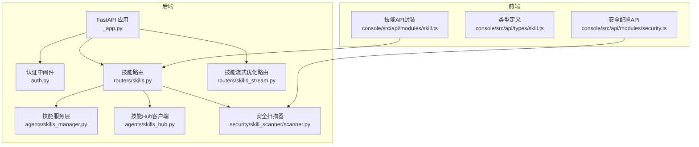
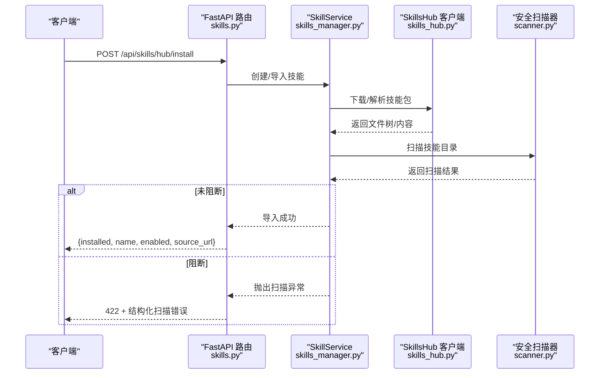
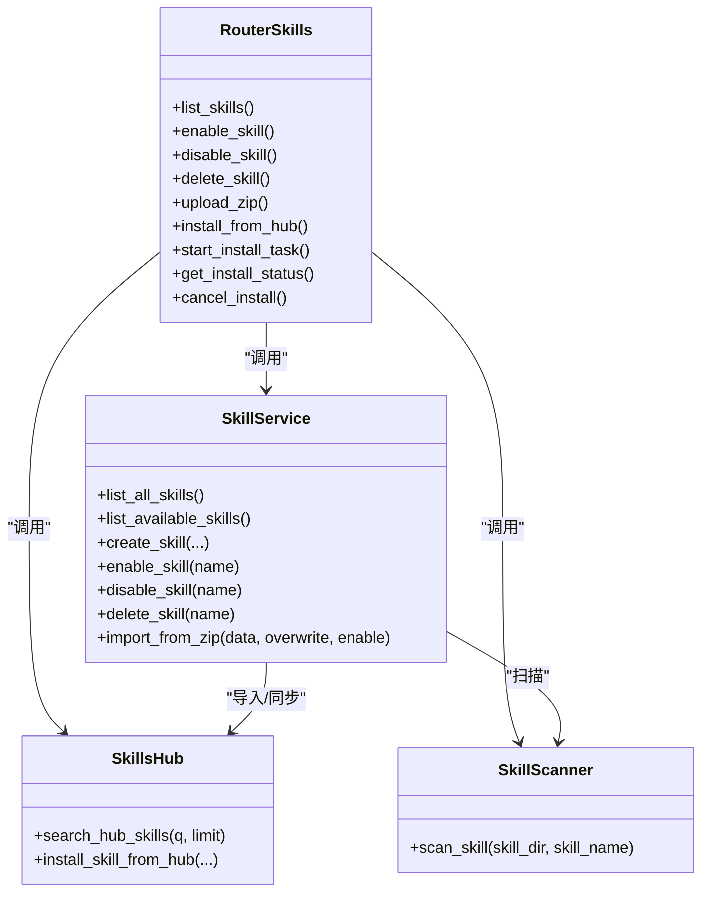

# 技能管理API

<cite>
**本文引用的文件列表**
- [skills.py](file://src/copaw/app/routers/skills.py)
- [skills_stream.py](file://src/copaw/app/routers/skills_stream.py)
- [skills_manager.py](file://src/copaw/agents/skills_manager.py)
- [skills_hub.py](file://src/copaw/agents/skills_hub.py)
- [scanner.py](file://src/copaw/security/skill_scanner/scanner.py)
- [auth.py](file://src/copaw/app/auth.py)
- [_app.py](file://src/copaw/app/_app.py)
- [skill.ts](file://console/src/api/modules/skill.ts)
- [skill.ts](file://console/src/api/types/skill.ts)
- [security.ts](file://console/src/api/modules/security.ts)
</cite>

## 目录
1. [简介](#简介)
2. [项目结构](#项目结构)
3. [核心组件](#核心组件)
4. [架构总览](#架构总览)
5. [详细组件分析](#详细组件分析)
6. [依赖关系分析](#依赖关系分析)
7. [性能与并发特性](#性能与并发特性)
8. [故障排查指南](#故障排查指南)
9. [结论](#结论)
10. [附录：API参考与示例](#附录api参考与示例)

## 简介
本文件为CoPaw技能管理API的完整接口文档，覆盖技能的CRUD操作、安装/卸载、启用/禁用、状态查询、批量操作、版本管理、上传导入、以及基于SSE的AI技能优化流式接口。文档同时阐述了安全扫描、权限控制、速率限制与错误处理策略，并提供curl示例与常见问题排查建议，帮助开发者与运维人员快速集成与稳定运行。

## 项目结构
技能管理API位于后端FastAPI应用中，核心路由集中在“/api/skills”前缀下；前端通过console模块封装了常用API调用与SSE流式优化能力。

图表来源
- [_app.py:243-344](file://src/copaw/app/_app.py#L243-L344)
- [auth.py:339-404](file://src/copaw/app/auth.py#L339-L404)
- [skills.py:119-120](file://src/copaw/app/routers/skills.py#L119-L120)
- [skills_stream.py:124-125](file://src/copaw/app/routers/skills_stream.py#L124-L125)
- [skills_manager.py:654-800](file://src/copaw/agents/skills_manager.py#L654-L800)
- [skills_hub.py:1-120](file://src/copaw/agents/skills_hub.py#L1-L120)
- [scanner.py:76-319](file://src/copaw/security/skill_scanner/scanner.py#L76-L319)
- [skill.ts:15-226](file://console/src/api/modules/skill.ts#L15-L226)
- [skill.ts:1-30](file://console/src/api/types/skill.ts#L1-L30)
- [security.ts:101-148](file://console/src/api/modules/security.ts#L101-L148)

章节来源
- [_app.py:243-344](file://src/copaw/app/_app.py#L243-L344)
- [skills.py:119-120](file://src/copaw/app/routers/skills.py#L119-L120)
- [skills_stream.py:124-125](file://src/copaw/app/routers/skills_stream.py#L124-L125)

## 核心组件
- 技能路由与控制器：提供技能列表、启用/禁用、删除、上传ZIP、Hub安装、批量操作、文件读取等REST接口。
- 技能服务层：封装技能目录同步、读写、校验、导入、版本比较等业务逻辑。
- 技能Hub客户端：支持从ClawHub等源拉取技能包，含重试、超时、取消、限流与安全校验。
- 安全扫描器：对技能目录进行多分析器扫描，支持白名单、缓存、超时与阻断策略。
- 认证中间件：统一鉴权、Token校验、CORS与静态资源放行策略。
- 前端API封装：提供列表、创建、启用/禁用、批量启用、Hub搜索/安装、SSE优化流等方法。

章节来源
- [skills.py:122-753](file://src/copaw/app/routers/skills.py#L122-L753)
- [skills_manager.py:654-800](file://src/copaw/agents/skills_manager.py#L654-L800)
- [skills_hub.py:1-120](file://src/copaw/agents/skills_hub.py#L1-L120)
- [scanner.py:76-319](file://src/copaw/security/skill_scanner/scanner.py#L76-L319)
- [auth.py:339-404](file://src/copaw/app/auth.py#L339-L404)
- [skill.ts:15-226](file://console/src/api/modules/skill.ts#L15-L226)

## 架构总览
技能管理API采用分层架构：
- 表现层：FastAPI路由与Pydantic模型定义请求/响应结构。
- 业务层：SkillService封装技能生命周期管理与目录同步。
- 集成层：SkillsHub客户端对接外部Hub，执行下载、解压、校验与导入。
- 安全层：安全扫描器在启用/导入阶段进行扫描并可阻断高危技能。
- 传输层：SSE流式接口用于AI优化技能内容的增量输出。

图表来源
- [skills.py:344-388](file://src/copaw/app/routers/skills.py#L344-L388)
- [skills_manager.py:654-800](file://src/copaw/agents/skills_manager.py#L654-L800)
- [skills_hub.py:1-120](file://src/copaw/agents/skills_hub.py#L1-L120)
- [scanner.py:148-242](file://src/copaw/security/skill_scanner/scanner.py#L148-L242)

## 详细组件分析

### 技能CRUD与状态管理
- 列表与可用技能
  - GET /api/skills：列出所有技能（内置+自定义），附加enabled状态。
  - GET /api/skills/available：仅列出已启用的可用技能。
- 启用/禁用
  - POST /api/skills/{skill_name}/enable：启用技能，触发安全扫描与热重载。
  - POST /api/skills/{skill_name}/disable：禁用技能，移除active_skills对应目录。
- 删除
  - DELETE /api/skills/{skill_name}：删除自定义技能（不可删除内置技能）。
- 创建
  - POST /api/skills：创建自定义技能，支持references/scripts树形结构。
- 文件读取
  - GET /api/skills/{skill_name}/files/{source}/{file_path:path}：读取技能内文件内容（builtin/customized）。

章节来源
- [skills.py:122-193](file://src/copaw/app/routers/skills.py#L122-L193)
- [skills.py:591-753](file://src/copaw/app/routers/skills.py#L591-L753)
- [skills_manager.py:676-724](file://src/copaw/agents/skills_manager.py#L676-L724)

### 批量操作
- POST /api/skills/batch-enable：批量启用技能，遇到阻断项返回422并包含被阻断列表。
- POST /api/skills/batch-disable：批量禁用技能。

章节来源
- [skills.py:517-566](file://src/copaw/app/routers/skills.py#L517-L566)

### 技能上传与版本管理
- ZIP上传
  - POST /api/skills/upload：上传zip文件导入技能，支持enable/overwrite参数。
- Hub安装与任务流
  - POST /api/skills/hub/install：立即安装，返回安装结果或错误。
  - POST /api/skills/hub/install/start：启动异步安装任务，返回任务对象。
  - GET /api/skills/hub/install/status/{task_id}：查询任务状态。
  - POST /api/skills/hub/install/cancel/{task_id}：取消任务。
- Hub搜索
  - GET /api/skills/hub/search?q=&limit=：按关键词搜索Hub技能。

章节来源
- [skills.py:391-453](file://src/copaw/app/routers/skills.py#L391-L453)
- [skills.py:463-514](file://src/copaw/app/routers/skills.py#L463-L514)
- [skills.py:196-211](file://src/copaw/app/routers/skills.py#L196-L211)

### 技能流式安装与任务状态
- 异步安装流程
  - 客户端先POST /api/skills/hub/install/start获取task_id。
  - 循环GET /api/skills/hub/install/status/{task_id}轮询状态。
  - 可在任意时刻POST /api/skills/hub/install/cancel/{task_id}取消。
- 任务状态枚举
  - pending/importing/completed/failed/cancelled。
- 取消机制
  - 通过线程Event与上下文变量传递取消信号，清理临时导入产物。

章节来源
- [skills.py:391-453](file://src/copaw/app/routers/skills.py#L391-L453)
- [skills.py:214-342](file://src/copaw/app/routers/skills.py#L214-L342)
- [skills_hub.py:29-120](file://src/copaw/agents/skills_hub.py#L29-L120)

### 技能版本管理与回滚
- 内置技能版本
  - 通过SKILL.md中的metadata.builtin_skill_version进行版本识别。
- 自动同步策略
  - 将自定义覆盖内置，若内置版本更高则回滚至最新版本。
- 导入ZIP时的版本处理
  - 依据导入内容自动推断名称与内容，支持额外文件树写入。

章节来源
- [skills_manager.py:169-208](file://src/copaw/agents/skills_manager.py#L169-L208)
- [skills_manager.py:210-287](file://src/copaw/agents/skills_manager.py#L210-L287)
- [skills_manager.py:290-368](file://src/copaw/agents/skills_manager.py#L290-L368)

### 安全扫描与白名单
- 扫描触发点
  - 启用技能前对源目录进行扫描；上传ZIP与Hub安装同样触发扫描。
- 阻断策略
  - 当扫描结果达到阻断阈值时抛出SkillScanError，返回422并携带findings详情。
- 白名单与历史记录
  - 支持添加/移除白名单条目，查看阻断历史与清理。
- 缓存与超时
  - 对同一目录的扫描结果进行缓存，避免重复扫描；支持超时控制。

章节来源
- [skills.py:661-674](file://src/copaw/app/routers/skills.py#L661-L674)
- [scanner.py:415-504](file://src/copaw/security/skill_scanner/scanner.py#L415-L504)
- [security.ts:101-148](file://console/src/api/modules/security.ts#L101-L148)

### AI技能优化流式接口（SSE）
- 接口
  - POST /api/skills/ai/optimize/stream：接收当前技能内容与语言偏好，返回SSE流。
- 流式输出
  - data: {"text": "..."} 增量文本片段；data: {"done": true} 结束标志。
- 前端使用
  - console/src/api/modules/skill.ts提供streamOptimizeSkill方法，支持AbortSignal中断。

章节来源
- [skills_stream.py:166-244](file://src/copaw/app/routers/skills_stream.py#L166-L244)
- [skill.ts:127-189](file://console/src/api/modules/skill.ts#L127-L189)

### 权限控制与安全策略
- 认证中间件
  - 仅保护/api/路径，允许本地回环地址免认证；支持Bearer Token校验。
- CORS
  - 可通过环境变量配置允许的源，支持凭证与头暴露。
- 速率限制
  - Hub访问具备可配置的超时、重试次数与指数退避；HTTP状态码429/5xx自动重试。
- 上传限制
  - 限定zip类型与最大大小（默认100MB），防止过大文件导致资源耗尽。

章节来源
- [auth.py:339-404](file://src/copaw/app/auth.py#L339-L404)
- [_app.py:255-265](file://src/copaw/app/_app.py#L255-L265)
- [skills.py:455-461](file://src/copaw/app/routers/skills.py#L455-L461)
- [skills.py:463-514](file://src/copaw/app/routers/skills.py#L463-L514)
- [skills_hub.py:70-106](file://src/copaw/agents/skills_hub.py#L70-L106)

## 依赖关系分析

图表来源
- [skills.py:119-120](file://src/copaw/app/routers/skills.py#L119-L120)
- [skills_manager.py:654-800](file://src/copaw/agents/skills_manager.py#L654-L800)
- [skills_hub.py:1-120](file://src/copaw/agents/skills_hub.py#L1-L120)
- [scanner.py:148-242](file://src/copaw/security/skill_scanner/scanner.py#L148-L242)

## 性能与并发特性
- 异步安装任务
  - 使用asyncio.Task与锁保证任务状态一致性，避免竞态。
- 线程池与I/O
  - ZIP解压与Hub下载在独立线程执行，避免阻塞事件循环。
- 扫描缓存
  - 基于目录修改时间的LRU缓存，减少重复扫描开销。
- SSE流式优化
  - 逐块推送增量文本，降低前端等待时间与内存占用。

章节来源
- [skills.py:264-342](file://src/copaw/app/routers/skills.py#L264-L342)
- [scanner.py:347-380](file://src/copaw/security/skill_scanner/scanner.py#L347-L380)
- [skills_stream.py:177-226](file://src/copaw/app/routers/skills_stream.py#L177-L226)

## 故障排查指南
- 422 安全扫描失败
  - 检查返回的findings字段，定位高危规则与文件位置；必要时加入白名单或修复内容。
- 400 参数错误
  - Hub URL无效、ZIP过大、内容类型不匹配等；核对请求体与文件类型。
- 502/504 Hub上游错误
  - 可能是网络超时或上游服务不可用；检查GITHUB_TOKEN与网络连通性。
- 404 任务不存在
  - 任务ID错误或已过期；确认task_id正确且未被清理。
- 401 未认证
  - 确认Bearer Token有效或本地回环免认证策略是否生效。

章节来源
- [skills.py:28-50](file://src/copaw/app/routers/skills.py#L28-L50)
- [skills.py:362-382](file://src/copaw/app/routers/skills.py#L362-L382)
- [skills.py:424-452](file://src/copaw/app/routers/skills.py#L424-L452)
- [auth.py:352-370](file://src/copaw/app/auth.py#L352-L370)

## 结论
CoPaw技能管理API提供了完善的技能生命周期管理能力，结合安全扫描与Hub生态，既满足灵活扩展，又保障运行安全。通过SSE流式优化与异步任务机制，提升了用户体验与系统吞吐。建议在生产环境中开启认证与CORS白名单，合理配置扫描策略与Hub超时重试参数，并对高频批量操作进行节流控制。

## 附录：API参考与示例

### 基础信息
- 基础URL：/api
- 认证方式：Bearer Token（需启用认证）
- CORS：可通过环境变量配置允许的源

章节来源
- [_app.py:255-265](file://src/copaw/app/_app.py#L255-L265)
- [auth.py:398-404](file://src/copaw/app/auth.py#L398-L404)

### 技能CRUD与状态
- 列出技能
  - 方法：GET
  - 路径：/api/skills
  - 响应：数组，元素包含name、description、content、source、path、enabled
- 列出可用技能
  - 方法：GET
  - 路径：/api/skills/available
  - 响应：数组，元素enabled恒为true
- 启用技能
  - 方法：POST
  - 路径：/api/skills/{skill_name}/enable
  - 响应：{"enabled": true}
- 禁用技能
  - 方法：POST
  - 路径：/api/skills/{skill_name}/disable
  - 响应：{"disabled": true/false}
- 删除技能
  - 方法：DELETE
  - 路径：/api/skills/{skill_name}
  - 响应：{"deleted": true/false}
- 创建技能
  - 方法：POST
  - 路径：/api/skills
  - 请求体：name、content、references（可选）、scripts（可选）
  - 响应：{"created": true}
- 读取技能文件
  - 方法：GET
  - 路径：/api/skills/{skill_name}/files/{source}/{file_path:path}
  - 响应：{"content": string|null}

章节来源
- [skills.py:122-193](file://src/copaw/app/routers/skills.py#L122-L193)
- [skills.py:591-753](file://src/copaw/app/routers/skills.py#L591-L753)
- [skill.ts:16-46](file://console/src/api/modules/skill.ts#L16-L46)

### 批量操作
- 批量启用
  - 方法：POST
  - 路径：/api/skills/batch-enable
  - 请求体：字符串数组（技能名）
  - 响应：成功无内容；部分阻断返回422并包含blocked_skills列表
- 批量禁用
  - 方法：POST
  - 路径：/api/skills/batch-disable
  - 请求体：字符串数组（技能名）

章节来源
- [skills.py:517-566](file://src/copaw/app/routers/skills.py#L517-L566)

### 技能上传与Hub安装
- 上传ZIP
  - 方法：POST
  - 路径：/api/skills/upload?enable=false&overwrite=false
  - 上传：multipart/form-data，file字段
  - 响应：导入结果（数组/计数/是否启用）
- Hub安装（同步）
  - 方法：POST
  - 路径：/api/skills/hub/install
  - 请求体：bundle_url、version（可选）、enable（可选）、overwrite（可选）
  - 响应：{installed, name, enabled, source_url}
- Hub安装（异步）
  - 启动任务：POST /api/skills/hub/install/start → 返回任务对象
  - 查询状态：GET /api/skills/hub/install/status/{task_id}
  - 取消任务：POST /api/skills/hub/install/cancel/{task_id}
- Hub搜索
  - 方法：GET
  - 路径：/api/skills/hub/search?q=&limit=

章节来源
- [skills.py:391-453](file://src/copaw/app/routers/skills.py#L391-L453)
- [skills.py:463-514](file://src/copaw/app/routers/skills.py#L463-L514)
- [skills.py:196-211](file://src/copaw/app/routers/skills.py#L196-L211)

### 安全扫描与白名单
- 获取/更新技能扫描配置
  - GET/PUT /api/config/security/skill-scanner
- 查看阻断历史与清理
  - GET /api/config/security/skill-scanner/blocked-history
  - DELETE /api/config/security/skill-scanner/blocked-history
  - DELETE /api/config/security/skill-scanner/blocked-history/{index}
- 添加/移除白名单
  - POST /api/config/security/skill-scanner/whitelist
  - DELETE /api/config/security/skill-scanner/whitelist/{skill_name}

章节来源
- [security.ts:101-148](file://console/src/api/modules/security.ts#L101-L148)

### AI技能优化流式接口（SSE）
- POST /api/skills/ai/optimize/stream
  - 请求体：{content: string, language: "en"/"zh"/"ru"}
  - 响应：SSE流，data: {"text": "..."} 增量输出，最后data: {"done": true}

章节来源
- [skills_stream.py:166-244](file://src/copaw/app/routers/skills_stream.py#L166-L244)
- [skill.ts:127-189](file://console/src/api/modules/skill.ts#L127-L189)

### curl示例
- 列出技能
  - curl -H "Authorization: Bearer $TOKEN" https://host/api/skills
- 启用技能
  - curl -X POST -H "Authorization: Bearer $TOKEN" https://host/api/skills/my_skill/enable
- 上传ZIP
  - curl -X POST -H "Authorization: Bearer $TOKEN" -F "file=@skill.zip;type=application/zip" https://host/api/skills/upload?enable=true
- Hub安装（异步）
  - curl -X POST -H "Authorization: Bearer $TOKEN" -H "Content-Type: application/json" -d '{"bundle_url":"https://...","enable":true}' https://host/api/skills/hub/install/start
  - curl https://host/api/skills/hub/install/status/{task_id}
  - curl -X POST -H "Authorization: Bearer $TOKEN" https://host/api/skills/hub/install/cancel/{task_id}
- SSE优化
  - curl -N -H "Authorization: Bearer $TOKEN" -H "Content-Type: application/json" -d '{"content":"...","language":"en"}' https://host/api/skills/ai/optimize/stream

章节来源
- [skills.py:122-193](file://src/copaw/app/routers/skills.py#L122-L193)
- [skills.py:391-453](file://src/copaw/app/routers/skills.py#L391-L453)
- [skills_stream.py:166-244](file://src/copaw/app/routers/skills_stream.py#L166-L244)
- [skill.ts:16-226](file://console/src/api/modules/skill.ts#L16-L226)