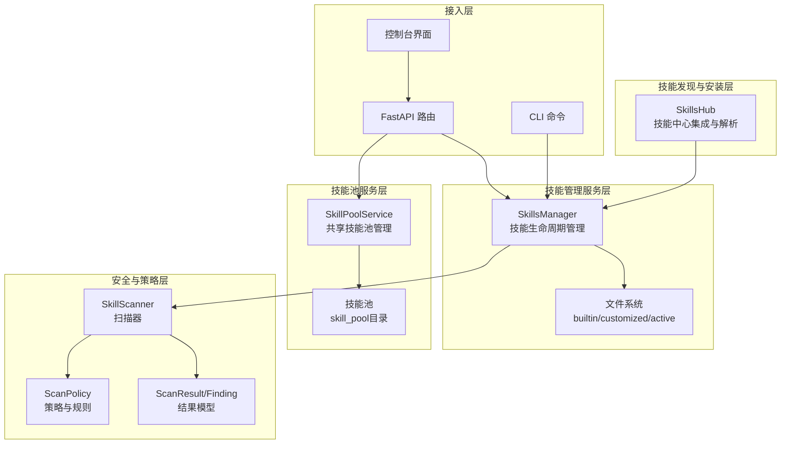
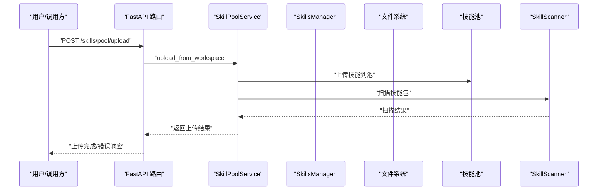
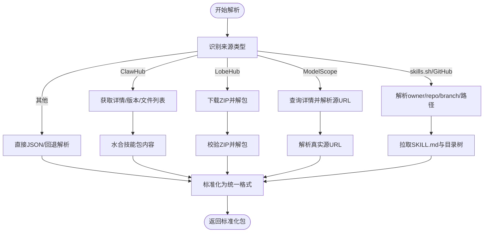
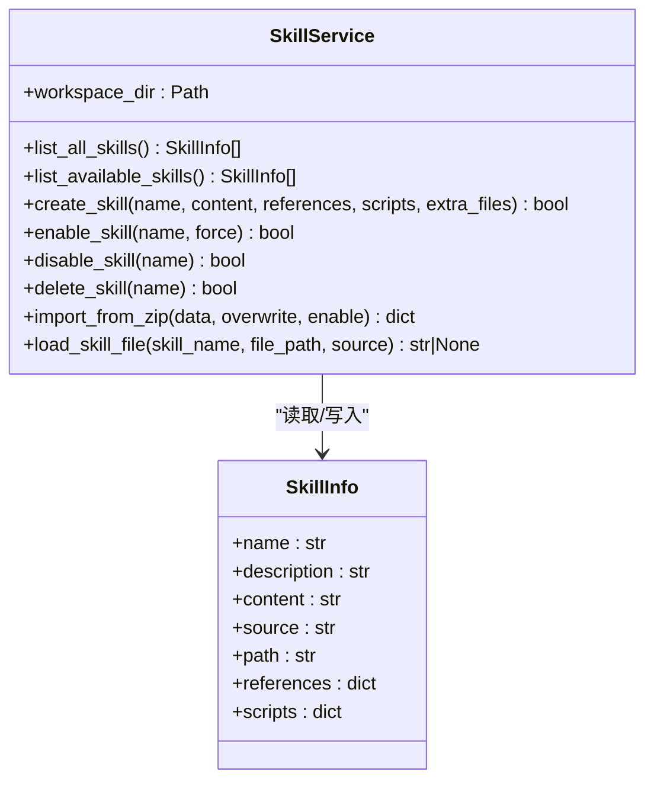
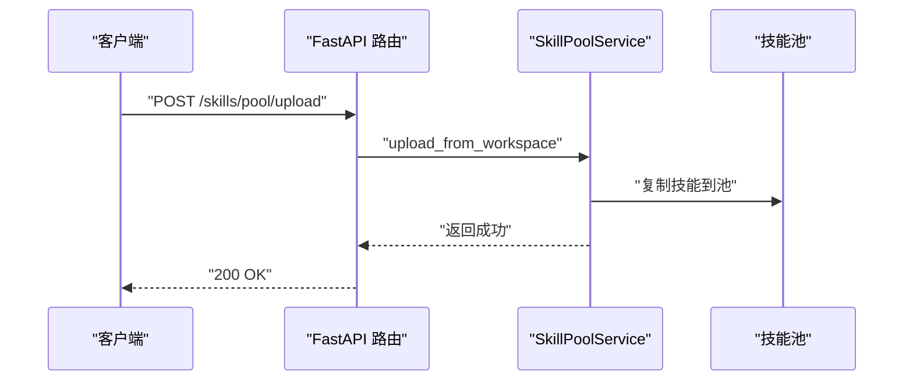
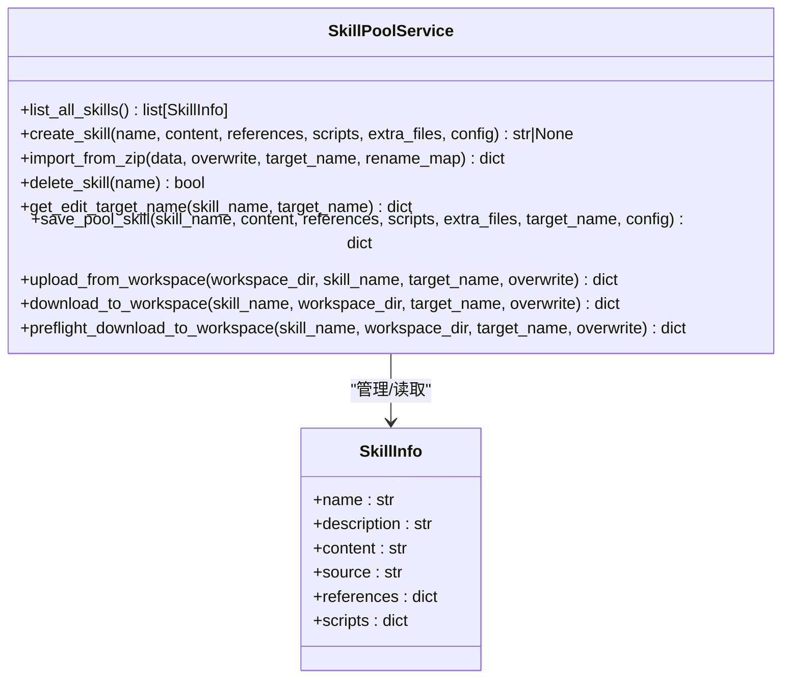
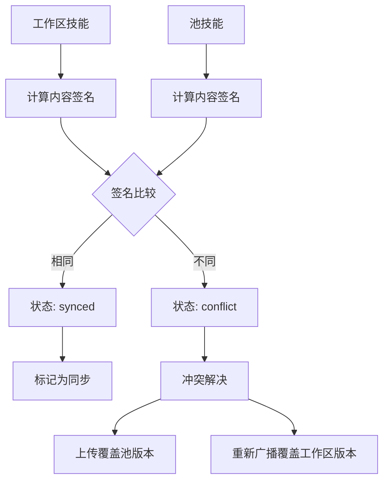
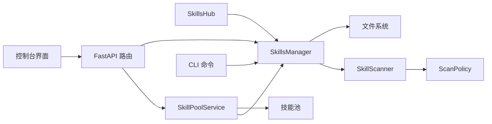

# 技能系统架构

<cite>
**本文引用的文件**
- [skills_hub.py](file://src/copaw/agents/skills_hub.py)
- [skills_manager.py](file://src/copaw/agents/skills_manager.py)
- [skills.py](file://src/copaw/app/routers/skills.py)
- [scanner.py](file://src/copaw/security/skill_scanner/scanner.py)
- [models.py](file://src/copaw/security/skill_scanner/models.py)
- [scan_policy.py](file://src/copaw/security/skill_scanner/scan_policy.py)
- [default_policy.yaml](file://src/copaw/security/skill_scanner/data/default_policy.yaml)
- [skills_cmd.py](file://src/copaw/cli/skills_cmd.py)
- [copaw_source_index/SKILL.md](file://src/copaw/agents/skills/copaw_source_index/SKILL.md)
- [pdf/SKILL.md](file://src/copaw/agents/skills/pdf/SKILL.md)
- [SkillPool/index.tsx](file://console/src/pages/Agent/SkillPool/index.tsx)
- [SkillCard.tsx](file://console/src/pages/Agent/Skills/components/SkillCard.tsx)
- [BroadcastModal.tsx](file://console/src/pages/Agent/SkillPool/components/BroadcastModal.tsx)
- [security.ts](file://console/src/api/modules/security.ts)
- [skill.ts](file://console/src/api/types/skill.ts)
- [skills.en.md](file://website/public/docs/skills.en.md)
- [skills.zh.md](file://website/public/docs/skills.zh.md)
</cite>

## 更新摘要
**所做更改**
- 新增技能池系统架构与管理机制
- 增强技能管理API，支持池间同步与批量操作
- 更新技能同步状态跟踪与冲突处理机制
- 新增技能池配置管理与版本控制功能
- 扩展技能广播与下载机制

## 目录
1. [引言](#引言)
2. [项目结构](#项目结构)
3. [核心组件](#核心组件)
4. [架构总览](#架构总览)
5. [详细组件分析](#详细组件分析)
6. [技能池系统](#技能池系统)
7. [依赖关系分析](#依赖关系分析)
8. [性能考虑](#性能考虑)
9. [故障排查指南](#故障排查指南)
10. [结论](#结论)
11. [附录](#附录)

## 引言
本技术文档面向CoPaw技能系统，围绕技能中心集成机制、技能搜索与安装流程、技能管理API设计、自定义技能开发规范等核心功能进行系统化阐述。重点覆盖以下方面：
- SkillsHub类的技能发现机制与多来源解析能力
- SkillsManager的技能生命周期管理（创建、启用、禁用、删除、导入）
- **新增**：SkillPoolService的技能池管理系统，支持共享技能复用与版本控制
- 技能配置文件格式（SKILL.md）与目录结构约定
- 技能依赖关系处理与版本控制
- 技能沙箱隔离机制、权限控制策略与安全扫描
- 性能监控与可观测性
- 开发者指南：模板、调试工具与最佳实践

## 项目结构
技能系统由四层构成：
- 技能发现与安装层：SkillsHub负责从多源（ClawHub、LobeHub、ModelScope、skills.sh、GitHub等）解析并下载技能包
- 技能管理服务层：SkillsManager负责技能的创建、启用/禁用、删除、导入ZIP、文件读取等生命周期管理
- **新增**：技能池服务层：SkillPoolService管理共享技能池，支持技能上传、下载、同步与版本控制
- 安全与策略层：SkillScanner与ScanPolicy提供规则引擎、策略定制与扫描结果模型
- API与CLI接入层：FastAPI路由提供REST接口，CLI提供交互式配置

**图表来源**
- [skills_hub.py:1-1619](file://src/copaw/agents/skills_hub.py#L1-L1619)
- [skills_manager.py:1990-2523](file://src/copaw/agents/skills_manager.py#L1990-L2523)
- [skills.py:1-1279](file://src/copaw/app/routers/skills.py#L1-L1279)

## 核心组件
- SkillsHub：统一的技能中心集成客户端，支持ClawHub、LobeHub、ModelScope、skills.sh、GitHub等多种来源，负责技能包解析、标准化与下载
- SkillsManager：技能生命周期管理的核心服务，提供技能创建、启用/禁用、删除、ZIP导入、文件读取等能力
- **新增**：SkillPoolService：共享技能池管理服务，提供技能上传、下载、同步、版本控制等功能
- SkillScanner：安全扫描器，基于策略与规则集对技能包进行静态分析
- ScanPolicy：组织级扫描策略，支持规则范围、凭证白名单、文件分类、阈值与严重级别覆盖
- FastAPI路由与CLI：对外提供REST接口与交互式命令行配置
- **新增**：控制台界面：提供技能池管理、技能广播、批量操作等功能

**章节来源**
- [skills_hub.py:1513-1536](file://src/copaw/agents/skills_hub.py#L1513-L1536)
- [skills_manager.py:654-724](file://src/copaw/agents/skills_manager.py#L654-L724)
- [skills_manager.py:1990-2523](file://src/copaw/agents/skills_manager.py#L1990-L2523)
- [scanner.py:76-242](file://src/copaw/security/skill_scanner/scanner.py#L76-L242)
- [scan_policy.py:156-397](file://src/copaw/security/skill_scanner/scan_policy.py#L156-L397)
- [skills.py:119-161](file://src/copaw/app/routers/skills.py#L119-L161)
- [skills_cmd.py:29-124](file://src/copaw/cli/skills_cmd.py#L29-L124)

## 架构总览
技能系统采用"发现-管理-池化-安全"分层架构，通过统一的技能包格式（SKILL.md + references/scripts）实现跨来源兼容与可移植性，新增技能池层支持团队协作与技能复用。

**图表来源**
- [skills.py:819-836](file://src/copaw/app/routers/skills.py#L819-L836)
- [skills_manager.py:2334-2415](file://src/copaw/agents/skills_manager.py#L2334-L2415)

## 详细组件分析

### SkillsHub：技能发现与安装
- 支持来源解析：ClawHub、LobeHub、ModelScope、skills.sh、GitHub、直接JSON等
- 统一包格式标准化：将不同来源的技能包转换为统一的{name, content, references, scripts, extra_files}
- 取消与重试机制：支持取消检查上下文、指数退避与可配置超时/重试
- 安全限制：ZIP大小、条目数量、路径规范化与symlink检测

**图表来源**
- [skills_hub.py:1539-1563](file://src/copaw/agents/skills_hub.py#L1539-L1563)
- [skills_hub.py:1480-1510](file://src/copaw/agents/skills_hub.py#L1480-L1510)
- [skills_hub.py:1450-1476](file://src/copaw/agents/skills_hub.py#L1450-L1476)
- [skills_hub.py:1370-1447](file://src/copaw/agents/skills_hub.py#L1370-L1447)
- [skills_hub.py:1057-1155](file://src/copaw/agents/skills_hub.py#L1057-L1155)
- [skills_hub.py:804-879](file://src/copaw/agents/skills_hub.py#L804-L879)

**章节来源**
- [skills_hub.py:1-1619](file://src/copaw/agents/skills_hub.py#L1-L1619)

### SkillsManager：技能生命周期管理
- 技能目录结构：builtin（内置）、customized（自定义）、active（已启用）
- 核心能力：
  - 创建技能：校验SKILL.md YAML Front Matter，生成references/scripts树
  - 启用/禁用：将技能复制到active_skills或移除，触发热重载
  - 删除：仅删除customized下的技能
  - ZIP导入：校验与解包，自动扫描，可选启用
  - 文件读取：安全读取references/scripts中的文件
- 版本与升级：内置技能版本号（metadata.builtin_skill_version）用于比较与升级提示

**图表来源**
- [skills_manager.py:654-1233](file://src/copaw/agents/skills_manager.py#L654-L1233)

**章节来源**
- [skills_manager.py:1-1233](file://src/copaw/agents/skills_manager.py#L1-L1233)

### 技能配置文件格式与目录约定
- SKILL.md：必需，包含YAML Front Matter（name、description），metadata可包含builtin_skill_version等
- references/：文档与辅助资源
- scripts/：可执行脚本与工具
- 示例参考：
  - copaw_source_index：官方文档与源码索导航
  - pdf：PDF处理技能指南与示例

**章节来源**
- [copaw_source_index/SKILL.md:1-55](file://src/copaw/agents/skills/copaw_source_index/SKILL.md#L1-L55)
- [pdf/SKILL.md:1-329](file://src/copaw/agents/skills/pdf/SKILL.md#L1-L329)

### 技能依赖关系处理
- 内置技能版本控制：通过metadata.builtin_skill_version比较，支持从builtin向active同步升级
- 自定义覆盖：customized同名技能优先于builtin
- 依赖声明：metadata.copaw.requires用于声明依赖（示例中为占位）

**章节来源**
- [skills_manager.py:169-188](file://src/copaw/agents/skills_manager.py#L169-L188)
- [copaw_source_index/SKILL.md:4-12](file://src/copaw/agents/skills/copaw_source_index/SKILL.md#L4-L12)

### 技能管理API设计
- 列出技能：GET /skills、GET /skills/available
- 启用/禁用：POST /skills/{skill_name}/enable、POST /skills/{skill_name}/disable
- 批量操作：POST /skills/batch-enable、POST /skills/batch-disable
- 创建技能：POST /skills
- ZIP上传：POST /skills/upload
- Hub安装：POST /skills/hub/install、POST /skills/hub/install/start、GET /skills/hub/install/status/{task_id}、POST /skills/hub/install/cancel/{task_id}
- 文件读取：GET /skills/{skill_name}/files/{source}/{file_path}
- **新增**：技能池操作：
  - 列出技能池：GET /skills/pool
  - 上传技能到池：POST /skills/pool/upload
  - 从池下载到工作区：POST /skills/pool/download
  - 导入内置技能到池：POST /skills/pool/import-builtin
  - 更新池内置技能：POST /skills/pool/{skill_name}/update-builtin
  - 删除池技能：DELETE /skills/pool/{skill_name}
  - 获取池技能配置：GET /skills/pool/{skill_name}/config
  - 更新池技能配置：PUT /skills/pool/{skill_name}/config
  - 删除池技能配置：DELETE /skills/pool/{skill_name}/config

**图表来源**
- [skills.py:819-836](file://src/copaw/app/routers/skills.py#L819-L836)

**章节来源**
- [skills.py:119-1279](file://src/copaw/app/routers/skills.py#L119-L1279)

### CLI交互式技能配置
- 列出技能：copaw skills list
- 交互式选择：copaw skills config
- 工作空间解析：根据agent_id定位工作目录

**章节来源**
- [skills_cmd.py:127-182](file://src/copaw/cli/skills_cmd.py#L127-L182)
- [skills_cmd.py:29-124](file://src/copaw/cli/skills_cmd.py#L29-L124)

## 技能池系统

### SkillPoolService：共享技能池管理
SkillPoolService是技能池系统的核心服务，管理位于`WORKING_DIR/skill_pool`的共享技能池。该服务支持创建池原生技能、导入ZIP、同步打包内置技能、从工作区上传技能到池，以及将池技能下载回一个或多个工作区。

**图表来源**
- [skills_manager.py:1990-2523](file://src/copaw/agents/skills_manager.py#L1990-L2523)

### 技能池同步机制
技能池系统实现了智能的同步机制，通过内容签名（signature）来跟踪技能的同步状态：

- **synced**：工作区副本与池版本完全一致（内容哈希相同）
- **not_synced**：池中没有对应条目（通常是由本地创建的自定义技能）
- **conflict**：池和工作区都存在同名技能，但内容不同（通常是在广播到工作区后又在工作区中修改了）

**图表来源**
- [skills_manager.py:940-980](file://src/copaw/agents/skills_manager.py#L940-L980)

### 技能池配置管理
技能池支持为每个技能维护独立的配置（config），这些配置可以：
- 存储技能特定的参数和设置
- 支持版本控制和继承
- 在技能从池广播到工作区时传递给工作区技能

**章节来源**
- [skills_manager.py:1990-2523](file://src/copaw/agents/skills_manager.py#L1990-L2523)

### 控制台技能池界面
控制台提供了完整的技能池管理界面，包括：
- 技能池浏览和搜索
- 技能创建和编辑
- 技能池内置技能导入
- 技能广播到多个工作区
- 冲突检测和解决
- 技能池配置管理

**章节来源**
- [SkillPool/index.tsx:1-200](file://console/src/pages/Agent/SkillPool/index.tsx#L1-L200)
- [SkillPool/index.tsx:72-734](file://console/src/pages/Agent/SkillPool/index.tsx#L72-L734)
- [SkillCard.tsx:128-209](file://console/src/pages/Agent/Skills/components/SkillCard.tsx#L128-L209)
- [BroadcastModal.tsx:1-52](file://console/src/pages/Agent/SkillPool/components/BroadcastModal.tsx#L1-L52)

## 依赖关系分析
- 技能发现依赖网络库与HTTP客户端，支持多种来源与重试/超时
- 技能管理依赖文件系统与安全扫描器
- **新增**：技能池管理依赖技能签名算法和并发控制
- 安全扫描依赖策略与规则集，支持策略覆盖与规则禁用
- API与CLI均依赖SkillsManager与SkillsHub
- **新增**：控制台界面依赖API模块和类型定义

**图表来源**
- [skills_hub.py:1-1619](file://src/copaw/agents/skills_hub.py#L1-L1619)
- [skills_manager.py:1-1233](file://src/copaw/agents/skills_manager.py#L1-L1233)
- [skills_manager.py:1990-2523](file://src/copaw/agents/skills_manager.py#L1990-L2523)
- [scanner.py:1-319](file://src/copaw/security/skill_scanner/scanner.py#L1-L319)
- [scan_policy.py:1-476](file://src/copaw/security/skill_scanner/scan_policy.py#L1-L476)
- [skills.py:1-1279](file://src/copaw/app/routers/skills.py#L1-L1279)
- [skills_cmd.py:1-182](file://src/copaw/cli/skills_cmd.py#L1-L182)

**章节来源**
- [skills_hub.py:1-1619](file://src/copaw/agents/skills_hub.py#L1-L1619)
- [skills_manager.py:1-1233](file://src/copaw/agents/skills_manager.py#L1-L1233)
- [skills_manager.py:1990-2523](file://src/copaw/agents/skills_manager.py#L1990-L2523)
- [scanner.py:1-319](file://src/copaw/security/skill_scanner/scanner.py#L1-L319)
- [scan_policy.py:1-476](file://src/copaw/security/skill_scanner/scan_policy.py#L1-L476)
- [skills.py:1-1279](file://src/copaw/app/routers/skills.py#L1-L1279)
- [skills_cmd.py:1-182](file://src/copaw/cli/skills_cmd.py#L1-L182)

## 性能考虑
- 扫描性能：默认策略限制文件数与单文件大小，避免大包扫描开销
- I/O优化：ZIP解包前进行大小与条目数量校验，防止过大包导致内存压力
- 并发与异步：Hub安装任务使用异步队列与锁，支持取消与状态跟踪
- 热重载：启用/禁用后触发后台重载，避免阻塞请求
- **新增**：技能池同步：使用内容签名进行快速比较，避免全量文件对比
- **新增**：批量操作：支持批量技能广播和批量配置更新，提高管理效率

**章节来源**
- [scanner.py:116-133](file://src/copaw/security/skill_scanner/scanner.py#L116-L133)
- [skills_manager.py:548-576](file://src/copaw/agents/skills_manager.py#L548-L576)
- [skills.py:424-452](file://src/copaw/app/routers/skills.py#L424-L452)

## 故障排查指南
- 安全扫描失败：API返回422并携带findings列表，按严重级别与规则ID定位问题
- Hub安装异常：检查bundle_url格式、来源可用性与网络状况；必要时设置GITHUB_TOKEN
- ZIP导入失败：确认ZIP结构合法、包含有效SKILL.md且未超过大小/条目限制
- 权限与路径：确保工作目录可写，避免路径穿越与symlink注入
- **新增**：技能池冲突：检查sync_to_pool状态，使用上传或广播解决冲突
- **新增**：技能池同步问题：检查内容签名差异，确认技能是否被修改

**章节来源**
- [skills.py:28-50](file://src/copaw/app/routers/skills.py#L28-L50)
- [skills_hub.py:226-335](file://src/copaw/agents/skills_hub.py#L226-L335)
- [skills_manager.py:1027-1112](file://src/copaw/agents/skills_manager.py#L1027-L1112)

## 结论
CoPaw技能系统通过SkillsHub实现多来源技能包的统一解析与标准化，借助SkillsManager提供完善的生命周期管理，并以SkillPoolService构建共享技能池实现团队协作与技能复用。新增的技能池系统通过智能同步机制和冲突检测，确保技能的一致性和可追溯性。该架构在保证易用性的同时，兼顾了安全性、可扩展性与性能表现，适合团队协作与生态扩展。

## 附录

### 技能安装、卸载、更新操作流程示例
- 安装（Hub）：POST /skills/hub/install（或异步start/cancel/status）
- 卸载：POST /skills/{name}/disable
- 更新：启用新版本内置技能或重新导入自定义技能
- **新增**：技能池操作：
  - 上传：POST /skills/pool/upload
  - 下载：POST /skills/pool/download
  - 删除：DELETE /skills/pool/{skill_name}
  - 广播：从技能池到工作区的同步过程

**章节来源**
- [skills.py:344-452](file://src/copaw/app/routers/skills.py#L344-L452)
- [skills_manager.py:920-967](file://src/copaw/agents/skills_manager.py#L920-L967)
- [skills.py:819-974](file://src/copaw/app/routers/skills.py#L819-L974)

### 技能开发模板与最佳实践
- 使用SKILL.md定义name与description，必要时添加metadata
- 将文档与资源放入references，可执行脚本放入scripts
- 避免硬编码敏感信息，遵循ScanPolicy中的凭证白名单
- 提供最小可运行示例与测试用例，便于扫描器验证
- **新增**：利用技能池进行团队协作，避免重复开发相同技能
- **新增**：合理使用技能池配置，实现技能的灵活部署和管理

**章节来源**
- [copaw_source_index/SKILL.md:1-55](file://src/copaw/agents/skills/copaw_source_index/SKILL.md#L1-L55)
- [pdf/SKILL.md:1-329](file://src/copaw/agents/skills/pdf/SKILL.md#L1-L329)
- [scan_policy.py:124-151](file://src/copaw/security/skill_scanner/scan_policy.py#L124-L151)

### 技能池使用指南
- **从池广播到工作区**：在技能池页面选择技能，点击广播，选择目标工作区
- **冲突处理**：当工作区技能与池技能内容不同时，系统会标记为conflict状态
- **版本管理**：内置技能支持版本更新，可通过update-builtin端点进行升级
- **批量操作**：支持批量广播、批量配置更新等操作，提高管理效率

**章节来源**
- [skills.en.md:98-133](file://website/public/docs/skills.en.md#L98-L133)
- [skills.zh.md:93-126](file://website/public/docs/skills.zh.md#L93-L126)
- [SkillPool/index.tsx:107-138](file://console/src/pages/Agent/SkillPool/index.tsx#L107-L138)