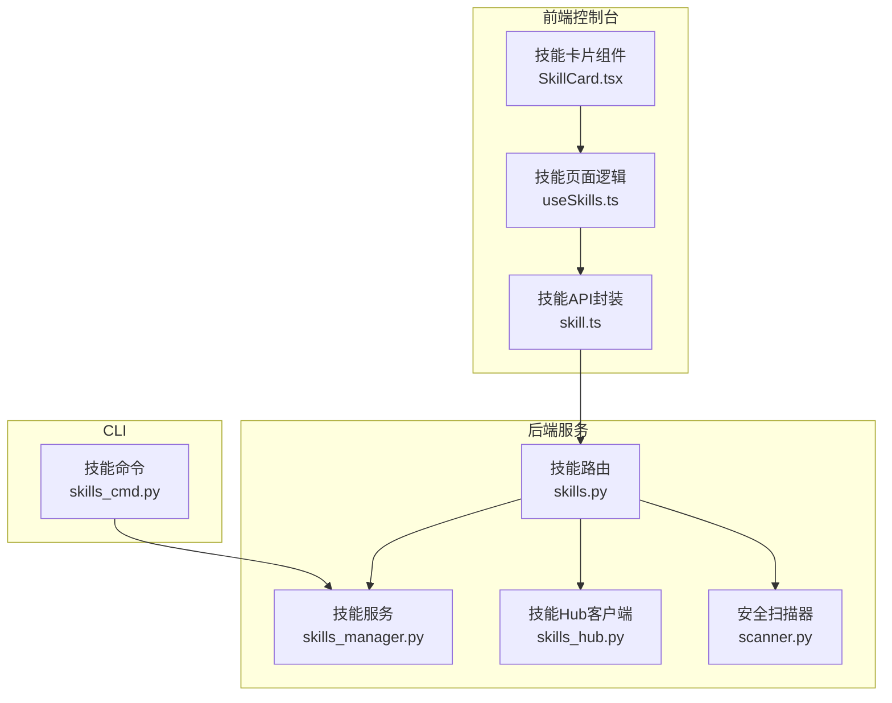
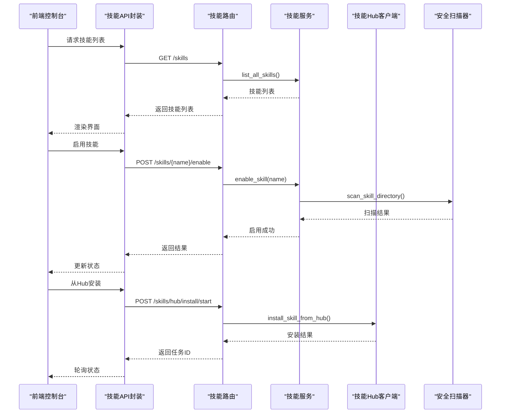
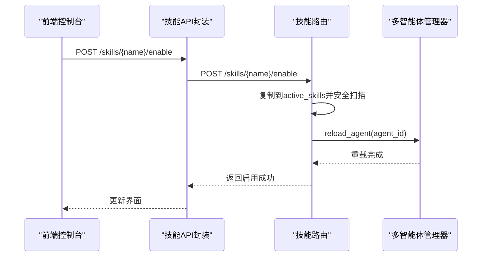
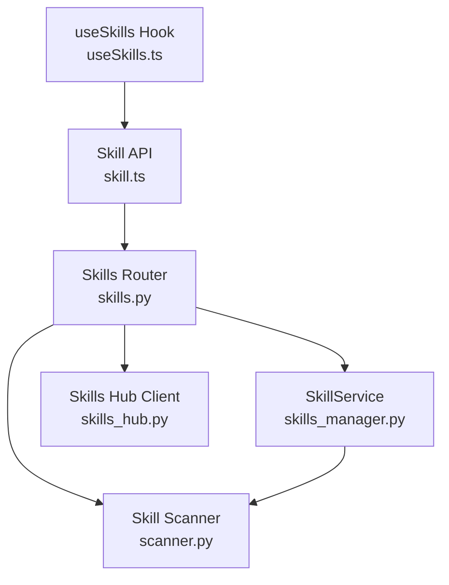

# 技能配置管理

<cite>
**本文引用的文件**
- [skills_manager.py](file://src/copaw/agents/skills_manager.py)
- [skills.py](file://src/copaw/app/routers/skills.py)
- [SKILL.md](file://src/copaw/agents/skills/copaw_source_index/SKILL.md)
- [SKILL.md](file://src/copaw/agents/skills/cron/SKILL.md)
- [SKILL.md](file://src/copaw/agents/skills/file_reader/SKILL.md)
- [SKILL.md](file://src/copaw/agents/skills/guidance/SKILL.md)
- [skills_hub.py](file://src/copaw/agents/skills_hub.py)
- [scanner.py](file://src/copaw/security/skill_scanner/scanner.py)
- [skill.ts](file://console/src/api/modules/skill.ts)
- [useSkills.ts](file://console/src/pages/Agent/Skills/useSkills.ts)
- [SkillCard.tsx](file://console/src/pages/Agent/Skills/components/SkillCard.tsx)
- [skills_cmd.py](file://src/copaw/cli/skills_cmd.py)
</cite>

## 目录
1. [简介](#简介)
2. [项目结构](#项目结构)
3. [核心组件](#核心组件)
4. [架构总览](#架构总览)
5. [详细组件分析](#详细组件分析)
6. [依赖关系分析](#依赖关系分析)
7. [性能考虑](#性能考虑)
8. [故障排除指南](#故障排除指南)
9. [结论](#结论)
10. [附录](#附录)

## 简介
本文件面向CoPaw技能配置管理模块，系统性阐述技能配置文件结构与格式（SKILL.md的frontmatter配置）、技能元数据管理、依赖关系处理与版本控制机制；详解技能配置的动态加载、热重载机制、配置验证与错误处理策略；说明技能启用/禁用状态管理、配置持久化存储、配置变更通知机制；并提供配置冲突解决策略、默认值处理与兼容性管理方案，以及配置安全性、访问控制与配置审计等管理功能。

## 项目结构
技能配置管理涉及后端Python服务、前端控制台与CLI三个层面：
- 后端Python服务负责技能文件解析、同步、启用/禁用、安全扫描与API路由；
- 前端控制台通过API进行技能列表、上传、从Hub导入、启用/禁用与删除等操作；
- CLI提供交互式技能配置与批量操作能力。

图表来源
- [skills_manager.py](file://src/copaw/agents/skills_manager.py)
- [skills.py](file://src/copaw/app/routers/skills.py)
- [skills_hub.py](file://src/copaw/agents/skills_hub.py)
- [scanner.py](file://src/copaw/security/skill_scanner/scanner.py)
- [skill.ts](file://console/src/api/modules/skill.ts)
- [useSkills.ts](file://console/src/pages/Agent/Skills/useSkills.ts)
- [SkillCard.tsx](file://console/src/pages/Agent/Skills/components/SkillCard.tsx)
- [skills_cmd.py](file://src/copaw/cli/skills_cmd.py)

章节来源
- [skills_manager.py](file://src/copaw/agents/skills_manager.py)
- [skills.py](file://src/copaw/app/routers/skills.py)
- [skills_hub.py](file://src/copaw/agents/skills_hub.py)
- [scanner.py](file://src/copaw/security/skill_scanner/scanner.py)
- [skill.ts](file://console/src/api/modules/skill.ts)
- [useSkills.ts](file://console/src/pages/Agent/Skills/useSkills.ts)
- [SkillCard.tsx](file://console/src/pages/Agent/Skills/components/SkillCard.tsx)
- [skills_cmd.py](file://src/copaw/cli/skills_cmd.py)

## 核心组件
- 技能服务（SkillService）：负责技能的读取、创建、导入、启用/禁用、删除与版本同步；提供目录树构建、文件校验与安全扫描集成。
- 技能路由（skills.py）：FastAPI路由层，提供技能列表、启用/禁用、批量操作、上传ZIP、从Hub安装、任务状态查询与取消等接口；集成安全扫描结果返回。
- 技能Hub客户端（skills_hub.py）：实现从外部Hub拉取技能包、解析与校验、下载文件、超时与重试策略、取消导入等。
- 安全扫描器（scanner.py）：对技能包进行文件发现、规则扫描与结果聚合，支持策略配置、跳过扩展名、最大文件数与大小限制。
- 前端API封装（skill.ts）：封装技能相关REST与SSE接口，包括Hub搜索、安装、状态轮询、取消、上传ZIP与AI优化流式输出。
- 前端页面逻辑（useSkills.ts）：管理技能列表、状态切换、上传与Hub导入流程、扫描错误弹窗与告警提示。
- CLI命令（skills_cmd.py）：提供交互式选择与批量启用/禁用技能的能力。

章节来源
- [skills_manager.py](file://src/copaw/agents/skills_manager.py)
- [skills.py](file://src/copaw/app/routers/skills.py)
- [skills_hub.py](file://src/copaw/agents/skills_hub.py)
- [scanner.py](file://src/copaw/security/skill_scanner/scanner.py)
- [skill.ts](file://console/src/api/modules/skill.ts)
- [useSkills.ts](file://console/src/pages/Agent/Skills/useSkills.ts)
- [skills_cmd.py](file://src/copaw/cli/skills_cmd.py)

## 架构总览
技能配置管理采用“后端服务 + 前端控制台 + CLI”的分层架构。后端通过SkillService统一管理技能生命周期，前端通过API进行可视化操作，CLI提供命令行便捷配置。安全扫描贯穿导入与启用阶段，确保技能包的安全性。

图表来源
- [skills.py](file://src/copaw/app/routers/skills.py)
- [skills_manager.py](file://src/copaw/agents/skills_manager.py)
- [skills_hub.py](file://src/copaw/agents/skills_hub.py)
- [scanner.py](file://src/copaw/security/skill_scanner/scanner.py)
- [skill.ts](file://console/src/api/modules/skill.ts)

## 详细组件分析

### 技能配置文件结构与格式（SKILL.md）
- 结构组成
  - YAML Front Matter：包含name、description与metadata字段。metadata中常包含builtin_skill_version与copaw元信息（如emoji、requires等）。
  - 正文内容：Markdown正文，描述技能用途、使用场景、决策规则、命令示例与注意事项。
- 元数据管理
  - builtin_skill_version：内置技能版本号，用于回退同步时的版本比较与升级提示。
  - copaw元信息：如emoji表情符标识、requires依赖声明等。
- 依赖关系
  - requires字段用于声明技能依赖，便于后续依赖解析与冲突检测。
- 版本控制
  - 通过builtin_skill_version进行内置技能版本比对，支持从active_skills回退到builtin_skills的升级逻辑。

章节来源
- [SKILL.md](file://src/copaw/agents/skills/copaw_source_index/SKILL.md)
- [SKILL.md](file://src/copaw/agents/skills/cron/SKILL.md)
- [SKILL.md](file://src/copaw/agents/skills/file_reader/SKILL.md)
- [SKILL.md](file://src/copaw/agents/skills/guidance/SKILL.md)
- [skills_manager.py](file://src/copaw/agents/skills_manager.py)

### 技能元数据模型与目录结构
- SkillInfo模型
  - 字段：name、description、content、source、path、references、scripts。
  - references/scripts采用嵌套字典表示目录树结构，文件为None，目录为嵌套字典。
- 目录约定
  - builtin_skills：内置技能目录，由代码库提供。
  - customized_skills：自定义技能目录，工作区内持久化保存。
  - active_skills：当前激活技能目录，运行时生效。
- 目录树构建
  - _build_directory_tree递归扫描目录，生成标准化树结构，便于序列化与传输。

章节来源
- [skills_manager.py](file://src/copaw/agents/skills_manager.py)

### 动态加载与热重载机制
- 动态加载
  - list_all_skills：从builtin_skills与customized_skills合并读取，自定义覆盖内置同名技能。
  - list_available_skills：读取active_skills目录，返回当前启用技能。
- 热重载
  - 启用/禁用技能后，通过后台异步任务触发多智能体管理器reload_agent，实现非阻塞热重载。
  - 后台任务在请求上下文外执行，避免生命周期问题。

图表来源
- [skills.py](file://src/copaw/app/routers/skills.py)

章节来源
- [skills.py](file://src/copaw/app/routers/skills.py)

### 配置验证与错误处理策略
- SKILL.md验证
  - 创建技能时强制要求YAML Front Matter包含name与description；解析失败则拒绝创建并记录警告。
  - 从ZIP导入时同样校验SKILL.md完整性与命名规范。
- 安全扫描
  - 启用前对技能目录进行扫描，违规项通过结构化错误响应返回，前端弹窗展示详细发现。
  - 支持策略配置、跳过扩展名、最大文件数与大小限制，防止资源滥用。
- HTTP与网络异常
  - Hub安装过程具备超时、重试与指数退避策略；支持取消导入并清理临时产物。
- 文件与路径安全
  - ZIP解压前进行大小与路径合法性校验，禁止软链接与越界路径；文件发现阶段过滤符号链接与越界文件。

章节来源
- [skills_manager.py](file://src/copaw/agents/skills_manager.py)
- [skills.py](file://src/copaw/app/routers/skills.py)
- [skills_hub.py](file://src/copaw/agents/skills_hub.py)
- [scanner.py](file://src/copaw/security/skill_scanner/scanner.py)

### 启用/禁用状态管理与持久化
- 状态存储
  - 启用状态通过active_skills目录存在性体现；禁用即删除对应目录。
- 持久化策略
  - 自定义技能保存在customized_skills；内置技能不可删除，但可被自定义覆盖。
- 冲突解决
  - 同名技能优先使用customized_skills覆盖builtin_skills；回退同步时内置版本高于active版本则更新active。
- 兼容性管理
  - 通过builtin_skill_version进行版本比较，支持从builtin升级到active，避免降级。

章节来源
- [skills_manager.py](file://src/copaw/agents/skills_manager.py)
- [skills.py](file://src/copaw/app/routers/skills.py)

### 配置变更通知机制
- 前端监听
  - 技能列表与状态变更通过API刷新；启用/禁用后主动重新拉取列表。
- Hub安装进度
  - 前端启动安装后轮询任务状态，支持手动取消与超时自动取消。
- 扫描告警
  - 对于高风险或历史告警，前端弹窗提示扫描发现，支持白名单豁免。

章节来源
- [useSkills.ts](file://console/src/pages/Agent/Skills/useSkills.ts)
- [skills.py](file://src/copaw/app/routers/skills.py)

### 配置示例与模板
- SKILL.md模板要点
  - YAML Front Matter：name、description必填；metadata包含builtin_skill_version与copaw元信息。
  - 正文：清晰描述用途、决策规则、命令示例与注意事项。
- 示例参考
  - 内置技能示例：copaw_source_index、cron、file_reader、guidance等，均遵循上述模板。

章节来源
- [SKILL.md](file://src/copaw/agents/skills/copaw_source_index/SKILL.md)
- [SKILL.md](file://src/copaw/agents/skills/cron/SKILL.md)
- [SKILL.md](file://src/copaw/agents/skills/file_reader/SKILL.md)
- [SKILL.md](file://src/copaw/agents/skills/guidance/SKILL.md)

### 安全性、访问控制与审计
- 安全扫描
  - 默认启用PatternAnalyzer，支持策略定制、去重与失败记录；扫描范围受策略与限制约束。
- 访问控制
  - 技能Hub安装与上传接口返回结构化错误，前端统一处理；CLI与API均进行输入校验与长度限制。
- 审计与告警
  - 扫描结果包含严重级别、标题、描述、文件路径与行号；历史告警可用于二次确认与白名单管理。

章节来源
- [scanner.py](file://src/copaw/security/skill_scanner/scanner.py)
- [skills.py](file://src/copaw/app/routers/skills.py)
- [useSkills.ts](file://console/src/pages/Agent/Skills/useSkills.ts)

## 依赖关系分析
技能配置管理的关键依赖关系如下：

图表来源
- [skills_manager.py](file://src/copaw/agents/skills_manager.py)
- [skills.py](file://src/copaw/app/routers/skills.py)
- [skills_hub.py](file://src/copaw/agents/skills_hub.py)
- [scanner.py](file://src/copaw/security/skill_scanner/scanner.py)
- [skill.ts](file://console/src/api/modules/skill.ts)
- [useSkills.ts](file://console/src/pages/Agent/Skills/useSkills.ts)

章节来源
- [skills_manager.py](file://src/copaw/agents/skills_manager.py)
- [skills.py](file://src/copaw/app/routers/skills.py)
- [skills_hub.py](file://src/copaw/agents/skills_hub.py)
- [scanner.py](file://src/copaw/security/skill_scanner/scanner.py)
- [skill.ts](file://console/src/api/modules/skill.ts)
- [useSkills.ts](file://console/src/pages/Agent/Skills/useSkills.ts)

## 性能考虑
- 目录扫描与文件发现
  - 采用递归遍历与路径解析，严格限制文件数量与单文件大小，避免内存与I/O压力。
- ZIP解压与校验
  - 限制解压后总大小与条目数，校验路径合法性与禁止软链接，降低攻击面与资源消耗。
- HTTP请求与重试
  - 配置超时、重试次数与指数退避，避免频繁失败导致的资源浪费。
- 前端轮询
  - Hub安装状态轮询间隔合理设置，超时自动取消，避免长时间占用连接。

## 故障排除指南
- 启用失败（安全扫描）
  - 现象：启用时报422，返回扫描发现列表。
  - 处理：根据扫描结果修正潜在风险项，或联系管理员调整策略。
- 上传ZIP失败
  - 现象：上传返回400或500，提示文件过大或解压失败。
  - 处理：检查文件类型、大小限制与内容合法性，重新压缩后再试。
- Hub安装失败
  - 现象：安装任务失败或被取消。
  - 处理：检查网络与令牌配置，重试或更换版本；必要时取消任务并清理残留。
- 热重载无效
  - 现象：启用/禁用后界面未更新。
  - 处理：等待后台任务完成，或手动刷新页面；检查多智能体管理器状态。

章节来源
- [skills.py](file://src/copaw/app/routers/skills.py)
- [useSkills.ts](file://console/src/pages/Agent/Skills/useSkills.ts)
- [skills_hub.py](file://src/copaw/agents/skills_hub.py)

## 结论
CoPaw技能配置管理模块通过标准化的SKILL.md格式、完善的目录与版本管理、严格的安全部署与热重载机制，实现了技能的动态加载、安全启用与可观测的变更流程。前后端协同与CLI辅助进一步提升了易用性与可维护性。建议在生产环境中结合策略配置与白名单机制，持续优化扫描策略与告警阈值，确保技能生态的安全与稳定。

## 附录
- CLI交互式配置
  - 提供多选启用/禁用技能的交互流程，支持预览变更与确认保存。
- 前端组件与页面
  - 技能卡片展示启用状态与来源，页面逻辑负责列表加载、上传、Hub导入与扫描告警提示。

章节来源
- [skills_cmd.py](file://src/copaw/cli/skills_cmd.py)
- [SkillCard.tsx](file://console/src/pages/Agent/Skills/components/SkillCard.tsx)
- [useSkills.ts](file://console/src/pages/Agent/Skills/useSkills.ts)