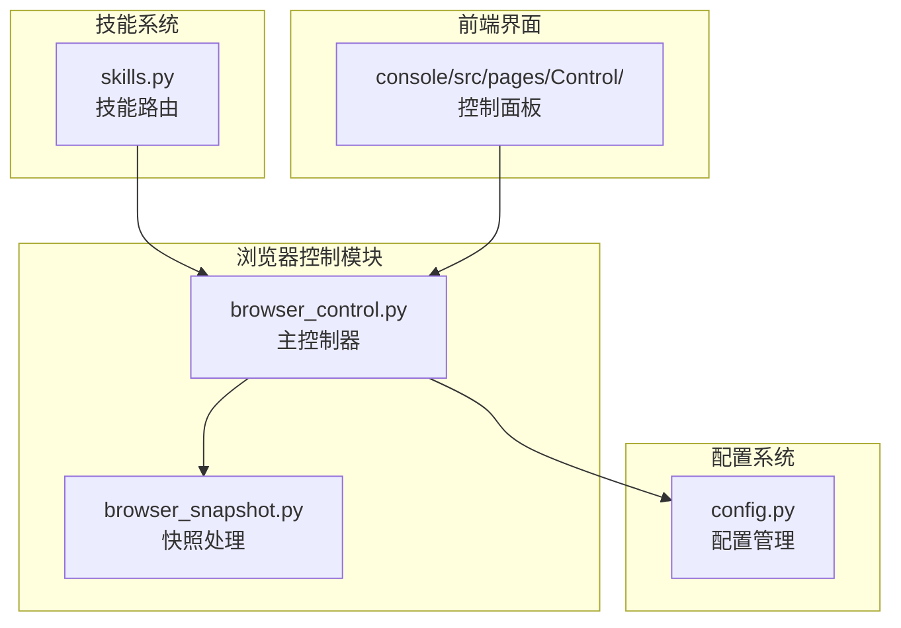
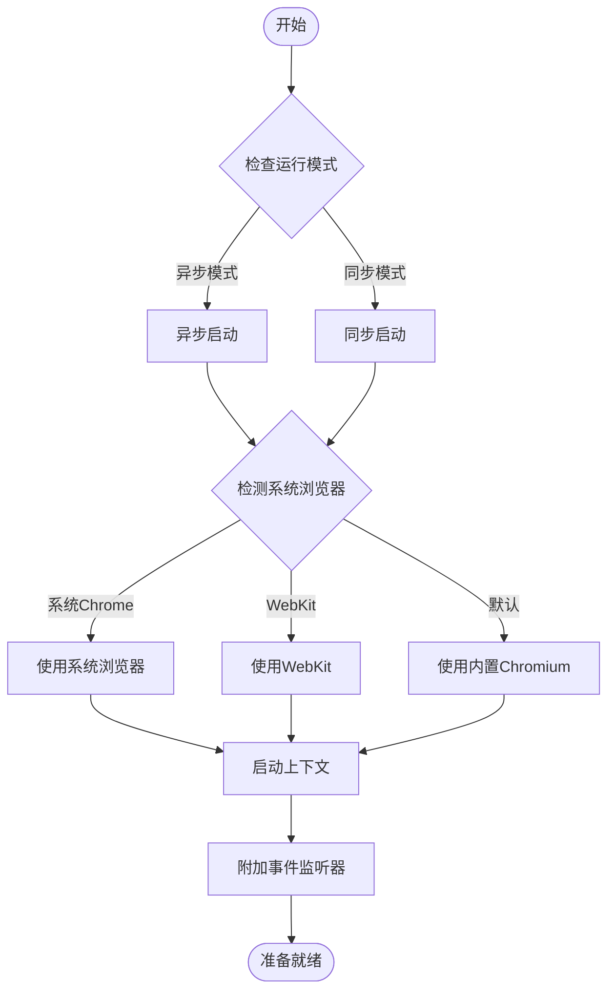
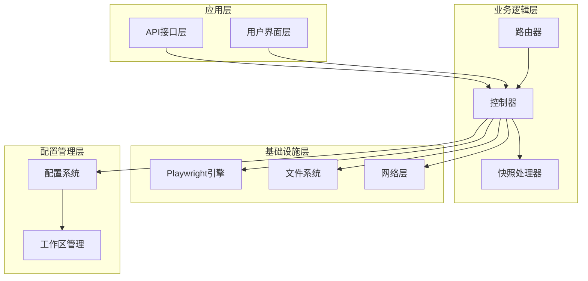
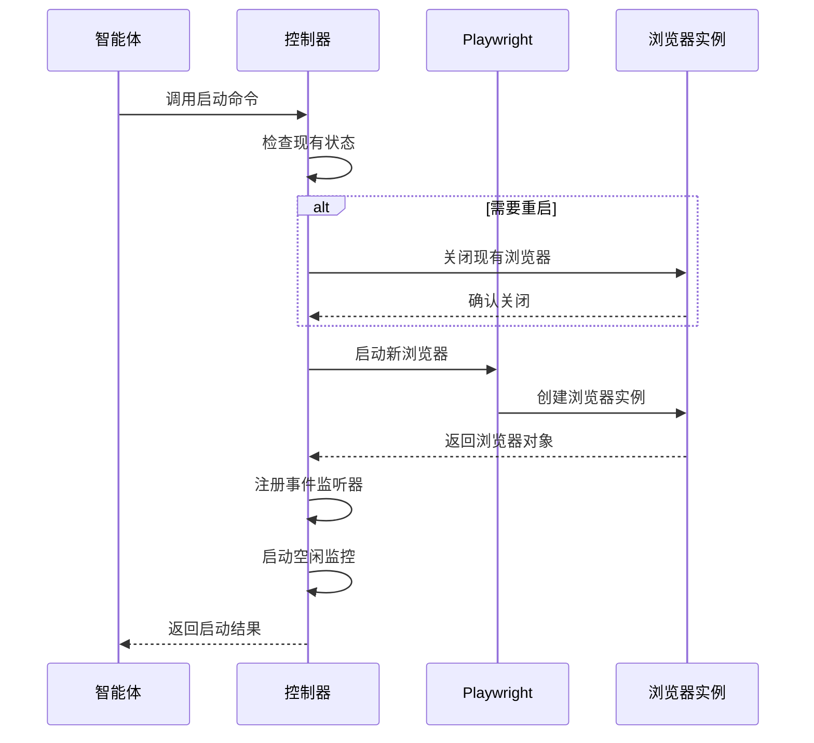
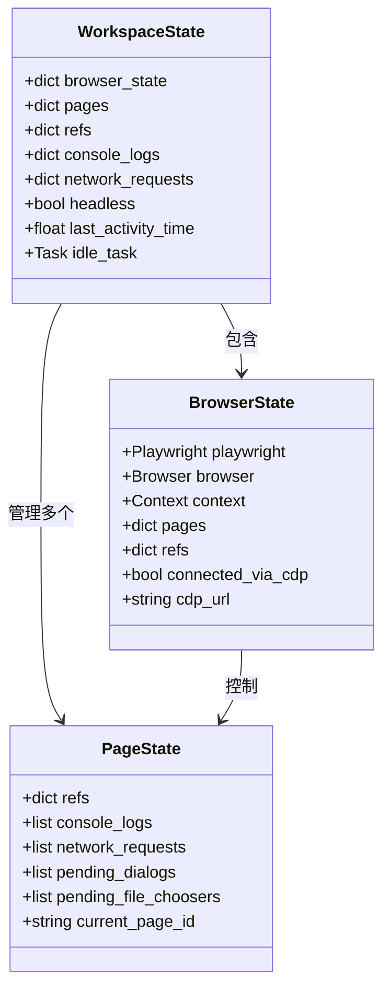
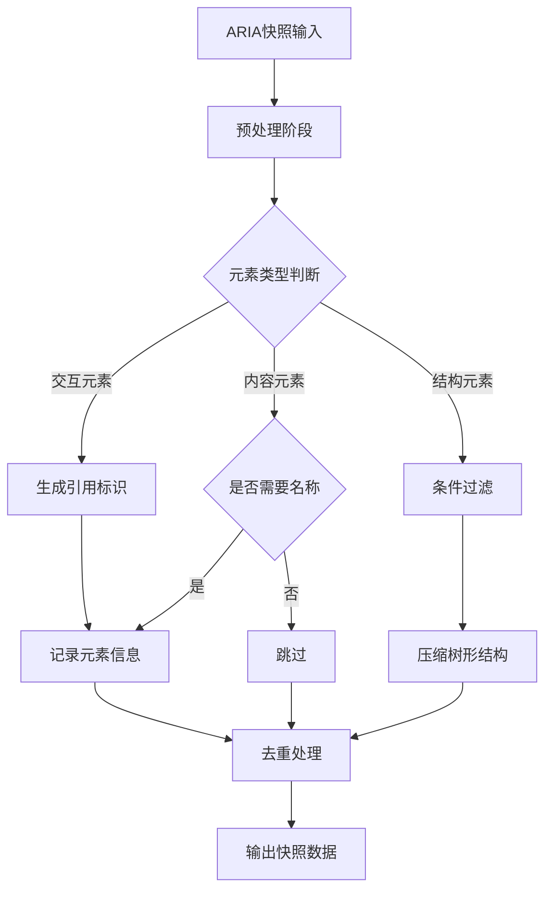
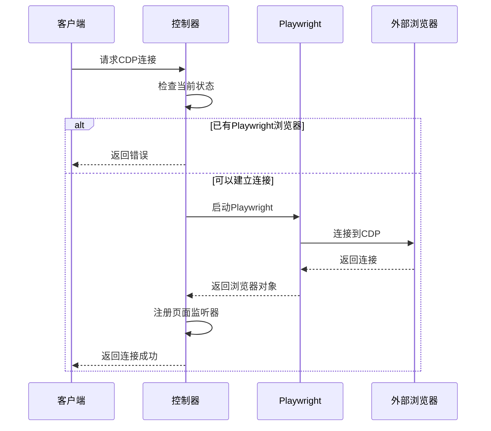
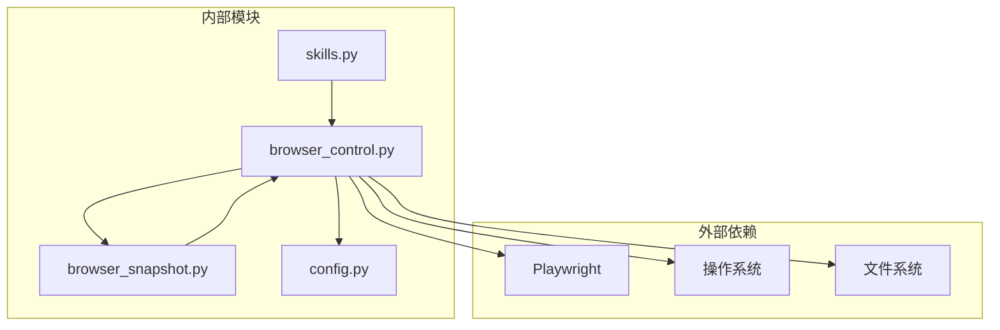

# 浏览器控制增强

<cite>
**本文档引用的文件**
- [browser_control.py](file://src/copaw/agents/tools/browser_control.py)
- [browser_snapshot.py](file://src/copaw/agents/tools/browser_snapshot.py)
- [config.py](file://src/copaw/config/config.py)
- [skills.py](file://src/copaw/app/routers/skills.py)
</cite>

## 目录
1. [简介](#简介)
2. [项目结构](#项目结构)
3. [核心组件](#核心组件)
4. [架构概览](#架构概览)
5. [详细组件分析](#详细组件分析)
6. [依赖关系分析](#依赖关系分析)
7. [性能考虑](#性能考虑)
8. [故障排除指南](#故障排除指南)
9. [结论](#结论)

## 简介

浏览器控制增强是 CoPaw 智能体平台中的一个关键功能模块，它提供了基于 Playwright 的强大浏览器自动化能力。该模块通过统一的工具接口，实现了从基础的页面导航到复杂的交互操作的完整浏览器控制功能。

本模块的核心目标是为智能体提供无缝的网页浏览体验，支持多种浏览器模式、会话管理和状态持久化，同时确保在不同操作系统和运行环境下的兼容性。

## 项目结构

浏览器控制功能主要分布在以下目录结构中：

**图表来源**
- [browser_control.py:1-50](file://src/copaw/agents/tools/browser_control.py#L1-L50)
- [browser_snapshot.py:1-30](file://src/copaw/agents/tools/browser_snapshot.py#L1-L30)
- [config.py:1-50](file://src/copaw/config/config.py#L1-L50)

**章节来源**
- [browser_control.py:1-100](file://src/copaw/agents/tools/browser_control.py#L1-L100)
- [browser_snapshot.py:1-50](file://src/copaw/agents/tools/browser_snapshot.py#L1-L50)

## 核心组件

### 主控制器 (browser_control.py)

主控制器是整个浏览器控制功能的核心，负责管理浏览器生命周期、状态管理和各种操作命令的执行。

#### 关键特性

1. **多模式支持**
   - 异步 Playwright 模式（推荐）
   - 同步 Playwright 模式（Windows + Uvicorn 混合模式）
   - 容器环境优化

2. **工作区隔离**
   - 每个工作区独立的浏览器状态
   - 用户数据目录管理
   - 多标签页支持

3. **智能重启机制**
   - 自动检测浏览器连接状态
   - 失败后的自动重试
   - 资源清理和回收

#### 主要功能函数

**图表来源**
- [browser_control.py:487-608](file://src/copaw/agents/tools/browser_control.py#L487-L608)

**章节来源**
- [browser_control.py:487-608](file://src/copaw/agents/tools/browser_control.py#L487-L608)
- [browser_control.py:627-795](file://src/copaw/agents/tools/browser_control.py#L627-L795)

### 快照处理器 (browser_snapshot.py)

快照处理器负责将 Playwright 的 ARIA 快照转换为智能体可理解的结构化数据，提供元素引用和定位信息。

#### 核心算法

1. **角色分类系统**
   - 交互元素：按钮、链接、文本框等
   - 内容元素：标题、单元格、导航等
   - 结构元素：通用容器、列表、表格等

2. **引用生成机制**
   - 自动生成唯一的元素引用标识符
   - 支持同类型元素的序号区分
   - 去重优化减少冗余信息

**章节来源**
- [browser_snapshot.py:7-65](file://src/copaw/agents/tools/browser_snapshot.py#L7-L65)
- [browser_snapshot.py:185-249](file://src/copaw/agents/tools/browser_snapshot.py#L185-L249)

## 架构概览

浏览器控制模块采用分层架构设计，确保了功能的模块化和可扩展性。

**图表来源**
- [browser_control.py:121-132](file://src/copaw/agents/tools/browser_control.py#L121-L132)
- [config.py:680-721](file://src/copaw/config/config.py#L680-L721)

## 详细组件分析

### 浏览器生命周期管理

浏览器生命周期管理是整个系统的核心，负责从启动到关闭的完整流程控制。

#### 启动流程

**图表来源**
- [browser_control.py:627-795](file://src/copaw/agents/tools/browser_control.py#L627-L795)
- [browser_control.py:175-200](file://src/copaw/agents/tools/browser_control.py#L175-L200)

#### 状态管理机制

系统采用工作区隔离的状态管理模式，每个工作区都有独立的浏览器状态空间。

**图表来源**
- [browser_control.py:87-118](file://src/copaw/agents/tools/browser_control.py#L87-L118)
- [browser_control.py:150-173](file://src/copaw/agents/tools/browser_control.py#L150-L173)

**章节来源**
- [browser_control.py:87-173](file://src/copaw/agents/tools/browser_control.py#L87-L173)

### 快照生成与解析

快照系统是浏览器控制的核心功能之一，它将复杂的网页结构转换为智能体友好的数据格式。

#### 快照生成流程

**图表来源**
- [browser_snapshot.py:135-183](file://src/copaw/agents/tools/browser_snapshot.py#L135-L183)
- [browser_snapshot.py:185-249](file://src/copaw/agents/tools/browser_snapshot.py#L185-L249)

#### 元素引用系统

快照处理器为每个可交互元素生成唯一的引用标识符，并维护引用计数以处理重复元素。

**章节来源**
- [browser_snapshot.py:73-98](file://src/copaw/agents/tools/browser_snapshot.py#L73-L98)
- [browser_snapshot.py:101-110](file://src/copaw/agents/tools/browser_snapshot.py#L101-L110)

### CDP 连接管理

CDP（Chrome DevTools Protocol）连接提供了与外部浏览器实例的直接通信能力。

#### 连接流程

**图表来源**
- [browser_control.py:2861-2941](file://src/copaw/agents/tools/browser_control.py#L2861-L2941)

**章节来源**
- [browser_control.py:2861-2941](file://src/copaw/agents/tools/browser_control.py#L2861-L2941)

## 依赖关系分析

浏览器控制模块的依赖关系相对简洁，主要依赖于 Playwright 和系统配置。

**图表来源**
- [browser_control.py:27-34](file://src/copaw/agents/tools/browser_control.py#L27-L34)
- [config.py:1-25](file://src/copaw/config/config.py#L1-L25)

### 环境适配机制

系统具有强大的环境适配能力，能够根据不同的运行环境自动选择最优的浏览器启动策略。

**章节来源**
- [browser_control.py:236-254](file://src/copaw/agents/tools/browser_control.py#L236-L254)
- [browser_control.py:286-334](file://src/copaw/agents/tools/browser_control.py#L286-L334)

## 性能考虑

### 资源管理优化

1. **空闲监控**
   - 默认30分钟空闲超时
   - 自动清理浏览器进程
   - 防止内存泄漏

2. **连接池管理**
   - 复用浏览器连接
   - 智能重连机制
   - 错误恢复策略

3. **内存优化**
   - 定期清理快照缓存
   - 限制日志存储大小
   - 压缩网络请求数据

### 并发处理

系统支持多标签页并发操作，通过事件驱动的方式处理异步任务。

**章节来源**
- [browser_control.py:134-140](file://src/copaw/agents/tools/browser_control.py#L134-L140)
- [browser_control.py:175-200](file://src/copaw/agents/tools/browser_control.py#L175-L200)

## 故障排除指南

### 常见问题诊断

1. **浏览器启动失败**
   - 检查 Playwright 是否正确安装
   - 验证系统浏览器可用性
   - 确认端口未被占用

2. **CDP连接问题**
   - 验证Chrome版本兼容性
   - 检查防火墙设置
   - 确认远程调试端口

3. **快照生成异常**
   - 检查页面加载完成状态
   - 验证元素可交互性
   - 确认权限设置

### 日志分析

系统提供详细的日志记录，包括：
- 浏览器启动和关闭事件
- 页面导航历史
- 网络请求详情
- 错误堆栈跟踪

**章节来源**
- [browser_control.py:175-200](file://src/copaw/agents/tools/browser_control.py#L175-L200)
- [browser_control.py:3444-3452](file://src/copaw/agents/tools/browser_control.py#L3444-L3452)

## 结论

浏览器控制增强模块为 CoPaw 平台提供了强大而灵活的网页自动化能力。通过精心设计的架构和完善的错误处理机制，该模块能够在各种复杂场景下稳定运行。

### 主要优势

1. **跨平台兼容性** - 支持 Windows、macOS、Linux 等多种操作系统
2. **智能资源管理** - 自动化的浏览器生命周期管理
3. **丰富的功能集** - 从基础导航到复杂交互的完整支持
4. **良好的扩展性** - 模块化设计便于功能扩展和定制

### 未来发展方向

1. **性能优化** - 进一步提升浏览器启动速度和响应性能
2. **功能增强** - 添加更多高级浏览器控制功能
3. **稳定性改进** - 加强异常处理和错误恢复机制
4. **用户体验优化** - 提供更直观的操作界面和反馈机制

该模块的成功实现为智能体平台的网页自动化能力奠定了坚实的基础，为后续的功能扩展和应用集成提供了良好的技术支撑。