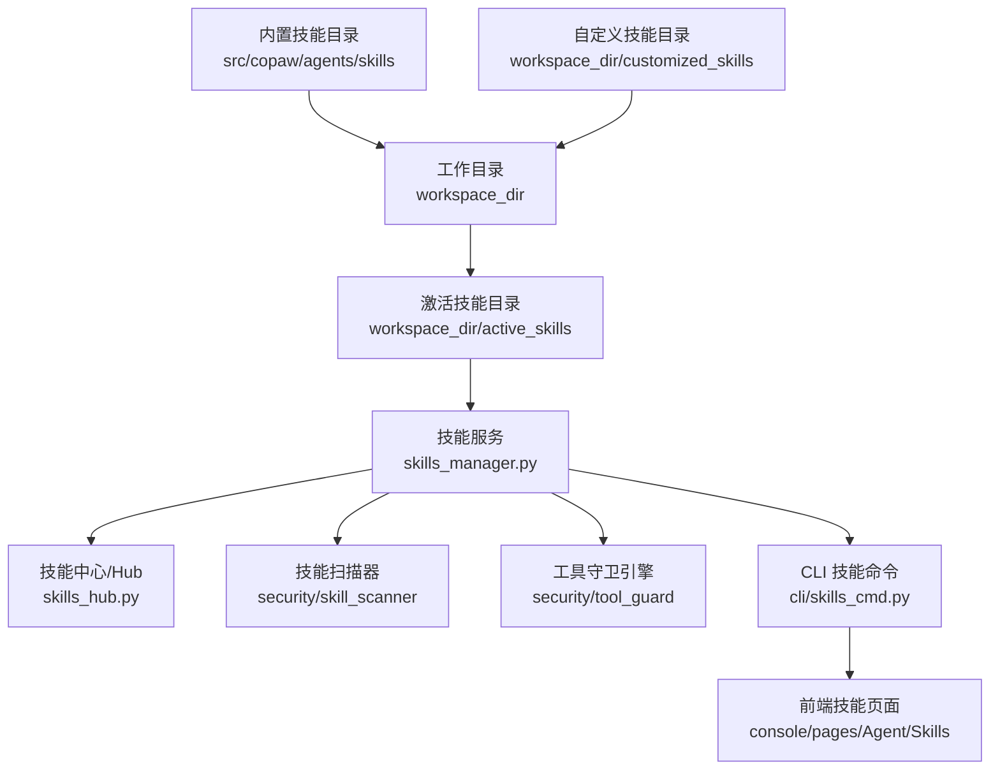
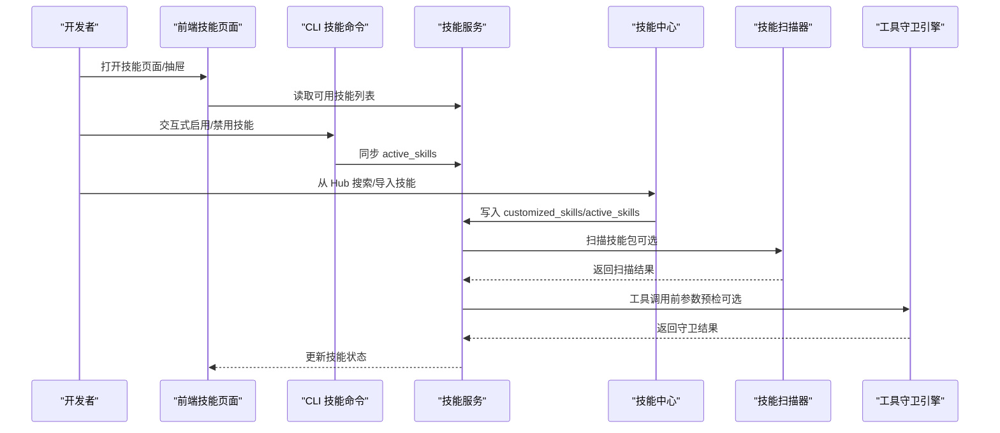
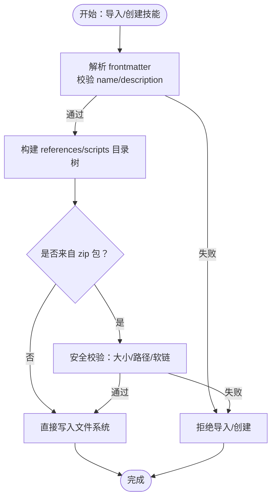
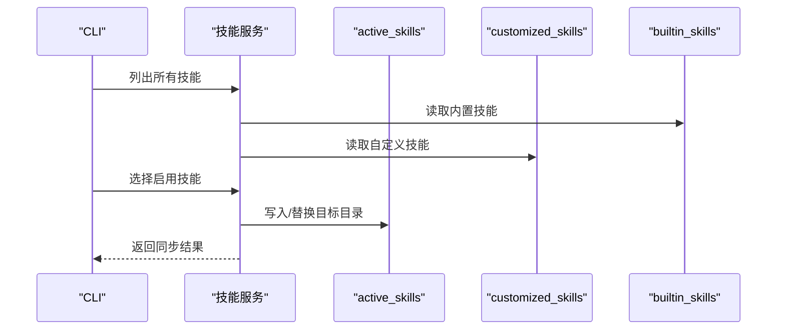
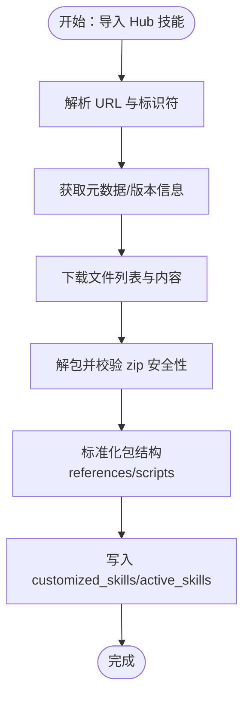
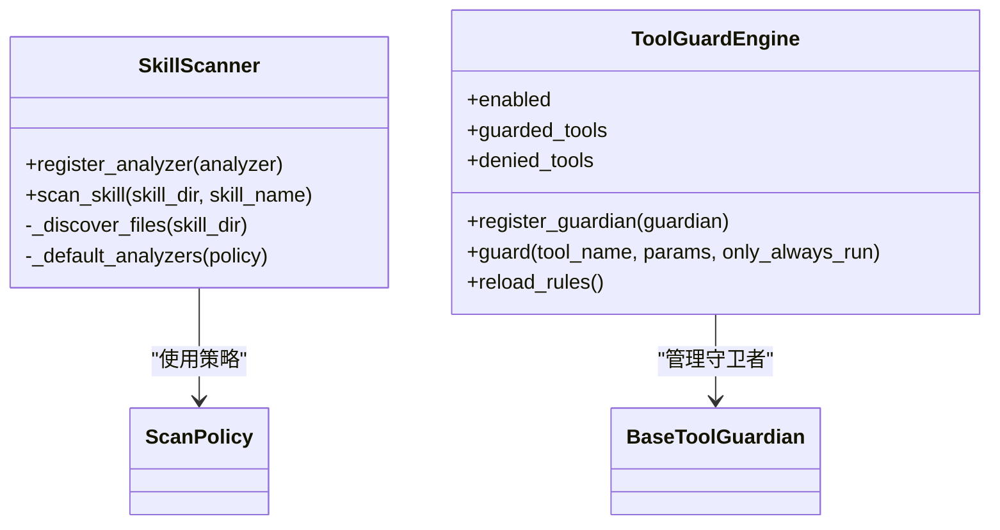
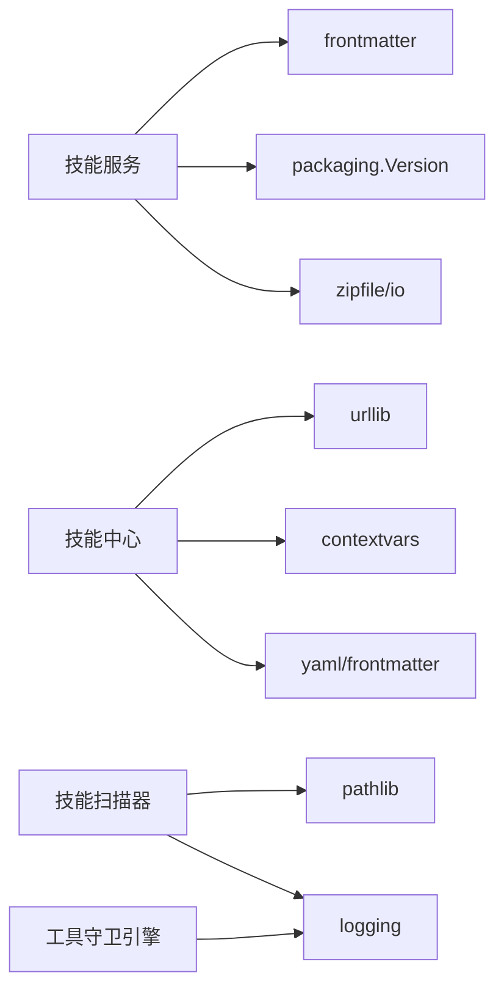

# 自定义技能开发

<cite>
**本文引用的文件**
- [SKILL.md（PDF 技能）](file://src/copaw/agents/skills/pdf/SKILL.md)
- [SKILL.md（DOCX 技能）](file://src/copaw/agents/skills/docx/SKILL.md)
- [SKILL.md（索引技能）](file://src/copaw/agents/skills/copaw_source_index/SKILL.md)
- [技能服务（skills_manager.py）](file://src/copaw/agents/skills_manager.py)
- [技能中心（skills_hub.py）](file://src/copaw/agents/skills_hub.py)
- [技能扫描器（scanner.py）](file://src/copaw/security/skill_scanner/scanner.py)
- [默认扫描策略（default_policy.yaml）](file://src/copaw/security/skill_scanner/data/default_policy.yaml)
- [工具守卫引擎（engine.py）](file://src/copaw/security/tool_guard/engine.py)
- [CLI 技能命令（skills_cmd.py）](file://src/copaw/cli/skills_cmd.py)
- [前端技能页面（console/pages/Agent/Skills/index.tsx）](file://console/src/pages/Agent/Skills/index.tsx)
- [前端技能抽屉组件（console/components/ConsoleSkillDrawer.tsx）](file://console/src/components/ConsoleCronBubble/index.tsx)
- [前端技能卡片组件（console/components/SkillCard.tsx）](file://console/src/components/ConsoleCronBubble/index.tsx)
- [前端技能管理钩子（console/pages/Agent/Skills/useSkills.ts）](file://console/src/pages/Agent/Skills/useSkills.ts)
- [前端技能扫描器（console/pages/Settings/Security/useSkillScanner.ts）](file://console/src/pages/Settings/Security/useSkillScanner.ts)
- [前端工具守卫（console/pages/Settings/Security/useToolGuard.ts）](file://console/src/pages/Settings/Security/useToolGuard.ts)
</cite>

## 目录
1. [简介](#简介)
2. [项目结构](#项目结构)
3. [核心组件](#核心组件)
4. [架构总览](#架构总览)
5. [详细组件分析](#详细组件分析)
6. [依赖关系分析](#依赖关系分析)
7. [性能考量](#性能考量)
8. [故障排除指南](#故障排除指南)
9. [结论](#结论)
10. [附录](#附录)

## 简介
本指南面向希望为 CoPaw 开发自定义技能的开发者，系统讲解技能开发的标准规范与最佳实践，覆盖以下主题：
- SKILL.md 配置文件的编写规范、元数据定义、依赖声明与版本管理
- 技能目录结构与文件组织方式
- 引用文件与脚本文件的处理机制
- 技能沙箱隔离、权限控制、安全限制与性能考量
- 调试工具、测试策略与发布流程
- 常见问题与故障排除

## 项目结构
CoPaw 的技能体系由“内置技能”“自定义技能”“激活技能”三部分组成，通过工作目录进行统一管理。技能的发现、同步、启用/禁用、导入与安全扫描均在后端实现，前端提供可视化配置界面。

图示来源
- [技能服务（skills_manager.py）:63-76](file://src/copaw/agents/skills_manager.py#L63-L76)
- [技能中心（skills_hub.py）:131-161](file://src/copaw/agents/skills_hub.py#L131-L161)
- [技能扫描器（scanner.py）:76-98](file://src/copaw/security/skill_scanner/scanner.py#L76-L98)
- [工具守卫引擎（engine.py）:53-63](file://src/copaw/security/tool_guard/engine.py#L53-L63)
- [CLI 技能命令（skills_cmd.py）:127-131](file://src/copaw/cli/skills_cmd.py#L127-L131)

章节来源
- [技能服务（skills_manager.py）:63-76](file://src/copaw/agents/skills_manager.py#L63-L76)
- [技能中心（skills_hub.py）:131-161](file://src/copaw/agents/skills_hub.py#L131-L161)
- [技能扫描器（scanner.py）:76-98](file://src/copaw/security/skill_scanner/scanner.py#L76-L98)
- [工具守卫引擎（engine.py）:53-63](file://src/copaw/security/tool_guard/engine.py#L53-L63)
- [CLI 技能命令（skills_cmd.py）:127-131](file://src/copaw/cli/skills_cmd.py#L127-L131)

## 核心组件
- 技能服务（SkillService）
  - 负责技能的读取、创建、同步与启用/禁用
  - 支持从 Hub 导入技能包，自动解析 references/scripts 树
  - 提供版本比较与回写机制
- 技能中心（Skills Hub）
  - 提供从远程 Hub 搜索、拉取、解包与校验的能力
  - 支持取消检查、超时重试、背压退避等网络与安全策略
- 技能扫描器（SkillScanner）
  - 对技能包进行安全扫描，支持规则去重、阈值控制与扩展分析器
- 工具守卫引擎（ToolGuardEngine）
  - 对工具调用参数进行预检，支持规则与路径级守卫
- CLI 技能命令
  - 提供交互式选择与批量配置技能启用状态
- 前端技能管理
  - 提供技能列表、启用/禁用、导入、扫描与守卫结果展示

章节来源
- [技能服务（skills_manager.py）:654-725](file://src/copaw/agents/skills_manager.py#L654-L725)
- [技能中心（skills_hub.py）:226-335](file://src/copaw/agents/skills_hub.py#L226-L335)
- [技能扫描器（scanner.py）:76-147](file://src/copaw/security/skill_scanner/scanner.py#L76-L147)
- [工具守卫引擎（engine.py）:53-102](file://src/copaw/security/tool_guard/engine.py#L53-L102)
- [CLI 技能命令（skills_cmd.py）:29-125](file://src/copaw/cli/skills_cmd.py#L29-L125)

## 架构总览
技能开发与运行的整体流程如下：

图示来源
- [技能服务（skills_manager.py）:676-724](file://src/copaw/agents/skills_manager.py#L676-L724)
- [技能中心（skills_hub.py）:573-633](file://src/copaw/agents/skills_hub.py#L573-L633)
- [技能扫描器（scanner.py）:148-242](file://src/copaw/security/skill_scanner/scanner.py#L148-L242)
- [工具守卫引擎（engine.py）:169-226](file://src/copaw/security/tool_guard/engine.py#L169-L226)
- [CLI 技能命令（skills_cmd.py）:29-125](file://src/copaw/cli/skills_cmd.py#L29-L125)

## 详细组件分析

### SKILL.md 配置文件规范
- 必备字段
  - name：技能名称（仅允许字母、数字、下划线、连字符）
  - description：技能描述
  - license（可选）：许可证信息
  - metadata：元数据对象
    - builtin_skill_version：内置技能版本号（用于升级比较）
    - copaw：CoPaw 特定元数据
      - emoji：技能表情符号
      - requires：依赖声明（字典）
- 文件位置与命名
  - 必须位于技能根目录，命名为 SKILL.md
- frontmatter 解析
  - 使用 YAML frontmatter 解析 name/description/metadata
  - 若缺失关键字段，导入/创建将被拒绝
- 示例参考
  - [索引技能 SKILL.md:1-12](file://src/copaw/agents/skills/copaw_source_index/SKILL.md#L1-L12)
  - [PDF 技能 SKILL.md:1-6](file://src/copaw/agents/skills/pdf/SKILL.md#L1-L6)
  - [DOCX 技能 SKILL.md:1-6](file://src/copaw/agents/skills/docx/SKILL.md#L1-L6)

章节来源
- [SKILL.md（索引技能）:1-12](file://src/copaw/agents/skills/copaw_source_index/SKILL.md#L1-L12)
- [SKILL.md（PDF 技能）:1-6](file://src/copaw/agents/skills/pdf/SKILL.md#L1-L6)
- [SKILL.md（DOCX 技能）:1-6](file://src/copaw/agents/skills/docx/SKILL.md#L1-L6)
- [技能服务（skills_manager.py）:779-800](file://src/copaw/agents/skills_manager.py#L779-L800)

### 技能目录结构与文件组织
- 根目录
  - SKILL.md：技能元数据与说明
  - references/：引用资源树（可选）
  - scripts/：脚本文件树（可选）
- references/ 与 scripts/ 的处理
  - 读取时构建目录树结构，支持嵌套
  - 导入/创建时支持扁平或嵌套结构
- 安全与合规
  - zip 导入时进行大小与路径合法性校验，禁止软链接
- 版本管理
  - 通过 SKILL.md 中 metadata.builtin_skill_version 进行内置技能版本比较
  - 回写时遵循“自定义覆盖内置”的原则

图示来源
- [技能服务（skills_manager.py）:500-546](file://src/copaw/agents/skills_manager.py#L500-L546)
- [技能服务（skills_manager.py）:556-577](file://src/copaw/agents/skills_manager.py#L556-L577)
- [技能服务（skills_manager.py）:607-652](file://src/copaw/agents/skills_manager.py#L607-L652)
- [技能服务（skills_manager.py）:169-188](file://src/copaw/agents/skills_manager.py#L169-L188)

章节来源
- [技能服务（skills_manager.py）:114-148](file://src/copaw/agents/skills_manager.py#L114-L148)
- [技能服务（skills_manager.py）:500-546](file://src/copaw/agents/skills_manager.py#L500-L546)
- [技能服务（skills_manager.py）:556-577](file://src/copaw/agents/skills_manager.py#L556-L577)
- [技能服务（skills_manager.py）:607-652](file://src/copaw/agents/skills_manager.py#L607-L652)
- [技能服务（skills_manager.py）:169-188](file://src/copaw/agents/skills_manager.py#L169-L188)

### 技能同步与启用流程
- 同步策略
  - 内置技能优先，自定义技能覆盖同名内置
  - 支持强制覆盖与差异检测
- 启用/禁用
  - 通过 CLI 交互式选择，更新 active_skills
  - 前端提供卡片与抽屉组件展示与操作

图示来源
- [技能服务（skills_manager.py）:210-287](file://src/copaw/agents/skills_manager.py#L210-L287)
- [CLI 技能命令（skills_cmd.py）:29-125](file://src/copaw/cli/skills_cmd.py#L29-L125)

章节来源
- [技能服务（skills_manager.py）:210-287](file://src/copaw/agents/skills_manager.py#L210-L287)
- [CLI 技能命令（skills_cmd.py）:29-125](file://src/copaw/cli/skills_cmd.py#L29-L125)

### 技能中心（Hub）导入与校验
- 支持从多种 Hub 源解析标识符（ClawHub、Skills.sh、SkillsMP、ModelScope）
- 下载与解包：限制最大 zip 条目数与解压后总大小，校验路径安全性
- 取消与重试：支持取消检查、指数退避与可重试 HTTP 状态码
- 环境变量
  - COPAW_SKILLS_HUB_HTTP_TIMEOUT/RETRIES/BASE/CAP
  - GITHUB_TOKEN/GH_TOKEN 用于 GitHub API 限流豁免

图示来源
- [技能中心（skills_hub.py）:573-633](file://src/copaw/agents/skills_hub.py#L573-L633)
- [技能中心（skills_hub.py）:226-335](file://src/copaw/agents/skills_hub.py#L226-L335)
- [技能中心（skills_hub.py）:390-449](file://src/copaw/agents/skills_hub.py#L390-L449)

章节来源
- [技能中心（skills_hub.py）:573-633](file://src/copaw/agents/skills_hub.py#L573-L633)
- [技能中心（skills_hub.py）:226-335](file://src/copaw/agents/skills_hub.py#L226-L335)
- [技能中心（skills_hub.py）:390-449](file://src/copaw/agents/skills_hub.py#L390-L449)

### 技能安全扫描与工具守卫
- 技能扫描器
  - 默认使用 PatternAnalyzer，支持策略化规则、阈值与去重
  - 文件发现阶段过滤符号链接、越界路径与大文件
- 工具守卫引擎
  - 默认启用，支持路径级与规则级守卫
  - 可动态注册/注销守卫者，支持重载规则集

图示来源
- [技能扫描器（scanner.py）:76-147](file://src/copaw/security/skill_scanner/scanner.py#L76-L147)
- [默认扫描策略（default_policy.yaml）:1-245](file://src/copaw/security/skill_scanner/data/default_policy.yaml#L1-L245)
- [工具守卫引擎（engine.py）:53-102](file://src/copaw/security/tool_guard/engine.py#L53-L102)

章节来源
- [技能扫描器（scanner.py）:148-242](file://src/copaw/security/skill_scanner/scanner.py#L148-L242)
- [默认扫描策略（default_policy.yaml）:1-245](file://src/copaw/security/skill_scanner/data/default_policy.yaml#L1-L245)
- [工具守卫引擎（engine.py）:169-226](file://src/copaw/security/tool_guard/engine.py#L169-L226)

### 前端技能管理与可视化
- 页面与组件
  - 技能页面：展示技能列表、来源与启用状态
  - 抽屉组件：展示技能详情与操作
  - 卡片组件：技能卡片与上下文操作
- 钩子与工具
  - useSkills：封装技能列表与启用/禁用逻辑
  - useSkillScanner：集成技能扫描结果
  - useToolGuard：集成工具守卫结果

章节来源
- [前端技能页面（console/pages/Agent/Skills/index.tsx）](file://console/src/pages/Agent/Skills/index.tsx)
- [前端技能抽屉组件（console/components/ConsoleSkillDrawer.tsx）](file://console/src/components/ConsoleCronBubble/index.tsx)
- [前端技能卡片组件（console/components/SkillCard.tsx）](file://console/src/components/ConsoleCronBubble/index.tsx)
- [前端技能管理钩子（console/pages/Agent/Skills/useSkills.ts）](file://console/src/pages/Agent/Skills/useSkills.ts)
- [前端技能扫描器（console/pages/Settings/Security/useSkillScanner.ts）](file://console/src/pages/Settings/Security/useSkillScanner.ts)
- [前端工具守卫（console/pages/Settings/Security/useToolGuard.ts）](file://console/src/pages/Settings/Security/useToolGuard.ts)

## 依赖关系分析
- 技能服务依赖
  - frontmatter：解析 SKILL.md
  - packaging.Version：内置技能版本比较
  - zipfile/io：zip 包导入与解压
- 技能中心依赖
  - urllib：HTTP 请求与重试
  - contextvars：取消检查
  - yaml/frontmatter：Hub 数据解析
- 安全组件依赖
  - pathlib：路径解析与边界检查
  - logging：日志记录

图示来源
- [技能服务（skills_manager.py）:13-14](file://src/copaw/agents/skills_manager.py#L13-L14)
- [技能中心（skills_hub.py）:17-23](file://src/copaw/agents/skills_hub.py#L17-L23)
- [技能扫描器（scanner.py）:20-27](file://src/copaw/security/skill_scanner/scanner.py#L20-L27)
- [工具守卫引擎（engine.py）:20-28](file://src/copaw/security/tool_guard/engine.py#L20-L28)

章节来源
- [技能服务（skills_manager.py）:13-14](file://src/copaw/agents/skills_manager.py#L13-L14)
- [技能中心（skills_hub.py）:17-23](file://src/copaw/agents/skills_hub.py#L17-L23)
- [技能扫描器（scanner.py）:20-27](file://src/copaw/security/skill_scanner/scanner.py#L20-L27)
- [工具守卫引擎（engine.py）:20-28](file://src/copaw/security/tool_guard/engine.py#L20-L28)

## 性能考量
- 技能扫描
  - 文件数量上限与单文件大小上限可配置，默认约 500 个文件、5MB/文件
  - 支持规则去重，降低重复扫描成本
- Hub 导入
  - 限制 zip 解压后总大小与条目数，防止内存与磁盘压力
  - 指数退避与可重试状态码提升网络稳定性
- 工具守卫
  - 可按需仅运行“总是运行”的守卫者，降低非受控工具调用的开销

章节来源
- [默认扫描策略（default_policy.yaml）:221-227](file://src/copaw/security/skill_scanner/data/default_policy.yaml#L221-L227)
- [技能扫描器（scanner.py）:116-127](file://src/copaw/security/skill_scanner/scanner.py#L116-L127)
- [技能中心（skills_hub.py）:65-67](file://src/copaw/agents/skills_hub.py#L65-L67)
- [工具守卫引擎（engine.py）:169-188](file://src/copaw/security/tool_guard/engine.py#L169-L188)

## 故障排除指南
- SKILL.md 解析失败
  - 检查 frontmatter 是否包含 name 与 description
  - 确认 metadata.builtin_skill_version 格式正确
- zip 导入失败
  - 检查压缩包大小与条目数是否超过限制
  - 确保路径不包含软链接与越界路径
- Hub 导入超时/限流
  - 设置 GITHUB_TOKEN/GH_TOKEN
  - 调整 COPAW_SKILLS_HUB_HTTP_TIMEOUT/RETRIES/BASE/CAP
- 技能扫描告警过多
  - 调整 default_policy.yaml 中的 file_limits 与 analysis_thresholds
  - 使用规则去重与严重级别覆盖
- 工具调用被拒
  - 检查工具守卫规则与路径白名单
  - 临时关闭 ToolGuard（不推荐）或调整受保护工具集合

章节来源
- [技能服务（skills_manager.py）:779-800](file://src/copaw/agents/skills_manager.py#L779-L800)
- [技能中心（skills_hub.py）:251-301](file://src/copaw/agents/skills_hub.py#L251-L301)
- [默认扫描策略（default_policy.yaml）:221-234](file://src/copaw/security/skill_scanner/data/default_policy.yaml#L221-L234)
- [工具守卫引擎（engine.py）:35-51](file://src/copaw/security/tool_guard/engine.py#L35-L51)

## 结论
通过本指南，开发者可以系统地完成 CoPaw 自定义技能的开发、导入、启用、扫描与守卫全流程。建议在开发过程中严格遵守 SKILL.md 规范、合理组织 references/scripts 树、关注安全扫描与工具守卫策略，并利用 CLI 与前端界面进行高效配置与验证。

## 附录

### 开发模板与示例
- 模板字段清单
  - name、description、license（可选）、metadata（含 builtin_skill_version、copaw.emoji/copaw.requires）
- 目录结构建议
  - SKILL.md + references/ + scripts/
- 示例参考
  - [索引技能 SKILL.md:1-12](file://src/copaw/agents/skills/copaw_source_index/SKILL.md#L1-L12)
  - [PDF 技能 SKILL.md:1-6](file://src/copaw/agents/skills/pdf/SKILL.md#L1-L6)
  - [DOCX 技能 SKILL.md:1-6](file://src/copaw/agents/skills/docx/SKILL.md#L1-L6)

章节来源
- [SKILL.md（索引技能）:1-12](file://src/copaw/agents/skills/copaw_source_index/SKILL.md#L1-L12)
- [SKILL.md（PDF 技能）:1-6](file://src/copaw/agents/skills/pdf/SKILL.md#L1-L6)
- [SKILL.md（DOCX 技能）:1-6](file://src/copaw/agents/skills/docx/SKILL.md#L1-L6)

### 发布与测试流程
- 本地测试
  - 使用 CLI skills list/config 验证技能启用状态
  - 在前端技能页面查看技能详情与状态
- 安全扫描
  - 使用 console 的技能扫描器与工具守卫结果进行评估
- 发布准备
  - 确保 SKILL.md 字段完整、references/scripts 结构清晰
  - 通过 Hub 导入前进行本地 zip 校验

章节来源
- [CLI 技能命令（skills_cmd.py）:132-181](file://src/copaw/cli/skills_cmd.py#L132-L181)
- [前端技能扫描器（console/pages/Settings/Security/useSkillScanner.ts）](file://console/src/pages/Settings/Security/useSkillScanner.ts)
- [前端工具守卫（console/pages/Settings/Security/useToolGuard.ts）](file://console/src/pages/Settings/Security/useToolGuard.ts)