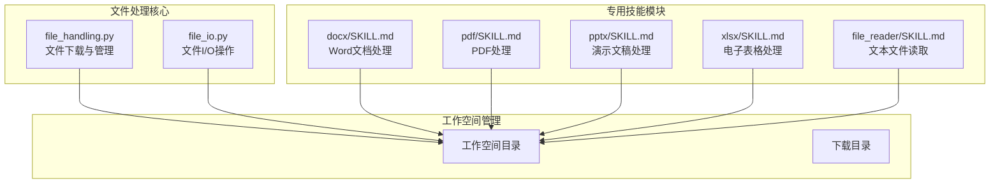
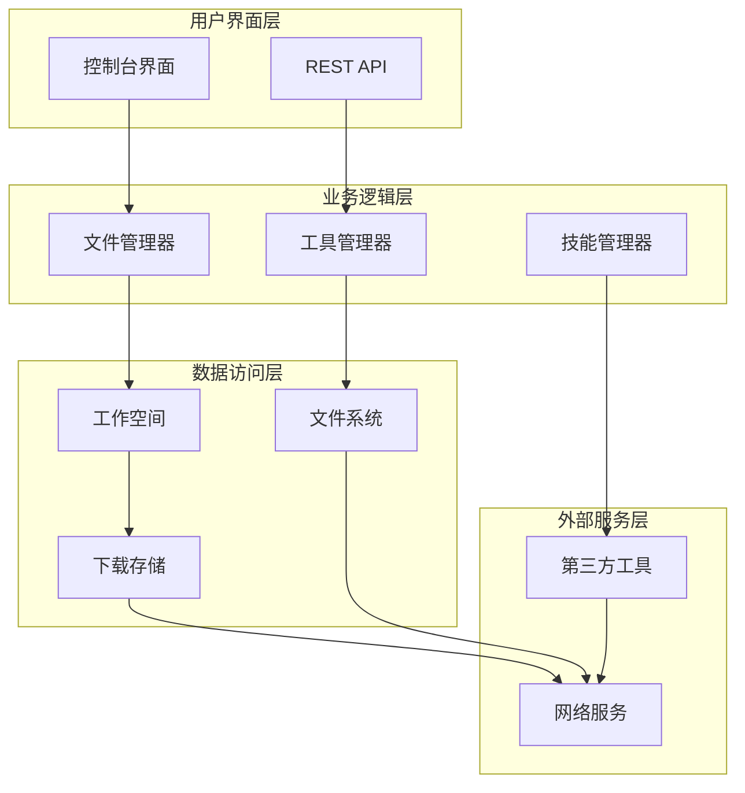
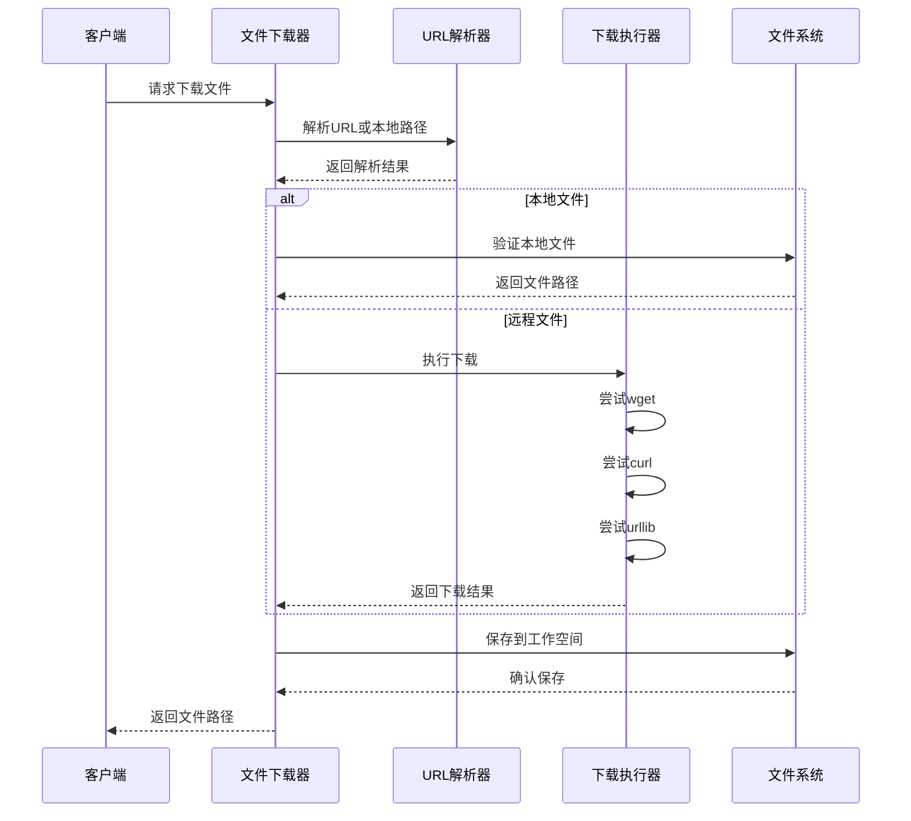
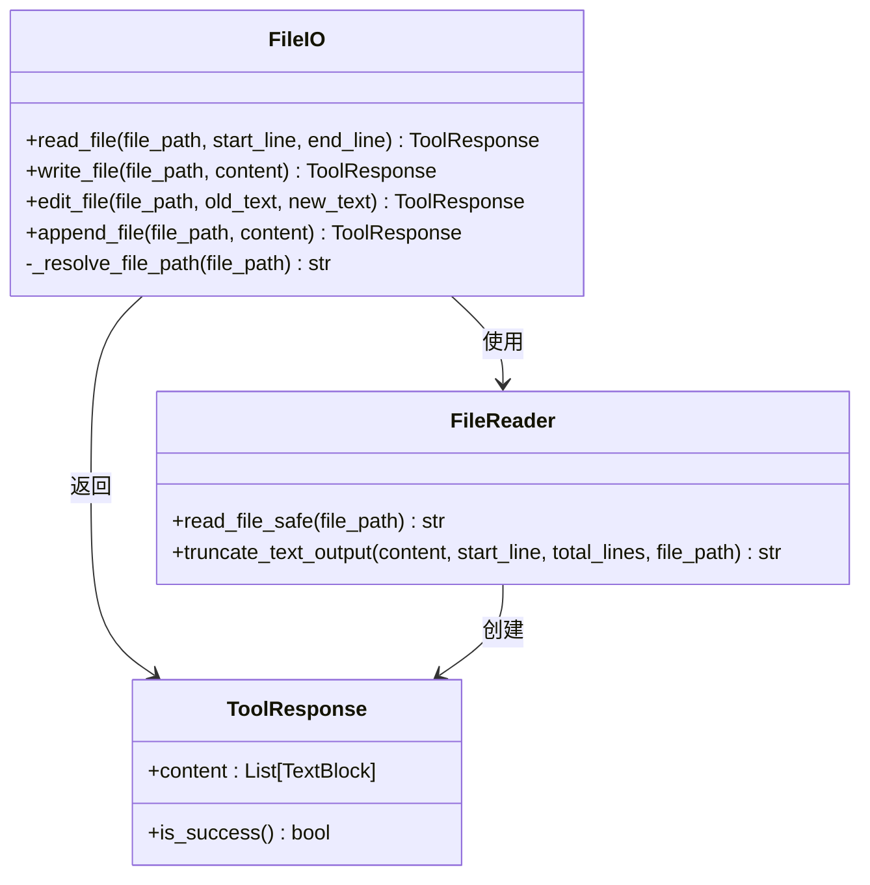
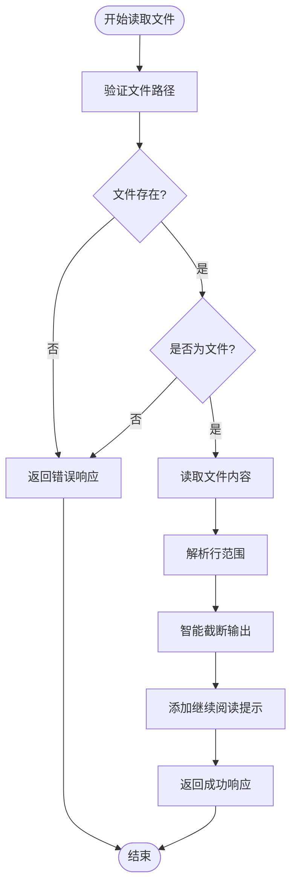
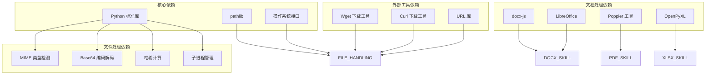
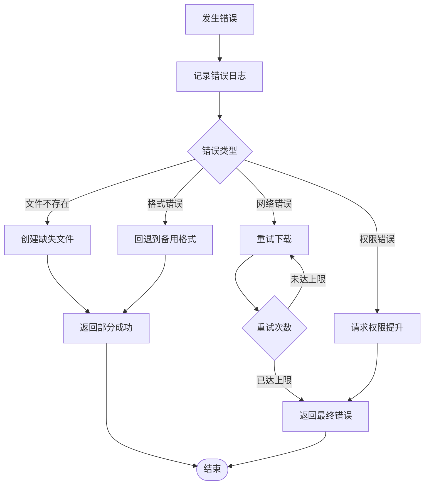

# 文件处理能力扩展

<cite>
**本文档引用的文件**
- [src/copaw/agents/utils/file_handling.py](file://src/copaw/agents/utils/file_handling.py)
- [src/copaw/agents/tools/file_io.py](file://src/copaw/agents/tools/file_io.py)
- [src/copaw/agents/skills/docx/SKILL.md](file://src/copaw/agents/skills/docx/SKILL.md)
- [src/copaw/agents/skills/pdf/SKILL.md](file://src/copaw/agents/skills/pdf/SKILL.md)
- [src/copaw/agents/skills/pptx/SKILL.md](file://src/copaw/agents/skills/pptx/SKILL.md)
- [src/copaw/agents/skills/xlsx/SKILL.md](file://src/copaw/agents/skills/xlsx/SKILL.md)
- [src/copaw/agents/skills/file_reader/SKILL.md](file://src/copaw/agents/skills/file_reader/SKILL.md)
</cite>

## 目录
1. [简介](#简介)
2. [项目结构](#项目结构)
3. [核心组件](#核心组件)
4. [架构概览](#架构概览)
5. [详细组件分析](#详细组件分析)
6. [依赖关系分析](#依赖关系分析)
7. [性能考虑](#性能考虑)
8. [故障排除指南](#故障排除指南)
9. [结论](#结论)

## 简介

本文档详细分析了 CoPaw 项目中的文件处理能力扩展，重点涵盖了多格式文件的下载、读取、编辑和转换功能。该系统提供了从基础文件操作到复杂文档处理的完整解决方案，支持多种文件格式包括 PDF、DOCX、XLSX、PPTX 以及各种文本格式。

系统采用模块化设计，通过专门的工具类和技能模块实现文件处理功能，确保了良好的可维护性和扩展性。每个组件都有明确的职责分工，形成了完整的文件处理生态系统。

## 项目结构

CoPaw 项目的文件处理能力主要分布在以下几个关键目录中：

**图表来源**
- [src/copaw/agents/utils/file_handling.py:1-263](file://src/copaw/agents/utils/file_handling.py#L1-L263)
- [src/copaw/agents/tools/file_io.py:1-360](file://src/copaw/agents/tools/file_io.py#L1-L360)

**章节来源**
- [src/copaw/agents/utils/file_handling.py:1-263](file://src/copaw/agents/utils/file_handling.py#L1-L263)
- [src/copaw/agents/tools/file_io.py:1-360](file://src/copaw/agents/tools/file_io.py#L1-L360)

## 核心组件

### 文件下载与管理组件

文件下载与管理组件是整个文件处理系统的基础，提供了统一的文件下载接口和本地文件管理功能。

**主要功能特性：**
- 支持多种下载方式（URL 下载、Base64 编码数据下载）
- 智能文件类型检测和扩展名推断
- 跨平台兼容的本地文件解析
- 错误处理和超时管理

**章节来源**
- [src/copaw/agents/utils/file_handling.py:155-263](file://src/copaw/agents/utils/file_handling.py#L155-L263)

### 文件 I/O 操作组件

文件 I/O 操作组件提供了丰富的文件读写功能，支持多种操作模式。

**核心操作类型：**
- 基础文件读取（支持行范围选择）
- 文件内容写入和覆盖
- 文本查找替换操作
- 内容追加功能

**章节来源**
- [src/copaw/agents/tools/file_io.py:38-360](file://src/copaw/agents/tools/file_io.py#L38-L360)

## 架构概览

CoPaw 的文件处理架构采用了分层设计模式，确保了功能的模块化和可扩展性：

**图表来源**
- [src/copaw/agents/utils/file_handling.py:26-29](file://src/copaw/agents/utils/file_handling.py#L26-L29)
- [src/copaw/agents/tools/file_io.py:19-36](file://src/copaw/agents/tools/file_io.py#L19-L36)

## 详细组件分析

### 文件下载组件深度分析

文件下载组件实现了智能的文件下载机制，支持多种协议和格式：

**图表来源**
- [src/copaw/agents/utils/file_handling.py:196-263](file://src/copaw/agents/utils/file_handling.py#L196-L263)

**组件特性：**
- 多重下载策略（wget → curl → urllib）
- 智能文件类型检测
- 自动扩展名修复机制
- 跨平台路径解析

**章节来源**
- [src/copaw/agents/utils/file_handling.py:65-103](file://src/copaw/agents/utils/file_handling.py#L65-L103)
- [src/copaw/agents/utils/file_handling.py:105-153](file://src/copaw/agents/utils/file_handling.py#L105-L153)

### 文件 I/O 操作组件分析

文件 I/O 操作组件提供了完整的文件操作功能集：

**图表来源**
- [src/copaw/agents/tools/file_io.py:38-360](file://src/copaw/agents/tools/file_io.py#L38-L360)

**核心功能流程：**

**文件读取流程：**

**图表来源**
- [src/copaw/agents/tools/file_io.py:38-172](file://src/copaw/agents/tools/file_io.py#L38-L172)

**章节来源**
- [src/copaw/agents/tools/file_io.py:38-172](file://src/copaw/agents/tools/file_io.py#L38-L172)

### 专用文档处理技能

#### DOCX 文档处理技能

DOCX 技能模块提供了完整的 Word 文档处理能力：

**核心功能：**
- 新文档创建和模板设计
- 现有文档编辑和修改
- 内容提取和分析
- 图像插入和格式化
- 目录和样式管理

**技术特点：**
- 支持 docx-js JavaScript 库
- XML 直接编辑能力
- LibreOffice 集成
- 验证和修复机制

**章节来源**
- [src/copaw/agents/skills/docx/SKILL.md:14-301](file://src/copaw/agents/skills/docx/SKILL.md#L14-L301)

#### PDF 处理技能

PDF 技能模块专注于 PDF 文件的专业处理：

**处理能力：**
- 文本和表格提取
- PDF 合并与分割
- 页面旋转和密码处理
- 水印添加和图像提取
- OCR 光学字符识别

**技术栈：**
- pypdf 核心处理
- pdfplumber 提取工具
- reportlab 创建引擎
- poppler-utils 命令行工具

**章节来源**
- [src/copaw/agents/skills/pdf/SKILL.md:14-329](file://src/copaw/agents/skills/pdf/SKILL.md#L14-L329)

#### PPTX 演示文稿处理技能

PPTX 技能模块提供演示文稿的完整生命周期管理：

**核心功能：**
- 内容读取和分析
- 模板设计和应用
- 新演示文稿创建
- 编辑和修改工作流
- 视觉质量保证

**设计指导：**
- 专业的颜色搭配建议
- 版式布局最佳实践
- 字体选择和排版规范
- 视觉元素使用指南

**章节来源**
- [src/copaw/agents/skills/pptx/SKILL.md:14-239](file://src/copaw/agents/skills/pptx/SKILL.md#L14-L239)

#### XLSX 电子表格处理技能

XLSX 技能模块专注于电子表格的专业处理：

**专业标准：**
- 金融模型颜色编码标准
- 数字格式化规范
- 公式构建规则
- 错误预防检查清单

**处理流程：**
- 数据分析和清理
- 公式计算和验证
- 格式化和美化
- 质量保证和测试

**章节来源**
- [src/copaw/agents/skills/xlsx/SKILL.md:27-305](file://src/copaw/agents/skills/xlsx/SKILL.md#L27-L305)

### 文本文件读取技能

文本文件读取技能专注于纯文本文件的处理：

**适用格式：**
- 纯文本文件（.txt）
- Markdown 文档（.md）
- JSON 和 YAML 配置文件
- CSV 和 TSV 数据文件
- 日志文件和源代码文件

**安全特性：**
- 大文件智能截断
- 类型检测和验证
- 安全读取机制
- 内容摘要生成功能

**章节来源**
- [src/copaw/agents/skills/file_reader/SKILL.md:18-63](file://src/copaw/agents/skills/file_reader/SKILL.md#L18-L63)

## 依赖关系分析

文件处理系统的依赖关系展现了清晰的层次结构：

**图表来源**
- [src/copaw/agents/utils/file_handling.py:8-18](file://src/copaw/agents/utils/file_handling.py#L8-L18)
- [src/copaw/agents/skills/docx/SKILL.md:16-21](file://src/copaw/agents/skills/docx/SKILL.md#L16-L21)

**依赖关系特点：**
- 核心依赖最小化，提高稳定性
- 外部工具按需加载，增强功能
- 文档处理工具专业化，确保质量
- 跨平台兼容性设计

**章节来源**
- [src/copaw/agents/utils/file_handling.py:8-23](file://src/copaw/agents/utils/file_handling.py#L8-L23)
- [src/copaw/agents/skills/docx/SKILL.md:16-21](file://src/copaw/agents/skills/docx/SKILL.md#L16-L21)

## 性能考虑

### 文件下载优化

系统在文件下载方面采用了多重优化策略：

**下载策略优化：**
- 多工具回退机制，确保下载成功率
- 超时控制和错误重试
- 智能文件类型检测减少不必要的下载
- 本地缓存机制避免重复下载

**内存管理：**
- 流式下载处理大文件
- 分块读取减少内存占用
- 及时释放临时文件资源

### 文件处理性能

**批量操作优化：**
- 批量文件读取的缓存机制
- 并行处理多个小文件
- 智能截断避免大文件全量读取

**内存效率：**
- 行级读取支持大文件处理
- 按需加载文件内容
- 及时清理临时数据结构

## 故障排除指南

### 常见问题诊断

**文件下载失败：**
1. 检查网络连接和代理设置
2. 验证目标 URL 的可用性
3. 确认下载工具（wget/curl）已安装
4. 检查磁盘空间和权限

**文件格式识别错误：**
1. 验证文件扩展名的正确性
2. 检查文件头部魔数
3. 确认第三方工具的完整性
4. 尝试手动指定文件类型

**文档处理异常：**
1. 验证相关依赖工具的安装
2. 检查 LibreOffice 的配置
3. 确认 poppler 工具链的完整性
4. 验证 JavaScript 环境设置

### 错误处理机制

系统实现了多层次的错误处理：

**章节来源**
- [src/copaw/agents/utils/file_handling.py:257-263](file://src/copaw/agents/utils/file_handling.py#L257-L263)
- [src/copaw/agents/tools/file_io.py:163-171](file://src/copaw/agents/tools/file_io.py#L163-L171)

## 结论

CoPaw 项目的文件处理能力扩展展现了一个成熟、全面且高度模块化的系统架构。通过精心设计的核心组件和专用技能模块，系统能够有效处理从基础文本文件到复杂文档格式的全方位文件处理需求。

**主要优势：**
- **模块化设计**：清晰的功能分离和职责划分
- **跨平台兼容**：统一的接口支持多种操作系统
- **扩展性强**：易于添加新的文件格式支持
- **错误处理完善**：多层次的错误恢复机制
- **性能优化**：针对大文件和批量操作的专门优化

**未来发展方向：**
- 继续扩展支持的文件格式
- 优化大数据文件处理性能
- 增强云端存储集成能力
- 提升自动化处理智能化水平

该系统为开发者提供了一个强大而灵活的文件处理框架，能够满足各种复杂的文件处理场景需求。