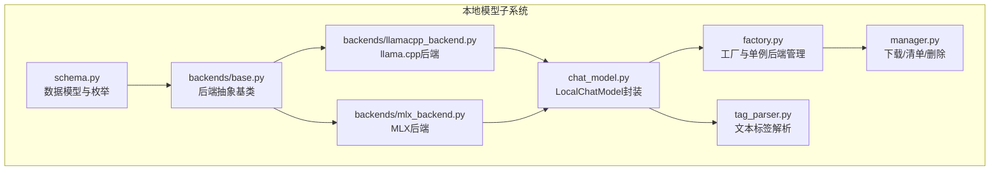
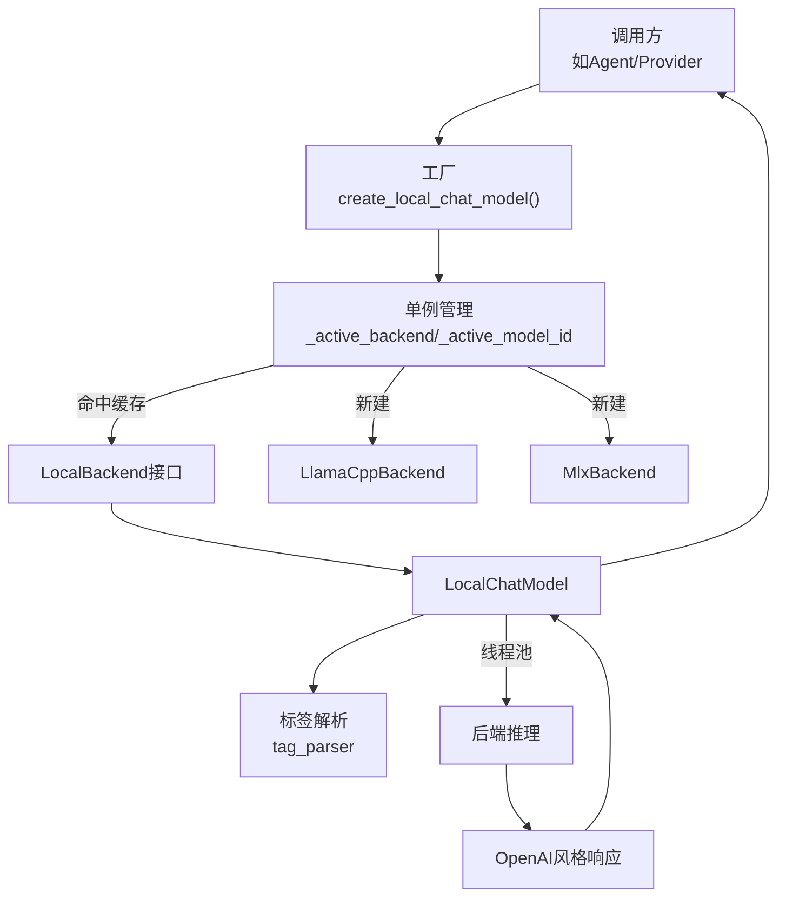
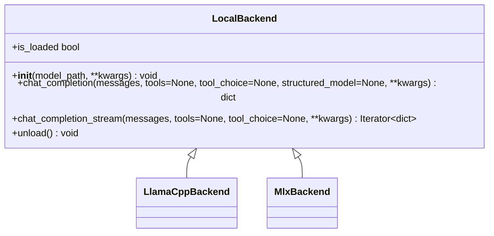
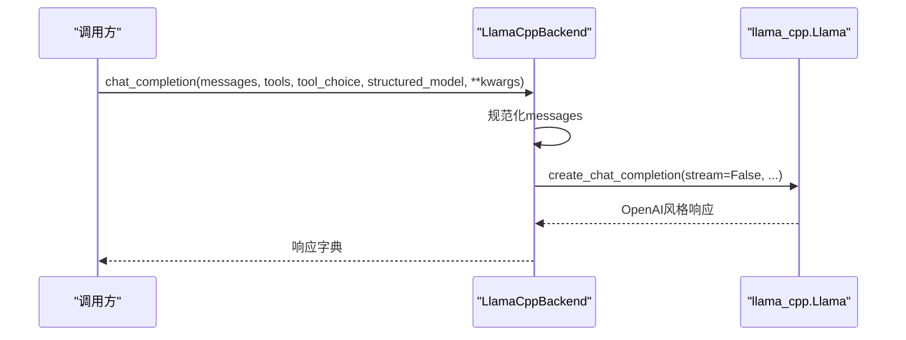
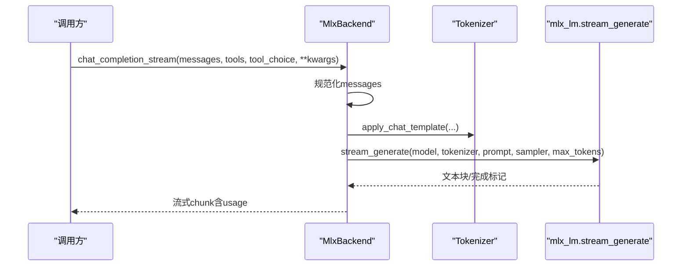
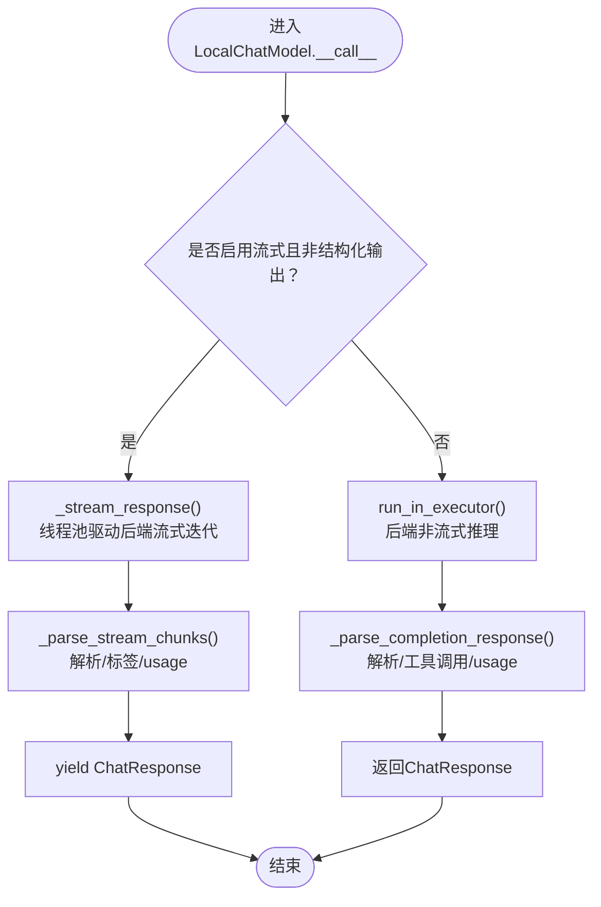
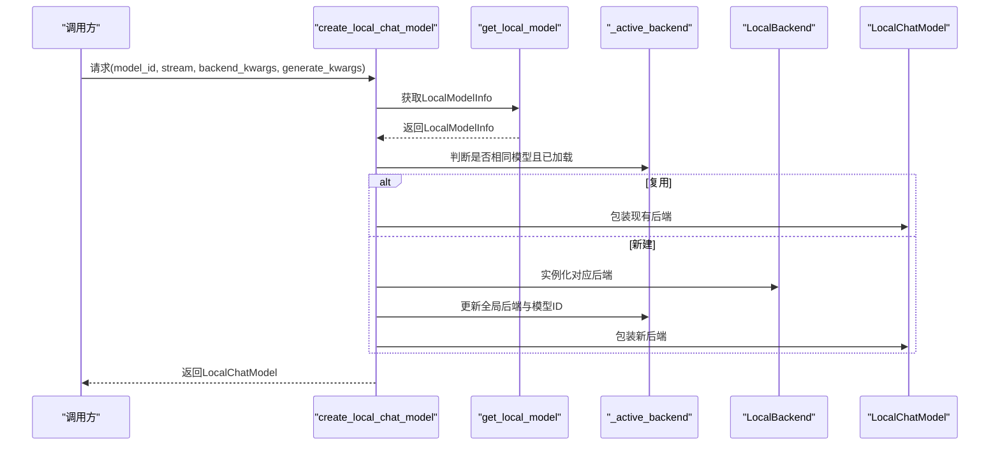
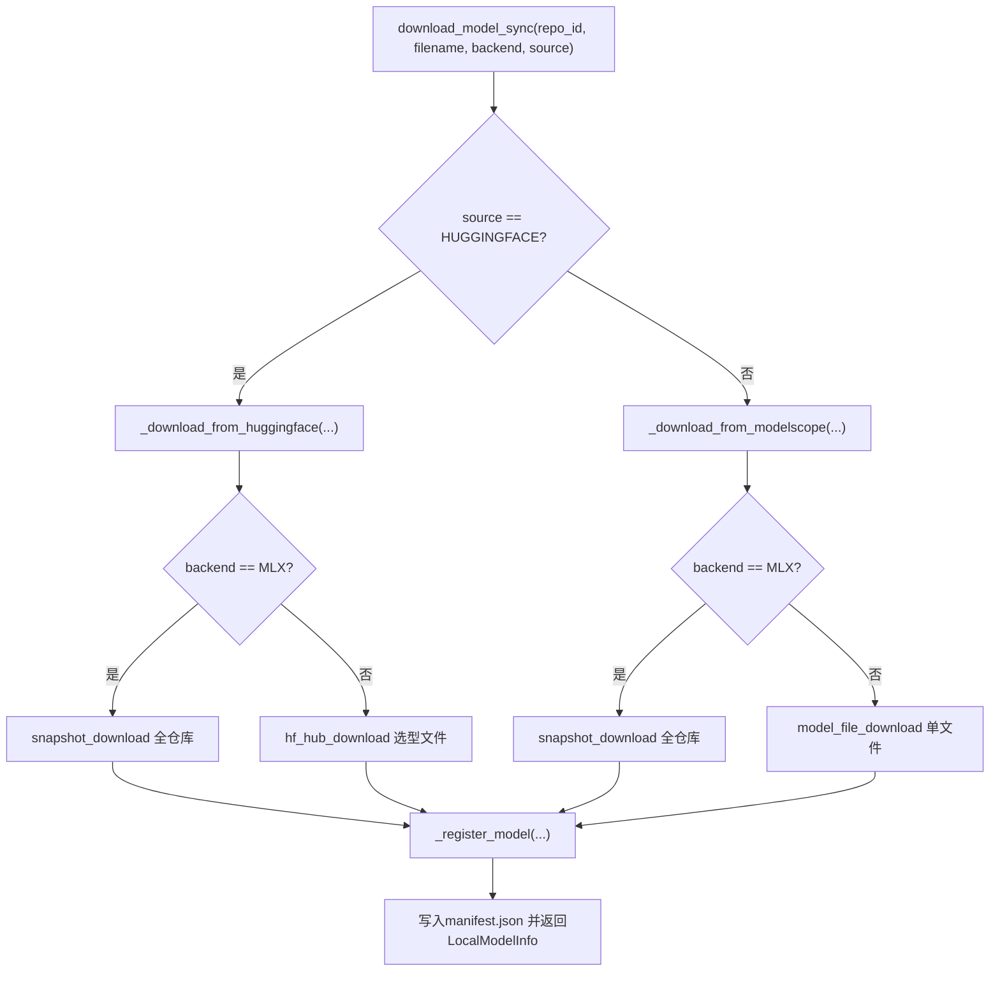
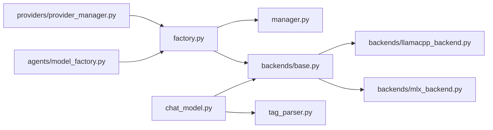

# 后端实现集成

<cite>
**本文引用的文件**
- [src/copaw/local_models/backends/base.py](file://src/copaw/local_models/backends/base.py)
- [src/copaw/local_models/backends/llamacpp_backend.py](file://src/copaw/local_models/backends/llamacpp_backend.py)
- [src/copaw/local_models/backends/mlx_backend.py](file://src/copaw/local_models/backends/mlx_backend.py)
- [src/copaw/local_models/chat_model.py](file://src/copaw/local_models/chat_model.py)
- [src/copaw/local_models/factory.py](file://src/copaw/local_models/factory.py)
- [src/copaw/local_models/manager.py](file://src/copaw/local_models/manager.py)
- [src/copaw/local_models/schema.py](file://src/copaw/local_models/schema.py)
- [src/copaw/local_models/tag_parser.py](file://src/copaw/local_models/tag_parser.py)
- [src/copaw/agents/model_factory.py](file://src/copaw/agents/model_factory.py)
- [src/copaw/providers/provider_manager.py](file://src/copaw/providers/provider_manager.py)
</cite>

## 目录
1. [引言](#引言)
2. [项目结构](#项目结构)
3. [核心组件](#核心组件)
4. [架构总览](#架构总览)
5. [详细组件分析](#详细组件分析)
6. [依赖分析](#依赖分析)
7. [性能考量](#性能考量)
8. [故障排查指南](#故障排查指南)
9. [结论](#结论)
10. [附录](#附录)

## 引言
本文件面向CoPaw本地模型后端实现系统，系统性阐述llama.cpp后端、MLX后端与通用后端基类的设计理念与实现细节。内容覆盖初始化流程、模型加载机制、推理调用接口、资源管理、抽象层统一化、错误处理策略，并给出后端选择、参数配置与结果处理的操作示例。同时讨论各后端的性能特征、适用场景、资源消耗与后端切换、兼容性与故障恢复等高级能力。

## 项目结构
本地模型子系统位于src/copaw/local_models目录，围绕“后端抽象层—工厂—聊天模型封装—下载与清单管理—标签解析”构建，形成清晰的分层与职责边界。

**图表来源**
- [src/copaw/local_models/schema.py:1-59](file://src/copaw/local_models/schema.py#L1-L59)
- [src/copaw/local_models/backends/base.py:1-64](file://src/copaw/local_models/backends/base.py#L1-L64)
- [src/copaw/local_models/backends/llamacpp_backend.py:1-140](file://src/copaw/local_models/backends/llamacpp_backend.py#L1-L140)
- [src/copaw/local_models/backends/mlx_backend.py:1-236](file://src/copaw/local_models/backends/mlx_backend.py#L1-L236)
- [src/copaw/local_models/chat_model.py:1-362](file://src/copaw/local_models/chat_model.py#L1-L362)
- [src/copaw/local_models/factory.py:1-125](file://src/copaw/local_models/factory.py#L1-L125)
- [src/copaw/local_models/manager.py:1-413](file://src/copaw/local_models/manager.py#L1-L413)
- [src/copaw/local_models/tag_parser.py:1-293](file://src/copaw/local_models/tag_parser.py#L1-L293)

**章节来源**
- [src/copaw/local_models/schema.py:1-59](file://src/copaw/local_models/schema.py#L1-L59)
- [src/copaw/local_models/backends/base.py:1-64](file://src/copaw/local_models/backends/base.py#L1-L64)
- [src/copaw/local_models/backends/llamacpp_backend.py:1-140](file://src/copaw/local_models/backends/llamacpp_backend.py#L1-L140)
- [src/copaw/local_models/backends/mlx_backend.py:1-236](file://src/copaw/local_models/backends/mlx_backend.py#L1-L236)
- [src/copaw/local_models/chat_model.py:1-362](file://src/copaw/local_models/chat_model.py#L1-L362)
- [src/copaw/local_models/factory.py:1-125](file://src/copaw/local_models/factory.py#L1-L125)
- [src/copaw/local_models/manager.py:1-413](file://src/copaw/local_models/manager.py#L1-L413)
- [src/copaw/local_models/tag_parser.py:1-293](file://src/copaw/local_models/tag_parser.py#L1-L293)

## 核心组件
- 抽象后端基类：定义统一的初始化、非流式/流式推理、卸载与状态查询接口，屏蔽底层库差异。
- llama.cpp后端：基于llama-cpp-python，支持工具调用、结构化输出（通过JSON Schema）、消息规范化与GPU/CPU上下文控制。
- MLX后端：基于mlx-lm，针对Apple Silicon优化，支持聊天模板、采样器参数映射、结构化输出提示注入。
- LocalChatModel：将LocalBackend适配到agentscope的ChatModelBase接口，异步包装同步后端，支持流式与非流式两种模式。
- 工厂与单例：按模型ID创建或复用后端实例，自动卸载旧模型，保证资源占用可控。
- 下载与清单：从Hugging Face或ModelScope下载模型，注册到清单，支持GGUF与safetensors两类格式。
- 标签解析：从文本中提取<think>与<tool_call>...</tool_call>工具调用标签，兼容后端未直接返回结构化字段的场景。

**章节来源**
- [src/copaw/local_models/backends/base.py:12-64](file://src/copaw/local_models/backends/base.py#L12-L64)
- [src/copaw/local_models/backends/llamacpp_backend.py:45-140](file://src/copaw/local_models/backends/llamacpp_backend.py#L45-L140)
- [src/copaw/local_models/backends/mlx_backend.py:57-236](file://src/copaw/local_models/backends/mlx_backend.py#L57-L236)
- [src/copaw/local_models/chat_model.py:39-362](file://src/copaw/local_models/chat_model.py#L39-L362)
- [src/copaw/local_models/factory.py:22-125](file://src/copaw/local_models/factory.py#L22-L125)
- [src/copaw/local_models/manager.py:94-413](file://src/copaw/local_models/manager.py#L94-L413)
- [src/copaw/local_models/tag_parser.py:197-293](file://src/copaw/local_models/tag_parser.py#L197-L293)

## 架构总览
下图展示了从上层调用到后端执行的关键路径，以及关键对象之间的依赖关系。

**图表来源**
- [src/copaw/local_models/factory.py:42-125](file://src/copaw/local_models/factory.py#L42-L125)
- [src/copaw/local_models/backends/base.py:12-64](file://src/copaw/local_models/backends/base.py#L12-L64)
- [src/copaw/local_models/backends/llamacpp_backend.py:45-140](file://src/copaw/local_models/backends/llamacpp_backend.py#L45-L140)
- [src/copaw/local_models/backends/mlx_backend.py:57-236](file://src/copaw/local_models/backends/mlx_backend.py#L57-L236)
- [src/copaw/local_models/chat_model.py:39-362](file://src/copaw/local_models/chat_model.py#L39-L362)
- [src/copaw/local_models/tag_parser.py:197-293](file://src/copaw/local_models/tag_parser.py#L197-L293)

## 详细组件分析

### 抽象后端基类（LocalBackend）
- 设计目标：对不同推理引擎（llama.cpp、MLX等）暴露一致的接口，便于上层统一调用。
- 关键方法：
  - 初始化：接收模型路径与后端特定参数（如上下文大小、GPU层数、采样参数等）。
  - 非流式推理：返回OpenAI风格的完整响应字典（包含choices与usage）。
  - 流式推理：逐块产出OpenAI风格的chunk字典。
  - 卸载：释放显存/内存资源。
  - 状态：指示当前是否已加载并可推理。
- 统一化策略：通过消息规范化、工具调用与结构化输出的桥接，隐藏不同后端在输入/输出格式上的差异。

**图表来源**
- [src/copaw/local_models/backends/base.py:12-64](file://src/copaw/local_models/backends/base.py#L12-L64)
- [src/copaw/local_models/backends/llamacpp_backend.py:45-140](file://src/copaw/local_models/backends/llamacpp_backend.py#L45-L140)
- [src/copaw/local_models/backends/mlx_backend.py:57-236](file://src/copaw/local_models/backends/mlx_backend.py#L57-L236)

**章节来源**
- [src/copaw/local_models/backends/base.py:12-64](file://src/copaw/local_models/backends/base.py#L12-L64)

### llama.cpp后端（LlamaCppBackend）
- 初始化参数：模型路径、上下文长度、GPU层数、是否启用详细日志、聊天格式等。
- 消息规范化：将多模态内容合并为纯文本，确保工具调用字段为列表或移除None值，避免模板渲染异常。
- 推理接口：
  - 非流式：传入messages、tools/tool_choice、结构化输出Schema（通过response_format）。
  - 流式：同上，但以迭代器形式逐块返回。
- 资源管理：卸载时删除底层Llama对象，记录日志。
- 兼容性：支持OpenAI风格的工具调用与结构化输出；对chat_format进行透传。

**图表来源**
- [src/copaw/local_models/backends/llamacpp_backend.py:86-112](file://src/copaw/local_models/backends/llamacpp_backend.py#L86-L112)

**章节来源**
- [src/copaw/local_models/backends/llamacpp_backend.py:45-140](file://src/copaw/local_models/backends/llamacpp_backend.py#L45-L140)

### MLX后端（MlxBackend）
- 初始化参数：模型路径、最大生成长度等；内部解析目录型模型路径。
- 提示构建：使用tokenizer的apply_chat_template生成prompt字符串，必要时注入工具信息。
- 推理接口：
  - 非流式：通过stream_generate累积文本，构造OpenAI风格响应。
  - 流式：逐块产出delta，最终附加usage。
- 结构化输出：MLX不原生支持结构化输出，通过在提示末尾追加JSON Schema指令实现约束。
- 采样器映射：将temperature/Top-p/Min-p/Top-k等参数映射为MLX的采样器。
- 资源管理：卸载时删除模型与分词器对象。

**图表来源**
- [src/copaw/local_models/backends/mlx_backend.py:175-224](file://src/copaw/local_models/backends/mlx_backend.py#L175-L224)

**章节来源**
- [src/copaw/local_models/backends/mlx_backend.py:57-236](file://src/copaw/local_models/backends/mlx_backend.py#L57-L236)

### LocalChatModel（统一适配层）
- 角色定位：将LocalBackend适配到agentscope的ChatModelBase接口，支持同步后端在异步环境中的使用。
- 流式与非流式：
  - 流式：在后台线程驱动后端的同步迭代器，通过asyncio.Queue向异步消费者推送。
  - 非流式：在线程池中执行后端推理，再解析为ChatResponse。
- 内容解析：
  - 支持reasoning_content与<think>标签的双重提取逻辑。
  - 支持tool_calls与<tool_call>...</tool_call>标签的双重解析，优先结构化字段，回退到文本标签。
  - 对JSON参数进行安全解析，避免解析失败导致中断。
- 使用线程池：避免阻塞事件循环，提升并发体验。

**图表来源**
- [src/copaw/local_models/chat_model.py:58-258](file://src/copaw/local_models/chat_model.py#L58-L258)
- [src/copaw/local_models/tag_parser.py:197-293](file://src/copaw/local_models/tag_parser.py#L197-L293)

**章节来源**
- [src/copaw/local_models/chat_model.py:39-362](file://src/copaw/local_models/chat_model.py#L39-L362)
- [src/copaw/local_models/tag_parser.py:1-293](file://src/copaw/local_models/tag_parser.py#L1-L293)

### 工厂与单例（create_local_chat_model）
- 单例策略：全局持有当前已加载的后端与模型ID，若请求相同模型则直接复用，不同模型则先卸载旧后端再加载新后端。
- 参数透传：支持向后端构造函数传递n_ctx/n_gpu_layers等参数，向每次生成传递temperature/top_p等采样参数。
- 错误处理：找不到模型时抛出ValueError；后端库未安装时抛出ImportError并提示安装命令。
- 返回封装：返回LocalChatModel实例，供上层直接调用。

**图表来源**
- [src/copaw/local_models/factory.py:42-125](file://src/copaw/local_models/factory.py#L42-L125)
- [src/copaw/local_models/manager.py:63-67](file://src/copaw/local_models/manager.py#L63-L67)

**章节来源**
- [src/copaw/local_models/factory.py:22-125](file://src/copaw/local_models/factory.py#L22-L125)
- [src/copaw/local_models/manager.py:63-67](file://src/copaw/local_models/manager.py#L63-L67)

### 下载与清单管理（LocalModelManager）
- 下载来源：支持Hugging Face与ModelScope；MLX模型强制全仓库快照下载，确保config.json与safetensors齐全。
- 文件选择：llama.cpp自动选择GGUF文件，优先Q4_K_M量化；MLX自动选择safetensors文件。
- 清单注册：写入manifest.json，记录模型唯一ID、仓库ID、文件名、后端类型、来源、文件大小与本地绝对路径。
- 删除与校验：删除模型文件/目录并清理空目录；MLX目录完整性校验（必需文件与至少一个safetensors文件）。

**图表来源**
- [src/copaw/local_models/manager.py:98-292](file://src/copaw/local_models/manager.py#L98-L292)

**章节来源**
- [src/copaw/local_models/manager.py:94-413](file://src/copaw/local_models/manager.py#L94-L413)

### 标签解析（tag_parser）
- 功能：从模型输出文本中提取<think>思维标签与<tool_call>...</tool_call>工具调用标签，支持XML与JSON两种工具调用格式。
- 场景：当后端未直接返回结构化字段时，通过文本标签回填内容块与工具调用。
- 安全解析：对JSON参数进行安全解析，避免异常中断；对缺失字段发出告警。

**章节来源**
- [src/copaw/local_models/tag_parser.py:197-293](file://src/copaw/local_models/tag_parser.py#L197-L293)

## 依赖分析
- 组件耦合：
  - LocalChatModel强依赖LocalBackend接口，弱依赖具体实现（llama.cpp/MLX），通过工厂解耦。
  - 工厂依赖清单管理器获取模型元数据，决定后端类型与加载路径。
  - 标签解析独立于后端，仅作为内容解析的补充手段。
- 外部依赖：
  - llama.cpp后端依赖llama-cpp-python；MLX后端依赖mlx-lm；下载功能依赖huggingface_hub或modelscope。
- 循环依赖：未发现循环导入；模块间为单向依赖。

**图表来源**
- [src/copaw/local_models/factory.py:10-125](file://src/copaw/local_models/factory.py#L10-L125)
- [src/copaw/local_models/manager.py:12-413](file://src/copaw/local_models/manager.py#L12-L413)
- [src/copaw/local_models/backends/base.py:6-64](file://src/copaw/local_models/backends/base.py#L6-L64)
- [src/copaw/local_models/backends/llamacpp_backend.py:11-140](file://src/copaw/local_models/backends/llamacpp_backend.py#L11-L140)
- [src/copaw/local_models/backends/mlx_backend.py:12-236](file://src/copaw/local_models/backends/mlx_backend.py#L12-L236)
- [src/copaw/local_models/chat_model.py:20-362](file://src/copaw/local_models/chat_model.py#L20-L362)
- [src/copaw/local_models/tag_parser.py:1-293](file://src/copaw/local_models/tag_parser.py#L1-L293)
- [src/copaw/providers/provider_manager.py:1115-1126](file://src/copaw/providers/provider_manager.py#L1115-L1126)
- [src/copaw/agents/model_factory.py:333-338](file://src/copaw/agents/model_factory.py#L333-L338)

**章节来源**
- [src/copaw/local_models/factory.py:10-125](file://src/copaw/local_models/factory.py#L10-L125)
- [src/copaw/local_models/manager.py:12-413](file://src/copaw/local_models/manager.py#L12-L413)
- [src/copaw/local_models/chat_model.py:20-362](file://src/copaw/local_models/chat_model.py#L20-L362)
- [src/copaw/providers/provider_manager.py:1115-1126](file://src/copaw/providers/provider_manager.py#L1115-L1126)
- [src/copaw/agents/model_factory.py:333-338](file://src/copaw/agents/model_factory.py#L333-L338)

## 性能考量
- llama.cpp后端
  - 优势：成熟的推理引擎，支持GPU加速（n_gpu_layers）、灵活上下文长度（n_ctx），适合大模型与复杂对话。
  - 注意：显存占用与n_ctx、n_gpu_layers密切相关；建议根据设备显存调整参数。
- MLX后端
  - 优势：针对Apple Silicon高度优化，推理延迟低、能耗友好；天然支持流式生成。
  - 注意：需完整仓库（safetensors+config）以发挥最佳性能；采样参数需按MLX规范映射。
- 统一适配层
  - 流式通过线程池驱动同步迭代器，避免阻塞事件循环；非流式同样在后台线程执行，减少主线程等待。
- 资源管理
  - 工厂单例避免重复加载；卸载主动释放显存/内存；删除模型时清理空目录，保持磁盘整洁。

[本节为通用性能讨论，无需列出章节来源]

## 故障排查指南
- 无法导入后端库
  - 症状：ImportError提示缺少llama-cpp-python或mlx-lm。
  - 处理：按照提示安装相应可选依赖（例如copaw[llamacpp]或copaw[mlx]）。
  - 参考位置：后端构造函数内抛出的ImportError。
- 模型未找到
  - 症状：ValueError提示模型ID不存在。
  - 处理：先通过下载管理器下载模型，再创建LocalChatModel。
  - 参考位置：工厂中对get_local_model返回None的处理。
- MLX模型不完整
  - 症状：RuntimeError提示缺少必需文件或safetensors文件。
  - 处理：删除目录后重新下载完整仓库快照。
  - 参考位置：MLX目录校验逻辑。
- 流式解析异常
  - 症状：标签解析失败或JSON参数解析异常。
  - 处理：检查后端输出格式；确保<think>/<tool_call>标签闭合；关注日志告警。
  - 参考位置：标签解析的安全解析与告警逻辑。

**章节来源**
- [src/copaw/local_models/backends/llamacpp_backend.py:58-63](file://src/copaw/local_models/backends/llamacpp_backend.py#L58-L63)
- [src/copaw/local_models/backends/mlx_backend.py:66-72](file://src/copaw/local_models/backends/mlx_backend.py#L66-L72)
- [src/copaw/local_models/factory.py:70-75](file://src/copaw/local_models/factory.py#L70-L75)
- [src/copaw/local_models/manager.py:332-361](file://src/copaw/local_models/manager.py#L332-L361)
- [src/copaw/local_models/tag_parser.py:157-189](file://src/copaw/local_models/tag_parser.py#L157-L189)

## 结论
该本地模型后端系统通过抽象基类统一接口、工厂单例管理资源、聊天模型封装异步调用、下载与清单保障可用性，形成了高内聚、低耦合的本地推理体系。llama.cpp与MLX两大后端分别覆盖跨平台与Apple Silicon场景，配合标签解析与结构化输出桥接，满足多样化的推理需求。通过合理的参数配置与资源管理策略，可在不同硬件与任务负载下取得良好性能与稳定性。

[本节为总结性内容，无需列出章节来源]

## 附录

### 使用示例（操作流程）
- 选择后端与配置参数
  - 通过工厂创建LocalChatModel，传入model_id、stream开关与generate_kwargs（如温度、top_p、最大生成长度等）。
  - 若需要后端特定参数（如llama.cpp的n_ctx、n_gpu_layers），在backend_kwargs中传入。
  - 参考位置：工厂创建与参数透传。
- 处理推理结果
  - 流式：遍历异步生成器，逐步得到ChatResponse，其中包含文本、思维与工具调用内容块及usage统计。
  - 非流式：一次性得到完整ChatResponse。
  - 参考位置：LocalChatModel的流式与非流式分支。
- 后端切换与兼容性
  - 不同模型会触发工厂卸载旧后端并加载新后端；若同一模型则复用已加载实例。
  - 若后端未返回结构化字段，系统自动回退到文本标签解析。
  - 参考位置：工厂单例逻辑与LocalChatModel解析分支。

**章节来源**
- [src/copaw/local_models/factory.py:42-107](file://src/copaw/local_models/factory.py#L42-L107)
- [src/copaw/local_models/chat_model.py:58-362](file://src/copaw/local_models/chat_model.py#L58-L362)
- [src/copaw/agents/model_factory.py:333-338](file://src/copaw/agents/model_factory.py#L333-L338)
- [src/copaw/providers/provider_manager.py:1119-1124](file://src/copaw/providers/provider_manager.py#L1119-L1124)