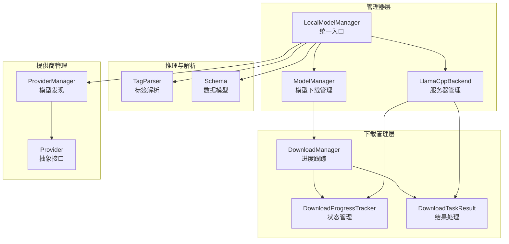
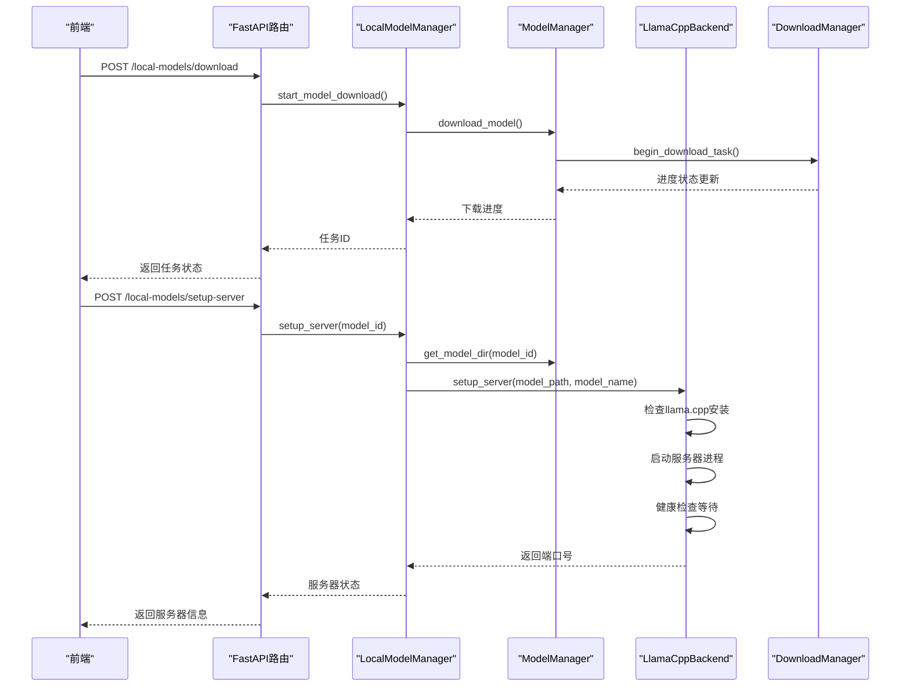
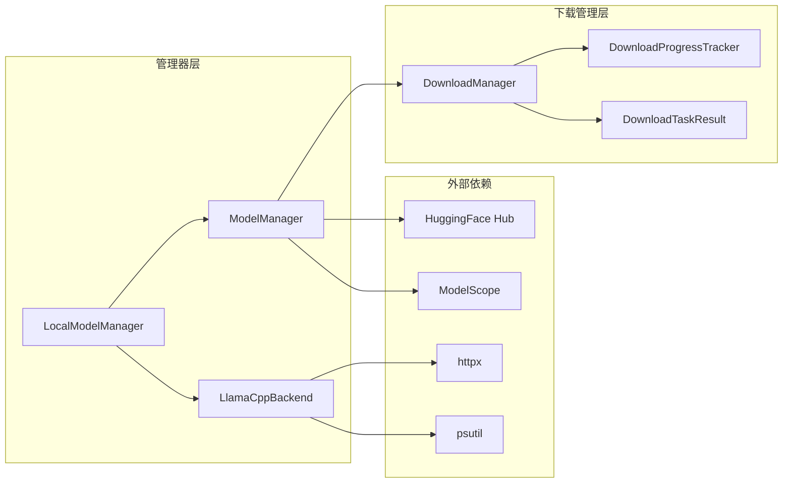

# 本地模型推理

<cite>
**本文引用的文件**
- [src/copaw/local_models/manager.py](file://src/copaw/local_models/manager.py)
- [src/copaw/local_models/model_manager.py](file://src/copaw/local_models/model_manager.py)
- [src/copaw/local_models/llamacpp.py](file://src/copaw/local_models/llamacpp.py)
- [src/copaw/local_models/tag_parser.py](file://src/copaw/local_models/tag_parser.py)
- [src/copaw/local_models/download_manager.py](file://src/copaw/local_models/download_manager.py)
- [src/copaw/providers/provider_manager.py](file://src/copaw/providers/provider_manager.py)
- [src/copaw/providers/provider.py](file://src/copaw/providers/provider.py)
- [src/copaw/app/routers/local_models.py](file://src/copaw/app/routers/local_models.py)
- [src/copaw/app/routers/providers.py](file://src/copaw/app/routers/providers.py)
- [src/copaw/constant.py](file://src/copaw/constant.py)
- [console/src/api/modules/localModel.ts](file://console/src/api/modules/localModel.ts)
- [console/src/pages/Settings/Models/index.tsx](file://console/src/pages/Settings/Models/index.tsx)
</cite>

## 更新摘要
**所做更改**
- 更新了模型管理器重构后的架构说明
- 新增了LlamaCppBackend的详细实现分析
- 完善了LocalModelManager的职责边界说明
- 更新了下载管理器的进度跟踪机制
- 增强了模型推荐和下载流程的描述

## 目录
1. [简介](#简介)
2. [项目结构](#项目结构)
3. [核心组件](#核心组件)
4. [架构总览](#架构总览)
5. [详细组件分析](#详细组件分析)
6. [依赖分析](#依赖分析)
7. [性能考量](#性能考量)
8. [故障排查指南](#故障排查指南)
9. [结论](#结论)
10. [附录](#附录)

## 简介
本技术文档面向CoPaw本地模型推理系统，聚焦以下关键能力：
- **重构后的模型管理器**：LocalModelManager作为统一入口，整合ModelManager和LlamaCppBackend的功能
- **LlamaCppBackend深度重构**：独立的llama.cpp服务器管理、进程控制和健康检查机制
- **增强的下载管理器**：统一的下载进度跟踪、状态管理和结果处理
- **智能模型推荐**：基于硬件资源的模型选择策略
- **并发安全的服务器生命周期管理**：异步锁保护的服务器启动和停止流程

## 项目结构
本地模型推理系统经过重构后，采用"管理器层 + 后端实现层 + 下载管理层"的三层架构：

**图表来源**
- [src/copaw/local_models/manager.py:14-126](file://src/copaw/local_models/manager.py#L14-L126)
- [src/copaw/local_models/model_manager.py:60-675](file://src/copaw/local_models/model_manager.py#L60-L675)
- [src/copaw/local_models/llamacpp.py:79-818](file://src/copaw/local_models/llamacpp.py#L79-L818)
- [src/copaw/local_models/download_manager.py:65-279](file://src/copaw/local_models/download_manager.py#L65-L279)

## 核心组件

### LocalModelManager：重构后的统一入口
**更新** LocalModelManager现在作为真正的统一入口，整合了原有的多个职责：
- **模型管理**：委托给ModelManager处理下载、删除、查询等操作
- **服务器管理**：委托给LlamaCppBackend处理llama.cpp服务器的启动、停止、健康检查
- **并发控制**：使用asyncio.Lock确保服务器生命周期操作的原子性
- **配置管理**：支持自定义llama.cpp服务器的基础URL和发布标签

### LlamaCppBackend：独立的服务器管理器
**新增** LlamaCppBackend现在是一个完整的服务器管理实现：
- **环境检测**：自动识别操作系统、架构和CUDA版本
- **文件下载**：支持跨平台的llama.cpp二进制文件下载和解压
- **进程管理**：完整的服务器进程生命周期管理，包括优雅关闭
- **健康检查**：基于HTTP健康检查的服务器就绪状态监控
- **日志处理**：异步日志流处理和错误追踪

### ModelManager：增强的模型下载管理
**更新** ModelManager现在专注于模型下载和管理：
- **多源下载**：支持HuggingFace和ModelScope双源下载，自动故障转移
- **进度跟踪**：基于磁盘使用量的实时进度监控
- **进程隔离**：使用多进程隔离下载任务，避免阻塞主线程
- **智能估算**：基于仓库元数据的下载大小估算
- **临时文件管理**：完整的临时文件清理和最终文件提升机制

### DownloadManager：统一的下载状态管理
**新增** DownloadManager提供了完整的下载状态管理基础设施：
- **状态枚举**：标准化的下载生命周期状态管理
- **进度追踪器**：线程安全的进度状态追踪和计算
- **结果应用**：统一的下载结果处理和状态转换
- **速度计算**：基于时间戳的实时下载速度计算

**章节来源**
- [src/copaw/local_models/manager.py:14-126](file://src/copaw/local_models/manager.py#L14-L126)
- [src/copaw/local_models/llamacpp.py:79-818](file://src/copaw/local_models/llamacpp.py#L79-L818)
- [src/copaw/local_models/model_manager.py:60-675](file://src/copaw/local_models/model_manager.py#L60-L675)
- [src/copaw/local_models/download_manager.py:65-279](file://src/copaw/local_models/download_manager.py#L65-L279)

## 架构总览
重构后的系统采用更清晰的分层架构，每个组件都有明确的职责边界：

**图表来源**
- [src/copaw/app/routers/local_models.py:1-320](file://src/copaw/app/routers/local_models.py#L1-L320)
- [src/copaw/local_models/manager.py:102-117](file://src/copaw/local_models/manager.py#L102-L117)
- [src/copaw/local_models/llamacpp.py:186-258](file://src/copaw/local_models/llamacpp.py#L186-L258)

## 详细组件分析

### LocalModelManager：重构后的统一管理器
LocalModelManager现在承担着系统的核心协调职责：

**主要职责**：
- **委派模式**：将具体功能委派给ModelManager和LlamaCppBackend
- **并发控制**：使用asyncio.Lock保护服务器生命周期操作
- **配置注入**：支持自定义llama.cpp服务器的下载配置
- **状态查询**：提供统一的状态查询接口

**关键方法**：
- `check_llamacpp_installation()`：检查llama.cpp服务器安装状态
- `setup_server()`：启动指定模型的llama.cpp服务器
- `shutdown_server()`：优雅关闭当前运行的服务器
- `get_recommended_models()`：基于硬件资源推荐合适的模型

**章节来源**
- [src/copaw/local_models/manager.py:14-126](file://src/copaw/local_models/manager.py#L14-L126)

### LlamaCppBackend：独立的服务器管理实现
LlamaCppBackend现在是一个完整的服务器管理解决方案：

**环境检测机制**：
- `_resolve_os_name()`：自动检测操作系统类型
- `_resolve_arch()`：识别CPU架构(x64/arm64)
- `_resolve_cuda_version()`：检测Windows CUDA版本兼容性
- `_resolve_backend()`：选择CPU或CUDA后端

**服务器生命周期管理**：
- `setup_server()`：启动服务器进程，处理重定向和错误
- `shutdown_server()`：优雅关闭，支持超时和强制终止
- `server_ready()`：基于HTTP健康检查的就绪状态验证
- `_create_server_process()`：异步子进程创建，支持Windows回退

**下载管理**：
- `_start_download()`：后台线程下载llama.cpp二进制文件
- `_download_sync()`：同步下载和解压流程
- `_extract_archive()`：智能归档文件提取和合并
- `_merge_extracted_content()`：处理不同归档格式的文件合并

**章节来源**
- [src/copaw/local_models/llamacpp.py:79-818](file://src/copaw/local_models/llamacpp.py#L79-L818)

### ModelManager：增强的模型下载管理
ModelManager现在专注于模型下载和管理的核心逻辑：

**智能下载源选择**：
- `_resolve_download_source()`：优先使用HuggingFace，失败时自动切换到ModelScope
- `_estimate_download_size()`：基于仓库元数据估算下载大小
- `_probe_huggingface()`：网络连通性探测

**进程隔离下载**：
- `_download_worker()`：在独立进程中执行下载任务
- `_monitor_download()`：监控下载进程状态和进度
- `_promote_staging_directory()`：将临时下载目录提升为最终目录

**模型管理功能**：
- `get_recommended_models()`：基于内存容量推荐合适大小的模型
- `list_downloaded_models()`：扫描并列出所有已下载的模型
- `remove_downloaded_model()`：安全删除模型文件和空目录

**章节来源**
- [src/copaw/local_models/model_manager.py:60-675](file://src/copaw/local_models/model_manager.py#L60-L675)

### DownloadManager：统一的下载状态管理
DownloadManager提供了完整的下载状态管理基础设施：

**状态枚举系统**：
- `DownloadTaskStatus`：标准化的下载生命周期状态
- 支持IDLE、PENDING、DOWNLOADING、CANCELING、COMPLETED、FAILED、CANCELLED状态

**进度追踪器**：
- `DownloadProgressTracker`：线程安全的状态追踪和计算
- 实时计算下载速度，支持字节级别的精确追踪
- 线程锁保护的并发访问

**结果处理**：
- `DownloadTaskResult`：标准化的下载结果数据结构
- `apply_download_result()`：统一的应用下载结果处理逻辑
- 支持成功、失败、取消等不同结果类型的处理

**章节来源**
- [src/copaw/local_models/download_manager.py:65-279](file://src/copaw/local_models/download_manager.py#L65-L279)

### ProviderManager：模型发现与选择逻辑
ProviderManager保持原有功能，但现在与重构后的本地模型系统更好地集成：

**内置提供商支持**：OpenAI、Azure OpenAI、DashScope、ModelScope、Gemini、Anthropic、MiniMax、Kimi、DeepSeek、Ollama、LM Studio、llama.cpp、MLX等

**活动模型槽位管理**：支持全局或代理特定的Provider/Model组合配置

**章节来源**
- [src/copaw/providers/provider_manager.py:573-800](file://src/copaw/providers/provider_manager.py#L573-L800)

## 依赖分析
重构后的依赖关系更加清晰，每个组件都有明确的职责边界：

**图表来源**
- [src/copaw/local_models/manager.py:22-35](file://src/copaw/local_models/manager.py#L22-L35)
- [src/copaw/local_models/model_manager.py:434-454](file://src/copaw/local_models/model_manager.py#L434-L454)
- [src/copaw/local_models/llamacpp.py:20-31](file://src/copaw/local_models/llamacpp.py#L20-L31)

## 性能考量
重构后的系统在性能方面有显著改进：

**并发安全的服务器管理**：
- 使用`asyncio.Lock`确保服务器启动和停止的原子性
- 防止并发服务器操作导致的状态冲突
- 支持优雅的服务器重启和故障恢复

**高效的下载管理**：
- 多进程隔离下载任务，避免阻塞主线程
- 基于磁盘使用量的实时进度监控，减少网络请求
- 智能的下载源选择和故障转移机制

**资源优化**：
- LlamaCppBackend自动检测CUDA版本，选择最优后端
- 智能的模型推荐基于硬件资源容量
- 完整的临时文件清理机制，避免磁盘空间浪费

**章节来源**
- [src/copaw/local_models/manager.py:35-36](file://src/copaw/local_models/manager.py#L35-L36)
- [src/copaw/local_models/llamacpp.py:781-794](file://src/copaw/local_models/llamacpp.py#L781-L794)
- [src/copaw/local_models/model_manager.py:77-128](file://src/copaw/local_models/model_manager.py#L77-L128)

## 故障排查指南
重构后的系统提供了更好的错误处理和诊断能力：

**服务器启动问题**：
- 检查llama.cpp二进制文件是否存在和可执行
- 验证端口可用性和防火墙设置
- 查看服务器日志输出获取详细错误信息

**下载失败排查**：
- 确认网络连通性和代理设置
- 检查磁盘空间和权限
- 验证模型ID的正确性和仓库可见性

**并发冲突问题**：
- 确保服务器操作使用异步锁保护
- 避免同时进行服务器启动和停止操作
- 检查进程状态和僵尸进程清理

**性能问题诊断**：
- 监控下载速度和带宽使用
- 检查CPU和内存使用情况
- 分析日志中的性能瓶颈

**章节来源**
- [src/copaw/local_models/llamacpp.py:535-570](file://src/copaw/local_models/llamacpp.py#L535-L570)
- [src/copaw/local_models/model_manager.py:225-262](file://src/copaw/local_models/model_manager.py#L225-L262)

## 结论
CoPaw本地模型推理系统经过重构后，实现了更清晰的架构分离和更强的功能集成。LocalModelManager作为统一入口，有效整合了ModelManager和LlamaCppBackend的优势，提供了更加稳定和高效的本地模型推理体验。新的LlamaCppBackend实现了完整的服务器管理功能，而增强的DownloadManager则提供了可靠的下载状态管理。这些改进使得系统在易用性、性能和可靠性方面都得到了显著提升。

## 附录
- **数据模型**：LocalModelInfo、DownloadProgress、DownloadTaskResult等
- **状态枚举**：DownloadTaskStatus、BackendType等
- **路径配置**：DEFAULT_LOCAL_PROVIDER_DIR、模型存储路径等

**章节来源**
- [src/copaw/local_models/model_manager.py:43-58](file://src/copaw/local_models/model_manager.py#L43-L58)
- [src/copaw/local_models/download_manager.py:13-63](file://src/copaw/local_models/download_manager.py#L13-L63)
- [src/copaw/constant.py:132-156](file://src/copaw/constant.py#L132-L156)