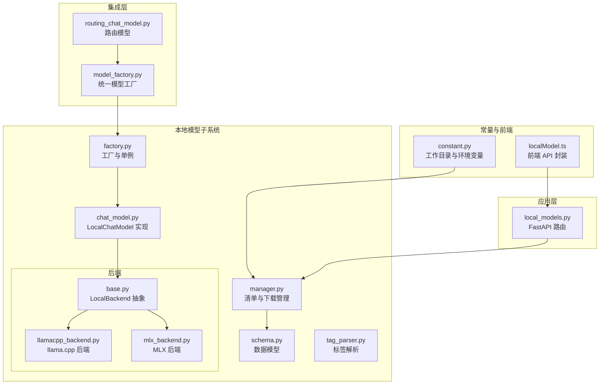
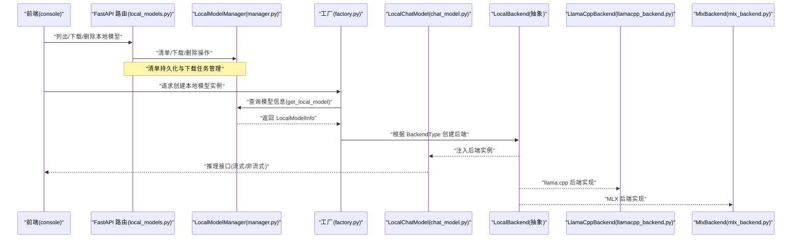
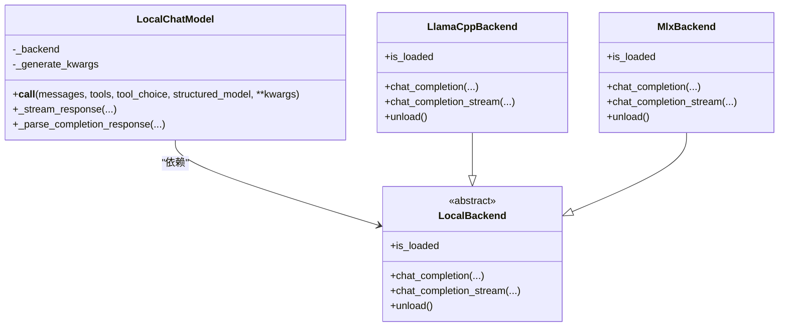
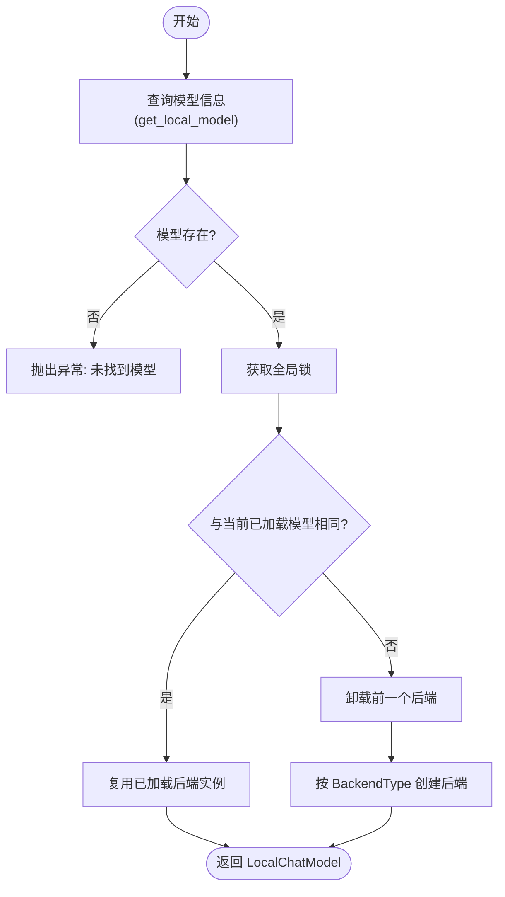
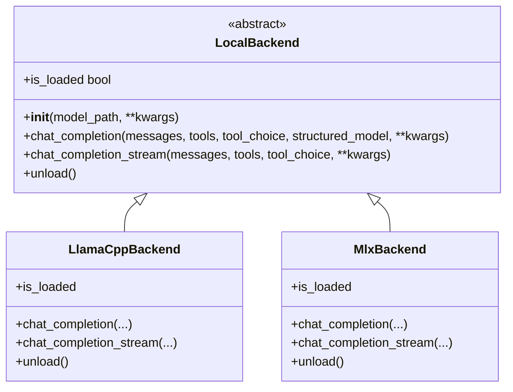
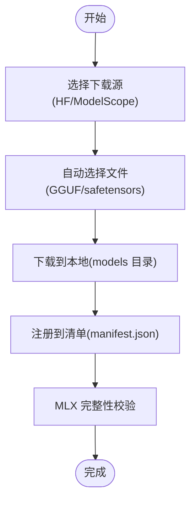
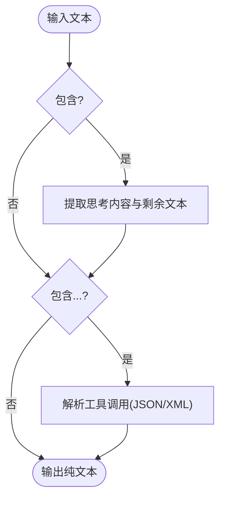
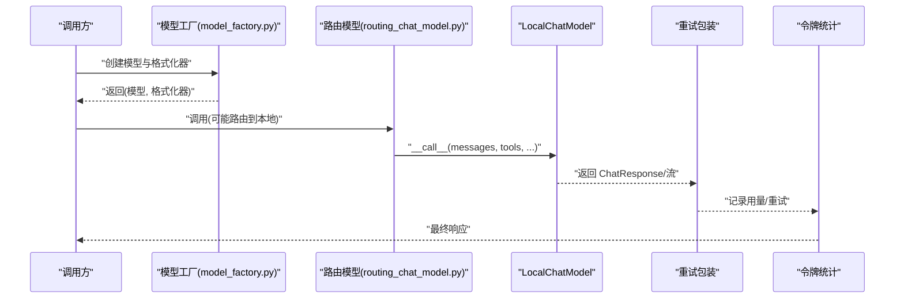
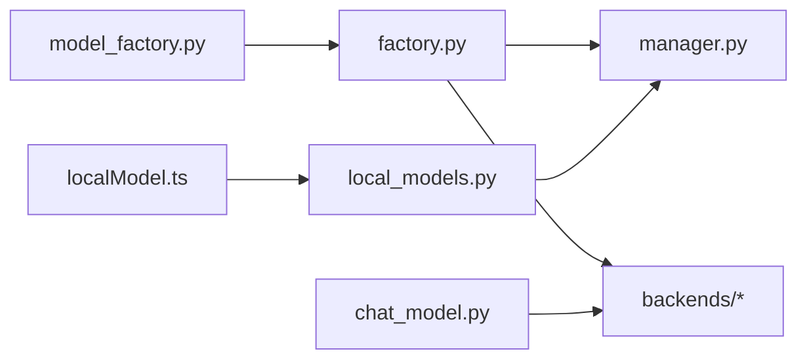

# 本地聊天模型

<cite>
**本文引用的文件**
- [factory.py](file://src/copaw/local_models/factory.py)
- [chat_model.py](file://src/copaw/local_models/chat_model.py)
- [manager.py](file://src/copaw/local_models/manager.py)
- [base.py](file://src/copaw/local_models/backends/base.py)
- [llamacpp_backend.py](file://src/copaw/local_models/backends/llamacpp_backend.py)
- [mlx_backend.py](file://src/copaw/local_models/backends/mlx_backend.py)
- [schema.py](file://src/copaw/local_models/schema.py)
- [tag_parser.py](file://src/copaw/local_models/tag_parser.py)
- [model_factory.py](file://src/copaw/agents/model_factory.py)
- [routing_chat_model.py](file://src/copaw/agents/routing_chat_model.py)
- [constant.py](file://src/copaw/constant.py)
- [local_models.py](file://src/copaw/app/routers/local_models.py)
- [localModel.ts](file://console/src/api/modules/localModel.ts)
</cite>

## 目录
1. [引言](#引言)
2. [项目结构](#项目结构)
3. [核心组件](#核心组件)
4. [架构总览](#架构总览)
5. [详细组件分析](#详细组件分析)
6. [依赖分析](#依赖分析)
7. [性能考量](#性能考量)
8. [故障排查指南](#故障排查指南)
9. [结论](#结论)
10. [附录：使用示例与最佳实践](#附录使用示例与最佳实践)

## 引言
本文件面向开发者与运维人员，系统化阐述 CoPaw 本地聊天模型子系统的整体设计与实现，重点覆盖以下方面：
- LocalChatModel 的推理接口与异步流式输出机制
- 工厂模式在本地模型实例创建与复用中的应用
- 后端抽象与多后端适配（llama.cpp 与 MLX）
- 模型清单与下载管理、参数传递与校验、错误处理策略
- 标签解析与工具调用、思维内容提取等兼容性处理
- 路由与重试包装、并发与资源管理、版本与故障转移等运维要点

## 项目结构
本地聊天模型相关代码主要位于 src/copaw/local_models 及其子模块，并通过 agents 层与路由、重试、令牌统计等能力集成；应用层提供 FastAPI 接口以支持前端管理。

**图表来源**
- [factory.py:1-125](file://src/copaw/local_models/factory.py#L1-L125)
- [chat_model.py:1-362](file://src/copaw/local_models/chat_model.py#L1-L362)
- [manager.py:1-413](file://src/copaw/local_models/manager.py#L1-L413)
- [schema.py:1-59](file://src/copaw/local_models/schema.py#L1-L59)
- [tag_parser.py:1-293](file://src/copaw/local_models/tag_parser.py#L1-L293)
- [base.py:1-64](file://src/copaw/local_models/backends/base.py#L1-L64)
- [llamacpp_backend.py:1-140](file://src/copaw/local_models/backends/llamacpp_backend.py#L1-L140)
- [mlx_backend.py:1-236](file://src/copaw/local_models/backends/mlx_backend.py#L1-L236)
- [model_factory.py:1-392](file://src/copaw/agents/model_factory.py#L1-L392)
- [routing_chat_model.py:1-123](file://src/copaw/agents/routing_chat_model.py#L1-L123)
- [constant.py:1-210](file://src/copaw/constant.py#L1-L210)
- [local_models.py:1-320](file://src/copaw/app/routers/local_models.py#L1-L320)
- [localModel.ts:1-39](file://console/src/api/modules/localModel.ts#L1-L39)

**章节来源**
- [factory.py:1-125](file://src/copaw/local_models/factory.py#L1-L125)
- [chat_model.py:1-362](file://src/copaw/local_models/chat_model.py#L1-L362)
- [manager.py:1-413](file://src/copaw/local_models/manager.py#L1-L413)
- [schema.py:1-59](file://src/copaw/local_models/schema.py#L1-L59)
- [tag_parser.py:1-293](file://src/copaw/local_models/tag_parser.py#L1-L293)
- [base.py:1-64](file://src/copaw/local_models/backends/base.py#L1-L64)
- [llamacpp_backend.py:1-140](file://src/copaw/local_models/backends/llamacpp_backend.py#L1-L140)
- [mlx_backend.py:1-236](file://src/copaw/local_models/backends/mlx_backend.py#L1-L236)
- [model_factory.py:1-392](file://src/copaw/agents/model_factory.py#L1-L392)
- [routing_chat_model.py:1-123](file://src/copaw/agents/routing_chat_model.py#L1-L123)
- [constant.py:1-210](file://src/copaw/constant.py#L1-L210)
- [local_models.py:1-320](file://src/copaw/app/routers/local_models.py#L1-L320)
- [localModel.ts:1-39](file://console/src/api/modules/localModel.ts#L1-L39)

## 核心组件
- LocalChatModel：封装任意 LocalBackend，提供统一的异步推理接口，支持非流式与流式两种输出，内部通过线程池执行同步后端推理，并将结果解析为统一的消息块（文本、思考、工具调用）。
- 工厂与单例：create_local_chat_model 基于模型 ID 单例加载后端，避免重复占用内存；unload_active_model 支持主动卸载释放资源。
- 后端抽象与实现：LocalBackend 定义统一接口；llamacpp_backend 与 mlx_backend 分别对接 llama.cpp 与 MLX，负责消息归一化、参数映射与推理执行。
- 清单与下载：LocalModelManager 提供清单持久化、下载（HF/ModelScope）、自动文件选择与完整性校验、注册到清单等功能。
- 标签解析：对<think>与<tool_call>...</tool_call>等特殊标签进行提取与解析，兼容不同后端输出格式。
- 集成与路由：agents/model_factory 统一创建本地/云端模型与格式化器，并可叠加重试与令牌统计；RoutingChatModel 支持按策略在本地与云端之间路由。

**章节来源**
- [chat_model.py:39-362](file://src/copaw/local_models/chat_model.py#L39-L362)
- [factory.py:42-125](file://src/copaw/local_models/factory.py#L42-L125)
- [base.py:12-64](file://src/copaw/local_models/backends/base.py#L12-L64)
- [llamacpp_backend.py:45-140](file://src/copaw/local_models/backends/llamacpp_backend.py#L45-L140)
- [mlx_backend.py:57-236](file://src/copaw/local_models/backends/mlx_backend.py#L57-L236)
- [manager.py:94-413](file://src/copaw/local_models/manager.py#L94-L413)
- [tag_parser.py:197-293](file://src/copaw/local_models/tag_parser.py#L197-L293)
- [model_factory.py:280-392](file://src/copaw/agents/model_factory.py#L280-L392)
- [routing_chat_model.py:65-123](file://src/copaw/agents/routing_chat_model.py#L65-L123)

## 架构总览
下图展示了从应用层到后端的完整调用链路与职责边界：

**图表来源**
- [local_models.py:94-320](file://src/copaw/app/routers/local_models.py#L94-L320)
- [manager.py:63-87](file://src/copaw/local_models/manager.py#L63-L87)
- [factory.py:70-125](file://src/copaw/local_models/factory.py#L70-L125)
- [chat_model.py:58-94](file://src/copaw/local_models/chat_model.py#L58-L94)
- [base.py:12-64](file://src/copaw/local_models/backends/base.py#L12-L64)
- [llamacpp_backend.py:45-140](file://src/copaw/local_models/backends/llamacpp_backend.py#L45-L140)
- [mlx_backend.py:57-236](file://src/copaw/local_models/backends/mlx_backend.py#L57-L236)

## 详细组件分析

### LocalChatModel 设计与推理流程
- 异步接口：__call__ 支持流式与非流式两种模式；流式通过后台线程驱动后端迭代器并经队列回传给事件循环。
- 流式解析：累积 content、reasoning_content 与 tool_calls，结合标签解析器处理<think>与<tool_call>...</tool_call>，构建统一的内容块列表。
- 非流式解析：从 choices/message 中提取 content、tool_calls 与 usage，必要时回退到标签解析。
- 结构化输出：当传入结构化 Pydantic 模型时，后端会按 schema 进行约束（llama.cpp 使用 response_format，MLX 在提示中追加 JSON schema 指令）。
- 线程安全：推理在线程池执行，避免阻塞事件循环；流式生产者在后台线程向队列写入，消费者在主线程异步消费。

**图表来源**
- [chat_model.py:39-362](file://src/copaw/local_models/chat_model.py#L39-L362)
- [base.py:12-64](file://src/copaw/local_models/backends/base.py#L12-L64)
- [llamacpp_backend.py:45-140](file://src/copaw/local_models/backends/llamacpp_backend.py#L45-L140)
- [mlx_backend.py:57-236](file://src/copaw/local_models/backends/mlx_backend.py#L57-L236)

**章节来源**
- [chat_model.py:58-362](file://src/copaw/local_models/chat_model.py#L58-L362)
- [llamacpp_backend.py:86-140](file://src/copaw/local_models/backends/llamacpp_backend.py#L86-L140)
- [mlx_backend.py:98-236](file://src/copaw/local_models/backends/mlx_backend.py#L98-L236)

### 工厂模式与单例缓存
- 单例缓存：全局持有当前已加载的后端实例与模型 ID，若再次请求相同 ID 则直接复用，避免重复加载。
- 条件卸载：若请求不同模型 ID，先卸载旧后端再加载新后端，确保显存/内存可控。
- 参数透传：backend_kwargs 透传至后端构造函数，generate_kwargs 透传至每次生成调用。
- 错误处理：未找到模型或未知后端类型时抛出异常；后端库缺失时提示安装依赖。

**图表来源**
- [factory.py:70-125](file://src/copaw/local_models/factory.py#L70-L125)
- [manager.py:63-67](file://src/copaw/local_models/manager.py#L63-L67)

**章节来源**
- [factory.py:22-125](file://src/copaw/local_models/factory.py#L22-L125)
- [manager.py:63-67](file://src/copaw/local_models/manager.py#L63-L67)

### 后端抽象与多后端适配
- 抽象接口：LocalBackend 规范了 chat_completion、chat_completion_stream、unload、is_loaded 等方法。
- llama.cpp 后端：消息归一化、工具调用参数映射、结构化输出 response_format、日志记录与资源释放。
- MLX 后端：目录型模型解析、模板构建、采样参数映射（temperature→temp 等）、流式生成与最终聚合、资源释放。

**图表来源**
- [base.py:12-64](file://src/copaw/local_models/backends/base.py#L12-L64)
- [llamacpp_backend.py:45-140](file://src/copaw/local_models/backends/llamacpp_backend.py#L45-L140)
- [mlx_backend.py:57-236](file://src/copaw/local_models/backends/mlx_backend.py#L57-L236)

**章节来源**
- [base.py:12-64](file://src/copaw/local_models/backends/base.py#L12-L64)
- [llamacpp_backend.py:45-140](file://src/copaw/local_models/backends/llamacpp_backend.py#L45-L140)
- [mlx_backend.py:57-236](file://src/copaw/local_models/backends/mlx_backend.py#L57-L236)

### 清单与下载管理
- 清单持久化：manifest.json 记录模型元数据，含唯一 ID、仓库 ID、文件名、后端类型、来源、大小、本地路径与显示名。
- 下载流程：根据源（HF/ModelScope）与后端类型选择文件或整库下载，自动选择 GGUF 或 safetensors 文件，注册到清单并计算大小。
- 完整性校验：MLX 模型要求 config.json 与至少一个 safetensors 文件存在。
- 删除与清理：删除模型文件/目录并从清单移除，清理空父目录。

**图表来源**
- [manager.py:94-413](file://src/copaw/local_models/manager.py#L94-L413)
- [constant.py:154-156](file://src/copaw/constant.py#L154-L156)

**章节来源**
- [manager.py:94-413](file://src/copaw/local_models/manager.py#L94-L413)
- [constant.py:154-156](file://src/copaw/constant.py#L154-L156)

### 标签解析与兼容性处理
- 思维内容：<think>...</think> 标签提取，支持未闭合标签的流式场景。
- 工具调用：<tool_call>...</tool_call> 标签解析，优先 JSON 格式，其次 XML 格式，生成统一的数据结构。
- 兼容回退：当后端未提供结构化字段时，从文本中解析标签，保证跨后端一致性。

**图表来源**
- [tag_parser.py:197-293](file://src/copaw/local_models/tag_parser.py#L197-L293)

**章节来源**
- [tag_parser.py:197-293](file://src/copaw/local_models/tag_parser.py#L197-L293)

### 集成与路由、重试、令牌统计
- 统一工厂：create_model_and_formatter 根据配置选择本地或云端模型，增强格式化器以支持文件块与额外内容传递。
- 路由模型：RoutingChatModel 基于策略在本地与云端之间切换，记录路由原因便于调试。
- 重试与统计：对模型调用进行重试包装与令牌用量统计，提升鲁棒性与可观测性。

**图表来源**
- [model_factory.py:280-392](file://src/copaw/agents/model_factory.py#L280-L392)
- [routing_chat_model.py:65-123](file://src/copaw/agents/routing_chat_model.py#L65-L123)
- [chat_model.py:58-94](file://src/copaw/local_models/chat_model.py#L58-L94)

**章节来源**
- [model_factory.py:280-392](file://src/copaw/agents/model_factory.py#L280-L392)
- [routing_chat_model.py:65-123](file://src/copaw/agents/routing_chat_model.py#L65-L123)

## 依赖分析
- 内部耦合
  - factory 依赖 manager 获取模型信息与后端类型，再按需创建后端实例。
  - chat_model 依赖 backends 抽象，不直接关心具体实现细节。
  - model_factory 依赖 factory 与 ProviderManager，统一创建本地/云端模型。
  - app 路由依赖 manager 执行下载与删除操作。
- 外部依赖
  - llama.cpp 后端依赖 llama-cpp-python；MLX 后端依赖 mlx-lm；下载依赖 huggingface_hub 或 modelscope。
- 潜在风险
  - 后端库缺失会导致导入异常；MLX 模型目录完整性缺失会触发运行时错误。
  - 清单损坏可能导致下载/删除失败，需具备容错与重建逻辑。

**图表来源**
- [factory.py:10-13](file://src/copaw/local_models/factory.py#L10-L13)
- [chat_model.py:15-26](file://src/copaw/local_models/chat_model.py#L15-L26)
- [model_factory.py:37-36](file://src/copaw/agents/model_factory.py#L37-L36)
- [local_models.py:13-23](file://src/copaw/app/routers/local_models.py#L13-L23)
- [localModel.ts:1-6](file://console/src/api/modules/localModel.ts#L1-L6)

**章节来源**
- [factory.py:10-13](file://src/copaw/local_models/factory.py#L10-L13)
- [chat_model.py:15-26](file://src/copaw/local_models/chat_model.py#L15-L26)
- [model_factory.py:37-36](file://src/copaw/agents/model_factory.py#L37-L36)
- [local_models.py:13-23](file://src/copaw/app/routers/local_models.py#L13-L23)
- [localModel.ts:1-6](file://console/src/api/modules/localModel.ts#L1-L6)

## 性能考量
- 单例与资源复用：通过工厂单例避免重复加载，降低显存/内存抖动。
- 线程池与异步：推理在线程池执行，流式通过队列解耦，减少主线程阻塞。
- 参数映射与最小化开销：后端参数映射（如 temperature→temp）减少不必要的转换成本。
- 清单与自动选择：自动选择量化文件（如 Q4_K_M）与 safetensors，兼顾体积与质量。
- 并发控制：下载任务采用后台任务与锁保护，避免竞态；取消时及时清理资源。
- 运维建议
  - 合理设置 n_ctx/n_gpu_layers（llama.cpp）与 max_tokens（MLX），平衡吞吐与延迟。
  - 在容器/受限环境中关注磁盘空间与权限，确保 models 目录可写。
  - 对频繁切换模型的场景，使用 unload_active_model 主动释放资源。

[本节为通用性能指导，无需特定文件引用]

## 故障排查指南
- 导入异常
  - 症状：提示缺少 llama-cpp-python 或 mlx-lm。
  - 处理：按提示安装对应可选依赖。
- 模型未找到
  - 症状：工厂抛出“未找到模型”异常。
  - 处理：先通过下载接口下载模型，再创建实例。
- 清单损坏
  - 症状：清单解析失败，无法列出/删除模型。
  - 处理：检查 manifest.json 格式，必要时删除重建。
- MLX 下载不完整
  - 症状：缺少 config.json 或 safetensors 文件。
  - 处理：删除目录后重新下载，确保网络稳定。
- 下载被取消
  - 症状：任务状态变为 CANCELLED，可能残留文件。
  - 处理：调用取消接口后，服务端会尝试清理下载产物。
- 流式解析异常
  - 症状：<think>或<tool_call>标签未闭合导致显示异常。
  - 处理：标签解析器已支持未闭合场景，保持等待直至闭合或超时。

**章节来源**
- [llamacpp_backend.py:57-63](file://src/copaw/local_models/backends/llamacpp_backend.py#L57-L63)
- [mlx_backend.py:66-72](file://src/copaw/local_models/backends/mlx_backend.py#L66-L72)
- [manager.py:30-38](file://src/copaw/local_models/manager.py#L30-L38)
- [manager.py:332-362](file://src/copaw/local_models/manager.py#L332-L362)
- [local_models.py:134-141](file://src/copaw/app/routers/local_models.py#L134-L141)
- [local_models.py:209-217](file://src/copaw/app/routers/local_models.py#L209-L217)

## 结论
CoPaw 的本地聊天模型体系以 LocalChatModel 为核心，通过工厂单例与后端抽象实现了跨后端的一致性推理接口；配合清单与下载管理、标签解析与格式化器增强，既满足开发易用性也兼顾运行稳定性。在实际部署中，建议结合路由策略、重试与令牌统计，完善监控与告警，确保在多模型、多并发场景下的可靠运行。

[本节为总结性内容，无需特定文件引用]

## 附录：使用示例与最佳实践

### 如何创建本地模型实例
- 步骤
  - 通过下载接口将模型下载到本地（参考应用层路由）。
  - 使用工厂方法创建 LocalChatModel，传入模型 ID、是否流式、后端参数与生成参数。
  - 调用模型实例进行推理，支持流式与非流式两种方式。
- 关键点
  - 若同一模型已加载，工厂会复用实例，避免重复加载。
  - 需要切换模型时，先卸载旧模型或等待其自然释放。

**章节来源**
- [local_models.py:94-121](file://src/copaw/app/routers/local_models.py#L94-L121)
- [factory.py:42-107](file://src/copaw/local_models/factory.py#L42-L107)
- [chat_model.py:58-94](file://src/copaw/local_models/chat_model.py#L58-L94)

### 配置参数传递与验证
- 后端参数（backend_kwargs）
  - llama.cpp：n_ctx、n_gpu_layers、verbose、chat_format 等。
  - MLX：max_tokens 等。
- 生成参数（generate_kwargs）
  - temperature、top_p、top_k、max_tokens 等；MLX 会将 temperature 映射为 temp。
- 清单与来源
  - 清单记录模型来源（HF/ModelScope）、后端类型、文件大小与本地路径，便于运维审计。

**章节来源**
- [llamacpp_backend.py:48-84](file://src/copaw/local_models/backends/llamacpp_backend.py#L48-L84)
- [mlx_backend.py:60-82](file://src/copaw/local_models/backends/mlx_backend.py#L60-L82)
- [manager.py:364-413](file://src/copaw/local_models/manager.py#L364-L413)

### 推理结果处理与兼容性
- 流式输出
  - 通过队列累积 content、reasoning_content 与 tool_calls，逐步构建 ChatResponse。
  - 当后端未提供结构化字段时，回退到标签解析。
- 非流式输出
  - 解析 choices/message，提取 content、tool_calls 与 usage。
- 结构化输出
  - llama.cpp 使用 response_format；MLX 在提示中追加 JSON schema 指令。

**章节来源**
- [chat_model.py:96-258](file://src/copaw/local_models/chat_model.py#L96-L258)
- [chat_model.py:259-362](file://src/copaw/local_models/chat_model.py#L259-L362)
- [llamacpp_backend.py:104-111](file://src/copaw/local_models/backends/llamacpp_backend.py#L104-L111)
- [mlx_backend.py:128-137](file://src/copaw/local_models/backends/mlx_backend.py#L128-L137)

### 模型缓存机制与并发控制
- 缓存
  - 工厂维护全局活跃后端与模型 ID，相同模型复用。
  - 清单持久化，重启后仍可快速恢复。
- 并发
  - 推理在线程池执行；流式通过队列与事件循环解耦。
  - 下载任务采用后台任务与锁，支持取消与清理。

**章节来源**
- [factory.py:17-19](file://src/copaw/local_models/factory.py#L17-L19)
- [factory.py:77-107](file://src/copaw/local_models/factory.py#L77-L107)
- [chat_model.py:78-94](file://src/copaw/local_models/chat_model.py#L78-L94)
- [local_models.py:84-92](file://src/copaw/app/routers/local_models.py#L84-L92)

### 资源管理与卸载
- 主动卸载：unload_active_model 释放当前后端资源，适合长时间空闲或切换模型。
- 自动清理：下载任务取消后，服务端尝试删除已下载模型。

**章节来源**
- [factory.py:32-40](file://src/copaw/local_models/factory.py#L32-L40)
- [local_models.py:209-217](file://src/copaw/app/routers/local_models.py#L209-L217)

### 前端交互与 API 使用
- 前端通过 localModel.ts 调用后端接口，实现模型列表、下载、取消与删除。
- 应用层路由提供统一的 REST 接口，支持后台任务状态查询与清理。

**章节来源**
- [localModel.ts:8-38](file://console/src/api/modules/localModel.ts#L8-L38)
- [local_models.py:94-320](file://src/copaw/app/routers/local_models.py#L94-L320)