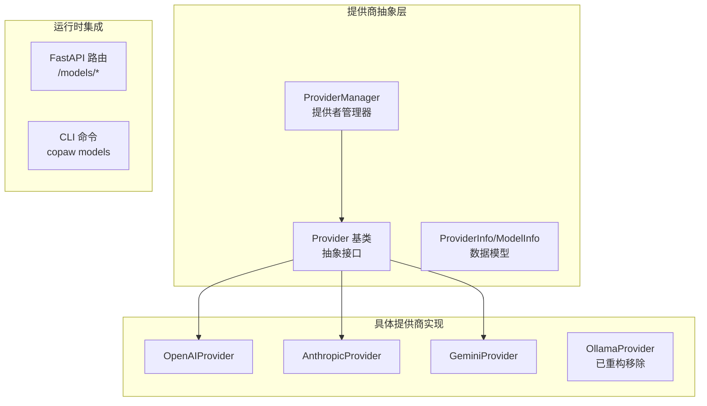
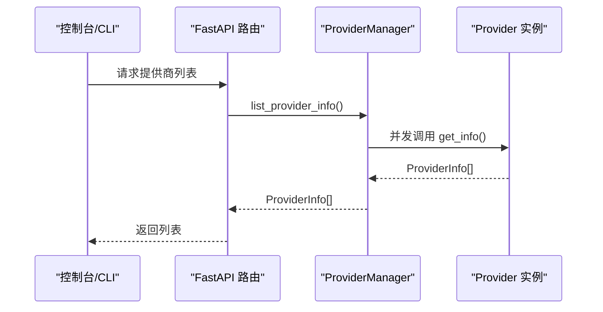
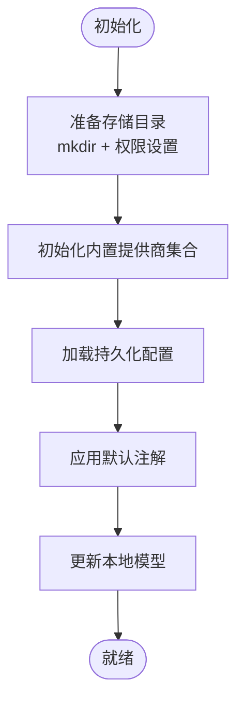
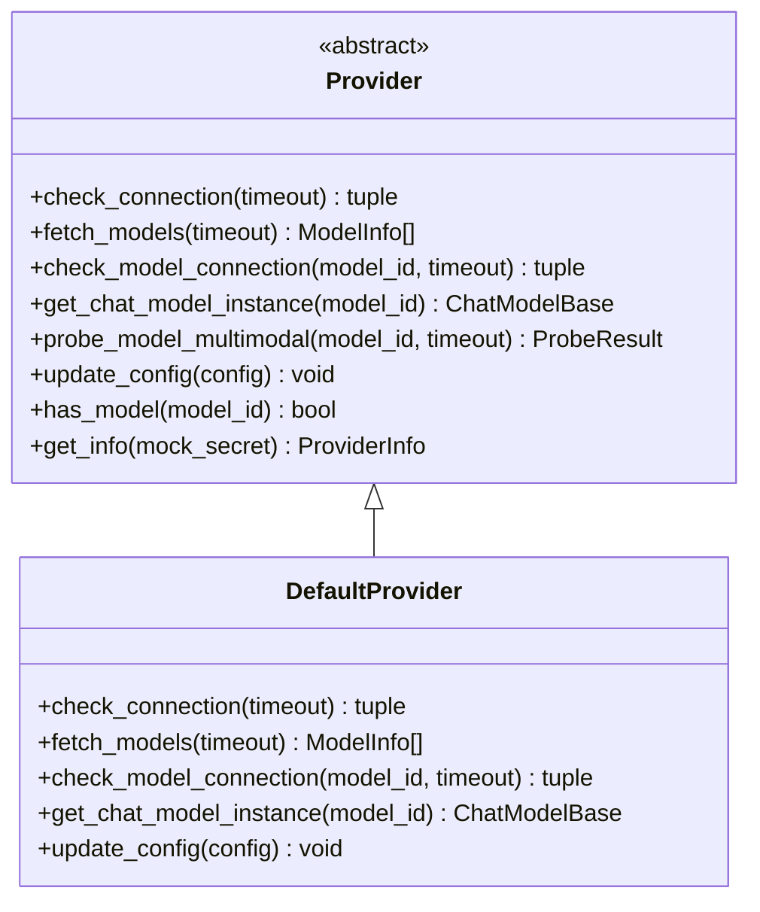
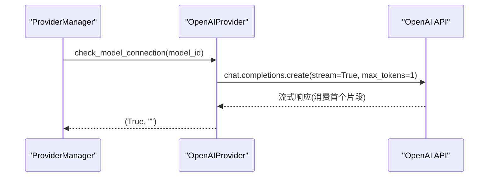
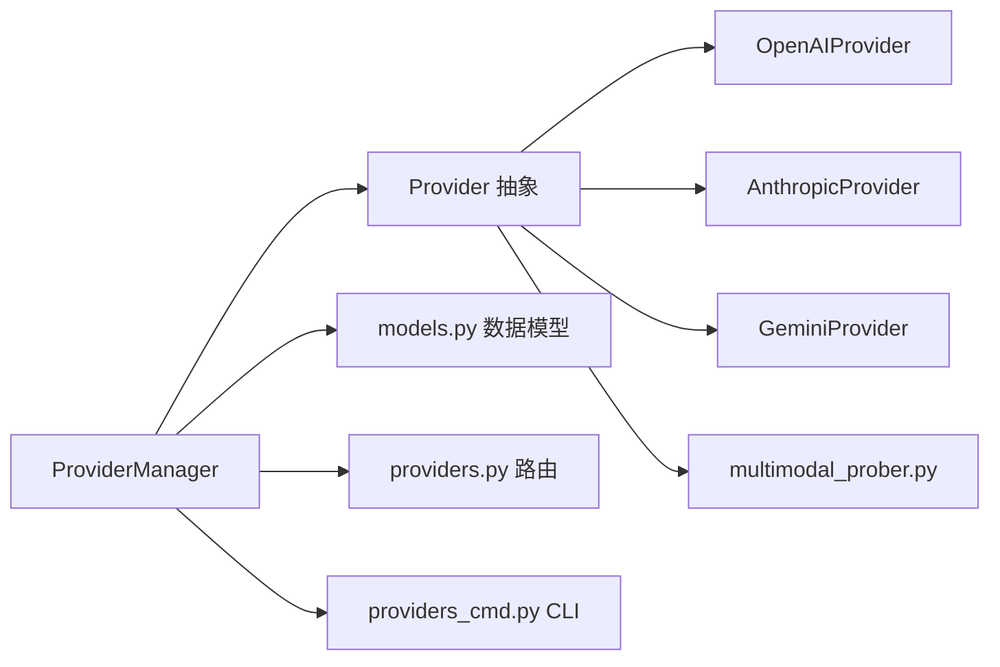

# 模型提供商管理

<cite>
**本文引用的文件**
- [provider_manager.py](file://src/copaw/providers/provider_manager.py)
- [provider.py](file://src/copaw/providers/provider.py)
- [openai_provider.py](file://src/copaw/providers/openai_provider.py)
- [anthropic_provider.py](file://src/copaw/providers/anthropic_provider.py)
- [gemini_provider.py](file://src/copaw/providers/gemini_provider.py)
- [ollama_provider.py](file://src/copaw/providers/ollama_provider.py)
- [models.py](file://src/copaw/providers/models.py)
- [multimodal_prober.py](file://src/copaw/providers/multimodal_prober.py)
- [capability_baseline.py](file://src/copaw/providers/capability_baseline.py)
- [providers.py](file://src/copaw/app/routers/providers.py)
- [providers_cmd.py](file://src/copaw/cli/providers_cmd.py)
</cite>

## 目录
1. [简介](#简介)
2. [项目结构](#项目结构)
3. [核心组件](#核心组件)
4. [架构总览](#架构总览)
5. [详细组件分析](#详细组件分析)
6. [依赖分析](#依赖分析)
7. [性能考虑](#性能考虑)
8. [故障排查指南](#故障排查指南)
9. [结论](#结论)
10. [附录](#附录)

## 简介
本技术文档面向CoPaw模型提供商管理系统，系统性阐述ProviderManager的核心职责与实现机制，涵盖内置提供商初始化、自定义提供商的添加与管理、提供商信息的获取与更新、模型列表发现、连接状态检查、多模态能力探测、配置持久化与ID冲突处理、以及状态管理等关键细节。同时对Provider基类设计理念与各提供商类型（OpenAI、Anthropic、Gemini、Ollama）的实现差异进行深入解析，并给出可操作的使用示例与排障建议。

**重要更新**：根据最新的代码实现，Ollama提供程序系统已被重构并移除，ProviderManager不再包含OllamaProvider的内置初始化与管理逻辑。系统现已专注于云端提供商的统一管理与本地模型托管能力。

## 项目结构
CoPaw在后端以模块化方式组织"提供商抽象层"与"具体提供商实现"，并通过FastAPI路由与CLI命令暴露统一的管理接口；前端控制台通过API与后端交互完成可视化配置。

**图表来源**
- [provider_manager.py](file://src/copaw/providers/provider_manager.py)
- [provider.py](file://src/copaw/providers/provider.py)
- [openai_provider.py](file://src/copaw/providers/openai_provider.py)
- [anthropic_provider.py](file://src/copaw/providers/anthropic_provider.py)
- [gemini_provider.py](file://src/copaw/providers/gemini_provider.py)
- [ollama_provider.py](file://src/copaw/providers/ollama_provider.py)
- [providers.py](file://src/copaw/app/routers/providers.py)
- [providers_cmd.py](file://src/copaw/cli/providers_cmd.py)

**章节来源**
- [provider_manager.py](file://src/copaw/providers/provider_manager.py)
- [provider.py](file://src/copaw/providers/provider.py)
- [providers.py](file://src/copaw/app/routers/providers.py)
- [providers_cmd.py](file://src/copaw/cli/providers_cmd.py)

## 核心组件
- ProviderManager：全局单例，负责内置与自定义提供商的注册、持久化存储、活跃模型槽位管理、模型发现与多模态探测、以及ID冲突解析。
- Provider基类：定义统一的提供商接口（连接检查、模型发现、模型连通性测试、模型实例化、多模态探测、配置更新、信息导出等），并提供默认实现。
- 具体提供商实现：OpenAIProvider、AnthropicProvider、GeminiProvider分别针对不同API协议提供适配。
- 数据模型：ProviderInfo、ModelInfo、ProviderDefinition、ProviderSettings、CustomProviderData、ModelSlotConfig等，支撑UI与持久化。
- 探测与基线：multimodal_prober提供探针常量与结果结构，capability_baseline提供官方文档期望能力基线，用于对比实际探测结果。
- 集成入口：FastAPI路由与CLI命令作为对外接口，调用ProviderManager完成业务编排。

**章节来源**
- [provider_manager.py](file://src/copaw/providers/provider_manager.py)
- [provider.py](file://src/copaw/providers/provider.py)
- [models.py](file://src/copaw/providers/models.py)
- [multimodal_prober.py](file://src/copaw/providers/multimodal_prober.py)
- [capability_baseline.py](file://src/copaw/providers/capability_baseline.py)

## 架构总览
ProviderManager作为中心协调者，维护内置与自定义提供商字典，负责：
- 初始化内置提供商集合（含静态模型清单）
- 从磁盘加载持久化配置，迁移旧格式
- 提供者信息聚合与并发查询
- 更新提供商配置并落盘
- 发现可用模型并缓存到extra_models
- 激活全局或代理级活跃模型槽位
- 多模态探测与自动探测任务
- 自定义提供商ID冲突解析与持久化

**图表来源**
- [providers.py](file://src/copaw/app/routers/providers.py)
- [provider_manager.py](file://src/copaw/providers/provider_manager.py)
- [provider.py](file://src/copaw/providers/provider.py)

## 详细组件分析

### ProviderManager：提供商管理中枢
- 单例模式：通过类变量保存唯一实例，避免重复初始化。
- 存储与迁移：在安全权限目录下准备builtin/custom子目录，加载持久化配置并尝试迁移旧格式。
- 内置提供商初始化：集中定义多个内置Provider实例（OpenAI、Azure OpenAI、DashScope、ModelScope、Kimi、DeepSeek、Anthropic、Gemini、MiniMax、LM Studio等），并注入预置模型清单。
- 并发查询：聚合内置与自定义提供商信息，异步并发获取。
- 配置更新：支持按ID更新base_url、api_key、chat_model、generate_kwargs等字段，并持久化。
- 模型发现：调用Provider.fetch_models并将结果写回extra_models。
- 自定义提供商：校验ID冲突，生成唯一ID，禁用连接检查（避免误判），持久化到custom目录。
- 活跃模型槽位：设置ModelSlotConfig并持久化到代理配置中，支持全局与代理级优先级。
- 多模态探测：后台自动探测未标注的模型能力，记录结果并更新。

**图表来源**
- [provider_manager.py](file://src/copaw/providers/provider_manager.py)

**章节来源**
- [provider_manager.py](file://src/copaw/providers/provider_manager.py)

### Provider基类：抽象与默认实现
- 抽象方法：check_connection、fetch_models、check_model_connection、get_chat_model_instance。
- 默认行为：DefaultProvider提供空实现，适用于本地模型场景。
- 工具方法：update_config、has_model、get_chat_model_cls、add_model/delete_model、get_info。
- 多模态探测：默认返回空结果，子类可覆盖实现。

**图表来源**
- [provider.py](file://src/copaw/providers/provider.py)

**章节来源**
- [provider.py](file://src/copaw/providers/provider.py)

### OpenAIProvider：兼容OpenAI生态
- 连接检查：调用models.list验证URL与鉴权。
- 模型发现：标准化payload，去重后返回。
- 模型连通性：发送最小流式请求验证响应。
- 多模态探测：图像与视频双探针，图像采用语义校验避免静默忽略；视频支持多种格式回退。
- 模型实例化：基于OpenAI兼容客户端封装。

**图表来源**
- [openai_provider.py](file://src/copaw/providers/openai_provider.py)

**章节来源**
- [openai_provider.py](file://src/copaw/providers/openai_provider.py)

### AnthropicProvider：Anthropic Messages API
- 连接检查：调用models.list。
- 模型发现：标准化payload，去重后返回。
- 模型连通性：messages.create并消费流。
- 多模态探测：仅图像输入，视频不支持。
- 模型实例化：使用AnthropicChatModel。

**章节来源**
- [anthropic_provider.py](file://src/copaw/providers/anthropic_provider.py)

### GeminiProvider：Google Gemini API
- 连接检查：异步遍历models.list。
- 模型发现：规范化模型名（去除前缀），去重后返回。
- 模型连通性：generate_content_stream验证。
- 多模态探测：图像与视频均支持，使用inline_data与file_data两种方式。
- 模型实例化：使用GeminiChatModel。

**章节来源**
- [gemini_provider.py](file://src/copaw/providers/gemini_provider.py)

### OllamaProvider：本地LLM平台（已重构移除）
**重要更新**：根据当前代码实现，OllamaProvider已被重构并移除。系统不再包含Ollama提供程序的内置支持与管理逻辑。

- 历史功能：原实现支持本地Ollama服务器连接、模型发现与管理、多模态探测等。
- 当前状态：ProviderManager初始化中不再包含PROVIDER_OLLAMA条目。
- 替代方案：系统现在专注于云端提供商的统一管理与本地模型托管能力。

**章节来源**
- [provider_manager.py](file://src/copaw/providers/provider_manager.py)
- [ollama_provider.py](file://src/copaw/providers/ollama_provider.py)

### 数据模型与持久化
- ProviderInfo/ModelInfo：描述提供商与模型元数据，支持敏感信息脱敏输出。
- ProviderDefinition/ProviderSettings/CustomProviderData：分别对应静态定义、内置持久化设置、自定义提供商完整配置。
- ModelSlotConfig：活跃模型槽位，支持全局与代理级覆盖。
- ProviderManager持久化：内置提供商配置写入builtin目录，自定义提供商写入custom目录，文件名为provider_id.json。

**章节来源**
- [models.py](file://src/copaw/providers/models.py)
- [provider_manager.py](file://src/copaw/providers/provider_manager.py)

### 多模态探测与基线对比
- 探针常量：提供标准图像与视频样本，确保探测一致性。
- 探测结果：ProbeResult包含supports_image/supports_video及消息字段。
- 基线对比：capability_baseline提供各模型官方文档期望能力，用于生成差异报告与统计摘要。

**章节来源**
- [multimodal_prober.py](file://src/copaw/providers/multimodal_prober.py)
- [capability_baseline.py](file://src/copaw/providers/capability_baseline.py)

### API与CLI集成
- FastAPI路由：提供提供商列表、配置更新、连接测试、模型发现、模型测试、多模态探测、活跃模型读写等接口。
- CLI命令：提供交互式配置、列出提供商、增删改查模型、下载本地模型等。

**章节来源**
- [providers.py](file://src/copaw/app/routers/providers.py)
- [providers_cmd.py](file://src/copaw/cli/providers_cmd.py)

## 依赖分析
- ProviderManager依赖各Provider实现与数据模型，负责生命周期管理与持久化。
- 各Provider实现依赖对应第三方SDK（OpenAI、Anthropic、Google GenAI）。
- 探测模块独立于Provider实现，通过Provider抽象接口进行能力验证。
- API与CLI作为上层入口，依赖ProviderManager完成业务逻辑。

**图表来源**
- [provider_manager.py](file://src/copaw/providers/provider_manager.py)
- [provider.py](file://src/copaw/providers/provider.py)
- [models.py](file://src/copaw/providers/models.py)
- [providers.py](file://src/copaw/app/routers/providers.py)
- [providers_cmd.py](file://src/copaw/cli/providers_cmd.py)
- [multimodal_prober.py](file://src/copaw/providers/multimodal_prober.py)

## 性能考虑
- 并发优化：ProviderManager在聚合信息与模型发现时使用异步并发，显著降低等待时间。
- 探测策略：多模态探测采用两阶段验证（拒绝即判定、语义校验），减少无效探测成本。
- 缓存与持久化：内置模型清单与extra_models缓存在内存中，避免重复网络请求；变更即时落盘。
- 重试机制：RetryChatModel对常见瞬时错误进行指数回退重试，提升稳定性。

## 故障排查指南
- 连接失败
  - 检查base_url与API密钥是否正确配置。
  - 使用/test接口或CLI命令进行连通性测试。
- 模型不可用
  - 使用/models/test接口或CLI命令验证特定模型连通性。
  - 对于OpenAI/Gemini/Anthropic，确认模型ID拼写与权限范围。
- 多模态探测异常
  - 图像探测失败可能因API拒绝或语义校验未通过，查看探针消息。
  - 视频探测失败可能因格式不被接受，系统会自动回退至其他格式。
- 自定义提供商ID冲突
  - 若ID与内置提供商冲突，系统会自动追加后缀生成唯一ID，请在UI中确认最终ID。
- Ollama相关
  - **重要更新**：Ollama提供程序系统已被移除，不再支持本地Ollama模型管理。

**章节来源**
- [providers.py](file://src/copaw/app/routers/providers.py)
- [providers_cmd.py](file://src/copaw/cli/providers_cmd.py)
- [openai_provider.py](file://src/copaw/providers/openai_provider.py)
- [gemini_provider.py](file://src/copaw/providers/gemini_provider.py)
- [anthropic_provider.py](file://src/copaw/providers/anthropic_provider.py)

## 结论
ProviderManager通过清晰的抽象与模块化设计，实现了对多源提供商的一致管理与高效集成。内置提供商的丰富覆盖、自定义提供商的灵活扩展、完善的持久化与冲突处理、以及严谨的多模态探测与基线对比，共同构成了稳定可靠的模型提供商管理体系。配合API与CLI，用户可以便捷地完成配置、发现、测试与激活等全链路操作。

**重要更新**：随着Ollama提供程序系统的重构移除，系统现在更加专注于云端提供商的统一管理与本地模型托管能力，简化了架构复杂度并提升了整体稳定性。

## 附录

### 常见操作示例（路径指引）
- 添加新提供商
  - 通过CLI：使用"copaw models add-provider"创建自定义提供商，随后"copaw models add-model"添加模型，最后"copaw models config-key"配置密钥。
  - 通过API：POST /models/custom-providers 创建自定义提供商。
  - 参考
    - [providers_cmd.py](file://src/copaw/cli/providers_cmd.py)
    - [providers.py](file://src/copaw/app/routers/providers.py)
- 更新提供商配置
  - 通过CLI：使用"copaw models config-key"更新base_url与API密钥。
  - 通过API：PUT /models/{provider_id}/config 更新配置。
  - 参考
    - [providers_cmd.py](file://src/copaw/cli/providers_cmd.py)
    - [providers.py](file://src/copaw/app/routers/providers.py)
- 查询提供商信息
  - 通过API：GET /models 获取所有提供商信息。
  - 参考
    - [providers.py](file://src/copaw/app/routers/providers.py)
- 模型发现与测试
  - 通过API：POST /models/{provider_id}/discover 发现模型；POST /models/{provider_id}/models/test 测试模型连通性。
  - 参考
    - [providers.py](file://src/copaw/app/routers/providers.py)
- 活跃模型槽位
  - 通过API：GET /models/active 获取当前活跃模型；PUT /models/active 设置代理级活跃模型。
  - 参考
    - [providers.py](file://src/copaw/app/routers/providers.py)