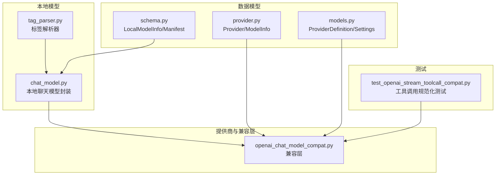
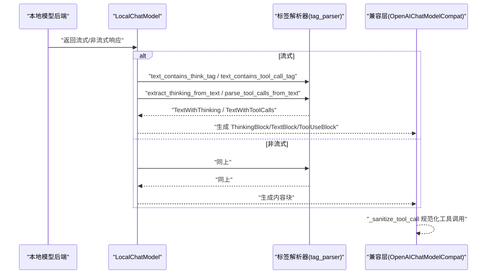
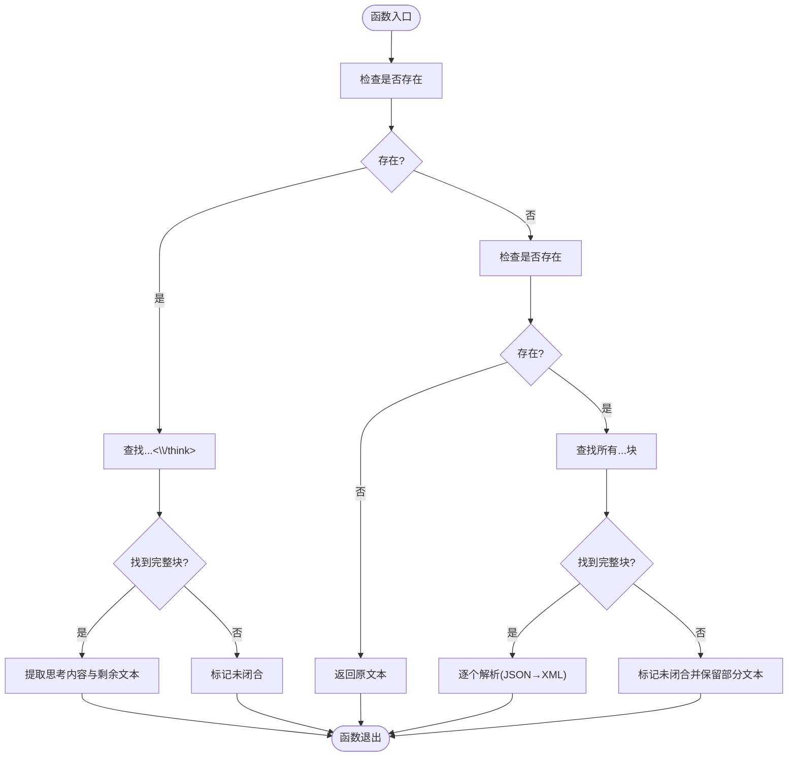
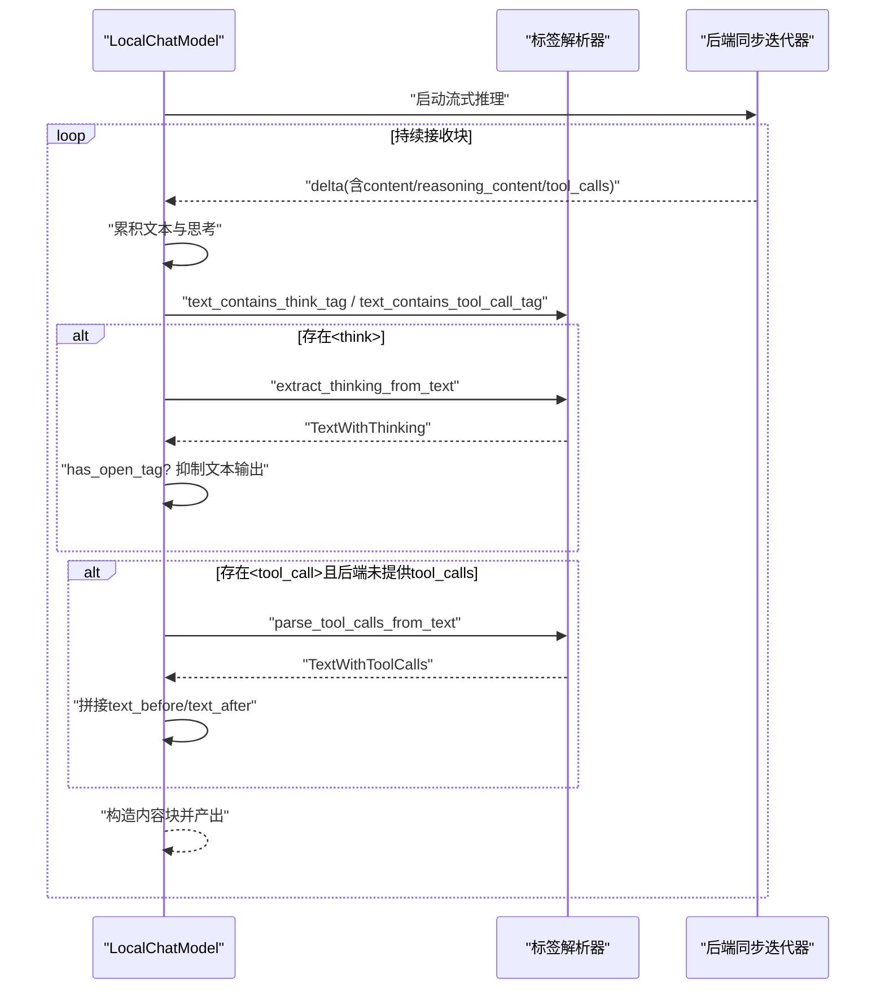
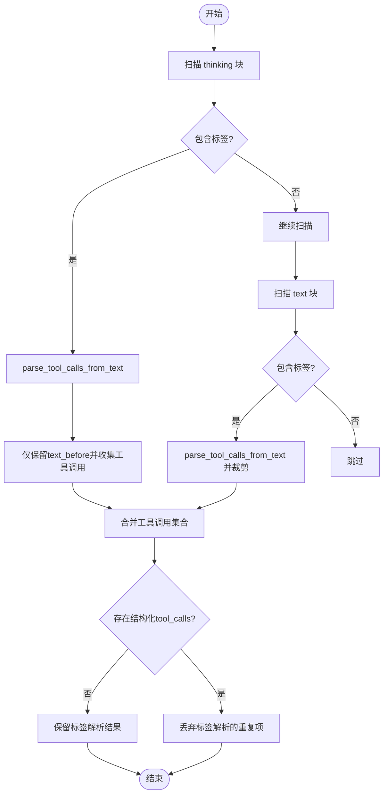
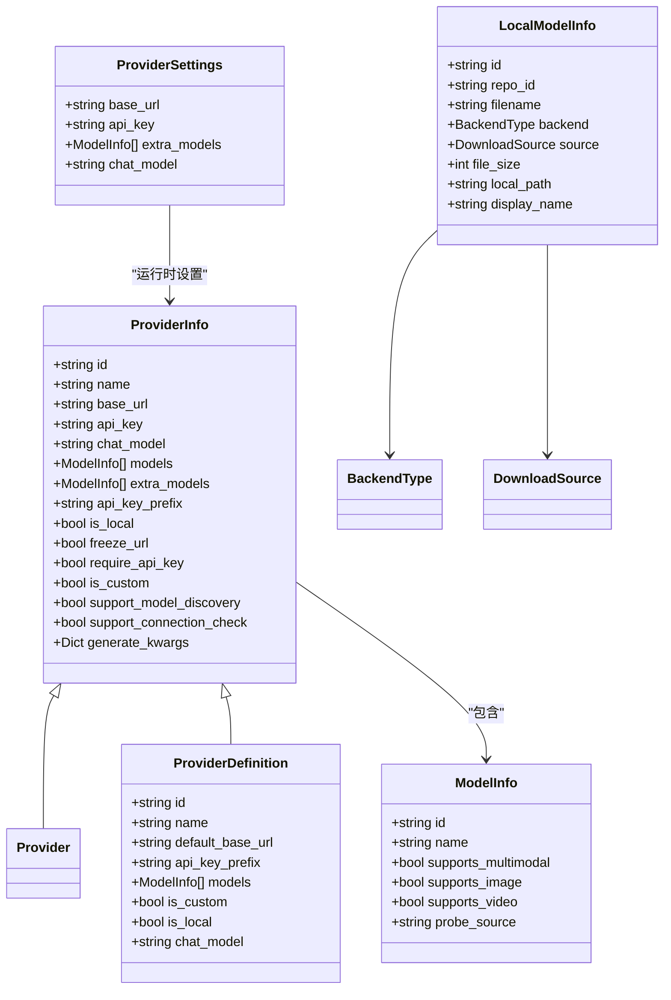
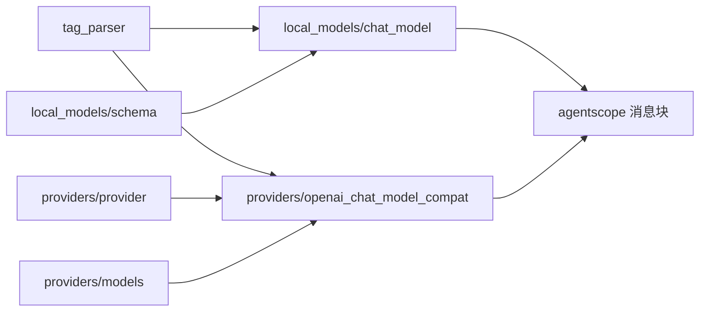

# 模型标签解析

<cite>
**本文引用的文件**
- [src/copaw/local_models/tag_parser.py](file://src/copaw/local_models/tag_parser.py)
- [src/copaw/local_models/chat_model.py](file://src/copaw/local_models/chat_model.py)
- [src/copaw/providers/openai_chat_model_compat.py](file://src/copaw/providers/openai_chat_model_compat.py)
- [tests/unit/providers/test_openai_stream_toolcall_compat.py](file://tests/unit/providers/test_openai_stream_toolcall_compat.py)
- [src/copaw/providers/provider.py](file://src/copaw/providers/provider.py)
- [src/copaw/providers/models.py](file://src/copaw/providers/models.py)
- [src/copaw/local_models/schema.py](file://src/copaw/local_models/schema.py)
</cite>

## 目录
1. [简介](#简介)
2. [项目结构](#项目结构)
3. [核心组件](#核心组件)
4. [架构总览](#架构总览)
5. [详细组件分析](#详细组件分析)
6. [依赖分析](#依赖分析)
7. [性能考量](#性能考量)
8. [故障排查指南](#故障排查指南)
9. [结论](#结论)
10. [附录](#附录)

## 简介
本文件面向 CoPaw 的“模型标签解析”子系统，聚焦于本地模型输出中两类特殊标记的解析与处理：推理标记<think>...</think>与工具调用标记<tool_call>...</tool_call>。该子系统负责从原始文本中提取推理内容、识别并解析工具调用（支持 JSON 与 XML 两种格式），并在流式与非流式场景下进行合理的文本裁剪与去噪，确保后续消息块（如 ThinkingBlock、TextBlock、ToolUseBlock）的正确生成与传递。

该能力广泛应用于模型选择、配置管理、以及跨模型兼容适配中，既保证了对本地模型输出的兼容，也提供了向后兼容与错误处理策略，以提升系统的鲁棒性与可维护性。

## 项目结构
围绕“模型标签解析”的关键文件组织如下：
- 标签解析核心：src/copaw/local_models/tag_parser.py
- 本地模型封装与解析集成：src/copaw/local_models/chat_model.py
- 兼容层与工具调用规范化：src/copaw/providers/openai_chat_model_compat.py
- 单元测试：tests/unit/providers/test_openai_stream_toolcall_compat.py
- 提供商与模型数据模型：src/copaw/providers/provider.py、src/copaw/providers/models.py
- 本地模型元数据与清单：src/copaw/local_models/schema.py

**图表来源**
- [src/copaw/local_models/tag_parser.py:1-293](file://src/copaw/local_models/tag_parser.py#L1-L293)
- [src/copaw/local_models/chat_model.py:1-362](file://src/copaw/local_models/chat_model.py#L1-L362)
- [src/copaw/providers/openai_chat_model_compat.py:234-283](file://src/copaw/providers/openai_chat_model_compat.py#L234-L283)
- [src/copaw/providers/provider.py:16-98](file://src/copaw/providers/provider.py#L16-L98)
- [src/copaw/providers/models.py:16-81](file://src/copaw/providers/models.py#L16-L81)
- [src/copaw/local_models/schema.py:22-59](file://src/copaw/local_models/schema.py#L22-L59)
- [tests/unit/providers/test_openai_stream_toolcall_compat.py:111-171](file://tests/unit/providers/test_openai_stream_toolcall_compat.py#L111-L171)

**章节来源**
- [src/copaw/local_models/tag_parser.py:1-293](file://src/copaw/local_models/tag_parser.py#L1-L293)
- [src/copaw/local_models/chat_model.py:1-362](file://src/copaw/local_models/chat_model.py#L1-L362)
- [src/copaw/providers/openai_chat_model_compat.py:234-283](file://src/copaw/providers/openai_chat_model_compat.py#L234-L283)
- [src/copaw/providers/provider.py:16-98](file://src/copaw/providers/provider.py#L16-L98)
- [src/copaw/providers/models.py:16-81](file://src/copaw/providers/models.py#L16-L81)
- [src/copaw/local_models/schema.py:22-59](file://src/copaw/local_models/schema.py#L22-L59)
- [tests/unit/providers/test_openai_stream_toolcall_compat.py:111-171](file://tests/unit/providers/test_openai_stream_toolcall_compat.py#L111-L171)

## 核心组件
- 标签解析器（tag_parser）
  - 支持<think>推理标记与<tool_call>工具调用标记的提取与解析
  - 提供 JSON 与 XML 两种工具调用格式解析
  - 面向流式场景的“未闭合标签”检测与部分文本保留
- 本地聊天模型封装（LocalChatModel）
  - 在流式与非流式路径中统一接入标签解析
  - 将解析结果映射为 ThinkingBlock、TextBlock、ToolUseBlock
- 兼容层（OpenAIChatModelCompat）
  - 对外部模型流式响应进行规范化，避免重复工具调用
  - 对缺失或异常的工具调用字段进行安全归一化
- 数据模型
  - Provider/ModelInfo：描述提供商与模型信息
  - ProviderDefinition/Settings：静态定义与运行时设置
  - LocalModelInfo/Manifest：本地模型元数据与清单

**章节来源**
- [src/copaw/local_models/tag_parser.py:197-293](file://src/copaw/local_models/tag_parser.py#L197-L293)
- [src/copaw/local_models/chat_model.py:58-362](file://src/copaw/local_models/chat_model.py#L58-L362)
- [src/copaw/providers/openai_chat_model_compat.py:234-283](file://src/copaw/providers/openai_chat_model_compat.py#L234-L283)
- [src/copaw/providers/provider.py:16-98](file://src/copaw/providers/provider.py#L16-L98)
- [src/copaw/providers/models.py:16-81](file://src/copaw/providers/models.py#L16-L81)
- [src/copaw/local_models/schema.py:22-59](file://src/copaw/local_models/schema.py#L22-L59)

## 架构总览
标签解析贯穿“输入文本 → 解析器 → 内容块生成 → 上层消费”的链路，并在流式与非流式两条路径中分别处理推理与工具调用。

**图表来源**
- [src/copaw/local_models/chat_model.py:96-258](file://src/copaw/local_models/chat_model.py#L96-L258)
- [src/copaw/local_models/tag_parser.py:197-293](file://src/copaw/local_models/tag_parser.py#L197-L293)
- [src/copaw/providers/openai_chat_model_compat.py:234-283](file://src/copaw/providers/openai_chat_model_compat.py#L234-L283)

## 详细组件分析

### 组件A：标签解析器（tag_parser）
- 功能要点
  - 推理标记<think>...</think>提取：返回思考内容与剩余文本，并标注是否未闭合
  - 工具调用标记<tool_call>...</tool_call>提取：返回首尾文本、已解析工具调用列表、未闭合状态与部分文本
  - 工具调用解析：优先尝试 JSON；失败则回退到 XML 格式
  - 快速存在性检查：用于提前判断是否需要进一步解析
- 关键数据结构
  - TextWithThinking：包含 thinking、remaining_text、has_open_tag
  - ParsedToolCall：包含 id、name、arguments、raw_arguments
  - TextWithToolCalls：包含 text_before、text_after、tool_calls、has_open_tag、partial_tool_text
- 复杂度与性能
  - 正则匹配与迭代查找，整体复杂度近似线性于输入长度
  - 通过快速存在性检查减少不必要的正则扫描
- 错误处理
  - JSON 解析失败时回退 XML
  - 缺失 name 或参数解析失败时记录警告并丢弃该工具调用
  - 未闭合标签场景下保留 partial_tool_text 供后续累积

**图表来源**
- [src/copaw/local_models/tag_parser.py:202-293](file://src/copaw/local_models/tag_parser.py#L202-L293)

**章节来源**
- [src/copaw/local_models/tag_parser.py:197-293](file://src/copaw/local_models/tag_parser.py#L197-L293)

### 组件B：本地聊天模型封装（LocalChatModel）
- 功能要点
  - 流式路径：累积 content 与 reasoning_content，按块生成 ThinkingBlock/TextBlock/ToolUseBlock
  - 非流式路径：直接解析 choices 中的 message 字段
  - 优先使用后端提供的结构化字段（reasoning_content、tool_calls），若为空则回退到标签解析
  - 对 JSON 参数字符串进行安全加载，避免解析失败导致中断
- 关键流程
  - 判断是否需要标签解析（存在<think>或<tool_call>）
  - 若未闭合<think>，则抑制文本输出，仅保留思考内容
  - 合并工具调用：先取后端结构化结果，再合并标签解析结果，避免重复

**图表来源**
- [src/copaw/local_models/chat_model.py:96-258](file://src/copaw/local_models/chat_model.py#L96-L258)
- [src/copaw/local_models/tag_parser.py:197-293](file://src/copaw/local_models/tag_parser.py#L197-L293)

**章节来源**
- [src/copaw/local_models/chat_model.py:58-362](file://src/copaw/local_models/chat_model.py#L58-L362)

### 组件C：兼容层与工具调用规范化（OpenAIChatModelCompat）
- 功能要点
  - 在外部模型流式响应中扫描 thinking 与 text 块，若发现<tool_call>标签，则解析并裁剪多余文本
  - 当存在结构化工具调用时，丢弃由标签解析产生的重复项
  - 对缺失或类型不正确的工具调用字段进行安全归一化（如 arguments 为 None 或 dict 时的处理）

**图表来源**
- [src/copaw/providers/openai_chat_model_compat.py:234-283](file://src/copaw/providers/openai_chat_model_compat.py#L234-L283)

**章节来源**
- [src/copaw/providers/openai_chat_model_compat.py:234-283](file://src/copaw/providers/openai_chat_model_compat.py#L234-L283)
- [tests/unit/providers/test_openai_stream_toolcall_compat.py:111-171](file://tests/unit/providers/test_openai_stream_toolcall_compat.py#L111-L171)

### 组件D：数据模型与配置
- Provider/ModelInfo：描述提供商与模型的基本信息、多模态支持状态、探测来源等
- ProviderDefinition/ProviderSettings：静态定义与运行时设置，支持自定义提供商
- LocalModelInfo/LocalModelsManifest：本地模型元数据与清单，包含后端类型、下载源、显示名等

**图表来源**
- [src/copaw/providers/provider.py:16-98](file://src/copaw/providers/provider.py#L16-L98)
- [src/copaw/providers/models.py:16-81](file://src/copaw/providers/models.py#L16-L81)
- [src/copaw/local_models/schema.py:22-59](file://src/copaw/local_models/schema.py#L22-L59)

**章节来源**
- [src/copaw/providers/provider.py:16-98](file://src/copaw/providers/provider.py#L16-L98)
- [src/copaw/providers/models.py:16-81](file://src/copaw/providers/models.py#L16-L81)
- [src/copaw/local_models/schema.py:22-59](file://src/copaw/local_models/schema.py#L22-L59)

## 依赖分析
- 组件耦合
  - LocalChatModel 依赖 tag_parser 的公共 API（存在性检查与解析函数）
  - OpenAIChatModelCompat 依赖 tag_parser 的解析函数，同时依赖内部工具调用规范化逻辑
- 外部依赖
  - agentscope 的 ChatModelBase、ChatResponse、各消息块类型（ThinkingBlock、TextBlock、ToolUseBlock）
  - pydantic 的 BaseModel 与 Field
- 循环依赖
  - 未见循环导入；模块间单向依赖清晰

**图表来源**
- [src/copaw/local_models/chat_model.py:20-26](file://src/copaw/local_models/chat_model.py#L20-L26)
- [src/copaw/local_models/tag_parser.py:197-293](file://src/copaw/local_models/tag_parser.py#L197-L293)
- [src/copaw/providers/openai_chat_model_compat.py:234-283](file://src/copaw/providers/openai_chat_model_compat.py#L234-L283)
- [src/copaw/providers/provider.py:10-13](file://src/copaw/providers/provider.py#L10-L13)
- [src/copaw/providers/models.py:11-13](file://src/copaw/providers/models.py#L11-L13)
- [src/copaw/local_models/schema.py:22-42](file://src/copaw/local_models/schema.py#L22-L42)

**章节来源**
- [src/copaw/local_models/chat_model.py:20-26](file://src/copaw/local_models/chat_model.py#L20-L26)
- [src/copaw/local_models/tag_parser.py:197-293](file://src/copaw/local_models/tag_parser.py#L197-L293)
- [src/copaw/providers/openai_chat_model_compat.py:234-283](file://src/copaw/providers/openai_chat_model_compat.py#L234-L283)
- [src/copaw/providers/provider.py:10-13](file://src/copaw/providers/provider.py#L10-L13)
- [src/copaw/providers/models.py:11-13](file://src/copaw/providers/models.py#L11-L13)
- [src/copaw/local_models/schema.py:22-42](file://src/copaw/local_models/schema.py#L22-L42)

## 性能考量
- 正则匹配成本
  - 使用非贪婪模式与预编译正则，降低每次调用的开销
  - 快速存在性检查可显著减少不必要的正则扫描
- 流式处理
  - 在流式路径中分块累积，避免一次性处理大文本
  - 未闭合标签的“部分文本”仅在必要时保留，减少内存占用
- 安全解析
  - 对 JSON 参数字符串进行安全加载，避免异常中断
  - 工具调用解析失败时仅记录警告并跳过，不影响整体流程

[本节为通用性能讨论，无需特定文件分析]

## 故障排查指南
- 工具调用解析失败
  - 现象：日志出现“Failed to parse tool call”警告
  - 排查：确认工具调用文本是否符合 JSON 或 XML 格式；检查 name 字段是否存在
  - 参考
    - [src/copaw/local_models/tag_parser.py:165-189](file://src/copaw/local_models/tag_parser.py#L165-L189)
- 重复工具调用
  - 现象：同一工具调用被结构化与标签解析同时产生
  - 处理：兼容层会丢弃标签解析结果，确保唯一性
  - 参考
    - [src/copaw/providers/openai_chat_model_compat.py:234-239](file://src/copaw/providers/openai_chat_model_compat.py#L234-L239)
- 缺失或异常的工具调用字段
  - 现象：arguments 为 None 或非字符串/字典
  - 处理：规范化逻辑将其转为空字符串或安全的 JSON 字符串
  - 参考
    - [tests/unit/providers/test_openai_stream_toolcall_compat.py:138-171](file://tests/unit/providers/test_openai_stream_toolcall_compat.py#L138-L171)
- 未闭合<think>或<tool_call>标签
  - 现象：has_open_tag 为真，partial_tool_text 非空
  - 处理：等待后续块补齐；在流式路径中可能抑制文本输出直至闭合
  - 参考
    - [src/copaw/local_models/tag_parser.py:220-231](file://src/copaw/local_models/tag_parser.py#L220-L231)
    - [src/copaw/local_models/tag_parser.py:254-262](file://src/copaw/local_models/tag_parser.py#L254-L262)

**章节来源**
- [src/copaw/local_models/tag_parser.py:165-189](file://src/copaw/local_models/tag_parser.py#L165-L189)
- [src/copaw/providers/openai_chat_model_compat.py:234-239](file://src/copaw/providers/openai_chat_model_compat.py#L234-L239)
- [tests/unit/providers/test_openai_stream_toolcall_compat.py:138-171](file://tests/unit/providers/test_openai_stream_toolcall_compat.py#L138-L171)
- [src/copaw/local_models/tag_parser.py:220-231](file://src/copaw/local_models/tag_parser.py#L220-L231)
- [src/copaw/local_models/tag_parser.py:254-262](file://src/copaw/local_models/tag_parser.py#L254-L262)

## 结论
CoPaw 的模型标签解析系统通过“标签解析器 + 本地模型封装 + 兼容层”的协同，实现了对<think>与<tool_call>标签的稳健解析与规范化处理。其设计兼顾了流式与非流式的差异，提供了完善的错误处理与向后兼容策略，确保在多模型、多场景下的稳定表现。配合清晰的数据模型与严格的字段校验，该系统为模型选择、配置管理与性能优化提供了坚实基础。

[本节为总结性内容，无需特定文件分析]

## 附录
- 标签格式规范
  - 推理标记：<think>...<\think>
  - 工具调用标记：<tool_call>...</tool_call>
  - 工具调用 JSON 格式：包含 name 与 arguments
  - 工具调用 XML 格式：<function=func_name><parameter=param>value</parameter>...</function>
- 标准化处理
  - 未闭合标签：保留 partial_tool_text，等待后续补齐
  - 文本裁剪：仅保留首个<tool_call>前的文本，其余视为模拟延续或噪声
  - 参数归一化：缺失或异常的 arguments 转换为空字符串或安全 JSON 字符串
- 应用价值
  - 模型选择：通过结构化工具调用与思考内容，提升对话与工具执行的可控性
  - 配置管理：统一的解析与规范化接口，便于跨提供商与本地模型的统一处理
  - 性能优化：快速存在性检查与分块处理，降低解析延迟与内存压力

[本节为概念性汇总，无需特定文件分析]