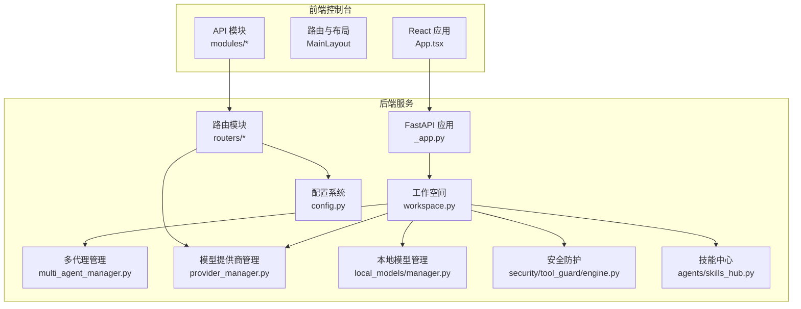
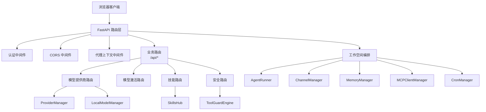
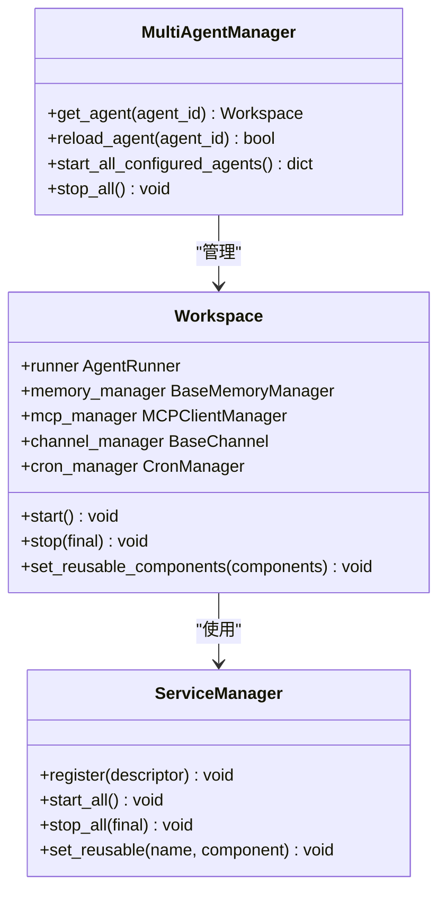
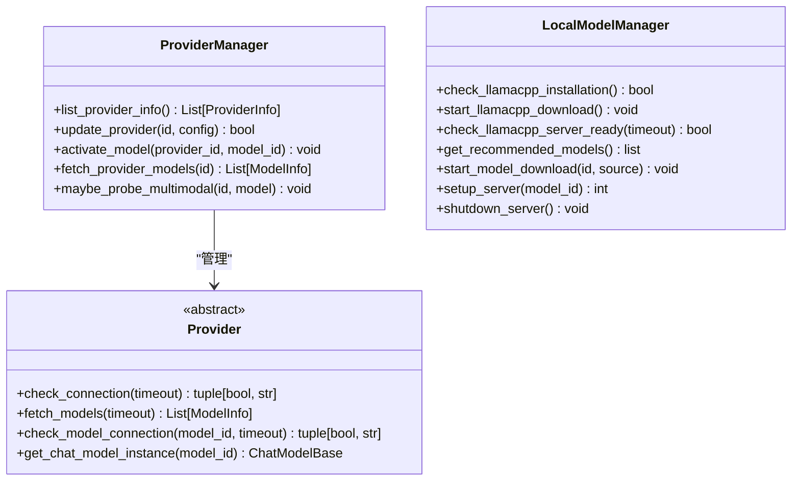
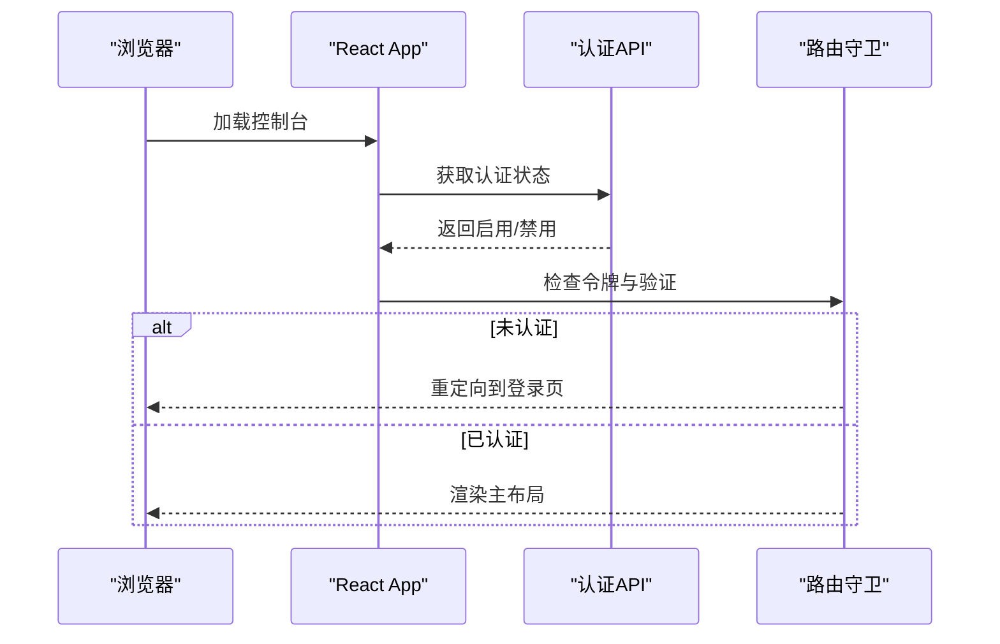
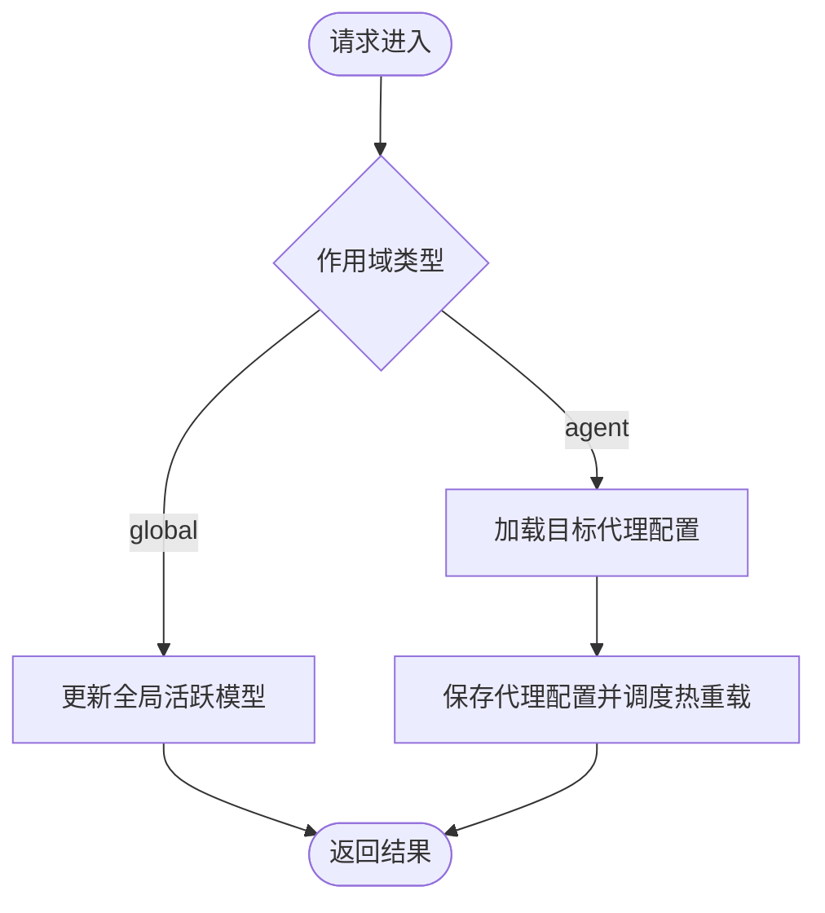
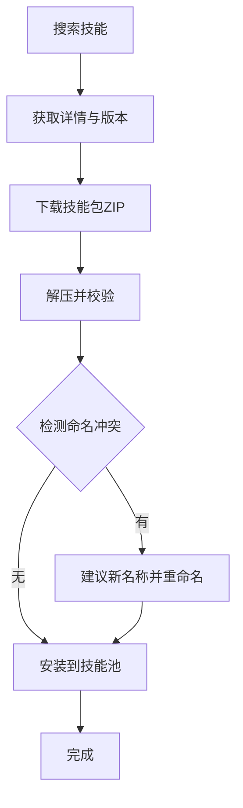
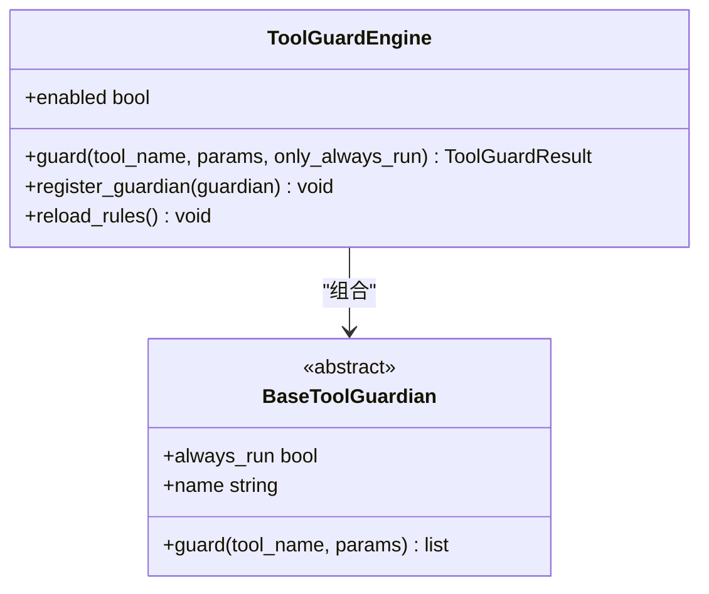
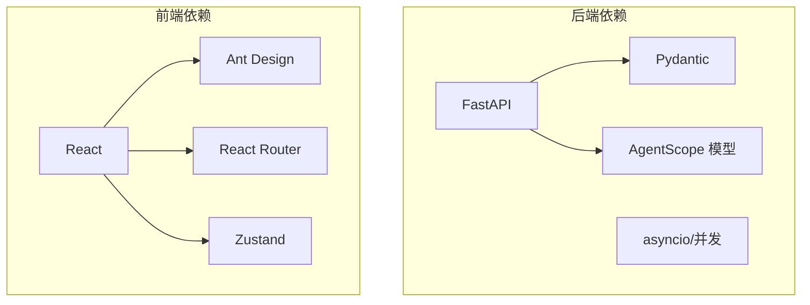

# 现代化模型管理系统

<cite>
**本文档引用的文件**
- [README.md](file://README.md)
- [src/copaw/__init__.py](file://src/copaw/__init__.py)
- [console/src/main.tsx](file://console/src/main.tsx)
- [src/copaw/app/_app.py](file://src/copaw/app/_app.py)
- [src/copaw/providers/provider_manager.py](file://src/copaw/providers/provider_manager.py)
- [src/copaw/providers/provider.py](file://src/copaw/providers/provider.py)
- [src/copaw/local_models/manager.py](file://src/copaw/local_models/manager.py)
- [src/copaw/app/multi_agent_manager.py](file://src/copaw/app/multi_agent_manager.py)
- [console/package.json](file://console/package.json)
- [src/copaw/config/config.py](file://src/copaw/config/config.py)
- [console/src/App.tsx](file://console/src/App.tsx)
- [src/copaw/app/routers/providers.py](file://src/copaw/app/routers/providers.py)
- [src/copaw/app/workspace/workspace.py](file://src/copaw/app/workspace/workspace.py)
- [src/copaw/agents/skills_hub.py](file://src/copaw/agents/skills_hub.py)
- [src/copaw/security/tool_guard/engine.py](file://src/copaw/security/tool_guard/engine.py)
</cite>

## 目录
1. [项目简介](#项目简介)
2. [项目结构](#项目结构)
3. [核心组件](#核心组件)
4. [架构总览](#架构总览)
5. [详细组件分析](#详细组件分析)
6. [依赖关系分析](#依赖关系分析)
7. [性能考虑](#性能考虑)
8. [故障排除指南](#故障排除指南)
9. [结论](#结论)

## 项目简介
现代化模型管理系统（CoPaw）是一个可扩展、多代理、支持多种渠道与技能的个人AI助手平台。它提供统一的Web控制台，支持云模型与本地模型（llama.cpp、MLX、Ollama等），具备多代理运行时、技能中心、安全防护与工具守卫等功能。系统采用前后端分离架构：后端基于FastAPI，前端基于React + Ant Design，通过REST API进行交互。

## 项目结构
项目采用模块化分层设计：
- 后端服务：FastAPI应用入口、路由模块、工作空间与多代理管理、模型提供商管理、本地模型管理、技能中心、安全防护等
- 前端控制台：React应用，包含国际化、主题切换、路由守卫、页面布局与各功能模块
- 配置与常量：统一配置模型、时区处理、常量定义
- 安全与合规：工具调用守卫、技能扫描器
- 文档与部署：安装脚本、Docker镜像、桌面应用打包

**图表来源**
- [src/copaw/app/_app.py:270-441](file://src/copaw/app/_app.py#L270-L441)
- [console/src/App.tsx:107-180](file://console/src/App.tsx#L107-L180)
- [src/copaw/app/workspace/workspace.py:47-389](file://src/copaw/app/workspace/workspace.py#L47-L389)
- [src/copaw/app/multi_agent_manager.py:17-462](file://src/copaw/app/multi_agent_manager.py#L17-L462)
- [src/copaw/providers/provider_manager.py:565-800](file://src/copaw/providers/provider_manager.py#L565-L800)
- [src/copaw/local_models/manager.py:14-127](file://src/copaw/local_models/manager.py#L14-L127)
- [src/copaw/config/config.py:1-800](file://src/copaw/config/config.py#L1-L800)
- [src/copaw/security/tool_guard/engine.py:53-238](file://src/copaw/security/tool_guard/engine.py#L53-L238)
- [src/copaw/agents/skills_hub.py:1-800](file://src/copaw/agents/skills_hub.py#L1-L800)

**章节来源**
- [README.md:102-183](file://README.md#L102-L183)
- [src/copaw/app/_app.py:270-441](file://src/copaw/app/_app.py#L270-L441)
- [console/src/App.tsx:107-180](file://console/src/App.tsx#L107-L180)

## 核心组件
- **FastAPI 应用入口**：负责应用生命周期、中间件注册、静态资源服务、路由挂载与SPA回退
- **多代理管理器**：按需加载、零停机热重载、并发启动与优雅停止
- **工作空间**：封装独立代理运行时，包含Runner、ChannelManager、MemoryManager、MCPClientManager、CronManager等
- **模型提供商管理器**：内置多家云模型提供商，支持自定义提供商、模型发现、连接测试、能力探测
- **本地模型管理器**：统一管理llama.cpp、MLX、Ollama等本地推理服务
- **配置系统**：统一的Pydantic配置模型，支持多代理、通道、心跳、运行参数、路由策略等
- **安全防护引擎**：工具调用前的安全检查，支持规则与路径级防护
- **技能中心**：从Hub拉取、安装、冲突处理与版本管理

**章节来源**
- [src/copaw/app/_app.py:156-268](file://src/copaw/app/_app.py#L156-L268)
- [src/copaw/app/multi_agent_manager.py:17-462](file://src/copaw/app/multi_agent_manager.py#L17-L462)
- [src/copaw/app/workspace/workspace.py:47-389](file://src/copaw/app/workspace/workspace.py#L47-L389)
- [src/copaw/providers/provider_manager.py:565-800](file://src/copaw/providers/provider_manager.py#L565-L800)
- [src/copaw/local_models/manager.py:14-127](file://src/copaw/local_models/manager.py#L14-L127)
- [src/copaw/config/config.py:680-750](file://src/copaw/config/config.py#L680-L750)
- [src/copaw/security/tool_guard/engine.py:53-238](file://src/copaw/security/tool_guard/engine.py#L53-L238)
- [src/copaw/agents/skills_hub.py:1-800](file://src/copaw/agents/skills_hub.py#L1-L800)

## 架构总览
系统采用“单体后端 + 分层模块”的架构模式：
- 控制层：FastAPI路由与中间件，负责认证、CORS、代理上下文注入
- 业务层：多代理管理、工作空间编排、模型与本地模型管理、技能与安全
- 数据层：配置持久化、工作空间数据、技能池、日志与遥测
- 表现层：React控制台，提供模型配置、代理管理、技能安装、安全设置等UI

**图表来源**
- [src/copaw/app/_app.py:270-375](file://src/copaw/app/_app.py#L270-L375)
- [src/copaw/app/routers/providers.py:31-575](file://src/copaw/app/routers/providers.py#L31-L575)
- [src/copaw/app/workspace/workspace.py:47-389](file://src/copaw/app/workspace/workspace.py#L47-L389)
- [src/copaw/providers/provider_manager.py:565-800](file://src/copaw/providers/provider_manager.py#L565-L800)
- [src/copaw/local_models/manager.py:14-127](file://src/copaw/local_models/manager.py#L14-L127)
- [src/copaw/agents/skills_hub.py:1-800](file://src/copaw/agents/skills_hub.py#L1-L800)
- [src/copaw/security/tool_guard/engine.py:53-238](file://src/copaw/security/tool_guard/engine.py#L53-L238)

## 详细组件分析

### 组件A：多代理运行时与工作空间
- 多代理管理器支持按需加载、零停机热重载、并发启动与后台清理任务
- 工作空间以服务管理器为核心，声明式注册Runner、MemoryManager、MCPClientManager、ChannelManager、CronManager等服务
- 支持可复用组件在热重载时保留，减少重启开销

**图表来源**
- [src/copaw/app/multi_agent_manager.py:17-462](file://src/copaw/app/multi_agent_manager.py#L17-L462)
- [src/copaw/app/workspace/workspace.py:47-389](file://src/copaw/app/workspace/workspace.py#L47-L389)

**章节来源**
- [src/copaw/app/multi_agent_manager.py:17-462](file://src/copaw/app/multi_agent_manager.py#L17-L462)
- [src/copaw/app/workspace/workspace.py:47-389](file://src/copaw/app/workspace/workspace.py#L47-L389)

### 组件B：模型提供商管理与本地模型
- ProviderManager统一管理内置与自定义提供商，支持配置更新、连接测试、模型发现、能力探测
- 支持多模态探测（图像/视频输入），异步后台恢复本地模型服务
- LocalModelManager封装llama.cpp下载、服务器生命周期与模型下载进度

**图表来源**
- [src/copaw/providers/provider_manager.py:565-800](file://src/copaw/providers/provider_manager.py#L565-L800)
- [src/copaw/providers/provider.py:100-250](file://src/copaw/providers/provider.py#L100-L250)
- [src/copaw/local_models/manager.py:14-127](file://src/copaw/local_models/manager.py#L14-L127)

**章节来源**
- [src/copaw/providers/provider_manager.py:565-800](file://src/copaw/providers/provider_manager.py#L565-L800)
- [src/copaw/providers/provider.py:100-250](file://src/copaw/providers/provider.py#L100-L250)
- [src/copaw/local_models/manager.py:14-127](file://src/copaw/local_models/manager.py#L14-L127)

### 组件C：前端控制台与认证流程
- React应用通过BrowserRouter提供路由，支持多语言与主题切换
- 认证守卫根据后端状态与令牌决定是否跳转登录页
- 控制台静态资源与SPA回退路由确保前端路由兼容

**图表来源**
- [console/src/App.tsx:46-101](file://console/src/App.tsx#L46-L101)
- [console/src/main.tsx:1-31](file://console/src/main.tsx#L1-L31)

**章节来源**
- [console/src/App.tsx:46-101](file://console/src/App.tsx#L46-L101)
- [console/src/main.tsx:1-31](file://console/src/main.tsx#L1-L31)
- [console/package.json:1-60](file://console/package.json#L1-L60)

### 组件D：模型激活与作用域读写
- 提供统一的模型激活接口，支持全局与代理作用域
- 代理作用域下优先使用代理特定配置，否则回退到全局配置
- 写入代理作用域时触发异步热重载

**图表来源**
- [src/copaw/app/routers/providers.py:456-575](file://src/copaw/app/routers/providers.py#L456-L575)

**章节来源**
- [src/copaw/app/routers/providers.py:456-575](file://src/copaw/app/routers/providers.py#L456-L575)

### 组件E：技能中心与Hub集成
- 支持从ClawHub等Hub搜索、获取、安装技能，自动处理冲突与版本
- 内置HTTP重试、超时、速率限制与取消检查机制
- 解析技能包内容，提取描述、脚本与参考文件

**图表来源**
- [src/copaw/agents/skills_hub.py:1-800](file://src/copaw/agents/skills_hub.py#L1-L800)

**章节来源**
- [src/copaw/agents/skills_hub.py:1-800](file://src/copaw/agents/skills_hub.py#L1-L800)

### 组件F：工具调用安全防护
- ToolGuardEngine聚合多个守护者（规则、路径等），在工具执行前进行安全检查
- 支持动态启用/禁用、规则重载、受保护工具集与禁止工具集
- 提供统一结果模型记录违规与失败守护者

**图表来源**
- [src/copaw/security/tool_guard/engine.py:53-238](file://src/copaw/security/tool_guard/engine.py#L53-L238)

**章节来源**
- [src/copaw/security/tool_guard/engine.py:53-238](file://src/copaw/security/tool_guard/engine.py#L53-L238)

## 依赖关系分析
- 后端依赖：FastAPI、agentscope模型框架、Pydantic配置模型、异步任务与锁
- 前端依赖：React、Ant Design、路由与状态管理、i18n与样式
- 运行时：支持Docker部署、桌面应用打包、本地模型服务（llama.cpp、MLX、Ollama）

**图表来源**
- [console/package.json:18-59](file://console/package.json#L18-L59)
- [src/copaw/app/_app.py:9-21](file://src/copaw/app/_app.py#L9-L21)

**章节来源**
- [console/package.json:18-59](file://console/package.json#L18-L59)
- [src/copaw/app/_app.py:9-21](file://src/copaw/app/_app.py#L9-L21)

## 性能考虑
- 多代理零停机热重载：通过原子替换旧实例与后台延迟清理，最小化阻塞时间
- 并发启动：多代理并发启动，缩短初始化时间
- 异步模型恢复：本地模型服务后台恢复，避免阻塞主线程
- 缓存与重试：技能Hub访问带缓存与指数退避，提升网络异常下的稳定性
- 日志与遥测：统一日志级别与文件句柄，支持版本级遥测收集

## 故障排除指南
- 启动失败：检查日志输出，确认环境变量与配置文件路径；查看应用生命周期钩子中的错误信息
- 代理热重载失败：确认代理配置变更后触发了异步重载；检查旧实例的后台清理任务状态
- 模型连接失败：使用提供商测试接口验证URL与密钥；检查模型发现与能力探测结果
- 技能安装冲突：根据Hub返回的冲突建议重命名或选择替代版本
- 工具调用被拒绝：检查工具守卫规则与路径白名单，必要时临时禁用或调整策略

**章节来源**
- [src/copaw/app/_app.py:156-268](file://src/copaw/app/_app.py#L156-L268)
- [src/copaw/app/multi_agent_manager.py:200-312](file://src/copaw/app/multi_agent_manager.py#L200-L312)
- [src/copaw/app/routers/providers.py:261-327](file://src/copaw/app/routers/providers.py#L261-L327)
- [src/copaw/agents/skills_hub.py:35-800](file://src/copaw/agents/skills_hub.py#L35-L800)
- [src/copaw/security/tool_guard/engine.py:169-227](file://src/copaw/security/tool_guard/engine.py#L169-L227)

## 结论
现代化模型管理系统通过清晰的分层架构与模块化设计，实现了多代理、多模型、多渠道与多技能的统一管理。其核心优势包括：
- 可扩展的模型提供商体系与本地推理支持
- 高可用的多代理运行时与零停机热重载
- 完整的前端控制台与国际化支持
- 安全可控的工具调用与技能生态
- 易于部署与维护的容器化与桌面应用方案

该系统为个人与企业用户提供了一个强大、灵活且安全的AI助手平台，适合在本地或云端环境中部署与扩展。