# Discord渠道适配器

<cite>
**本文档引用的文件**
- [src/copaw/app/channels/discord_/channel.py](file://src/copaw/app/channels/discord_/channel.py)
- [src/copaw/app/channels/base.py](file://src/copaw/app/channels/base.py)
- [src/copaw/app/channels/manager.py](file://src/copaw/app/channels/manager.py)
- [src/copaw/config/config.py](file://src/copaw/config/config.py)
- [src/copaw/app/channels/registry.py](file://src/copaw/app/channels/registry.py)
- [src/copaw/app/channels/utils.py](file://src/copaw/app/channels/utils.py)
- [src/copaw/app/channels/renderer.py](file://src/copaw/app/channels/renderer.py)
- [src/copaw/app/channels/schema.py](file://src/copaw/app/channels/schema.py)
- [console/src/api/types/channel.ts](file://console/src/api/types/channel.ts)
</cite>

## 目录
1. [简介](#简介)
2. [项目结构](#项目结构)
3. [核心组件](#核心组件)
4. [架构总览](#架构总览)
5. [详细组件分析](#详细组件分析)
6. [依赖关系分析](#依赖关系分析)
7. [性能考虑](#性能考虑)
8. [故障排除指南](#故障排除指南)
9. [结论](#结论)
10. [附录](#附录)

## 简介
本文件为CoPaw的Discord渠道适配器提供完整技术文档。内容涵盖Discord机器人实现原理、消息处理流程、频道管理、权限控制、认证方式、消息类型支持、嵌入消息处理、角色权限管理、配置与部署、事件监听、消息去重机制、并发处理策略、API限制与性能优化、故障排查等。

**更新** 本版本新增机器人消息过滤功能，包括bot消息接受配置选项、重复消息检测和角色提及处理。

## 项目结构
Discord渠道适配器位于通道子系统中，采用统一的BaseChannel抽象与ChannelManager队列化消费模型，结合渲染器与工具函数实现跨渠道一致的消息编解码与发送。

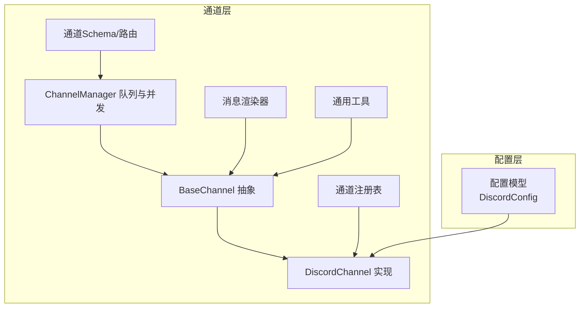

**图表来源**
- [src/copaw/app/channels/discord_/channel.py:40-630](file://src/copaw/app/channels/discord_/channel.py#L40-L630)
- [src/copaw/app/channels/base.py:69-800](file://src/copaw/app/channels/base.py#L69-L800)
- [src/copaw/app/channels/manager.py:114-580](file://src/copaw/app/channels/manager.py#L114-L580)
- [src/copaw/config/config.py:59-63](file://src/copaw/config/config.py#L59-L63)
- [src/copaw/app/channels/registry.py:19-34](file://src/copaw/app/channels/registry.py#L19-L34)
- [src/copaw/app/channels/renderer.py:78-384](file://src/copaw/app/channels/renderer.py#L78-L384)
- [src/copaw/app/channels/utils.py:1-134](file://src/copaw/app/channels/utils.py#L1-L134)
- [src/copaw/app/channels/schema.py:12-48](file://src/copaw/app/channels/schema.py#L12-L48)

**章节来源**
- [src/copaw/app/channels/discord_/channel.py:40-630](file://src/copaw/app/channels/discord_/channel.py#L40-L630)
- [src/copaw/app/channels/base.py:69-800](file://src/copaw/app/channels/base.py#L69-L800)
- [src/copaw/app/channels/manager.py:114-580](file://src/copaw/app/channels/manager.py#L114-L580)
- [src/copaw/config/config.py:59-63](file://src/copaw/config/config.py#L59-L63)
- [src/copaw/app/channels/registry.py:19-34](file://src/copaw/app/channels/registry.py#L19-L34)
- [src/copaw/app/channels/renderer.py:78-384](file://src/copaw/app/channels/renderer.py#L78-L384)
- [src/copaw/app/channels/utils.py:1-134](file://src/copaw/app/channels/utils.py#L1-L134)
- [src/copaw/app/channels/schema.py:12-48](file://src/copaw/app/channels/schema.py#L12-L48)

## 核心组件
- DiscordChannel：基于discord.py的异步客户端，负责事件监听、消息解析、会话路由、发送与媒体附件上传。
- BaseChannel：通道抽象，定义统一的请求构建、消息渲染、发送接口、去重与合并策略。
- ChannelManager：通道队列化管理器，提供多消费者并发处理、同会话批处理、时间去重、错误回调。
- 消息渲染器：将Agent输出转换为各通道可发送的内容块（文本、图片、视频、音频、文件）。
- 通用工具：文本分片、本地文件URL解析、进程处理器桥接。
- 配置模型：DiscordConfig承载令牌、代理、前缀、策略、**机器人消息过滤**等配置项。
- 注册表与Schema：内置通道映射、通道类型标识、统一路由协议。

**更新** 新增机器人消息过滤功能，包括`accept_bot_messages`配置选项用于控制是否接受其他机器人的消息。

**章节来源**
- [src/copaw/app/channels/discord_/channel.py:40-630](file://src/copaw/app/channels/discord_/channel.py#L40-L630)
- [src/copaw/app/channels/base.py:69-800](file://src/copaw/app/channels/base.py#L69-L800)
- [src/copaw/app/channels/manager.py:114-580](file://src/copaw/app/channels/manager.py#L114-L580)
- [src/copaw/app/channels/renderer.py:78-384](file://src/copaw/app/channels/renderer.py#L78-L384)
- [src/copaw/app/channels/utils.py:1-134](file://src/copaw/app/channels/utils.py#L1-L134)
- [src/copaw/config/config.py:59-63](file://src/copaw/config/config.py#L59-L63)
- [src/copaw/app/channels/registry.py:19-34](file://src/copaw/app/channels/registry.py#L19-L34)
- [src/copaw/app/channels/schema.py:12-48](file://src/copaw/app/channels/schema.py#L12-L48)

## 架构总览
Discord适配器通过异步事件驱动接收消息，经由BaseChannel统一转换为AgentRequest，交由ChannelManager并行消费，最终通过渲染器与发送接口回传到Discord。

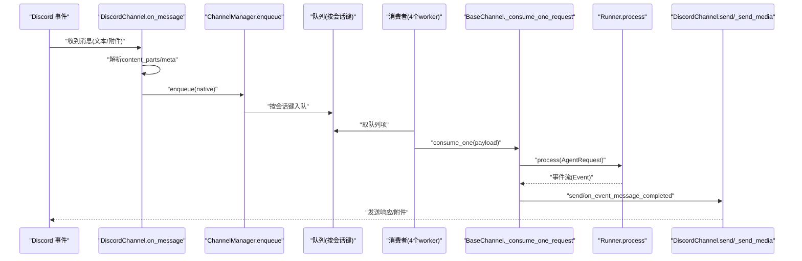

**图表来源**
- [src/copaw/app/channels/discord_/channel.py:109-273](file://src/copaw/app/channels/discord_/channel.py#L109-L273)
- [src/copaw/app/channels/manager.py:322-382](file://src/copaw/app/channels/manager.py#L322-L382)
- [src/copaw/app/channels/base.py:443-583](file://src/copaw/app/channels/base.py#L443-L583)

**章节来源**
- [src/copaw/app/channels/discord_/channel.py:109-273](file://src/copaw/app/channels/discord_/channel.py#L109-L273)
- [src/copaw/app/channels/manager.py:322-382](file://src/copaw/app/channels/manager.py#L322-L382)
- [src/copaw/app/channels/base.py:443-583](file://src/copaw/app/channels/base.py#L443-L583)

## 详细组件分析

### DiscordChannel 类设计
- 继承自BaseChannel，实现Discord特有逻辑：事件监听、消息解析、目标解析、发送与媒体上传、会话ID生成、请求构建。
- 关键特性
  - 异步事件监听：on_message解析文本与附件，识别提及、群组/私聊、元数据。
  - 允许列表与策略：支持开放、白名单两种DM/群组策略，可选必须提及。
  - **机器人消息过滤**：支持`accept_bot_messages`配置，控制是否接受其他机器人的消息。
  - **重复消息检测**：维护消息ID缓存，防止重复处理相同消息。
  - 文本分片：自动按Discord字符上限拆分，保留代码块闭合。
  - 媒体发送：支持本地file://与远端HTTP下载，临时文件清理。
  - 会话路由：以"discord:ch:"或"discord:dm:"作为to_handle标识。

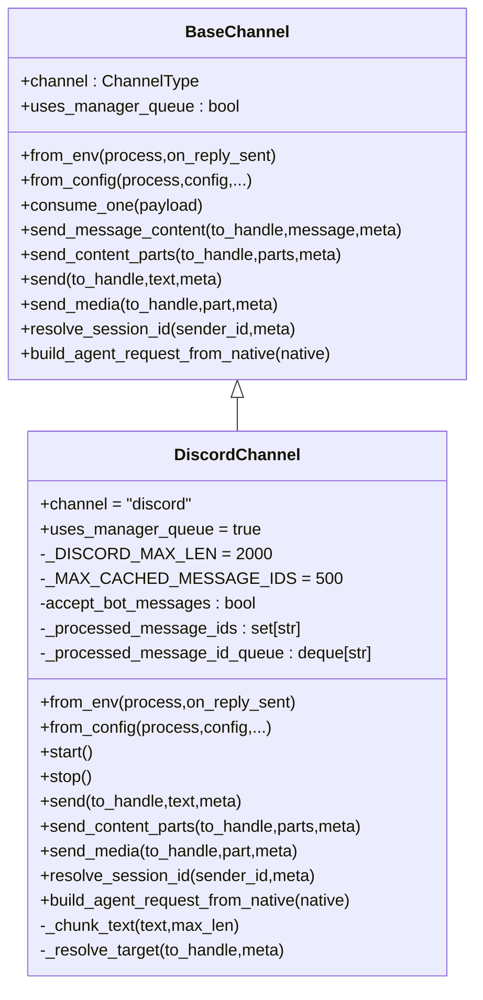

**图表来源**
- [src/copaw/app/channels/base.py:69-800](file://src/copaw/app/channels/base.py#L69-L800)
- [src/copaw/app/channels/discord_/channel.py:40-630](file://src/copaw/app/channels/discord_/channel.py#L40-L630)

**章节来源**
- [src/copaw/app/channels/discord_/channel.py:40-630](file://src/copaw/app/channels/discord_/channel.py#L40-L630)
- [src/copaw/app/channels/base.py:69-800](file://src/copaw/app/channels/base.py#L69-L800)

### 消息处理流程（含去重与合并）
- 时间去重：同一会话在设定秒数内缓冲多个原生payload，到期后合并content_parts再处理。
- 无文本去重：若当前批次不含文本且非音频，先缓存，待出现文本时合并发送，避免空输入。
- 批处理：同会话多条入队项合并为一条请求，减少重复处理成本。
- **重复消息检测**：维护最多500个消息ID的缓存，检测并跳过重复消息。
- 错误处理：捕获异常并调用统一错误回调，向用户发送错误提示。

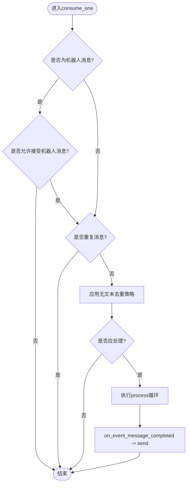

**图表来源**
- [src/copaw/app/channels/base.py:443-583](file://src/copaw/app/channels/base.py#L443-L583)
- [src/copaw/app/channels/discord_/channel.py:111-132](file://src/copaw/app/channels/discord_/channel.py#L111-L132)

**章节来源**
- [src/copaw/app/channels/base.py:443-583](file://src/copaw/app/channels/base.py#L443-L583)
- [src/copaw/app/channels/discord_/channel.py:111-132](file://src/copaw/app/channels/discord_/channel.py#L111-L132)

### 会话与路由
- 会话ID规则：DM场景使用"discord:dm:{user_id}"，频道场景使用"discord:ch:{channel_id}"，未指定则回退到DM。
- to_handle：统一字符串标识，DiscordChannel内部解析kind/id进行目标解析。
- 请求构建：从native字典提取channel_id/sender_id/content_parts/meta，构建AgentRequest并注入user_id与channel_meta。

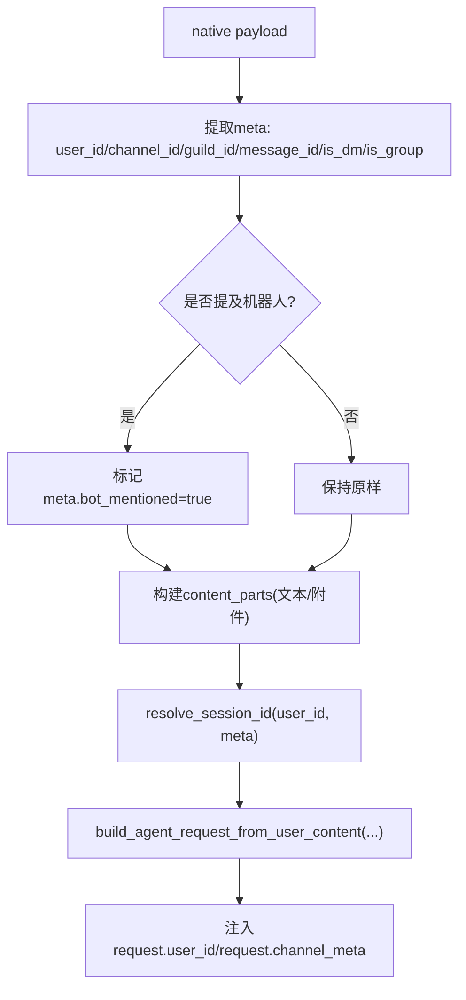

**图表来源**
- [src/copaw/app/channels/discord_/channel.py:231-273](file://src/copaw/app/channels/discord_/channel.py#L231-L273)
- [src/copaw/app/channels/discord_/channel.py:597-615](file://src/copaw/app/channels/discord_/channel.py#L597-L615)

**章节来源**
- [src/copaw/app/channels/discord_/channel.py:231-273](file://src/copaw/app/channels/discord_/channel.py#L231-L273)
- [src/copaw/app/channels/discord_/channel.py:597-615](file://src/copaw/app/channels/discord_/channel.py#L597-L615)

### 发送与媒体处理
- 文本发送：按Discord字符上限拆分，逐条发送；支持bot前缀合并。
- 媒体发送：支持本地file://与HTTP下载，自动临时文件清理；优先使用真实附件而非URL回退。
- 目标解析：根据to_handle解析为具体Channel或User DM。

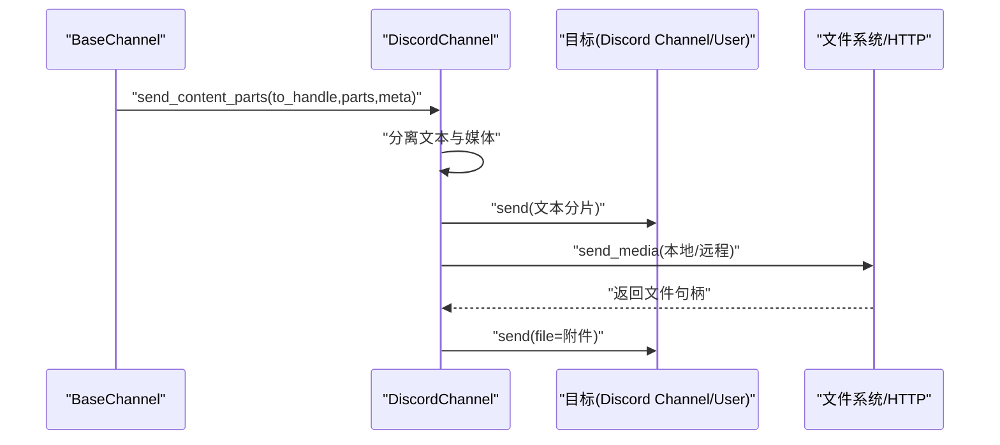

**图表来源**
- [src/copaw/app/channels/base.py:700-764](file://src/copaw/app/channels/base.py#L700-L764)
- [src/copaw/app/channels/discord_/channel.py:455-552](file://src/copaw/app/channels/discord_/channel.py#L455-L552)
- [src/copaw/app/channels/discord_/channel.py:484-552](file://src/copaw/app/channels/discord_/channel.py#L484-L552)

**章节来源**
- [src/copaw/app/channels/base.py:700-764](file://src/copaw/app/channels/base.py#L700-L764)
- [src/copaw/app/channels/discord_/channel.py:455-552](file://src/copaw/app/channels/discord_/channel.py#L455-L552)
- [src/copaw/app/channels/discord_/channel.py:484-552](file://src/copaw/app/channels/discord_/channel.py#L484-L552)

### 权限控制与策略
- 策略类型：开放(open)与白名单(allowlist)两种DM/群组策略。
- 白名单：允许来自allow_from列表的用户；否则根据策略返回拒绝消息。
- 提及要求：群组场景可配置require_mention，仅当被@或包含命令时才处理。
- 允许列表检查：在on_message阶段执行，命中则继续，否则直接回复拒绝消息。
- **机器人消息过滤**：支持`accept_bot_messages`配置，控制是否接受其他机器人的消息。

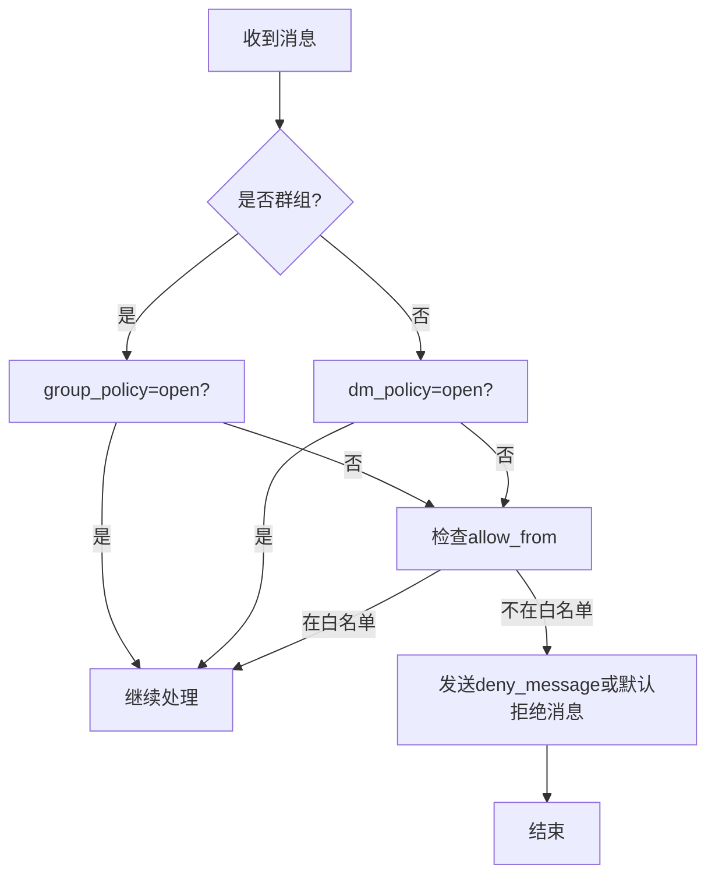

**图表来源**
- [src/copaw/app/channels/base.py:281-316](file://src/copaw/app/channels/base.py#L281-L316)
- [src/copaw/app/channels/discord_/channel.py:245-259](file://src/copaw/app/channels/discord_/channel.py#L245-L259)

**章节来源**
- [src/copaw/app/channels/base.py:281-316](file://src/copaw/app/channels/base.py#L281-L316)
- [src/copaw/app/channels/discord_/channel.py:245-259](file://src/copaw/app/channels/discord_/channel.py#L245-L259)

### 角色提及处理
- **角色@支持**：检测消息中的角色提及，如果提及的角色包含机器人自身，则视为机器人被提及。
- **文本清理**：移除角色提及标签，避免影响消息内容。
- **权限检查**：基于角色权限判断是否应该处理该消息。

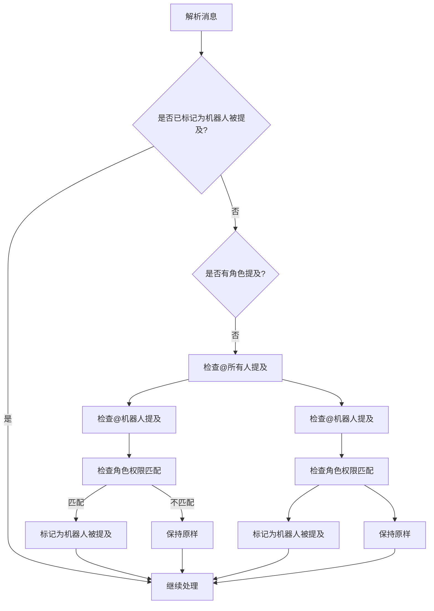

**图表来源**
- [src/copaw/app/channels/discord_/channel.py:136-165](file://src/copaw/app/channels/discord_/channel.py#L136-L165)

**章节来源**
- [src/copaw/app/channels/discord_/channel.py:136-165](file://src/copaw/app/channels/discord_/channel.py#L136-L165)

### 渲染与消息类型支持
- 支持类型：文本、拒绝、图片、视频、音频、文件。
- 工具调用/输出：可选择显示/过滤工具详情与思考内容。
- 代码块：渲染器支持代码围栏，确保跨消息块正确闭合。

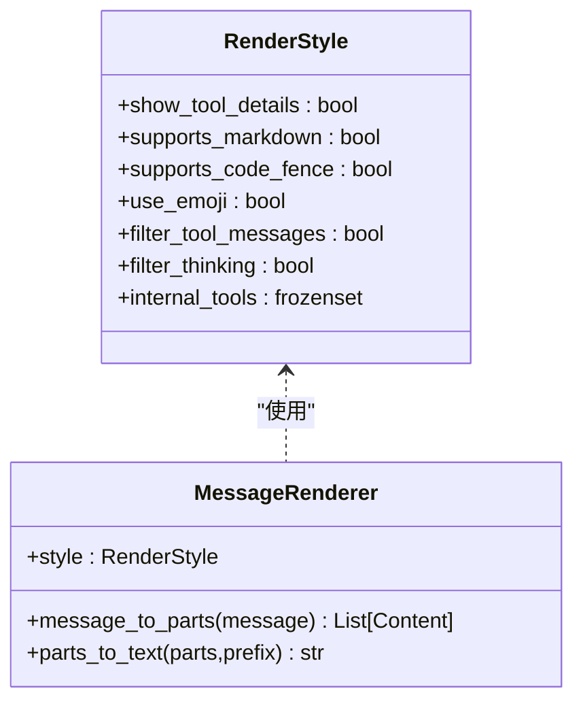

**图表来源**
- [src/copaw/app/channels/renderer.py:37-86](file://src/copaw/app/channels/renderer.py#L37-L86)
- [src/copaw/app/channels/renderer.py:78-384](file://src/copaw/app/channels/renderer.py#L78-L384)

**章节来源**
- [src/copaw/app/channels/renderer.py:37-86](file://src/copaw/app/channels/renderer.py#L37-L86)
- [src/copaw/app/channels/renderer.py:78-384](file://src/copaw/app/channels/renderer.py#L78-L384)

### 并发与队列
- 每通道4个消费者worker并行处理不同会话。
- 同一会话键在同一时刻仅一个worker处理，其他入pending，完成后合并入队。
- 队列容量与线程安全：enqueue通过loop.call_soon_threadsafe保证线程安全。

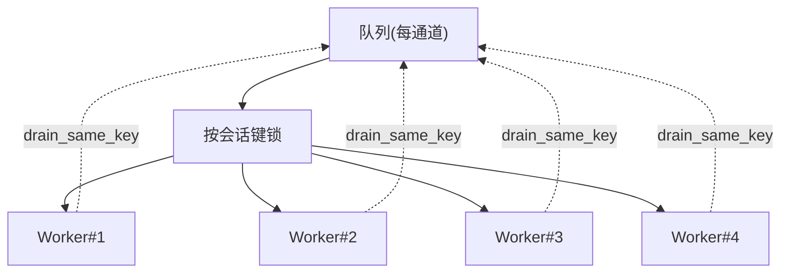

**图表来源**
- [src/copaw/app/channels/manager.py:322-382](file://src/copaw/app/channels/manager.py#L322-L382)
- [src/copaw/app/channels/manager.py:42-112](file://src/copaw/app/channels/manager.py#L42-L112)

**章节来源**
- [src/copaw/app/channels/manager.py:322-382](file://src/copaw/app/channels/manager.py#L322-L382)
- [src/copaw/app/channels/manager.py:42-112](file://src/copaw/app/channels/manager.py#L42-L112)

## 依赖关系分析
- 内部依赖
  - BaseChannel为所有通道提供统一接口与通用逻辑。
  - ChannelManager负责通道生命周期、队列与并发。
  - Renderer与Utils为通道提供渲染与通用能力。
  - Registry与Schema提供通道注册与路由协议。
- 外部依赖
  - discord.py：Discord事件与API交互。
  - aiohttp：HTTP下载媒体与代理认证。
  - agentscope_runtime引擎：消息与内容类型定义。

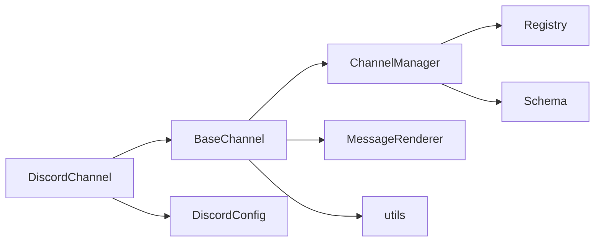

**图表来源**
- [src/copaw/app/channels/discord_/channel.py:40-630](file://src/copaw/app/channels/discord_/channel.py#L40-L630)
- [src/copaw/app/channels/base.py:69-800](file://src/copaw/app/channels/base.py#L69-L800)
- [src/copaw/app/channels/manager.py:114-580](file://src/copaw/app/channels/manager.py#L114-L580)
- [src/copaw/app/channels/registry.py:19-34](file://src/copaw/app/channels/registry.py#L19-L34)
- [src/copaw/app/channels/schema.py:12-48](file://src/copaw/app/channels/schema.py#L12-L48)
- [src/copaw/config/config.py:59-63](file://src/copaw/config/config.py#L59-L63)

**章节来源**
- [src/copaw/app/channels/discord_/channel.py:40-630](file://src/copaw/app/channels/discord_/channel.py#L40-L630)
- [src/copaw/app/channels/base.py:69-800](file://src/copaw/app/channels/base.py#L69-L800)
- [src/copaw/app/channels/manager.py:114-580](file://src/copaw/app/channels/manager.py#L114-L580)
- [src/copaw/app/channels/registry.py:19-34](file://src/copaw/app/channels/registry.py#L19-L34)
- [src/copaw/app/channels/schema.py:12-48](file://src/copaw/app/channels/schema.py#L12-L48)
- [src/copaw/config/config.py:59-63](file://src/copaw/config/config.py#L59-L63)

## 性能考虑
- 文本分片：按换行拆分，保留代码围栏闭合，避免超长消息导致失败。
- 去重与批处理：同会话合并减少重复处理，降低API压力。
- 并发策略：多worker并行处理不同会话，同会话串行避免乱序。
- 媒体下载：HTTP下载采用临时文件，结束后清理，避免磁盘占用。
- 代理与认证：支持HTTP代理与BasicAuth，便于网络受限环境部署。
- **重复消息检测**：维护最多500个消息ID的缓存，有效防止重复处理。

## 故障排除指南
- 无法连接Discord
  - 检查DISCORD_BOT_TOKEN是否正确设置。
  - 确认机器人已添加至服务器并授予必要权限。
  - 如需代理，检查DISCORD_HTTP_PROXY与DISCORD_HTTP_PROXY_AUTH。
- 消息未被处理
  - 群组场景是否开启require_mention且未被@。
  - 白名单策略下是否在allow_from中。
  - **机器人消息过滤**：检查accept_bot_messages配置是否正确。
- 发送失败
  - 文本超长：确认已按2000字符拆分。
  - 媒体下载失败：检查URL可达性与状态码。
- 并发问题
  - 同会话消息乱序：确认去重与批处理逻辑正常。
  - 消费者任务堆积：检查队列容量与worker数量。
- **重复消息问题**
  - 如果出现重复消息：检查消息ID缓存是否正常工作。
  - 缓存满载：确认_MAX_CACHED_MESSAGE_IDS配置是否合适。

**章节来源**
- [src/copaw/app/channels/discord_/channel.py:455-552](file://src/copaw/app/channels/discord_/channel.py#L455-L552)
- [src/copaw/app/channels/base.py:281-316](file://src/copaw/app/channels/base.py#L281-L316)
- [src/copaw/app/channels/manager.py:322-382](file://src/copaw/app/channels/manager.py#L322-L382)

## 结论
Discord渠道适配器通过统一的通道抽象与队列化并发模型，实现了高可靠、高性能的消息处理与发送。其具备完善的权限策略、消息去重与批处理、媒体附件支持与代理配置能力，适合在复杂环境中稳定运行。

**更新** 新增的机器人消息过滤功能提供了更精细的控制选项，包括重复消息检测和角色提及处理，进一步增强了系统的鲁棒性和灵活性。

## 附录

### 配置项与环境变量
- DISCORD_CHANNEL_ENABLED：启用/禁用Discord通道
- DISCORD_BOT_TOKEN：Discord机器人令牌
- DISCORD_HTTP_PROXY：HTTP代理地址
- DISCORD_HTTP_PROXY_AUTH：代理BasicAuth凭据
- DISCORD_BOT_PREFIX：回复前缀
- DISCORD_DM_POLICY / DISCORD_GROUP_POLICY：DM/群组策略（open/allowlist）
- DISCORD_ALLOW_FROM：白名单ID列表（逗号分隔）
- DISCORD_DENY_MESSAGE：拒绝消息内容
- DISCORD_REQUIRE_MENTION：群组是否必须提及
- **DISCORD_ACCEPT_BOT_MESSAGES**：是否接受其他机器人的消息（新增）

**更新** 新增DISCORD_ACCEPT_BOT_MESSAGES配置选项，用于控制是否接受其他机器人的消息。

**章节来源**
- [src/copaw/app/channels/discord_/channel.py:286-307](file://src/copaw/app/channels/discord_/channel.py#L286-L307)
- [src/copaw/config/config.py:59-63](file://src/copaw/config/config.py#L59-L63)
- [console/src/api/types/channel.ts:17-22](file://console/src/api/types/channel.ts#L17-L22)

### API限制与最佳实践
- 消息长度：Discord单条消息最大字符数限制，适配器自动拆分。
- 速率限制：遵循Discord API速率限制，合理设置并发与重试。
- 媒体大小：注意附件大小限制，优先使用真实附件而非URL回退。
- 代理与网络：在受限网络环境下使用代理与认证，确保稳定性。
- **重复消息处理**：利用内置的重复消息检测机制，避免重复处理相同消息。
- **角色提及**：合理配置角色权限，确保机器人能够正确响应相关提及。