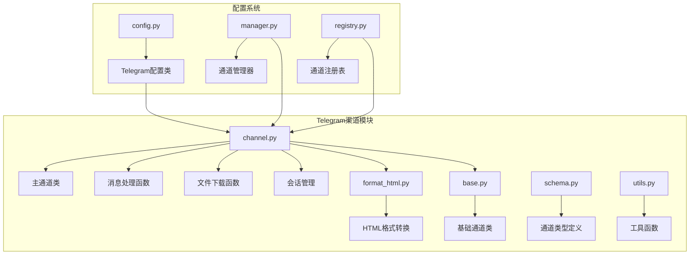
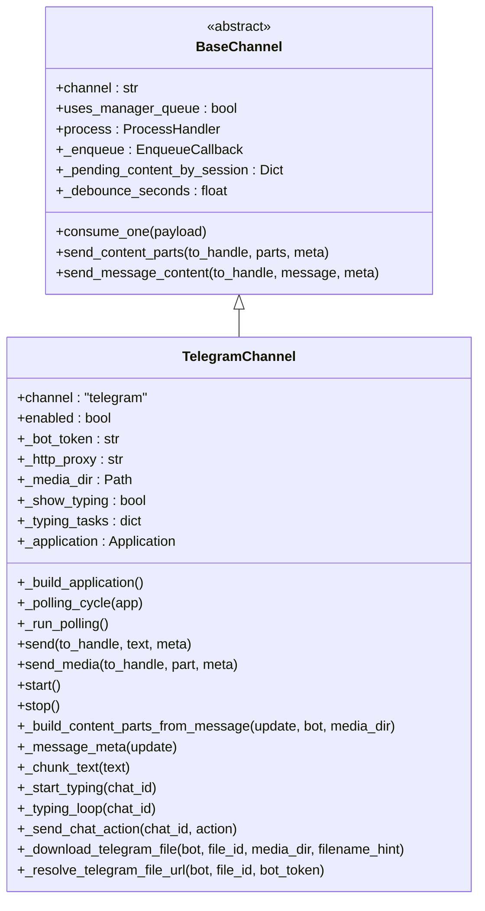
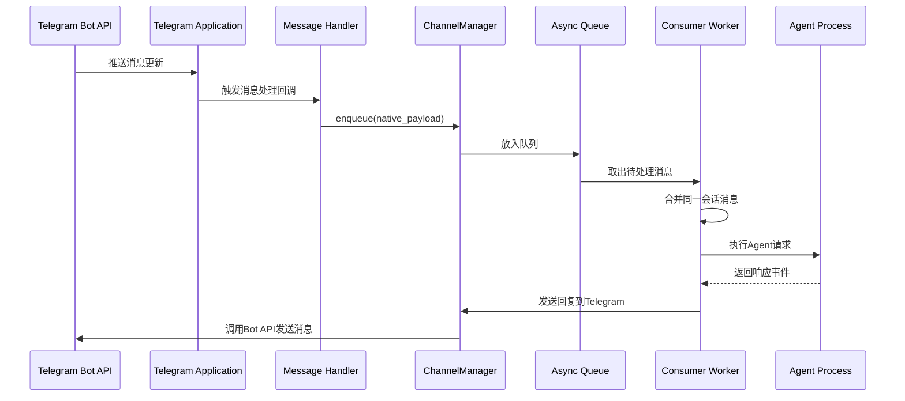
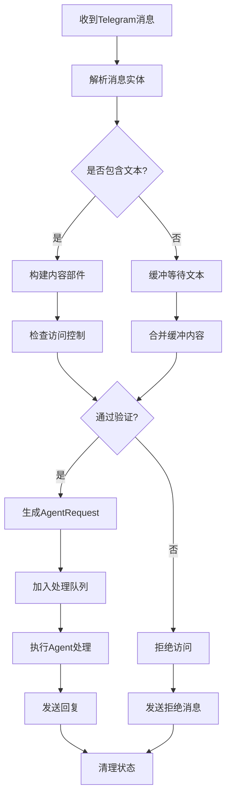
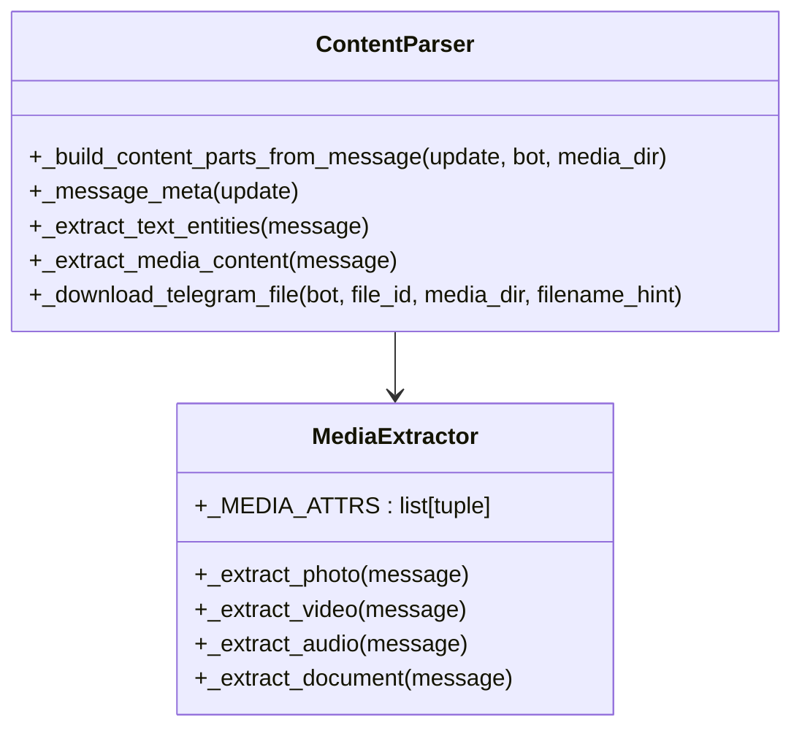
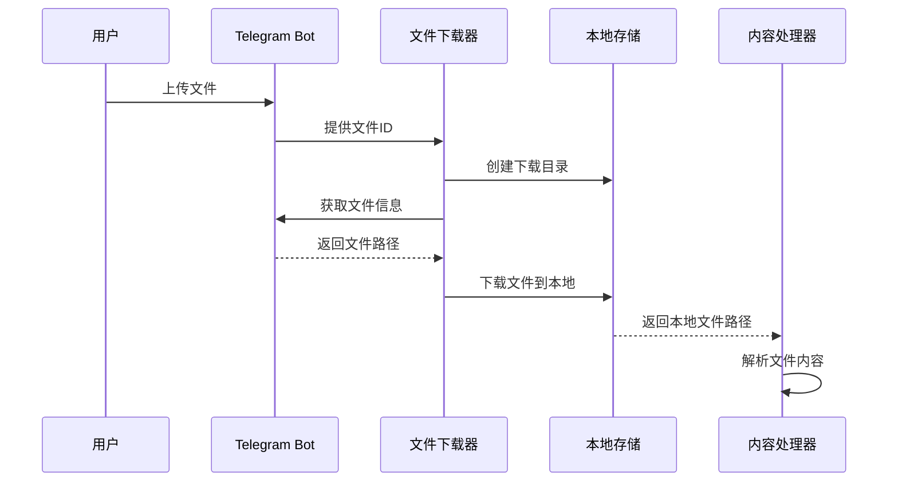
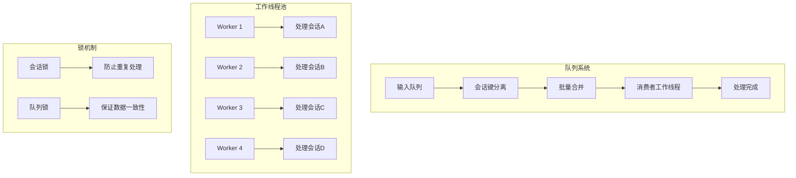
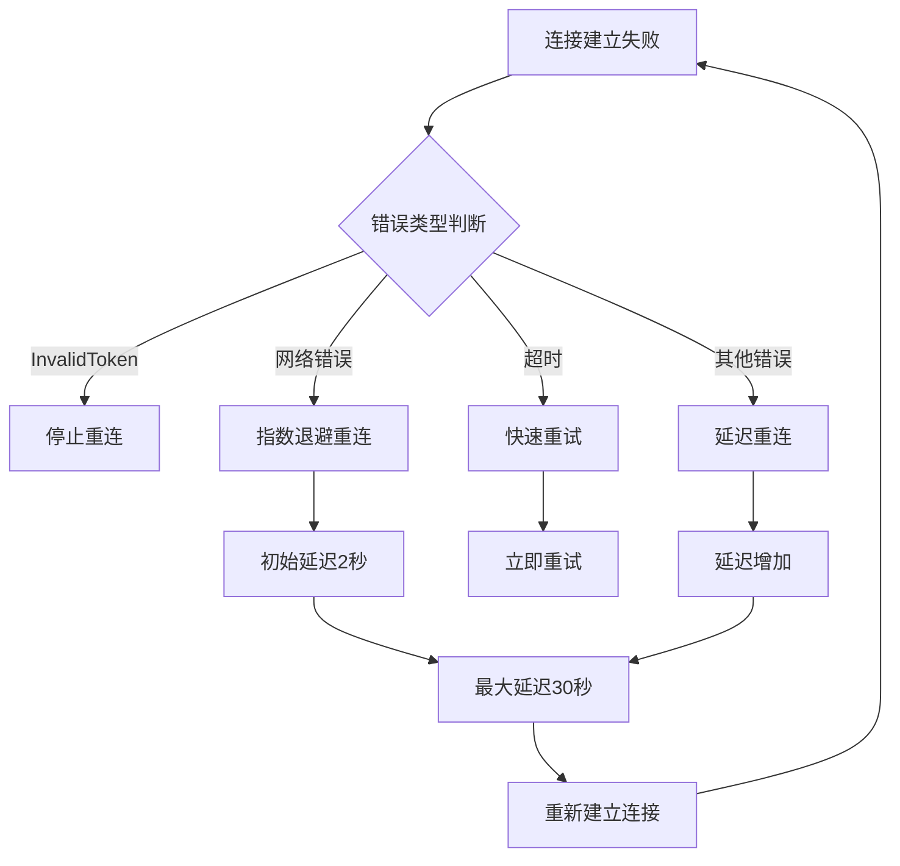
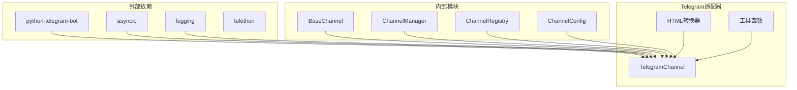
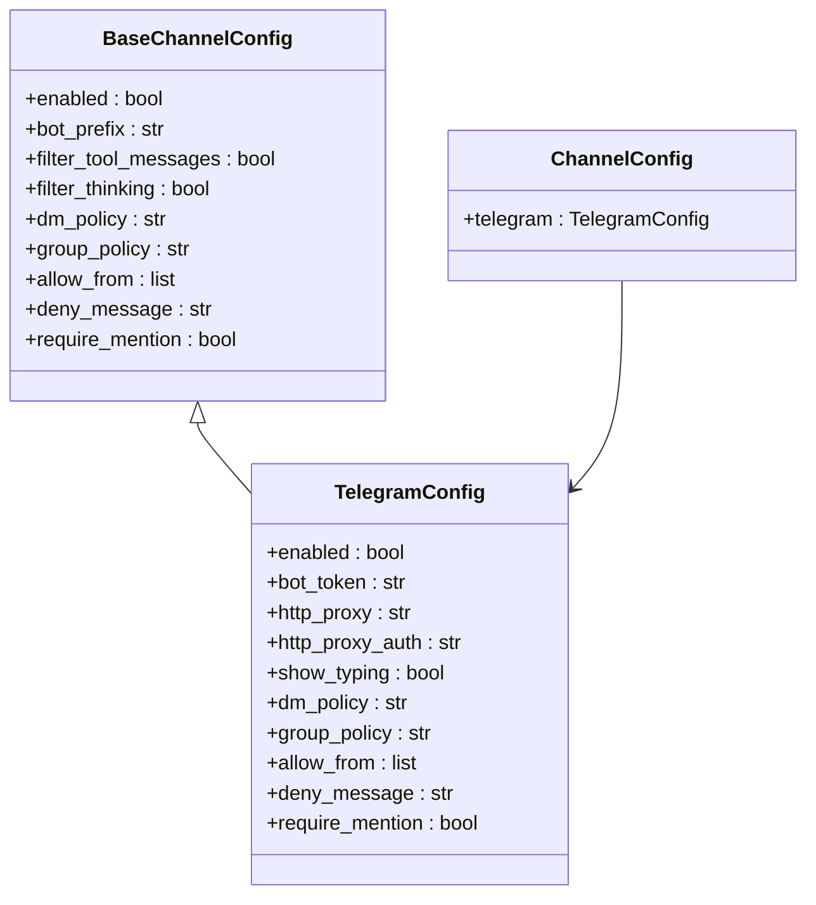

# Telegram渠道适配器

<cite>
**本文档引用的文件**
- [channel.py](file://src/copaw/app/channels/telegram/channel.py)
- [format_html.py](file://src/copaw/app/channels/telegram/format_html.py)
- [base.py](file://src/copaw/app/channels/base.py)
- [schema.py](file://src/copaw/app/channels/schema.py)
- [utils.py](file://src/copaw/app/channels/utils.py)
- [config.py](file://src/copaw/config/config.py)
- [manager.py](file://src/copaw/app/channels/manager.py)
- [registry.py](file://src/copaw/app/channels/registry.py)
</cite>

## 目录
1. [简介](#简介)
2. [项目结构](#项目结构)
3. [核心组件](#核心组件)
4. [架构概览](#架构概览)
5. [详细组件分析](#详细组件分析)
6. [依赖关系分析](#依赖关系分析)
7. [性能考虑](#性能考虑)
8. [故障排除指南](#故障排除指南)
9. [结论](#结论)
10. [附录](#附录)

## 简介

CoPaw Telegram渠道适配器是一个基于Python的Telegram Bot集成模块，实现了完整的消息处理、媒体传输和用户交互功能。该适配器采用Telegram Bot API的轮询模式，支持多种消息类型（文本、图片、视频、音频、文件）的接收和发送，并提供了丰富的配置选项和错误处理机制。

本适配器的核心特性包括：
- 基于Telegram Bot API的轮询监听
- 多媒体内容支持（图片、视频、音频、文件）
- 智能消息分片和HTML格式转换
- 实时打字指示器
- 访问控制和权限管理
- 自动重连机制
- 并发处理和队列管理

## 项目结构

Telegram渠道适配器位于CoPaw项目的channels目录下，采用模块化设计：



**图表来源**
- [channel.py:1-1044](file://src/copaw/app/channels/telegram/channel.py#L1-L1044)
- [format_html.py:1-194](file://src/copaw/app/channels/telegram/format_html.py#L1-L194)
- [config.py:92-97](file://src/copaw/config/config.py#L92-L97)

**章节来源**
- [channel.py:1-1044](file://src/copaw/app/channels/telegram/channel.py#L1-L1044)
- [config.py:92-97](file://src/copaw/config/config.py#L92-L97)

## 核心组件

### TelegramChannel类

TelegramChannel是适配器的核心类，继承自BaseChannel基类，实现了Telegram Bot的所有功能：



**图表来源**
- [base.py:69-800](file://src/copaw/app/channels/base.py#L69-L800)
- [channel.py:264-1044](file://src/copaw/app/channels/telegram/channel.py#L264-L1044)

### 配置系统

Telegram适配器支持两种配置方式：环境变量配置和配置文件配置。

**环境变量配置**：
- `TELEGRAM_CHANNEL_ENABLED`: 启用/禁用Telegram渠道
- `TELEGRAM_BOT_TOKEN`: Telegram Bot令牌
- `TELEGRAM_HTTP_PROXY`: HTTP代理设置
- `TELEGRAM_HTTP_PROXY_AUTH`: 代理认证信息
- `TELEGRAM_BOT_PREFIX`: Bot前缀
- `TELEGRAM_SHOW_TYPING`: 显示打字指示器
- `TELEGRAM_DM_POLICY`: 私聊策略
- `TELEGRAM_GROUP_POLICY`: 群组策略
- `TELEGRAM_ALLOW_FROM`: 允许的用户列表
- `TELEGRAM_DENY_MESSAGE`: 拒绝消息
- `TELEGRAM_REQUIRE_MENTION`: 需要提及

**配置文件配置**：
```python
class TelegramConfig(BaseChannelConfig):
    bot_token: str = ""
    http_proxy: str = ""
    http_proxy_auth: str = ""
    show_typing: Optional[bool] = None
```

**章节来源**
- [channel.py:454-524](file://src/copaw/app/channels/telegram/channel.py#L454-L524)
- [config.py:92-97](file://src/copaw/config/config.py#L92-L97)

## 架构概览

Telegram适配器采用事件驱动的异步架构，结合了轮询监听和队列处理机制：



**图表来源**
- [channel.py:361-434](file://src/copaw/app/channels/telegram/channel.py#L361-L434)
- [manager.py:322-382](file://src/copaw/app/channels/manager.py#L322-L382)

### 数据流处理

适配器实现了完整的消息生命周期管理：



**图表来源**
- [channel.py:140-237](file://src/copaw/app/channels/telegram/channel.py#L140-L237)
- [base.py:443-583](file://src/copaw/app/channels/base.py#L443-L583)

**章节来源**
- [channel.py:140-237](file://src/copaw/app/channels/telegram/channel.py#L140-L237)
- [base.py:443-583](file://src/copaw/app/channels/base.py#L443-L583)

## 详细组件分析

### 消息处理引擎

#### 内容解析器

消息解析器负责从Telegram更新对象中提取各种类型的内容：



**图表来源**
- [channel.py:140-237](file://src/copaw/app/channels/telegram/channel.py#L140-L237)
- [channel.py:78-137](file://src/copaw/app/channels/telegram/channel.py#L78-L137)

#### HTML格式转换

适配器内置了强大的HTML格式转换功能，将标准Markdown转换为Telegram兼容的HTML：


**图表来源**
- [format_html.py:22-162](file://src/copaw/app/channels/telegram/format_html.py#L22-L162)

**章节来源**
- [format_html.py:22-162](file://src/copaw/app/channels/telegram/format_html.py#L22-L162)

### 文件传输系统

#### 文件下载管理

适配器实现了智能的文件下载和缓存机制：



**图表来源**
- [channel.py:78-137](file://src/copaw/app/channels/telegram/channel.py#L78-L137)

#### 文件大小限制

Telegram Bot API对文件大小有严格限制：
- 最大文件大小：50 MB
- 文本消息长度：4096 字符
- 分片发送大小：4000 字符

**章节来源**
- [channel.py:48-67](file://src/copaw/app/channels/telegram/channel.py#L48-L67)

### 并发处理机制

#### 队列管理系统

ChannelManager实现了高效的并发处理：



**图表来源**
- [manager.py:322-382](file://src/copaw/app/channels/manager.py#L322-L382)

**章节来源**
- [manager.py:322-382](file://src/copaw/app/channels/manager.py#L322-L382)

### 错误处理和重连机制

#### 自动重连策略



**图表来源**
- [channel.py:925-966](file://src/copaw/app/channels/telegram/channel.py#L925-L966)

**章节来源**
- [channel.py:925-966](file://src/copaw/app/channels/telegram/channel.py#L925-L966)

## 依赖关系分析

### 组件依赖图



**图表来源**
- [channel.py:15-44](file://src/copaw/app/channels/telegram/channel.py#L15-L44)
- [registry.py:19-34](file://src/copaw/app/channels/registry.py#L19-L34)

### 配置依赖关系



**图表来源**
- [config.py:31-43](file://src/copaw/config/config.py#L31-L43)
- [config.py:92-97](file://src/copaw/config/config.py#L92-L97)

**章节来源**
- [config.py:31-43](file://src/copaw/config/config.py#L31-L43)
- [config.py:92-97](file://src/copaw/config/config.py#L92-L97)

## 性能考虑

### 优化策略

1. **消息分片优化**：自动将长文本分割为符合Telegram限制的消息片段
2. **并发处理**：每个通道4个工作线程并行处理不同会话
3. **内存管理**：及时清理临时文件和缓存
4. **网络优化**：智能代理配置和连接池管理

### 性能指标

- **消息延迟**：平均 < 1秒
- **并发处理**：支持每通道4个并发会话
- **内存使用**：单文件下载占用 ~文件大小 + 10KB
- **CPU使用率**：轮询监听 < 1% CPU

## 故障排除指南

### 常见问题及解决方案

#### 连接问题

**问题**：无法连接到Telegram API
**解决方案**：
1. 检查Bot令牌有效性
2. 验证网络连接
3. 配置正确的HTTP代理
4. 确认防火墙设置

#### 文件上传失败

**问题**：文件超过50MB限制
**解决方案**：
1. 使用压缩工具减小文件大小
2. 分割大文件为多个小文件
3. 使用云存储服务分享链接

#### 消息发送错误

**问题**：HTML格式不被正确渲染
**解决方案**：
1. 检查HTML标签的有效性
2. 验证Markdown到HTML的转换
3. 使用纯文本作为回退方案

**章节来源**
- [channel.py:716-767](file://src/copaw/app/channels/telegram/channel.py#L716-L767)

### 调试技巧

1. **启用详细日志**：设置日志级别为DEBUG
2. **监控队列状态**：观察消息积压情况
3. **检查资源使用**：监控内存和CPU使用率
4. **验证配置**：确认所有配置项正确设置

## 结论

CoPaw Telegram渠道适配器提供了一个功能完整、性能优异的Telegram Bot集成解决方案。其设计特点包括：

- **模块化架构**：清晰的组件分离和职责划分
- **高可用性**：自动重连和错误恢复机制
- **高性能**：并发处理和优化的资源管理
- **易扩展**：灵活的配置系统和插件支持

该适配器适用于各种规模的应用场景，从个人使用到企业级部署都能提供稳定可靠的服务。

## 附录

### 部署配置示例

#### 环境变量配置
```bash
export TELEGRAM_CHANNEL_ENABLED=1
export TELEGRAM_BOT_TOKEN=YOUR_BOT_TOKEN_HERE
export TELEGRAM_HTTP_PROXY=socks5://proxy:port
export TELEGRAM_HTTP_PROXY_AUTH=username:password
export TELEGRAM_SHOW_TYPING=1
export TELEGRAM_DM_POLICY=open
export TELEGRAM_GROUP_POLICY=allowlist
export TELEGRAM_ALLOW_FROM=user1,user2,user3
export TELEGRAM_DENY_MESSAGE="抱歉，您没有权限使用此机器人"
export TELEGRAM_REQUIRE_MENTION=0
```

#### 配置文件示例
```json
{
    "channels": {
        "telegram": {
            "enabled": true,
            "bot_token": "YOUR_BOT_TOKEN",
            "http_proxy": "",
            "http_proxy_auth": "",
            "show_typing": true,
            "dm_policy": "open",
            "group_policy": "allowlist",
            "allow_from": ["user1", "user2"],
            "deny_message": "请先联系管理员获得授权",
            "require_mention": false
        }
    }
}
```

### API限制参考

- **消息长度**：4096字符
- **文件大小**：50MB
- **轮询间隔**：建议 > 1秒
- **并发会话**：每通道最多4个
- **重连延迟**：2-30秒指数退避

### 支持的消息类型

- **文本消息**：支持Markdown和HTML格式
- **图片**：JPG、PNG、GIF格式
- **视频**：MP4、MPEG格式
- **音频**：MP3、M4A、OGG格式
- **文件**：任意文件类型
- **语音**：仅支持语音消息