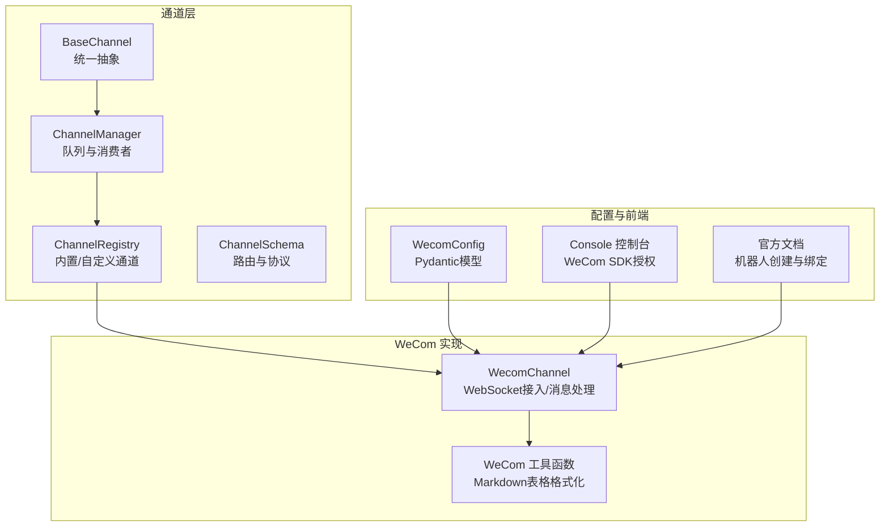
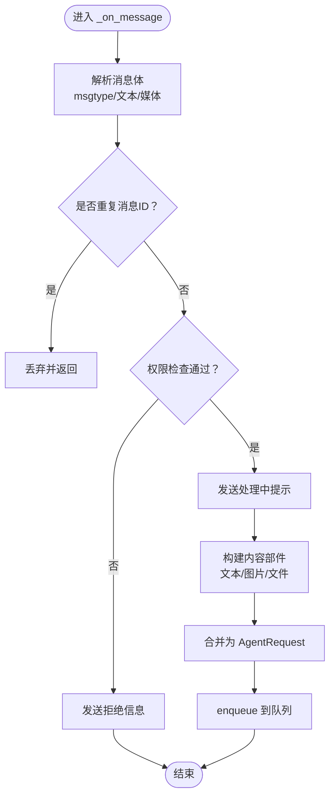
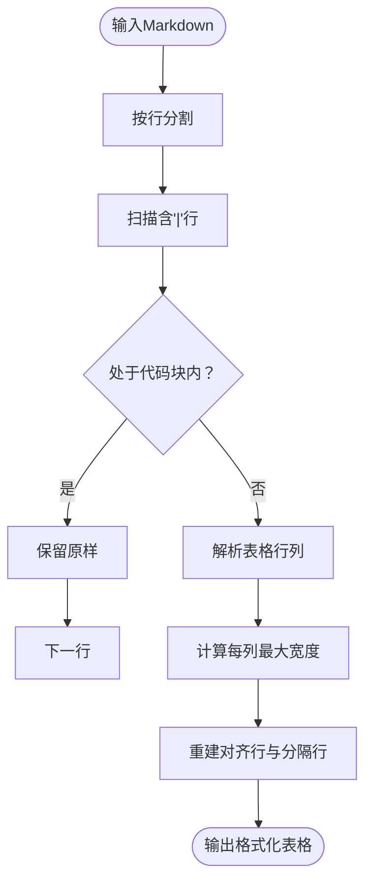
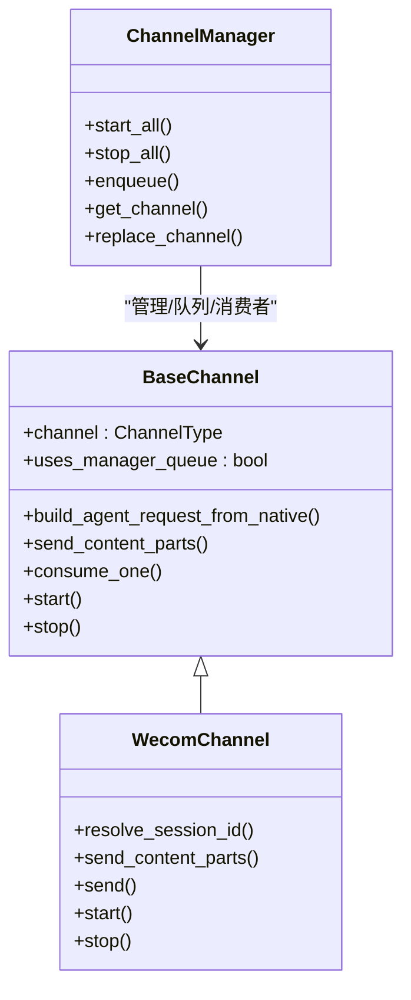
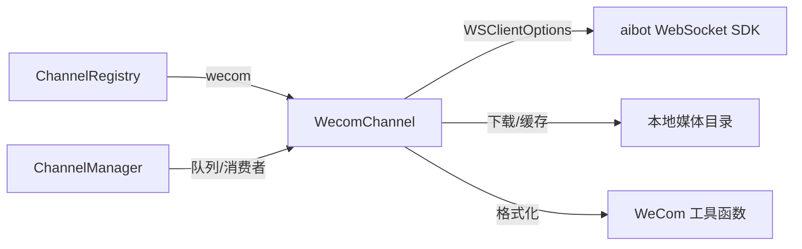

# 企业微信渠道适配器

<cite>
**本文档引用的文件**
- [src/copaw/app/channels/wecom/channel.py](file://src/copaw/app/channels/wecom/channel.py)
- [src/copaw/app/channels/wecom/utils.py](file://src/copaw/app/channels/wecom/utils.py)
- [src/copaw/app/channels/base.py](file://src/copaw/app/channels/base.py)
- [src/copaw/app/channels/manager.py](file://src/copaw/app/channels/manager.py)
- [src/copaw/app/channels/registry.py](file://src/copaw/app/channels/registry.py)
- [src/copaw/app/channels/schema.py](file://src/copaw/app/channels/schema.py)
- [src/copaw/config/config.py](file://src/copaw/config/config.py)
- [deploy/Dockerfile](file://deploy/Dockerfile)
- [deploy/config/supervisord.conf.template](file://deploy/config/supervisord.conf.template)
- [console/src/pages/Control/Channels/components/ChannelDrawer.tsx](file://console/src/pages/Control/Channels/components/ChannelDrawer.tsx)
- [website/public/docs/channels.en.md](file://website/public/docs/channels.en.md)
</cite>

## 目录
1. [简介](#简介)
2. [项目结构](#项目结构)
3. [核心组件](#核心组件)
4. [架构总览](#架构总览)
5. [详细组件分析](#详细组件分析)
6. [依赖关系分析](#依赖关系分析)
7. [性能考虑](#性能考虑)
8. [故障排除指南](#故障排除指南)
9. [结论](#结论)
10. [附录](#附录)

## 简介
本文件为企业微信（WeCom）渠道适配器的深度技术文档，面向需要在企业微信环境中部署与运维的企业级AI应用开发者。文档围绕以下主题展开：企业微信机器人与应用的消息收发机制、消息类型支持、会话与去重策略、权限控制、并发处理模型、部署与容器化配置、以及与平台特性相关的限制与优化建议。同时，结合前端控制台与官方文档，给出配置指引与排障方法。

## 项目结构
企业微信适配器位于通道子系统中，采用统一的通道抽象与管理框架，具备如下层次：
- 通道基类与通用能力：统一请求构建、消息渲染、发送流程、时间去抖与合并、权限控制等
- 通道管理器：负责队列、消费者线程池、批量处理与会话级合并
- 注册表：内置与自定义通道的发现与加载
- WeCom 专用实现：WebSocket 接入、消息解析、媒体下载、Markdown 表格兼容、欢迎语等
- 配置模型：Pydantic 模型定义通道配置字段
- 前端控制台：WeCom SDK 动态加载与授权按钮、配置表单
- 官方文档：机器人创建与绑定步骤



**图表来源**
- [src/copaw/app/channels/base.py:69-125](file://src/copaw/app/channels/base.py#L69-L125)
- [src/copaw/app/channels/manager.py:114-156](file://src/copaw/app/channels/manager.py#L114-L156)
- [src/copaw/app/channels/registry.py:19-34](file://src/copaw/app/channels/registry.py#L19-L34)
- [src/copaw/app/channels/wecom/channel.py:49-97](file://src/copaw/app/channels/wecom/channel.py#L49-L97)
- [src/copaw/app/channels/wecom/utils.py:9-20](file://src/copaw/app/channels/wecom/utils.py#L9-L20)
- [src/copaw/config/config.py:132-140](file://src/copaw/config/config.py#L132-L140)
- [console/src/pages/Control/Channels/components/ChannelDrawer.tsx:186-243](file://console/src/pages/Control/Channels/components/ChannelDrawer.tsx#L186-L243)
- [website/public/docs/channels.en.md:461-497](file://website/public/docs/channels.en.md#L461-L497)

**章节来源**
- [src/copaw/app/channels/wecom/channel.py:49-97](file://src/copaw/app/channels/wecom/channel.py#L49-L97)
- [src/copaw/app/channels/manager.py:114-156](file://src/copaw/app/channels/manager.py#L114-L156)
- [src/copaw/app/channels/registry.py:19-34](file://src/copaw/app/channels/registry.py#L19-L34)
- [src/copaw/config/config.py:132-140](file://src/copaw/config/config.py#L132-L140)

## 核心组件
- WeCom 渠道实现：基于 aibot WebSocket SDK 的长连接，接收文本、图片、语音、文件、混合消息；支持去重、会话键生成、欢迎语、处理中提示、媒体下载与本地缓存、Markdown 表格格式化等
- 通道基类：统一请求构建、消息渲染、发送内容拆分、时间去抖与合并、权限检查、错误处理回调
- 通道管理器：为每个启用通道创建队列与消费者线程池，按会话键合并同源消息，支持批量处理
- 注册表：内置 WeCom 通道映射，支持自定义通道扩展
- 配置模型：WeComConfig 提供 bot_id、secret、media_dir、welcome_text、最大重连次数等字段
- 前端控制台：动态加载 WeCom SDK，提供一键授权并回填 bot_id/secret，支持媒体目录与欢迎语配置
- 官方文档：提供机器人创建与绑定步骤，便于快速上线

**章节来源**
- [src/copaw/app/channels/wecom/channel.py:49-168](file://src/copaw/app/channels/wecom/channel.py#L49-L168)
- [src/copaw/app/channels/base.py:69-125](file://src/copaw/app/channels/base.py#L69-L125)
- [src/copaw/app/channels/manager.py:114-156](file://src/copaw/app/channels/manager.py#L114-L156)
- [src/copaw/app/channels/registry.py:19-34](file://src/copaw/app/channels/registry.py#L19-L34)
- [src/copaw/config/config.py:132-140](file://src/copaw/config/config.py#L132-L140)
- [console/src/pages/Control/Channels/components/ChannelDrawer.tsx:727-770](file://console/src/pages/Control/Channels/components/ChannelDrawer.tsx#L727-L770)
- [website/public/docs/channels.en.md:461-497](file://website/public/docs/channels.en.md#L461-L497)

## 架构总览
WeCom 渠道通过 WebSocket 与企业微信 AI Bot 长连接通信，消息经由通道管理器进入队列，按会话键合并后交由通道消费，最终转换为 Agent 请求并进入统一处理流。发送路径则将 Agent 响应内容拆分为文本与媒体部分，优先使用流式回复，必要时以 Markdown 形式发送。

```mermaid
sequenceDiagram
participant WeCom as "企业微信客户端"
participant SDK as "aibot WebSocket SDK"
participant WS as "WecomChannel<br/>WebSocket线程"
participant Loop as "事件循环"
participant Manager as "ChannelManager"
participant Channel as "WecomChannel"
participant Agent as "Agent处理流"
WeCom->>SDK : "推送消息帧"
SDK->>WS : "触发 message 事件"
WS->>Loop : "调度到事件循环"
Loop->>Channel : "_on_message 解析消息"
Channel->>Manager : "enqueue 原生负载"
Manager->>Channel : "consume_one 合并/去抖"
Channel->>Agent : "构建AgentRequest并处理"
Agent-->>Channel : "事件流/响应"
Channel->>WeCom : "reply_stream/markdown 回复"
```

**图表来源**
- [src/copaw/app/channels/wecom/channel.py:290-478](file://src/copaw/app/channels/wecom/channel.py#L290-L478)
- [src/copaw/app/channels/manager.py:322-382](file://src/copaw/app/channels/manager.py#L322-L382)
- [src/copaw/app/channels/base.py:443-583](file://src/copaw/app/channels/base.py#L443-L583)

## 详细组件分析

### WeComChannel 组件
- 连接与生命周期
  - 通过 WSClientOptions 初始化 bot_id、secret、最大重连次数
  - 在独立线程中运行 WebSocket 事件循环，注册 message 与 enter_chat 事件处理器
  - 支持优雅停止，断开连接并等待线程退出
- 消息解析与去重
  - 解析 msgtype 文本、图片、语音、文件、混合消息
  - 使用有序字典维护最近处理过的 message_id，防止重复处理
  - 支持群聊与单聊会话键生成，群聊共享 session
- 权限控制
  - 支持开放策略与白名单策略，分别针对私聊与群聊
  - 不允许访问时直接通过流式回复返回拒绝信息
- 处理中提示与欢迎语
  - 当存在文本内容时，先发送“思考中...”占位流
  - enter_chat 事件触发时可发送欢迎语
- 媒体处理
  - 图片/文件通过 SDK 下载至本地 media_dir，并记录安全文件名
  - 由于 WebSocket 通道不支持直接上传媒体，图片以 Markdown 链接形式发送
- 发送路径
  - 文本内容按块拆分，优先使用 reply_stream 覆盖“思考中...”
  - Markdown 表格格式化以提升兼容性
  - 支持主动发送（proactive），通过 send_message 发送 Markdown



**图表来源**
- [src/copaw/app/channels/wecom/channel.py:290-478](file://src/copaw/app/channels/wecom/channel.py#L290-L478)
- [src/copaw/app/channels/base.py:281-303](file://src/copaw/app/channels/base.py#L281-L303)

**章节来源**
- [src/copaw/app/channels/wecom/channel.py:778-828](file://src/copaw/app/channels/wecom/channel.py#L778-L828)
- [src/copaw/app/channels/wecom/channel.py:290-478](file://src/copaw/app/channels/wecom/channel.py#L290-L478)
- [src/copaw/app/channels/wecom/channel.py:588-737](file://src/copaw/app/channels/wecom/channel.py#L588-L737)
- [src/copaw/app/channels/wecom/channel.py:503-532](file://src/copaw/app/channels/wecom/channel.py#L503-L532)

### WeCom 工具函数
- Markdown 表格格式化
  - 自动识别表格行，计算每列宽度，重建对齐分隔符
  - 忽略代码块内的表格，确保代码内容不变
  - 输出符合企业微信渲染要求的表格



**图表来源**
- [src/copaw/app/channels/wecom/utils.py:9-109](file://src/copaw/app/channels/wecom/utils.py#L9-L109)

**章节来源**
- [src/copaw/app/channels/wecom/utils.py:9-109](file://src/copaw/app/channels/wecom/utils.py#L9-L109)

### 通道基类与管理器
- 通道基类
  - 统一构建 AgentRequest、消息渲染、发送内容拆分、时间去抖与合并、权限检查、错误回调
  - 支持内部工具过滤、思维内容过滤、工具详情显示等渲染策略
- 通道管理器
  - 为每个通道创建队列与固定数量消费者线程
  - 按会话键合并同一会话的多个负载，避免并发冲突
  - 批量处理 native payload 或 AgentRequest，支持 DingTalk 特殊合并逻辑



**图表来源**
- [src/copaw/app/channels/base.py:69-125](file://src/copaw/app/channels/base.py#L69-L125)
- [src/copaw/app/channels/manager.py:114-156](file://src/copaw/app/channels/manager.py#L114-L156)
- [src/copaw/app/channels/wecom/channel.py:49-97](file://src/copaw/app/channels/wecom/channel.py#L49-L97)

**章节来源**
- [src/copaw/app/channels/base.py:443-583](file://src/copaw/app/channels/base.py#L443-L583)
- [src/copaw/app/channels/manager.py:322-382](file://src/copaw/app/channels/manager.py#L322-L382)

### 配置与前端集成
- WeComConfig（Pydantic）
  - 字段：enabled、bot_id、secret、media_dir、welcome_text、max_reconnect_attempts、dm_policy、group_policy、allow_from、deny_message
- 前端控制台
  - 动态加载 WeCom AIBot SDK，调用 openBotInfoAuthWindow 获取 bot_id/secret 并自动填充
  - 支持媒体目录与欢迎语配置项
- 官方文档
  - 机器人创建与绑定步骤，包含截图与示例配置

**章节来源**
- [src/copaw/config/config.py:132-140](file://src/copaw/config/config.py#L132-L140)
- [console/src/pages/Control/Channels/components/ChannelDrawer.tsx:186-243](file://console/src/pages/Control/Channels/components/ChannelDrawer.tsx#L186-L243)
- [console/src/pages/Control/Channels/components/ChannelDrawer.tsx:727-770](file://console/src/pages/Control/Channels/components/ChannelDrawer.tsx#L727-L770)
- [website/public/docs/channels.en.md:461-497](file://website/public/docs/channels.en.md#L461-L497)

## 依赖关系分析
- 内置通道注册
  - WeCom 通道在注册表中以键 "wecom" 映射到 WecomChannel 类
- 通道类型与路由
  - ChannelType 为字符串标识，内置通道集合用于路由与转换协议
- 通道管理器与消费者
  - 为每个启用通道创建队列与 4 个消费者线程，按会话键合并负载
- WeCom 特有依赖
  - aibot WebSocket SDK（WSClient/WSClientOptions）、消息去重、媒体下载、Markdown 表格格式化



**图表来源**
- [src/copaw/app/channels/registry.py:19-34](file://src/copaw/app/channels/registry.py#L19-L34)
- [src/copaw/app/channels/manager.py:365-393](file://src/copaw/app/channels/manager.py#L365-L393)
- [src/copaw/app/channels/wecom/channel.py:789-795](file://src/copaw/app/channels/wecom/channel.py#L789-L795)
- [src/copaw/app/channels/wecom/utils.py:9-20](file://src/copaw/app/channels/wecom/utils.py#L9-L20)

**章节来源**
- [src/copaw/app/channels/registry.py:19-34](file://src/copaw/app/channels/registry.py#L19-L34)
- [src/copaw/app/channels/manager.py:365-393](file://src/copaw/app/channels/manager.py#L365-L393)

## 性能考虑
- 并发与队列
  - 每通道 4 个消费者线程并行处理不同会话，减少阻塞
  - 时间去抖与按会话键合并，避免重复处理与消息乱序
- 媒体处理
  - 图片/文件下载后缓存至本地 media_dir，避免重复下载
  - 对于 WebSocket 不支持的媒体上传，采用 Markdown 链接回传，降低复杂度
- 文本拆分
  - send_content_parts 将长文本按块拆分，配合流式回复提升交互体验
- 事件循环与线程
  - WebSocket 事件循环在独立线程运行，避免阻塞主事件循环
- 配置优化
  - max_reconnect_attempts 可设置为 -1 以无限重连，或根据网络状况调整

**章节来源**
- [src/copaw/app/channels/manager.py:365-393](file://src/copaw/app/channels/manager.py#L365-L393)
- [src/copaw/app/channels/wecom/channel.py:503-532](file://src/copaw/app/channels/wecom/channel.py#L503-L532)
- [src/copaw/app/channels/wecom/channel.py:588-737](file://src/copaw/app/channels/wecom/channel.py#L588-L737)

## 故障排除指南
- WebSocket 连接失败
  - 检查 bot_id 与 secret 是否正确配置
  - 确认网络可达与防火墙放行
  - 查看日志中 WebSocket 线程异常堆栈
- 消息重复
  - 确认消息 ID 去重机制正常工作，检查 _processed_message_ids 缓存大小上限
- 媒体下载失败
  - 检查 media_dir 可写权限与磁盘空间
  - 确认 AES 密钥与 URL 正确
- 权限被拒
  - 检查 dm_policy/group_policy 与 allow_from 白名单
  - 确认 deny_message 配置
- 表格渲染异常
  - 使用 WeCom 工具函数进行表格格式化，确保列宽与分隔符正确
- 容器化部署问题
  - 确认 supervisord 配置中 Xvfb、DBus、XFCE4 已启动
  - 检查 DISPLAY 环境变量与 Chromium 可执行路径

**章节来源**
- [src/copaw/app/channels/wecom/channel.py:783-787](file://src/copaw/app/channels/wecom/channel.py#L783-L787)
- [src/copaw/app/channels/wecom/channel.py:276-284](file://src/copaw/app/channels/wecom/channel.py#L276-L284)
- [src/copaw/app/channels/wecom/channel.py:503-532](file://src/copaw/app/channels/wecom/channel.py#L503-L532)
- [src/copaw/app/channels/base.py:281-303](file://src/copaw/app/channels/base.py#L281-L303)
- [src/copaw/app/channels/wecom/utils.py:9-109](file://src/copaw/app/channels/wecom/utils.py#L9-L109)
- [deploy/config/supervisord.conf.template:14-40](file://deploy/config/supervisord.conf.template#L14-L40)

## 结论
WeCom 渠道适配器通过统一的通道抽象与管理框架，实现了企业微信机器人消息的稳定接入与高效处理。其特性包括：完善的多模态消息支持、会话级去重与权限控制、媒体本地缓存与 Markdown 兼容格式化、以及容器化环境下的可靠运行保障。结合前端控制台与官方文档，可快速完成机器人创建、授权与配置，满足企业级部署与运维需求。

## 附录

### 企业微信特性与限制
- 应用模式与 API
  - 通过企业微信后台创建 API 模式机器人，获取 Bot ID 与 Secret
  - 使用 WebSocket 长连接接收消息，支持文本、图片、语音、文件、混合消息
- 会话与权限
  - 私聊与群聊会话键区分；支持开放策略与白名单策略
  - enter_chat 事件可触发欢迎语
- 媒体与表格
  - WebSocket 不支持直接上传媒体，采用本地缓存与 Markdown 链接回传
  - 内置表格格式化工具，保证渲染一致性
- 认证与授权
  - 前端控制台支持动态加载 WeCom SDK，一键授权并回填 bot_id/secret

**章节来源**
- [website/public/docs/channels.en.md:461-497](file://website/public/docs/channels.en.md#L461-L497)
- [console/src/pages/Control/Channels/components/ChannelDrawer.tsx:186-243](file://console/src/pages/Control/Channels/components/ChannelDrawer.tsx#L186-L243)
- [src/copaw/app/channels/wecom/channel.py:418-425](file://src/copaw/app/channels/wecom/channel.py#L418-L425)
- [src/copaw/app/channels/wecom/utils.py:9-109](file://src/copaw/app/channels/wecom/utils.py#L9-L109)

### 部署与容器化配置
- Dockerfile
  - 构建阶段：编译前端控制台
  - 运行阶段：安装 Python、Chromium、Supervisor，注入默认配置
  - 环境变量：COPAW_PORT、COPAW_DISABLED_CHANNELS/COPAW_ENABLED_CHANNELS
- Supervisord
  - 启动顺序：DBus → Xvfb → XFCE4 → 应用进程
  - 环境变量：DISPLAY、PLAYWRIGHT_CHROMIUM_EXECUTABLE_PATH、COPAW_RUNNING_IN_CONTAINER

**章节来源**
- [deploy/Dockerfile:1-103](file://deploy/Dockerfile#L1-L103)
- [deploy/config/supervisord.conf.template:1-40](file://deploy/config/supervisord.conf.template#L1-L40)