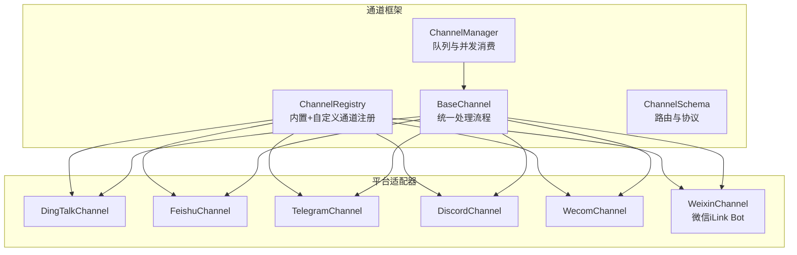
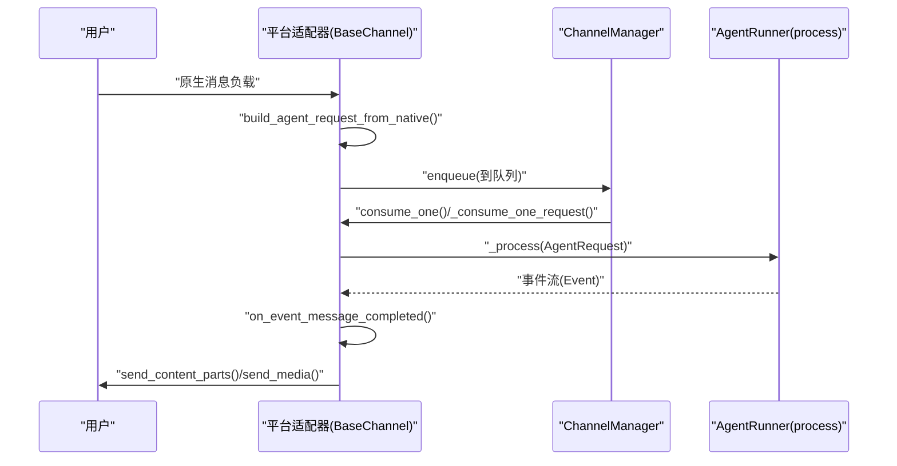
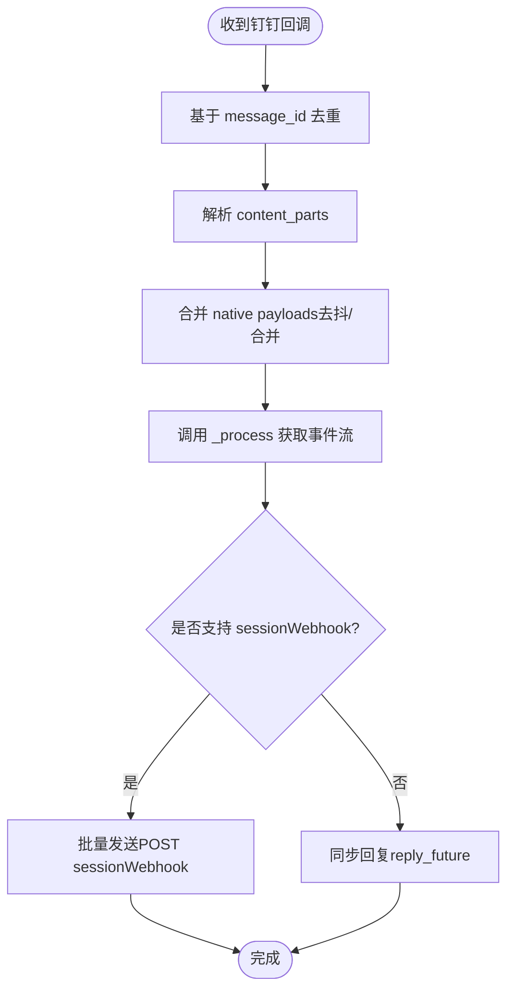
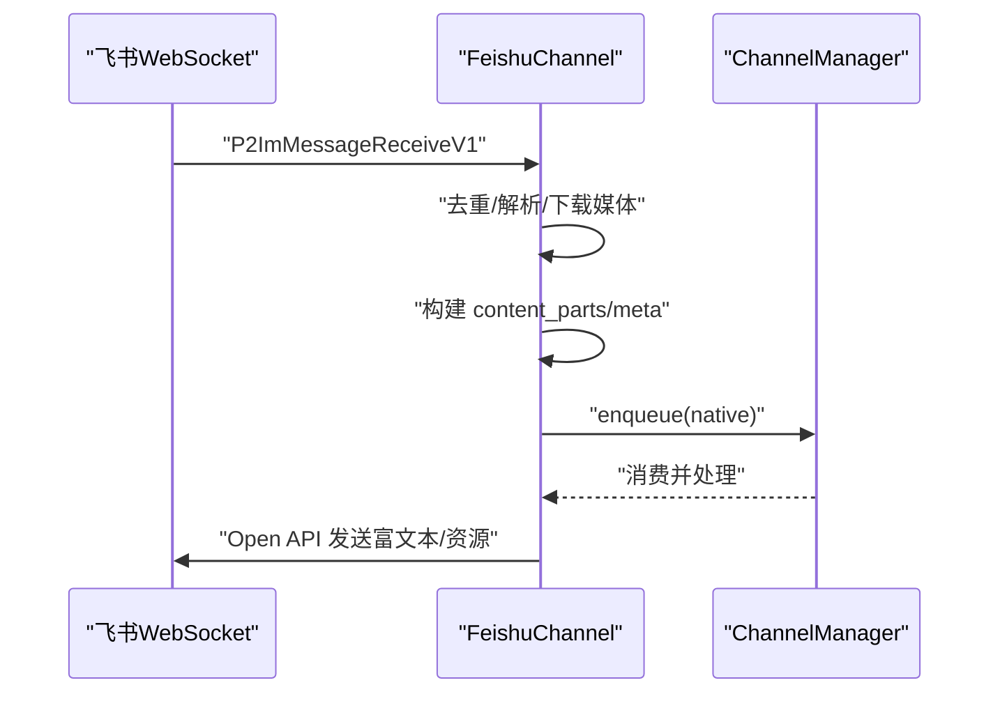
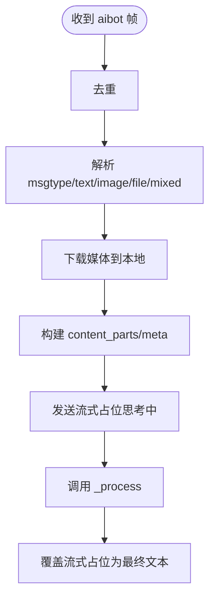
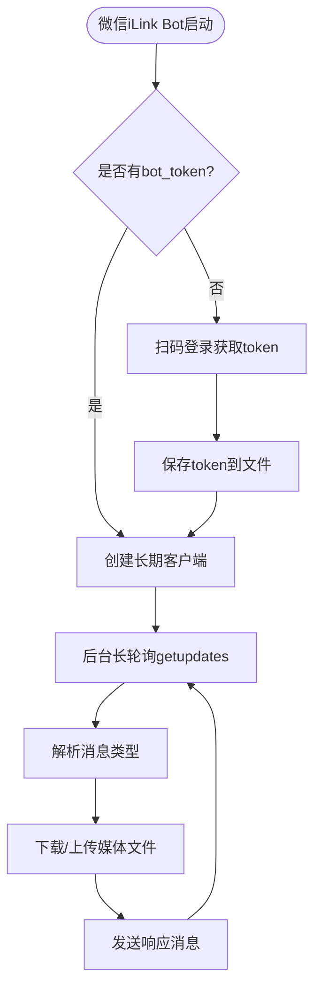
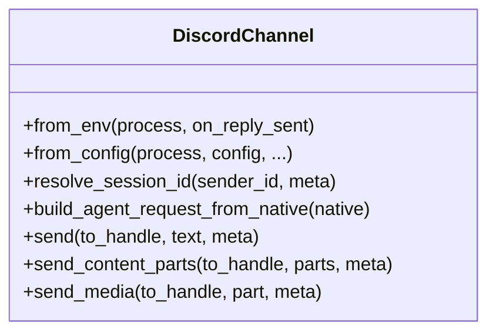
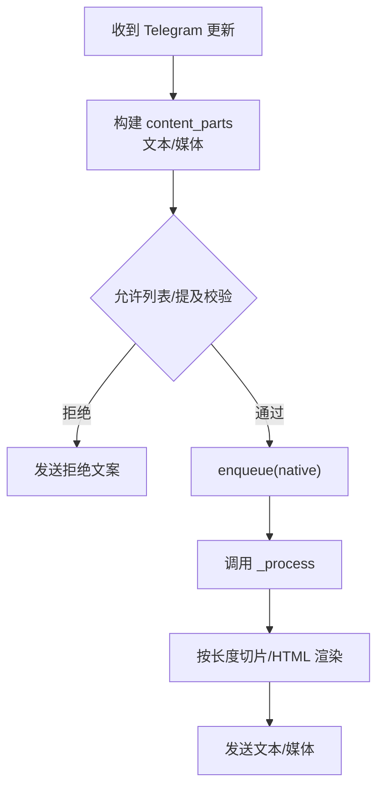
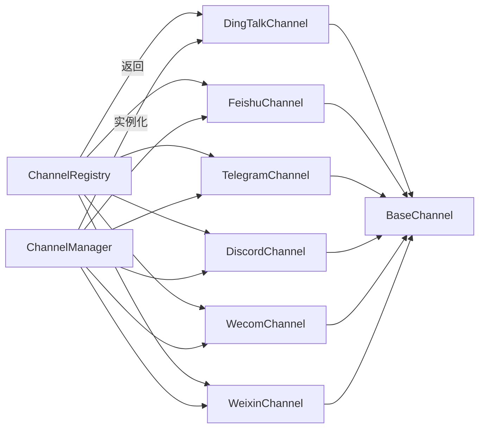

# 多平台实现

<cite>
**本文引用的文件**
- [src/copaw/app/channels/base.py](file://src/copaw/app/channels/base.py)
- [src/copaw/app/channels/manager.py](file://src/copaw/app/channels/manager.py)
- [src/copaw/app/channels/registry.py](file://src/copaw/app/channels/registry.py)
- [src/copaw/app/channels/schema.py](file://src/copaw/app/channels/schema.py)
- [src/copaw/app/channels/dingtalk/channel.py](file://src/copaw/app/channels/dingtalk/channel.py)
- [src/copaw/app/channels/feishu/channel.py](file://src/copaw/app/channels/feishu/channel.py)
- [src/copaw/app/channels/telegram/channel.py](file://src/copaw/app/channels/telegram/channel.py)
- [src/copaw/app/channels/discord_/channel.py](file://src/copaw/app/channels/discord_/channel.py)
- [src/copaw/app/channels/wecom/channel.py](file://src/copaw/app/channels/wecom/channel.py)
- [src/copaw/app/channels/weixin/channel.py](file://src/copaw/app/channels/weixin/channel.py)
- [src/copaw/app/channels/weixin/client.py](file://src/copaw/app/channels/weixin/client.py)
- [src/copaw/app/channels/weixin/utils.py](file://src/copaw/app/channels/weixin/utils.py)
- [src/copaw/app/channels/utils.py](file://src/copaw/app/channels/utils.py)
</cite>

## 更新摘要
**变更内容**
- 新增微信iLink Bot个人账号支持，实现完整的扫码登录、媒体处理和消息发送功能
- 改进媒体处理能力，包括AES-128-ECB加密解密、CDN上传下载、远程媒体解析
- 增强消息分割和媒体URL处理机制，支持更丰富的媒体类型
- 完善微信渠道的去重机制和上下文令牌管理

## 目录
1. [引言](#引言)
2. [项目结构](#项目结构)
3. [核心组件](#核心组件)
4. [架构总览](#架构总览)
5. [详细组件分析](#详细组件分析)
6. [依赖关系分析](#依赖关系分析)
7. [性能考量](#性能考量)
8. [故障排查指南](#故障排查指南)
9. [结论](#结论)
10. [附录](#附录)

## 引言
本文件面向 CoPaw 的多平台渠道（Channel）实现，系统性对比钉钉、飞书、微信（企业微信）、Discord、Telegram 等平台在适配器设计、认证机制、消息格式转换、媒体内容处理、权限控制、群聊与私聊差异等方面的技术实现与限制，并给出新平台适配的开发流程与最佳实践。

**更新** 本次更新新增了微信iLink Bot个人账号支持，改进了媒体处理能力和消息分割机制。

## 项目结构
CoPaw 的通道层位于 src/copaw/app/channels 下，采用"统一基类 + 各平台子类"的分层设计：
- 基类与通用能力：BaseChannel、ChannelManager、ChannelRegistry、ChannelSchema
- 平台适配器：dingtalk、feishu、telegram、discord_、wecom、**weixin**（新增）
- 渲染与消息体：MessageRenderer、RenderStyle、ChannelMessageConverter 协议

**图表来源**
- [src/copaw/app/channels/base.py:69-125](file://src/copaw/app/channels/base.py#L69-L125)
- [src/copaw/app/channels/manager.py:114-156](file://src/copaw/app/channels/manager.py#L114-L156)
- [src/copaw/app/channels/registry.py:19-34](file://src/copaw/app/channels/registry.py#L19-L34)
- [src/copaw/app/channels/schema.py:12-45](file://src/copaw/app/channels/schema.py#L12-L45)

**章节来源**
- [src/copaw/app/channels/base.py:1-120](file://src/copaw/app/channels/base.py#L1-L120)
- [src/copaw/app/channels/manager.py:114-156](file://src/copaw/app/channels/manager.py#L114-L156)
- [src/copaw/app/channels/registry.py:19-34](file://src/copaw/app/channels/registry.py#L19-L34)
- [src/copaw/app/channels/schema.py:12-45](file://src/copaw/app/channels/schema.py#L12-L45)

## 核心组件
- BaseChannel：抽象统一的消息收发、会话解析、渲染与发送逻辑；支持时间去抖、合并请求、权限策略、提及策略等通用能力
- ChannelManager：负责通道实例化、队列管理、同会话批处理、并发消费者、生命周期管理
- ChannelRegistry：内置通道清单与自定义通道发现，按需加载
- ChannelSchema：通道类型标识、路由地址模型、消息转换协议

**章节来源**
- [src/copaw/app/channels/base.py:69-125](file://src/copaw/app/channels/base.py#L69-L125)
- [src/copaw/app/channels/manager.py:114-156](file://src/copaw/app/channels/manager.py#L114-L156)
- [src/copaw/app/channels/registry.py:19-34](file://src/copaw/app/channels/registry.py#L19-L34)
- [src/copaw/app/channels/schema.py:12-45](file://src/copaw/app/channels/schema.py#L12-L45)

## 架构总览
通道框架通过 ChannelManager 统一调度，每个平台适配器继承 BaseChannel，实现平台特有的消息解析、发送与会话键生成。平台间差异主要体现在：
- 认证方式：Token/密钥/机器人令牌
- 接收通道：WebSocket/轮询/回调
- 发送通道：Open API/会话 Webhook/直接发送
- 消息类型：文本、图片、视频、音频、文件、富文本卡片
- 权限与提及：允许列表、是否需要被@、群/私聊策略

**图表来源**
- [src/copaw/app/channels/base.py:443-583](file://src/copaw/app/channels/base.py#L443-L583)
- [src/copaw/app/channels/manager.py:322-364](file://src/copaw/app/channels/manager.py#L322-L364)

**章节来源**
- [src/copaw/app/channels/base.py:443-583](file://src/copaw/app/channels/base.py#L443-L583)
- [src/copaw/app/channels/manager.py:322-364](file://src/copaw/app/channels/manager.py#L322-L364)

## 详细组件分析

### 钉钉（DingTalk）
- 认证与接入
  - 使用 Stream 客户端接收回调，支持会话 Webhook 主动发送
  - 支持 AI Card 流式状态与批量合并回复
- 会话与去重
  - 以 conversation_id 短尾作为 session_id，避免长会话键
  - 基于 message_id 去重，防止重复处理
- 消息与媒体
  - 文本/Markdown 回复；媒体上传走 Open API，返回 media_id
  - 支持 sessionWebhook 批量发送，提升长对话体验
- 特殊能力
  - 早确认（_ack_early）降低重试风暴风险
  - 语音消息视为完整输入，不参与去抖
- 限制与注意
  - sessionWebhook 有效期有限，适合近期联系人；离线推送建议使用 Open API
  - 媒体上传大小与类型限制，需按平台规范处理

**图表来源**
- [src/copaw/app/channels/dingtalk/channel.py:426-546](file://src/copaw/app/channels/dingtalk/channel.py#L426-L546)
- [src/copaw/app/channels/dingtalk/channel.py:601-697](file://src/copaw/app/channels/dingtalk/channel.py#L601-L697)

**章节来源**
- [src/copaw/app/channels/dingtalk/channel.py:81-179](file://src/copaw/app/channels/dingtalk/channel.py#L81-L179)
- [src/copaw/app/channels/dingtalk/channel.py:262-296](file://src/copaw/app/channels/dingtalk/channel.py#L262-L296)
- [src/copaw/app/channels/dingtalk/channel.py:426-546](file://src/copaw/app/channels/dingtalk/channel.py#L426-L546)
- [src/copaw/app/channels/dingtalk/channel.py:601-697](file://src/copaw/app/channels/dingtalk/channel.py#L601-L697)

### 飞书（Feishu/Lark）
- 认证与接入
  - WebSocket 长连接接收事件；Open API 发送消息
  - 支持富文本卡片与多种资源类型
- 会话与去重
  - 群聊 session_id = app_id 后缀 + chat_id 短尾；私聊 = open_id 短尾
  - 基于 message_id 去重，维护有序集合
- 消息与媒体
  - 文本、post 富文本、图片、文件、音视频等多类型解析
  - 图片/文件/音视频下载到本地 media 目录，再转为 content_parts
- 特殊能力
  - 存储 receive_id 与 receive_id_type，支持主动发送
  - 可选昵称缓存，减少 Contact API 调用
- 限制与注意
  - 需要应用权限支持读取用户昵称
  - 文件大小限制，超限需提示或改用链接

**图表来源**
- [src/copaw/app/channels/feishu/channel.py:538-800](file://src/copaw/app/channels/feishu/channel.py#L538-L800)
- [src/copaw/app/channels/feishu/channel.py:408-450](file://src/copaw/app/channels/feishu/channel.py#L408-L450)

**章节来源**
- [src/copaw/app/channels/feishu/channel.py:150-194](file://src/copaw/app/channels/feishu/channel.py#L150-L194)
- [src/copaw/app/channels/feishu/channel.py:299-356](file://src/copaw/app/channels/feishu/channel.py#L299-L356)
- [src/copaw/app/channels/feishu/channel.py:538-800](file://src/copaw/app/channels/feishu/channel.py#L538-L800)

### 微信（企业微信，WeCom）
- 认证与接入
  - 使用 aibot WebSocket SDK 接收消息，支持流式回复
- 会话与去重
  - 单聊 session_id = wecom:<userid>；群聊 session_id = wecom:group:<chatid>
  - 基于消息唯一标识去重
- 消息与媒体
  - 文本、图片、语音（ASR 文本）、文件、混合消息
  - 媒体下载到本地 media 目录，再转 content_parts
- 特殊能力
  - 流式"思考中"占位，随后覆盖
  - 支持欢迎语 enter_chat 事件
- 限制与注意
  - WebSocket 不支持直接上传媒体文件，图片以 Markdown 链接形式发送
  - 需要配置 bot_id/secret

**图表来源**
- [src/copaw/app/channels/wecom/channel.py:300-477](file://src/copaw/app/channels/wecom/channel.py#L300-L477)
- [src/copaw/app/channels/wecom/channel.py:588-692](file://src/copaw/app/channels/wecom/channel.py#L588-L692)

**章节来源**
- [src/copaw/app/channels/wecom/channel.py:49-97](file://src/copaw/app/channels/wecom/channel.py#L49-L97)
- [src/copaw/app/channels/wecom/channel.py:174-245](file://src/copaw/app/channels/wecom/channel.py#L174-L245)
- [src/copaw/app/channels/wecom/channel.py:300-477](file://src/copaw/app/channels/wecom/channel.py#L300-L477)
- [src/copaw/app/channels/wecom/channel.py:588-737](file://src/copaw/app/channels/wecom/channel.py#L588-L737)

### 微信iLink Bot（新增）
- 认证与接入
  - 使用官方 WeChat iLink Bot HTTP API，无需第三方 SDK
  - 支持扫码登录获取 bot_token，支持 QR 码轮询状态
  - 长轮询接收消息（getupdates），HTTP 发送消息（sendmessage）
- 会话与去重
  - 私聊 session_id = weixin:<from_user_id>；群聊 session_id = weixin:group:<group_id>
  - 基于 context_token 或消息唯一标识去重，支持最大 2000 条去重记录
- 消息与媒体
  - 支持文本、图片、语音（ASR 转文本）、文件、视频等多种消息类型
  - 媒体文件通过 WeChat CDN 加密上传，支持 AES-128-ECB 加密解密
  - 远程媒体文件自动下载到本地 media 目录，支持文件名哈希存储
- 特殊能力
  - 支持打字指示（typing）发送
  - 支持上下文令牌持久化，用于主动发送消息
  - 支持允许列表和群聊提及策略
- 限制与注意
  - 需要安装 pycryptodome 库进行 AES 加密解密
  - 媒体文件大小限制，超限需提示或改用链接
  - 需要配置 bot_token 或通过扫码登录获取

**图表来源**
- [src/copaw/app/channels/weixin/channel.py:966-1034](file://src/copaw/app/channels/weixin/channel.py#L966-L1034)
- [src/copaw/app/channels/weixin/client.py:131-188](file://src/copaw/app/channels/weixin/client.py#L131-L188)

**章节来源**
- [src/copaw/app/channels/weixin/channel.py:1-1034](file://src/copaw/app/channels/weixin/channel.py#L1-L1034)
- [src/copaw/app/channels/weixin/client.py:1-666](file://src/copaw/app/channels/weixin/client.py#L1-L666)
- [src/copaw/app/channels/weixin/utils.py:1-119](file://src/copaw/app/channels/weixin/utils.py#L1-L119)

### Discord
- 认证与接入
  - 使用 discord.py 客户端，启用 message_content、dm_messages、messages、guilds 等意图
- 会话与路由
  - session_id = discord:ch:<channel_id> 或 discord:dm:<user_id>
  - 支持 meta["channel_id"] 或 meta["user_id"] 主动发送
- 消息与媒体
  - 文本、图片、视频、音频、文件附件
  - 超长文本自动按换行切片，保留代码块闭合
- 特殊能力
  - 支持提及检测与"仅 @ 我才处理"策略
- 限制与注意
  - 必须启用 message_content 意图才能解析消息内容
  - 2000 字符限制，自动切片

**图表来源**
- [src/copaw/app/channels/discord_/channel.py:40-82](file://src/copaw/app/channels/discord_/channel.py#L40-L82)
- [src/copaw/app/channels/discord_/channel.py:287-304](file://src/copaw/app/channels/discord_/channel.py#L287-L304)
- [src/copaw/app/channels/discord_/channel.py:370-402](file://src/copaw/app/channels/discord_/channel.py#L370-L402)

**章节来源**
- [src/copaw/app/channels/discord_/channel.py:40-82](file://src/copaw/app/channels/discord_/channel.py#L40-L82)
- [src/copaw/app/channels/discord_/channel.py:287-304](file://src/copaw/app/channels/discord_/channel.py#L287-L304)
- [src/copaw/app/channels/discord_/channel.py:370-402](file://src/copaw/app/channels/discord_/channel.py#L370-L402)
- [src/copaw/app/channels/discord_/channel.py:404-501](file://src/copaw/app/channels/discord_/channel.py#L404-L501)

### Telegram
- 认证与接入
  - Bot API 轮询；支持代理与代理鉴权
- 会话与路由
  - session_id = telegram:{chat_id}
  - 支持 thread_id（话题）区分
- 消息与媒体
  - 文本、图片、视频、音频、文件；自动下载到本地 media 目录
  - 超长文本按 4000 字切片，优先 HTML，失败回退纯文本
  - 50MB 上传限制，超限提示
- 特殊能力
  - 可选打字指示（typing），周期性发送
  - 提及检测与"仅 @ 我才处理"策略
- 限制与注意
  - 4096 字符上限，HTML 解析失败回退纯文本
  - 上传文件大小限制

**图表来源**
- [src/copaw/app/channels/telegram/channel.py:140-237](file://src/copaw/app/channels/telegram/channel.py#L140-L237)
- [src/copaw/app/channels/telegram/channel.py:526-546](file://src/copaw/app/channels/telegram/channel.py#L526-L546)
- [src/copaw/app/channels/telegram/channel.py:597-651](file://src/copaw/app/channels/telegram/channel.py#L597-L651)

**章节来源**
- [src/copaw/app/channels/telegram/channel.py:264-334](file://src/copaw/app/channels/telegram/channel.py#L264-L334)
- [src/copaw/app/channels/telegram/channel.py:370-435](file://src/copaw/app/channels/telegram/channel.py#L370-L435)
- [src/copaw/app/channels/telegram/channel.py:526-546](file://src/copaw/app/channels/telegram/channel.py#L526-L546)
- [src/copaw/app/channels/telegram/channel.py:597-768](file://src/copaw/app/channels/telegram/channel.py#L597-L768)

## 依赖关系分析
- 注册表与通道
  - 内置通道清单与自定义通道目录扫描，统一由 ChannelRegistry 返回类型映射
- 管理器与通道
  - ChannelManager 按可用通道列表动态实例化，注入统一 process 与 on_reply_sent 回调
  - 为每个通道创建队列与多个消费者，按 session_key 并发隔离
- 基类与子类
  - BaseChannel 定义统一接口与通用策略（去抖、合并、渲染、发送），子类仅实现平台差异点

**图表来源**
- [src/copaw/app/channels/registry.py:19-34](file://src/copaw/app/channels/registry.py#L19-L34)
- [src/copaw/app/channels/registry.py:133-137](file://src/copaw/app/channels/registry.py#L133-L137)
- [src/copaw/app/channels/manager.py:136-155](file://src/copaw/app/channels/manager.py#L136-L155)

**章节来源**
- [src/copaw/app/channels/registry.py:19-34](file://src/copaw/app/channels/registry.py#L19-L34)
- [src/copaw/app/channels/registry.py:133-137](file://src/copaw/app/channels/registry.py#L133-L137)
- [src/copaw/app/channels/manager.py:136-155](file://src/copaw/app/channels/manager.py#L136-L155)

## 性能考量
- 去抖与合并
  - BaseChannel 支持时间去抖与同会话合并，减少重复请求与噪声消息
  - ChannelManager 对同一 session_key 的队列进行批处理与锁隔离，避免并发错乱
- 并发与队列
  - 每通道 4 个消费者并行处理不同 session，提高吞吐
  - 队列最大长度与 pending 合并策略平衡内存与延迟
- 媒体处理
  - 将远端媒体下载到本地 media 目录，统一 content_parts 流程，减少平台差异
  - 平台侧上传/下载限制需在发送前校验，避免失败重试风暴
  - **新增** 微信iLink Bot使用 AES-128-ECB 加密，支持 CDN 上传下载，提高安全性
- 会话键设计
  - 各平台以短尾 session_id 便于持久化与定时任务查找（如钉钉、飞书）

**章节来源**
- [src/copaw/app/channels/base.py:120-125](file://src/copaw/app/channels/base.py#L120-L125)
- [src/copaw/app/channels/manager.py:42-112](file://src/copaw/app/channels/manager.py#L42-L112)
- [src/copaw/app/channels/manager.py:322-364](file://src/copaw/app/channels/manager.py#L322-L364)

## 故障排查指南
- 通用错误处理
  - consume_one 失败时统一调用 _on_consume_error，发送错误文本给用户
  - 从 runtime 响应提取 error.message，增强可读性
- 平台特定问题
  - 钉钉：sessionWebhook 过期、媒体上传失败、去重冲突；检查 token 与会话键
  - 飞书：缺少权限导致昵称/头像不可用；消息去重命中；检查 app_id 与 domain
  - 企业微信：WebSocket 断连/重连次数限制；媒体上传受限
  - **新增** 微信iLink Bot：pycryptodome 依赖缺失、CDN 上传失败、AES 加密解密错误；检查 token 与网络连接
  - Discord：未启用 message_content 意图；消息超长被切片；代理配置错误
  - Telegram：文件过大（>50MB）；HTML 渲染失败回退纯文本；速率限制
- 日志与可观测性
  - 各通道记录关键路径日志（解析、去重、发送、错误），便于定位

**章节来源**
- [src/copaw/app/channels/base.py:564-646](file://src/copaw/app/channels/base.py#L564-L646)
- [src/copaw/app/channels/dingtalk/channel.py:625-672](file://src/copaw/app/channels/dingtalk/channel.py#L625-L672)
- [src/copaw/app/channels/feishu/channel.py:408-450](file://src/copaw/app/channels/feishu/channel.py#L408-L450)
- [src/copaw/app/channels/wecom/channel.py:778-800](file://src/copaw/app/channels/wecom/channel.py#L778-L800)
- [src/copaw/app/channels/weixin/channel.py:966-1034](file://src/copaw/app/channels/weixin/channel.py#L966-L1034)
- [src/copaw/app/channels/discord_/channel.py:389-402](file://src/copaw/app/channels/discord_/channel.py#L389-L402)
- [src/copaw/app/channels/telegram/channel.py:716-768](file://src/copaw/app/channels/telegram/channel.py#L716-L768)

## 结论
CoPaw 的通道层通过统一基类与管理器，将多平台差异封装在各自适配器内，实现了跨平台一致的消息处理体验。平台适配的关键在于：
- 明确认证与接入方式（Token/密钥/SDK/回调）
- 设计合理的会话键与去重策略
- 规范消息与媒体的解析/下载/发送流程
- 利用去抖、合并与并发优化性能
- 针对平台限制制定降级与提示策略

**更新** 新增的微信iLink Bot个人账号支持扩展了 CoPaw 的微信生态覆盖，提供了更灵活的个人账号接入方案，配合改进的媒体处理能力，进一步提升了多平台兼容性和用户体验。

## 附录

### 新平台适配器开发流程
- 继承 BaseChannel，实现以下方法（至少）：
  - from_env / from_config：从环境变量/配置构造实例
  - build_agent_request_from_native：将平台原生负载解析为 content_parts
  - send / send_content_parts / send_media：按平台发送文本与媒体
  - resolve_session_id / get_to_handle_from_request：会话键与发送目标
- 在 registry 中注册（内置或自定义目录）
- 在配置中启用并填写必要参数
- 编写最小化测试，覆盖解析、发送、媒体、权限策略等场景

**章节来源**
- [src/copaw/app/channels/base.py:321-339](file://src/copaw/app/channels/base.py#L321-L339)
- [src/copaw/app/channels/registry.py:95-127](file://src/copaw/app/channels/registry.py#L95-L127)

### 微信iLink Bot 配置与部署指南
- **认证配置**
  - 支持 bot_token 直接配置或扫码登录获取
  - Token 自动保存到 ~/.copaw/weixin_bot_token
  - 支持 base_url 自定义（默认 https://ilinkai.weixin.qq.com）
- **媒体处理**
  - 支持 AES-128-ECB 加密上传到 WeChat CDN
  - 自动下载并解密远程媒体文件
  - 支持图片、视频、文件、语音等多种媒体类型
- **消息分割**
  - 文本消息自动按长度分割，保持 Markdown 格式
  - 支持代码块完整性保护
- **安全考虑**
  - 需要安装 pycryptodome 库进行加密解密
  - Token 文件权限设置为 600
  - 支持上下文令牌持久化

**章节来源**
- [src/copaw/app/channels/weixin/channel.py:1-1034](file://src/copaw/app/channels/weixin/channel.py#L1-L1034)
- [src/copaw/app/channels/weixin/client.py:1-666](file://src/copaw/app/channels/weixin/client.py#L1-L666)
- [src/copaw/app/channels/weixin/utils.py:1-119](file://src/copaw/app/channels/weixin/utils.py#L1-L119)