# 钉钉渠道适配器

<cite>
**本文档引用的文件**
- [src/copaw/app/channels/dingtalk/channel.py](file://src/copaw/app/channels/dingtalk/channel.py)
- [src/copaw/app/channels/dingtalk/handler.py](file://src/copaw/app/channels/dingtalk/handler.py)
- [src/copaw/app/channels/dingtalk/ai_card.py](file://src/copaw/app/channels/dingtalk/ai_card.py)
- [src/copaw/app/channels/dingtalk/constants.py](file://src/copaw/app/channels/dingtalk/constants.py)
- [src/copaw/app/channels/dingtalk/content_utils.py](file://src/copaw/app/channels/dingtalk/content_utils.py)
- [src/copaw/app/channels/dingtalk/markdown.py](file://src/copaw/app/channels/dingtalk/markdown.py)
- [src/copaw/app/channels/dingtalk/utils.py](file://src/copaw/app/channels/dingtalk/utils.py)
- [src/copaw/app/channels/base.py](file://src/copaw/app/channels/base.py)
- [src/copaw/config/config.py](file://src/copaw/config/config.py)
- [console/src/pages/Control/Channels/components/ChannelDrawer.tsx](file://console/src/pages/Control/Channels/components/ChannelDrawer.tsx)
- [website/public/docs/channels.en.md](file://website/public/docs/channels.en.md)
</cite>

## 目录
1. [简介](#简介)
2. [项目结构](#项目结构)
3. [核心组件](#核心组件)
4. [架构概览](#架构概览)
5. [详细组件分析](#详细组件分析)
6. [依赖关系分析](#依赖关系分析)
7. [性能考虑](#性能考虑)
8. [故障排除指南](#故障排除指南)
9. [结论](#结论)
10. [附录](#附录)

## 简介

CoPaw的钉钉渠道适配器是一个完整的即时通讯平台集成解决方案，基于钉钉开放平台的Stream回调机制构建。该适配器实现了从消息接收、内容解析、AI卡片渲染到主动推送的完整链路，支持多种消息类型和媒体文件处理。

该适配器的核心特性包括：
- **AI卡片功能**：实时流式渲染交互式卡片
- **会话Webhook机制**：支持多消息发送和主动推送
- **消息去重机制**：防止重复消息处理
- **并发处理策略**：线程安全的消息处理
- **媒体文件处理**：图片、音频、视频、文件的完整支持
- **权限控制**：群聊和私聊的访问控制

## 项目结构

钉钉渠道适配器位于`src/copaw/app/channels/dingtalk/`目录下，采用模块化设计：

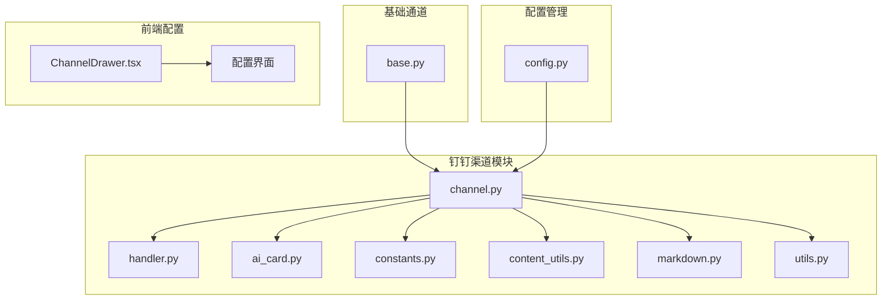

**图表来源**
- [src/copaw/app/channels/dingtalk/channel.py:1-100](file://src/copaw/app/channels/dingtalk/channel.py#L1-L100)
- [src/copaw/app/channels/base.py:1-100](file://src/copaw/app/channels/base.py#L1-L100)

**章节来源**
- [src/copaw/app/channels/dingtalk/channel.py:1-100](file://src/copaw/app/channels/dingtalk/channel.py#L1-L100)
- [src/copaw/app/channels/base.py:1-100](file://src/copaw/app/channels/base.py#L1-L100)

## 核心组件

### DingTalkChannel 主控制器

`DingTalkChannel`是钉钉渠道的核心控制器，继承自`BaseChannel`，负责整个消息处理流程：

**主要职责**：
- Stream回调处理和消息去重
- 会话Webhook存储和恢复
- AI卡片生命周期管理
- 媒体文件上传和下载
- 主动推送消息发送

**关键配置参数**：
- `client_id/client_secret`：钉钉应用凭证
- `message_type`：消息类型（markdown或card）
- `robot_code`：机器人代码
- `card_template_id`：AI卡片模板ID
- `media_dir`：媒体文件存储目录

### DingTalkChannelHandler 消息处理器

`DingTalkChannelHandler`继承自`dingtalk_stream.ChatbotHandler`，专门处理钉钉Stream回调：

**核心功能**：
- 钉钉消息格式解析
- 媒体文件下载和转换
- 内容类型映射和标准化
- 异步消息队列处理

### AI卡片管理系统

AI卡片系统提供了实时流式交互体验：

**组件构成**：
- `ActiveAICard`：活动卡片状态管理
- `AICardPendingStore`：卡片持久化存储
- 流式更新机制：最小间隔0.6秒
- 自动布局支持：可选的卡片自动布局

**章节来源**
- [src/copaw/app/channels/dingtalk/channel.py:81-256](file://src/copaw/app/channels/dingtalk/channel.py#L81-L256)
- [src/copaw/app/channels/dingtalk/handler.py:39-188](file://src/copaw/app/channels/dingtalk/handler.py#L39-L188)
- [src/copaw/app/channels/dingtalk/ai_card.py:20-105](file://src/copaw/app/channels/dingtalk/ai_card.py#L20-L105)

## 架构概览

钉钉渠道适配器采用分层架构设计，确保高可用性和可扩展性：

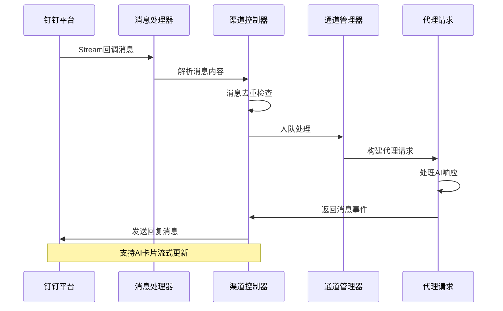

**图表来源**
- [src/copaw/app/channels/dingtalk/handler.py:189-368](file://src/copaw/app/channels/dingtalk/handler.py#L189-L368)
- [src/copaw/app/channels/dingtalk/channel.py:1417-1650](file://src/copaw/app/channels/dingtalk/channel.py#L1417-L1650)

### 数据流架构

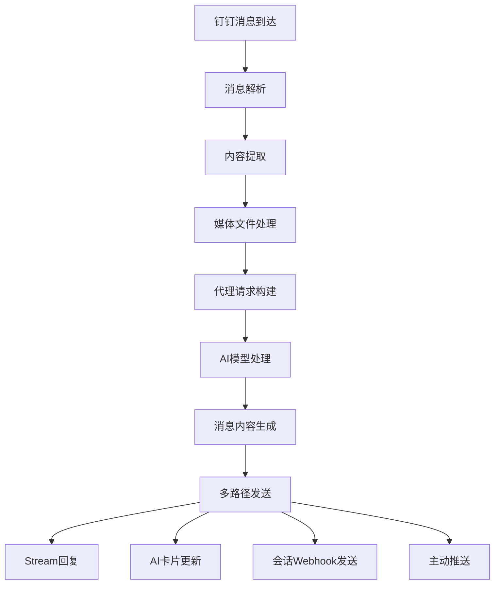

**图表来源**
- [src/copaw/app/channels/dingtalk/channel.py:1417-1650](file://src/copaw/app/channels/dingtalk/channel.py#L1417-L1650)
- [src/copaw/app/channels/dingtalk/handler.py:189-368](file://src/copaw/app/channels/dingtalk/handler.py#L189-L368)

## 详细组件分析

### 消息处理流程

#### Stream回调处理

钉钉Stream回调处理是整个适配器的核心机制：

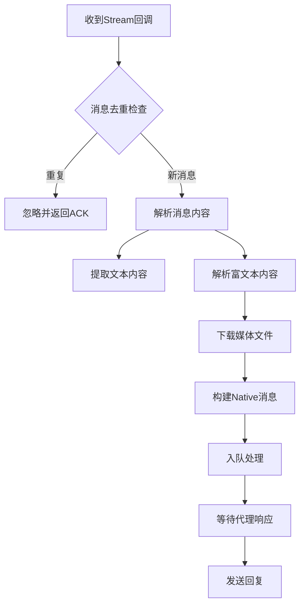

**章节来源**
- [src/copaw/app/channels/dingtalk/handler.py:189-368](file://src/copaw/app/channels/dingtalk/handler.py#L189-L368)
- [src/copaw/app/channels/dingtalk/channel.py:426-546](file://src/copaw/app/channels/dingtalk/channel.py#L426-L546)

#### AI卡片渲染机制

AI卡片提供了丰富的交互体验，支持实时流式更新：

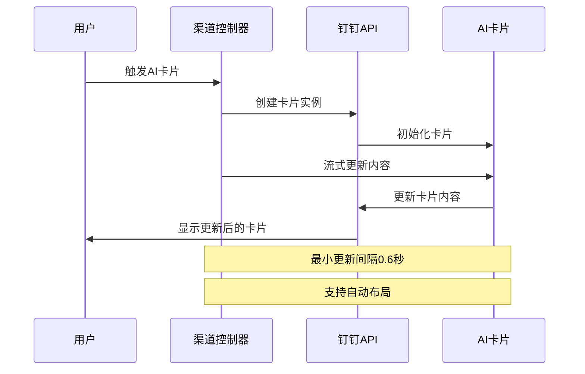

**图表来源**
- [src/copaw/app/channels/dingtalk/channel.py:1890-2163](file://src/copaw/app/channels/dingtalk/channel.py#L1890-L2163)
- [src/copaw/app/channels/dingtalk/ai_card.py:20-105](file://src/copaw/app/channels/dingtalk/ai_card.py#L20-L105)

**章节来源**
- [src/copaw/app/channels/dingtalk/channel.py:1856-2163](file://src/copaw/app/channels/dingtalk/channel.py#L1856-L2163)
- [src/copaw/app/channels/dingtalk/ai_card.py:20-105](file://src/copaw/app/channels/dingtalk/ai_card.py#L20-L105)

### 媒体文件处理

钉钉渠道支持多种媒体类型的完整处理流程：

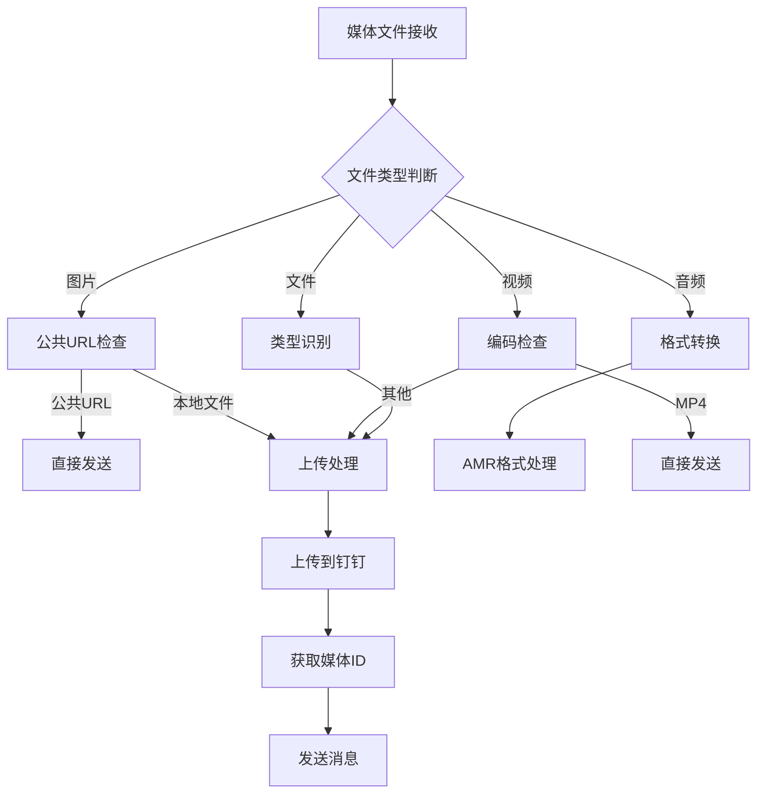

**图表来源**
- [src/copaw/app/channels/dingtalk/channel.py:902-1207](file://src/copaw/app/channels/dingtalk/channel.py#L902-L1207)
- [src/copaw/app/channels/dingtalk/utils.py:23-34](file://src/copaw/app/channels/dingtalk/utils.py#L23-L34)

**章节来源**
- [src/copaw/app/channels/dingtalk/channel.py:902-1207](file://src/copaw/app/channels/dingtalk/channel.py#L902-L1207)
- [src/copaw/app/channels/dingtalk/utils.py:23-34](file://src/copaw/app/channels/dingtalk/utils.py#L23-L34)

### 会话Webhook机制

会话Webhook提供了主动推送和多消息发送能力：

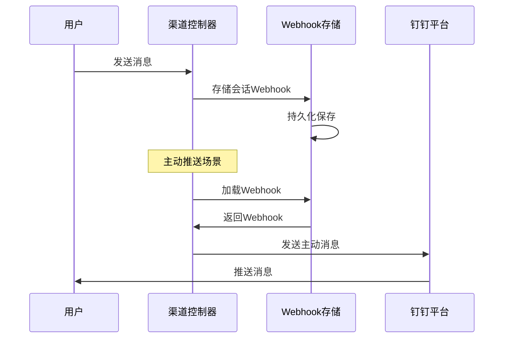

**图表来源**
- [src/copaw/app/channels/dingtalk/channel.py:369-420](file://src/copaw/app/channels/dingtalk/channel.py#L369-L420)
- [src/copaw/app/channels/dingtalk/channel.py:1480-1497](file://src/copaw/app/channels/dingtalk/channel.py#L1480-L1497)

**章节来源**
- [src/copaw/app/channels/dingtalk/channel.py:369-420](file://src/copaw/app/channels/dingtalk/channel.py#L369-L420)
- [src/copaw/app/channels/dingtalk/channel.py:1480-1497](file://src/copaw/app/channels/dingtalk/channel.py#L1480-L1497)

## 依赖关系分析

### 外部依赖

钉钉渠道适配器依赖以下外部库和服务：

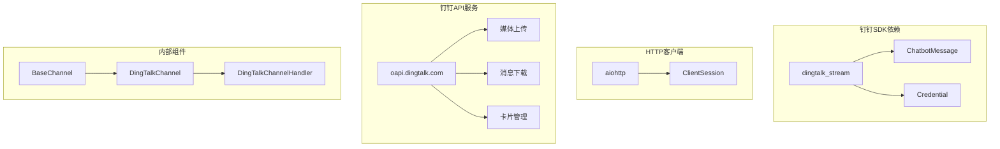

**图表来源**
- [src/copaw/app/channels/dingtalk/channel.py:31-38](file://src/copaw/app/channels/dingtalk/channel.py#L31-L38)
- [src/copaw/app/channels/dingtalk/handler.py:10-14](file://src/copaw/app/channels/dingtalk/handler.py#L10-L14)

### 内部组件依赖

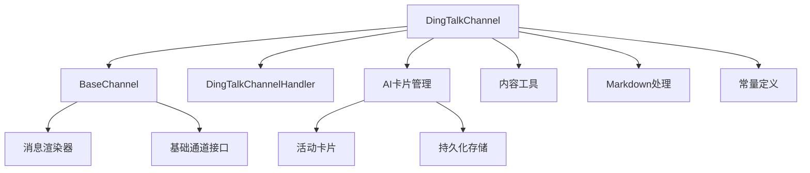

**图表来源**
- [src/copaw/app/channels/dingtalk/channel.py:41-73](file://src/copaw/app/channels/dingtalk/channel.py#L41-L73)
- [src/copaw/app/channels/base.py:69-116](file://src/copaw/app/channels/base.py#L69-L116)

**章节来源**
- [src/copaw/app/channels/dingtalk/channel.py:31-73](file://src/copaw/app/channels/dingtalk/channel.py#L31-L73)
- [src/copaw/app/channels/base.py:69-116](file://src/copaw/app/channels/base.py#L69-L116)

## 性能考虑

### 并发处理策略

钉钉渠道适配器采用了多层次的并发处理机制：

**线程模型**：
- Stream回调在独立线程中处理
- 异步HTTP请求使用aiohttp
- 消息去重使用线程安全集合
- AI卡片更新有最小间隔限制

**内存管理**：
- 活动卡片状态使用内存缓存
- 媒体文件下载后缓存到本地目录
- 会话Webhook存储支持持久化

### 缓存机制

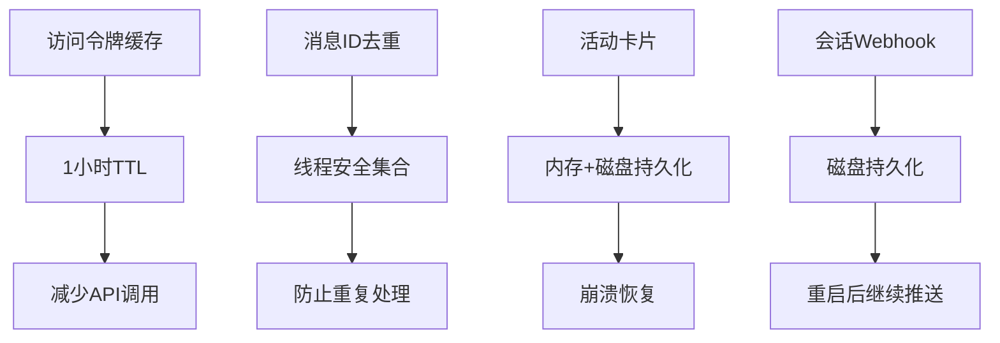

**图表来源**
- [src/copaw/app/channels/dingtalk/constants.py:8-10](file://src/copaw/app/channels/dingtalk/constants.py#L8-L10)
- [src/copaw/app/channels/dingtalk/channel.py:175-182](file://src/copaw/app/channels/dingtalk/channel.py#L175-L182)

**章节来源**
- [src/copaw/app/channels/dingtalk/constants.py:8-10](file://src/copaw/app/channels/dingtalk/constants.py#L8-L10)
- [src/copaw/app/channels/dingtalk/channel.py:175-182](file://src/copaw/app/channels/dingtalk/channel.py#L175-L182)

## 故障排除指南

### 常见问题及解决方案

#### 认证失败

**症状**：无法启动钉钉渠道或API调用失败
**原因**：
- Client ID/Secret配置错误
- 服务器IP未加入白名单
- 访问令牌过期

**解决方案**：
1. 验证钉钉应用配置
2. 检查IP白名单设置
3. 查看日志中的认证错误信息

#### 消息重复

**症状**：同一消息被多次处理
**原因**：钉钉平台重试机制
**解决方案**：系统内置消息ID去重机制

#### 媒体文件下载失败

**症状**：图片、音频、视频无法下载
**原因**：
- 服务器IP未在白名单
- 文件已被删除或过期
- 网络连接问题

**解决方案**：
1. 添加服务器IP到钉钉白名单
2. 检查文件有效期
3. 验证网络连接

#### AI卡片显示异常

**症状**：AI卡片不显示或显示错误
**原因**：
- 卡片模板配置错误
- 访问令牌权限不足
- 网络连接问题

**解决方案**：
1. 验证卡片模板ID和密钥
2. 检查机器人权限
3. 查看卡片创建和更新日志

**章节来源**
- [src/copaw/app/channels/dingtalk/channel.py:1774-1850](file://src/copaw/app/channels/dingtalk/channel.py#L1774-L1850)
- [src/copaw/app/channels/dingtalk/handler.py:365-368](file://src/copaw/app/channels/dingtalk/handler.py#L365-L368)

## 结论

CoPaw的钉钉渠道适配器是一个功能完整、架构清晰的即时通讯集成解决方案。其核心优势包括：

**技术优势**：
- 完整的消息处理链路，支持多种消息类型
- 创新的AI卡片流式渲染机制
- 灵活的会话Webhook主动推送
- 健壮的错误处理和恢复机制

**设计特点**：
- 模块化架构，易于维护和扩展
- 线程安全的消息处理
- 完善的媒体文件处理
- 友好的配置界面

该适配器为用户提供了稳定可靠的钉钉集成体验，支持从简单聊天到复杂AI交互的各种应用场景。

## 附录

### 部署配置指南

#### 环境变量配置

| 环境变量 | 描述 | 默认值 | 必需 |
|---------|------|--------|------|
| DINGTALK_CHANNEL_ENABLED | 启用钉钉渠道 | 1 | 否 |
| DINGTALK_CLIENT_ID | 钉钉应用ID | 无 | 是 |
| DINGTALK_CLIENT_SECRET | 钉钉应用密钥 | 无 | 是 |
| DINGTALK_BOT_PREFIX | 机器人前缀 | 无 | 否 |
| DINGTALK_MESSAGE_TYPE | 消息类型 | markdown | 否 |
| DINGTALK_CARD_TEMPLATE_ID | AI卡片模板ID | 无 | 否 |
| DINGTALK_ROBOT_CODE | 机器人代码 | client_id | 否 |

#### 前端配置界面

前端提供了直观的配置界面，支持钉钉渠道的可视化配置：

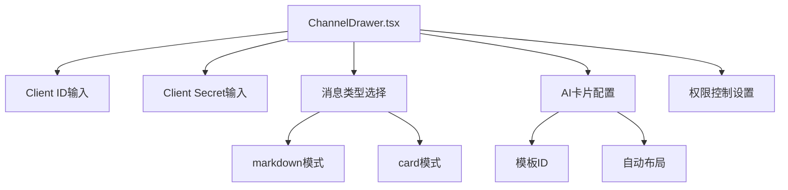

**图表来源**
- [console/src/pages/Control/Channels/components/ChannelDrawer.tsx:339-382](file://console/src/pages/Control/Channels/components/ChannelDrawer.tsx#L339-L382)

### API限制和最佳实践

**API限制**：
- 访问令牌有效期1小时
- AI卡片流式更新最小间隔0.6秒
- 媒体文件大小限制遵循钉钉平台规则

**最佳实践**：
- 启用IP白名单以提高安全性
- 使用会话Webhook进行主动推送
- 合理配置AI卡片模板
- 实施适当的错误处理和重试机制

**章节来源**
- [website/public/docs/channels.en.md:35-66](file://website/public/docs/channels.en.md#L35-L66)
- [src/copaw/app/channels/dingtalk/constants.py:8-28](file://src/copaw/app/channels/dingtalk/constants.py#L8-L28)