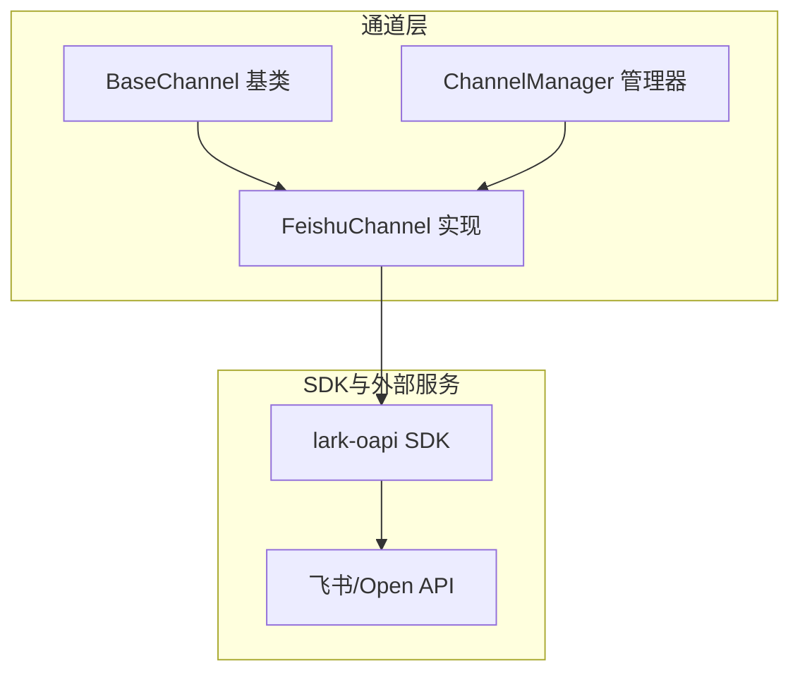
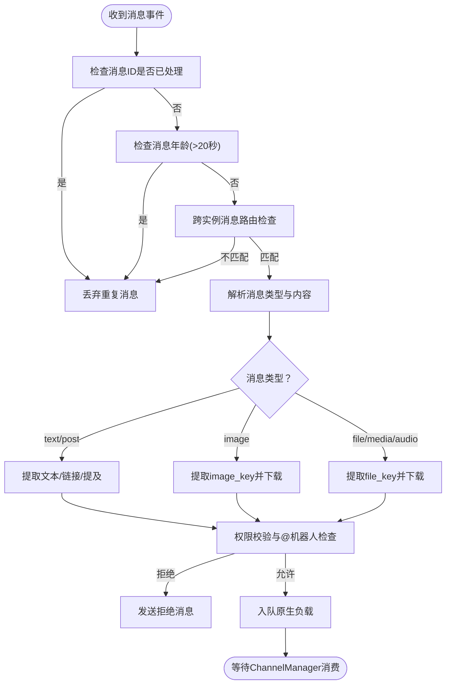
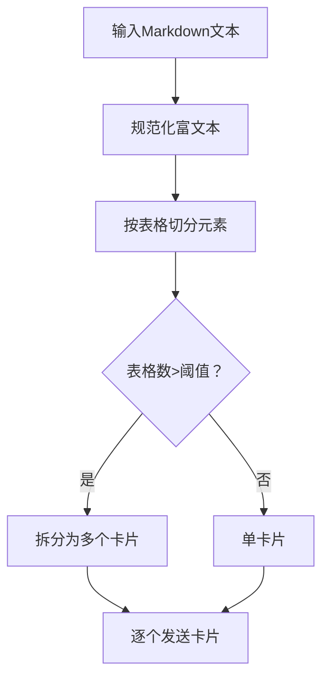
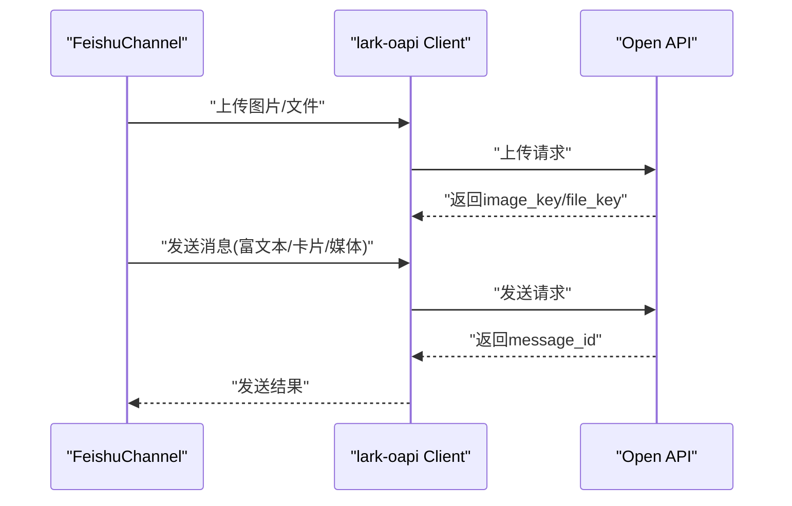
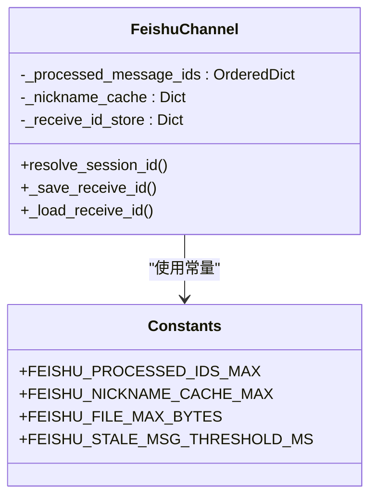
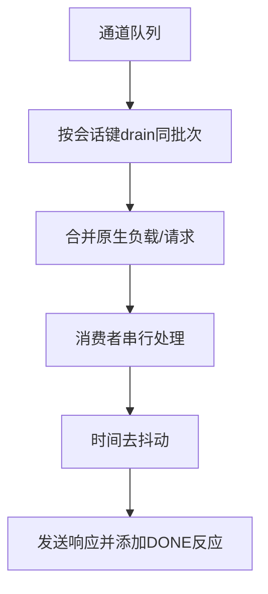
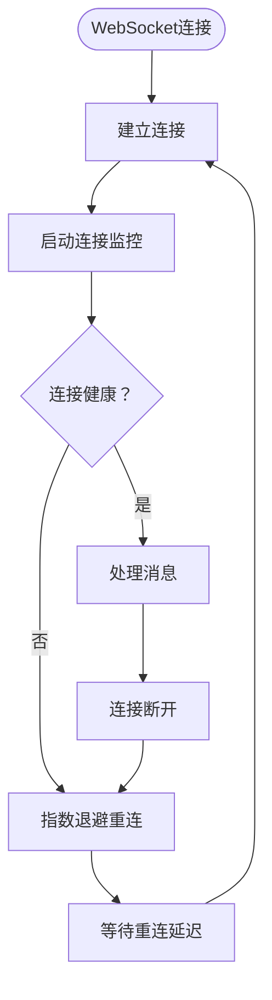
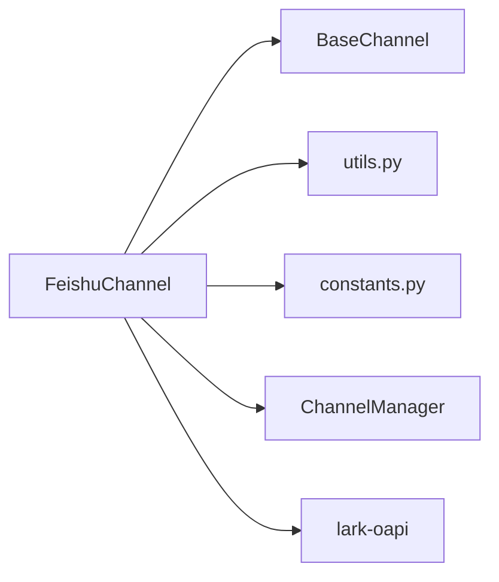

# 飞书渠道适配器

<cite>
**本文引用的文件**
- [channel.py](file://src/copaw/app/channels/feishu/channel.py)
- [constants.py](file://src/copaw/app/channels/feishu/constants.py)
- [utils.py](file://src/copaw/app/channels/feishu/utils.py)
- [base.py](file://src/copaw/app/channels/base.py)
- [manager.py](file://src/copaw/app/channels/manager.py)
- [config.py](file://src/copaw/config/config.py)
- [registry.py](file://src/copaw/app/channels/registry.py)
</cite>

## 更新摘要
**变更内容**
- 新增WebSocket自动重连机制，支持指数退避重连策略
- 新增陈旧消息过滤功能，防止重试机制产生的过期消息干扰
- 新增静默断开检测机制，主动监控WebSocket连接健康状态
- 新增多实例部署中的消息防交叉污染保护
- 增强消息去重机制，支持更严格的重复检测

## 目录
1. [简介](#简介)
2. [项目结构](#项目结构)
3. [核心组件](#核心组件)
4. [架构总览](#架构总览)
5. [详细组件分析](#详细组件分析)
6. [依赖关系分析](#依赖关系分析)
7. [性能考虑](#性能考虑)
8. [故障排查指南](#故障排查指南)
9. [结论](#结论)
10. [附录](#附录)

## 简介
本文件面向CoPaw飞书渠道适配器的技术文档，系统性阐述飞书机器人的实现原理、消息处理流程、交互式卡片功能、事件订阅机制等核心技术，并覆盖飞书特有的认证方式、消息类型支持、富文本格式处理、权限控制、配置与部署、API限制、并发处理策略、消息去重机制、主动推送与事件回调等关键实现细节。文档同时提供部署配置、性能优化与故障排查的实用指导，帮助开发者与运维人员快速理解并稳定运行飞书渠道。

**更新** 本次更新大幅改进了飞书渠道的可靠性，新增了WebSocket重连逻辑、陈旧消息过滤、静默断开检测和多实例部署中的消息防交叉污染功能，显著提升了系统的稳定性和容错能力。

## 项目结构
飞书渠道位于通道子系统中，采用"通道抽象 + 具体实现"的分层设计：
- 通道基类：统一消息收发、会话管理、权限控制、渲染与发送策略
- 渠道管理器：负责队列化、批处理、并发消费、时间去抖动
- 飞书通道：基于lark-oapi SDK建立WebSocket长连接接收事件，通过Open API发送消息；支持文本、图片、文件、音视频等多类型内容；支持交互式卡片与表格渲染
- 配置系统：提供Pydantic模型定义飞书通道配置项，支持环境变量注入与CLI交互式配置



**图表来源**
- [base.py:1-800](file://src/copaw/app/channels/base.py#L1-L800)
- [channel.py:150-1933](file://src/copaw/app/channels/feishu/channel.py#L150-L1933)
- [manager.py:114-580](file://src/copaw/app/channels/manager.py#L114-L580)

**章节来源**
- [base.py:1-800](file://src/copaw/app/channels/base.py#L1-L800)
- [channel.py:150-1933](file://src/copaw/app/channels/feishu/channel.py#L150-L1933)
- [manager.py:114-580](file://src/copaw/app/channels/manager.py#L114-L580)

## 核心组件
- FeishuChannel：飞书通道实现，负责事件订阅、消息解析、媒体下载、内容渲染、Open API发送、交互式卡片构建、会话与去重管理、权限控制、主动推送等
- BaseChannel：通道基类，提供统一的消息请求构建、去抖动合并、权限检查、渲染与发送策略、错误处理回调等
- ChannelManager：通道管理器，负责通道实例化、队列化、批处理、并发消费、时间去抖动、会话级合并、事件派发与停止
- 飞书工具集：会话ID短尾生成、发送者显示字符串、JSON键提取、文件扩展检测、富文本正则规范化、Markdown表格解析与卡片拆分等
- 飞书常量：Token刷新提前时间、文件上传大小限制、消息ID去重缓存上限、昵称缓存上限、会话ID后缀长度、用户名称获取超时、陈旧消息阈值、WebSocket重连参数等

**更新** 新增了陈旧消息阈值（20秒）和WebSocket重连参数（初始1秒、最大60秒、退避因子2）等可靠性相关常量。

**章节来源**
- [channel.py:150-1933](file://src/copaw/app/channels/feishu/channel.py#L150-L1933)
- [base.py:1-800](file://src/copaw/app/channels/base.py#L1-L800)
- [manager.py:114-580](file://src/copaw/app/channels/manager.py#L114-L580)
- [utils.py:1-364](file://src/copaw/app/channels/feishu/utils.py#L1-L364)
- [constants.py:1-29](file://src/copaw/app/channels/feishu/constants.py#L1-L29)

## 架构总览
飞书通道采用"事件驱动 + Open API 发送"的双通道架构：
- 事件订阅：通过lark-oapi SDK建立WebSocket长连接，注册事件处理器接收消息事件
- 消息处理：在主线程事件循环中异步处理消息，进行去重、解析、媒体下载、权限校验、会话映射、入队
- 并发消费：ChannelManager为每个通道维护队列与多个消费者工作线程，按会话键合并同会话消息，串行处理以避免乱序
- 内容发送：根据内容类型选择post（富文本）、interactive（交互式卡片）、image/file等消息类型；支持多段内容拼接与媒体附件上传

**更新** 新增了WebSocket自动重连机制和连接健康监控，确保在断网或服务端异常情况下能够自动恢复连接。

```mermaid
sequenceDiagram
participant FS as "飞书服务器"
participant WS as "WebSocket客户端"
participant Health as "连接健康监控"
participant Handler as "事件处理器"
participant Loop as "主事件循环"
participant Manager as "ChannelManager"
participant Feishu as "FeishuChannel"
participant API as "Open API"
FS->>WS : "推送消息事件"
Health->>WS : "监控连接状态"
WS->>Handler : "触发事件回调"
Handler->>Loop : "线程安全调度到主循环"
Loop->>Feishu : "_on_message 解析与去重"
Feishu->>Feishu : "权限校验/会话映射/媒体下载"
Feishu->>Manager : "入队原生负载"
Manager->>Feishu : "批量合并/去抖动"
Feishu->>Feishu : "构建AgentRequest并处理"
Feishu->>API : "发送post/interactive/image/file"
API-->>FS : "返回消息ID"
Feishu->>FS : "添加反应(DONE)"
```

**图表来源**
- [channel.py:523-823](file://src/copaw/app/channels/feishu/channel.py#L523-L823)
- [manager.py:322-382](file://src/copaw/app/channels/manager.py#L322-L382)
- [base.py:443-583](file://src/copaw/app/channels/base.py#L443-L583)

## 详细组件分析

### 1) 事件订阅与消息处理
- 事件订阅：启动时初始化lark-oapi WebSocket客户端，设置事件处理器，注册消息事件回调
- 消息去重：维护有序字典记录已处理的消息ID，超过上限时淘汰最旧条目
- 消息解析：根据消息类型解析文本、图片、文件、音视频、post富文本等；对post消息提取文本与资源键，下载图片与媒体文件
- 权限控制：支持开放策略与白名单策略；支持群聊@机器人策略；支持禁止消息提示
- 会话映射：从消息元数据提取chat_id/open_id，生成短会话ID用于定时任务查找
- 去抖动与合并：对同一会话的多个原生负载进行时间去抖动与内容合并，避免中间态消息重复处理

**更新** 新增了陈旧消息过滤机制，在消息处理前检查消息创建时间，丢弃超过20秒的陈旧重试消息，防止飞书重试机制产生的过期消息干扰系统。



**图表来源**
- [channel.py:523-823](file://src/copaw/app/channels/feishu/channel.py#L523-L823)
- [base.py:281-316](file://src/copaw/app/channels/base.py#L281-L316)
- [base.py:443-479](file://src/copaw/app/channels/base.py#L443-L479)

**章节来源**
- [channel.py:523-823](file://src/copaw/app/channels/feishu/channel.py#L523-L823)
- [base.py:281-316](file://src/copaw/app/channels/base.py#L281-L316)
- [base.py:443-479](file://src/copaw/app/channels/base.py#L443-L479)

### 2) 交互式卡片与富文本
- 富文本正则规范化：确保代码块前后换行，避免渲染异常
- 表格解析：将Markdown表格解析为飞书原生表格组件，支持列宽自适应与对齐
- 卡片拆分：当表格数量超过阈值时自动拆分为多个卡片，逐个发送
- 文本与表格混合：将普通文本与表格元素混合构建卡片元素列表，支持多段内容



**图表来源**
- [utils.py:169-364](file://src/copaw/app/channels/feishu/utils.py#L169-L364)
- [channel.py:1242-1276](file://src/copaw/app/channels/feishu/channel.py#L1242-L1276)

**章节来源**
- [utils.py:169-364](file://src/copaw/app/channels/feishu/utils.py#L169-L364)
- [channel.py:1242-1276](file://src/copaw/app/channels/feishu/channel.py#L1242-L1276)

### 3) 认证与Open API发送
- 认证方式：使用tenant_access_token（通过lark-oapi TokenManager获取），支持中国版与国际版域名切换
- 发送策略：文本优先作为post（富文本），若包含表格则发送interactive（卡片）；媒体内容先上传再发送image/file消息
- 上传限制：文件大小不超过30MB；图片与文件分别调用对应SDK接口上传
- 主动推送：通过持久化的receive_id映射表恢复会话目标，支持定时任务与后台主动推送



**图表来源**
- [channel.py:1056-1167](file://src/copaw/app/channels/feishu/channel.py#L1056-L1167)
- [channel.py:1188-1241](file://src/copaw/app/channels/feishu/channel.py#L1188-L1241)

**章节来源**
- [channel.py:1056-1167](file://src/copaw/app/channels/feishu/channel.py#L1056-L1167)
- [channel.py:1188-1241](file://src/copaw/app/channels/feishu/channel.py#L1188-L1241)

### 4) 会话管理与去重
- 会话ID生成：短尾chat_id或open_id，便于定时任务查找
- 去重缓存：维护有序字典记录已处理消息ID，超过上限淘汰最旧项
- 昵称缓存：通过Contact API获取用户昵称，限制最大缓存容量
- 接收ID存储：持久化session_id到receive_id的映射，支持重启后恢复

**更新** 新增了跨实例消息路由保护机制，通过检查事件头中的app_id确保消息只被正确的实例处理，防止多实例部署时的消息交叉污染。



**图表来源**
- [channel.py:225-233](file://src/copaw/app/channels/feishu/channel.py#L225-L233)
- [constants.py:10-29](file://src/copaw/app/channels/feishu/constants.py#L10-L29)

**章节来源**
- [channel.py:225-233](file://src/copaw/app/channels/feishu/channel.py#L225-L233)
- [constants.py:10-29](file://src/copaw/app/channels/feishu/constants.py#L10-L29)

### 5) 并发与批处理
- 队列与消费者：每个通道拥有固定大小队列与多个消费者工作线程
- 会话级批处理：按会话键合并同一批次负载，避免跨会话并发导致的乱序
- 时间去抖动：对同一会话的原生负载进行时间窗口内的合并，避免中间态文本重复处理
- 错误处理：统一捕获异常并回退到错误消息发送



**图表来源**
- [manager.py:42-112](file://src/copaw/app/channels/manager.py#L42-L112)
- [manager.py:322-382](file://src/copaw/app/channels/manager.py#L322-L382)
- [base.py:443-583](file://src/copaw/app/channels/base.py#L443-L583)

**章节来源**
- [manager.py:42-112](file://src/copaw/app/channels/manager.py#L42-L112)
- [manager.py:322-382](file://src/copaw/app/channels/manager.py#L322-L382)
- [base.py:443-583](file://src/copaw/app/channels/base.py#L443-L583)

### 6) WebSocket重连与连接监控
- 自动重连：实现指数退避重连机制，初始延迟1秒，最大60秒，退避因子2
- 连接监控：定期检查WebSocket连接状态，检测SDK内部重连失败的情况
- 线程安全：使用锁机制确保多实例部署时WebSocket启动的安全性
- 异常处理：优雅处理连接中断、运行时错误等各种异常情况

**更新** 新增了完整的WebSocket重连机制，包括连接健康监控、异常处理和资源清理。



**图表来源**
- [channel.py:1781-1981](file://src/copaw/app/channels/feishu/channel.py#L1781-L1981)

**章节来源**
- [channel.py:1781-1981](file://src/copaw/app/channels/feishu/channel.py#L1781-L1981)

### 7) 配置与部署
- 配置模型：FeishuConfig包含app_id、app_secret、encrypt_key、verification_token、media_dir、domain等字段
- 环境变量：支持通过FEISHU_*系列环境变量注入配置
- CLI交互：提供交互式配置向导，支持选择区域（中国/国际）
- 注册与加载：内置通道注册表支持动态发现自定义通道类

**更新** 新增了多实例部署场景下的配置注意事项，建议在多实例环境中使用不同的app_id或通过其他方式区分实例。

**章节来源**
- [config.py:71-83](file://src/copaw/config/config.py#L71-L83)
- [channel.py:234-297](file://src/copaw/app/channels/feishu/channel.py#L234-L297)
- [registry.py:19-34](file://src/copaw/app/channels/registry.py#L19-L34)

## 依赖关系分析
- 外部依赖：lark-oapi SDK（WebSocket事件与Open API）
- 内部依赖：BaseChannel（统一消息处理）、ChannelManager（队列与并发）、utils（解析与渲染）、constants（常量）



**图表来源**
- [channel.py:150-1933](file://src/copaw/app/channels/feishu/channel.py#L150-L1933)
- [base.py:1-800](file://src/copaw/app/channels/base.py#L1-800)
- [manager.py:114-580](file://src/copaw/app/channels/manager.py#L114-L580)
- [utils.py:1-364](file://src/copaw/app/channels/feishu/utils.py#L1-L364)
- [constants.py:1-29](file://src/copaw/app/channels/feishu/constants.py#L1-L29)

**章节来源**
- [channel.py:150-1933](file://src/copaw/app/channels/feishu/channel.py#L150-L1933)
- [base.py:1-800](file://src/copaw/app/channels/base.py#L1-800)
- [manager.py:114-580](file://src/copaw/app/channels/manager.py#L114-L580)
- [utils.py:1-364](file://src/copaw/app/channels/feishu/utils.py#L1-L364)
- [constants.py:1-29](file://src/copaw/app/channels/feishu/constants.py#L1-L29)

## 性能考虑
- 媒体下载与上传：媒体文件下载与上传均在异步线程中执行，避免阻塞事件循环
- 缓存策略：消息ID去重、昵称缓存、接收ID持久化，降低重复计算与网络请求
- 批处理与去抖动：减少中间态消息的多次处理，提升吞吐
- 文件大小限制：严格限制上传大小，避免API超限与内存压力
- 并发模型：多消费者工作线程并行处理不同会话，同会话内串行保证一致性
- **更新** 新增了连接监控和重连机制，通过指数退避算法平衡重连频率与系统稳定性

## 故障排查指南
- 启动失败：确认lark-oapi安装、app_id与app_secret配置正确
- 无法接收消息：检查WebSocket连接状态与事件处理器注册
- 无法发送消息：检查tenant_access_token获取与Open API权限
- 媒体上传失败：检查文件大小与类型，确认上传接口可用
- 会话ID丢失：检查receive_id映射文件是否存在且可写
- 性能问题：监控队列长度、去抖动合并效果、媒体下载耗时
- **更新** 新增连接重连问题排查：检查重连日志、监控连接健康状态、验证多实例部署中的消息路由

**章节来源**
- [channel.py:1832-1933](file://src/copaw/app/channels/feishu/channel.py#L1832-L1933)
- [manager.py:365-426](file://src/copaw/app/channels/manager.py#L365-L426)

## 结论
飞书渠道适配器通过统一的通道抽象与管理器，结合lark-oapi SDK实现了稳定的事件订阅与消息发送能力。其特性包括：完善的权限控制、丰富的消息类型支持、交互式卡片渲染、媒体资源处理、会话与去重管理、并发与批处理优化、以及主动推送与持久化存储。

**更新** 本次更新大幅增强了系统的可靠性，通过WebSocket自动重连、陈旧消息过滤、静默断开检测和多实例消息防交叉污染等机制，显著提升了系统在复杂网络环境和多实例部署场景下的稳定性与容错能力。该实现既满足飞书生态的特有需求，又保持了良好的可扩展性与可维护性。

## 附录
- 配置项参考：app_id、app_secret、encrypt_key、verification_token、media_dir、domain
- 环境变量：FEISHU_APP_ID、FEISHU_APP_SECRET、FEISHU_ENCRYPT_KEY、FEISHU_VERIFICATION_TOKEN、FEISHU_MEDIA_DIR、FEISHU_DOMAIN
- 常用常量：文件大小限制、去重缓存上限、昵称缓存上限、会话ID后缀长度、用户名称获取超时、陈旧消息阈值、WebSocket重连参数
- **更新** 新增可靠性相关常量：陈旧消息阈值（20秒）、WebSocket初始重连延迟（1秒）、最大重连延迟（60秒）、退避因子（2）

**章节来源**
- [config.py:71-83](file://src/copaw/config/config.py#L71-L83)
- [channel.py:234-297](file://src/copaw/app/channels/feishu/channel.py#L234-L297)
- [constants.py:1-29](file://src/copaw/app/channels/feishu/constants.py#L1-L29)