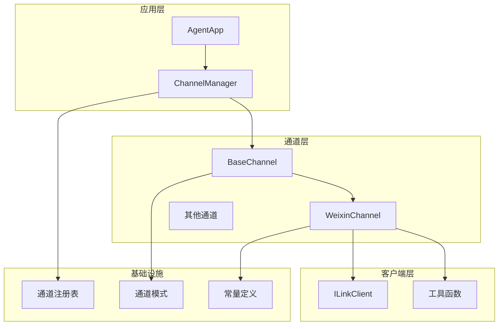
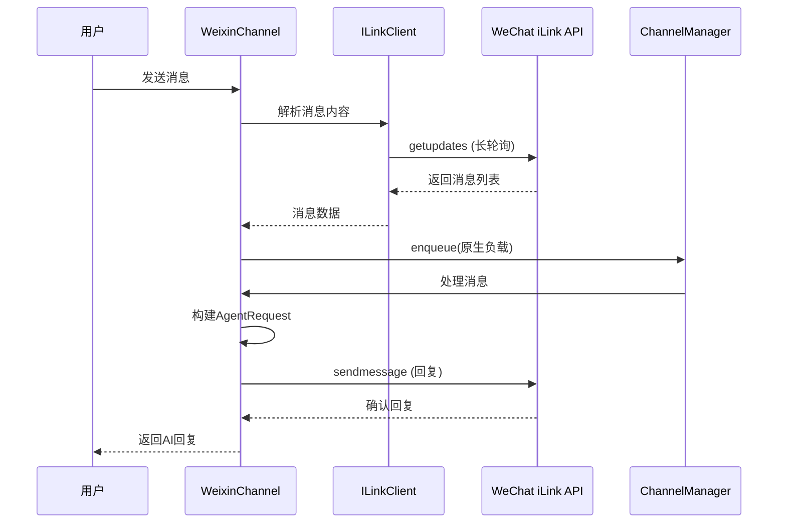
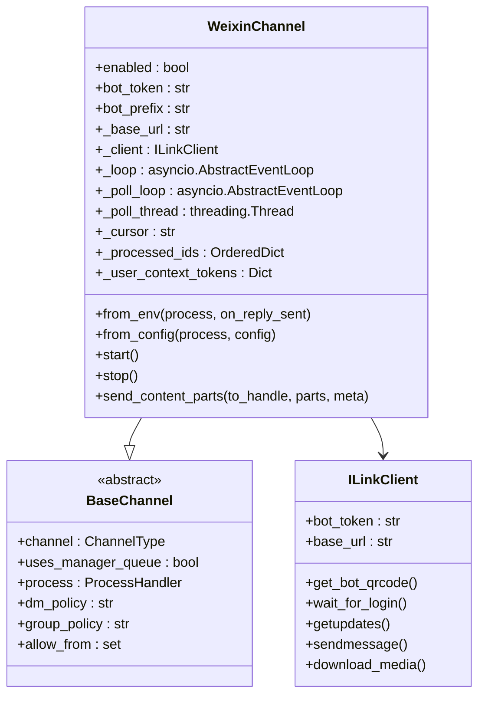
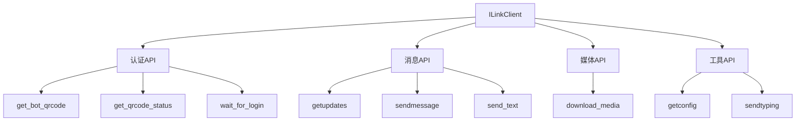
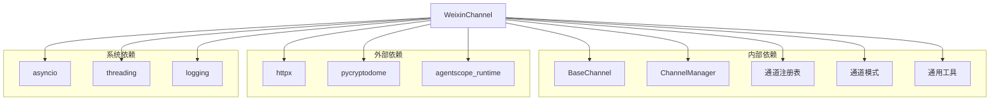

# 微信iLink Bot渠道

<cite>
**本文档引用的文件**
- [src/copaw/app/channels/weixin/channel.py](file://src/copaw/app/channels/weixin/channel.py)
- [src/copaw/app/channels/weixin/client.py](file://src/copaw/app/channels/weixin/client.py)
- [src/copaw/app/channels/weixin/utils.py](file://src/copaw/app/channels/weixin/utils.py)
- [src/copaw/app/channels/base.py](file://src/copaw/app/channels/base.py)
- [src/copaw/app/channels/manager.py](file://src/copaw/app/channels/manager.py)
- [src/copaw/app/channels/registry.py](file://src/copaw/app/channels/registry.py)
- [src/copaw/app/channels/schema.py](file://src/copaw/app/channels/schema.py)
- [src/copaw/app/channels/utils.py](file://src/copaw/app/channels/utils.py)
- [src/copaw/constant.py](file://src/copaw/constant.py)
- [website/public/docs/channels.en.md](file://website/public/docs/channels.en.md)
</cite>

## 目录
1. [简介](#简介)
2. [项目结构](#项目结构)
3. [核心组件](#核心组件)
4. [架构概览](#架构概览)
5. [详细组件分析](#详细组件分析)
6. [依赖关系分析](#依赖关系分析)
7. [性能考虑](#性能考虑)
8. [故障排除指南](#故障排除指南)
9. [结论](#结论)

## 简介

微信iLink Bot渠道是CoPaw平台中的一个重要组成部分，它允许用户通过个人微信账户运行AI机器人，无需企业账号即可享受官方iLink Bot HTTP API服务。该渠道实现了长轮询接收消息、HTTP发送回复、媒体文件下载解密等功能，为开发者提供了一个完整的微信机器人解决方案。

## 项目结构

CoPaw项目采用模块化架构设计，微信iLink Bot渠道位于通道系统的核心位置。整个项目结构清晰，遵循分层设计原则：

**图表来源**
- [src/copaw/app/channels/weixin/channel.py:59-130](file://src/copaw/app/channels/weixin/channel.py#L59-L130)
- [src/copaw/app/channels/manager.py:114-155](file://src/copaw/app/channels/manager.py#L114-L155)
- [src/copaw/app/channels/registry.py:20-35](file://src/copaw/app/channels/registry.py#L20-L35)

**章节来源**
- [src/copaw/app/channels/weixin/channel.py:1-80](file://src/copaw/app/channels/weixin/channel.py#L1-L80)
- [src/copaw/app/channels/manager.py:1-50](file://src/copaw/app/channels/manager.py#L1-L50)

## 核心组件

微信iLink Bot渠道包含以下核心组件：

### WeixinChannel类
WeixinChannel是微信iLink Bot的主要实现类，继承自BaseChannel基类。它负责处理所有与微信iLink API相关的操作，包括消息接收、发送、认证等。

### ILinkClient类
ILinkClient是微信iLink Bot的HTTP客户端，封装了所有API调用细节，包括QR码登录、消息获取、消息发送等功能。

### 工具函数模块
包含AES加密解密、HTTP头构建、文本分割等辅助功能。

**章节来源**
- [src/copaw/app/channels/weixin/channel.py:59-130](file://src/copaw/app/channels/weixin/channel.py#L59-L130)
- [src/copaw/app/channels/weixin/client.py:35-50](file://src/copaw/app/channels/weixin/client.py#L35-L50)
- [src/copaw/app/channels/weixin/utils.py:11-27](file://src/copaw/app/channels/weixin/utils.py#L11-L27)

## 架构概览

微信iLink Bot渠道采用事件驱动架构，结合异步编程模型实现高效的消息处理：

**图表来源**
- [src/copaw/app/channels/weixin/channel.py:429-472](file://src/copaw/app/channels/weixin/channel.py#L429-L472)
- [src/copaw/app/channels/weixin/client.py:171-193](file://src/copaw/app/channels/weixin/client.py#L171-L193)
- [src/copaw/app/channels/manager.py:322-364](file://src/copaw/app/channels/manager.py#L322-L364)

## 详细组件分析

### WeixinChannel类分析

WeixinChannel类实现了微信iLink Bot的所有核心功能：

#### 初始化和配置

**图表来源**
- [src/copaw/app/channels/weixin/channel.py:69-130](file://src/copaw/app/channels/weixin/channel.py#L69-L130)
- [src/copaw/app/channels/base.py:69-78](file://src/copaw/app/channels/base.py#L69-L78)
- [src/copaw/app/channels/weixin/client.py:43-50](file://src/copaw/app/channels/weixin/client.py#L43-L50)

#### 消息处理流程
WeixinChannel实现了完整的消息处理生命周期：

1. **消息接收**：通过长轮询机制持续监听新消息
2. **消息解析**：解析不同类型的微信消息（文本、图片、语音、文件）
3. **内容转换**：将微信消息转换为AgentRequest格式
4. **队列处理**：通过ChannelManager进行统一处理
5. **响应发送**：将AI回复发送回微信用户

#### 认证机制
支持两种认证方式：
- **令牌认证**：使用预配置的bot_token
- **QR码认证**：首次启动时自动触发QR码登录流程

**章节来源**
- [src/copaw/app/channels/weixin/channel.py:134-187](file://src/copaw/app/channels/weixin/channel.py#L134-L187)
- [src/copaw/app/channels/weixin/channel.py:829-867](file://src/copaw/app/channels/weixin/channel.py#L829-L867)

### ILinkClient类分析

ILinkClient提供了微信iLink API的完整封装：

#### API方法分类

**图表来源**
- [src/copaw/app/channels/weixin/client.py:109-165](file://src/copaw/app/channels/weixin/client.py#L109-L165)
- [src/copaw/app/channels/weixin/client.py:195-270](file://src/copaw/app/channels/weixin/client.py#L195-L270)
- [src/copaw/app/channels/weixin/client.py:276-318](file://src/copaw/app/channels/weixin/client.py#L276-L318)

#### 长轮询机制
ILinkClient实现了高效的长轮询机制，支持最多35秒的服务器端保持连接：

**章节来源**
- [src/copaw/app/channels/weixin/client.py:171-193](file://src/copaw/app/channels/weixin/client.py#L171-L193)

### 工具函数模块分析

#### AES加密解密
提供了完整的AES-ECB加密解密功能，支持多种密钥格式：

**章节来源**
- [src/copaw/app/channels/weixin/utils.py:29-88](file://src/copaw/app/channels/weixin/utils.py#L29-L88)

## 依赖关系分析

微信iLink Bot渠道的依赖关系相对简洁，主要依赖于基础通道框架和第三方库：

**图表来源**
- [src/copaw/app/channels/weixin/channel.py:31-48](file://src/copaw/app/channels/weixin/channel.py#L31-L48)
- [src/copaw/app/channels/weixin/client.py:22-24](file://src/copaw/app/channels/weixin/client.py#L22-L24)

**章节来源**
- [src/copaw/app/channels/registry.py:50-77](file://src/copaw/app/channels/registry.py#L50-L77)
- [src/copaw/app/channels/manager.py:23-25](file://src/copaw/app/channels/manager.py#L23-L25)

## 性能考虑

微信iLink Bot渠道在设计时充分考虑了性能优化：

### 异步处理
- 使用asyncio实现非阻塞I/O操作
- 独立的轮询线程避免阻塞主事件循环
- 并发处理多个会话请求

### 内存管理
- 消息去重机制限制内存使用
- 媒体文件缓存策略优化存储空间
- 连接池管理减少资源开销

### 网络优化
- 长轮询机制减少不必要的请求
- 自适应超时设置平衡响应速度和资源消耗
- 错误重试机制提高系统稳定性

## 故障排除指南

### 常见问题及解决方案

#### QR码登录失败
**症状**：启动时无法完成QR码登录
**原因**：
- 网络连接问题
- 微信服务器暂时不可用
- 超时设置过短

**解决方案**：
1. 检查网络连接状态
2. 增加等待时间配置
3. 重新尝试登录流程

#### 消息接收延迟
**症状**：用户发送消息后响应延迟
**原因**：
- 长轮询超时设置不当
- 服务器负载过高
- 客户端配置问题

**解决方案**：
1. 调整长轮询超时参数
2. 检查服务器状态
3. 优化客户端配置

#### 媒体文件下载失败
**症状**：图片、文件等媒体无法正常显示
**原因**：
- 加密密钥错误
- CDN访问权限问题
- 文件格式不支持

**解决方案**：
1. 验证AES密钥格式
2. 检查CDN访问权限
3. 支持更多文件格式

**章节来源**
- [src/copaw/app/channels/weixin/channel.py:357-396](file://src/copaw/app/channels/weixin/channel.py#L357-L396)
- [src/copaw/app/channels/weixin/client.py:131-165](file://src/copaw/app/channels/weixin/client.py#L131-L165)

## 结论

微信iLink Bot渠道作为CoPaw平台的重要组成部分，展现了优秀的架构设计和实现质量。通过采用事件驱动、异步处理的设计模式，该渠道能够高效地处理微信消息的接收和发送，为用户提供流畅的聊天体验。

主要优势包括：
- **完整的功能实现**：支持文本、图片、语音、文件等多种消息类型
- **可靠的认证机制**：支持QR码登录和令牌认证两种方式
- **高性能设计**：异步处理和长轮询机制确保低延迟响应
- **良好的扩展性**：基于BaseChannel的架构便于功能扩展和维护

未来可以考虑的功能改进方向：
- 增加对视频消息的直接支持
- 优化媒体文件的缓存策略
- 提供更丰富的配置选项
- 增强错误处理和监控能力