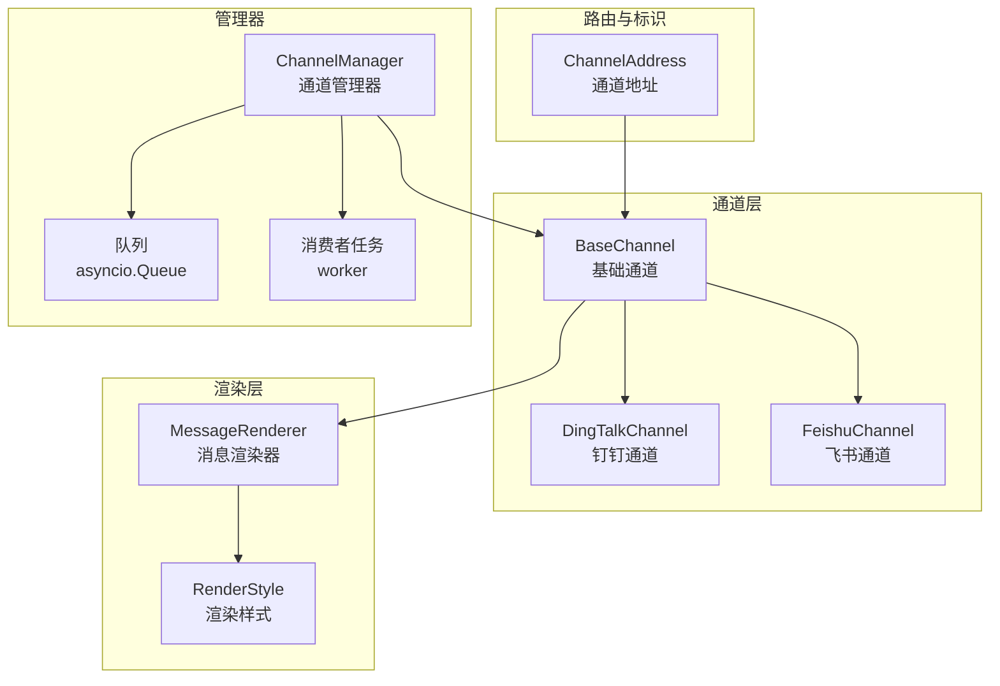
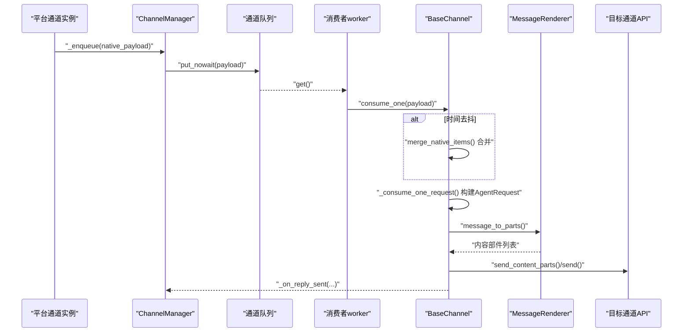
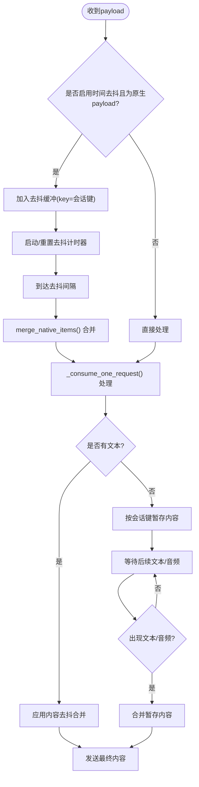
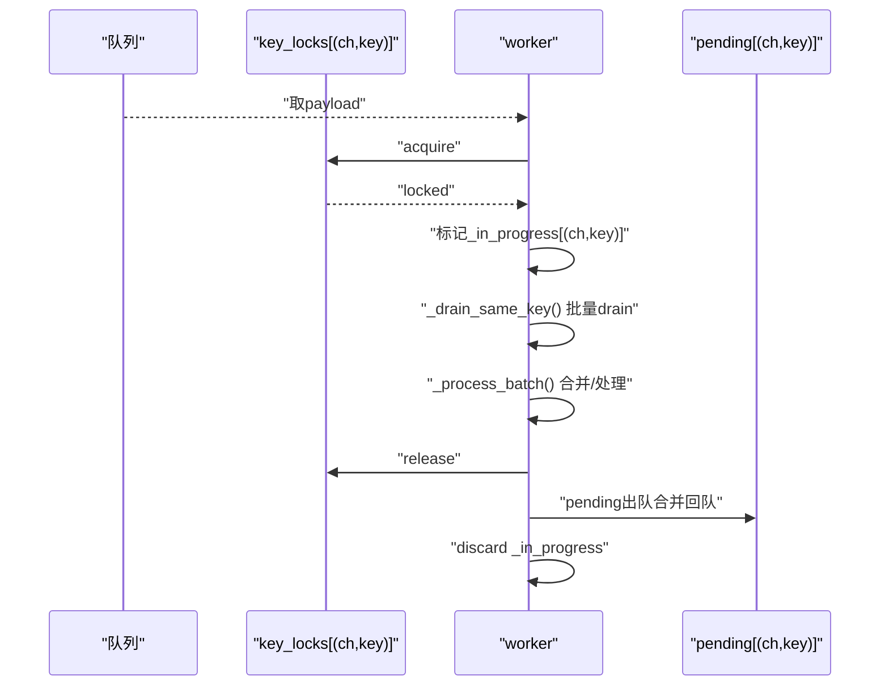
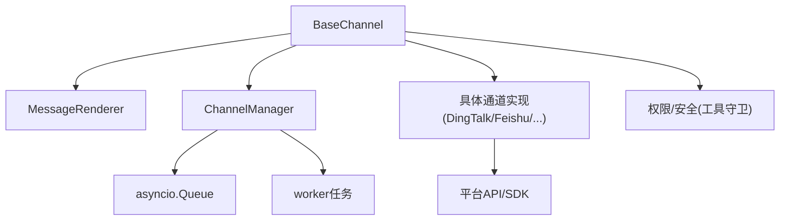

# 消息处理流程

<cite>
**本文引用的文件**
- [base.py](file://src/copaw/app/channels/base.py)
- [manager.py](file://src/copaw/app/channels/manager.py)
- [schema.py](file://src/copaw/app/channels/schema.py)
- [renderer.py](file://src/copaw/app/channels/renderer.py)
- [channel.py](file://src/copaw/app/channels/dingtalk/channel.py)
- [channel.py](file://src/copaw/app/channels/feishu/channel.py)
- [channels.en.md](file://website/public/docs/channels.en.md)
- [test_qq_channel.py](file://tests/unit/channels/test_qq_channel.py)
- [engine.py](file://src/copaw/security/tool_guard/engine.py)
- [config.py](file://src/copaw/app/routers/config.py)
- [useToolGuard.ts](file://console/src/pages/Settings/Security/useToolGuard.ts)
- [tool_guard_mixin.py](file://src/copaw/agents/tool_guard_mixin.py)
- [retry_chat_model.py](file://src/copaw/providers/retry_chat_model.py)
- [context.en.md](file://website/public/docs/context.en.md)
</cite>

## 目录
1. [简介](#简介)
2. [项目结构](#项目结构)
3. [核心组件](#核心组件)
4. [架构总览](#架构总览)
5. [详细组件分析](#详细组件分析)
6. [依赖分析](#依赖分析)
7. [性能考虑](#性能考虑)
8. [故障排查指南](#故障排查指南)
9. [结论](#结论)
10. [附录](#附录)

## 简介
本文面向CoPaw的消息处理子系统，系统性阐述从“接收—解析—转换—发送”的完整链路，覆盖去抖动机制、会话管理策略、消息队列与批量处理、错误重试、消息格式标准化、内容解析与元数据提取、权限校验、消息路由与状态同步、并发控制等关键技术点，并提供可操作的开发实践建议与排障指引。

## 项目结构
CoPaw的消息处理由“通道抽象层 + 管理器 + 渲染器 + 具体通道实现”构成，形成统一的处理框架：
- 通道基类定义通用契约与默认行为（去抖动、合并、渲染、发送）
- 管理器负责队列、并发消费、批处理、会话隔离与状态同步
- 渲染器将运行时消息转换为各通道可发送的内容部件
- 各平台通道实现（如钉钉、飞书）按需覆盖解析、发送与特殊能力

图示来源
- [base.py:69-125](file://src/copaw/app/channels/base.py#L69-L125)
- [manager.py:114-134](file://src/copaw/app/channels/manager.py#L114-L134)
- [renderer.py:78-86](file://src/copaw/app/channels/renderer.py#L78-L86)
- [schema.py:12-28](file://src/copaw/app/channels/schema.py#L12-L28)

章节来源
- [base.py:69-125](file://src/copaw/app/channels/base.py#L69-L125)
- [manager.py:114-134](file://src/copaw/app/channels/manager.py#L114-L134)
- [renderer.py:78-86](file://src/copaw/app/channels/renderer.py#L78-L86)
- [schema.py:12-28](file://src/copaw/app/channels/schema.py#L12-L28)

## 核心组件
- BaseChannel：定义消息入队、去抖动、请求构建、事件处理、错误回调、发送等统一接口；支持时间去抖与内容去抖（无文本时缓冲直至有文本或音频）
- ChannelManager：为每个通道维护独立队列与多个消费者任务，按会话键进行批处理与并发隔离；支持替换通道、线程安全入队
- MessageRenderer：将运行时消息内容转换为各通道可发送的部件集合（文本、图片、视频、音频、文件、拒绝），并支持过滤与样式控制
- ChannelAddress：统一路由标识，替代分散的meta键，便于跨通道一致化处理
- 具体通道（钉钉/飞书）：实现native到AgentRequest的解析、会话Webhook存储、媒体资源下载、卡片/交互能力等

章节来源
- [base.py:443-583](file://src/copaw/app/channels/base.py#L443-L583)
- [manager.py:322-363](file://src/copaw/app/channels/manager.py#L322-L363)
- [renderer.py:87-350](file://src/copaw/app/channels/renderer.py#L87-L350)
- [schema.py:12-28](file://src/copaw/app/channels/schema.py#L12-L28)
- [channel.py:81-179](file://src/copaw/app/channels/dingtalk/channel.py#L81-L179)
- [channel.py:150-200](file://src/copaw/app/channels/feishu/channel.py#L150-L200)

## 架构总览
消息处理链路遵循“平台接入—统一入队—去抖合并—批处理—运行时处理—渲染发送”的闭环：

图示来源
- [channels.en.md:818-821](file://website/public/docs/channels.en.md#L818-L821)
- [manager.py:322-363](file://src/copaw/app/channels/manager.py#L322-L363)
- [base.py:443-583](file://src/copaw/app/channels/base.py#L443-L583)
- [renderer.py:87-350](file://src/copaw/app/channels/renderer.py#L87-L350)

## 详细组件分析

### 去抖动与内容合并机制
- 时间去抖：当payload为原生字典且启用去抖动时，按会话键缓存并延时flush，合并后一次性处理，避免频繁小消息触发
- 内容去抖：若当前消息无文本但存在音频，则立即处理（语音消息视为完整输入）；否则将该会话的非文本内容暂存，待出现文本时合并发送
- 合并策略：合并content_parts并保留meta中的关键字段（如回复future、循环loop、incoming_message等）

图示来源
- [base.py:443-479](file://src/copaw/app/channels/base.py#L443-L479)
- [base.py:208-279](file://src/copaw/app/channels/base.py#L208-L279)

章节来源
- [base.py:126-174](file://src/copaw/app/channels/base.py#L126-L174)
- [base.py:208-279](file://src/copaw/app/channels/base.py#L208-L279)
- [base.py:443-479](file://src/copaw/app/channels/base.py#L443-L479)

### 会话管理与并发控制
- 会话键：默认基于“通道类型:用户ID”，也可由通道自定义解析（如钉钉使用会话短ID）
- 并发隔离：同一会话在任意时刻仅由一个worker处理，其他同会话payload进入pending，待处理完成后合并回队列
- 批量处理：同会话多payload按顺序drain并合并（native或requests），减少重复请求与抖动
- 关键锁：按(channel, key)粒度加锁，保证批处理原子性与顺序一致性

图示来源
- [manager.py:322-363](file://src/copaw/app/channels/manager.py#L322-L363)
- [manager.py:42-62](file://src/copaw/app/channels/manager.py#L42-L62)
- [manager.py:94-112](file://src/copaw/app/channels/manager.py#L94-L112)

章节来源
- [manager.py:42-62](file://src/copaw/app/channels/manager.py#L42-L62)
- [manager.py:125-134](file://src/copaw/app/channels/manager.py#L125-L134)
- [manager.py:322-363](file://src/copaw/app/channels/manager.py#L322-L363)

### 消息队列与批量处理
- 队列容量：每通道固定最大长度，防止内存膨胀
- 消费者数量：每通道固定worker数，提升吞吐同时保持会话内串行
- 批处理逻辑：native批量合并、requests批量合并，减少下游调用次数
- 线程安全入队：通过事件循环回调，支持同步线程（如WebSocket轮询）安全入队

章节来源
- [manager.py:35-39](file://src/copaw/app/channels/manager.py#L35-L39)
- [manager.py:304-321](file://src/copaw/app/channels/manager.py#L304-L321)
- [manager.py:65-92](file://src/copaw/app/channels/manager.py#L65-L92)

### 权限验证与消息过滤
- 白名单/黑名单：支持按群聊/私聊策略与允许列表
- 提及策略：群聊下可要求机器人被提及或包含命令关键字
- 拒绝文案：未授权时可返回自定义提示

章节来源
- [base.py:281-316](file://src/copaw/app/channels/base.py#L281-L316)

### 消息格式标准化与内容解析
- 统一内容类型：Text、Image、Video、Audio、File、Refusal、DATA等
- 渲染器：将运行时消息转换为各通道可发送部件，支持过滤工具消息、思考内容、内部工具等
- 通道特定解析：如钉钉卡片、飞书富媒体、QQ群聊事件等，均转为统一内容部件再发送

章节来源
- [renderer.py:29-34](file://src/copaw/app/channels/renderer.py#L29-L34)
- [renderer.py:87-350](file://src/copaw/app/channels/renderer.py#L87-L350)
- [channel.py:668-754](file://src/copaw/app/channels/feishu/channel.py#L668-L754)
- [channel.py:378-407](file://src/copaw/app/channels/wecom/channel.py#L378-L407)

### 发送与错误处理
- 默认发送：将内容部件合并为文本正文并附加媒体URL作为回退，逐条发送媒体
- 错误回调：捕获异常与响应错误，统一以文本形式反馈给用户
- 回调通知：每次成功发送用户回复后触发_on_reply_sent，用于状态同步与统计

章节来源
- [base.py:648-764](file://src/copaw/app/channels/base.py#L648-L764)
- [base.py:584-647](file://src/copaw/app/channels/base.py#L584-L647)

### 具体通道实现要点

#### 钉钉通道
- 会话Webhook：存储会话级webhook以便主动推送；短会话ID便于cron与请求复用
- 卡片与交互：AI卡片状态机、消息ID去重、回复future与loop配合实现流式回复
- 文本合并：将多部件内容合并为单一文本，媒体以占位符形式回退

章节来源
- [channel.py:81-179](file://src/copaw/app/channels/dingtalk/channel.py#L81-L179)
- [channel.py:461-491](file://src/copaw/app/channels/dingtalk/channel.py#L461-L491)
- [channel.py:566-599](file://src/copaw/app/channels/dingtalk/channel.py#L566-L599)

#### 飞书通道
- 接收：WebSocket长连接；发送：Open API（租户token）
- 会话：基于chat_id或open_id；存储receive_id用于主动发送与回复
- 富媒体：支持图片、文件、音频等资源下载与发送

章节来源
- [channel.py:150-200](file://src/copaw/app/channels/feishu/channel.py#L150-L200)
- [channel.py:999-1034](file://src/copaw/app/channels/feishu/channel.py#L999-L1034)

### 路由与状态同步
- ChannelAddress：统一kind/id/extra，替代分散meta键，便于跨通道路由
- 主动发送：通过管理器的send_text/send_event，将(user_id, session_id)映射为通道目标handle并携带bot前缀

章节来源
- [schema.py:12-28](file://src/copaw/app/channels/schema.py#L12-L28)
- [manager.py:499-579](file://src/copaw/app/channels/manager.py#L499-L579)

### 权限与安全
- 工具守卫：在工具调用前进行规则扫描与审批，支持内置/自定义规则、禁用规则、动态开关
- 控制台配置：前端读取/更新工具守卫配置，后端接口热更新引擎与规则集

章节来源
- [engine.py:53-207](file://src/copaw/security/tool_guard/engine.py#L53-L207)
- [config.py:407-453](file://src/copaw/app/routers/config.py#L407-L453)
- [useToolGuard.ts:1-47](file://console/src/pages/Settings/Security/useToolGuard.ts#L1-L47)
- [tool_guard_mixin.py:57-84](file://src/copaw/agents/tool_guard_mixin.py#L57-L84)

### 上下文管理与性能
- 上下文压缩：将历史对话与工具结果压缩为结构化摘要，保留关键信息，降低token占用
- 配置参数：最大输入长度、压缩阈值、保留比例、工具结果压缩策略等

章节来源
- [context.en.md:1-239](file://website/public/docs/context.en.md#L1-L239)

## 依赖分析

图示来源
- [base.py:35-116](file://src/copaw/app/channels/base.py#L35-L116)
- [manager.py:114-134](file://src/copaw/app/channels/manager.py#L114-L134)
- [engine.py:53-207](file://src/copaw/security/tool_guard/engine.py#L53-L207)

章节来源
- [base.py:35-116](file://src/copaw/app/channels/base.py#L35-L116)
- [manager.py:114-134](file://src/copaw/app/channels/manager.py#L114-L134)
- [engine.py:53-207](file://src/copaw/security/tool_guard/engine.py#L53-L207)

## 性能考虑
- 去抖动与批处理：显著降低下游API调用频率，减少网络与服务端压力
- 并发隔离：同一会话串行处理，避免重复与乱序，提高稳定性
- 渲染与合并：先合并文本再发送媒体，减少往返次数
- 资源下载：媒体资源异步下载并本地化，避免阻塞主处理流程
- 重试策略：对临时性失败进行指数退避重试，提升鲁棒性

## 故障排查指南
- 常见问题
  - 消息未送达：检查_on_consume_error回调是否被触发，确认meta中session_webhook是否存在
  - 重复消息：核对去抖与内容去抖逻辑，确认会话键是否正确
  - 并发错乱：确认_in_progress与key_locks是否正确释放
  - 权限拦截：核对白名单/黑名单与提及策略
- 排查步骤
  - 开启通道日志，定位consume_one/_run_process_loop阶段
  - 检查渲染器输出部件与发送路径
  - 对比钉钉/飞书等通道的特殊处理差异
  - 使用单元测试样例验证解析与元数据提取

章节来源
- [base.py:584-647](file://src/copaw/app/channels/base.py#L584-L647)
- [test_qq_channel.py:436-493](file://tests/unit/channels/test_qq_channel.py#L436-L493)

## 结论
CoPaw的消息处理体系以BaseChannel为核心，结合ChannelManager的队列与批处理、MessageRenderer的格式标准化，以及各平台通道的差异化实现，形成了高可用、可扩展、可观测的消息处理链路。通过去抖动、会话隔离、权限校验与工具守卫等机制，既保障了用户体验，也提升了系统的安全性与稳定性。

## 附录

### 消息处理流程示例（文字版）
- 接收：平台通道收到原始payload（如WebSocket事件或HTTP回调）
- 入队：调用_channel._enqueue(native)，由管理器线程安全入队
- 去抖：若启用时间去抖，按会话键缓存并延时flush
- 合并：合并同会话的多个payload（native或requests）
- 构建请求：将native转为AgentRequest，填充session_id、user_id、channel_meta
- 渲染：MessageRenderer将消息内容转为可发送部件
- 发送：逐条发送文本与媒体，必要时调用平台API
- 回调：触发_on_reply_sent，用于状态同步与统计

章节来源
- [channels.en.md:818-821](file://website/public/docs/channels.en.md#L818-L821)
- [base.py:388-415](file://src/copaw/app/channels/base.py#L388-L415)
- [renderer.py:87-350](file://src/copaw/app/channels/renderer.py#L87-L350)