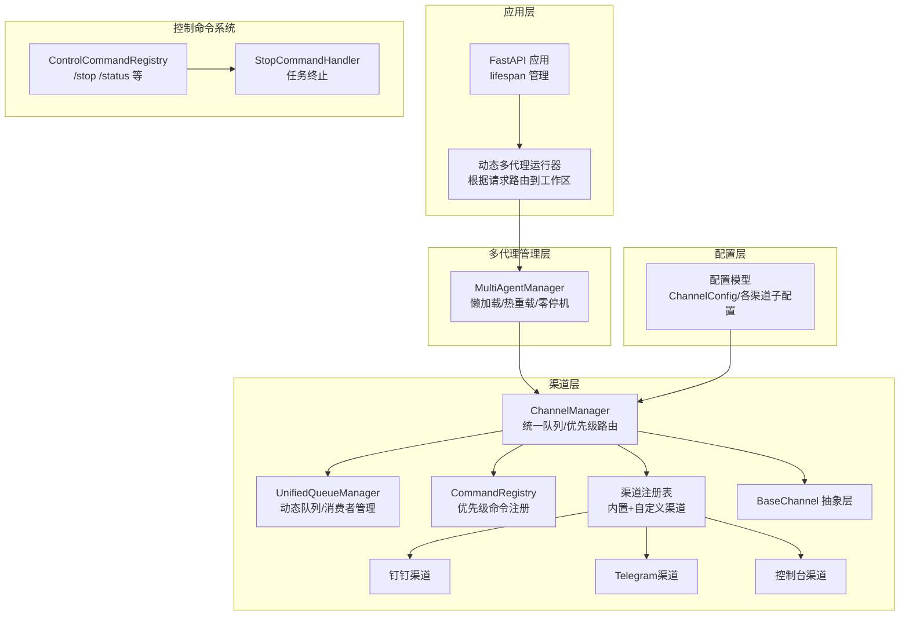
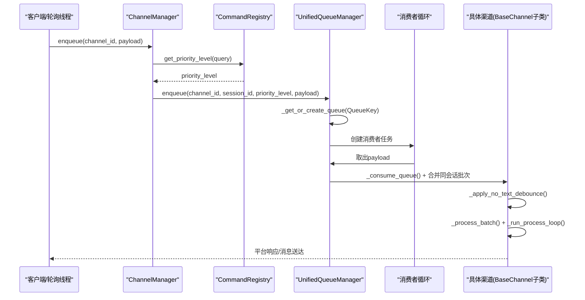
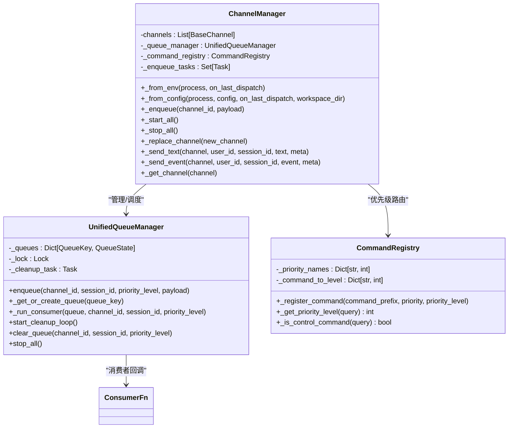
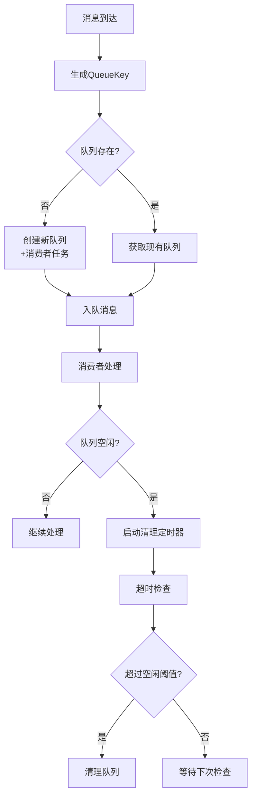
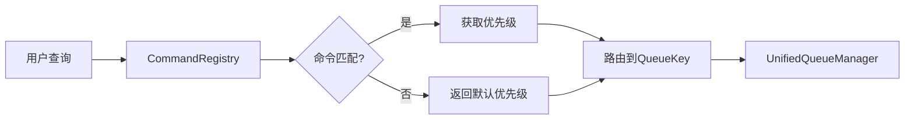
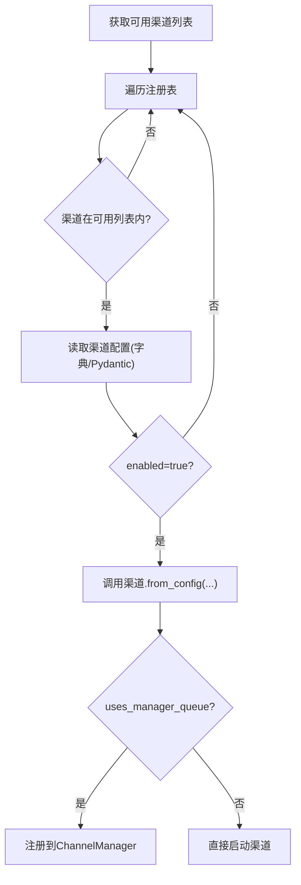
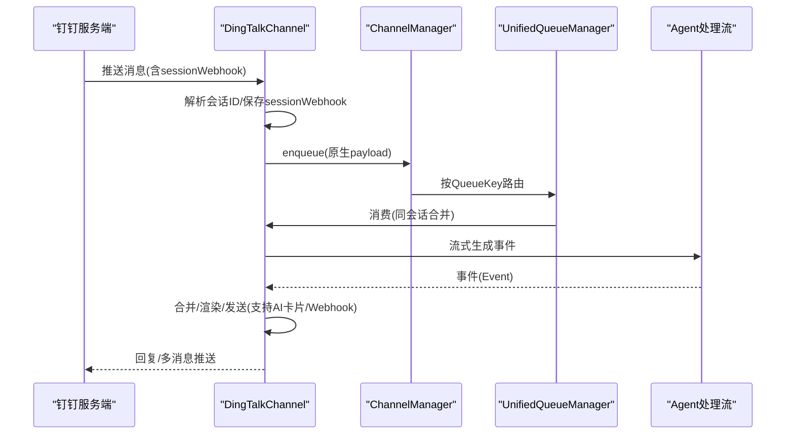
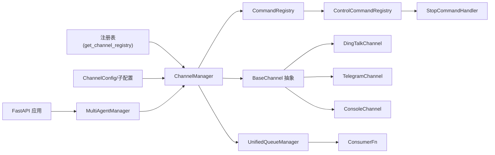

# 渠道管理器系统

<cite>
**本文档引用的文件**
- [src/copaw/app/channels/manager.py](file://src/copaw/app/channels/manager.py)
- [src/copaw/app/channels/registry.py](file://src/copaw/app/channels/registry.py)
- [src/copaw/app/channels/base.py](file://src/copaw/app/channels/base.py)
- [src/copaw/app/channels/unified_queue_manager.py](file://src/copaw/app/channels/unified_queue_manager.py)
- [src/copaw/app/channels/command_registry.py](file://src/copaw/app/channels/command_registry.py)
- [src/copaw/app/runner/control_commands/__init__.py](file://src/copaw/app/runner/control_commands/__init__.py)
- [src/copaw/app/runner/control_commands/base.py](file://src/copaw/app/runner/control_commands/base.py)
- [src/copaw/app/runner/control_commands/stop_handler.py](file://src/copaw/app/runner/control_commands/stop_handler.py)
- [src/copaw/app/channels/dingtalk/channel.py](file://src/copaw/app/channels/dingtalk/channel.py)
- [src/copaw/app/channels/telegram/channel.py](file://src/copaw/app/channels/telegram/channel.py)
- [src/copaw/app/channels/console/channel.py](file://src/copaw/app/channels/console/channel.py)
- [src/copaw/config/config.py](file://src/copaw/config/config.py)
- [src/copaw/app/_app.py](file://src/copaw/app/_app.py)
- [src/copaw/app/multi_agent_manager.py](file://src/copaw/app/multi_agent_manager.py)
</cite>

## 更新摘要
**所做更改**
- 新增统一队列架构的详细说明和实现原理
- 增强控制命令注册系统的功能描述和使用方法
- 更新ChannelManager的架构图以反映新的队列管理机制
- 添加优先级路由和动态队列管理的技术细节
- 完善控制命令处理流程和优先级管理系统

## 目录
1. [简介](#简介)
2. [项目结构](#项目结构)
3. [核心组件](#核心组件)
4. [架构总览](#架构总览)
5. [详细组件分析](#详细组件分析)
6. [依赖关系分析](#依赖关系分析)
7. [性能考量](#性能考量)
8. [故障排查指南](#故障排查指南)
9. [结论](#结论)
10. [附录](#附录)

## 简介
本文档面向CoPaw渠道管理器系统，系统性阐述ChannelManager的职责与工作机制、渠道注册表的实现原理、统一队列架构的引入、控制命令注册系统的增强、消息队列管理策略、渠道实例化与生命周期管理、动态配置更新、状态监控与错误恢复、性能优化策略，并提供运维实践示例（配置方法、监控接口使用、故障诊断），以及渠道间隔离机制、资源共享与负载均衡等高级特性。

## 项目结构
CoPaw采用分层架构：应用层通过AgentApp统一接入，多代理管理器负责按需加载与热重载；渠道层由ChannelManager集中编排，各渠道实现遵循统一基类协议，支持从环境变量或配置文件动态初始化。**新增**统一队列管理器提供基于会话和优先级的智能路由，控制命令注册系统实现优先级化的消息处理。

**图表来源**
- [src/copaw/app/_app.py:149-241](file://src/copaw/app/_app.py#L149-L241)
- [src/copaw/app/multi_agent_manager.py:17-451](file://src/copaw/app/multi_agent_manager.py#L17-L451)
- [src/copaw/app/channels/manager.py:78-82](file://src/copaw/app/channels/manager.py#L78-L82)
- [src/copaw/app/channels/unified_queue_manager.py:60-78](file://src/copaw/app/channels/unified_queue_manager.py#L60-L78)
- [src/copaw/app/channels/command_registry.py:23-41](file://src/copaw/app/channels/command_registry.py#L23-L41)
- [src/copaw/app/runner/control_commands/__init__.py:26-33](file://src/copaw/app/runner/control_commands/__init__.py#L26-L33)

**章节来源**
- [src/copaw/app/_app.py:149-241](file://src/copaw/app/_app.py#L149-L241)
- [src/copaw/app/multi_agent_manager.py:17-451](file://src/copaw/app/multi_agent_manager.py#L17-L451)
- [src/copaw/app/channels/manager.py:78-82](file://src/copaw/app/channels/manager.py#L78-L82)
- [src/copaw/app/channels/unified_queue_manager.py:60-78](file://src/copaw/app/channels/unified_queue_manager.py#L60-L78)
- [src/copaw/app/channels/command_registry.py:23-41](file://src/copaw/app/channels/command_registry.py#L23-L41)
- [src/copaw/app/runner/control_commands/__init__.py:26-33](file://src/copaw/app/runner/control_commands/__init__.py#L26-L33)

## 核心组件
- **ChannelManager**：统一持有各渠道实例、管理统一队列与消费者任务、执行消息优先级路由与动态队列管理、提供发送接口与动态替换能力。
- **UnifiedQueueManager**：**新增**统一队列管理器，基于三元组QueueKey(channel_id, session_id, priority_level)实现动态队列创建、消费者任务管理和空闲清理。
- **CommandRegistry**：**增强**控制命令注册系统，支持优先级命名和数值两种注册方式，提供O(1)查询和灵活的优先级扩展。
- **ControlCommandRegistry**：**新增**控制命令处理系统，支持/stop等紧急命令的即时响应和特殊处理。
- 渠道注册表：聚合内置渠道与自定义渠道，支持缓存与失败策略。
- BaseChannel：抽象出渠道通用协议，包括会话解析、内容合并、发送与错误处理钩子。
- 各渠道实现：如钉钉、Telegram、控制台等，按自身协议扩展消费与发送逻辑。
- 配置模型：ChannelConfig及各渠道子配置，支持从配置文件与环境变量注入。

**章节来源**
- [src/copaw/app/channels/manager.py:68-82](file://src/copaw/app/channels/manager.py#L68-L82)
- [src/copaw/app/channels/unified_queue_manager.py:60-78](file://src/copaw/app/channels/unified_queue_manager.py#L60-L78)
- [src/copaw/app/channels/command_registry.py:23-41](file://src/copaw/app/channels/command_registry.py#L23-L41)
- [src/copaw/app/runner/control_commands/__init__.py:26-33](file://src/copaw/app/runner/control_commands/__init__.py#L26-L33)

## 架构总览
ChannelManager作为框架所有渠道的拥有者，负责：
- 从注册表与可用渠道列表中构建渠道实例
- **新增**通过CommandRegistry进行消息优先级分类，路由到UnifiedQueueManager
- **新增**为每个QueueKey创建独立队列与消费者工作线程，支持动态创建和清理
- 基于会话键进行去抖与批量合并，避免重复与乱序
- 将Agent请求事件流经渠道消费，最终渲染并发送给目标平台

**图表来源**
- [src/copaw/app/channels/manager.py:255-301](file://src/copaw/app/channels/manager.py#L255-L301)
- [src/copaw/app/channels/command_registry.py:175-218](file://src/copaw/app/channels/command_registry.py#L175-L218)
- [src/copaw/app/channels/unified_queue_manager.py:119-164](file://src/copaw/app/channels/unified_queue_manager.py#L119-L164)

**章节来源**
- [src/copaw/app/channels/manager.py:255-301](file://src/copaw/app/channels/manager.py#L255-L301)
- [src/copaw/app/channels/command_registry.py:175-218](file://src/copaw/app/channels/command_registry.py#L175-L218)
- [src/copaw/app/channels/unified_queue_manager.py:119-164](file://src/copaw/app/channels/unified_queue_manager.py#L119-L164)

## 详细组件分析

### ChannelManager 组件分析
- **实例化与启动**
  - from_env/from_config：从注册表与可用渠道列表构建渠道实例，支持字典/Pydantic配置、过滤工具消息与思考内容等全局选项。
  - **新增**start_all：初始化UnifiedQueueManager和CommandRegistry，启动清理循环，为启用队列的渠道创建队列与消费者任务。
- **消息入队与优先级路由**
  - **新增**_enqueue_one：提取查询文本，通过CommandRegistry获取优先级级别，使用统一队列管理器进行路由。
  - **新增**_enqueue_with_timeout：带超时保护的入队操作，防止无限阻塞。
  - **新增**_extract_session_id：标准化会话ID提取逻辑，确保QueueKey一致性。
- **统一队列管理**
  - **新增**_consume_queue：统一队列消费者的实现，保留原有批处理合并逻辑。
  - **新增**clear_queue：通过UnifiedQueueManager清理指定QueueKey的消息队列。
- **动态替换与停止**
  - replace_channel：原子替换指定渠道实例，保证旧实例平滑停止、新实例预启后无缝切换。
  - stop_all：取消所有入队任务，停止UnifiedQueueManager，逐个调用渠道stop()。

**图表来源**
- [src/copaw/app/channels/manager.py:68-82](file://src/copaw/app/channels/manager.py#L68-L82)
- [src/copaw/app/channels/unified_queue_manager.py:60-78](file://src/copaw/app/channels/unified_queue_manager.py#L60-L78)
- [src/copaw/app/channels/command_registry.py:23-41](file://src/copaw/app/channels/command_registry.py#L23-L41)

**章节来源**
- [src/copaw/app/channels/manager.py:68-82](file://src/copaw/app/channels/manager.py#L68-L82)
- [src/copaw/app/channels/unified_queue_manager.py:60-78](file://src/copaw/app/channels/unified_queue_manager.py#L60-L78)
- [src/copaw/app/channels/command_registry.py:23-41](file://src/copaw/app/channels/command_registry.py#L23-L41)

### UnifiedQueueManager 组件分析
**新增**统一队列管理器是整个系统的核心基础设施，提供以下关键功能：

- **动态队列创建**
  - QueueKey = (channel_id, session_id, priority_level)三元组设计
  - 首次使用时自动创建队列和消费者任务
  - 支持按需扩展，避免固定工作池的资源浪费
- **智能清理机制**
  - 空闲队列自动清理，防止内存泄漏
  - 可配置的清理间隔和空闲超时时间
  - 线程安全的队列状态管理
- **监控与指标**
  - 提供详细的队列状态信息
  - 记录处理计数和活动时间
  - 支持运行时性能监控

**图表来源**
- [src/copaw/app/channels/unified_queue_manager.py:165-212](file://src/copaw/app/channels/unified_queue_manager.py#L165-L212)
- [src/copaw/app/channels/unified_queue_manager.py:376-428](file://src/copaw/app/channels/unified_queue_manager.py#L376-L428)

**章节来源**
- [src/copaw/app/channels/unified_queue_manager.py:60-78](file://src/copaw/app/channels/unified_queue_manager.py#L60-L78)
- [src/copaw/app/channels/unified_queue_manager.py:165-212](file://src/copaw/app/channels/unified_queue_manager.py#L165-L212)
- [src/copaw/app/channels/unified_queue_manager.py:376-428](file://src/copaw/app/channels/unified_queue_manager.py#L376-L428)

### CommandRegistry 组件分析
**增强**控制命令注册系统提供灵活的优先级管理和命令路由：

- **优先级系统**
  - 预定义优先级：critical(0)、high(10)、normal(20)、low(30)
  - 支持自定义优先级数值，间隔为10便于扩展
  - O(1)查询性能，基于命令前缀的快速匹配
- **命令管理**
  - 默认注册：/stop、/daemon系列命令
  - 支持名称和数值两种注册方式
  - 灵活的命令前缀匹配算法
- **扩展性**
  - 可插入任意优先级级别的命令
  - 支持命令参数解析和验证

**图表来源**
- [src/copaw/app/channels/command_registry.py:64-89](file://src/copaw/app/channels/command_registry.py#L64-L89)
- [src/copaw/app/channels/command_registry.py:136-174](file://src/copaw/app/channels/command_registry.py#L136-L174)

**章节来源**
- [src/copaw/app/channels/command_registry.py:23-41](file://src/copaw/app/channels/command_registry.py#L23-L41)
- [src/copaw/app/channels/command_registry.py:64-89](file://src/copaw/app/channels/command_registry.py#L64-L89)
- [src/copaw/app/channels/command_registry.py:136-174](file://src/copaw/app/channels/command_registry.py#L136-L174)

### ControlCommandRegistry 组件分析
**新增**控制命令处理系统专门处理紧急和高优先级命令：

- **命令处理流程**
  - is_control_command：快速判断是否为控制命令
  - parse_args：解析命令参数
  - handle_control_command：分发到相应处理器
- **处理器架构**
  - BaseControlCommandHandler：抽象基类
  - StopCommandHandler：/stop命令处理器
  - 可扩展的处理器注册机制
- **上下文管理**
  - ControlContext：包含工作区、通道、会话等上下文信息
  - 支持命令执行所需的完整环境

**章节来源**
- [src/copaw/app/runner/control_commands/__init__.py:26-33](file://src/copaw/app/runner/control_commands/__init__.py#L26-L33)
- [src/copaw/app/runner/control_commands/base.py:19-38](file://src/copaw/app/runner/control_commands/base.py#L19-L38)
- [src/copaw/app/runner/control_commands/stop_handler.py:16-30](file://src/copaw/app/runner/control_commands/stop_handler.py#L16-L30)

### 渠道注册表与渠道实例化
- **注册表**
  - 内置渠道映射与必需渠道（如console）失败策略；支持缓存与自定义渠道目录扫描。
  - 自定义渠道：从CUSTOM_CHANNELS_DIR导入模块，查找继承BaseChannel的类并注册。
- **实例化**
  - from_env/from_config：读取可用渠道列表，遍历注册表，构造渠道实例并注入统一process回调。
  - **新增**支持uses_manager_queue标志，决定是否使用统一队列管理。
  - 支持按渠道配置项过滤（enabled、工具消息过滤、思考内容过滤等）。

**图表来源**
- [src/copaw/app/channels/registry.py:133-138](file://src/copaw/app/channels/registry.py#L133-L138)
- [src/copaw/app/channels/manager.py:460-467](file://src/copaw/app/channels/manager.py#L460-L467)

**章节来源**
- [src/copaw/app/channels/registry.py:133-138](file://src/copaw/app/channels/registry.py#L133-L138)
- [src/copaw/app/channels/manager.py:460-467](file://src/copaw/app/channels/manager.py#L460-L467)

### 钉钉渠道（高级特性示例）
- **会话Webhook存储与持久化**：支持通过会话Webhook主动发送消息，存储于内存与磁盘，便于重启后恢复。
- **AI卡片与流式回复**：支持多消息合并发送、早期ACK避免重试风暴、媒体上传与Markdown渲染。
- **去重与消息ID管理**：基于消息ID集合去重，避免重复处理。
- **时间去抖关闭**：由于管理器已按会话合并，钉钉渠道不启用时间去抖，直接合并后交由管理器消费。
- **统一队列集成**：完全集成到新的统一队列架构中，享受动态队列管理和优先级路由。

**图表来源**
- [src/copaw/app/channels/dingtalk/channel.py:262-421](file://src/copaw/app/channels/dingtalk/channel.py#L262-L421)
- [src/copaw/app/channels/manager.py:255-301](file://src/copaw/app/channels/manager.py#L255-L301)
- [src/copaw/app/channels/unified_queue_manager.py:119-164](file://src/copaw/app/channels/unified_queue_manager.py#L119-L164)

**章节来源**
- [src/copaw/app/channels/dingtalk/channel.py:262-421](file://src/copaw/app/channels/dingtalk/channel.py#L262-L421)
- [src/copaw/app/channels/dingtalk/channel.py:547-698](file://src/copaw/app/channels/dingtalk/channel.py#L547-L698)

### Telegram渠道（媒体与限流）
- **媒体下载与本地缓存**：支持图片/视频/音频/文档下载到本地媒体目录，解析URL为file://路径。
- **分片发送与HTML兼容**：按长度限制切分文本，优先HTML模式，失败回退纯文本。
- **错误分类处理**：针对超大文件、网络错误、权限不足等场景给出明确提示。
- **允许名单与@提及策略**：支持开放/白名单策略与群聊@机器人命令识别。

**章节来源**
- [src/copaw/app/channels/telegram/channel.py:140-238](file://src/copaw/app/channels/telegram/channel.py#L140-L238)
- [src/copaw/app/channels/telegram/channel.py:597-768](file://src/copaw/app/channels/telegram/channel.py#L597-L768)

### 控制台渠道（开发调试）
- **输出美化**：带时间戳、颜色、类型标签，支持拒绝/错误输出。
- **前端推送**：将消息推送到前端控制台存储，支持SSE流式输出。
- **上传引用解析**：将相对路径解析为工作区媒体目录下的绝对路径。

**章节来源**
- [src/copaw/app/channels/console/channel.py:272-365](file://src/copaw/app/channels/console/channel.py#L272-L365)
- [src/copaw/app/channels/console/channel.py:459-493](file://src/copaw/app/channels/console/channel.py#L459-L493)

## 依赖关系分析
- **ChannelManager**依赖注册表获取渠道类，依赖**新增**CommandRegistry进行优先级路由，依赖**新增**UnifiedQueueManager进行队列管理，依赖配置模型解析渠道配置，依赖BaseChannel统一协议。
- **UnifiedQueueManager**依赖消费者函数签名，管理QueueState状态，提供清理和监控功能。
- **CommandRegistry**提供命令优先级映射，支持灵活的命令注册和查询。
- 各渠道实现依赖BaseChannel提供的内容渲染、会话解析、发送钩子等能力。
- **ControlCommandRegistry**依赖BaseControlCommandHandler和StopCommandHandler等处理器。
- 应用层通过MultiAgentManager与AgentApp集成，ChannelManager作为工作区组件被注入。

**图表来源**
- [src/copaw/app/channels/registry.py:133-138](file://src/copaw/app/channels/registry.py#L133-L138)
- [src/copaw/app/channels/manager.py:78-82](file://src/copaw/app/channels/manager.py#L78-L82)
- [src/copaw/app/channels/unified_queue_manager.py:35-38](file://src/copaw/app/channels/unified_queue_manager.py#L35-L38)
- [src/copaw/app/channels/command_registry.py:109-114](file://src/copaw/app/channels/command_registry.py#L109-L114)
- [src/copaw/app/runner/control_commands/__init__.py:21-22](file://src/copaw/app/runner/control_commands/__init__.py#L21-L22)

**章节来源**
- [src/copaw/app/channels/registry.py:133-138](file://src/copaw/app/channels/registry.py#L133-L138)
- [src/copaw/app/channels/manager.py:78-82](file://src/copaw/app/channels/manager.py#L78-L82)
- [src/copaw/app/channels/unified_queue_manager.py:35-38](file://src/copaw/app/channels/unified_queue_manager.py#L35-L38)
- [src/copaw/app/channels/command_registry.py:109-114](file://src/copaw/app/channels/command_registry.py#L109-L114)
- [src/copaw/app/runner/control_commands/__init__.py:21-22](file://src/copaw/app/runner/control_commands/__init__.py#L21-L22)

## 性能考量
- **队列容量与并发**
  - **新增**每QueueKey固定队列上限，支持动态扩展避免固定工作池的资源浪费。
  - **新增**消费者任务按需创建，空闲队列自动清理，节省系统资源。
- **批量合并与去抖**
  - 同会话合并减少重复处理；无文本缓冲避免空消息占位。
  - **新增**统一队列架构下，相同QueueKey内的消息天然保持顺序一致性。
- **优先级路由策略**
  - **新增**CommandRegistry提供O(1)命令匹配，支持灵活的优先级扩展。
  - **新增**critical级别命令可绕过常规队列，实现即时响应。
- **时间去抖策略**
  - 部分渠道关闭时间去抖，由管理器统一合并，降低复杂度与延迟。
- **资源共享与I/O**
  - 媒体下载与上传采用本地缓存与异步HTTP，避免阻塞事件循环。
  - **新增**统一队列管理器提供统一的资源访问和监控接口。
- **错误快速返回**
  - 对超限/网络错误等进行快速判定与降级，减少无效重试。
  - **新增**入队超时保护，防止系统阻塞。

## 故障排查指南
- **渠道未启动或无队列**
  - 检查可用渠道列表与渠道配置enabled字段；确认start_all是否调用。
  - **新增**检查UnifiedQueueManager是否正确初始化和启动清理循环。
- **消息未送达或重复**
  - 关注去抖与合并逻辑；检查会话键解析与去重集合。
  - **新增**检查CommandRegistry的优先级分类是否正确。
- **统一队列异常**
  - **新增**检查QueueKey生成是否一致，确认channel_id、session_id、priority_level正确。
  - **新增**监控队列清理日志，确认空闲超时和清理间隔配置合理。
- **控制命令无响应**
  - **新增**检查ControlCommandRegistry的命令注册情况。
  - **新增**验证StopCommandHandler的执行上下文和参数解析。
- **钉钉Webhook失效**
  - 检查sessionWebhook存储与磁盘持久化；确认URL参数与过期时间。
- **Telegram媒体过大/不可用**
  - 查看文件大小限制与本地路径解析；关注网络/权限异常。
- **控制台编码问题**
  - Windows下stdout重编码与管道异常处理；必要时降级输出。

**章节来源**
- [src/copaw/app/channels/dingtalk/channel.py:331-421](file://src/copaw/app/channels/dingtalk/channel.py#L331-L421)
- [src/copaw/app/channels/telegram/channel.py:716-768](file://src/copaw/app/channels/telegram/channel.py#L716-L768)
- [src/copaw/app/channels/console/channel.py:375-396](file://src/copaw/app/channels/console/channel.py#L375-L396)
- [src/copaw/app/channels/unified_queue_manager.py:146-156](file://src/copaw/app/channels/unified_queue_manager.py#L146-L156)
- [src/copaw/app/channels/command_registry.py:136-174](file://src/copaw/app/channels/command_registry.py#L136-L174)

## 结论
ChannelManager通过引入统一队列架构和增强的控制命令注册系统，实现了更加智能化和高可扩展的多渠道接入体系。**新增**的UnifiedQueueManager提供基于会话和优先级的精确路由，支持动态队列创建和智能清理；**增强**的CommandRegistry实现灵活的优先级管理和命令路由；**新增**的ControlCommandRegistry确保紧急命令的即时响应。结合各渠道的差异化能力（如钉钉Webhook、Telegram媒体处理、控制台调试输出），系统在生产环境中具备更好的稳定性、可观测性和运维效率。配合多代理管理器的懒加载与零停机热重载，可满足复杂业务场景下的持续交付与运维需求。

## 附录

### 配置方法示例
- **渠道启用与过滤**
  - 在配置中设置各渠道enabled、filter_tool_messages、filter_thinking等。
  - **新增**支持uses_manager_queue标志，控制是否使用统一队列。
- **渠道特有参数**
  - 如钉钉的client_id/secret、消息类型；Telegram的bot_token、代理；控制台的媒体目录等。
- **环境变量注入**
  - 通过环境变量覆盖渠道参数，便于容器化部署。
- **控制命令配置**
  - **新增**可通过CommandRegistry注册自定义控制命令和优先级。

**章节来源**
- [src/copaw/config/config.py:31-208](file://src/copaw/config/config.py#L31-L208)
- [src/copaw/app/channels/manager.py:158-262](file://src/copaw/app/channels/manager.py#L158-L262)
- [src/copaw/app/channels/command_registry.py:90-115](file://src/copaw/app/channels/command_registry.py#L90-L115)

### 监控接口与运维实践
- **监控接口**
  - 使用应用版本接口与控制台静态资源路由进行健康检查与前端访问。
  - **新增**通过UnifiedQueueManager.get_metrics()获取队列状态和性能指标。
- **运维实践**
  - 通过MultiAgentManager进行零停机热重载；在lifespan中统一启动/停止资源。
  - **新增**使用ChannelManager的clear_queue()清理特定会话的队列消息。
  - **新增**通过ControlCommandRegistry处理紧急维护和故障排除命令。
  - 使用ChannelManager的send_text/send_event进行计划任务与主动推送。

**章节来源**
- [src/copaw/app/_app.py:323-344](file://src/copaw/app/_app.py#L323-L344)
- [src/copaw/app/multi_agent_manager.py:200-312](file://src/copaw/app/multi_agent_manager.py#L200-L312)
- [src/copaw/app/channels/manager.py:499-580](file://src/copaw/app/channels/manager.py#L499-L580)
- [src/copaw/app/channels/unified_queue_manager.py:430-471](file://src/copaw/app/channels/unified_queue_manager.py#L430-L471)

### 高级特性：隔离、共享与负载均衡
- **渠道隔离**
  - **新增**每QueueKey独立队列与消费者，避免相互影响；会话键隔离不同对话。
  - **新增**优先级隔离，critical级别命令可绕过常规队列处理。
- **资源共享**
  - 媒体目录、令牌缓存等可按工作区或全局共享；注意并发安全。
  - **新增**统一队列管理器提供统一的资源访问和监控接口。
- **负载均衡**
  - 多消费者并行处理不同会话；按渠道维度扩展队列深度与消费者数量。
  - **新增**动态队列创建，根据实际负载自动调整资源分配。
- **控制命令处理**
  - **新增**紧急命令的即时响应机制，确保系统稳定性和可控性。

**章节来源**
- [src/copaw/app/channels/manager.py:365-393](file://src/copaw/app/channels/manager.py#L365-L393)
- [src/copaw/app/channels/unified_queue_manager.py:165-212](file://src/copaw/app/channels/unified_queue_manager.py#L165-L212)
- [src/copaw/app/runner/control_commands/stop_handler.py:32-103](file://src/copaw/app/runner/control_commands/stop_handler.py#L32-L103)