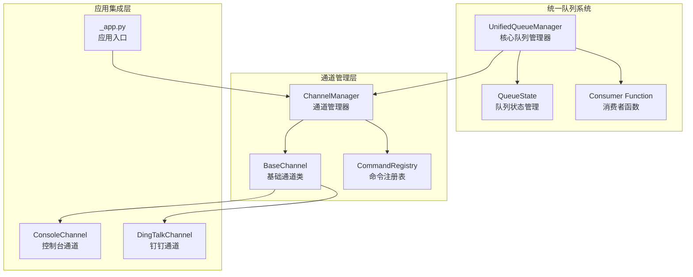
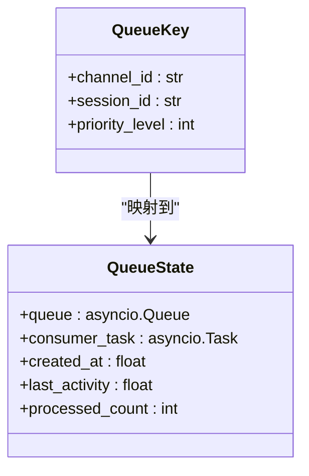
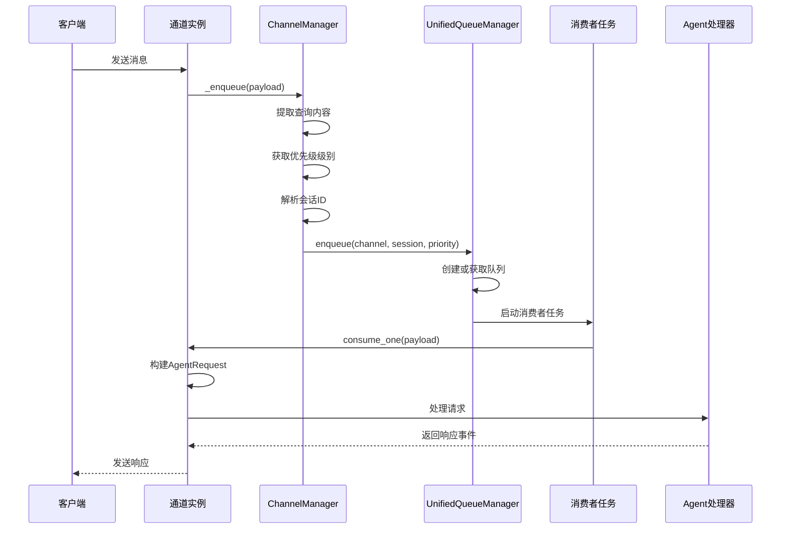
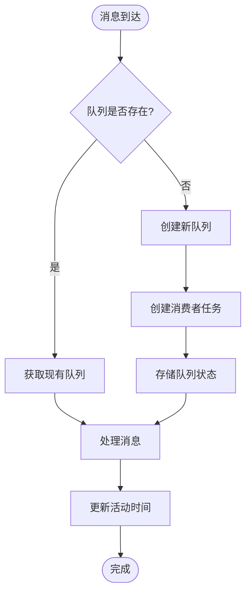
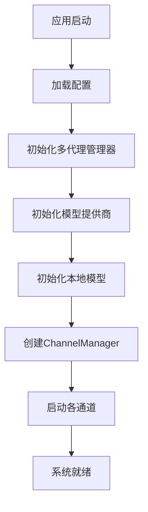
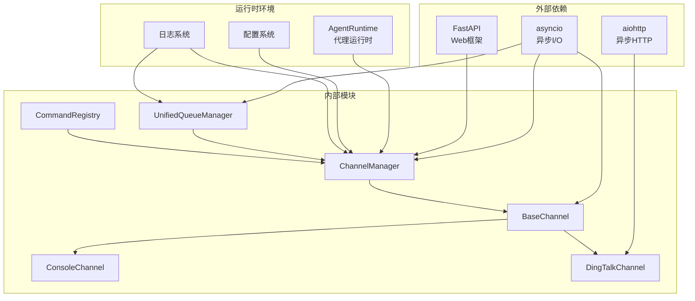

# 统一队列系统

<cite>
**本文档引用的文件**
- [unified_queue_manager.py](file://src/copaw/app/channels/unified_queue_manager.py)
- [manager.py](file://src/copaw/app/channels/manager.py)
- [base.py](file://src/copaw/app/channels/base.py)
- [command_registry.py](file://src/copaw/app/channels/command_registry.py)
- [_app.py](file://src/copaw/app/_app.py)
- [channel.py](file://src/copaw/app/channels/console/channel.py)
- [channel.py](file://src/copaw/app/channels/dingtalk/channel.py)
</cite>

## 目录
1. [简介](#简介)
2. [项目结构](#项目结构)
3. [核心组件](#核心组件)
4. [架构概览](#架构概览)
5. [详细组件分析](#详细组件分析)
6. [依赖关系分析](#依赖关系分析)
7. [性能考虑](#性能考虑)
8. [故障排除指南](#故障排除指南)
9. [结论](#结论)

## 简介

统一队列系统是 CoPaw 智能代理平台的核心基础设施，负责管理多通道、多会话、多优先级的消息处理。该系统采用先进的异步队列架构，实现了以下关键特性：

- **动态消费者创建**：按需创建消费者任务，无需固定工作池
- **会话隔离**：每个会话拥有独立的处理队列
- **优先级调度**：支持 0-100 的灵活优先级级别
- **自动清理机制**：空闲队列自动回收资源
- **并发控制**：不同会话和优先级可并行处理

该系统为 CoPaw 支持的多种通信渠道（如 DingTalk、Feishu、QQ、Discord、iMessage 等）提供了统一的消息处理框架。

## 项目结构

统一队列系统主要分布在以下模块中：

**图表来源**
- [unified_queue_manager.py:1-498](file://src/copaw/app/channels/unified_queue_manager.py#L1-L498)
- [manager.py:1-711](file://src/copaw/app/channels/manager.py#L1-L711)
- [_app.py:1-441](file://src/copaw/app/_app.py#L1-L441)

**章节来源**
- [unified_queue_manager.py:1-498](file://src/copaw/app/channels/unified_queue_manager.py#L1-L498)
- [manager.py:1-711](file://src/copaw/app/channels/manager.py#L1-L711)
- [_app.py:156-268](file://src/copaw/app/_app.py#L156-L268)

## 核心组件

### UnifiedQueueManager 核心队列管理器

UnifiedQueueManager 是整个系统的核心，负责管理所有通道的队列和消费者任务。

**关键特性：**
- **动态队列创建**：根据 QueueKey 自动创建队列
- **消费者生命周期管理**：自动启动和停止消费者任务
- **资源清理**：空闲队列自动回收内存和 CPU 资源
- **监控指标**：提供详细的队列统计信息

**队列键设计：**

**图表来源**
- [unified_queue_manager.py:31-58](file://src/copaw/app/channels/unified_queue_manager.py#L31-L58)

**章节来源**
- [unified_queue_manager.py:60-118](file://src/copaw/app/channels/unified_queue_manager.py#L60-L118)

### ChannelManager 通道管理器

ChannelManager 作为统一的入口点，协调各个通道与队列系统的交互。

**主要职责：**
- **消息路由**：根据查询内容确定消息优先级
- **会话管理**：提取和标准化会话标识符
- **批量处理**：合并同一会话的多个消息
- **生命周期管理**：启动和停止所有通道

**章节来源**
- [manager.py:68-114](file://src/copaw/app/channels/manager.py#L68-L114)

### BaseChannel 基础通道类

BaseChannel 定义了所有具体通道的通用接口和行为规范。

**核心功能：**
- **消息转换**：将原生消息格式转换为 AgentRequest
- **时间去抖动**：合并连续的文本消息
- **权限控制**：支持私聊和群聊的不同策略
- **渲染器**：统一消息内容的渲染和过滤

**章节来源**
- [base.py:70-127](file://src/copaw/app/channels/base.py#L70-L127)

## 架构概览

统一队列系统采用分层架构设计，确保高内聚低耦合：

**图表来源**
- [manager.py:255-301](file://src/copaw/app/channels/manager.py#L255-L301)
- [unified_queue_manager.py:119-164](file://src/copaw/app/channels/unified_queue_manager.py#L119-L164)

## 详细组件分析

### 队列管理系统

#### 动态队列创建机制

**图表来源**
- [unified_queue_manager.py:165-213](file://src/copaw/app/channels/unified_queue_manager.py#L165-L213)

#### 优先级调度系统

CommandRegistry 实现了灵活的优先级调度机制：

**预定义优先级：**
- **0 (critical)**：紧急控制命令（/stop, /kill）
- **10 (high)**：高优先级查询（/status, /pause）
- **20 (normal)**：普通消息（默认级别）
- **30 (low)**：批处理任务

**章节来源**
- [command_registry.py:23-62](file://src/copaw/app/channels/command_registry.py#L23-L62)

### 通道集成机制

#### 控制台通道集成

ConsoleChannel 展示了如何集成到统一队列系统：

**关键集成点：**
- **会话ID解析**：支持显式元数据中的 session_id
- **媒体文件处理**：本地路径解析和文件上传支持
- **输出格式化**：ANSI 颜色编码和时间戳

**章节来源**
- [channel.py:192-204](file://src/copaw/app/channels/console/channel.py#L192-L204)

#### 钉钉通道集成

DingTalkChannel 展示了复杂通道的集成方式：

**高级特性：**
- **AI卡片支持**：实时流式响应和卡片状态管理
- **会话Webhook**：持久化的消息回执机制
- **访问令牌缓存**：优化 API 调用性能
- **去重机制**：防止重复消息处理

**章节来源**
- [channel.py:264-275](file://src/copaw/app/channels/dingtalk/channel.py#L264-L275)

### 应用生命周期管理

#### 启动流程

**图表来源**
- [_app.py:156-240](file://src/copaw/app/_app.py#L156-L240)

**章节来源**
- [_app.py:228-235](file://src/copaw/app/_app.py#L228-L235)

## 依赖关系分析

统一队列系统的依赖关系清晰且层次分明：

**图表来源**
- [unified_queue_manager.py:22-28](file://src/copaw/app/channels/unified_queue_manager.py#L22-L28)
- [manager.py:8-29](file://src/copaw/app/channels/manager.py#L8-L29)

**章节来源**
- [base.py:9-46](file://src/copaw/app/channels/base.py#L9-L46)

## 性能考虑

### 内存管理优化

统一队列系统采用了多项内存优化策略：

**队列大小限制：**
- 默认队列容量：1000 个消息
- 可配置的最大容量：支持 0（无限制）到任意正整数
- 队列满时的超时保护：30 秒等待超时

**资源回收机制：**
- 空闲超时：10 分钟后自动清理空队列
- 清理间隔：每分钟检查一次
- 并发安全：使用 asyncio.Lock 保证线程安全

### 并发控制策略

**会话级并发：**
- 不同会话可以并行处理
- 同一会话内的消息严格序列化
- 优先级相同的队列按 FIFO 处理

**消费者管理：**
- 按需创建消费者任务
- 自动停止空闲的消费者
- 支持动态扩缩容

## 故障排除指南

### 常见问题诊断

**队列积压问题：**
1. 检查消费者任务是否正常运行
2. 查看队列长度和处理速率
3. 分析是否有异常消息导致处理失败

**内存泄漏排查：**
1. 监控队列数量增长趋势
2. 检查空闲队列清理是否正常
3. 验证队列状态统计信息

**性能瓶颈定位：**
1. 分析处理延迟分布
2. 检查网络 I/O 瓶颈
3. 评估模型调用性能

### 日志分析要点

**关键日志类型：**
- **队列操作日志**：队列创建、销毁、清理
- **消费者状态日志**：启动、停止、异常
- **消息处理日志**：入队、出队、处理完成
- **错误日志**：异常堆栈和恢复尝试

**章节来源**
- [unified_queue_manager.py:112-117](file://src/copaw/app/channels/unified_queue_manager.py#L112-L117)
- [manager.py:344-347](file://src/copaw/app/channels/manager.py#L344-L347)

## 结论

统一队列系统通过精心设计的架构和实现，成功解决了多通道、多会话、多优先级场景下的消息处理挑战。其核心优势包括：

**技术优势：**
- **弹性扩展**：按需创建资源，避免固定开销
- **强隔离性**：会话和优先级隔离确保稳定性
- **智能清理**：自动回收资源提升长期运行稳定性
- **可观测性**：完善的监控指标支持运维管理

**业务价值：**
- **统一抽象**：简化多通道开发复杂度
- **性能保障**：支持高并发和低延迟处理
- **可靠性**：完善的错误处理和恢复机制
- **可维护性**：清晰的架构层次和模块边界

该系统为 CoPaw 平台提供了坚实的技术基础，支撑着从个人助理到企业级应用的各种使用场景。通过持续的优化和扩展，统一队列系统将继续为智能代理技术的发展提供重要支撑。