# 渠道适配器基类设计

<cite>
**本文档引用的文件**
- [base.py](file://src/copaw/app/channels/base.py)
- [schema.py](file://src/copaw/app/channels/schema.py)
- [renderer.py](file://src/copaw/app/channels/renderer.py)
- [utils.py](file://src/copaw/app/channels/utils.py)
- [manager.py](file://src/copaw/app/channels/manager.py)
- [registry.py](file://src/copaw/app/channels/registry.py)
- [config.py](file://src/copaw/config/config.py)
- [channel.py](file://src/copaw/app/channels/dingtalk/channel.py)
- [channel.py](file://src/copaw/app/channels/telegram/channel.py)
- [channel.py](file://src/copaw/app/channels/console/channel.py)
- [channel.py](file://src/copaw/app/channels/feishu/channel.py)
</cite>

## 目录
1. [简介](#简介)
2. [项目结构](#项目结构)
3. [核心组件](#核心组件)
4. [架构概览](#架构概览)
5. [详细组件分析](#详细组件分析)
6. [依赖关系分析](#依赖关系分析)
7. [性能考虑](#性能考虑)
8. [故障排除指南](#故障排除指南)
9. [结论](#结论)

## 简介

CoPaw的渠道适配器基类设计是一个高度模块化和可扩展的系统，旨在统一不同通信渠道（如微信、钉钉、Telegram、Discord等）的消息处理流程。该设计通过抽象出通用的渠道处理逻辑，使得开发者能够专注于特定渠道的实现细节，同时保持一致的API接口和消息处理流程。

BaseChannel抽象类作为所有渠道适配器的基础，提供了完整的生命周期管理、消息处理、权限控制、去抖动处理等核心功能。该设计支持异步处理、队列管理、会话状态维护，并且具有良好的扩展性，允许自定义渠道类型的集成。

## 项目结构

CoPaw渠道适配器系统采用分层架构设计，主要包含以下核心目录结构：

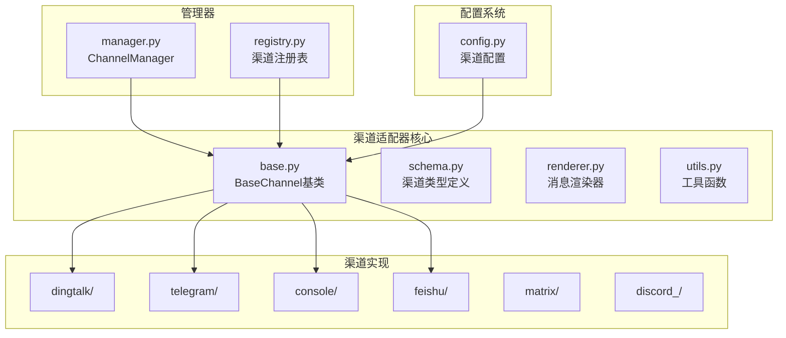

**图表来源**
- [base.py:1-868](file://src/copaw/app/channels/base.py#L1-L868)
- [manager.py:1-580](file://src/copaw/app/channels/manager.py#L1-L580)
- [registry.py:1-138](file://src/copaw/app/channels/registry.py#L1-L138)

**章节来源**
- [base.py:1-868](file://src/copaw/app/channels/base.py#L1-L868)
- [manager.py:1-580](file://src/copaw/app/channels/manager.py#L1-L580)
- [registry.py:1-138](file://src/copaw/app/channels/registry.py#L1-L138)

## 核心组件

### BaseChannel抽象类

BaseChannel是整个渠道适配器系统的核心抽象类，定义了所有渠道适配器必须实现的标准接口和行为规范。

#### 主要特性

1. **统一的消息处理流程**：提供从原始消息到AgentRequest的标准化转换过程
2. **异步处理支持**：完全基于asyncio的异步消息处理架构
3. **会话管理**：内置会话ID解析和状态管理机制
4. **去抖动处理**：智能的消息去抖动和合并机制
5. **权限控制**：灵活的用户权限和群组策略管理
6. **渲染系统**：可插拔的消息内容渲染器

#### 关键接口

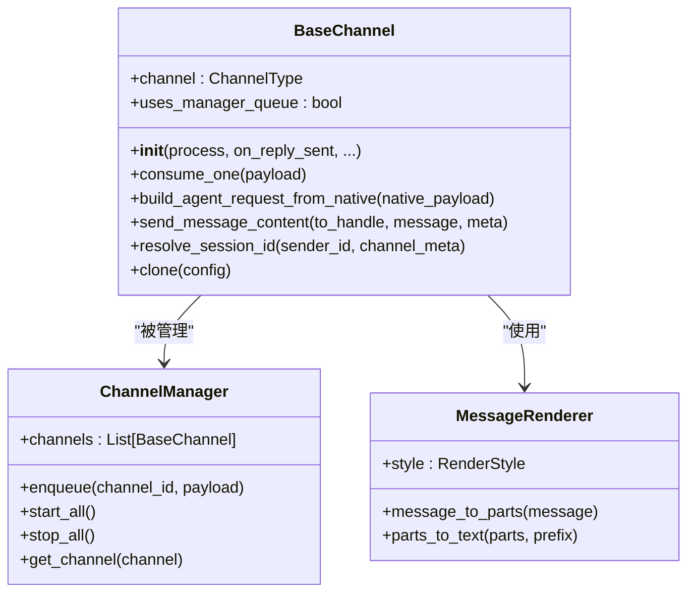

**图表来源**
- [base.py:69-868](file://src/copaw/app/channels/base.py#L69-L868)
- [manager.py:114-580](file://src/copaw/app/channels/manager.py#L114-L580)
- [renderer.py:78-384](file://src/copaw/app/channels/renderer.py#L78-L384)

**章节来源**
- [base.py:69-868](file://src/copaw/app/channels/base.py#L69-L868)

### 消息渲染器系统

MessageRenderer提供了统一的消息内容渲染功能，支持将AgentResponse转换为适合特定渠道的消息格式。

#### 渲染风格控制

渲染器通过RenderStyle类控制消息的显示格式，包括：
- 文本内容的Markdown支持
- 代码块的语法高亮
- 工具调用的详细显示
- 思考过程的过滤选项

#### 内容类型支持

渲染器支持多种内容类型：
- 文本内容（TextContent）
- 图像内容（ImageContent）
- 视频内容（VideoContent）
- 音频内容（AudioContent）
- 文件内容（FileContent）
- 拒绝内容（RefusalContent）

**章节来源**
- [renderer.py:37-384](file://src/copaw/app/channels/renderer.py#L37-L384)

### 渠道类型系统

系统定义了标准的渠道类型标识符，支持内置渠道和自定义渠道的混合使用。

#### 内置渠道类型

```python
BUILTIN_CHANNEL_TYPES = (
    "imessage",    # macOS消息应用
    "discord",     # Discord聊天平台
    "dingtalk",    # 钉钉企业通讯
    "feishu",      # 飞书/多维表格
    "qq",          # QQ聊天
    "telegram",    # Telegram
    "mqtt",        # MQTT消息传输
    "console",     # 控制台输出
    "voice",       # 语音通话
    "xiaoyi",      # 小艺智能助手
)
```

**章节来源**
- [schema.py:30-48](file://src/copaw/app/channels/schema.py#L30-L48)

## 架构概览

CoPaw的渠道适配器系统采用了事件驱动的架构模式，通过ChannelManager统一管理所有渠道实例的生命周期和消息处理。

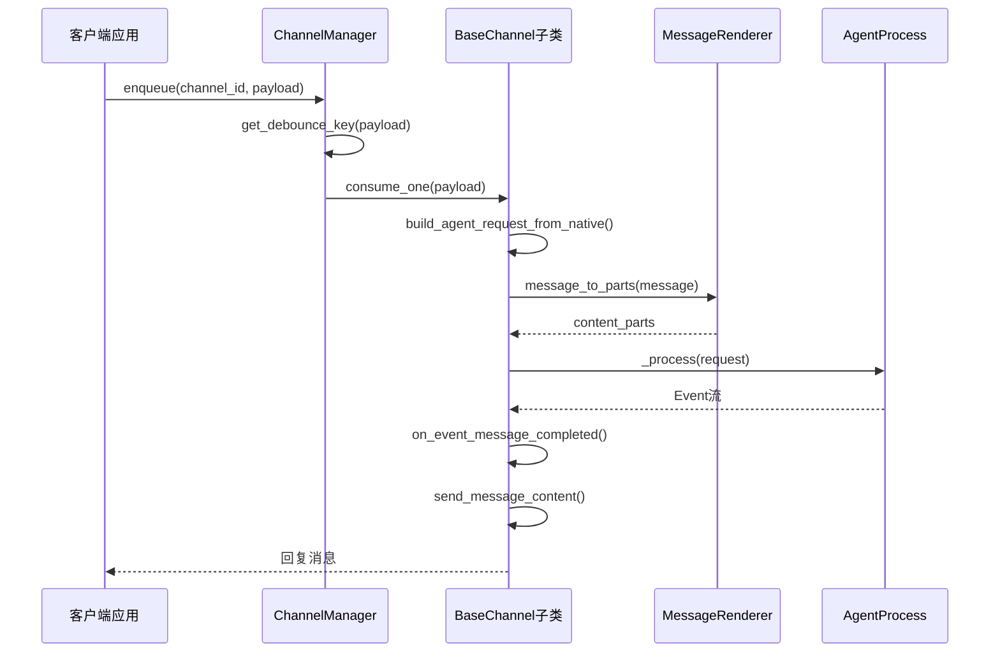

**图表来源**
- [manager.py:322-364](file://src/copaw/app/channels/manager.py#L322-L364)
- [base.py:443-583](file://src/copaw/app/channels/base.py#L443-L583)
- [renderer.py:87-350](file://src/copaw/app/channels/renderer.py#L87-L350)

### 消息处理流水线

系统实现了完整的消息处理流水线，确保消息在不同渠道间的正确传递和格式转换。

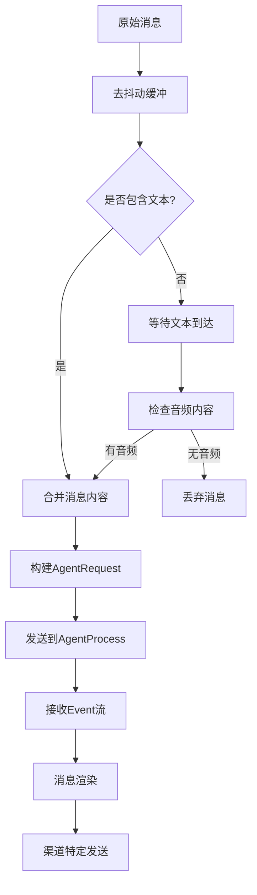

**图表来源**
- [base.py:247-279](file://src/copaw/app/channels/base.py#L247-L279)
- [base.py:404-414](file://src/copaw/app/channels/base.py#L404-L414)

**章节来源**
- [base.py:443-583](file://src/copaw/app/channels/base.py#L443-L583)

## 详细组件分析

### BaseChannel核心功能

#### 会话ID解析机制

BaseChannel实现了灵活的会话ID解析机制，支持不同渠道的会话管理需求：

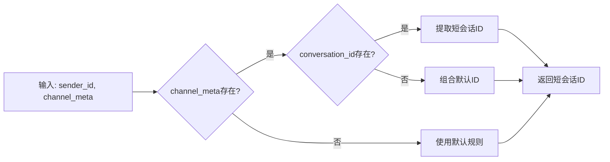

**图表来源**
- [base.py:341-351](file://src/copaw/app/channels/base.py#L341-L351)

#### 去抖动处理机制

系统实现了智能的去抖动处理，特别适用于需要完整输入才能处理的消息场景：

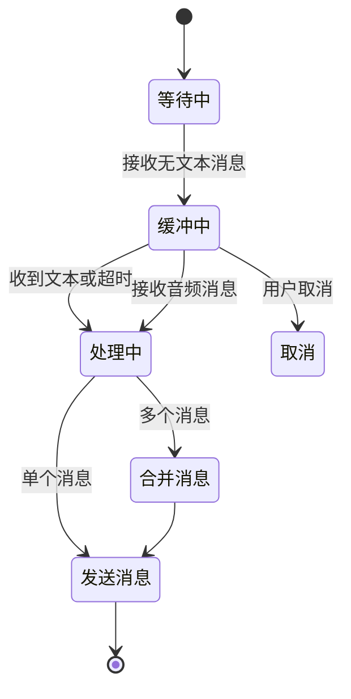

**图表来源**
- [base.py:120-125](file://src/copaw/app/channels/base.py#L120-L125)
- [base.py:247-279](file://src/copaw/app/channels/base.py#L247-L279)

#### 权限控制策略

系统提供了多层次的权限控制机制：

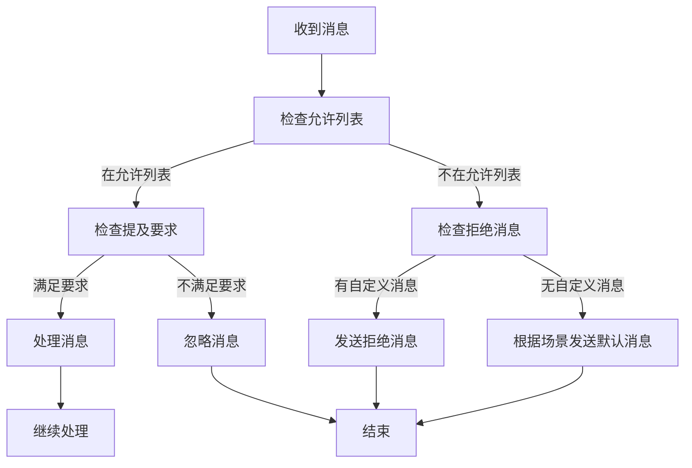

**图表来源**
- [base.py:281-303](file://src/copaw/app/channels/base.py#L281-L303)

**章节来源**
- [base.py:120-303](file://src/copaw/app/channels/base.py#L120-L303)

### ChannelManager管理器

ChannelManager负责管理所有渠道实例的生命周期，包括队列管理、消费者任务调度和渠道替换等功能。

#### 队列管理机制

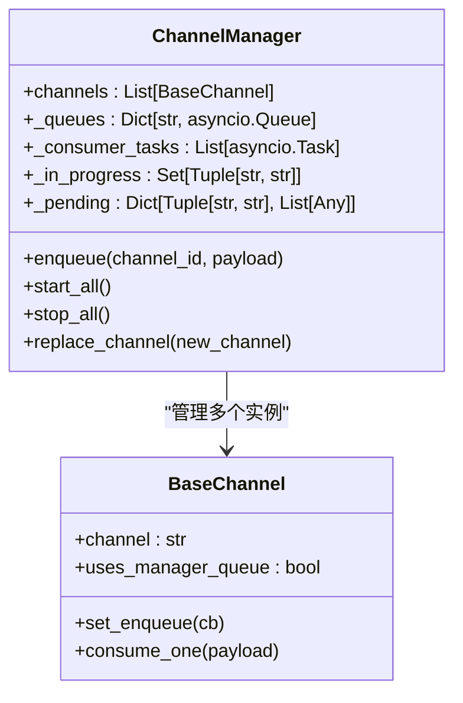

**图表来源**
- [manager.py:114-134](file://src/copaw/app/channels/manager.py#L114-L134)
- [base.py:317-319](file://src/copaw/app/channels/base.py#L317-L319)

#### 批处理优化

ChannelManager实现了智能的批处理优化，通过会话级别的消息合并减少处理开销：

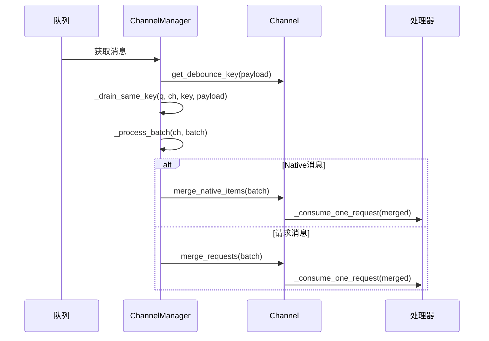

**图表来源**
- [manager.py:42-92](file://src/copaw/app/channels/manager.py#L42-L92)

**章节来源**
- [manager.py:114-580](file://src/copaw/app/channels/manager.py#L114-L580)

### 具体渠道实现示例

#### 钉钉渠道实现

钉钉渠道实现了复杂的消息处理逻辑，包括会话Webhook存储、AI卡片管理和媒体文件上传等功能。

##### 会话Webhook管理

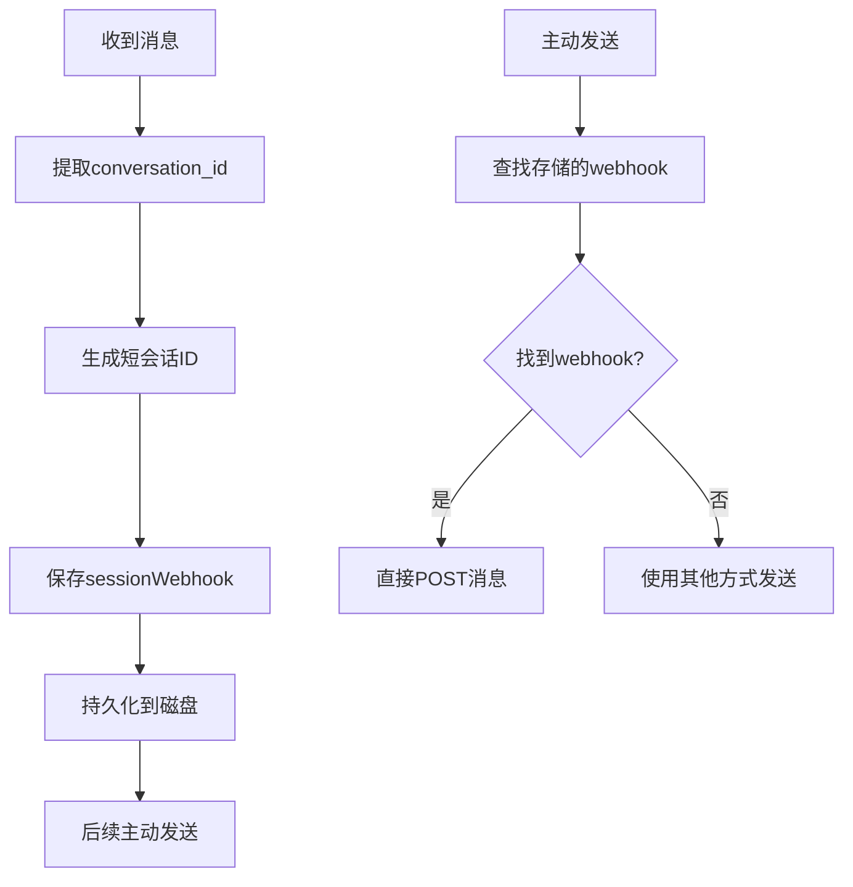

**图表来源**
- [channel.py:262-273](file://src/copaw/app/channels/dingtalk/channel.py#L262-L273)
- [channel.py:369-421](file://src/copaw/app/channels/dingtalk/channel.py#L369-L421)

##### AI卡片处理

钉钉渠道支持AI卡片的动态更新，实现了复杂的交互式消息处理：

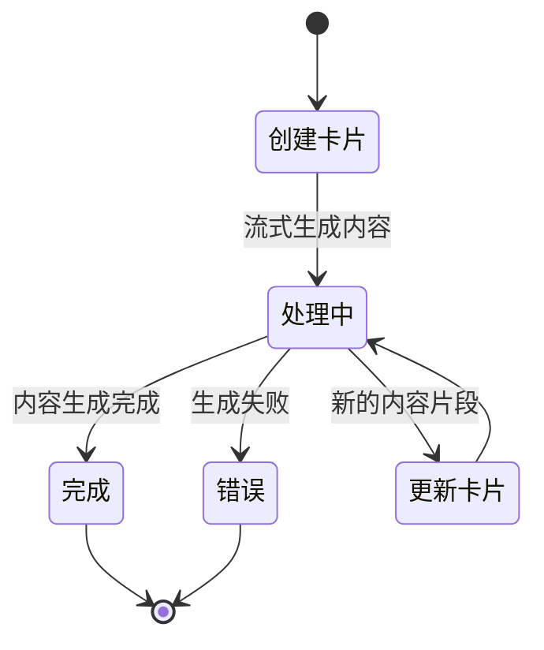

**图表来源**
- [channel.py:699-782](file://src/copaw/app/channels/dingtalk/channel.py#L699-L782)

#### Telegram渠道实现

Telegram渠道实现了轮询机制的消息接收和发送功能，支持多媒体内容的处理。

##### 多媒体文件处理

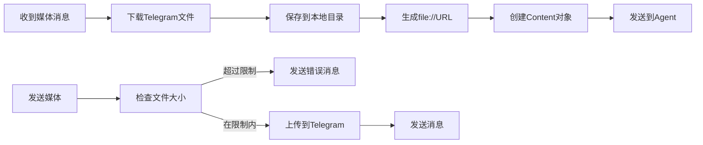

**图表来源**
- [channel.py:78-138](file://src/copaw/app/channels/telegram/channel.py#L78-L138)
- [channel.py:652-768](file://src/copaw/app/channels/telegram/channel.py#L652-L768)

#### 控制台渠道实现

控制台渠道提供了最简单的消息输出方式，主要用于调试和开发测试。

##### 文本渲染优化

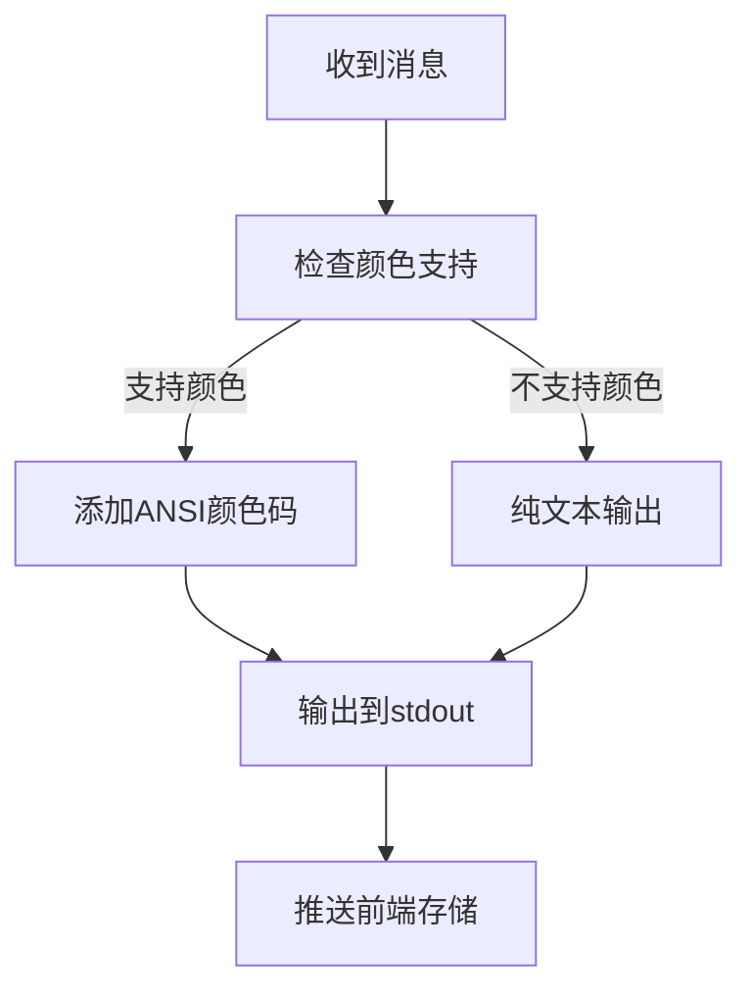

**图表来源**
- [channel.py:40-51](file://src/copaw/app/channels/console/channel.py#L40-L51)
- [channel.py:397-427](file://src/copaw/app/channels/console/channel.py#L397-L427)

**章节来源**
- [channel.py:81-800](file://src/copaw/app/channels/dingtalk/channel.py#L81-L800)
- [channel.py:264-800](file://src/copaw/app/channels/telegram/channel.py#L264-L800)
- [channel.py:57-506](file://src/copaw/app/channels/console/channel.py#L57-L506)

## 依赖关系分析

CoPaw渠道适配器系统的依赖关系相对清晰，遵循了单一职责原则和依赖倒置原则。

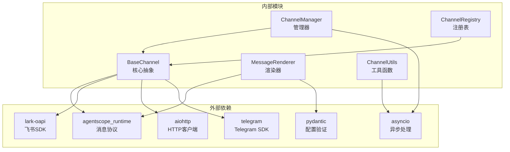

**图表来源**
- [base.py:23-37](file://src/copaw/app/channels/base.py#L23-L37)
- [manager.py:23-25](file://src/copaw/app/channels/manager.py#L23-L25)
- [registry.py:11-12](file://src/copaw/app/channels/registry.py#L11-L12)

### 渠道注册表系统

ChannelRegistry实现了动态渠道发现和加载机制，支持内置渠道和自定义渠道的混合使用。

#### 渠道发现流程

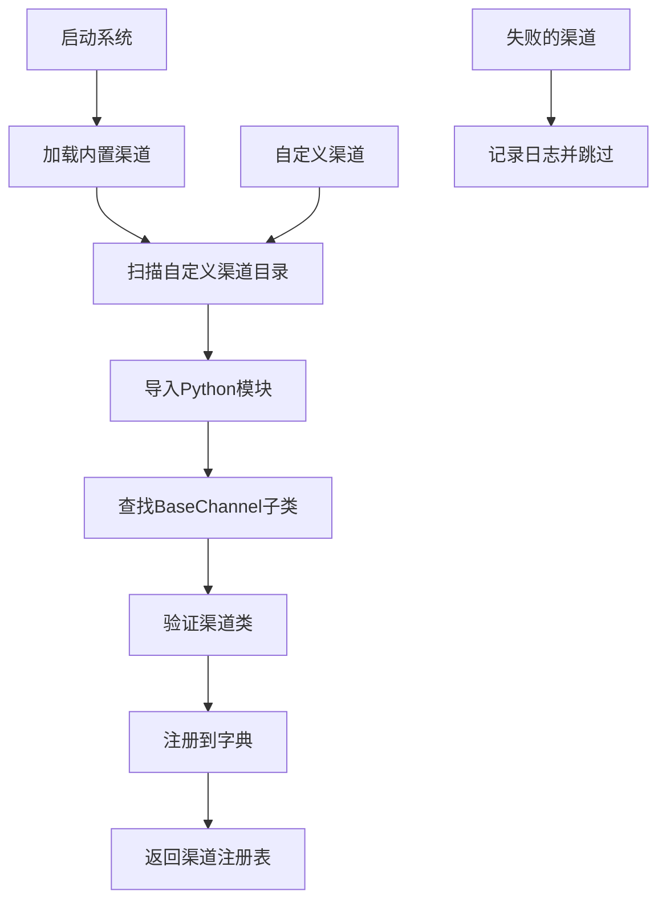

**图表来源**
- [registry.py:95-127](file://src/copaw/app/channels/registry.py#L95-L127)

**章节来源**
- [registry.py:19-138](file://src/copaw/app/channels/registry.py#L19-L138)

## 性能考虑

### 异步处理优化

系统采用完全异步的处理模型，通过asyncio实现高效的并发处理能力。每个渠道实例都运行在独立的事件循环中，避免了阻塞操作对整体性能的影响。

### 内存管理策略

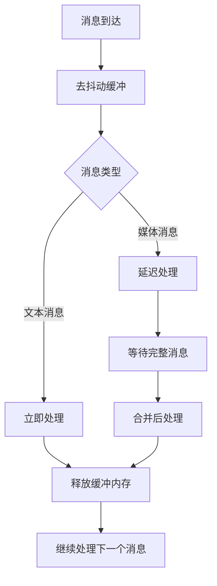

### 缓存机制

系统实现了多层缓存机制来提高性能：

1. **渠道实例缓存**：避免重复创建渠道实例
2. **会话状态缓存**：存储会话相关的元数据
3. **媒体文件缓存**：避免重复下载和上传文件
4. **渲染结果缓存**：缓存常用的消息格式化结果

## 故障排除指南

### 常见问题诊断

#### 渠道初始化失败

当渠道初始化失败时，系统会记录详细的错误信息并跳过该渠道的启用。常见原因包括：
- 缺少必需的配置参数
- 第三方API密钥无效
- 网络连接问题
- 权限不足

#### 消息处理异常

消息处理异常通常表现为：
- 消息丢失或重复
- 渲染格式错误
- 渠道API调用失败
- 超时或网络中断

#### 性能问题

性能问题的识别和解决：
- 队列积压导致的延迟
- 内存使用过高
- 并发处理瓶颈
- 网络带宽限制

**章节来源**
- [manager.py:356-364](file://src/copaw/app/channels/manager.py#L356-L364)
- [base.py:576-583](file://src/copaw/app/channels/base.py#L576-L583)

### 调试技巧

1. **启用详细日志**：设置日志级别为DEBUG以获取详细的处理流程信息
2. **监控队列状态**：观察队列长度和处理速度
3. **检查渠道状态**：确认各渠道的连接状态和可用性
4. **分析性能指标**：监控响应时间和吞吐量

## 结论

CoPaw渠道适配器基类设计展现了优秀的软件工程实践，通过抽象化、模块化和异步化的设计理念，成功地解决了多渠道消息处理的复杂性问题。

### 设计优势

1. **高度可扩展性**：通过抽象类和工厂模式支持新渠道的快速集成
2. **统一的API接口**：所有渠道都遵循相同的消息处理流程
3. **强大的去抖动机制**：有效处理不完整消息的场景
4. **灵活的权限控制**：支持多种权限策略的组合使用
5. **完善的错误处理**：提供全面的异常处理和恢复机制

### 技术创新点

1. **会话级去抖动**：基于会话ID的智能消息合并机制
2. **动态渠道注册**：支持运行时渠道的动态发现和加载
3. **多层渲染系统**：可插拔的消息内容渲染器
4. **智能批处理**：基于会话的批量消息处理优化

### 应用实践建议

1. **合理配置去抖动参数**：根据渠道特性和业务需求调整去抖动时间
2. **优化权限策略**：结合业务场景设计合适的权限控制方案
3. **监控渠道健康状态**：建立完善的监控和告警机制
4. **定期性能评估**：持续评估和优化渠道处理性能

该设计为构建高性能、可扩展的多渠道消息处理系统提供了坚实的基础，是现代聊天机器人和AI助手平台的理想选择。