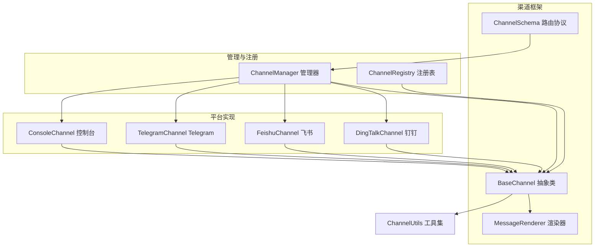
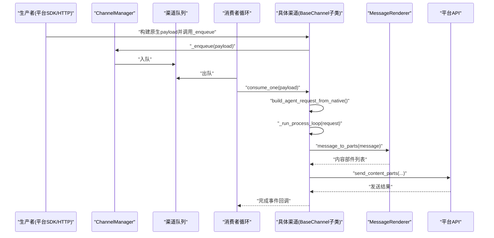
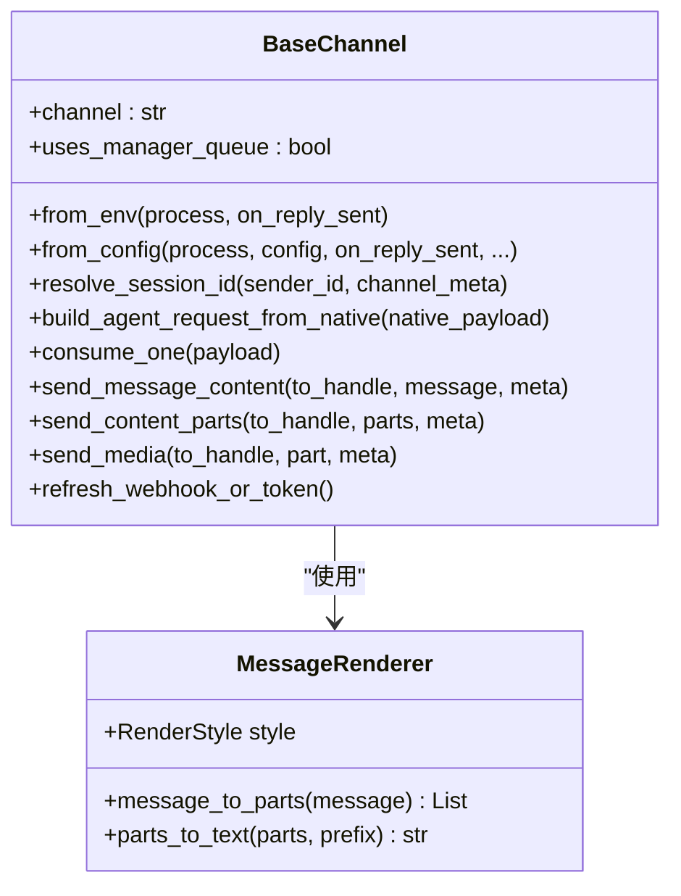
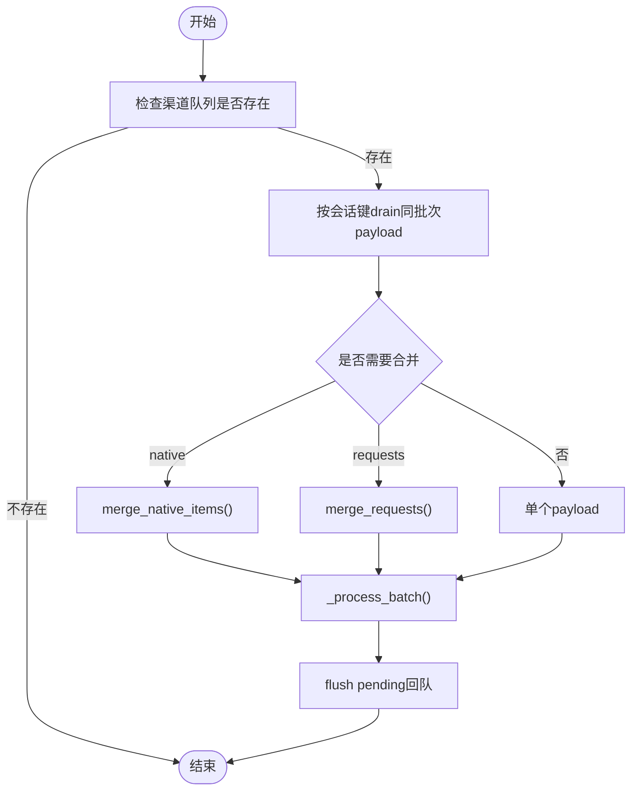
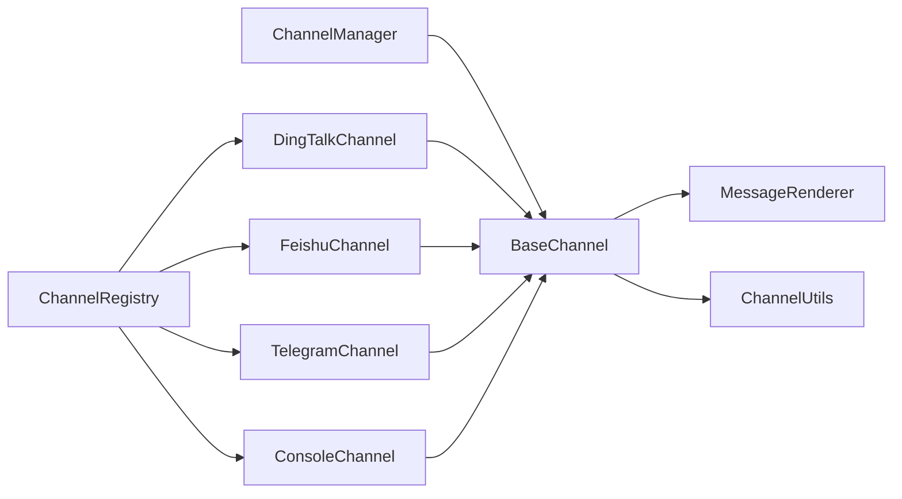

# 渠道适配器系统

<cite>
**本文档引用的文件**
- [src/copaw/app/channels/base.py](file://src/copaw/app/channels/base.py)
- [src/copaw/app/channels/manager.py](file://src/copaw/app/channels/manager.py)
- [src/copaw/app/channels/registry.py](file://src/copaw/app/channels/registry.py)
- [src/copaw/app/channels/schema.py](file://src/copaw/app/channels/schema.py)
- [src/copaw/app/channels/renderer.py](file://src/copaw/app/channels/renderer.py)
- [src/copaw/app/channels/utils.py](file://src/copaw/app/channels/utils.py)
- [src/copaw/app/channels/dingtalk/channel.py](file://src/copaw/app/channels/dingtalk/channel.py)
- [src/copaw/app/channels/feishu/channel.py](file://src/copaw/app/channels/feishu/channel.py)
- [src/copaw/app/channels/telegram/channel.py](file://src/copaw/app/channels/telegram/channel.py)
- [src/copaw/app/channels/console/channel.py](file://src/copaw/app/channels/console/channel.py)
</cite>

## 目录
1. [简介](#简介)
2. [项目结构](#项目结构)
3. [核心组件](#核心组件)
4. [架构总览](#架构总览)
5. [详细组件分析](#详细组件分析)
6. [依赖关系分析](#依赖关系分析)
7. [性能考量](#性能考量)
8. [故障排查指南](#故障排查指南)
9. [结论](#结论)
10. [附录](#附录)

## 简介
本文件面向CoPaw渠道适配器系统，系统性阐述渠道适配器基类设计模式、多平台消息处理机制、消息队列管理策略、会话状态维护与渲染器机制。文档覆盖BaseChannel抽象类的设计理念、各平台渠道（如钉钉、飞书、Telegram、Console）的具体实现差异、消息格式转换与渲染、错误处理与重试策略，并提供新渠道适配器的开发流程示例、消息路由机制与状态同步方法，以及渠道认证、API限制与性能优化等实际部署考虑。

## 项目结构
渠道适配器位于src/copaw/app/channels目录下，采用“基类 + 多平台子类 + 管理器 + 注册表”的分层组织方式：
- 基类与通用能力：base.py（抽象接口、消息合并、去抖动、渲染器集成）、renderer.py（消息到内容部件的渲染）
- 管理与编排：manager.py（队列、消费者循环、批量合并、生命周期管理）、registry.py（内置与自定义渠道注册）
- 平台实现：dingtalk、feishu、telegram、console等子模块
- 通道协议与路由：schema.py（通道类型、路由地址模型）

图表来源
- [src/copaw/app/channels/base.py:69-868](file://src/copaw/app/channels/base.py#L69-L868)
- [src/copaw/app/channels/manager.py:114-580](file://src/copaw/app/channels/manager.py#L114-L580)
- [src/copaw/app/channels/registry.py:19-138](file://src/copaw/app/channels/registry.py#L19-L138)
- [src/copaw/app/channels/renderer.py:78-384](file://src/copaw/app/channels/renderer.py#L78-L384)
- [src/copaw/app/channels/schema.py:12-71](file://src/copaw/app/channels/schema.py#L12-L71)

章节来源
- [src/copaw/app/channels/base.py:69-868](file://src/copaw/app/channels/base.py#L69-L868)
- [src/copaw/app/channels/manager.py:114-580](file://src/copaw/app/channels/manager.py#L114-L580)
- [src/copaw/app/channels/registry.py:19-138](file://src/copaw/app/channels/registry.py#L19-L138)
- [src/copaw/app/channels/renderer.py:78-384](file://src/copaw/app/channels/renderer.py#L78-L384)
- [src/copaw/app/channels/schema.py:12-71](file://src/copaw/app/channels/schema.py#L12-L71)

## 核心组件
- BaseChannel：统一的渠道抽象，定义消息入队、请求构建、事件处理、发送与错误处理流程；支持时间去抖动、同会话合并、渲染器输出、会话ID解析等通用能力。
- ChannelManager：负责为每个启用的渠道创建队列与消费者任务，按会话键合并批量消息，调用渠道的consume_one或其内部处理逻辑。
- MessageRenderer：将运行时消息对象转换为可发送的内容部件集合，支持工具调用/输出、思维块、媒体资源等的样式化渲染。
- ChannelRegistry：内置渠道映射与自定义渠道发现，提供懒加载与缓存。
- ChannelSchema：通道类型标识、路由地址模型与消息转换协议。

章节来源
- [src/copaw/app/channels/base.py:69-868](file://src/copaw/app/channels/base.py#L69-L868)
- [src/copaw/app/channels/manager.py:114-580](file://src/copaw/app/channels/manager.py#L114-L580)
- [src/copaw/app/channels/renderer.py:78-384](file://src/copaw/app/channels/renderer.py#L78-L384)
- [src/copaw/app/channels/registry.py:19-138](file://src/copaw/app/channels/registry.py#L19-L138)
- [src/copaw/app/channels/schema.py:12-71](file://src/copaw/app/channels/schema.py#L12-L71)

## 架构总览
渠道适配器采用“生产者-队列-消费者-渠道”的解耦架构：
- 生产者通过渠道实例的_enqueue回调将原生消息封装为payload入队
- ChannelManager按会话键从队列中提取同一批次payload，进行native或request合并
- 消费者循环调用渠道的consume_one或其内部处理逻辑，执行AgentRequest并逐条发送完成的消息
- 渠道使用MessageRenderer将运行时消息转换为平台可读的内容部件，再调用平台API发送

图表来源
- [src/copaw/app/channels/base.py:443-583](file://src/copaw/app/channels/base.py#L443-L583)
- [src/copaw/app/channels/manager.py:322-364](file://src/copaw/app/channels/manager.py#L322-L364)
- [src/copaw/app/channels/renderer.py:87-350](file://src/copaw/app/channels/renderer.py#L87-L350)

章节来源
- [src/copaw/app/channels/base.py:443-583](file://src/copaw/app/channels/base.py#L443-L583)
- [src/copaw/app/channels/manager.py:322-364](file://src/copaw/app/channels/manager.py#L322-L364)
- [src/copaw/app/channels/renderer.py:87-350](file://src/copaw/app/channels/renderer.py#L87-L350)

## 详细组件分析

### BaseChannel 抽象类设计
- 统一接口：from_env/from_config构造、resolve_session_id会话解析、build_agent_request_from_native原生转请求、consume_one统一消费入口
- 去抖动与合并：对native payload按会话键进行时间去抖动与内容合并，避免部分输入导致的重复/错序
- 渲染与发送：通过MessageRenderer将消息转换为内容部件，再按平台能力发送文本/媒体
- 错误处理：在消费失败或响应错误时，统一走_on_consume_error回调，确保用户可见的错误提示
- 生命周期：支持refresh_webhook_or_token刷新令牌/钩子，便于长连接/轮询渠道

图表来源
- [src/copaw/app/channels/base.py:69-868](file://src/copaw/app/channels/base.py#L69-L868)
- [src/copaw/app/channels/renderer.py:78-384](file://src/copaw/app/channels/renderer.py#L78-L384)

章节来源
- [src/copaw/app/channels/base.py:69-868](file://src/copaw/app/channels/base.py#L69-L868)
- [src/copaw/app/channels/renderer.py:78-384](file://src/copaw/app/channels/renderer.py#L78-L384)

### ChannelManager 消息队列与批处理
- 队列与消费者：为每个启用渠道创建异步队列与固定数量的消费者任务，保证同一会话内的消息顺序与合并
- 批量合并：根据渠道类型与payload特性，合并多个native或AgentRequest，减少重复处理
- 会话锁与去重：使用_key_lock确保同会话不被并发拆分，避免去抖动与合并过程中的竞态
- 替换与停止：支持动态替换渠道实例，保证平滑迁移

图表来源
- [src/copaw/app/channels/manager.py:42-112](file://src/copaw/app/channels/manager.py#L42-L112)
- [src/copaw/app/channels/manager.py:65-92](file://src/copaw/app/channels/manager.py#L65-L92)

章节来源
- [src/copaw/app/channels/manager.py:114-580](file://src/copaw/app/channels/manager.py#L114-L580)
- [src/copaw/app/channels/manager.py:42-112](file://src/copaw/app/channels/manager.py#L42-L112)

### 渲染器 MessageRenderer
- 支持多种消息类型：文本、图像、音频、视频、文件、拒绝、工具调用/输出、思维块等
- 可插拔样式：通过RenderStyle控制Markdown、代码围栏、Emoji、过滤工具消息/思维块等
- 内部工具屏蔽：对内部工具生成的媒体部件进行过滤，避免泄露给最终用户

章节来源
- [src/copaw/app/channels/renderer.py:78-384](file://src/copaw/app/channels/renderer.py#L78-L384)

### 平台实现差异

#### 钉钉渠道 DingTalkChannel
- 特点：长连接回调+会话Webhook，支持AI卡片流式与多消息发送；禁用时间去抖动，由管理器合并后直接处理
- 会话Webhook存储：内存+磁盘持久化，支持重启后恢复；to_handle基于短会话ID
- 去重与批处理：基于消息ID去重，支持早期ACK与批量回复Future
- 媒体上传：通过Open API上传图片/视频/音频/文件，返回media_id
- 令牌管理：实例级令牌缓存与过期刷新

章节来源
- [src/copaw/app/channels/dingtalk/channel.py:81-800](file://src/copaw/app/channels/dingtalk/channel.py#L81-L800)

#### 飞书渠道 FeishuChannel
- 特点：WebSocket接收+Open API发送；支持文本、图片、文件、音视频等；记录chat_id/message_id用于去重
- 会话ID：群聊使用chat_id短ID，私聊使用open_id短ID；保存receive_id与receive_id_type
- 媒体下载：从post/资源中提取图片/文件/音视频键，下载到本地媒体目录
- 昵称缓存：通过Contact API获取用户昵称，限制缓存大小

章节来源
- [src/copaw/app/channels/feishu/channel.py:150-800](file://src/copaw/app/channels/feishu/channel.py#L150-L800)

#### Telegram渠道 TelegramChannel
- 特点：Bot API轮询；支持Markdown转HTML、媒体分片发送、超大文件错误处理
- 文本分片：超过长度限制自动切分为多段，尽量按行/空格断句
- 媒体限制：对50MB上传限制、限速、网络错误等进行捕获与友好提示
- 输入去抖：媒体为主的Telegram消息无需等待文本即可处理

章节来源
- [src/copaw/app/channels/telegram/channel.py:264-800](file://src/copaw/app/channels/telegram/channel.py#L264-L800)

#### 控制台渠道 ConsoleChannel
- 特点：轻量输出通道，将消息打印到终端；支持过滤工具详情/思维块
- 上传引用解析：将相对路径解析为工作空间媒体目录下的绝对路径
- SSE流：支持stream_one按事件流式输出

章节来源
- [src/copaw/app/channels/console/channel.py:57-506](file://src/copaw/app/channels/console/channel.py#L57-L506)

### 消息格式转换与路由
- 原生到请求：渠道实现build_agent_request_from_native，将平台原生payload转换为AgentRequest（含会话ID、用户ID、内容部件、元数据）
- 请求到内容：BaseChannel使用MessageRenderer将运行时消息转换为内容部件，再由渠道选择send_content_parts或send_media发送
- 路由模型：ChannelAddress统一路由，to_handle由渠道决定（如feishu:sw:短会话ID、dingtalk:sw:会话ID、chat_id等）

章节来源
- [src/copaw/app/channels/base.py:388-403](file://src/copaw/app/channels/base.py#L388-L403)
- [src/copaw/app/channels/base.py:663-698](file://src/copaw/app/channels/base.py#L663-L698)
- [src/copaw/app/channels/schema.py:12-71](file://src/copaw/app/channels/schema.py#L12-L71)

### 错误处理与重试策略
- 消费异常：consume_one捕获异常并调用_on_consume_error，向用户发送可读错误信息
- 响应错误：从最后一条响应事件中提取error字段，统一呈现
- 平台特定：钉钉/飞书/Telegram分别对API错误、限流、网络异常进行捕获与降级处理
- 重试建议：对于临时性错误（网络、限流），建议在上层应用或平台侧进行指数退避重试

章节来源
- [src/copaw/app/channels/base.py:584-647](file://src/copaw/app/channels/base.py#L584-L647)
- [src/copaw/app/channels/dingtalk/channel.py:601-673](file://src/copaw/app/channels/dingtalk/channel.py#L601-L673)
- [src/copaw/app/channels/telegram/channel.py:769-768](file://src/copaw/app/channels/telegram/channel.py#L769-L768)

### 新渠道适配器开发流程示例
- 步骤
  1) 继承BaseChannel，实现from_env/from_config、resolve_session_id、build_agent_request_from_native
  2) 实现send_content_parts/send_media（如需发送媒体）
  3) 在registry.py中注册或放置于自定义渠道目录
  4) 使用ChannelManager.from_env/from_config注入统一process与回调
  5) 通过_enqueue将原生payload入队，等待消费者循环处理
- 示例要点
  - 保持channel_id唯一且与配置一致
  - 元数据meta中保留必要字段（如会话Webhook、消息ID、聊天类型等）
  - 对平台API错误进行分类处理与用户提示

章节来源
- [src/copaw/app/channels/base.py:317-403](file://src/copaw/app/channels/base.py#L317-L403)
- [src/copaw/app/channels/registry.py:95-138](file://src/copaw/app/channels/registry.py#L95-L138)
- [website/public/docs/channels.en.md:814-902](file://website/public/docs/channels.en.md#L814-L902)

## 依赖关系分析
- 组件耦合
  - BaseChannel与MessageRenderer弱耦合：通过渲染器接口转换消息，便于扩展不同渲染风格
  - ChannelManager与BaseChannel强绑定：通过set_enqueue注入回调，统一调度与批处理
  - 各平台渠道对BaseChannel高度复用：仅实现原生到请求与发送细节
- 外部依赖
  - 钉钉：dingtalk_stream、aiohttp
  - 飞书：lark-oapi（可选依赖）
  - Telegram：python-telegram-bot
  - Console：标准库与终端输出

图表来源
- [src/copaw/app/channels/manager.py:114-580](file://src/copaw/app/channels/manager.py#L114-L580)
- [src/copaw/app/channels/base.py:69-868](file://src/copaw/app/channels/base.py#L69-L868)
- [src/copaw/app/channels/registry.py:19-138](file://src/copaw/app/channels/registry.py#L19-L138)

章节来源
- [src/copaw/app/channels/manager.py:114-580](file://src/copaw/app/channels/manager.py#L114-L580)
- [src/copaw/app/channels/base.py:69-868](file://src/copaw/app/channels/base.py#L69-L868)
- [src/copaw/app/channels/registry.py:19-138](file://src/copaw/app/channels/registry.py#L19-L138)

## 性能考量
- 队列与批处理：每渠道固定消费者数量，按会话键合并减少重复处理；native与request分别合并策略不同
- 时间去抖动：对无文本的输入进行缓冲合并，避免中间态消息影响用户体验
- 渲染与发送：先渲染为内容部件，再按平台能力发送；媒体优先作为URL回退，避免大体积文本传输
- 平台限制：Telegram上传上限、飞书文件大小限制、钉钉会话Webhook有效期等，需在渠道内做适配与提示
- I/O与并发：合理设置队列容量与消费者数量，避免阻塞；对长连接/轮询渠道注意心跳与重连策略

## 故障排查指南
- 常见问题
  - 消息未送达：检查_enqueue回调是否正确注入、队列是否创建、消费者是否启动
  - 会话错乱：确认resolve_session_id与to_handle是否一致，避免跨会话合并
  - 媒体无法显示：核对URL/路径解析、媒体目录权限、平台上传/下载流程
  - 平台限流/错误：查看对应渠道的错误日志与异常分支处理
- 排查步骤
  - 开启调试日志，观察consume_one/_run_process_loop关键节点
  - 核验Meta字段（session_webhook、message_id、chat_id等）
  - 分离渲染与发送环节，定位具体失败阶段

章节来源
- [src/copaw/app/channels/base.py:576-647](file://src/copaw/app/channels/base.py#L576-L647)
- [src/copaw/app/channels/manager.py:322-364](file://src/copaw/app/channels/manager.py#L322-L364)

## 结论
CoPaw渠道适配器系统通过BaseChannel抽象与ChannelManager编排，实现了多平台消息的统一接入与高效处理。借助MessageRenderer的可插拔渲染与严格的会话合并/去抖策略，系统在复杂平台差异下仍能保持一致性与稳定性。开发者可通过继承BaseChannel快速扩展新渠道，结合队列与批处理机制实现高吞吐与低延迟的消息处理。

## 附录
- 渠道认证与配置
  - 钉钉：client_id/client_secret、机器人码、卡片模板参数
  - 飞书：app_id/app_secret、加密密钥、校验令牌、域名选择
  - Telegram：bot_token、代理配置、是否显示打字指示
  - Console：前缀、媒体目录、过滤选项
- API限制与优化建议
  - 平台速率限制：在渠道内实现指数退避与重试
  - 媒体大小限制：提前压缩或分片上传，失败时给出明确提示
  - 会话Webhook有效期：定期刷新与持久化存储