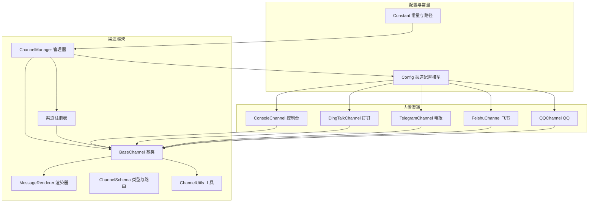
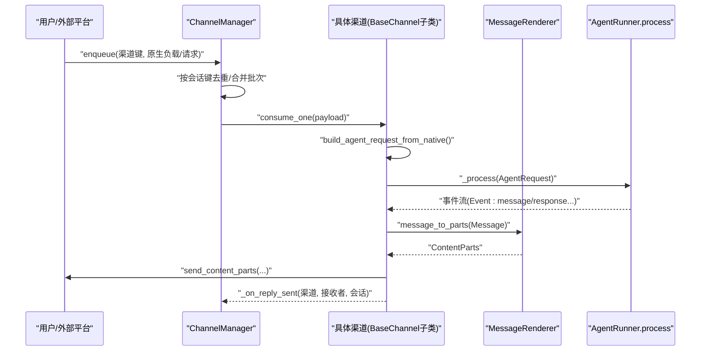
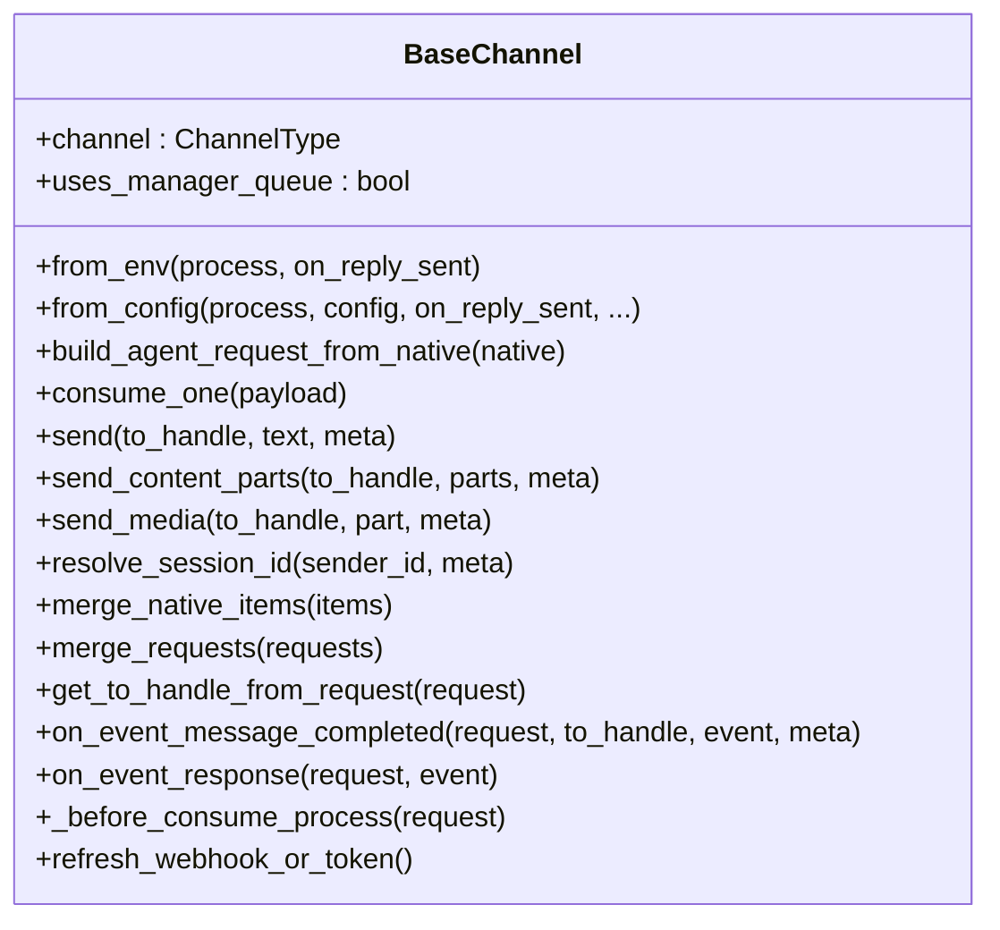
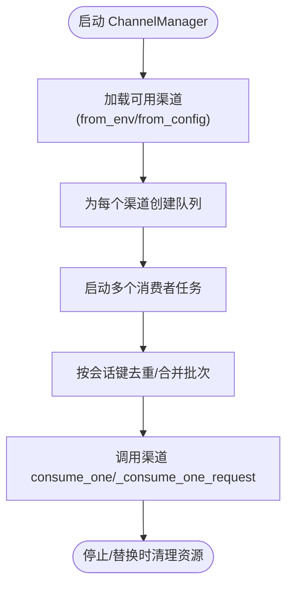
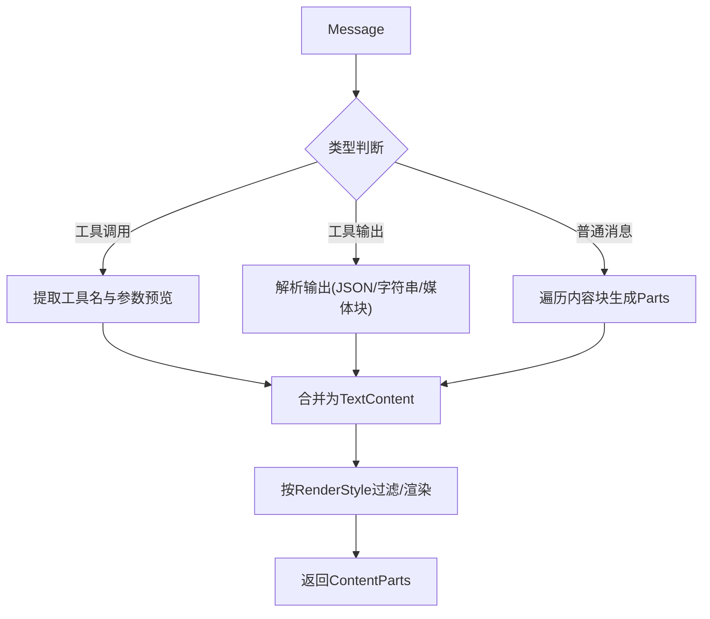
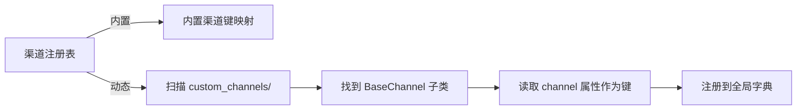
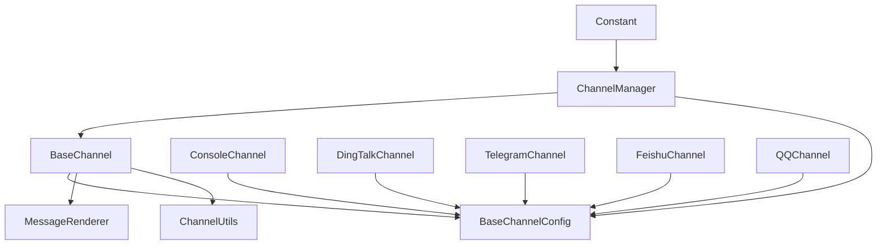

# 自定义渠道开发

<cite>
**本文档引用的文件**
- [base.py](file://src/copaw/app/channels/base.py)
- [manager.py](file://src/copaw/app/channels/manager.py)
- [schema.py](file://src/copaw/app/channels/schema.py)
- [registry.py](file://src/copaw/app/channels/registry.py)
- [utils.py](file://src/copaw/app/channels/utils.py)
- [renderer.py](file://src/copaw/app/channels/renderer.py)
- [config.py](file://src/copaw/config/config.py)
- [constant.py](file://src/copaw/constant.py)
- [console/channel.py](file://src/copaw/app/channels/console/channel.py)
- [dingtalk/channel.py](file://src/copaw/app/channels/dingtalk/channel.py)
- [telegram/channel.py](file://src/copaw/app/channels/telegram/channel.py)
- [feishu/channel.py](file://src/copaw/app/channels/feishu/channel.py)
- [qq/channel.py](file://src/copaw/app/channels/qq/channel.py)
- [channels_cmd.py](file://src/copaw/cli/channels_cmd.py)
</cite>

## 目录
1. [简介](#简介)
2. [项目结构](#项目结构)
3. [核心组件](#核心组件)
4. [架构总览](#架构总览)
5. [详细组件分析](#详细组件分析)
6. [依赖分析](#依赖分析)
7. [性能考虑](#性能考虑)
8. [故障排查指南](#故障排查指南)
9. [结论](#结论)
10. [附录](#附录)

## 简介
本指南面向希望在 CoPaw 中开发“自定义渠道”的工程师与产品人员。通过系统讲解渠道适配器的开发流程、必须实现的接口、配置参数、认证机制、API 集成方法、消息格式转换、错误处理策略、测试与部署实践，帮助你从零完成一个新渠道的适配与上线。

## 项目结构
CoPaw 的渠道体系由“渠道基类 + 渠道管理器 + 注册表 + 渲染器 + 配置”构成，支持内置渠道与自定义渠道（位于工作目录的 custom_channels/）。

**图表来源**
- [base.py:69-868](file://src/copaw/app/channels/base.py#L69-L868)
- [manager.py:114-580](file://src/copaw/app/channels/manager.py#L114-L580)
- [registry.py:133-138](file://src/copaw/app/channels/registry.py#L133-L138)
- [renderer.py:78-384](file://src/copaw/app/channels/renderer.py#L78-L384)
- [schema.py:12-71](file://src/copaw/app/channels/schema.py#L12-L71)
- [utils.py:121-134](file://src/copaw/app/channels/utils.py#L121-L134)
- [config.py:31-200](file://src/copaw/config/config.py#L31-L200)
- [constant.py:150-153](file://src/copaw/constant.py#L150-L153)

**章节来源**
- [base.py:69-125](file://src/copaw/app/channels/base.py#L69-L125)
- [manager.py:114-165](file://src/copaw/app/channels/manager.py#L114-L165)
- [registry.py:133-138](file://src/copaw/app/channels/registry.py#L133-L138)
- [config.py:31-200](file://src/copaw/config/config.py#L31-L200)
- [constant.py:150-153](file://src/copaw/constant.py#L150-L153)

## 核心组件
- BaseChannel：所有渠道的抽象基类，定义统一的消息收发、会话解析、渲染、去抖动、权限控制、错误处理等能力。
- ChannelManager：负责为每个渠道创建队列、消费者线程、批量合并、去重与回放、生命周期管理。
- MessageRenderer：将 Agent 的 Message 转换为渠道可发送的 ContentParts，并按渠道风格过滤/渲染工具调用与思考内容。
- ChannelRegistry：内置渠道 + 自定义渠道（工作目录 custom_channels/）的动态发现与注册。
- ChannelSchema：渠道类型标识、路由地址（ChannelAddress）与转换协议。
- ChannelUtils：通用工具（文本分片、本地文件 URL 解析、进程工厂）。
- Config：内置渠道的 Pydantic 配置模型；自定义渠道可通过额外字段扩展。
- Constant：工作目录、媒体目录、自定义渠道目录等常量。

**章节来源**
- [base.py:69-125](file://src/copaw/app/channels/base.py#L69-L125)
- [manager.py:114-165](file://src/copaw/app/channels/manager.py#L114-L165)
- [renderer.py:78-120](file://src/copaw/app/channels/renderer.py#L78-L120)
- [registry.py:133-138](file://src/copaw/app/channels/registry.py#L133-L138)
- [schema.py:12-71](file://src/copaw/app/channels/schema.py#L12-L71)
- [utils.py:121-134](file://src/copaw/app/channels/utils.py#L121-L134)
- [config.py:31-200](file://src/copaw/config/config.py#L31-L200)
- [constant.py:150-153](file://src/copaw/constant.py#L150-L153)

## 架构总览
下图展示了从“用户输入/事件触发”到“渠道发送响应”的端到端流程，以及渠道管理器对多渠道并发消费的协调。

**图表来源**
- [manager.py:322-393](file://src/copaw/app/channels/manager.py#L322-L393)
- [base.py:443-583](file://src/copaw/app/channels/base.py#L443-L583)
- [renderer.py:87-120](file://src/copaw/app/channels/renderer.py#L87-L120)

**章节来源**
- [manager.py:322-393](file://src/copaw/app/channels/manager.py#L322-L393)
- [base.py:443-583](file://src/copaw/app/channels/base.py#L443-L583)
- [renderer.py:87-120](file://src/copaw/app/channels/renderer.py#L87-L120)

## 详细组件分析

### BaseChannel 抽象与实现要点
- 必须实现的方法
  - from_env / from_config：从环境变量或配置对象创建实例
  - build_agent_request_from_native：将原生负载解析为 AgentRequest（含 content_parts、session_id、channel_meta）
  - send / send_content_parts / send_media：向目标发送文本/媒体内容
  - 可选覆盖：resolve_session_id、merge_native_items、merge_requests、get_to_handle_from_request、on_event_message_completed、on_event_response、_before_consume_process、refresh_webhook_or_token
- 关键特性
  - 去抖动（time debounce）：针对“先媒体后文本”的场景，合并同一会话内的多次输入
  - 权限控制：允许列表/拒绝消息、是否需要被@、私聊/群组策略
  - 渲染与过滤：通过 MessageRenderer 和 RenderStyle 控制工具消息、思考内容的显示
  - 错误处理：统一捕获异常并通过 _on_consume_error 发送错误提示

**图表来源**
- [base.py:69-800](file://src/copaw/app/channels/base.py#L69-L800)

**章节来源**
- [base.py:69-125](file://src/copaw/app/channels/base.py#L69-L125)
- [base.py:321-403](file://src/copaw/app/channels/base.py#L321-L403)
- [base.py:443-583](file://src/copaw/app/channels/base.py#L443-L583)
- [base.py:674-764](file://src/copaw/app/channels/base.py#L674-L764)

### ChannelManager 生命周期与并发
- 初始化：从配置或环境加载渠道类，注入统一的 process 处理器
- 启动：为每个启用的渠道创建队列与多个消费者任务，按会话键锁定，避免跨任务拆分
- 批处理：同会话内多条原生负载合并为一条请求，或合并多条请求
- 替换与停止：支持热替换单个渠道实例，保证平滑过渡

**图表来源**
- [manager.py:114-165](file://src/copaw/app/channels/manager.py#L114-L165)
- [manager.py:322-393](file://src/copaw/app/channels/manager.py#L322-L393)
- [manager.py:427-426](file://src/copaw/app/channels/manager.py#L427-L426)

**章节来源**
- [manager.py:114-165](file://src/copaw/app/channels/manager.py#L114-L165)
- [manager.py:322-393](file://src/copaw/app/channels/manager.py#L322-L393)
- [manager.py:427-426](file://src/copaw/app/channels/manager.py#L427-L426)

### MessageRenderer 消息格式转换
- 输入：Agent 的 Message（可能包含文本、图片、音频、视频、文件、数据块等）
- 输出：渠道可发送的 ContentParts 列表（Text/Image/Video/Audio/File/Refusal）
- 过滤与样式：根据 RenderStyle 控制是否显示工具细节、是否过滤思考内容、是否保留表情与代码围栏

**图表来源**
- [renderer.py:87-350](file://src/copaw/app/channels/renderer.py#L87-L350)

**章节来源**
- [renderer.py:78-120](file://src/copaw/app/channels/renderer.py#L78-L120)
- [renderer.py:246-350](file://src/copaw/app/channels/renderer.py#L246-L350)

### 渠道注册与自定义渠道
- 内置渠道：通过注册表映射渠道键到类
- 自定义渠道：在工作目录 custom_channels/ 下放置 Python 文件或包，运行时自动发现并注册
- CLI 模板：提供 copaw channels install <key> 的模板，便于快速生成自定义渠道骨架

**图表来源**
- [registry.py:133-138](file://src/copaw/app/channels/registry.py#L133-L138)
- [registry.py:95-127](file://src/copaw/app/channels/registry.py#L95-L127)
- [channels_cmd.py:61-100](file://src/copaw/cli/channels_cmd.py#L61-L100)
- [constant.py:150-153](file://src/copaw/constant.py#L150-L153)

**章节来源**
- [registry.py:133-138](file://src/copaw/app/channels/registry.py#L133-L138)
- [registry.py:95-127](file://src/copaw/app/channels/registry.py#L95-L127)
- [channels_cmd.py:61-100](file://src/copaw/cli/channels_cmd.py#L61-L100)
- [constant.py:150-153](file://src/copaw/constant.py#L150-L153)

### 典型渠道实现对比（要点）
- ConsoleChannel：轻量输出，打印到终端；支持媒体目录解析与推送前端
- DingTalkChannel：长连接回调 + 会话 Webhook；支持 AI 卡状态管理、媒体上传、去重与多消息发送
- TelegramChannel：Bot Polling；支持媒体下载到本地、HTML 转义、分片发送、速率限制与错误处理
- FeishuChannel：WebSocket 接收 + Open API 发送；支持富媒体、加密与校验
- QQChannel：WebSocket 事件 + HTTP API；支持意图识别、心跳与断线重连

**章节来源**
- [console/channel.py:57-185](file://src/copaw/app/channels/console/channel.py#L57-L185)
- [dingtalk/channel.py:81-256](file://src/copaw/app/channels/dingtalk/channel.py#L81-L256)
- [telegram/channel.py:264-525](file://src/copaw/app/channels/telegram/channel.py#L264-L525)
- [feishu/channel.py:150-200](file://src/copaw/app/channels/feishu/channel.py#L150-L200)
- [qq/channel.py:1-200](file://src/copaw/app/channels/qq/channel.py#L1-L200)

## 依赖分析
- 渠道与 Agent 的耦合：通过统一的 ProcessHandler（runner.stream_query）进行请求-事件流通信
- 渠道与配置：BaseChannelConfig 提供通用开关与策略；各渠道在 Config 中定义专属字段
- 渠道与存储：媒体文件默认保存在工作目录下的 media 子目录，部分渠道支持自定义 media_dir
- 渠道与认证：不同渠道使用各自鉴权方式（如 Telegram Bot Token、DingTalk App、Feishu 应用凭证）

**图表来源**
- [base.py:69-125](file://src/copaw/app/channels/base.py#L69-L125)
- [manager.py:158-262](file://src/copaw/app/channels/manager.py#L158-L262)
- [config.py:31-200](file://src/copaw/config/config.py#L31-L200)
- [constant.py:150-153](file://src/copaw/constant.py#L150-L153)

**章节来源**
- [base.py:69-125](file://src/copaw/app/channels/base.py#L69-L125)
- [manager.py:158-262](file://src/copaw/app/channels/manager.py#L158-L262)
- [config.py:31-200](file://src/copaw/config/config.py#L31-L200)
- [constant.py:150-153](file://src/copaw/constant.py#L150-L153)

## 性能考虑
- 去抖动与合并
  - 对于“先媒体后文本”的输入，利用去抖动窗口合并内容，减少重复请求与重复回复
  - 同会话内多条原生负载合并为一条请求，降低上游压力
- 并发与锁
  - 每个渠道的消费者数量固定；按会话键加锁，确保同会话不被多个消费者拆分
- 文本分片
  - 对超长文本进行分片发送（如 Telegram），避免超出平台限制
- 媒体处理
  - 将远端媒体下载到本地再发送，或使用平台提供的上传接口；注意大小限制与超时
- 日志与可观测性
  - 在关键路径记录事件计数、耗时、错误码，便于定位瓶颈

[本节为通用指导，无需特定文件引用]

## 故障排查指南
- 常见错误与处理
  - 渠道未启用：检查 Config 中 enabled 字段与环境变量
  - 权限拦截：检查 allow_from、dm_policy/group_policy、require_mention
  - 媒体不可达：确认 file:// URL 解析、本地路径存在、网络代理配置
  - 平台限流/错误码：按渠道错误类型分类处理（如 Telegram 的 RetryAfter/BadRequest）
- 日志与诊断
  - 使用 ChannelManager 的日志级别调整，观察队列积压、批处理合并情况
  - 在 BaseChannel 的错误钩子中统一上报错误文本
- 回放与重试
  - 对于断线/重连场景，确保会话元信息（如 DingTalk 的 sessionWebhook）持久化

**章节来源**
- [base.py:631-646](file://src/copaw/app/channels/base.py#L631-L646)
- [telegram/channel.py:716-767](file://src/copaw/app/channels/telegram/channel.py#L716-L767)
- [dingtalk/channel.py:601-672](file://src/copaw/app/channels/dingtalk/channel.py#L601-L672)

## 结论
通过遵循 BaseChannel 的统一接口、合理利用 ChannelManager 的并发与合并能力、借助 MessageRenderer 的格式转换与过滤策略，以及完善的配置与认证机制，你可以高效地完成自定义渠道的开发与集成。建议在开发过程中优先参考现有渠道实现（Console/DingTalk/Telegram/Feishu/QQ），并结合单元测试与集成测试验证消息流转、媒体处理与错误恢复。

[本节为总结，无需特定文件引用]

## 附录

### 从零开始开发一个新渠道的完整步骤
- 步骤一：准备目录与模板
  - 在工作目录 custom_channels/ 下创建你的渠道模块（文件或包）
  - 使用 CLI 模板生成基础类与必要字段
- 步骤二：实现必须接口
  - 实现 from_env / from_config
  - 实现 build_agent_request_from_native（解析原生负载为 AgentRequest）
  - 实现 send / send_content_parts / send_media（发送文本与媒体）
- 步骤三：配置与认证
  - 在 Config 中添加渠道专属字段（如 token、密钥、域名等）
  - 在环境变量或配置文件中填写参数
- 步骤四：消息格式转换
  - 如需特殊渲染，定制 MessageRenderer 或 RenderStyle
  - 处理媒体下载/上传、分片、去重与合并
- 步骤五：接入与测试
  - 通过 ChannelManager 注册并启动
  - 编写单元测试与集成测试，覆盖正常/异常路径
- 步骤六：部署与运维
  - 设置日志级别与告警
  - 观察队列长度、错误率与延迟指标

**章节来源**
- [channels_cmd.py:61-100](file://src/copaw/cli/channels_cmd.py#L61-L100)
- [registry.py:95-127](file://src/copaw/app/channels/registry.py#L95-L127)
- [config.py:31-200](file://src/copaw/config/config.py#L31-L200)
- [constant.py:150-153](file://src/copaw/constant.py#L150-L153)

### 渠道认证机制与 API 集成要点
- 认证方式
  - Telegram：Bot Token（Polling）
  - DingTalk：App Key/Secret + 会话 Webhook（回调/主动发送）
  - Feishu：App ID/Secret + 加密与校验（WebSocket + Open API）
  - QQ：App ID/Secret + WebSocket + HTTP API
- API 集成
  - 统一通过 aiohttp/httpx 等异步客户端发起请求
  - 对于上传类 API，注意大小限制与超时设置
  - 对于长连接（如 DingTalk/Feishu），实现心跳与断线重连

**章节来源**
- [telegram/channel.py:264-525](file://src/copaw/app/channels/telegram/channel.py#L264-L525)
- [dingtalk/channel.py:81-256](file://src/copaw/app/channels/dingtalk/channel.py#L81-L256)
- [feishu/channel.py:150-200](file://src/copaw/app/channels/feishu/channel.py#L150-L200)
- [qq/channel.py:1-200](file://src/copaw/app/channels/qq/channel.py#L1-L200)

### 渠道测试方法与调试技巧
- 测试方法
  - 单元测试：Mock ChannelManager 的 enqueue 与 Channel 的 consume_one
  - 集成测试：启动 ChannelManager，注入假的 process，验证事件流与发送路径
- 调试技巧
  - 开启详细日志，关注去抖动、合并、权限拦截、媒体下载/上传等关键节点
  - 使用 ConsoleChannel 作为“哑铃通道”验证消息链路
  - 对于长连接渠道，模拟断线/重连与限流场景

**章节来源**
- [console/channel.py:272-364](file://src/copaw/app/channels/console/channel.py#L272-L364)
- [manager.py:322-393](file://src/copaw/app/channels/manager.py#L322-L393)