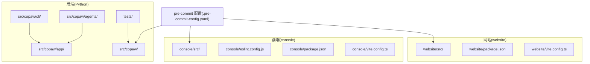
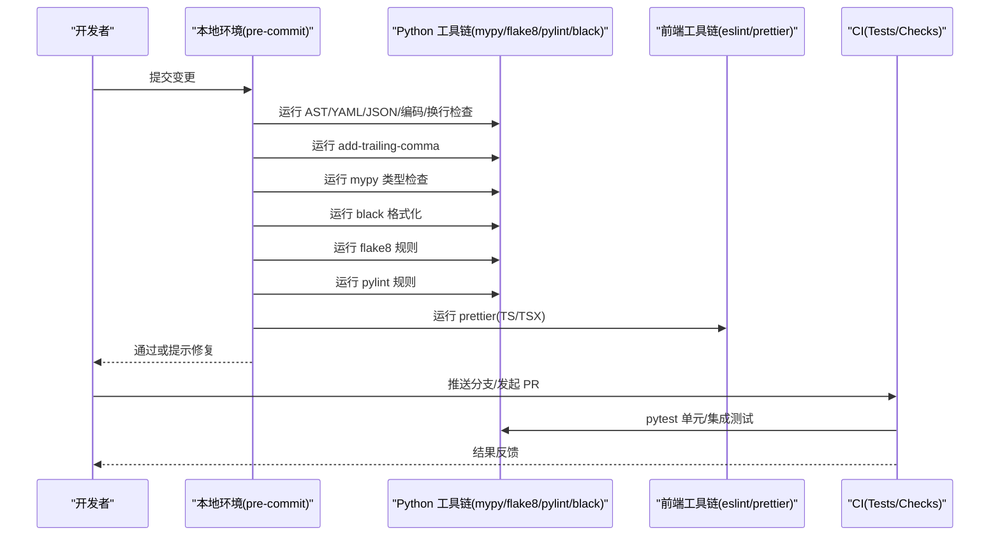
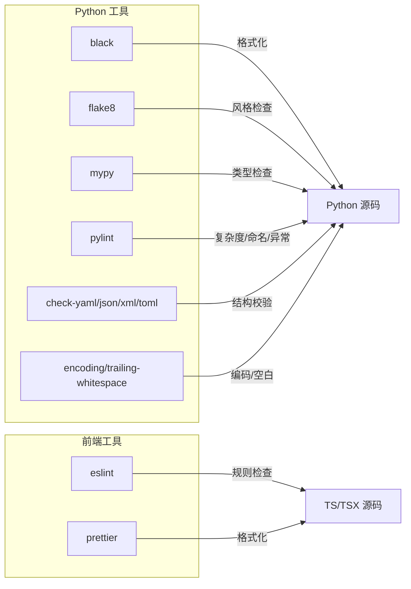

# 代码规范

<cite>
**本文引用的文件**
- [.pre-commit-config.yaml](file://.pre-commit-config.yaml)
- [pyproject.toml](file://pyproject.toml)
- [console/eslint.config.js](file://console/eslint.config.js)
- [console/package.json](file://console/package.json)
- [CONTRIBUTING.md](file://CONTRIBUTING.md)
- [.flake8](file://.flake8)
- [src/copaw/__init__.py](file://src/copaw/__init__.py)
- [src/copaw/cli/main.py](file://src/copaw/cli/main.py)
- [console/src/App.tsx](file://console/src/App.tsx)
- [console/src/components/AgentSelector/index.tsx](file://console/src/components/AgentSelector/index.tsx)
- [console/src/layouts/MainLayout/index.tsx](file://console/src/layouts/MainLayout/index.tsx)
- [console/src/pages/Agent/Config/index.tsx](file://console/src/pages/Agent/Config/index.tsx)
- [console/src/stores/agentStore.ts](file://console/src/stores/agentStore.ts)
- [console/src/api/modules/agents.ts](file://console/src/api/modules/agents.ts)
- [console/src/api/config.ts](file://console/src/api/config.ts)
- [console/src/utils/markdown.ts](file://console/src/utils/markdown.ts)
- [console/src/utils/formatNumber.ts](file://console/src/utils/formatNumber.ts)
- [console/src/locales/zh.json](file://console/src/locales/zh.json)
- [console/src/locales/en.json](file://console/src/locales/en.json)
- [console/src/locales/ja.json](file://console/src/locales/ja.json)
- [console/src/locales/ru.json](file://console/src/locales/ru.json)
- [console/src/styles/layout.css](file://console/src/styles/layout.css)
- [console/src/styles/form-override.css](file://console/src/styles/form-override.css)
- [console/src/index.tsx](file://console/src/index.tsx)
- [console/vite.config.ts](file://console/vite.config.ts)
- [console/tsconfig.app.json](file://console/tsconfig.app.json)
- [console/tsconfig.json](file://console/tsconfig.json)
- [console/tsconfig.node.json](file://console/tsconfig.node.json)
- [website/src/App.tsx](file://website/src/App.tsx)
- [website/package.json](file://website/package.json)
- [website/tsconfig.json](file://website/tsconfig.json)
- [website/vite.config.ts](file://website/vite.config.ts)
- [tests/unit/providers/test_openai_provider.py](file://tests/unit/providers/test_openai_provider.py)
- [tests/unit/memory/test_copaw_token_counter.py](file://tests/unit/memory/test_copaw_token_counter.py)
- [tests/integrated/test_app_startup.py](file://tests/integrated/test_app_startup.py)
- [tests/integrated/test_version.py](file://tests/integrated/test_version.py)
</cite>

## 目录
1. [引言](#引言)
2. [项目结构](#项目结构)
3. [核心组件](#核心组件)
4. [架构总览](#架构总览)
5. [详细组件分析](#详细组件分析)
6. [依赖分析](#依赖分析)
7. [性能考虑](#性能考虑)
8. [故障排查指南](#故障排查指南)
9. [结论](#结论)
10. [附录](#附录)

## 引言
本文件为 CoPaw 项目的代码规范与质量保障指南，覆盖 Python 后端、TypeScript/JavaScript 前端、Ant Design 组件与样式体系、国际化与文档编写等维度，并结合现有 pre-commit 钩子、ESLint、Prettier、Black、Flake8、MyPy、Pylint 等工具配置，给出可操作的规范、最佳实践与常见错误规避建议。同时提供代码审查清单与质量检查标准，帮助贡献者高效产出高质量代码。

## 项目结构
CoPaw 采用多模块分层组织：后端 Python 包、前端控制台与官网站点、测试与脚本等。控制台与官网均采用 Vite + TypeScript + React 技术栈；后端基于 Click CLI 与 FastAPI 路由器；预提交钩子统一管理静态检查与格式化。

图示来源
- [.pre-commit-config.yaml:1-121](file://.pre-commit-config.yaml#L1-L121)
- [console/eslint.config.js:1-29](file://console/eslint.config.js#L1-L29)
- [console/package.json:1-60](file://console/package.json#L1-L60)
- [website/package.json](file://website/package.json)
- [website/vite.config.ts](file://website/vite.config.ts)
- [console/vite.config.ts](file://console/vite.config.ts)

章节来源
- [.pre-commit-config.yaml:1-121](file://.pre-commit-config.yaml#L1-L121)
- [console/package.json:1-60](file://console/package.json#L1-L60)
- [website/package.json](file://website/package.json)

## 核心组件
- 预提交与静态分析：通过 pre-commit 集成 AST 检查、YAML/XML/TOML/JSON 校验、换行与编码处理、mypy 类型检查、black 格式化、flake8 规则、pylint 规则以及 Prettier 对 TS/TSX 的格式化。
- 前端工程：Vite + React + TypeScript + Ant Design + Less；ESLint 使用 typescript-eslint 推荐规则集并启用 react-hooks、react-refresh；Prettier 作为统一格式化工具。
- 测试与覆盖率：pytest 配置于 pyproject.toml，支持 asyncio 模式与标记；单元测试与集成测试分别位于 tests/unit 与 tests/integrated。
- 文档与贡献流程：CONTRIBUTING.md 明确提交信息、PR 标题格式、本地门禁步骤与文档更新要求。

章节来源
- [.pre-commit-config.yaml:1-121](file://.pre-commit-config.yaml#L1-L121)
- [console/eslint.config.js:1-29](file://console/eslint.config.js#L1-L29)
- [console/package.json:1-60](file://console/package.json#L1-L60)
- [pyproject.toml:96-102](file://pyproject.toml#L96-L102)
- [CONTRIBUTING.md:68-86](file://CONTRIBUTING.md#L68-L86)

## 架构总览
下图展示从开发者提交到 CI 与运行时的关键路径，强调 pre-commit 在本地的质量门槛与工具链协作。

图示来源
- [.pre-commit-config.yaml:1-121](file://.pre-commit-config.yaml#L1-L121)
- [console/eslint.config.js:1-29](file://console/eslint.config.js#L1-L29)
- [console/package.json:6-16](file://console/package.json#L6-L16)
- [pyproject.toml:96-102](file://pyproject.toml#L96-L102)

## 详细组件分析

### Python 编码规范（PEP8 风格、命名约定、函数与类设计）
- 文件与编码
  - 文件头统一编码声明，确保跨平台兼容性。
  - 日志初始化在包级进行，避免导入时阻塞。
- 命名约定
  - 模块与包：小写、下划线分隔；避免与内置冲突。
  - 函数与变量：小写+下划线；常量全大写+下划线。
  - 类：驼峰命名；异常类以 Error 结尾。
  - 私有成员：以下划线前缀；公共接口不隐藏实现细节。
- 函数与类设计
  - 函数单一职责；参数尽量使用关键字参数；必要时提供默认值与类型注解。
  - 类继承清晰；重载方法时保持签名一致；避免魔法字符串硬编码。
  - 导入顺序：标准库 → 第三方 → 项目内模块；分组空行分隔。
- 文档字符串与注释
  - 模块、类、公共函数应提供简洁明了的 docstring；TODO 注释保留明确截止日期或任务链接。
- 错误处理
  - 明确区分业务异常与系统异常；记录上下文日志但不泄露敏感信息。
- 性能与资源
  - 避免在热路径重复计算；合理缓存与惰性加载；及时释放资源。

章节来源
- [src/copaw/__init__.py:1-33](file://src/copaw/__init__.py#L1-L33)
- [src/copaw/cli/main.py:1-162](file://src/copaw/cli/main.py#L1-L162)
- [.flake8:1-12](file://.flake8#L1-L12)

### TypeScript/JavaScript 编码规范（ESLint 配置、TS 类型系统、React 组件规范）
- ESLint 配置
  - 使用 typescript-eslint 推荐规则集；启用 react-hooks、react-refresh；限制仅导出组件需允许常量导出。
  - 全局忽略 dist 目录；语言环境为浏览器；启用 2020 ECMAScript 版本。
- TypeScript 类型系统
  - 优先使用严格模式；为所有外部 API 返回值定义明确类型；避免 any/unknown 的滥用。
  - 使用联合类型与字面量类型表达有限集合；利用 Partial、Pick、Omit 精准建模。
- React 组件规范
  - 函数组件优先；使用 hooks 管理状态与副作用；避免在渲染期间执行耗时逻辑。
  - 事件处理器与回调使用稳定引用；列表渲染提供稳定 key；组件拆分遵循单一职责。
  - 样式使用 Less 并配合 antd-style 的全局样式覆盖策略。
- 代码格式化
  - Prettier 固定版本与统一规则；在 package.json 中提供 format/format:check 脚本。
  - 与 ESLint 冲突时以 ESLint 为准，保持一致性。

章节来源
- [console/eslint.config.js:1-29](file://console/eslint.config.js#L1-L29)
- [console/package.json:41-57](file://console/package.json#L41-L57)

### 前端组件开发规范（Ant Design 使用、样式架构、主题系统）
- Ant Design 使用
  - 使用 ConfigProvider 全局注入主题、前缀与本地化；按需引入图标与组件。
  - 使用 dayjs 进行本地化时间处理；根据语言切换 antd 与 dayjs 的 locale。
- 主题系统
  - 通过 ThemeProvider 与 useTheme 切换暗/亮主题；算法选择与 antd 主题保持一致。
  - 使用 antd-style 的 createGlobalStyle 定义基础样式，避免全局污染。
- 样式架构
  - 组件样式采用 CSS Modules（.module.less），保证作用域隔离与可维护性。
  - 公共布局与表单覆盖样式分离至独立 CSS 文件，便于集中管理。
- 国际化
  - 多语言 JSON 文件按语言分片存放；组件中通过 react-i18next 获取翻译。
  - 语言切换时同步更新 antd 与 dayjs 的本地化设置。

章节来源
- [console/src/App.tsx:1-171](file://console/src/App.tsx#L1-L171)
- [console/src/components/AgentSelector/index.tsx:1-101](file://console/src/components/AgentSelector/index.tsx#L1-L101)
- [console/src/locales/zh.json](file://console/src/locales/zh.json)
- [console/src/locales/en.json](file://console/src/locales/en.json)
- [console/src/locales/ja.json](file://console/src/locales/ja.json)
- [console/src/locales/ru.json](file://console/src/locales/ru.json)
- [console/src/styles/layout.css](file://console/src/styles/layout.css)
- [console/src/styles/form-override.css](file://console/src/styles/form-override.css)

### 文档编写规范（Markdown 格式、API 文档标准）
- Markdown 格式
  - 标题层级清晰；段落简洁；列表与代码块缩进一致；超链接与图片 alt 文案完整。
  - 代码示例使用语言标识；命令行片段使用反引号包裹；避免长行，建议宽度不超过 79 字符。
- API 文档标准
  - 接口文档包含请求方法、URL、认证方式、请求体/查询参数、响应体与错误码。
  - 示例请求与响应使用 JSON 格式；对必填字段与可选字段进行标注。
  - 变更日志按版本分节，记录新增、修改、删除与修复项。

章节来源
- [CONTRIBUTING.md:85-86](file://CONTRIBUTING.md#L85-L86)

### 代码审查清单与质量检查标准
- Python
  - 通过 flake8（行宽 79，忽略特定规则）、mypy（忽略缺失导入与部分错误类型）、pylint（禁用若干规则）。
  - 导入顺序与 AST 正确性检查；YAML/JSON/XML/TOML/文档字符串/编码/私钥检测。
- 前端
  - ESLint 通过；Prettier 格式检查通过；TS 类型无告警；组件无未处理的 Promise。
- 测试
  - pytest 单元/集成测试全部通过；覆盖率报告符合预期阈值。
- 文档与提交
  - 提交信息与 PR 标题遵循 Conventional Commits；README 与文档同步更新。

章节来源
- [.pre-commit-config.yaml:1-121](file://.pre-commit-config.yaml#L1-L121)
- [.flake8:1-12](file://.flake8#L1-L12)
- [pyproject.toml:96-102](file://pyproject.toml#L96-L102)
- [CONTRIBUTING.md:23-66](file://CONTRIBUTING.md#L23-L66)

## 依赖分析
- Python 工具链
  - black：统一代码风格，行宽 79；排除 skills 与打包目录。
  - flake8：行宽 79，扩展忽略 E203；排除 scripts 与 agentscope rpc。
  - mypy：忽略缺失导入与多种错误类型；跳过导入跟踪；显式包基路径。
  - pylint：禁用大量规则以适配现有代码；排除文档、HTML、MD、RPC、PB2、GRPC。
  - Prettier：对 TS/TSX 执行格式化，排除 web/ 与 console/ 等目录。
- 前端工具链
  - ESLint：typescript-eslint 推荐规则；react-hooks 与 react-refresh；仅检查 ts/tsx。
  - Prettier：统一格式化；与 ESLint 冲突时以 ESLint 为准。

图示来源
- [.pre-commit-config.yaml:1-121](file://.pre-commit-config.yaml#L1-L121)
- [console/eslint.config.js:1-29](file://console/eslint.config.js#L1-L29)
- [console/package.json:41-57](file://console/package.json#L41-L57)

章节来源
- [.pre-commit-config.yaml:1-121](file://.pre-commit-config.yaml#L1-L121)
- [console/eslint.config.js:1-29](file://console/eslint.config.js#L1-L29)
- [console/package.json:41-57](file://console/package.json#L41-L57)

## 性能考虑
- Python
  - 导入延迟与懒加载：CLI 使用 LazyGroup 延迟加载子命令，减少启动时间。
  - 日志级别与初始化：包级日志初始化避免重复开销；失败回退不影响可用性。
- 前端
  - 组件按需加载与样式模块化：降低首屏体积与样式冲突风险。
  - 主题切换与本地化：在语言切换时仅更新必要状态，避免全量重渲染。
- 通用
  - 静态检查与格式化在本地完成，减少 CI 时间与网络开销。

章节来源
- [src/copaw/cli/main.py:55-89](file://src/copaw/cli/main.py#L55-L89)
- [src/copaw/__init__.py:1-33](file://src/copaw/__init__.py#L1-L33)
- [console/src/App.tsx:106-129](file://console/src/App.tsx#L106-L129)

## 故障排查指南
- pre-commit 失败
  - 检查 black 是否自动格式化；如被修改需再次运行直至通过。
  - flake8 忽略规则导致的告警；根据规则编号调整代码或在 .flake8 中补充忽略。
  - mypy 类型错误：完善类型注解或在 mypy 参数中临时放宽（谨慎使用）。
  - Pylint 规则过多：确认是否为历史遗留问题，逐步修复而非持续禁用。
- 前端格式化与 ESLint
  - 使用 npm run format 或 npm run format:check；确保 Prettier 与 ESLint 规则一致。
  - TS 类型报错：检查接口定义与调用点；避免 any/unknown 的滥用。
- 测试失败
  - pytest 单元/集成测试失败：定位具体用例，补充断言或修复被测逻辑。
  - 覆盖率不足：为关键分支与边界条件添加测试用例。

章节来源
- [.pre-commit-config.yaml:1-121](file://.pre-commit-config.yaml#L1-L121)
- [console/package.json:6-16](file://console/package.json#L6-L16)
- [pyproject.toml:96-102](file://pyproject.toml#L96-L102)

## 结论
通过统一的工具链与规范约束，CoPaw 在 Python 与前端领域实现了高一致性的代码质量保障。建议团队在日常开发中坚持本地门禁、持续改进类型注解与测试覆盖率，并在文档与国际化方面保持同步更新，以提升整体可维护性与协作效率。

## 附录

### Python 代码示例路径参考
- 包初始化与日志设置：[src/copaw/__init__.py:1-33](file://src/copaw/__init__.py#L1-L33)
- CLI 分组与延迟加载：[src/copaw/cli/main.py:55-89](file://src/copaw/cli/main.py#L55-L89)
- API 模块与类型定义（示例）：[console/src/api/modules/agents.ts](file://console/src/api/modules/agents.ts)
- 存储与状态（示例）：[console/src/stores/agentStore.ts](file://console/src/stores/agentStore.ts)
- 工具函数（示例）：[console/src/utils/markdown.ts](file://console/src/utils/markdown.ts), [console/src/utils/formatNumber.ts](file://console/src/utils/formatNumber.ts)

### 前端组件与页面示例路径参考
- 应用入口与路由：[console/src/App.tsx:106-171](file://console/src/App.tsx#L106-L171)
- 代理选择器组件：[console/src/components/AgentSelector/index.tsx:1-101](file://console/src/components/AgentSelector/index.tsx#L1-L101)
- 主布局组件：[console/src/layouts/MainLayout/index.tsx](file://console/src/layouts/MainLayout/index.tsx)
- 代理配置页面：[console/src/pages/Agent/Config/index.tsx](file://console/src/pages/Agent/Config/index.tsx)
- API 配置与鉴权：[console/src/api/config.ts](file://console/src/api/config.ts)

### 测试示例路径参考
- 提供商测试：[tests/unit/providers/test_openai_provider.py](file://tests/unit/providers/test_openai_provider.py)
- 记忆与计数测试：[tests/unit/memory/test_copaw_token_counter.py](file://tests/unit/memory/test_copaw_token_counter.py)
- 应用启动与版本测试：[tests/integrated/test_app_startup.py](file://tests/integrated/test_app_startup.py), [tests/integrated/test_version.py](file://tests/integrated/test_version.py)