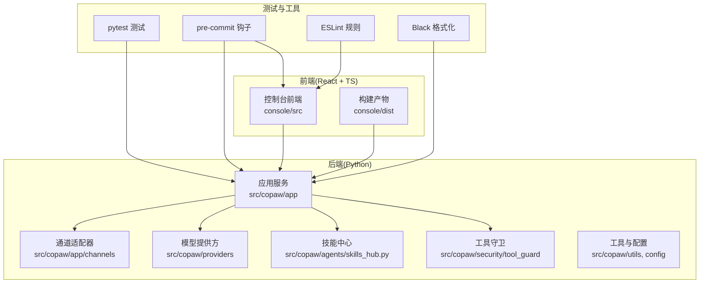
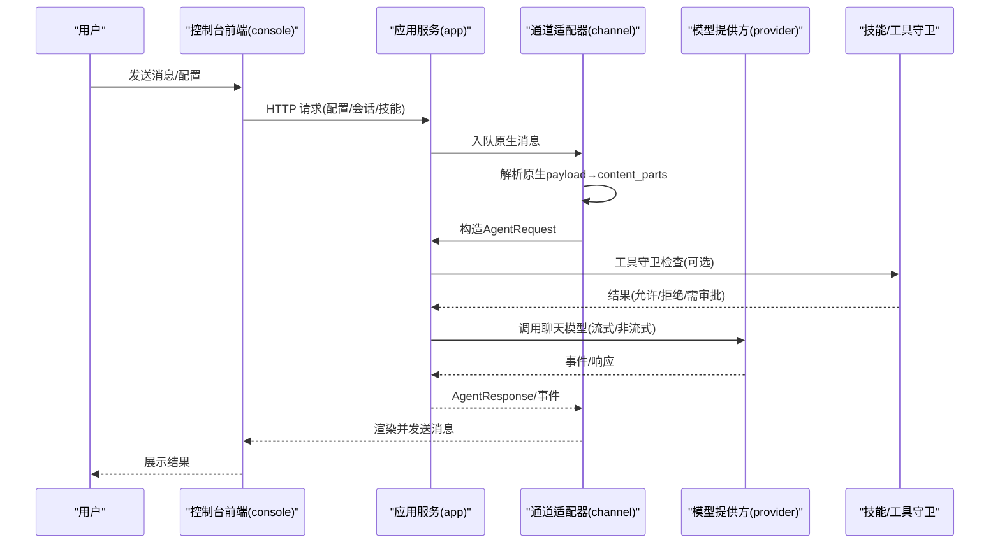
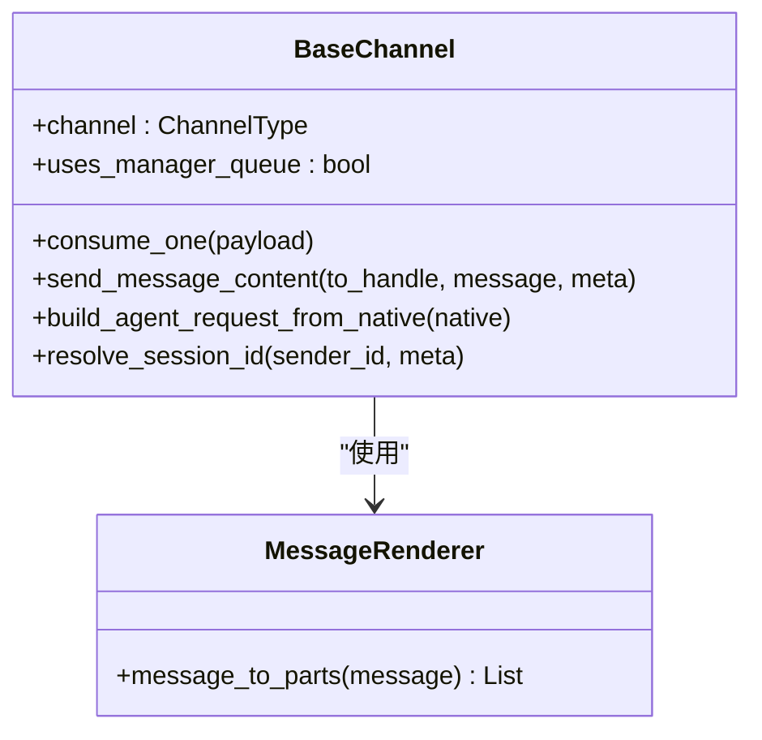
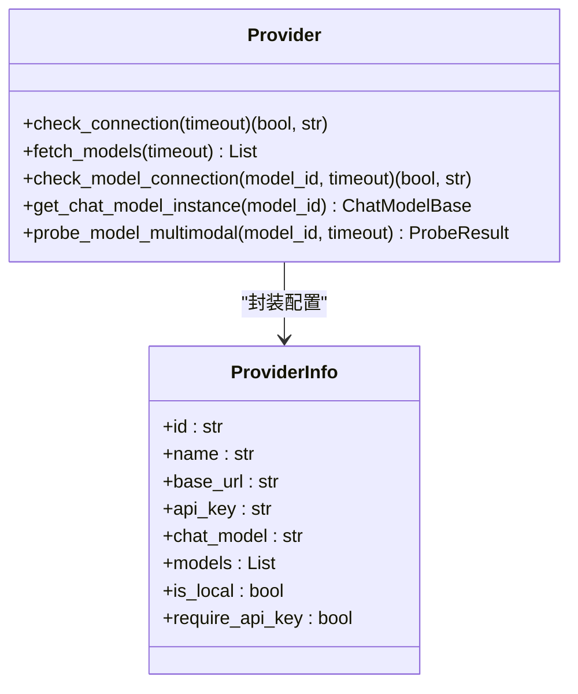
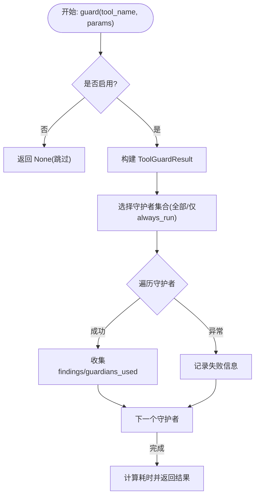
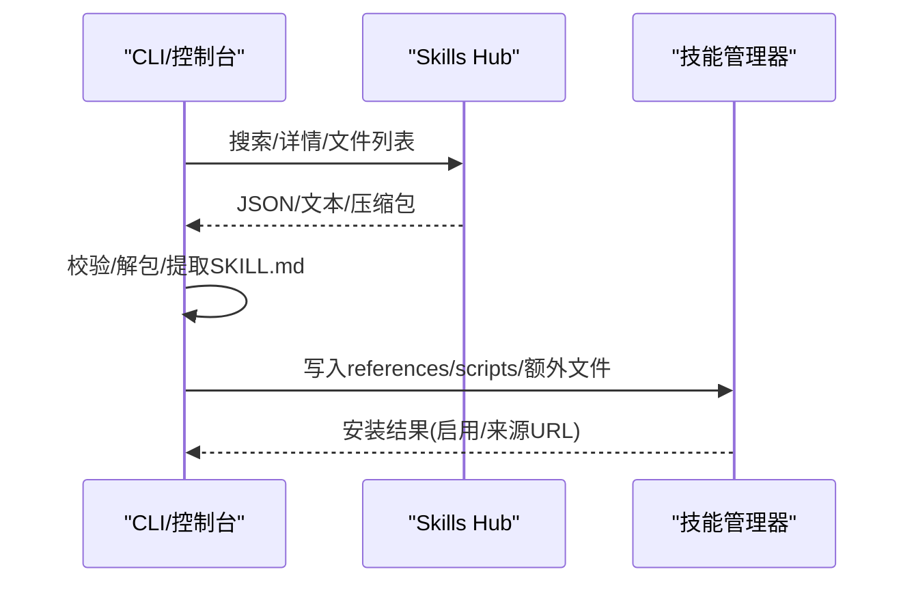
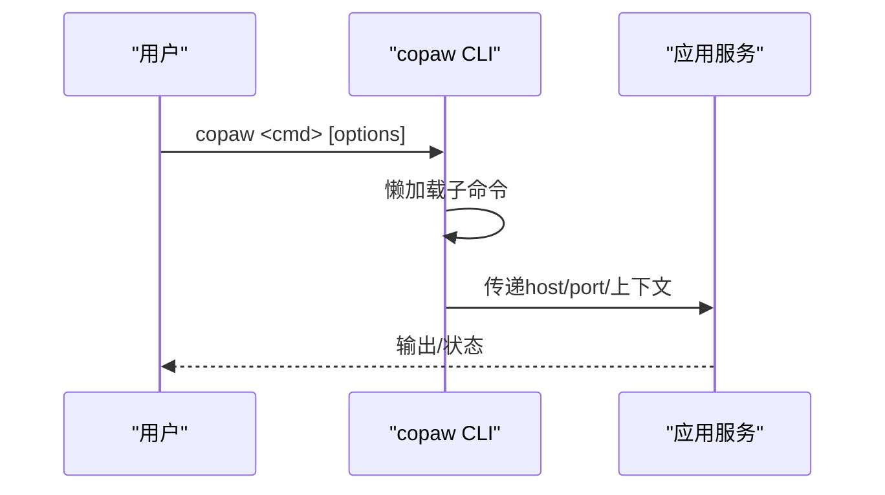
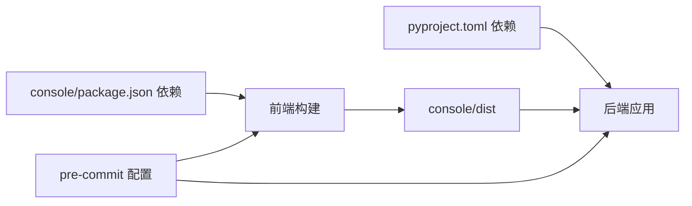

# 开发指南

<cite>
**本文引用的文件**   
- [CONTRIBUTING.md](file://CONTRIBUTING.md)
- [README.md](file://README.md)
- [SECURITY.md](file://SECURITY.md)
- [pyproject.toml](file://pyproject.toml)
- [.pre-commit-config.yaml](file://.pre-commit-config.yaml)
- [console/package.json](file://console/package.json)
- [console/eslint.config.js](file://console/eslint.config.js)
- [console/tsconfig.json](file://console/tsconfig.json)
- [console/vite.config.ts](file://console/vite.config.ts)
- [scripts/run_tests.py](file://scripts/run_tests.py)
- [.github/PULL_REQUEST_TEMPLATE.md](file://.github/PULL_REQUEST_TEMPLATE.md)
- [src/copaw/__init__.py](file://src/copaw/__init__.py)
- [src/copaw/cli/main.py](file://src/copaw/cli/main.py)
- [src/copaw/app/channels/base.py](file://src/copaw/app/channels/base.py)
- [src/copaw/providers/provider.py](file://src/copaw/providers/provider.py)
- [src/copaw/security/tool_guard/engine.py](file://src/copaw/security/tool_guard/engine.py)
- [src/copaw/agents/skills_hub.py](file://src/copaw/agents/skills_hub.py)
</cite>

## 目录
1. [简介](#简介)
2. [项目结构](#项目结构)
3. [核心组件](#核心组件)
4. [架构总览](#架构总览)
5. [详细组件分析](#详细组件分析)
6. [依赖关系分析](#依赖关系分析)
7. [性能考虑](#性能考虑)
8. [故障排查指南](#故障排查指南)
9. [结论](#结论)
10. [附录](#附录)

## 简介
本开发指南面向希望为 CoPaw 贡献与扩展能力的开发者，覆盖代码规范、测试策略、插件（技能）开发、工具守卫扩展、渠道适配器开发、贡献流程、问题报告与功能请求、社区参与、开发环境搭建、调试技巧、性能优化、发布管理与代码审查等主题。内容基于仓库现有配置与源码进行提炼总结，帮助你快速上手并高质量交付。

## 项目结构
CoPaw 采用前后端分离与多语言混合的工程组织方式：
- 后端：Python 包含应用服务、通道适配器、模型提供方、安全与工具守卫、技能中心等模块。
- 前端：React + TypeScript 的控制台界面，构建产物打包到后端包内以支持独立部署。
- 测试：Python 单元与集成测试，配合本地测试脚本。
- 工具链：pre-commit、ESLint、Black、Flake8、Pylint、Prettier 等质量门禁。
- 部署：Docker 镜像、桌面应用、安装脚本与一键部署。

图示来源
- [src/copaw/app/channels/base.py](file://src/copaw/app/channels/base.py)
- [src/copaw/providers/provider.py](file://src/copaw/providers/provider.py)
- [src/copaw/security/tool_guard/engine.py](file://src/copaw/security/tool_guard/engine.py)
- [src/copaw/agents/skills_hub.py](file://src/copaw/agents/skills_hub.py)
- [console/vite.config.ts](file://console/vite.config.ts)

章节来源
- [README.md: 安装与运行](file://README.md)
- [pyproject.toml: 依赖与可选特性](file://pyproject.toml)
- [console/package.json: 前端依赖与脚本](file://console/package.json)

## 核心组件
- 应用入口与 CLI：命令分组懒加载，支持多子命令与版本输出。
- 通道适配器基类：统一消息收发、会话解析、内容合并与错误处理。
- 模型提供方抽象：提供连接检查、模型发现、聊天模型实例化等接口。
- 工具守卫引擎：对工具调用参数进行规则校验与路径检查，支持动态注册守护者。
- 技能中心：从 Hub 拉取、解包、校验并安装技能，支持取消与重试机制。
- 日志与初始化：包级日志初始化与环境变量加载。

章节来源
- [src/copaw/cli/main.py](file://src/copaw/cli/main.py)
- [src/copaw/app/channels/base.py](file://src/copaw/app/channels/base.py)
- [src/copaw/providers/provider.py](file://src/copaw/providers/provider.py)
- [src/copaw/security/tool_guard/engine.py](file://src/copaw/security/tool_guard/engine.py)
- [src/copaw/agents/skills_hub.py](file://src/copaw/agents/skills_hub.py)
- [src/copaw/__init__.py](file://src/copaw/__init__.py)

## 架构总览
CoPaw 的运行时由“通道适配器 + 代理处理 + 提供方模型 + 技能/工具守卫”构成闭环。前端控制台负责配置与展示，后端通过统一的 AgentRequest/AgentResponse 协议与通道交互。

图示来源
- [src/copaw/app/channels/base.py](file://src/copaw/app/channels/base.py)
- [src/copaw/providers/provider.py](file://src/copaw/providers/provider.py)
- [src/copaw/security/tool_guard/engine.py](file://src/copaw/security/tool_guard/engine.py)

## 详细组件分析

### 组件一：通道适配器（Channel Adapter）
- 设计要点
  - 统一协议：接收原生 payload，转换为 content_parts，构造 AgentRequest；发送时将 Message 渲染为多段内容。
  - 会话与去抖：按 session_id 合并与去抖，支持音频直达与文本合并策略。
  - 错误处理：消费失败与响应错误统一上报。
  - 可扩展：支持覆写渲染样式、发送媒体、会话键解析等。

图示来源
- [src/copaw/app/channels/base.py](file://src/copaw/app/channels/base.py)

章节来源
- [src/copaw/app/channels/base.py](file://src/copaw/app/channels/base.py)

### 组件二：模型提供方（Provider）
- 设计要点
  - 抽象 Provider：定义连接检查、模型发现、单模型连通性检查、聊天模型实例化等接口。
  - 配置模型：ProviderInfo/ModelInfo 描述提供方与模型能力、是否本地、是否需要密钥等。
  - 多模态探测：可选的多模态探测能力，便于 UI 展示。

图示来源
- [src/copaw/providers/provider.py](file://src/copaw/providers/provider.py)

章节来源
- [src/copaw/providers/provider.py](file://src/copaw/providers/provider.py)

### 组件三：工具守卫引擎（Tool Guard Engine）
- 设计要点
  - 引擎聚合多个守护者（规则/路径），在工具调用前进行参数扫描与风险评估。
  - 支持按环境变量或配置启用/禁用，支持动态重载规则与受保护工具集。
  - 提供“仅执行 always_run 守护者”的模式用于非受保护工具的路径检查。

图示来源
- [src/copaw/security/tool_guard/engine.py](file://src/copaw/security/tool_guard/engine.py)

章节来源
- [src/copaw/security/tool_guard/engine.py](file://src/copaw/security/tool_guard/engine.py)

### 组件四：技能中心（Skills Hub）
- 设计要点
  - 支持从 Hub 搜索、拉取、解包技能，自动解析 frontmatter 获取名称与描述。
  - 支持取消导入、重试与指数退避、大小限制与路径安全校验。
  - 将 references/scripts 文件树规整为受控目录，确保只写入允许的相对路径。

图示来源
- [src/copaw/agents/skills_hub.py](file://src/copaw/agents/skills_hub.py)

章节来源
- [src/copaw/agents/skills_hub.py](file://src/copaw/agents/skills_hub.py)

### 组件五：CLI 与应用入口
- 设计要点
  - CLI 使用 Click 分组与懒加载，减少启动时间。
  - 包初始化阶段设置日志级别与环境变量加载，记录初始化耗时。

图示来源
- [src/copaw/cli/main.py](file://src/copaw/cli/main.py)
- [src/copaw/__init__.py](file://src/copaw/__init__.py)

章节来源
- [src/copaw/cli/main.py](file://src/copaw/cli/main.py)
- [src/copaw/__init__.py](file://src/copaw/__init__.py)

## 依赖关系分析
- Python 依赖：后端通过 setuptools 打包，包含 channels、providers、security、local_models 等资源数据。
- 可选特性：llamacpp、mlx、ollama、whisper、full 等通过 extras 控制。
- 前端依赖：React、Ant Design、Zustand、Vite、ESLint、TypeScript 等。
- 质量门禁：pre-commit 集成 AST/YAML/JSON/TOML 校验、mypy、black、flake8、pylint、prettier。

图示来源
- [pyproject.toml](file://pyproject.toml)
- [console/package.json](file://console/package.json)
- [.pre-commit-config.yaml](file://.pre-commit-config.yaml)

章节来源
- [pyproject.toml](file://pyproject.toml)
- [console/package.json](file://console/package.json)
- [.pre-commit-config.yaml](file://.pre-commit-config.yaml)

## 性能考虑
- 启动与懒加载：CLI 使用懒加载子命令，降低冷启动成本。
- 初始化日志：包初始化阶段记录耗时，便于定位慢点。
- 前端构建：Vite 开发服务器默认监听 0.0.0.0，端口 5173；生产构建输出至后端包内，避免手动复制。
- 通道去抖与合并：按会话合并多次输入，减少重复处理与网络往返。
- 工具守卫短路：仅在启用且命中受保护工具时执行，避免不必要的扫描。

章节来源
- [src/copaw/cli/main.py](file://src/copaw/cli/main.py)
- [src/copaw/__init__.py](file://src/copaw/__init__.py)
- [console/vite.config.ts](file://console/vite.config.ts)
- [src/copaw/app/channels/base.py](file://src/copaw/app/channels/base.py)
- [src/copaw/security/tool_guard/engine.py](file://src/copaw/security/tool_guard/engine.py)

## 故障排查指南
- 安全策略与信任边界
  - 明确“单操作员”信任模型，通道与技能均在受信边界内运行；避免跨用户隔离场景。
  - 报告漏洞请走私有渠道，提供复现步骤、影响面与修复建议。
- 工具守卫
  - 若工具调用被拦截，检查 COPAW_TOOL_GUARD_ENABLED 与受保护工具集配置；必要时仅对路径做 always_run 检查。
- 技能导入
  - Hub 返回 429/5xx 时根据提示重试或设置 GITHUB_TOKEN；注意 zip 大小与条目数量限制。
- 前端格式化
  - 修改 console/website 目录需先格式化再提交，避免 pre-commit 失败。

章节来源
- [SECURITY.md](file://SECURITY.md)
- [src/copaw/security/tool_guard/engine.py](file://src/copaw/security/tool_guard/engine.py)
- [src/copaw/agents/skills_hub.py](file://src/copaw/agents/skills_hub.py)
- [CONTRIBUTING.md](file://CONTRIBUTING.md)

## 结论
本指南系统梳理了 CoPaw 的开发规范、测试策略、扩展点与贡献流程。遵循本文档与现有质量门禁，可高效地完成渠道适配器、模型提供方、技能与工具守卫的开发与维护，并确保发布质量与安全性。

## 附录

### 代码规范与质量门禁
- Python
  - 格式化：Black（行宽 79）。
  - Lint：flake8（忽略部分 E203）、pylint（禁用若干规则以提升开发效率）。
  - 类型检查：mypy（忽略缺失导入与部分类型问题）。
  - YAML/JSON/XML/TOML/Docstring：pre-commit 钩子自动校验。
- 前端（TypeScript/React）
  - ESLint：推荐使用 TypeScript ESLint 配置与 React Hooks 规则。
  - Prettier：统一格式化风格。
  - 构建：Vite；Less 预处理器开启 JavaScript 支持。
- 文档与提交
  - Conventional Commits 与 PR 标题规范。
  - 本地 gate：安装 dev/full 依赖、pre-commit 全量检查、pytest。

章节来源
- [.pre-commit-config.yaml](file://.pre-commit-config.yaml)
- [console/eslint.config.js](file://console/eslint.config.js)
- [console/tsconfig.json](file://console/tsconfig.json)
- [console/vite.config.ts](file://console/vite.config.ts)
- [CONTRIBUTING.md](file://CONTRIBUTING.md)

### 测试策略与本地运行
- 运行方式
  - Python：scripts/run_tests.py 支持单元/集成测试、覆盖率、并行执行。
  - 前端：npm run lint/format/build/test（按 package.json 脚本）。
- 覆盖率
  - pytest 配置支持 HTML 与缺失行报告。
- 并行
  - 需安装 pytest-xdist；并行模式下注意共享资源与测试隔离。

章节来源
- [scripts/run_tests.py](file://scripts/run_tests.py)
- [console/package.json](file://console/package.json)
- [pyproject.toml](file://pyproject.toml)

### 插件（技能）开发规范
- 目录结构
  - SKILL.md（frontmatter 必备 name/description/metadata）。
  - references/ 与 scripts/ 子目录可选。
- 描述撰写
  - 明确触发时机与关键词，避免抽象与歧义。
- 安装与导入
  - 通过 Console 或 CLI 安装；支持从 Skills Hub 拉取并自动解包。
- 文档更新
  - 用户可见行为变更需同步更新 website/public/docs 下的文档。

章节来源
- [CONTRIBUTING.md](file://CONTRIBUTING.md)
- [src/copaw/agents/skills_hub.py](file://src/copaw/agents/skills_hub.py)

### 渠道适配器开发指南
- 继承 BaseChannel，实现以下职责
  - from_env/from_config：从环境或配置创建实例。
  - build_agent_request_from_native：解析原生 payload 为 content_parts 与会话键。
  - send_content_parts/send_media：发送文本与媒体附件。
  - resolve_session_id/get_to_handle_from_request：会话与目标解析。
- 可选增强
  - 会话去抖、批量发送、鉴权刷新、消息渲染样式定制。

章节来源
- [src/copaw/app/channels/base.py](file://src/copaw/app/channels/base.py)

### 工具守卫扩展指南
- 新增守护者
  - 实现 BaseToolGuardian 接口，注册到 ToolGuardEngine。
  - 支持 always_run 与 reload 机制。
- 配置项
  - COPAW_TOOL_GUARD_ENABLED、受保护工具集与禁止工具集。
- 最佳实践
  - 对高危工具（如文件系统/命令执行）优先启用；对低风险工具保持宽松。

章节来源
- [src/copaw/security/tool_guard/engine.py](file://src/copaw/security/tool_guard/engine.py)

### 自定义工具开发指南
- 工具函数
  - 与模型工具 API 对齐，支持参数校验与错误包装。
- 工具守卫
  - 在工具守卫中添加规则或路径白名单，必要时引入新守护者。
- 文档与测试
  - 更新 Console/文档与单元测试，确保可发现与可验证。

章节来源
- [src/copaw/security/tool_guard/engine.py](file://src/copaw/security/tool_guard/engine.py)

### 贡献流程与社区参与
- 贡献类型
  - 新模型/提供方、新渠道、基础技能、平台兼容、MCP、文档与修复等。
- 提交流程
  - 讨论/开 Issue → 编写/格式化/测试 → 提交 PR → CI 与预检通过 → 代码审查 → 合并。
- PR 模板
  - 安全注意事项、组件范围、测试方法、本地验证证据等必填项。
- 社区
  - Discussions/Bugs/Feature Requests/Discord/DingTalk 等渠道。

章节来源
- [CONTRIBUTING.md](file://CONTRIBUTING.md)
- [.github/PULL_REQUEST_TEMPLATE.md](file://.github/PULL_REQUEST_TEMPLATE.md)

### 开发环境搭建与调试
- 后端
  - 安装 dev/full 依赖；运行 copaw init --defaults 与 copaw app。
- 前端
  - console/npm ci && npm run dev；Vite 默认主机与端口见 vite.config.ts。
- 调试
  - 设置 COPAW_LOG_LEVEL；查看包初始化耗时与各子命令懒加载耗时。
- Docker/桌面应用
  - 参考 README 的 Docker 与桌面应用说明；注意宿主机互联与端口映射。

章节来源
- [README.md](file://README.md)
- [src/copaw/__init__.py](file://src/copaw/__init__.py)
- [console/vite.config.ts](file://console/vite.config.ts)

### 发布管理与代码审查
- 提交信息与 PR 标题
  - 遵循 Conventional Commits；scope 仅限字母数字、连字符、下划线。
- 本地 gate
  - pip install -e ".[dev,full]" → pre-commit run --all-files → pytest。
- CI 策略
  - 预检失败的 PR 不可合并；前端格式化需在 console/website 目录执行。
- 安全审查
  - 漏洞报告走私有渠道；严格区分 prompt 注入与越界利用。

章节来源
- [CONTRIBUTING.md](file://CONTRIBUTING.md)
- [SECURITY.md](file://SECURITY.md)