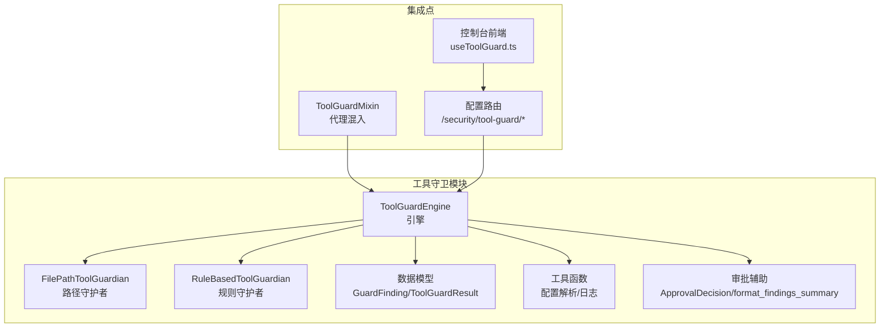
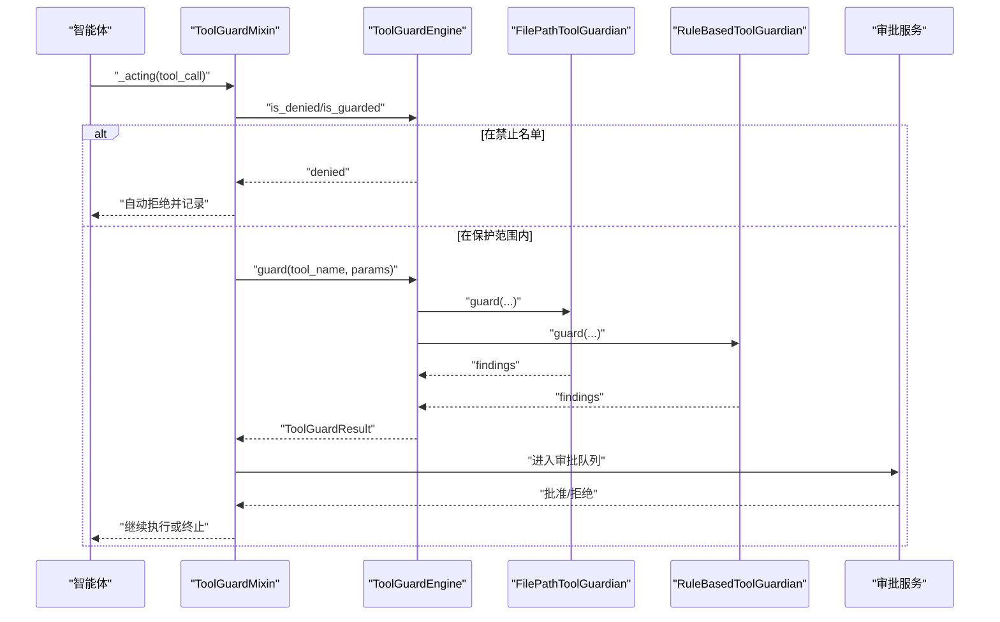
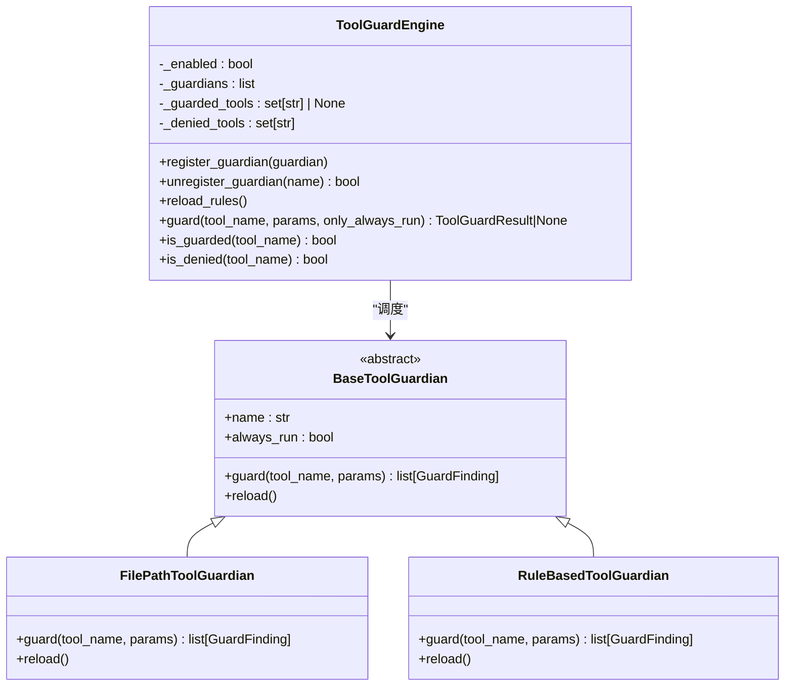
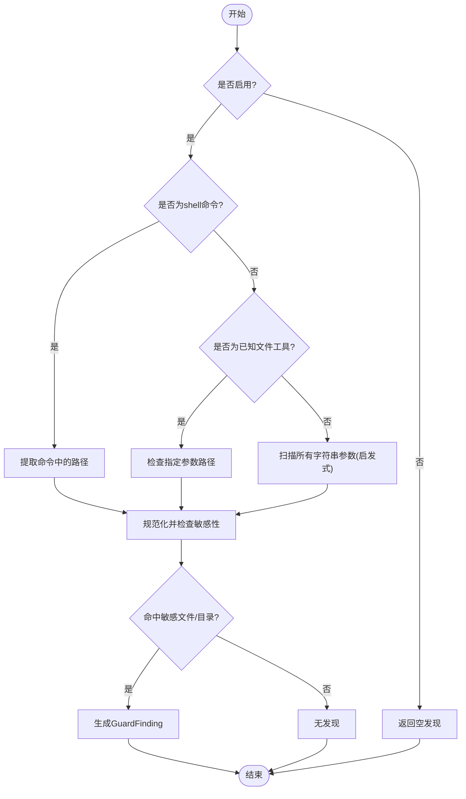
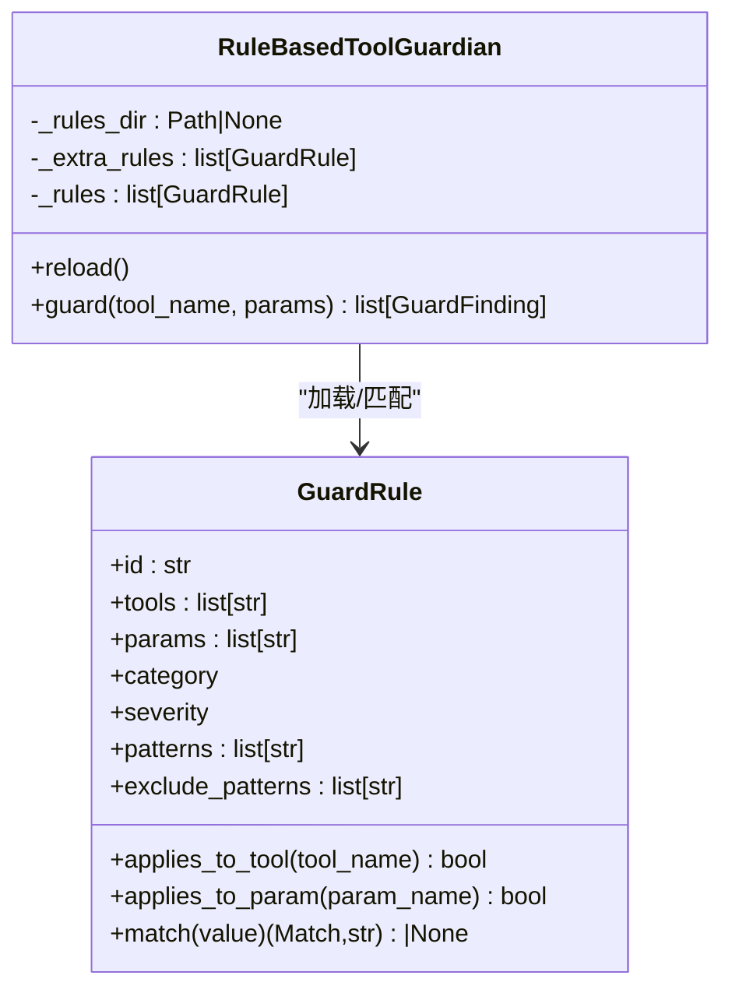
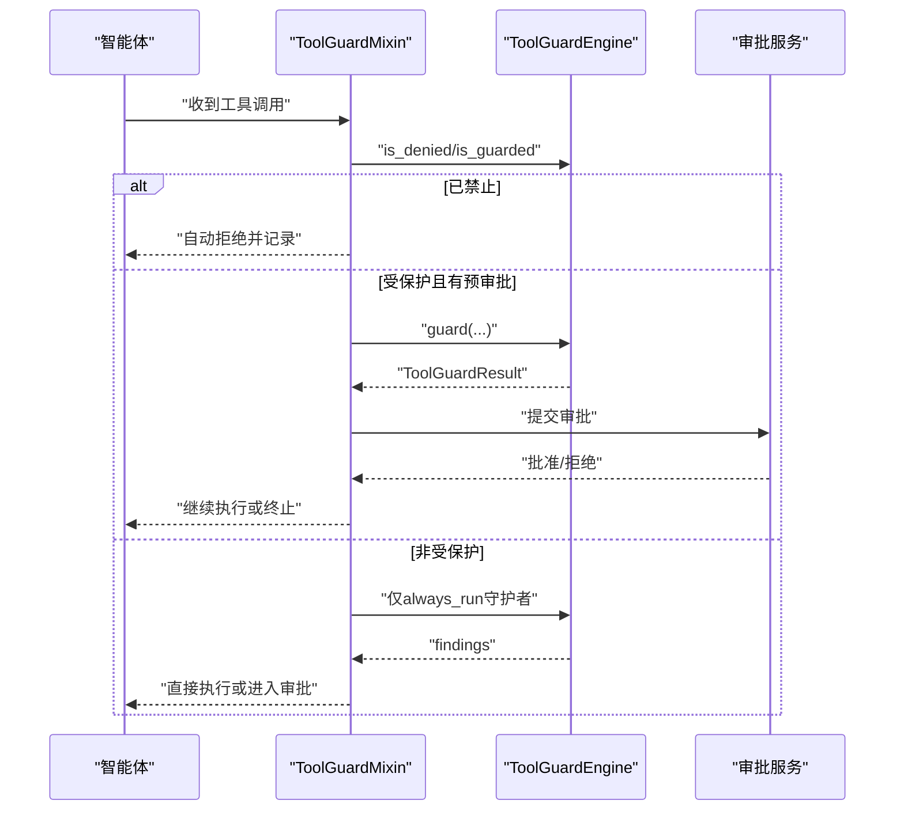
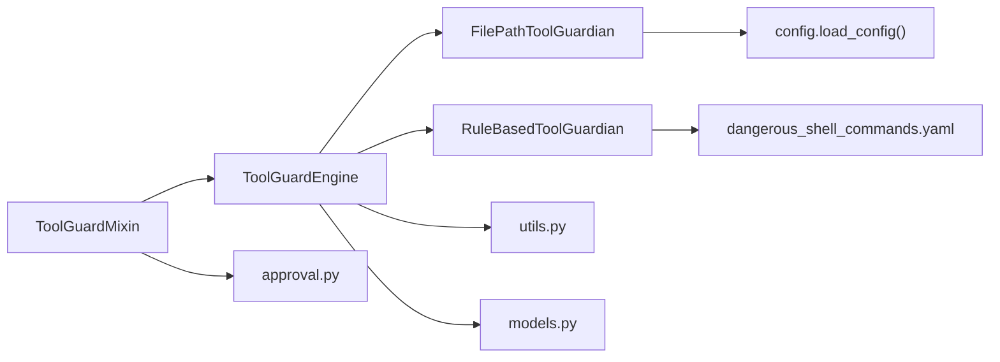

# 工具守卫开发

<cite>
**本文档引用的文件**
- [engine.py](file://src/copaw/security/tool_guard/engine.py)
- [file_guardian.py](file://src/copaw/security/tool_guard/guardians/file_guardian.py)
- [rule_guardian.py](file://src/copaw/security/tool_guard/guardians/rule_guardian.py)
- [models.py](file://src/copaw/security/tool_guard/models.py)
- [utils.py](file://src/copaw/security/tool_guard/utils.py)
- [approval.py](file://src/copaw/security/tool_guard/approval.py)
- [dangerous_shell_commands.yaml](file://src/copaw/security/tool_guard/rules/dangerous_shell_commands.yaml)
- [tool_guard_mixin.py](file://src/copaw/agents/tool_guard_mixin.py)
- [config.py](file://src/copaw/app/routers/config.py)
- [useToolGuard.ts](file://console/src/pages/Settings/Security/useToolGuard.ts)
- [default_policy.yaml](file://src/copaw/security/skill_scanner/data/default_policy.yaml)
</cite>

## 目录
1. [简介](#简介)
2. [项目结构](#项目结构)
3. [核心组件](#核心组件)
4. [架构总览](#架构总览)
5. [详细组件分析](#详细组件分析)
6. [依赖关系分析](#依赖关系分析)
7. [性能考虑](#性能考虑)
8. [故障排除指南](#故障排除指南)
9. [结论](#结论)
10. [附录](#附录)

## 简介
本指南面向需要在CoPaw中开发与维护工具守卫系统的工程师，系统性阐述工具守卫引擎架构、规则配置格式、危险命令检测算法、审批流程集成以及自定义规则开发方法。文档同时覆盖file_guardian与rule_guardian的具体实现细节，并提供规则开发示例、测试方法与安全最佳实践。

## 项目结构
工具守卫子系统位于src/copaw/security/tool_guard目录下，采用“守护者（Guardian）+ 引擎（Engine）+ 模型（Models）”的分层设计，支持可插拔的规则引擎与路径级防护，并通过代理混入（Mixin）无缝集成到智能体执行链路中。

**图表来源**
- [engine.py:53-237](file://src/copaw/security/tool_guard/engine.py#L53-L237)
- [file_guardian.py:161-341](file://src/copaw/security/tool_guard/guardians/file_guardian.py#L161-L341)
- [rule_guardian.py:280-382](file://src/copaw/security/tool_guard/guardians/rule_guardian.py#L280-L382)
- [models.py:60-184](file://src/copaw/security/tool_guard/models.py#L60-L184)
- [utils.py:18-162](file://src/copaw/security/tool_guard/utils.py#L18-L162)
- [approval.py:12-37](file://src/copaw/security/tool_guard/approval.py#L12-L37)
- [tool_guard_mixin.py:45-78](file://src/copaw/agents/tool_guard_mixin.py#L45-L78)
- [config.py:407-453](file://src/copaw/app/routers/config.py#L407-L453)
- [useToolGuard.ts:1-47](file://console/src/pages/Settings/Security/useToolGuard.ts#L1-L47)

**章节来源**
- [engine.py:1-238](file://src/copaw/security/tool_guard/engine.py#L1-L238)
- [file_guardian.py:1-342](file://src/copaw/security/tool_guard/guardians/file_guardian.py#L1-L342)
- [rule_guardian.py:1-383](file://src/copaw/security/tool_guard/guardians/rule_guardian.py#L1-L383)
- [models.py:1-185](file://src/copaw/security/tool_guard/models.py#L1-L185)
- [utils.py:1-163](file://src/copaw/security/tool_guard/utils.py#L1-L163)
- [approval.py:1-38](file://src/copaw/security/tool_guard/approval.py#L1-L38)
- [tool_guard_mixin.py:1-200](file://src/copaw/agents/tool_guard_mixin.py#L1-L200)
- [config.py:407-453](file://src/copaw/app/routers/config.py#L407-L453)
- [useToolGuard.ts:1-47](file://console/src/pages/Settings/Security/useToolGuard.ts#L1-L47)

## 核心组件
- 工具守卫引擎：负责注册与调度守护者、聚合结果、处理启用状态与范围配置。
- 路径守护者：基于敏感文件列表与目录白/黑名单，对文件路径参数进行阻断。
- 规则守护者：基于YAML签名规则（正则表达式）扫描参数字符串，快速识别高危模式。
- 数据模型：统一的威胁发现与结果聚合结构，便于日志与审批流程使用。
- 工具函数：解析受保护工具集、禁止工具集、环境变量与配置文件优先级。
- 审批辅助：审批决策枚举与摘要格式化工具。
- 代理混入：在智能体执行前拦截工具调用，触发审批流程。
- 配置接口：后端API提供开关、规则列表、内置规则读取等能力。
- 控制台前端：提供规则与配置的可视化管理入口。

**章节来源**
- [engine.py:53-237](file://src/copaw/security/tool_guard/engine.py#L53-L237)
- [file_guardian.py:161-341](file://src/copaw/security/tool_guard/guardians/file_guardian.py#L161-L341)
- [rule_guardian.py:280-382](file://src/copaw/security/tool_guard/guardians/rule_guardian.py#L280-L382)
- [models.py:60-184](file://src/copaw/security/tool_guard/models.py#L60-L184)
- [utils.py:18-162](file://src/copaw/security/tool_guard/utils.py#L18-L162)
- [approval.py:12-37](file://src/copaw/security/tool_guard/approval.py#L12-L37)
- [tool_guard_mixin.py:45-78](file://src/copaw/agents/tool_guard_mixin.py#L45-L78)
- [config.py:407-453](file://src/copaw/app/routers/config.py#L407-L453)
- [useToolGuard.ts:1-47](file://console/src/pages/Settings/Security/useToolGuard.ts#L1-L47)

## 架构总览
工具守卫采用“单例引擎 + 多守护者”的架构，守护者按需运行，结果统一聚合为ToolGuardResult。引擎支持动态重载规则与配置，代理混入在工具调用前进行拦截与审批。

**图表来源**
- [tool_guard_mixin.py:251-587](file://src/copaw/agents/tool_guard_mixin.py#L251-L587)
- [engine.py:169-226](file://src/copaw/security/tool_guard/engine.py#L169-L226)
- [file_guardian.py:290-341](file://src/copaw/security/tool_guard/guardians/file_guardian.py#L290-L341)
- [rule_guardian.py:329-382](file://src/copaw/security/tool_guard/guardians/rule_guardian.py#L329-L382)
- [approval.py:12-37](file://src/copaw/security/tool_guard/approval.py#L12-L37)

## 详细组件分析

### 工具守卫引擎（ToolGuardEngine）
- 单例懒加载：通过全局变量保存实例，避免重复初始化。
- 守护者注册：支持默认守护者集合与自定义扩展；提供注册/注销接口。
- 工具范围与禁止集：从环境变量、配置文件与默认值解析受保护工具集与禁止工具集。
- 结果聚合：遍历守护者，收集findings并统计耗时，失败守护者记录到failed列表。
- 动态重载：支持重新加载规则与刷新工具集。

**图表来源**
- [engine.py:53-237](file://src/copaw/security/tool_guard/engine.py#L53-L237)
- [file_guardian.py:161-341](file://src/copaw/security/tool_guard/guardians/file_guardian.py#L161-L341)
- [rule_guardian.py:280-382](file://src/copaw/security/tool_guard/guardians/rule_guardian.py#L280-L382)

**章节来源**
- [engine.py:53-237](file://src/copaw/security/tool_guard/engine.py#L53-L237)
- [utils.py:63-125](file://src/copaw/security/tool_guard/utils.py#L63-L125)

### 路径守护者（FilePathToolGuardian）
- 启用控制：从配置读取开关，默认启用。
- 敏感文件/目录：支持绝对路径与目录末尾斜杠两种形式，目录视为递归保护。
- 命令行路径提取：针对execute_shell_command，使用shell解析器提取重定向与路径参数。
- 通用路径扫描：对非已知文件工具的字符串参数进行启发式判断，识别疑似路径并阻断。
- 发现报告：生成标准化的GuardFinding，包含严重级别、类别、修复建议与元数据。

**图表来源**
- [file_guardian.py:290-341](file://src/copaw/security/tool_guard/guardians/file_guardian.py#L290-L341)

**章节来源**
- [file_guardian.py:161-341](file://src/copaw/security/tool_guard/guardians/file_guardian.py#L161-L341)

### 规则守护者（RuleBasedToolGuardian）
- 规则来源：默认从包内rules目录加载，支持自定义目录与额外规则。
- 规则格式：每条规则包含id、适用工具/参数、威胁类别、严重级别、正则模式与排除模式。
- 匹配逻辑：先排除匹配再正则匹配，生成上下文片段与修复建议。
- 自定义规则：从配置读取custom_rules与disabled_rules，合并生效。

**图表来源**
- [rule_guardian.py:52-146](file://src/copaw/security/tool_guard/guardians/rule_guardian.py#L52-L146)
- [rule_guardian.py:280-382](file://src/copaw/security/tool_guard/guardians/rule_guardian.py#L280-L382)

**章节来源**
- [rule_guardian.py:1-383](file://src/copaw/security/tool_guard/guardians/rule_guardian.py#L1-L383)
- [dangerous_shell_commands.yaml:1-120](file://src/copaw/security/tool_guard/rules/dangerous_shell_commands.yaml#L1-L120)

### 数据模型与审批辅助
- GuardFinding：统一的威胁发现结构，包含规则ID、类别、严重级别、标题、描述、匹配值、上下文片段、修复建议与元数据。
- ToolGuardResult：聚合一次工具调用的全部发现，包含最大严重级别、守护者使用情况、失败守护者列表与耗时。
- ApprovalDecision：审批决策枚举（批准/拒绝/超时）。
- format_findings_summary：将发现摘要格式化为Markdown文本，用于前端展示与用户提示。

**章节来源**
- [models.py:60-184](file://src/copaw/security/tool_guard/models.py#L60-L184)
- [approval.py:12-37](file://src/copaw/security/tool_guard/approval.py#L12-L37)

### 代理混入与审批流程集成
- 拦截时机：在智能体的_acting阶段拦截工具调用，区分禁止工具、受保护工具与非受保护工具。
- 审批流程：若存在会话ID且需要审批，则将发现摘要与工具信息写入内存并标记，等待审批服务处理。
- 并发安全：使用锁确保并行工具调用时不产生竞态。
- 强制执行：支持runner注入的强制工具调用，校验后加入执行队列。

**图表来源**
- [tool_guard_mixin.py:251-587](file://src/copaw/agents/tool_guard_mixin.py#L251-L587)
- [approval.py:12-37](file://src/copaw/security/tool_guard/approval.py#L12-L37)

**章节来源**
- [tool_guard_mixin.py:251-587](file://src/copaw/agents/tool_guard_mixin.py#L251-L587)

### 配置与控制台集成
- 后端API：
  - 获取/更新工具守卫总开关与规则：/security/tool-guard
  - 获取内置规则：/security/tool-guard/builtin-rules
- 前端hooks：
  - useToolGuard：拉取配置、内置规则、自定义规则与禁用规则集合，支持实时更新。

**章节来源**
- [config.py:407-453](file://src/copaw/app/routers/config.py#L407-L453)
- [useToolGuard.ts:1-47](file://console/src/pages/Settings/Security/useToolGuard.ts#L1-L47)

## 依赖关系分析
- 组件耦合：
  - Engine与Guardian之间为弱耦合，通过抽象接口扩展新守护者。
  - Mixin依赖Engine与审批服务，但不直接依赖具体守护者类型。
  - 规则守护者依赖YAML与正则，路径守护者依赖配置与路径解析。
- 外部依赖：
  - 配置加载（copaw.config.load_config）
  - 日志系统（logging）
  - 正则表达式（re）、YAML解析（yaml）、shell解析（shlex）

**图表来源**
- [engine.py:53-237](file://src/copaw/security/tool_guard/engine.py#L53-L237)
- [file_guardian.py:161-341](file://src/copaw/security/tool_guard/guardians/file_guardian.py#L161-L341)
- [rule_guardian.py:280-382](file://src/copaw/security/tool_guard/guardians/rule_guardian.py#L280-L382)
- [utils.py:18-162](file://src/copaw/security/tool_guard/utils.py#L18-L162)
- [models.py:60-184](file://src/copaw/security/tool_guard/models.py#L60-L184)
- [dangerous_shell_commands.yaml:1-120](file://src/copaw/security/tool_guard/rules/dangerous_shell_commands.yaml#L1-L120)
- [tool_guard_mixin.py:45-78](file://src/copaw/agents/tool_guard_mixin.py#L45-L78)
- [approval.py:12-37](file://src/copaw/security/tool_guard/approval.py#L12-L37)

**章节来源**
- [engine.py:53-237](file://src/copaw/security/tool_guard/engine.py#L53-L237)
- [file_guardian.py:161-341](file://src/copaw/security/tool_guard/guardians/file_guardian.py#L161-L341)
- [rule_guardian.py:280-382](file://src/copaw/security/tool_guard/guardians/rule_guardian.py#L280-L382)
- [utils.py:18-162](file://src/copaw/security/tool_guard/utils.py#L18-L162)
- [models.py:60-184](file://src/copaw/security/tool_guard/models.py#L60-L184)
- [dangerous_shell_commands.yaml:1-120](file://src/copaw/security/tool_guard/rules/dangerous_shell_commands.yaml#L1-L120)
- [tool_guard_mixin.py:45-78](file://src/copaw/agents/tool_guard_mixin.py#L45-L78)
- [approval.py:12-37](file://src/copaw/security/tool_guard/approval.py#L12-L37)

## 性能考虑
- 正则编译缓存：规则守护者在构造时预编译正则，减少运行时开销。
- 字符串扫描：规则守护者将参数值转换为字符串进行扫描，避免复杂对象解析成本。
- 选择性执行：only_always_run模式仅运行always_run守护者，降低非受保护工具的检查成本。
- 路径提取优化：shell命令路径提取采用最长优先匹配与去重，减少重复告警。
- 日志分级：高严重级别发现使用warning输出，低级别使用info，便于生产环境分级处理。

[本节为一般性指导，无需特定文件来源]

## 故障排除指南
- 守护者异常：
  - 引擎捕获守护者异常并记录到guardians_failed，不影响其他守护者执行。
  - 建议检查规则正则语法与配置项完整性。
- 配置未生效：
  - 确认环境变量与配置文件优先级顺序：环境变量 > 配置文件 > 默认值。
  - 使用reload_rules刷新规则与工具集。
- 审批流程卡住：
  - 检查会话ID是否存在，确认审批服务可用。
  - 查看内存中标记为工具守卫拒绝的消息，确认是否正确清理。
- 前端规则不可见：
  - 确认后端API返回内置规则列表与配置一致。
  - 检查自定义规则是否通过配置正确下发。

**章节来源**
- [engine.py:214-223](file://src/copaw/security/tool_guard/engine.py#L214-L223)
- [utils.py:63-125](file://src/copaw/security/tool_guard/utils.py#L63-L125)
- [tool_guard_mixin.py:251-587](file://src/copaw/agents/tool_guard_mixin.py#L251-L587)
- [config.py:407-453](file://src/copaw/app/routers/config.py#L407-L453)
- [useToolGuard.ts:1-47](file://console/src/pages/Settings/Security/useToolGuard.ts#L1-L47)

## 结论
工具守卫系统通过“规则+路径”的双层防护与可插拔引擎架构，在不侵入业务逻辑的前提下实现了对危险工具调用的前置拦截与审批集成。结合完善的配置与前端管理界面，开发者可以快速定制安全策略并持续演进规则体系。

[本节为总结性内容，无需特定文件来源]

## 附录

### 规则配置格式与开发示例
- 规则文件位置：src/copaw/security/tool_guard/rules/dangerous_shell_commands.yaml
- 规则字段：
  - id：规则唯一标识
  - tools/tools：适用工具名（可为空表示全部）
  - params/param：适用参数名（可为空表示全部）
  - category：威胁类别（参考GuardThreatCategory）
  - severity：严重级别（CRITICAL/HIGH/MEDIUM/LOW/INFO/SAFE）
  - patterns：正则模式列表
  - exclude_patterns：排除模式列表（可选）
  - description/remediation：描述与修复建议
- 示例规则：
  - 删除类命令（rm/mv）：HIGH严重级别，检测删除/移动操作
  - 文件系统破坏：CRITICAL严重级别，检测mkfs/dd等破坏性命令
  - 网络加载器：CRITICAL严重级别，检测curl|bash等远程执行
  - 反向连接与隧道：CRITICAL严重级别，检测nc/socat等网络滥用
  - 权限篡改与持久化：HIGH严重级别，检测sudo/crontab/authorized_keys等

**章节来源**
- [dangerous_shell_commands.yaml:1-120](file://src/copaw/security/tool_guard/rules/dangerous_shell_commands.yaml#L1-L120)
- [rule_guardian.py:8-22](file://src/copaw/security/tool_guard/guardians/rule_guardian.py#L8-L22)
- [models.py:36-53](file://src/copaw/security/tool_guard/models.py#L36-L53)

### 模式匹配实现要点
- 正则匹配：规则守护者预编译正则，运行时逐条匹配并生成上下文片段。
- 排除优先：先检查exclude_patterns，再检查patterns，避免误报。
- 参数筛选：根据tools与params精确限定匹配范围，减少误报与性能开销。

**章节来源**
- [rule_guardian.py:131-146](file://src/copaw/security/tool_guard/guardians/rule_guardian.py#L131-L146)

### 威胁检测技术与安全策略
- 威胁分类：命令注入、数据泄露、路径穿越、敏感文件访问、网络滥用、凭证暴露、资源滥用、代码执行、权限提升等。
- 策略配置：通过配置文件与环境变量设置受保护工具集、禁止工具集、规则禁用集与自定义规则。
- 日志与审计：结构化日志输出，支持按严重级别分级，便于审计与监控。

**章节来源**
- [models.py:36-53](file://src/copaw/security/tool_guard/models.py#L36-L53)
- [utils.py:18-162](file://src/copaw/security/tool_guard/utils.py#L18-L162)
- [default_policy.yaml:1-245](file://src/copaw/security/skill_scanner/data/default_policy.yaml#L1-L245)

### 测试方法与最佳实践
- 单元测试建议：
  - 规则守护者：构造不同参数组合，验证匹配与排除行为。
  - 路径守护者：覆盖绝对路径、相对路径、目录、shell命令路径提取等场景。
  - 引擎：验证only_always_run、守护者失败回退、规则重载等功能。
- 集成测试建议：
  - 代理混入：模拟工具调用、审批流程与内存标记清理。
  - 配置接口：验证开关切换、规则列表拉取与自定义规则生效。
- 最佳实践：
  - 从内置规则开始，逐步引入自定义规则，保持exclude_patterns最小化。
  - 将高危工具纳入受保护范围，必要时加入禁止工具集。
  - 定期审查发现日志，调整规则阈值与排除规则，降低误报率。

[本节为一般性指导，无需特定文件来源]