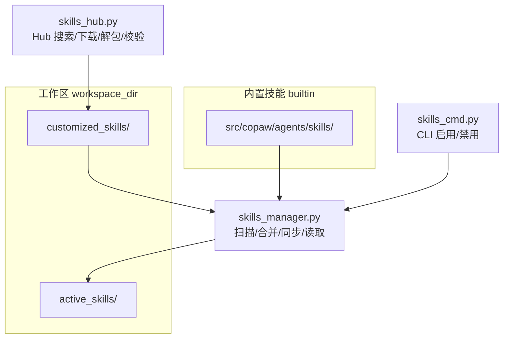
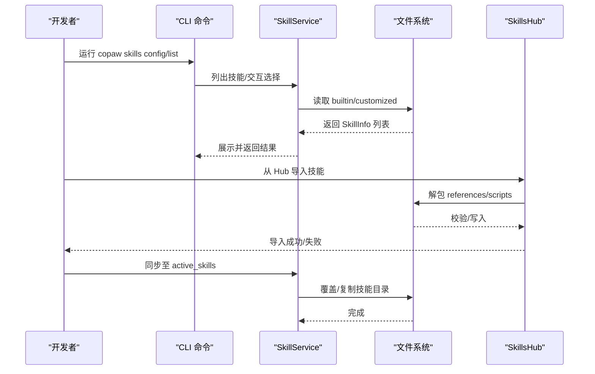
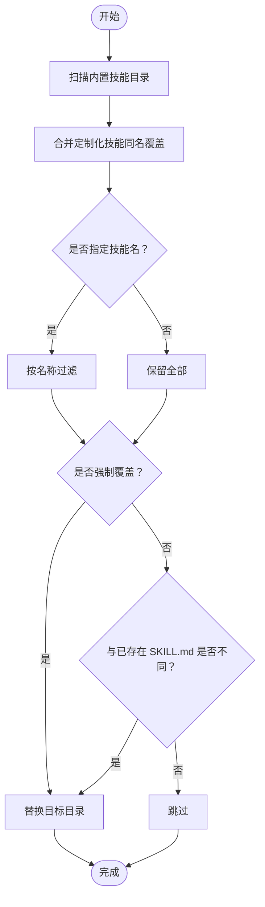
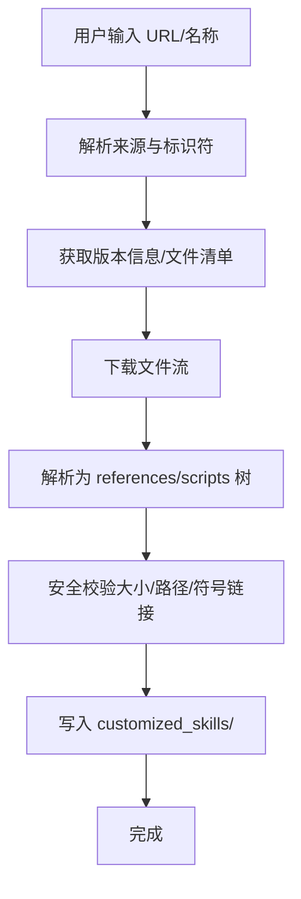
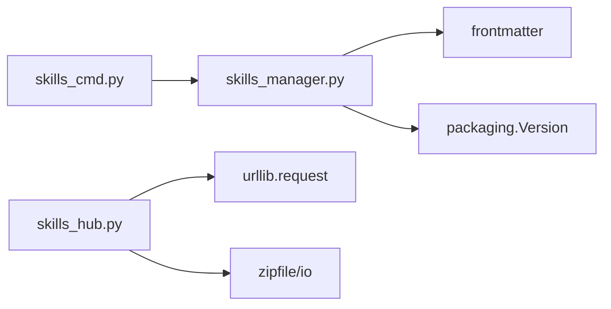

# 技能开发

<cite>
**本文引用的文件**
- [src/copaw/agents/skills/copaw_source_index/SKILL.md](file://src/copaw/agents/skills/copaw_source_index/SKILL.md)
- [src/copaw/agents/skills/pdf/SKILL.md](file://src/copaw/agents/skills/pdf/SKILL.md)
- [src/copaw/agents/skills/pdf/scripts/convert_pdf_to_images.py](file://src/copaw/agents/skills/pdf/scripts/convert_pdf_to_images.py)
- [src/copaw/agents/skills/docx/SKILL.md](file://src/copaw/agents/skills/docx/SKILL.md)
- [src/copaw/agents/skills/docx/scripts/office/unpack.py](file://src/copaw/agents/skills/docx/scripts/office/unpack.py)
- [src/copaw/agents/skills/docx/scripts/accept_changes.py](file://src/copaw/agents/skills/docx/scripts/accept_changes.py)
- [src/copaw/agents/skills_hub.py](file://src/copaw/agents/skills_hub.py)
- [src/copaw/agents/skills_manager.py](file://src/copaw/agents/skills_manager.py)
- [src/copaw/cli/skills_cmd.py](file://src/copaw/cli/skills_cmd.py)
- [src/copaw/agents/skills/himalaya/SKILL.md](file://src/copaw/agents/skills/himalaya/SKILL.md)
- [src/copaw/agents/skills/himalaya/references/configuration.md](file://src/copaw/agents/skills/himalaya/references/configuration.md)
</cite>

## 目录
1. [简介](#简介)
2. [项目结构](#项目结构)
3. [核心组件](#核心组件)
4. [架构总览](#架构总览)
5. [详细组件分析](#详细组件分析)
6. [依赖分析](#依赖分析)
7. [性能考虑](#性能考虑)
8. [故障排查指南](#故障排查指南)
9. [结论](#结论)
10. [附录](#附录)

## 简介
本指南面向希望在 CoPaw 中开发、调试与优化“技能”的工程师与高级用户。内容覆盖：
- 技能目录结构与 SKILL.md 格式规范
- references/ 与 scripts/ 的职责与最佳实践
- 技能描述编写（触发关键词、使用场景、最佳实践）
- 技能注册与发现机制（内置、定制化、激活）
- 技能中心（Hub）集成与 Hub 打包格式
- 调试方法与性能优化建议
- 技能模板与开发工具使用
- 内置技能案例：copaw_source_index、pdf、docx 等

## 项目结构
CoPaw 的技能系统围绕“工作区”组织，核心目录与职责如下：
- 工作区目录（workspace_dir）
  - customized_skills：用户自定义技能（优先级高于内置）
  - active_skills：当前启用的技能（由同步流程生成）
- 内置技能目录（builtin）
  - src/copaw/agents/skills：内置技能集合
- 技能管理与发现
  - src/copaw/agents/skills_manager.py：扫描、合并、同步、读取技能
  - src/copaw/agents/skills_hub.py：Hub 搜索、下载、解包、校验
  - src/copaw/cli/skills_cmd.py：CLI 交互式启用/禁用技能

**图示来源**
- [src/copaw/agents/skills_manager.py](file://src/copaw/agents/skills_manager.py)
- [src/copaw/agents/skills_hub.py](file://src/copaw/agents/skills_hub.py)
- [src/copaw/cli/skills_cmd.py](file://src/copaw/cli/skills_cmd.py)

**章节来源**
- [src/copaw/agents/skills_manager.py](file://src/copaw/agents/skills_manager.py)
- [src/copaw/agents/skills_hub.py](file://src/copaw/agents/skills_hub.py)
- [src/copaw/cli/skills_cmd.py](file://src/copaw/cli/skills_cmd.py)

## 核心组件
- 技能信息模型（SkillInfo）
  - 字段：name、description、content、source、path、references、scripts
  - 作用：统一表示内置、定制化、激活状态的技能元数据与树形结构
- 技能服务（SkillService）
  - 列出所有技能（内置/定制化去重）
  - 列出可用技能（active）
  - 创建新技能（含 references/scripts 树写入）
  - 导入 Hub 技能（校验、解包、落盘）
- 技能同步
  - 将内置与定制化技能同步至 active_skills，定制化覆盖内置
  - 支持按名称过滤与强制覆盖
- 技能 Hub
  - 支持 ClawHub、skills.sh、skillsmp.com、lobehub、ModelScope 等来源
  - 自动解析 URL、版本、文件列表，下载并解包为 references/scripts 树
  - 安全校验（大小限制、路径安全、禁止符号链接）

**章节来源**
- [src/copaw/agents/skills_manager.py](file://src/copaw/agents/skills_manager.py)
- [src/copaw/agents/skills_hub.py](file://src/copaw/agents/skills_hub.py)

## 架构总览
技能生命周期从“发现与注册”到“激活与运行”，贯穿 CLI、管理器与 Hub。

**图示来源**
- [src/copaw/cli/skills_cmd.py](file://src/copaw/cli/skills_cmd.py)
- [src/copaw/agents/skills_manager.py](file://src/copaw/agents/skills_manager.py)
- [src/copaw/agents/skills_hub.py](file://src/copaw/agents/skills_hub.py)

## 详细组件分析

### 技能目录结构与 SKILL.md 规范
- 必备文件
  - SKILL.md：YAML Front Matter 包含 name、description、metadata（可选）
- 可选目录
  - references/：文档、配置、参考材料（树形结构）
  - scripts/：Python/Shell 辅助脚本（树形结构）
- 最佳实践
  - references/ 仅存放只读资料，避免在运行期修改
  - scripts/ 保持幂等与可重复执行，必要时支持参数化
  - SKILL.md 描述清晰、触发关键词明确、使用场景具体

**章节来源**
- [src/copaw/agents/skills/copaw_source_index/SKILL.md](file://src/copaw/agents/skills/copaw_source_index/SKILL.md)
- [src/copaw/agents/skills/pdf/SKILL.md](file://src/copaw/agents/skills/pdf/SKILL.md)
- [src/copaw/agents/skills/docx/SKILL.md](file://src/copaw/agents/skills/docx/SKILL.md)

### 技能注册与发现机制
- 发现规则
  - active_skills：仅扫描包含 SKILL.md 的目录
  - 内置与定制化：递归扫描目录树，构建 references/scripts 树
- 同步策略
  - 内置技能目录 → active_skills
  - 定制化技能目录 → active_skills（同名覆盖）
  - 支持按名称过滤与强制覆盖
- 版本与回退
  - 内置技能通过 metadata 中的版本号进行比较，新版本覆盖旧版
  - 未匹配时回退到目录名作为技能名

**图示来源**
- [src/copaw/agents/skills_manager.py](file://src/copaw/agents/skills_manager.py)

**章节来源**
- [src/copaw/agents/skills_manager.py](file://src/copaw/agents/skills_manager.py)

### 技能中心（Hub）集成与打包格式
- 支持来源
  - ClawHub、skills.sh、skillsmp.com、lobehub、ModelScope
- 打包格式
  - Hub 返回 JSON，包含 content/skill_md/skillMd/files 等字段
  - 自动解析为 references/scripts 树（仅保留 references/、scripts/ 与 SKILL.md）
  - 其他文件作为额外资产写入技能根目录
- 安全与校验
  - 限制最大解压体积与条目数
  - 校验路径合法性，拒绝符号链接
  - 提供取消检查钩子，支持用户中断导入
- 版本与 URL 解析
  - 自动提取版本号，支持请求版本与最新版本回退
  - 支持多种 URL 形态（ClawHub、skills.sh、skillsmp.com、lobehub、ModelScope）

**图示来源**
- [src/copaw/agents/skills_hub.py](file://src/copaw/agents/skills_hub.py)

**章节来源**
- [src/copaw/agents/skills_hub.py](file://src/copaw/agents/skills_hub.py)

### CLI 交互与启用/禁用
- copaw skills list：展示技能名称、来源与启用状态
- copaw skills config：交互式勾选启用/禁用，确认后调用 SkillService.apply
- 默认策略：首次配置时默认启用全部技能，后续保持当前状态

**章节来源**
- [src/copaw/cli/skills_cmd.py](file://src/copaw/cli/skills_cmd.py)

### 内置技能案例

#### copaw_source_index
- 作用：将用户问题的主题与关键词映射到官方文档与源码入口，辅助内置 QA Agent 快速定位
- 使用步骤：提取主题 → 解析 COPAW_ROOT → 优先读文档 → 不替代 read_file，需进一步读取核对
- 关键点：约定文档完整路径与源码入口，避免盲目遍历

**章节来源**
- [src/copaw/agents/skills/copaw_source_index/SKILL.md](file://src/copaw/agents/skills/copaw_source_index/SKILL.md)

#### pdf
- 作用：PDF 文件处理（读取、提取文本/表格、合并/拆分、旋转、加水印、创建、填表单、加密/解密、提取图片、OCR）
- 脚本示例：convert_pdf_to_images.py 将 PDF 页面转为 PNG 图像，支持缩放
- 最佳实践：优先使用 pypdf/pdfplumber/reportlab 等库；命令行工具用于批量操作

**章节来源**
- [src/copaw/agents/skills/pdf/SKILL.md](file://src/copaw/agents/skills/pdf/SKILL.md)
- [src/copaw/agents/skills/pdf/scripts/convert_pdf_to_images.py](file://src/copaw/agents/skills/pdf/scripts/convert_pdf_to_images.py)

#### docx
- 作用：创建、读取、编辑 Word 文档（.docx），支持跟踪修订、注释、图片插入、样式与表格
- 工具链：docx（JS 库）、LibreOffice（.doc 转 .docx、接受修订、导出 PDF）、pandoc（提取文本）
- 脚本示例：
  - unpack.py：解包 DOCX，美化 XML，可选合并相邻运行与简化修订
  - accept_changes.py：使用 LibreOffice 宏接受所有修订，输出干净文档
- 最佳实践：严格设置页面尺寸与 DXA 单位；表格必须同时设置 table width 与 cell width；图片必须指定类型；TOC 仅使用内置标题级别

**章节来源**
- [src/copaw/agents/skills/docx/SKILL.md](file://src/copaw/agents/skills/docx/SKILL.md)
- [src/copaw/agents/skills/docx/scripts/office/unpack.py](file://src/copaw/agents/skills/docx/scripts/office/unpack.py)
- [src/copaw/agents/skills/docx/scripts/accept_changes.py](file://src/copaw/agents/skills/docx/scripts/accept_changes.py)

#### himalaya
- 作用：演示 references/ 与 SKILL.md 的配合，提供配置参考文档
- 结构：SKILL.md + references/configuration.md

**章节来源**
- [src/copaw/agents/skills/himalaya/SKILL.md](file://src/copaw/agents/skills/himalaya/SKILL.md)
- [src/copaw/agents/skills/himalaya/references/configuration.md](file://src/copaw/agents/skills/himalaya/references/configuration.md)

## 依赖分析
- 组件耦合
  - skills_manager.py 与 skills_hub.py 通过 SkillService 协作，前者负责文件系统层面的扫描与同步，后者负责网络与解包
  - CLI 仅依赖 SkillService 接口，低耦合
- 外部依赖
  - frontmatter：解析 SKILL.md YAML Front Matter
  - packaging.Version：内置技能版本比较
  - urllib/urllib.request：Hub 请求与鉴权头注入
  - zipfile/io：Hub 打包解压与安全校验

**图示来源**
- [src/copaw/agents/skills_manager.py](file://src/copaw/agents/skills_manager.py)
- [src/copaw/agents/skills_hub.py](file://src/copaw/agents/skills_hub.py)
- [src/copaw/cli/skills_cmd.py](file://src/copaw/cli/skills_cmd.py)

**章节来源**
- [src/copaw/agents/skills_manager.py](file://src/copaw/agents/skills_manager.py)
- [src/copaw/agents/skills_hub.py](file://src/copaw/agents/skills_hub.py)
- [src/copaw/cli/skills_cmd.py](file://src/copaw/cli/skills_cmd.py)

## 性能考虑
- I/O 与压缩
  - Hub 解包限制解压体积与条目数，避免内存与磁盘压力
  - 建议在 scripts/ 中对大文件操作采用分页/分块策略
- 并发与重试
  - Hub 请求支持重试与指数退避，合理设置超时与重试次数
- 依赖安装
  - PDF/DOCX 等技能涉及外部二进制（poppler、LibreOffice 等），建议在 CI/本地镜像中预装，减少运行时等待
- 清理与修剪
  - 使用 prune_active_skills 仅保留启用技能，降低扫描与加载开销

[本节为通用指导，无需特定文件引用]

## 故障排查指南
- SKILL.md 解析失败
  - 现象：日志提示 Front Matter 解析错误或缺失 name/description
  - 处理：确保 YAML Front Matter 正确，字段齐全
- Hub 导入失败
  - 现象：下载/解包报错、429/5xx、速率限制
  - 处理：设置 GITHUB_TOKEN 提高 GitHub API 限额；调整 COPAW_SKILLS_HUB_HTTP_* 环境变量；重试
- 路径安全与权限
  - 现象：解压时报 unsafe path/symlink 错误
  - 处理：检查 Hub 包合法性；确保写入目录权限正确
- CLI 启用/禁用无效
  - 现象：变更未生效
  - 处理：确认 active_skills 同步成功；检查工作区路径与 agent 配置

**章节来源**
- [src/copaw/agents/skills_manager.py](file://src/copaw/agents/skills_manager.py)
- [src/copaw/agents/skills_hub.py](file://src/copaw/agents/skills_hub.py)
- [src/copaw/cli/skills_cmd.py](file://src/copaw/cli/skills_cmd.py)

## 结论
通过规范的 SKILL.md、清晰的 references/scripts 结构、完善的同步与 Hub 集成，以及 CLI 与管理器的协同，CoPaw 为技能开发提供了稳定、可扩展且易于维护的框架。遵循本文的最佳实践与调试建议，可显著提升技能质量与交付效率。

[本节为总结性内容，无需特定文件引用]

## 附录

### 技能开发模板与步骤
- 创建目录：customized_skills/<技能名>
- 编写 SKILL.md：包含 name、description、metadata（可选）
- 准备 references/ 与 scripts/：只读资料与可复用脚本
- 使用 CLI 启用：copaw skills config
- 验证：copaw skills list 查看状态

**章节来源**
- [src/copaw/agents/skills_manager.py](file://src/copaw/agents/skills_manager.py)
- [src/copaw/cli/skills_cmd.py](file://src/copaw/cli/skills_cmd.py)

### 开发工具与脚手架建议
- Hub 导入：支持多种来源，自动解析版本与文件清单
- 安全校验：体积上限、路径合法性、禁止符号链接
- 取消钩子：支持用户中断导入任务

**章节来源**
- [src/copaw/agents/skills_hub.py](file://src/copaw/agents/skills_hub.py)