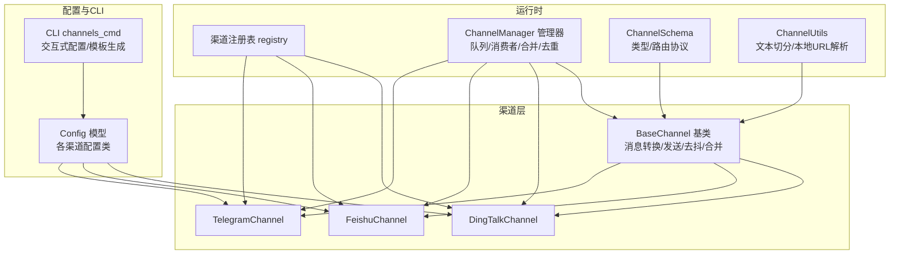
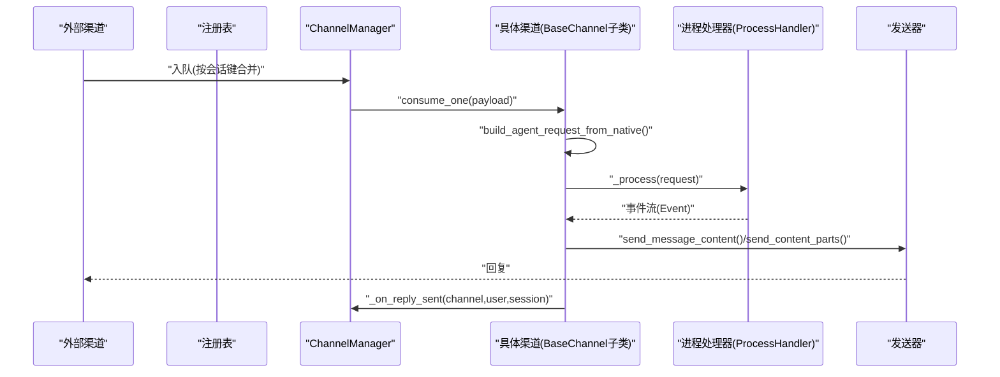
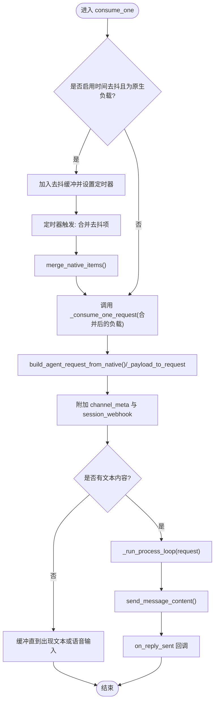
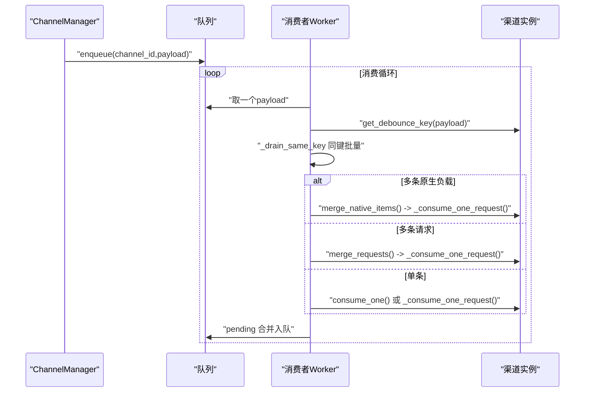
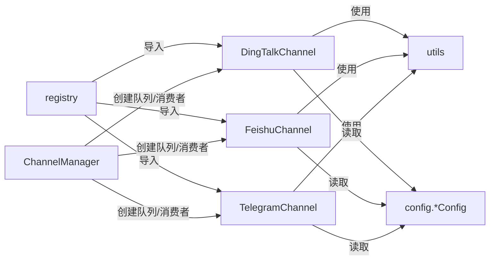

# 渠道开发

<cite>
**本文引用的文件**
- [src/copaw/app/channels/base.py](file://src/copaw/app/channels/base.py)
- [src/copaw/app/channels/manager.py](file://src/copaw/app/channels/manager.py)
- [src/copaw/app/channels/registry.py](file://src/copaw/app/channels/registry.py)
- [src/copaw/app/channels/schema.py](file://src/copaw/app/channels/schema.py)
- [src/copaw/app/channels/utils.py](file://src/copaw/app/channels/utils.py)
- [src/copaw/app/channels/dingtalk/channel.py](file://src/copaw/app/channels/dingtalk/channel.py)
- [src/copaw/app/channels/feishu/channel.py](file://src/copaw/app/channels/feishu/channel.py)
- [src/copaw/app/channels/telegram/channel.py](file://src/copaw/app/channels/telegram/channel.py)
- [src/copaw/cli/channels_cmd.py](file://src/copaw/cli/channels_cmd.py)
- [src/copaw/config/config.py](file://src/copaw/config/config.py)
</cite>

## 目录
1. [简介](#简介)
2. [项目结构](#项目结构)
3. [核心组件](#核心组件)
4. [架构总览](#架构总览)
5. [详细组件分析](#详细组件分析)
6. [依赖分析](#依赖分析)
7. [性能考虑](#性能考虑)
8. [故障排查指南](#故障排查指南)
9. [结论](#结论)
10. [附录](#附录)

## 简介
本指南面向希望为 CoPaw 开发“渠道（Channel）”的开发者，围绕 BaseChannel 基类继承、消息处理生命周期、content_parts 转换机制、长连接与队列管理、渠道注册流程、自定义渠道实现、CLI 工具集成与配置管理进行系统化讲解，并给出钉钉、飞书、Telegram 等现有渠道的实现模式参考，帮助你快速完成新渠道开发、测试与部署。

## 项目结构
CoPaw 的渠道体系由“通道基类 + 管理器 + 注册表 + 具体渠道实现 + 配置 + CLI”构成，形成统一的消息输入输出抽象与异步队列处理框架。

图示来源
- [src/copaw/app/channels/base.py:69-868](file://src/copaw/app/channels/base.py#L69-L868)
- [src/copaw/app/channels/manager.py:114-580](file://src/copaw/app/channels/manager.py#L114-L580)
- [src/copaw/app/channels/registry.py:19-138](file://src/copaw/app/channels/registry.py#L19-L138)
- [src/copaw/app/channels/schema.py:12-71](file://src/copaw/app/channels/schema.py#L12-L71)
- [src/copaw/app/channels/utils.py:18-134](file://src/copaw/app/channels/utils.py#L18-L134)
- [src/copaw/config/config.py:31-208](file://src/copaw/config/config.py#L31-L208)
- [src/copaw/cli/channels_cmd.py:62-158](file://src/copaw/cli/channels_cmd.py#L62-L158)

章节来源
- [src/copaw/app/channels/base.py:69-868](file://src/copaw/app/channels/base.py#L69-L868)
- [src/copaw/app/channels/manager.py:114-580](file://src/copaw/app/channels/manager.py#L114-L580)
- [src/copaw/app/channels/registry.py:19-138](file://src/copaw/app/channels/registry.py#L19-L138)
- [src/copaw/app/channels/schema.py:12-71](file://src/copaw/app/channels/schema.py#L12-L71)
- [src/copaw/app/channels/utils.py:18-134](file://src/copaw/app/channels/utils.py#L18-L134)
- [src/copaw/config/config.py:31-208](file://src/copaw/config/config.py#L31-L208)
- [src/copaw/cli/channels_cmd.py:62-158](file://src/copaw/cli/channels_cmd.py#L62-L158)

## 核心组件
- BaseChannel：定义统一的渠道接口、消息到 AgentRequest 的转换、发送策略、去抖与合并、会话键解析、错误处理钩子等。
- ChannelManager：负责为每个启用的渠道创建队列与消费者，按会话键合并批量消息，协调去重与回放。
- Registry：内置渠道清单与插件渠道发现，统一注册入口。
- Schema：渠道类型标识、路由地址模型与转换协议。
- Utils：通用工具（文本切分、本地文件URL解析）。
- Config：各渠道配置模型（如 DingTalkConfig、FeishuConfig、TelegramConfig 等）。
- CLI：交互式渠道配置与模板生成。

章节来源
- [src/copaw/app/channels/base.py:69-868](file://src/copaw/app/channels/base.py#L69-L868)
- [src/copaw/app/channels/manager.py:114-580](file://src/copaw/app/channels/manager.py#L114-L580)
- [src/copaw/app/channels/registry.py:19-138](file://src/copaw/app/channels/registry.py#L19-L138)
- [src/copaw/app/channels/schema.py:12-71](file://src/copaw/app/channels/schema.py#L12-L71)
- [src/copaw/app/channels/utils.py:18-134](file://src/copaw/app/channels/utils.py#L18-L134)
- [src/copaw/config/config.py:31-208](file://src/copaw/config/config.py#L31-L208)
- [src/copaw/cli/channels_cmd.py:62-158](file://src/copaw/cli/channels_cmd.py#L62-L158)

## 架构总览
下图展示从“外部消息到达”到“Agent 处理并回复”的完整链路，以及 ChannelManager 如何在其中承担“队列与批处理”的角色。

图示来源
- [src/copaw/app/channels/manager.py:322-364](file://src/copaw/app/channels/manager.py#L322-L364)
- [src/copaw/app/channels/base.py:443-583](file://src/copaw/app/channels/base.py#L443-L583)

章节来源
- [src/copaw/app/channels/manager.py:322-364](file://src/copaw/app/channels/manager.py#L322-L364)
- [src/copaw/app/channels/base.py:443-583](file://src/copaw/app/channels/base.py#L443-L583)

## 详细组件分析

### BaseChannel 组件分析
- 继承与职责
  - 所有渠道必须实现 from_env/from_config 与 build_agent_request_from_native/send 等关键方法。
  - 提供统一的 content_parts 到 AgentRequest 的构建、消息发送、错误处理钩子。
- 消息生命周期
  - consume_one：支持时间去抖（debounce）、同会话合并、调用 _consume_one_request。
  - _consume_one_request：构建请求、应用“无文本缓冲”策略、执行 _process、发送消息、回调 on_reply_sent。
  - _run_process_loop：遍历事件流，对 message.completed 与 response 进行处理。
- content_parts 转换机制
  - _message_to_content_parts：通过 MessageRenderer 将 Message 转为多段内容（文本/图片/视频/音频/文件/拒绝）。
  - send_content_parts：将多段内容合并为文本正文并附加媒体占位，随后逐个调用 send_media。
- 会话与去重
  - resolve_session_id：默认以 channel:sender_id 作为会话键；部分渠道覆盖为短会话ID以便定时任务使用。
  - get_debounce_key：基于 payload/session_id/元信息计算去抖键，确保同一会话内消息顺序与合并。
  - 同会话批处理：ChannelManager 在 drain 同键消息后合并 native 或请求，再交由渠道消费。
- 错误与安全
  - _on_consume_error：默认以纯文本错误回复；可被子类覆盖为特定 API 回复。
  - _check_allowlist/_check_group_mention：支持开放/白名单策略与@机器人要求。
- 长连接与刷新
  - refresh_webhook_or_token：可选的令牌/回调刷新钩子，用于需要定期刷新的渠道。

图示来源
- [src/copaw/app/channels/base.py:443-583](file://src/copaw/app/channels/base.py#L443-L583)
- [src/copaw/app/channels/base.py:247-280](file://src/copaw/app/channels/base.py#L247-L280)
- [src/copaw/app/channels/base.py:481-540](file://src/copaw/app/channels/base.py#L481-L540)

章节来源
- [src/copaw/app/channels/base.py:69-868](file://src/copaw/app/channels/base.py#L69-L868)

### ChannelManager 组件分析
- 队列与消费者
  - 为每个启用渠道创建 asyncio.Queue，启动固定数量的消费者协程，按会话键加锁保证同键消息串行处理。
- 批量合并
  - _drain_same_key：从队列中取出同键所有负载，_process_batch 决定是否 merge_native_items 或 merge_requests。
  - _put_pending_merged：当某会话处理完成后，将等待中的同类负载合并后重新入队。
- 生命周期
  - start_all：初始化队列、注入 enqueue 回调、启动各渠道 start()。
  - stop_all：取消消费者任务、清理队列与回调、调用各渠道 stop()。
- 主动发送
  - send_text/send_event：将用户/会话目标转换为渠道特定 to_handle，再调用渠道 send_content_parts。

图示来源
- [src/copaw/app/channels/manager.py:322-364](file://src/copaw/app/channels/manager.py#L322-L364)
- [src/copaw/app/channels/manager.py:42-112](file://src/copaw/app/channels/manager.py#L42-L112)

章节来源
- [src/copaw/app/channels/manager.py:114-580](file://src/copaw/app/channels/manager.py#L114-L580)

### 渠道注册与可用性
- 内置渠道清单：registry 中维护内置渠道映射，失败仅记录日志但不中断启动（除必需项外）。
- 插件渠道：扫描 CUSTOM_CHANNELS_DIR，动态导入并注册继承自 BaseChannel 的类。
- 可用渠道过滤：根据配置中的可用列表与注册表筛选实际启用的渠道。

章节来源
- [src/copaw/app/channels/registry.py:19-138](file://src/copaw/app/channels/registry.py#L19-L138)

### 渠道类型与路由
- ChannelType：字符串类型，允许插件自定义键。
- ChannelAddress：统一路由模型，包含 kind/id/extra，to_handle 生成统一句柄。
- ChannelMessageConverter：渠道消息转换协议，要求实现 build_agent_request_from_native 与 send_response。

章节来源
- [src/copaw/app/channels/schema.py:12-71](file://src/copaw/app/channels/schema.py#L12-L71)

### 通用工具
- 文本切分：split_text 支持代码块 fence 对齐，避免跨消息破坏格式。
- 文件URL解析：file_url_to_local_path 支持 file:// 与本地路径，便于媒体下载与发送。

章节来源
- [src/copaw/app/channels/utils.py:18-134](file://src/copaw/app/channels/utils.py#L18-L134)

### 钉钉渠道（长连接/会话Webhook）
- 特点
  - 使用 DingTalk Stream 回调，支持 sessionWebhook 多次发送；通过 reply_future 控制单次回复。
  - 会话键短化（conversation_id 后缀），便于定时任务查找。
  - 媒体上传与卡片能力，支持 AI Card 流式体验。
- 关键点
  - resolve_session_id：短会话ID。
  - build_agent_request_from_native：从原生 payload 解析 content_parts 与 meta。
  - _send_via_session_webhook：通过 sessionWebhook 发送文本/Markdown。
  - _upload_media：上传媒体至钉钉 OAPI 获取 media_id。
  - 去抖关闭：由 Manager 合并后再进入渠道，避免二次合并。

章节来源
- [src/copaw/app/channels/dingtalk/channel.py:262-296](file://src/copaw/app/channels/dingtalk/channel.py#L262-L296)
- [src/copaw/app/channels/dingtalk/channel.py:601-697](file://src/copaw/app/channels/dingtalk/channel.py#L601-L697)
- [src/copaw/app/channels/dingtalk/channel.py:699-781](file://src/copaw/app/channels/dingtalk/channel.py#L699-L781)

### 飞书渠道（WebSocket/长连接）
- 特点
  - WebSocket 接收事件，Open API 发送；保存 receive_id 与 receive_id_type，支持群聊/私聊。
  - 会话键短化，存储 receive_id 以便主动发送。
- 关键点
  - resolve_session_id：群聊用 chat_id，私聊用 open_id，均短会话化。
  - build_agent_request_from_native：解析 post/image/file/audio 等多种消息类型。
  - _on_message：去重、媒体下载、入队。
  - _get_user_name_by_open_id：昵称缓存，减少 Contact API 调用。

章节来源
- [src/copaw/app/channels/feishu/channel.py:299-356](file://src/copaw/app/channels/feishu/channel.py#L299-L356)
- [src/copaw/app/channels/feishu/channel.py:538-800](file://src/copaw/app/channels/feishu/channel.py#L538-L800)

### Telegram 渠道（轮询）
- 特点
  - Bot API 轮询接收消息，支持 Markdown/HTML 转换与媒体下载。
  - Typing 指示与超长文本分片发送。
- 关键点
  - _build_content_parts_from_message：解析文本、图片、视频、音频、文件等。
  - _chunk_text：按 Telegram 限制切分文本。
  - send/send_media：分别处理纯文本与媒体发送，含异常降级。

章节来源
- [src/copaw/app/channels/telegram/channel.py:140-237](file://src/copaw/app/channels/telegram/channel.py#L140-L237)
- [src/copaw/app/channels/telegram/channel.py:526-546](file://src/copaw/app/channels/telegram/channel.py#L526-L546)
- [src/copaw/app/channels/telegram/channel.py:597-768](file://src/copaw/app/channels/telegram/channel.py#L597-L768)

### CLI 工具与配置管理
- channels_cmd
  - 交互式配置：针对内置渠道提供提示与掩码（如 bot_token、client_secret）。
  - 模板生成：提供自定义渠道模板，包含必要方法骨架。
  - 可视化显示：列出已启用渠道与简要状态。
- 配置模型
  - BaseChannelConfig 定义通用字段（enabled、bot_prefix、策略等）。
  - 各渠道配置类（DingTalkConfig、FeishuConfig、TelegramConfig 等）定义特有参数。

章节来源
- [src/copaw/cli/channels_cmd.py:1-800](file://src/copaw/cli/channels_cmd.py#L1-L800)
- [src/copaw/config/config.py:31-208](file://src/copaw/config/config.py#L31-L208)

## 依赖分析
- 组件耦合
  - BaseChannel 与 ChannelManager 强耦合：Manager 注入 enqueue 回调，渠道通过 set_enqueue 接受入队。
  - 渠道与配置强绑定：from_config 读取 Config 模型，支持 show_tool_details/filter_tool_messages/filter_thinking 等全局/局部开关。
  - 渠道与注册表弱耦合：通过 registry 动态发现与实例化。
- 外部依赖
  - 钉钉：dingtalk_stream、aiohttp。
  - 飞书：lark-oapi（可选）、httpx。
  - Telegram：python-telegram-bot。
- 循环依赖
  - 未见直接循环；BaseChannel 依赖渲染器与配置工具，Manager 依赖注册表与配置，彼此通过接口解耦。

图示来源
- [src/copaw/app/channels/registry.py:43-76](file://src/copaw/app/channels/registry.py#L43-L76)
- [src/copaw/app/channels/manager.py:365-393](file://src/copaw/app/channels/manager.py#L365-L393)
- [src/copaw/app/channels/dingtalk/channel.py:1-120](file://src/copaw/app/channels/dingtalk/channel.py#L1-L120)
- [src/copaw/app/channels/feishu/channel.py:1-147](file://src/copaw/app/channels/feishu/channel.py#L1-L147)
- [src/copaw/app/channels/telegram/channel.py:1-61](file://src/copaw/app/channels/telegram/channel.py#L1-L61)
- [src/copaw/config/config.py:60-97](file://src/copaw/config/config.py#L60-L97)

章节来源
- [src/copaw/app/channels/registry.py:43-76](file://src/copaw/app/channels/registry.py#L43-L76)
- [src/copaw/app/channels/manager.py:365-393](file://src/copaw/app/channels/manager.py#L365-L393)
- [src/copaw/app/channels/dingtalk/channel.py:1-120](file://src/copaw/app/channels/dingtalk/channel.py#L1-L120)
- [src/copaw/app/channels/feishu/channel.py:1-147](file://src/copaw/app/channels/feishu/channel.py#L1-L147)
- [src/copaw/app/channels/telegram/channel.py:1-61](file://src/copaw/app/channels/telegram/channel.py#L1-L61)
- [src/copaw/config/config.py:60-97](file://src/copaw/config/config.py#L60-L97)

## 性能考虑
- 去抖与合并
  - BaseChannel 的时间去抖与同会话合并可显著降低重复请求与网络开销；Manager 的同键批处理进一步提升吞吐。
- 文本切分
  - split_text 与 Telegram 的分片发送避免超长消息导致的失败与重试。
- 并发与锁
  - 每个会话键独立 asyncio.Lock，避免跨会话乱序；消费者数量固定，适合 IO 密集型场景。
- 媒体处理
  - 下载/上传媒体建议异步与本地缓存，减少重复 I/O；Telegram 有大小限制与异常降级路径。

## 故障排查指南
- 常见问题定位
  - 渠道无法接收消息：检查 from_env/from_config 是否正确加载配置；确认注册表是否发现该渠道。
  - 消息重复/乱序：检查 resolve_session_id 与 get_debounce_key 是否一致；确认 Manager 的同键锁与批处理逻辑。
  - 媒体发送失败：查看 send_media 的异常分支（大小超限、网络错误、权限不足）并记录日志。
  - 飞书昵称缺失：Contact API 权限不足或超时，检查 _get_user_name_by_open_id 的返回与缓存。
- 日志与回调
  - BaseChannel 的 _on_consume_error 默认以纯文本错误回复；可在子类中覆盖为特定 API 错误格式。
  - on_reply_sent 回调可用于统计与追踪“用户发起消息—回复送达”的闭环。

章节来源
- [src/copaw/app/channels/base.py:631-646](file://src/copaw/app/channels/base.py#L631-L646)
- [src/copaw/app/channels/telegram/channel.py:716-768](file://src/copaw/app/channels/telegram/channel.py#L716-L768)
- [src/copaw/app/channels/feishu/channel.py:451-516](file://src/copaw/app/channels/feishu/channel.py#L451-L516)

## 结论
通过 BaseChannel 的统一抽象与 ChannelManager 的队列/批处理机制，CoPaw 实现了多渠道的一致接入与高可靠处理。结合注册表、配置模型与 CLI 工具，开发者可以快速完成新渠道的开发、配置与上线。建议在实现自定义渠道时遵循现有渠道模式（如钉钉/飞书/Telegram），充分利用去抖、合并、媒体处理与错误降级等机制，确保稳定性与用户体验。

## 附录

### 自定义渠道开发步骤
- 步骤
  - 在 CUSTOM_CHANNELS_DIR 新建模块或目录，定义继承 BaseChannel 的类，实现 from_env/from_config/build_agent_request_from_native/start/stop/send/send_content_parts/send_media 等。
  - 在类上设置 channel 字符串标识，确保注册表可发现。
  - 在配置中启用该渠道并填写必要参数（参考各渠道 Config 模型）。
  - 使用 CLI channels_cmd 交互式配置或直接编辑 config.json。
  - 启动应用，观察日志与 on_reply_sent 回调验证端到端流程。
- 参考模板
  - CLI 模板文件提供了最小骨架，可直接复制并完善。

章节来源
- [src/copaw/cli/channels_cmd.py:62-158](file://src/copaw/cli/channels_cmd.py#L62-L158)
- [src/copaw/app/channels/registry.py:95-127](file://src/copaw/app/channels/registry.py#L95-L127)

### 多平台适配最佳实践
- 钉钉
  - 使用 sessionWebhook 支持多次发送；短会话键便于定时任务；注意去抖关闭与媒体上传。
- 飞书
  - WebSocket 接收 + Open API 发送；保存 receive_id 与昵称缓存；解析多种消息类型。
- Telegram
  - 轮询接收 + 分片发送；HTML 转换与异常降级；Typing 指示提升交互体验。

章节来源
- [src/copaw/app/channels/dingtalk/channel.py:262-296](file://src/copaw/app/channels/dingtalk/channel.py#L262-L296)
- [src/copaw/app/channels/feishu/channel.py:538-800](file://src/copaw/app/channels/feishu/channel.py#L538-L800)
- [src/copaw/app/channels/telegram/channel.py:597-768](file://src/copaw/app/channels/telegram/channel.py#L597-L768)