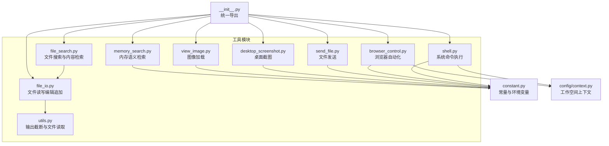
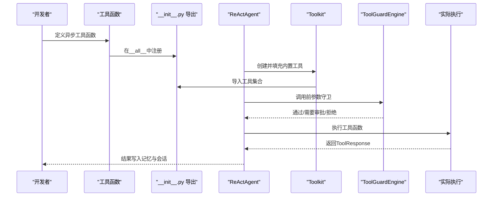
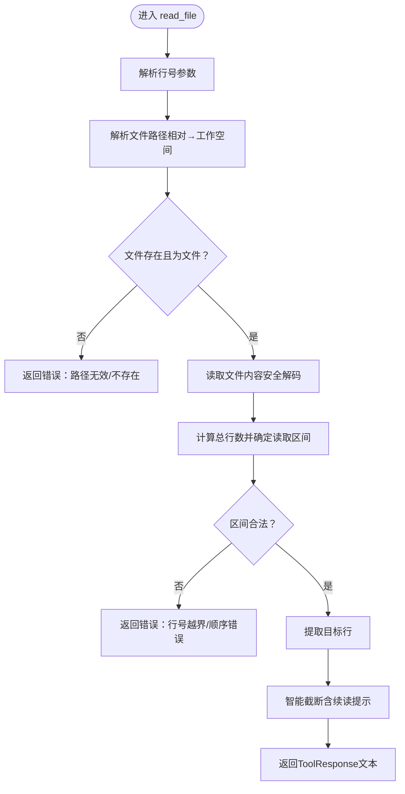
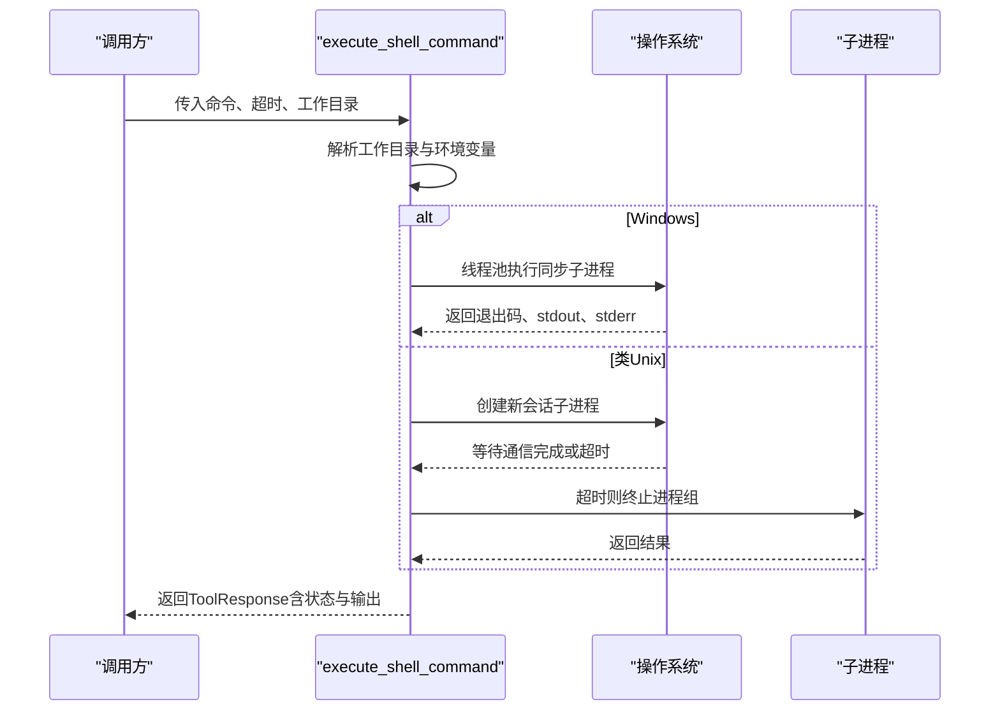
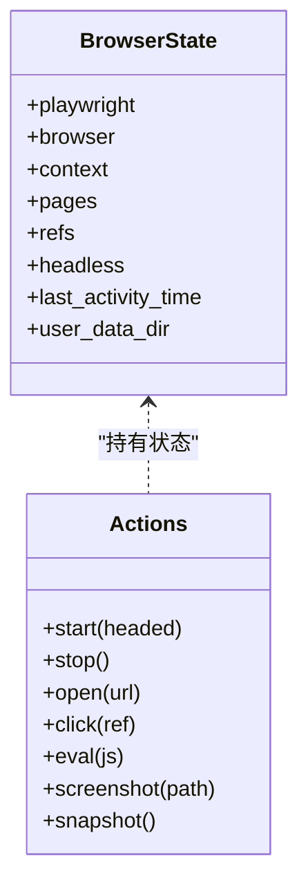
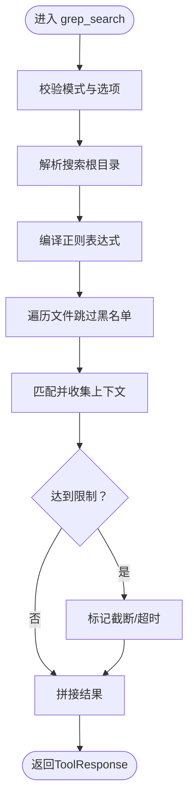
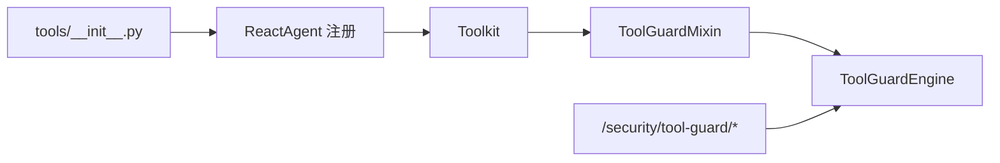

# 自定义工具开发

<cite>
**本文档引用的文件**
- [src/copaw/agents/tools/file_io.py](file://src/copaw/agents/tools/file_io.py)
- [src/copaw/agents/tools/shell.py](file://src/copaw/agents/tools/shell.py)
- [src/copaw/agents/tools/browser_control.py](file://src/copaw/agents/tools/browser_control.py)
- [src/copaw/agents/tools/utils.py](file://src/copaw/agents/tools/utils.py)
- [src/copaw/agents/tools/__init__.py](file://src/copaw/agents/tools/__init__.py)
- [src/copaw/agents/tools/file_search.py](file://src/copaw/agents/tools/file_search.py)
- [src/copaw/agents/tools/send_file.py](file://src/copaw/agents/tools/send_file.py)
- [src/copaw/agents/tools/desktop_screenshot.py](file://src/copaw/agents/tools/desktop_screenshot.py)
- [src/copaw/agents/tools/view_image.py](file://src/copaw/agents/tools/view_image.py)
- [src/copaw/agents/tools/memory_search.py](file://src/copaw/agents/tools/memory_search.py)
- [src/copaw/constant.py](file://src/copaw/constant.py)
- [src/copaw/config/context.py](file://src/copaw/config/context.py)
- [src/copaw/agents/tool_guard_mixin.py](file://src/copaw/agents/tool_guard_mixin.py)
- [src/copaw/agents/react_agent.py](file://src/copaw/agents/react_agent.py)
- [src/copaw/security/tool_guard/engine.py](file://src/copaw/security/tool_guard/engine.py)
- [src/copaw/app/routers/config.py](file://src/copaw/app/routers/config.py)
</cite>

## 目录
1. [简介](#简介)
2. [项目结构](#项目结构)
3. [核心组件](#核心组件)
4. [架构总览](#架构总览)
5. [详细组件分析](#详细组件分析)
6. [依赖分析](#依赖分析)
7. [性能考量](#性能考量)
8. [故障排查指南](#故障排查指南)
9. [结论](#结论)
10. [附录](#附录)

## 简介
本指南面向希望在CoPaw中开发与集成自定义工具的开发者，围绕工具接口规范、参数验证机制、错误处理策略、工具注册与发现流程展开，并结合现有file_io、shell、browser_control等工具实现，给出可复用的开发模式、测试方法、性能优化与安全考虑。文档同时提供工具模板、调试技巧与发布流程建议，帮助你快速构建稳定、安全且高性能的工具。

## 项目结构
CoPaw的工具体系位于Python后端的agents/tools目录下，采用“按功能分模块”的组织方式，每个工具模块独立实现具体能力，并通过统一的导出入口集中暴露给上层使用。工作空间路径解析、输出截断与通用工具函数位于tools子包内；全局常量与上下文变量分别由constant与config.context提供。

图示来源
- [src/copaw/agents/tools/__init__.py:1-47](file://src/copaw/agents/tools/__init__.py#L1-L47)
- [src/copaw/agents/tools/file_io.py:1-351](file://src/copaw/agents/tools/file_io.py#L1-L351)
- [src/copaw/agents/tools/shell.py:1-343](file://src/copaw/agents/tools/shell.py#L1-L343)
- [src/copaw/agents/tools/browser_control.py:1-800](file://src/copaw/agents/tools/browser_control.py#L1-L800)
- [src/copaw/agents/tools/file_search.py:1-449](file://src/copaw/agents/tools/file_search.py#L1-L449)
- [src/copaw/agents/tools/send_file.py:1-123](file://src/copaw/agents/tools/send_file.py#L1-L123)
- [src/copaw/agents/tools/desktop_screenshot.py:1-144](file://src/copaw/agents/tools/desktop_screenshot.py#L1-L144)
- [src/copaw/agents/tools/view_image.py:1-83](file://src/copaw/agents/tools/view_image.py#L1-L83)
- [src/copaw/agents/tools/memory_search.py:1-70](file://src/copaw/agents/tools/memory_search.py#L1-L70)
- [src/copaw/agents/tools/utils.py:1-241](file://src/copaw/agents/tools/utils.py#L1-L241)
- [src/copaw/constant.py:1-210](file://src/copaw/constant.py#L1-L210)
- [src/copaw/config/context.py:1-34](file://src/copaw/config/context.py#L1-L34)

章节来源
- [src/copaw/agents/tools/__init__.py:1-47](file://src/copaw/agents/tools/__init__.py#L1-L47)
- [src/copaw/constant.py:72-86](file://src/copaw/constant.py#L72-L86)
- [src/copaw/config/context.py:18-34](file://src/copaw/config/context.py#L18-L34)

## 核心组件
- 工具接口规范
  - 统一返回类型：所有工具函数均返回ToolResponse，内部包含TextBlock、ImageBlock等消息块，便于前端渲染与后续处理。
  - 异步设计：工具函数采用async def声明，支持高并发与长耗时任务。
  - 参数校验：对关键参数进行显式校验，如路径存在性、文件类型、数值范围等，失败时返回明确的错误文本。
- 路径解析与工作空间
  - 使用get_current_workspace_dir从上下文变量获取当前工作空间，相对路径统一解析至该目录，避免跨会话误用。
  - 常量WORKING_DIR作为默认回退路径，确保在未设置上下文时仍能定位根目录。
- 输出截断与安全
  - 提供通用的truncate_output与专用的truncate_file_output/truncate_shell_output，限制输出大小与行数，防止大文件或长命令输出造成性能问题。
- 错误处理策略
  - 明确的错误分支：路径不存在、非文件、权限不足、超时、编码异常等，均以ToolResponse携带错误文本返回。
  - 异常捕获：对底层调用（文件读写、进程执行、浏览器启动）进行异常捕获，保证工具链路稳定。

章节来源
- [src/copaw/agents/tools/file_io.py:35-162](file://src/copaw/agents/tools/file_io.py#L35-L162)
- [src/copaw/agents/tools/shell.py:179-332](file://src/copaw/agents/tools/shell.py#L179-L332)
- [src/copaw/agents/tools/browser_control.py:482-591](file://src/copaw/agents/tools/browser_control.py#L482-L591)
- [src/copaw/agents/tools/utils.py:10-241](file://src/copaw/agents/tools/utils.py#L10-L241)
- [src/copaw/config/context.py:18-34](file://src/copaw/config/context.py#L18-L34)
- [src/copaw/constant.py:72-86](file://src/copaw/constant.py#L72-L86)

## 架构总览
CoPaw的工具开发遵循“工具函数—工具注册—安全守卫—执行”的闭环。工具函数通过__init__.py统一导出，供ReactAgent在运行期注册到Toolkit；当启用工具守卫时，工具调用在执行前经过规则检查与审批流程，最终由Agent执行并记录结果。

图示来源
- [src/copaw/agents/tools/__init__.py:27-47](file://src/copaw/agents/tools/__init__.py#L27-L47)
- [src/copaw/agents/react_agent.py:170-206](file://src/copaw/agents/react_agent.py#L170-L206)
- [src/copaw/agents/tool_guard_mixin.py:251-300](file://src/copaw/agents/tool_guard_mixin.py#L251-L300)
- [src/copaw/security/tool_guard/engine.py:169-207](file://src/copaw/security/tool_guard/engine.py#L169-L207)

## 详细组件分析

### 文件IO工具（file_io）
- 功能要点
  - 读取：支持指定起止行号，自动截断并提示续读；支持UTF-8解码与异常容错。
  - 写入/追加：覆盖或追加文本，返回写入字节数。
  - 编辑：全文替换，先读取再写入，失败时保持原文件。
  - 路径解析：相对路径解析到当前工作空间，绝对路径直接使用。
- 参数验证与错误处理
  - 行号转换为整数，非法输入返回错误文本。
  - 文件不存在、非文件、读写异常均以ToolResponse返回。
- 性能与安全
  - 截断策略：超过阈值时提示续读，避免一次性输出过大。
  - 编码容错：读取失败时忽略错误字符，保障可用性。

图示来源
- [src/copaw/agents/tools/file_io.py:35-162](file://src/copaw/agents/tools/file_io.py#L35-L162)
- [src/copaw/agents/tools/utils.py:133-181](file://src/copaw/agents/tools/utils.py#L133-L181)

章节来源
- [src/copaw/agents/tools/file_io.py:35-351](file://src/copaw/agents/tools/file_io.py#L35-L351)
- [src/copaw/agents/tools/utils.py:10-241](file://src/copaw/agents/tools/utils.py#L10-L241)

### 系统命令工具（shell）
- 功能要点
  - 跨平台执行：Windows使用线程池绕开asyncio子进程限制；类Unix系统使用新会话避免孤儿进程。
  - 超时与终止：统一超时处理，必要时递归终止进程树；stderr补充超时说明。
  - 输出截断：使用tail策略，保留末尾若干行与字节上限。
- 参数验证与错误处理
  - 空命令、路径不可达、执行异常均返回明确错误文本。
  - 环境变量注入：确保子进程PATH包含当前虚拟环境Python，避免外部解释器差异。
- 安全与稳定性
  - Windows特殊处理：taskkill强制终止树形进程，避免后台进程占用句柄导致阻塞。
  - 临时文件重定向：规避管道继承问题，提升稳定性。

图示来源
- [src/copaw/agents/tools/shell.py:179-332](file://src/copaw/agents/tools/shell.py#L179-L332)

章节来源
- [src/copaw/agents/tools/shell.py:63-343](file://src/copaw/agents/tools/shell.py#L63-L343)

### 浏览器控制工具（browser_control）
- 功能要点
  - 多模式：同步Playwright（混合模式）与异步Playwright（标准模式），自动选择headless/headed。
  - 状态管理：按工作空间维护浏览器实例、上下文、页面、快照引用与监听器。
  - 生命周期：空闲检测与自动停止，避免资源泄漏；退出清理。
- 参数验证与错误处理
  - 可选参数解析：JSON字符串、逗号分隔列表等，兼容不同调用风格。
  - 启动失败：捕获异常并返回结构化错误，便于前端展示。
- 安全与稳定性
  - 容器模式：沙箱参数与可选WebKit回退，提升跨平台一致性。
  - 多线程：混合模式下使用线程池执行同步Playwright，避免事件循环阻塞。

图示来源
- [src/copaw/agents/tools/browser_control.py:87-116](file://src/copaw/agents/tools/browser_control.py#L87-L116)
- [src/copaw/agents/tools/browser_control.py:611-746](file://src/copaw/agents/tools/browser_control.py#L611-L746)

章节来源
- [src/copaw/agents/tools/browser_control.py:482-800](file://src/copaw/agents/tools/browser_control.py#L482-L800)

### 文件搜索工具（file_search）
- 功能要点
  - grep：正则/字面匹配，支持上下文行数、文件名过滤、超时与截断。
  - glob：通配符搜索，支持递归与目录跳过。
- 参数验证与错误处理
  - 空模式、无效正则、路径不存在/非目录均返回错误文本。
  - 超时与截断：明确提示原因，引导缩小搜索范围。
- 性能与安全
  - 二进制文件与大文件跳过，限制扫描数量与输出长度，避免性能瓶颈。

图示来源
- [src/copaw/agents/tools/file_search.py:307-396](file://src/copaw/agents/tools/file_search.py#L307-L396)

章节来源
- [src/copaw/agents/tools/file_search.py:170-449](file://src/copaw/agents/tools/file_search.py#L170-L449)

### 其他常用工具
- 发送文件（send_file）：根据MIME类型自动选择消息块类型，返回本地URL以便前端渲染多媒体。
- 桌面截图（desktop_screenshot）：跨平台全屏截图，macOS支持窗口选择；失败时返回结构化错误。
- 图像查看（view_image）：校验扩展名与MIME类型，加载为ImageBlock。
- 内存搜索（memory_search）：绑定MemoryManager，提供语义检索能力。

章节来源
- [src/copaw/agents/tools/send_file.py:29-123](file://src/copaw/agents/tools/send_file.py#L29-L123)
- [src/copaw/agents/tools/desktop_screenshot.py:103-144](file://src/copaw/agents/tools/desktop_screenshot.py#L103-L144)
- [src/copaw/agents/tools/view_image.py:24-83](file://src/copaw/agents/tools/view_image.py#L24-L83)
- [src/copaw/agents/tools/memory_search.py:7-70](file://src/copaw/agents/tools/memory_search.py#L7-L70)

## 依赖分析
- 工具导出与注册
  - __init__.py集中导出工具函数，供上层导入与注册。
  - ReActAgent在创建Toolkit时加载内置工具集合，支持MCP客户端工具注册。
- 安全守卫
  - ToolGuardEngine负责规则加载与执行，支持“总是运行”与“仅受保护工具”两类守护者。
  - ToolGuardMixin在Agent生命周期中拦截敏感工具调用，实现预审批与拒绝流程。
- 配置与开关
  - 通过API路由动态更新工具守卫配置，支持启用/禁用与规则重载。

图示来源
- [src/copaw/agents/tools/__init__.py:27-47](file://src/copaw/agents/tools/__init__.py#L27-L47)
- [src/copaw/agents/react_agent.py:170-206](file://src/copaw/agents/react_agent.py#L170-L206)
- [src/copaw/agents/tool_guard_mixin.py:57-70](file://src/copaw/agents/tool_guard_mixin.py#L57-L70)
- [src/copaw/security/tool_guard/engine.py:53-80](file://src/copaw/security/tool_guard/engine.py#L53-L80)
- [src/copaw/app/routers/config.py:416-440](file://src/copaw/app/routers/config.py#L416-L440)

章节来源
- [src/copaw/agents/tools/__init__.py:1-47](file://src/copaw/agents/tools/__init__.py#L1-L47)
- [src/copaw/agents/react_agent.py:170-424](file://src/copaw/agents/react_agent.py#L170-L424)
- [src/copaw/agents/tool_guard_mixin.py:251-382](file://src/copaw/agents/tool_guard_mixin.py#L251-L382)
- [src/copaw/security/tool_guard/engine.py:169-237](file://src/copaw/security/tool_guard/engine.py#L169-L237)
- [src/copaw/app/routers/config.py:407-453](file://src/copaw/app/routers/config.py#L407-L453)

## 性能考量
- I/O与输出控制
  - 使用truncate_output/truncate_file_output/truncate_shell_output限制输出规模，避免大文件/长命令拖慢响应。
  - 文件读写采用UTF-8容错读取，减少异常中断。
- 进程与浏览器
  - shell工具在Windows使用线程池执行同步子进程，规避asyncio限制；类Unix使用新会话避免孤儿进程。
  - browser_control按工作空间隔离状态，空闲自动停止，降低资源占用。
- 搜索与遍历
  - file_search跳过二进制与大文件，限制扫描数量与输出长度，配合超时与截断避免长时间阻塞。

章节来源
- [src/copaw/agents/tools/utils.py:10-241](file://src/copaw/agents/tools/utils.py#L10-L241)
- [src/copaw/agents/tools/shell.py:63-176](file://src/copaw/agents/tools/shell.py#L63-L176)
- [src/copaw/agents/tools/browser_control.py:171-223](file://src/copaw/agents/tools/browser_control.py#L171-L223)
- [src/copaw/agents/tools/file_search.py:170-264](file://src/copaw/agents/tools/file_search.py#L170-L264)

## 故障排查指南
- 常见错误与定位
  - 文件路径：确认相对路径是否解析到正确工作空间；检查文件是否存在与可读。
  - 命令执行：关注超时与进程树终止；核对环境变量PATH是否包含预期Python解释器。
  - 浏览器：容器模式需沙箱参数；系统无Chromium时回退WebKit；注意持久化上下文与用户数据目录。
- 日志与诊断
  - 工具函数返回的错误文本包含详细上下文；可在前端界面查看结构化输出。
  - 守卫引擎记录告警与失败守护者，便于定位规则触发点。
- 快速修复建议
  - 调整超时时间或缩小搜索范围；修正路径大小写与Unicode规范化；在容器中设置PLAYWRIGHT_CHROMIUM_EXECUTABLE_PATH。

章节来源
- [src/copaw/agents/tools/file_io.py:83-162](file://src/copaw/agents/tools/file_io.py#L83-L162)
- [src/copaw/agents/tools/shell.py:224-332](file://src/copaw/agents/tools/shell.py#L224-L332)
- [src/copaw/agents/tools/browser_control.py:232-280](file://src/copaw/agents/tools/browser_control.py#L232-L280)
- [src/copaw/agents/tool_guard_mixin.py:433-481](file://src/copaw/agents/tool_guard_mixin.py#L433-L481)

## 结论
通过遵循CoPaw的工具接口规范与现有工具实现模式，你可以快速开发出稳定、安全且高性能的自定义工具。建议在开发中重视参数验证、错误处理与输出截断，合理利用工作空间上下文与工具守卫机制，并结合单元测试与集成测试验证行为。上线前通过安全扫描与规则校验，确保工具符合生产环境要求。

## 附录

### 工具开发模板（步骤清单）
- 函数签名
  - 使用async def声明，返回ToolResponse；参数尽量使用类型注解。
- 路径解析
  - 若涉及文件/目录，优先使用get_current_workspace_dir解析相对路径。
- 参数校验
  - 对必填参数进行存在性与类型检查；对数值参数设定边界。
- 错误处理
  - 将异常转为ToolResponse，包含明确的错误文本；避免抛出未捕获异常。
- 输出控制
  - 大输出使用truncate_*函数；必要时提供续读提示。
- 平台差异
  - 跨平台逻辑使用条件分支；Windows特殊处理参考shell与browser_control。
- 安全考虑
  - 严格限制命令执行范围与参数；浏览器工具避免访问敏感站点；文件操作仅限工作空间。
- 注册与导出
  - 在__all__中添加工具名称；在__init__.py中导入并导出。
- 测试与调试
  - 单元测试覆盖正常/异常路径；集成测试验证端到端流程；开启日志辅助定位。

章节来源
- [src/copaw/agents/tools/__init__.py:27-47](file://src/copaw/agents/tools/__init__.py#L27-L47)
- [src/copaw/config/context.py:18-34](file://src/copaw/config/context.py#L18-L34)
- [src/copaw/agents/tools/utils.py:10-241](file://src/copaw/agents/tools/utils.py#L10-L241)
- [src/copaw/agents/tools/shell.py:63-176](file://src/copaw/agents/tools/shell.py#L63-L176)
- [src/copaw/agents/tools/browser_control.py:232-280](file://src/copaw/agents/tools/browser_control.py#L232-L280)