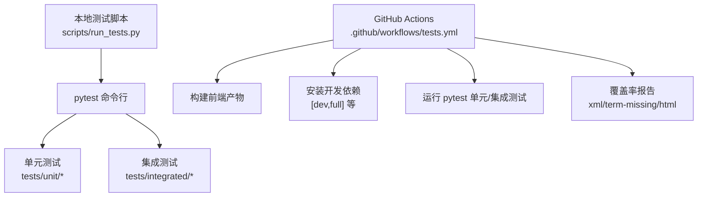
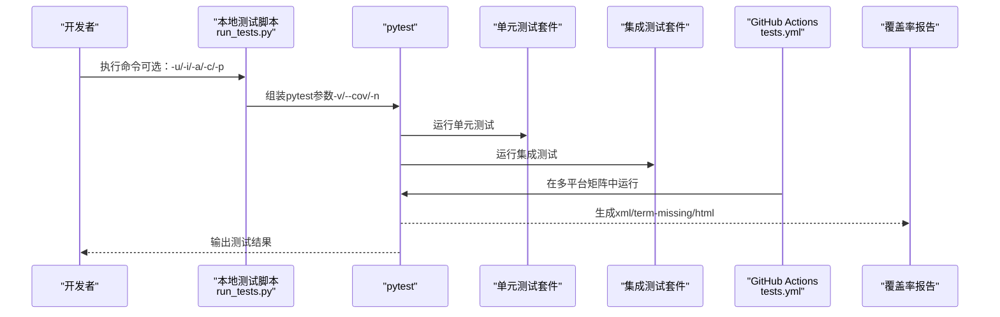
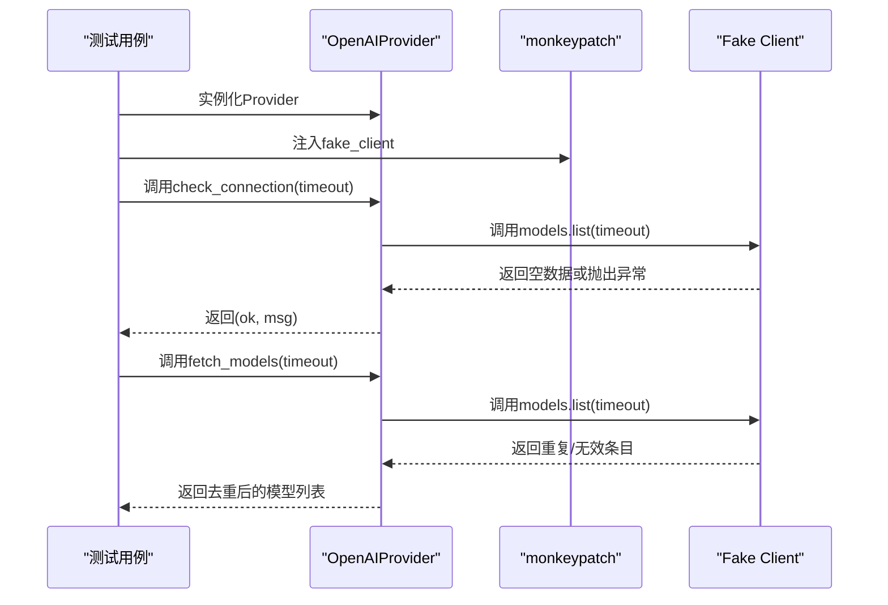
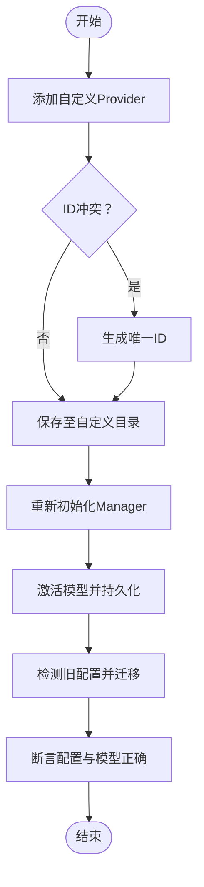
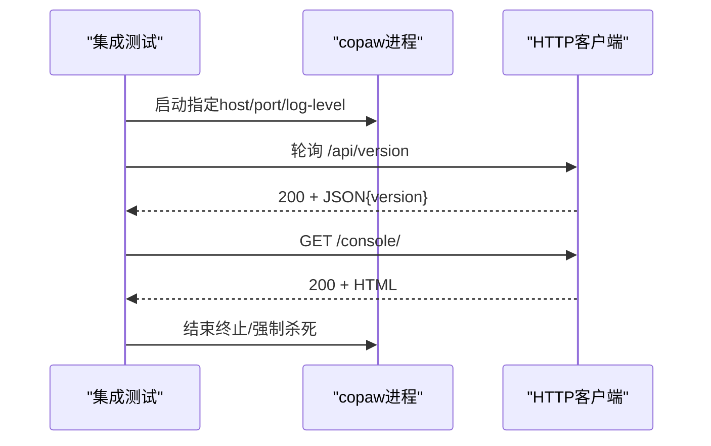
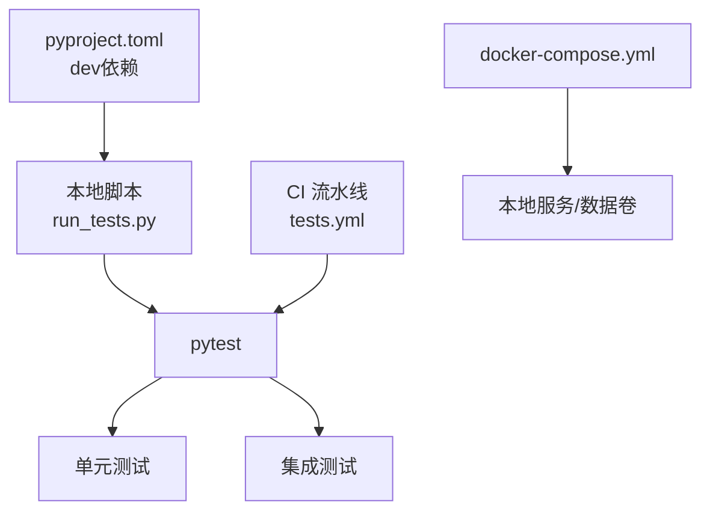

# 测试策略

<cite>
**本文引用的文件**
- [pyproject.toml](file://pyproject.toml)
- [scripts/run_tests.py](file://scripts/run_tests.py)
- [.github/workflows/tests.yml](file://.github/workflows/tests.yml)
- [tests/unit/workspace/test_agent_creation.py](file://tests/unit/workspace/test_agent_creation.py)
- [tests/unit/providers/test_openai_provider.py](file://tests/unit/providers/test_openai_provider.py)
- [tests/unit/providers/test_provider_manager.py](file://tests/unit/providers/test_provider_manager.py)
- [tests/unit/workspace/test_workspace.py](file://tests/unit/workspace/test_workspace.py)
- [tests/integrated/test_app_startup.py](file://tests/integrated/test_app_startup.py)
- [docker-compose.yml](file://docker-compose.yml)
</cite>

## 目录
1. [引言](#引言)
2. [项目结构](#项目结构)
3. [核心组件](#核心组件)
4. [架构总览](#架构总览)
5. [详细组件分析](#详细组件分析)
6. [依赖分析](#依赖分析)
7. [性能考虑](#性能考虑)
8. [故障排查指南](#故障排查指南)
9. [结论](#结论)
10. [附录](#附录)

## 引言
本测试策略文档面向CoPaw项目，旨在建立系统化、可执行的测试体系，覆盖单元测试、集成测试与端到端测试，并配套测试数据管理、CI/CD流程、覆盖率报告与调试技巧。文档以仓库现有测试脚本、pytest配置与GitHub Actions工作流为基础，结合关键测试用例进行深入解析，帮助开发者在不同环境下高效开展测试与质量保障。

## 项目结构
CoPaw采用“本地测试脚本 + pytest + GitHub Actions”的测试组织方式：
- 本地测试入口：scripts/run_tests.py 提供统一命令行入口，支持运行单元/集成测试、并行执行与覆盖率生成。
- 测试目录：tests/unit 与 tests/integrated 分层组织，按模块细分子目录（如 providers、workspace 等）。
- CI/CD：.github/workflows/tests.yml 定义多平台矩阵测试、覆盖率报告与PR评论展示。
- 依赖与标记：pyproject.toml 配置pytest参数、异步模式与自定义标记（如“slow”）。

图表来源
- [scripts/run_tests.py:175-277](file://scripts/run_tests.py#L175-L277)
- [.github/workflows/tests.yml:31-168](file://.github/workflows/tests.yml#L31-L168)
- [pyproject.toml:96-101](file://pyproject.toml#L96-L101)

章节来源
- [scripts/run_tests.py:1-282](file://scripts/run_tests.py#L1-L282)
- [.github/workflows/tests.yml:1-259](file://.github/workflows/tests.yml#L1-L259)
- [pyproject.toml:1-102](file://pyproject.toml#L1-L102)

## 核心组件
- 测试框架与配置
  - pytest：通过pyproject.toml启用异步模式与自定义标记；通过scripts/run_tests.py扩展并行与覆盖率选项。
  - 覆盖率：本地与CI均支持生成HTML与缺失行报告，CI还输出XML用于PR评论。
- 测试分类
  - 单元测试：针对具体模块或类的行为验证，常使用monkeypatch、patch等fixture与模拟对象。
  - 集成测试：验证组件协作与外部依赖（如HTTP API），包含进程启动、端口探测与响应校验。
- 数据与环境
  - 临时目录与文件：使用pytest临时目录确保隔离与自动清理。
  - 外部服务：通过docker-compose挂载数据卷，便于本地复现生产环境。

章节来源
- [pyproject.toml:96-101](file://pyproject.toml#L96-L101)
- [scripts/run_tests.py:148-172](file://scripts/run_tests.py#L148-L172)
- [.github/workflows/tests.yml:170-232](file://.github/workflows/tests.yml#L170-L232)
- [docker-compose.yml:1-23](file://docker-compose.yml#L1-L23)

## 架构总览
下图展示了从本地脚本到CI的测试执行路径，以及关键的测试阶段与产物：

图表来源
- [scripts/run_tests.py:175-277](file://scripts/run_tests.py#L175-L277)
- [.github/workflows/tests.yml:31-168](file://.github/workflows/tests.yml#L31-L168)
- [.github/workflows/tests.yml:170-232](file://.github/workflows/tests.yml#L170-L232)

## 详细组件分析

### 单元测试框架与夹具
- 异步支持：pytest异步模式由pyproject.toml配置，确保协程测试正常运行。
- 自定义标记：slow标记可用于选择性跳过耗时测试。
- 模拟与替换：
  - monkeypatch：用于替换属性或类行为，如Provider连接检查与模型列表获取。
  - patch：对模块级函数进行替换，如短UUID生成冲突处理。
- 临时环境：
  - 使用tmp_path与临时目录，确保测试隔离与自动清理。
- 断言与数据校验：
  - 对返回值、状态码、字段存在性与类型进行断言。
  - 对配置更新、冻结URL、聊天模型等边界条件进行验证。

章节来源
- [pyproject.toml:96-101](file://pyproject.toml#L96-L101)
- [tests/unit/providers/test_openai_provider.py:21-38](file://tests/unit/providers/test_openai_provider.py#L21-L38)
- [tests/unit/providers/test_openai_provider.py:40-55](file://tests/unit/providers/test_openai_provider.py#L40-L55)
- [tests/unit/workspace/test_agent_creation.py:27-57](file://tests/unit/workspace/test_agent_creation.py#L27-L57)
- [tests/unit/workspace/test_workspace.py:8-24](file://tests/unit/workspace/test_workspace.py#L8-L24)

### Provider模块测试（示例：OpenAIProvider）
- 功能点
  - 连接检查：验证超时参数传递与异常捕获。
  - 模型列表：去重、规范化与错误回退。
  - 模型连通性：最小化请求参数与流式迭代。
  - 配置更新：非None字段更新、冻结URL保护、聊天模型更新规则。
- 测试方法
  - 使用SimpleNamespace构造轻量客户端，避免真实网络调用。
  - 使用monkeypatch注入客户端与异常类型，覆盖成功/失败分支。
  - 断言最终状态与返回值，确保行为符合预期。

图表来源
- [tests/unit/providers/test_openai_provider.py:10-18](file://tests/unit/providers/test_openai_provider.py#L10-L18)
- [tests/unit/providers/test_openai_provider.py:21-38](file://tests/unit/providers/test_openai_provider.py#L21-L38)
- [tests/unit/providers/test_openai_provider.py:57-79](file://tests/unit/providers/test_openai_provider.py#L57-L79)

章节来源
- [tests/unit/providers/test_openai_provider.py:1-269](file://tests/unit/providers/test_openai_provider.py#L1-L269)

### ProviderManager测试（示例：自定义Provider持久化与迁移）
- 功能点
  - 添加自定义Provider并持久化，冲突ID自动重命名。
  - 激活模型并跨进程/重启后仍可加载。
  - 旧版配置迁移与内置Provider兼容。
  - 更新内置Provider配置与未知Provider处理。
- 测试方法
  - 使用隔离的secret目录，确保每次测试独立且可预测。
  - 通过JSON写入模拟旧配置文件，触发迁移逻辑。
  - 断言持久化文件存在、激活模型正确加载与URL/模型映射更新。

图表来源
- [tests/unit/providers/test_provider_manager.py:85-124](file://tests/unit/providers/test_provider_manager.py#L85-L124)
- [tests/unit/providers/test_provider_manager.py:126-156](file://tests/unit/providers/test_provider_manager.py#L126-L156)
- [tests/unit/providers/test_provider_manager.py:188-226](file://tests/unit/providers/test_provider_manager.py#L188-L226)

章节来源
- [tests/unit/providers/test_provider_manager.py:1-440](file://tests/unit/providers/test_provider_manager.py#L1-L440)

### 工作空间测试（示例：Workspace生命周期与ID规则）
- 功能点
  - 创建Workspace实例，校验agent_id与目录存在性。
  - 启动前各组件为None，启动后按需初始化。
  - 支持默认ID与短UUID ID，长度与字符集约束。
- 测试方法
  - 使用临时目录确保隔离。
  - 通过repr字符串校验状态描述。

章节来源
- [tests/unit/workspace/test_workspace.py:8-97](file://tests/unit/workspace/test_workspace.py#L8-L97)

### 短UUID与Agent创建测试（示例：ID生成与冲突处理）
- 功能点
  - 空ID触发自动生成。
  - 冲突场景下多次尝试直至唯一ID。
  - 保留特殊ID（如"default"）。
  - 短UUID长度、字符集与易混淆字符排除。
- 测试方法
  - patch模块级生成函数，模拟连续冲突。
  - 断言生成ID满足属性与唯一性要求。

章节来源
- [tests/unit/workspace/test_agent_creation.py:11-87](file://tests/unit/workspace/test_agent_creation.py#L11-L87)

### 集成测试（示例：应用启动与控制台访问）
- 功能点
  - 启动copaw应用（后台+控制台），动态分配端口。
  - 探测/health或版本接口，校验响应状态与内容类型。
  - 访问控制台页面，校验HTML有效性。
  - 超时与进程退出处理，输出日志辅助定位。
- 测试方法
  - 子进程启动与stdout实时读取。
  - 循环探测HTTP端点，捕获早期退出与导入错误。
  - 控制台HTML内容校验与资源完整性检查。

图表来源
- [tests/integrated/test_app_startup.py:33-133](file://tests/integrated/test_app_startup.py#L33-L133)

章节来源
- [tests/integrated/test_app_startup.py:1-133](file://tests/integrated/test_app_startup.py#L1-L133)

### 本地测试脚本与CI流水线
- 本地脚本
  - 支持运行全部/单元/集成测试，可选并行与覆盖率。
  - 自动检测pytest安装，提示安装命令。
- CI流水线
  - 多平台矩阵（Ubuntu/Mac/Windows）+多Python版本。
  - 先构建前端，再复制到包内，最后安装开发依赖并运行测试。
  - 覆盖率报告生成XML/HTML，PR中输出覆盖率评论。

章节来源
- [scripts/run_tests.py:175-277](file://scripts/run_tests.py#L175-L277)
- [.github/workflows/tests.yml:31-168](file://.github/workflows/tests.yml#L31-L168)
- [.github/workflows/tests.yml:170-232](file://.github/workflows/tests.yml#L170-L232)

## 依赖分析
- 测试依赖
  - pytest、pytest-asyncio、pytest-cov、pytest-xdist（并行）等在pyproject.toml的dev分组中声明。
  - 本地脚本通过子进程调用pytest，支持--cov与-n参数。
- CI依赖
  - Actions步骤中安装[dev,full]或[dev,local,ollama]等变体，确保不同平台可用性。
- 外部服务
  - docker-compose提供数据卷与容器编排，便于本地复现生产环境。

图表来源
- [pyproject.toml:66-94](file://pyproject.toml#L66-L94)
- [scripts/run_tests.py:148-172](file://scripts/run_tests.py#L148-L172)
- [.github/workflows/tests.yml:77-88](file://.github/workflows/tests.yml#L77-L88)
- [docker-compose.yml:1-23](file://docker-compose.yml#L1-L23)

章节来源
- [pyproject.toml:1-102](file://pyproject.toml#L1-L102)
- [scripts/run_tests.py:1-282](file://scripts/run_tests.py#L1-L282)
- [.github/workflows/tests.yml:1-259](file://.github/workflows/tests.yml#L1-L259)
- [docker-compose.yml:1-23](file://docker-compose.yml#L1-L23)

## 性能考虑
- 并行执行
  - 本地脚本与CI均支持pytest-xdist并行（-n auto），建议在CPU充足的环境中开启，缩短整体耗时。
- 异步测试
  - 使用asyncio模式与pytest-asyncio，减少协程调度开销，提升异步组件测试效率。
- 覆盖率范围
  - 仅对src/copaw目录生成覆盖率，避免第三方库干扰，聚焦核心业务代码。
- 集成测试优化
  - 尽量使用本地端口探测与快速HTTP轮询，避免长超时；必要时为慢测试打上slow标记以便选择性跳过。

## 故障排查指南
- 本地无法找到pytest
  - 现象：提示未安装pytest。
  - 处理：根据本地脚本提示安装开发依赖。
  - 参考：[scripts/run_tests.py:222-227](file://scripts/run_tests.py#L222-L227)
- 集成测试超时或进程提前退出
  - 现象：后台未就绪或进程退出，日志包含导入错误。
  - 处理：检查依赖安装、端口占用与网络代理；查看最近日志片段。
  - 参考：[tests/integrated/test_app_startup.py:76-84](file://tests/integrated/test_app_startup.py#L76-L84)
- 覆盖率报告未生成
  - 现象：本地或CI缺少覆盖率文件。
  - 处理：确认--cov参数与报告格式；CI中检查xml/term-missing/html是否生成。
  - 参考：[scripts/run_tests.py:156-163](file://scripts/run_tests.py#L156-L163)，[.github/workflows/tests.yml:214-222](file://.github/workflows/tests.yml#L214-L222)
- Provider持久化冲突
  - 现象：自定义Provider ID重复导致重命名。
  - 处理：检查自定义Provider保存逻辑与唯一性循环。
  - 参考：[tests/unit/providers/test_provider_manager.py:227-247](file://tests/unit/providers/test_provider_manager.py#L227-L247)

章节来源
- [scripts/run_tests.py:222-227](file://scripts/run_tests.py#L222-L227)
- [tests/integrated/test_app_startup.py:76-84](file://tests/integrated/test_app_startup.py#L76-L84)
- [scripts/run_tests.py:156-163](file://scripts/run_tests.py#L156-L163)
- [.github/workflows/tests.yml:214-222](file://.github/workflows/tests.yml#L214-L222)
- [tests/unit/providers/test_provider_manager.py:227-247](file://tests/unit/providers/test_provider_manager.py#L227-L247)

## 结论
本测试策略以pytest为核心，结合本地脚本与GitHub Actions，形成从单元到集成再到覆盖率的完整闭环。通过模拟对象、临时环境与严格的断言，确保Provider、Workspace等关键模块的稳定性与可维护性。建议在新增功能时同步补充对应测试，并利用slow标记与并行执行优化测试效率。

## 附录
- 测试用例编写指南
  - 单元测试：优先使用monkeypatch/patch替代真实外部依赖；对边界条件（空ID、冻结URL、冲突ID）进行覆盖。
  - 集成测试：关注启动顺序、端口分配与HTTP响应；对控制台HTML进行基础校验。
  - 覆盖率：保持对src/copaw目录的覆盖率，定期审查缺失行并补充测试。
- 最佳实践
  - 使用临时目录与隔离存储，避免跨测试污染。
  - 为耗时测试打上slow标记，便于选择性执行。
  - 在CI中固定Python版本矩阵，确保多平台一致性。
- 调试技巧
  - 集成测试中打印子进程日志，定位早期退出原因。
  - 使用pytest -v与--tb=short快速定位失败用例。
  - 本地并行执行时注意资源竞争，必要时降级为串行。