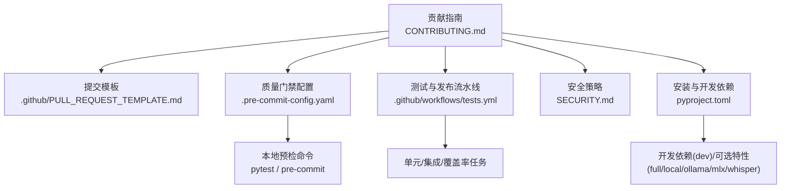
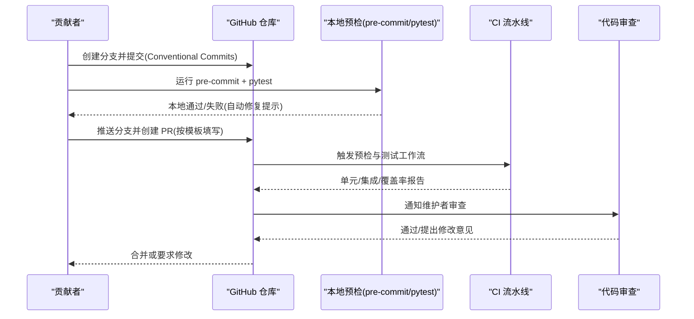
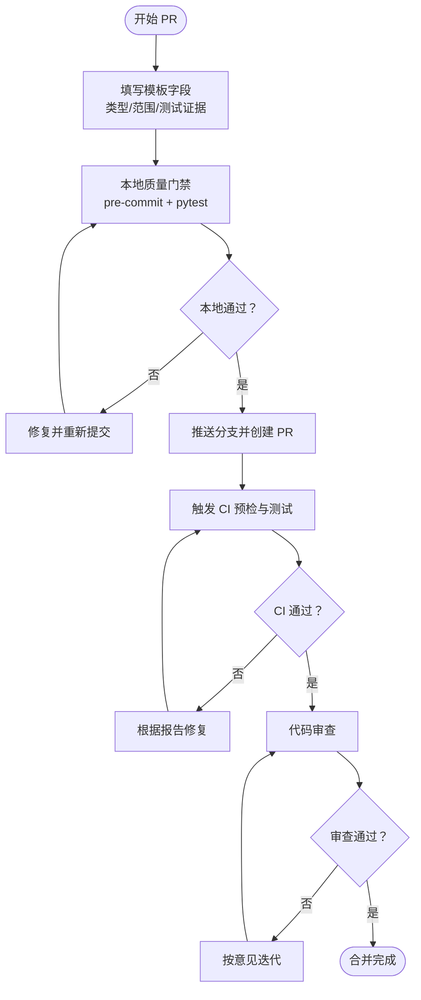
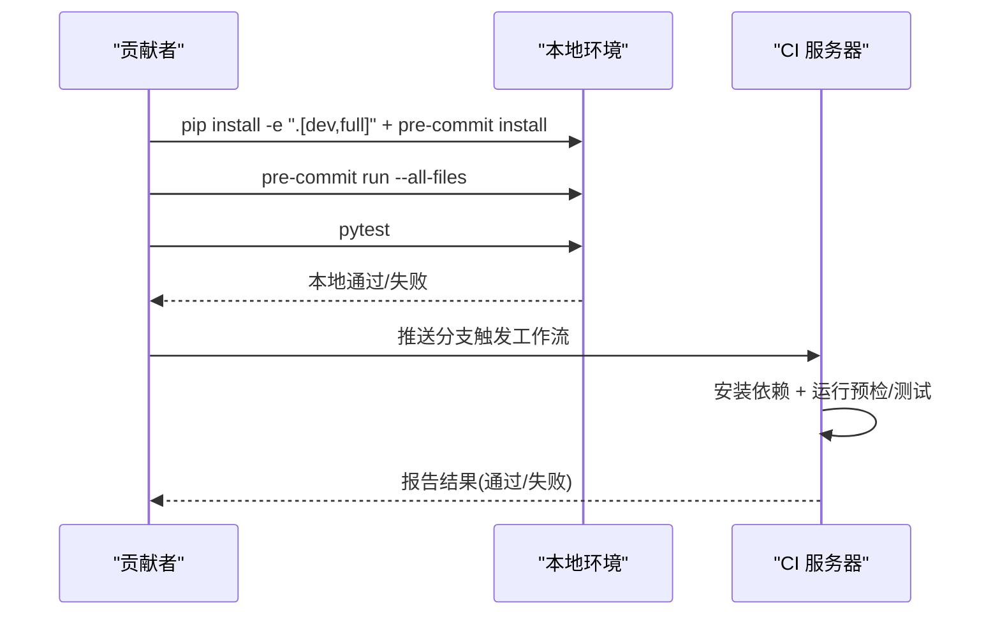
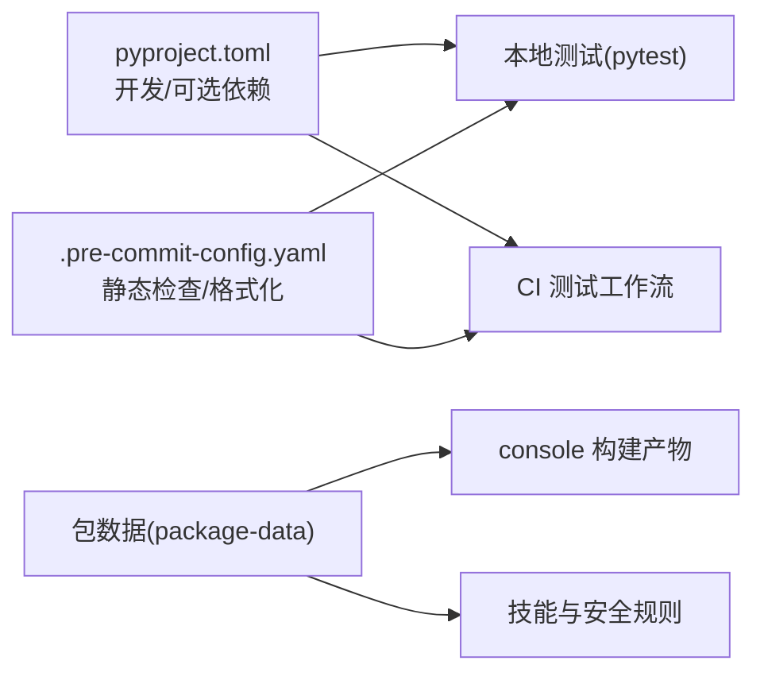

# 贡献流程

<cite>
**本文引用的文件**
- [CONTRIBUTING.md](file://CONTRIBUTING.md)
- [README.md](file://README.md)
- [.github/PULL_REQUEST_TEMPLATE.md](file://.github/PULL_REQUEST_TEMPLATE.md)
- [.pre-commit-config.yaml](file://.pre-commit-config.yaml)
- [pyproject.toml](file://pyproject.toml)
- [.github/workflows/tests.yml](file://.github/workflows/tests.yml)
- [.github/workflows/pre-commit.yml](file://.github/workflows/pre-commit.yml)
- [SECURITY.md](file://SECURITY.md)
- [tests/unit/providers/test_openai_provider.py](file://tests/unit/providers/test_openai_provider.py)
</cite>

## 目录
1. [简介](#简介)
2. [项目结构](#项目结构)
3. [核心组件](#核心组件)
4. [架构总览](#架构总览)
5. [详细组件分析](#详细组件分析)
6. [依赖分析](#依赖分析)
7. [性能考虑](#性能考虑)
8. [故障排查指南](#故障排查指南)
9. [结论](#结论)
10. [附录](#附录)

## 简介
本文件面向所有希望参与 CoPaw 开源项目的贡献者，系统化梳理从问题发现到代码合并的完整贡献流程，覆盖问题跟踪、分支与合并策略、Pull Request 流程、提交信息规范、质量门禁与社区参与方式等。同时提供可操作的示例、常见问题解答与维护者联系方式，帮助新成员快速上手并高质量交付。

## 项目结构
CoPaw 是一个前后端结合的个人智能助理项目，后端基于 Python，前端位于 console 目录并通过构建产物打包进包体；网站文档位于 website 目录；测试位于 tests 目录；GitHub 工作流与模板位于 .github 目录。贡献流程的关键入口包括：
- 贡献指南：CONTRIBUTING.md
- 提交模板：.github/PULL_REQUEST_TEMPLATE.md
- 质量门禁：.pre-commit-config.yaml、pyproject.toml 中的开发与测试依赖
- 自动化流水线：.github/workflows/tests.yml、.github/workflows/pre-commit.yml
- 安全策略：SECURITY.md
- 示例测试：tests/unit/providers/test_openai_provider.py

图表来源
- [CONTRIBUTING.md:1-244](file://CONTRIBUTING.md#L1-L244)
- [.github/PULL_REQUEST_TEMPLATE.md:1-54](file://.github/PULL_REQUEST_TEMPLATE.md#L1-L54)
- [.pre-commit-config.yaml:1-121](file://.pre-commit-config.yaml#L1-L121)
- [.github/workflows/tests.yml:1-259](file://.github/workflows/tests.yml#L1-L259)
- [pyproject.toml:65-93](file://pyproject.toml#L65-L93)
- [SECURITY.md:1-158](file://SECURITY.md#L1-L158)

章节来源
- [CONTRIBUTING.md:11-86](file://CONTRIBUTING.md#L11-L86)
- [README.md:414-422](file://README.md#L414-L422)

## 核心组件
- 问题跟踪与规划
  - 在 GitHub Issues 中查找现有计划与问题，避免重复劳动；如无对应问题，先开 Issue 讨论方向与范围。
  - 可参考项目路线图与讨论区选择合适任务。
- 分支与合并策略
  - 使用功能分支进行开发，遵循 Conventional Commits 规范提交，PR 合并前确保通过本地与 CI 预检。
- Pull Request 流程
  - 使用统一的 PR 模板，填写变更类型、影响范围、自测清单与验证证据。
  - 通过 CI 预检与测试后进入代码审查，必要时补充文档或修复。
- 提交信息规范
  - 采用 Conventional Commits 格式，明确类型、作用域与简要描述，示例见贡献指南。
- 社区参与
  - 通过 Discussions、Issues、社区群组与社交平台沟通协作，遵守行为准则与安全披露流程。

章节来源
- [CONTRIBUTING.md:15-67](file://CONTRIBUTING.md#L15-L67)
- [README.md:414-422](file://README.md#L414-L422)
- [.github/PULL_REQUEST_TEMPLATE.md:1-54](file://.github/PULL_REQUEST_TEMPLATE.md#L1-L54)

## 架构总览
下图展示从贡献者发起 PR 到 CI 执行与合并的关键路径，涵盖本地预检、自动化流水线与质量门禁。

图表来源
- [CONTRIBUTING.md:70-86](file://CONTRIBUTING.md#L70-L86)
- [.github/workflows/pre-commit.yml:1-41](file://.github/workflows/pre-commit.yml#L1-L41)
- [.github/workflows/tests.yml:1-259](file://.github/workflows/tests.yml#L1-L259)
- [.pre-commit-config.yaml:1-121](file://.pre-commit-config.yaml#L1-L121)
- [pyproject.toml:65-100](file://pyproject.toml#L65-L100)

## 详细组件分析

### 问题跟踪流程（Issue 创建、讨论与分配）
- 发现问题或提出改进建议前，先在 Issues 中搜索是否已有相关条目；若无，则新建 Issue 并描述目标、背景与期望结果。
- 维护者会在合理时间内响应，协助对齐方向与优先级。
- 对于需要设计或影响较大的改动，建议先开 Issue 讨论，再进行实现与 PR。

章节来源
- [CONTRIBUTING.md:15-21](file://CONTRIBUTING.md#L15-L21)

### 分支管理策略（Git 工作流、分支命名规范、合并策略）
- 工作流
  - 基于功能分支进行开发，避免直接在主分支提交。
  - 保持分支简洁，聚焦单一功能或修复。
- 提交信息规范
  - 采用 Conventional Commits，类型与作用域需清晰表达变更意图。
- 合并策略
  - PR 必须通过本地与 CI 预检；通过审查后由维护者合并。
  - 避免在 PR 中混入无关变更，尽量拆分为多个小 PR。

章节来源
- [CONTRIBUTING.md:23-67](file://CONTRIBUTING.md#L23-L67)

### Pull Request 流程（PR 创建、代码审查、CI 检查）
- PR 模板
  - 使用 .github/PULL_REQUEST_TEMPLATE.md，明确变更类型、影响范围、自测清单与验证证据。
- CI 检查
  - 预检工作流会执行 pre-commit 全量检查；测试工作流会运行单元/集成测试与覆盖率报告。
- 代码审查
  - 维护者将根据变更内容、测试覆盖与文档更新情况进行审查，必要时要求补充或修改。

图表来源
- [.github/PULL_REQUEST_TEMPLATE.md:1-54](file://.github/PULL_REQUEST_TEMPLATE.md#L1-L54)
- [.github/workflows/pre-commit.yml:1-41](file://.github/workflows/pre-commit.yml#L1-L41)
- [.github/workflows/tests.yml:1-259](file://.github/workflows/tests.yml#L1-L259)

章节来源
- [.github/PULL_REQUEST_TEMPLATE.md:1-54](file://.github/PULL_REQUEST_TEMPLATE.md#L1-L54)
- [.github/workflows/pre-commit.yml:1-41](file://.github/workflows/pre-commit.yml#L1-L41)
- [.github/workflows/tests.yml:1-259](file://.github/workflows/tests.yml#L1-L259)

### 提交信息规范（Conventional Commits 格式、消息模板）
- 格式
  - 类型(作用域): 主题
  - 类型包括 feat、fix、docs、test、refactor、chore、perf、style、build、revert 等。
- 示例
  - feat(channels): 新增 Telegram 通道桩
  - fix(skills): 修正 SKILL.md front matter 解析
  - docs(readme): 更新 Docker 快速开始
  - refactor(providers): 简化自定义提供方校验
  - test(agents): 为技能加载添加测试
- PR 标题
  - 与提交信息一致，使用相同类型与作用域，保持简短描述。

章节来源
- [CONTRIBUTING.md:23-67](file://CONTRIBUTING.md#L23-L67)

### 社区参与指南（行为准则、沟通渠道、决策流程）
- 行为准则
  - 尊重与包容，建设性反馈，遵循欢迎的社区文化。
- 沟通渠道
  - 讨论：GitHub Discussions
  - 缺陷与功能：GitHub Issues
  - 社区：钉钉群组与 Discord
- 决策流程
  - 大型或设计敏感变更建议先在 Issue 中讨论，达成共识后再实现与 PR。

章节来源
- [CONTRIBUTING.md:237-242](file://CONTRIBUTING.md#L237-L242)
- [README.md:460-465](file://README.md#L460-L465)

### 贡献类型与最佳实践（模型/通道/技能/平台支持）
- 新增模型/提供方
  - 用户可通过 Console 或 providers.json 添加自定义提供方（无需改动核心代码）。
  - 新增内置提供方或非 OpenAI 兼容协议时，需注册 ProviderDefinition 与 ChatModel，并完善文档。
- 新增通道
  - 实现 BaseChannel 子类，遵循统一消息契约；内置通道在注册表中登记，自定义通道可放置于工作目录。
- 新增基础技能
  - 每个技能为目录，包含 SKILL.md 与可选 references/scripts；内置技能位于 src/copaw/agents/skills/<skill_name>/。
- 平台支持
  - 改进 Windows/Linux/macOS 的兼容性与安装体验，测试并记录差异。

章节来源
- [CONTRIBUTING.md:95-214](file://CONTRIBUTING.md#L95-L214)

### 质量门禁与测试（本地与 CI）
- 本地门禁
  - 安装开发依赖与预提交钩子，运行全量检查与 pytest；若被自动修复，需再次运行直至通过。
  - 前端变更需在 console/ 与 website/ 目录运行格式化工具。
- CI 门禁
  - 预检工作流：安装开发依赖，安装并运行预提交钩子。
  - 测试工作流：在多平台与 Python 版本矩阵上运行单元/集成测试与覆盖率报告。
- 示例测试
  - 单元测试示例展示了如何对提供方连接性与模型列表进行断言，体现测试驱动与可验证性。

图表来源
- [CONTRIBUTING.md:70-86](file://CONTRIBUTING.md#L70-L86)
- [.github/workflows/pre-commit.yml:1-41](file://.github/workflows/pre-commit.yml#L1-L41)
- [.github/workflows/tests.yml:1-259](file://.github/workflows/tests.yml#L1-L259)
- [pyproject.toml:65-93](file://pyproject.toml#L65-L93)

章节来源
- [CONTRIBUTING.md:70-86](file://CONTRIBUTING.md#L70-L86)
- [.pre-commit-config.yaml:1-121](file://.pre-commit-config.yaml#L1-L121)
- [.github/workflows/pre-commit.yml:1-41](file://.github/workflows/pre-commit.yml#L1-L41)
- [.github/workflows/tests.yml:1-259](file://.github/workflows/tests.yml#L1-L259)
- [pyproject.toml:65-100](file://pyproject.toml#L65-L100)
- [tests/unit/providers/test_openai_provider.py:1-269](file://tests/unit/providers/test_openai_provider.py#L1-L269)

### 安全与合规（漏洞披露、信任模型与边界）
- 漏洞披露
  - 通过阿里巴巴安全响应中心私密上报，提供标题、严重性评估、影响、受影响组件、复现步骤、影响演示、环境与修复建议。
- 信任模型
  - CoPaw 默认为“单用户/单实例”信任模型，共享实例中的认证调用者被视为可信操作员；不建议互不信任的多用户共享同一实例。
- 边界与隔离
  - 工作目录与配置被视为可信本地操作态；技能与运行时在同一信任边界内，仅安装可信技能并限制工具范围。

章节来源
- [SECURITY.md:1-158](file://SECURITY.md#L1-L158)

## 依赖分析
- 开发与测试依赖
  - pytest、pytest-asyncio、pytest-cov、pre-commit 等用于本地与 CI 测试与静态检查。
- 可选特性
  - local、ollama、llamacpp、mlx、whisper 等，满足不同平台与本地模型需求。
- 依赖打包
  - 包数据包含 console 前端构建产物、技能与安全规则等资源。

图表来源
- [pyproject.toml:65-93](file://pyproject.toml#L65-L93)
- [.pre-commit-config.yaml:1-121](file://.pre-commit-config.yaml#L1-L121)
- [.github/workflows/tests.yml:70-222](file://.github/workflows/tests.yml#L70-L222)

章节来源
- [pyproject.toml:65-100](file://pyproject.toml#L65-L100)
- [.pre-commit-config.yaml:1-121](file://.pre-commit-config.yaml#L1-L121)

## 性能考虑
- 本地与 CI 的测试矩阵覆盖多平台与 Python 版本，有助于早期发现性能退化与兼容性问题。
- 建议在 PR 描述中提供性能影响评估与回归测试结果（如适用）。

## 故障排查指南
- 本地预检失败
  - 按提示修复并重新运行全量检查；若被自动修复，需提交更改后再次运行。
- CI 预检失败
  - 查看工作流日志中的失败项，逐项修复；确保本地与 CI 环境一致。
- 测试失败
  - 参考示例测试模式编写或调整测试用例，确保覆盖关键路径与异常场景。
- 文档未更新
  - 新增或变更用户可见行为时，同步更新网站文档与 README。

章节来源
- [CONTRIBUTING.md:70-86](file://CONTRIBUTING.md#L70-L86)
- [.github/workflows/pre-commit.yml:33-40](file://.github/workflows/pre-commit.yml#L33-L40)
- [.github/workflows/tests.yml:247-259](file://.github/workflows/tests.yml#L247-L259)
- [tests/unit/providers/test_openai_provider.py:1-269](file://tests/unit/providers/test_openai_provider.py#L1-L269)

## 结论
通过规范的问题跟踪、严格的本地与 CI 质量门禁、清晰的 PR 流程与社区沟通机制，CoPaw 能够持续稳定地演进。建议贡献者在提交前充分阅读贡献指南与相关模板，确保变更可验证、可维护且符合项目方向。

## 附录

### 贡献示例（来自测试用例）
- 提供方连接性与模型列表的断言示例，展示了如何通过异步模拟与断言验证连接检查与模型规范化处理。

章节来源
- [tests/unit/providers/test_openai_provider.py:21-149](file://tests/unit/providers/test_openai_provider.py#L21-L149)

### 常见问题解答
- 如何开始贡献？
  - 先阅读贡献指南，选择合适的 Issue 或讨论主题，准备小而聚焦的变更。
- 为什么我的 PR 被拒绝？
  - 可能原因：未通过本地或 CI 预检、测试不足、未更新文档、提交信息不符合规范。
- 如何报告安全问题？
  - 请私密通过阿里巴巴安全响应中心上报，提供完整复现与影响说明。

章节来源
- [CONTRIBUTING.md:216-234](file://CONTRIBUTING.md#L216-L234)
- [SECURITY.md:5-36](file://SECURITY.md#L5-L36)

### 维护者联系方式
- 讨论与问题：GitHub Discussions 与 Issues
- 社区：钉钉群组与 Discord
- 邮件/私信：通过社交平台联系维护团队

章节来源
- [CONTRIBUTING.md:237-242](file://CONTRIBUTING.md#L237-L242)
- [README.md:460-465](file://README.md#L460-L465)