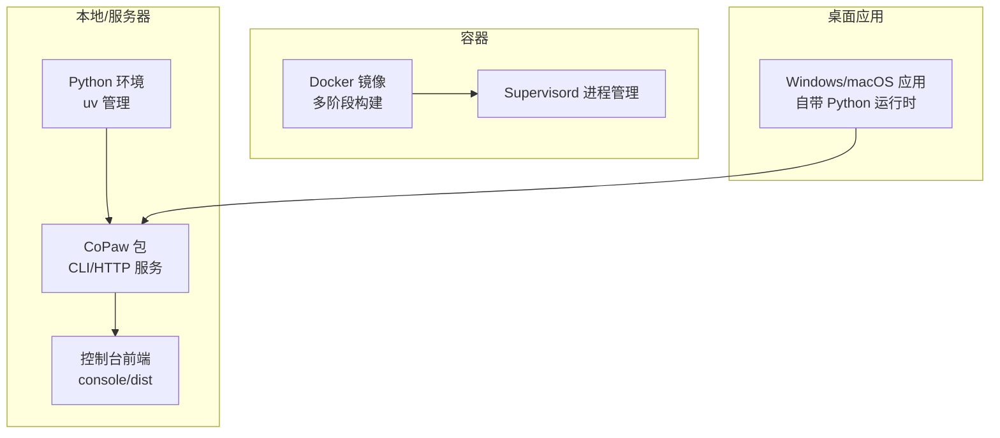
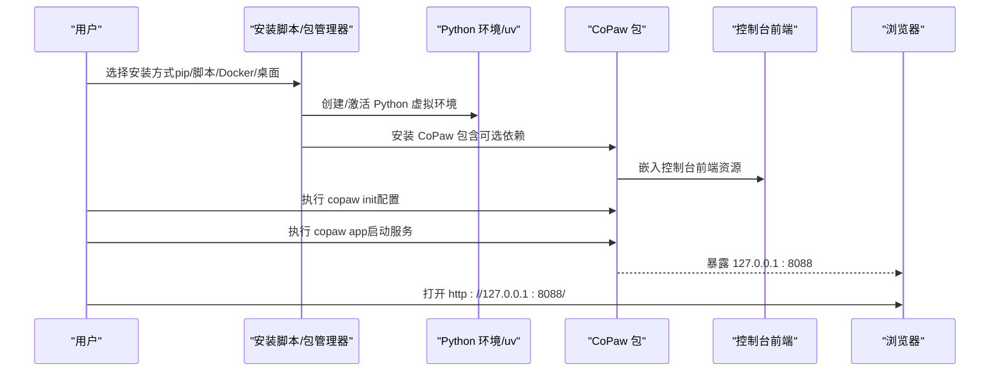
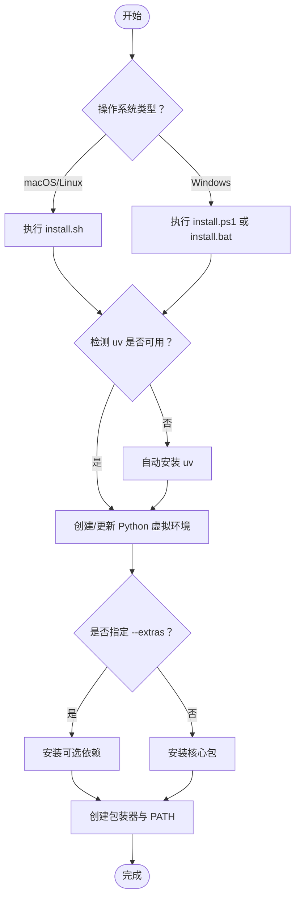
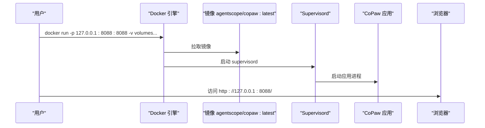
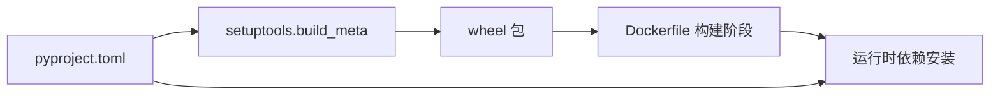

# 快速开始

<cite>
**本文引用的文件**
- [README.md](file://README.md)
- [README_zh.md](file://README_zh.md)
- [scripts/install.sh](file://scripts/install.sh)
- [scripts/install.ps1](file://scripts/install.ps1)
- [scripts/install.bat](file://scripts/install.bat)
- [scripts/README.md](file://scripts/README.md)
- [deploy/Dockerfile](file://deploy/Dockerfile)
- [deploy/entrypoint.sh](file://deploy/entrypoint.sh)
- [docker-compose.yml](file://docker-compose.yml)
- [scripts/pack/README.md](file://scripts/pack/README.md)
- [scripts/pack/README_zh.md](file://scripts/pack/README_zh.md)
- [pyproject.toml](file://pyproject.toml)
- [setup.py](file://setup.py)
- [src/copaw/__version__.py](file://src/copaw/__version__.py)
</cite>

## 目录
1. [简介](#简介)
2. [项目结构](#项目结构)
3. [核心组件](#核心组件)
4. [架构总览](#架构总览)
5. [详细组件分析](#详细组件分析)
6. [依赖关系分析](#依赖关系分析)
7. [性能考虑](#性能考虑)
8. [故障排除指南](#故障排除指南)
9. [结论](#结论)
10. [附录](#附录)

## 简介
本指南面向初学者，帮助你在本地或云端快速安装并运行 CoPaw。你将学会通过多种方式安装：pip、脚本安装（自动管理 Python）、Docker 部署以及桌面应用安装。同时，我们将提供环境准备、依赖安装、初始化配置、首次启动验证以及常见问题的解决方案。

## 项目结构
CoPaw 采用前后端分离与多部署形态的设计：
- 前端控制台位于 console/，通过构建后嵌入到 Python 包中，随安装提供 Web 界面。
- 后端为 Python 包，提供 CLI、HTTP 服务、多通道适配与技能系统。
- 部署支持：pip 安装、脚本安装（uv 管理 Python）、Docker 镜像、桌面应用（Windows/macOS）。

图表来源
- [deploy/Dockerfile:1-103](file://deploy/Dockerfile#L1-L103)
- [scripts/install.sh:1-340](file://scripts/install.sh#L1-L340)
- [scripts/install.ps1:1-477](file://scripts/install.ps1#L1-L477)
- [scripts/install.bat:1-557](file://scripts/install.bat#L1-L557)

章节来源
- [README.md:99-114](file://README.md#L99-L114)
- [README_zh.md:99-114](file://README_zh.md#L99-L114)

## 核心组件
- CLI 与初始化：copaw init、copaw app 提供最小安装路径。
- 控制台 Web UI：浏览器访问 http://127.0.0.1:8088/。
- 本地模型支持：llama.cpp、MLX、Ollama 可通过可选依赖启用。
- Docker 镜像：官方镜像 agentscope/copaw，持久化工作目录与密钥目录。
- 桌面应用：Windows/macOS 一键安装，自动打开浏览器。

章节来源
- [README.md:101-114](file://README.md#L101-L114)
- [README_zh.md:101-114](file://README_zh.md#L101-L114)
- [pyproject.toml:65-93](file://pyproject.toml#L65-L93)

## 架构总览
下图展示从安装到首次启动的关键流程与组件交互。

图表来源
- [scripts/install.sh:104-147](file://scripts/install.sh#L104-L147)
- [scripts/install.ps1:121-209](file://scripts/install.ps1#L121-L209)
- [scripts/install.bat:163-225](file://scripts/install.bat#L163-L225)
- [deploy/Dockerfile:82-92](file://deploy/Dockerfile#L82-L92)
- [deploy/entrypoint.sh:1-10](file://deploy/entrypoint.sh#L1-L10)

## 详细组件分析

### 方式一：pip 安装（适合有 Python 环境的用户）
- 适用场景
  - 已有 Python 环境（3.10 ≤ 版本 < 3.14）。
  - 希望手动管理依赖与虚拟环境。
- 步骤
  1) 安装：pip install copaw
  2) 初始化：copaw init --defaults
  3) 启动：copaw app
  4) 访问：浏览器打开 http://127.0.0.1:8088/
- 注意事项
  - 如需本地模型支持，安装对应可选依赖（见“可选依赖”）。
  - 若未配置 API Key，将无法使用云端模型提供商。

章节来源
- [README.md:101-114](file://README.md#L101-L114)
- [README_zh.md:101-114](file://README_zh.md#L101-L114)

### 方式二：脚本安装（自动管理 Python，推荐新手）
- 适用场景
  - 不想手动安装 Python。
  - macOS/Linux 或 Windows（PowerShell/CMD）。
- 步骤
  - macOS/Linux：curl -fsSL https://copaw.agentscope.io/install.sh | bash
  - Windows（PowerShell）：irm https://copaw.agentscope.io/install.ps1 | iex
  - Windows（CMD）：curl -fsSL https://copaw.agentscope.io/install.bat -o install.bat && install.bat
- 可选特性
  - 安装本地模型支持：--extras ollama、--extras llamacpp、--extras mlx，或组合使用。
  - 指定版本：--version X.Y.Z
  - 从源码安装：--from-source [本地目录]
- 注意事项
  - Windows 企业版 LTSC 可能处于受限语言模式，导致自动写入环境变量失败，需按提示手动配置 PATH。
  - 若自动安装 uv 失败，按提示手动安装 uv 后重试。

图表来源
- [scripts/install.sh:104-147](file://scripts/install.sh#L104-L147)
- [scripts/install.ps1:121-193](file://scripts/install.ps1#L121-L193)
- [scripts/install.bat:163-225](file://scripts/install.bat#L163-L225)

章节来源
- [README.md:115-180](file://README.md#L115-L180)
- [README_zh.md:115-180](file://README_zh.md#L115-L180)
- [scripts/install.sh:1-340](file://scripts/install.sh#L1-L340)
- [scripts/install.ps1:1-477](file://scripts/install.ps1#L1-L477)
- [scripts/install.bat:1-557](file://scripts/install.bat#L1-L557)

### 方式三：Docker 部署（适合容器化与云上部署）
- 适用场景
  - 希望快速拉起、持久化配置与密钥、隔离性强。
- 步骤
  1) 拉取镜像：docker pull agentscope/copaw:latest
  2) 运行容器：映射端口与卷，挂载工作目录与密钥目录
  3) 访问：浏览器打开 http://127.0.0.1:8088/
- 连接宿主机服务
  - 容器内 localhost ≠ 主机，可通过 host.docker.internal 或 host 网络模式访问。
- 可选
  - 使用阿里云容器镜像服务（ACR）加速拉取。
  - docker-compose 一键编排。

图表来源
- [deploy/Dockerfile:82-102](file://deploy/Dockerfile#L82-L102)
- [deploy/entrypoint.sh:1-10](file://deploy/entrypoint.sh#L1-L10)
- [docker-compose.yml:9-23](file://docker-compose.yml#L9-L23)

章节来源
- [README.md:273-317](file://README.md#L273-L317)
- [README_zh.md:273-317](file://README_zh.md#L273-L317)
- [deploy/Dockerfile:1-103](file://deploy/Dockerfile#L1-L103)
- [deploy/entrypoint.sh:1-10](file://deploy/entrypoint.sh#L1-L10)
- [docker-compose.yml:1-23](file://docker-compose.yml#L1-L23)

### 方式四：桌面应用（Windows/macOS，零配置）
- 适用场景
  - 不想接触命令行，希望双击即用。
- 步骤
  1) 从 GitHub Releases 下载对应平台安装包。
  2) 安装后首次启动可能需要 10–60 秒初始化环境。
  3) 自动打开浏览器访问控制台。
- 注意事项
  - macOS 可能因未公证出现 Gatekeeper 提示，按提示“右键打开”或在系统设置中放行。
  - 如遇权限问题（如“请求访问桌面的文件”），请允许相应权限。

章节来源
- [README.md:230-272](file://README.md#L230-L272)
- [README_zh.md:230-272](file://README_zh.md#L230-L272)
- [scripts/pack/README.md:59-73](file://scripts/pack/README.md#L59-L73)
- [scripts/pack/README_zh.md:59-71](file://scripts/pack/README_zh.md#L59-L71)

### 环境准备与依赖安装
- Python 版本要求
  - 3.10 ≤ 版本 < 3.14。
- 可选依赖（按需安装）
  - llama.cpp：pip install 'copaw[llamacpp]'
  - MLX（Apple Silicon）：pip install 'copaw[mlx]'
  - Ollama：pip install 'copaw[ollama]'
  - 全量：pip install 'copaw[full]'
- 本地模型使用
  - 在控制台中下载与管理本地模型，或使用命令行：copaw models download <模型名>；copaw models；copaw app

章节来源
- [pyproject.toml:6-37](file://pyproject.toml#L6-L37)
- [pyproject.toml:65-93](file://pyproject.toml#L65-L93)
- [README.md:340-357](file://README.md#L340-L357)
- [README_zh.md:342-363](file://README_zh.md#L342-L363)

### 初始化配置与首次启动验证
- 初始化
  - copaw init --defaults（或交互式 copaw init）
  - 可在控制台设置模型提供商与 API Key，或通过环境变量配置。
- 启动
  - copaw app
  - 浏览器打开 http://127.0.0.1:8088/
- 验证
  - 控制台可聊天、配置 Agent、查看工作目录与配置文件。
  - 若使用本地模型，可在控制台中选择已下载的模型并启动服务。

章节来源
- [README.md:107-114](file://README.md#L107-L114)
- [README_zh.md:107-114](file://README_zh.md#L107-L114)
- [README.md:326-339](file://README.md#L326-L339)
- [README_zh.md:328-341](file://README_zh.md#L328-L341)

## 依赖关系分析
- 包管理与构建
  - setup.py 委托 setuptools 构建。
  - pyproject.toml 定义动态版本、包发现、可选依赖与脚本入口。
- 前端构建与打包
  - scripts/README.md 提供构建 console 前端与网站的命令。
  - Dockerfile 多阶段构建：先构建 console，再安装 Python 包并注入前端资源。
- 运行时依赖
  - 包含 HTTP、调度、多通道 SDK、Playwright、dotenv 等。

图表来源
- [setup.py:1-5](file://setup.py#L1-L5)
- [pyproject.toml:39-44](file://pyproject.toml#L39-L44)
- [scripts/README.md:5-19](file://scripts/README.md#L5-L19)
- [deploy/Dockerfile:82-89](file://deploy/Dockerfile#L82-L89)

章节来源
- [setup.py:1-5](file://setup.py#L1-L5)
- [pyproject.toml:1-101](file://pyproject.toml#L1-L101)
- [scripts/README.md:1-53](file://scripts/README.md#L1-L53)
- [deploy/Dockerfile:1-103](file://deploy/Dockerfile#L1-L103)

## 性能考虑
- 首次启动时间
  - 桌面应用与脚本安装首次启动可能需要 10–60 秒，用于初始化 Python 环境与加载依赖。
- 本地模型性能
  - llama.cpp/MLX/Ollama 的推理性能与硬件相关，建议在 Apple Silicon 或具备足够显存的设备上体验最佳效果。
- 容器运行
  - 使用 host.docker.internal 或 host 网络模式访问宿主机服务，避免额外网络层延迟。

## 故障排除指南
- Windows 企业版 LTSC（受限语言模式）
  - PowerShell/CMD 脚本可能无法自动写入 PATH，需手动将安装目录加入系统 PATH。
  - 参考安装说明中的“Windows 企业版 LTSC 用户特别提示”。
- uv 安装失败
  - macOS/Linux：按提示手动安装 uv 后重试。
  - Windows：按提示手动安装 uv 或使用 Python -m pip install -U uv。
- Docker 端口冲突
  - 修改映射端口或停止占用端口的服务。
- Docker 访问宿主机服务
  - 使用 host.docker.internal 或 host 网络模式。
- 桌面应用启动无响应
  - macOS：按提示放行 Gatekeeper；检查“请求访问桌面的文件”权限。
  - 查看日志：~/.copaw/desktop.log（Windows 双击无窗口时）；或在终端运行打包应用以查看完整日志。

章节来源
- [README.md:151-173](file://README.md#L151-L173)
- [README_zh.md:151-173](file://README_zh.md#L151-L173)
- [scripts/install.sh:120-132](file://scripts/install.sh#L120-L132)
- [scripts/install.ps1:150-191](file://scripts/install.ps1#L150-L191)
- [scripts/install.bat:195-225](file://scripts/install.bat#L195-L225)
- [README.md:289-314](file://README.md#L289-L314)
- [README_zh.md:291-314](file://README_zh.md#L291-L314)
- [scripts/pack/README.md:55-73](file://scripts/pack/README.md#L55-L73)
- [scripts/pack/README_zh.md:55-71](file://scripts/pack/README_zh.md#L55-L71)

## 结论
通过本指南，你可以根据自身需求选择合适的安装方式：pip 适合有 Python 环境的用户；脚本安装适合新手；Docker 适合容器化与云上部署；桌面应用适合零配置体验。完成安装与初始化后，即可在控制台中配置模型与技能，并开始日常使用。

## 附录
- 版本信息
  - 当前版本：0.2.0.post1
- 常用命令
  - pip 安装：pip install copaw
  - 初始化：copaw init --defaults
  - 启动：copaw app
  - 本地模型：copaw models download <模型名>；copaw models；copaw app
- 参考文档
  - 官方文档与常见问题：README 中的“Documentation”与“FAQ”章节

章节来源
- [src/copaw/__version__.py:1-3](file://src/copaw/__version__.py#L1-L3)
- [README.md:360-386](file://README.md#L360-L386)
- [README_zh.md:366-386](file://README_zh.md#L366-L386)