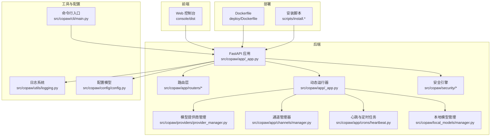
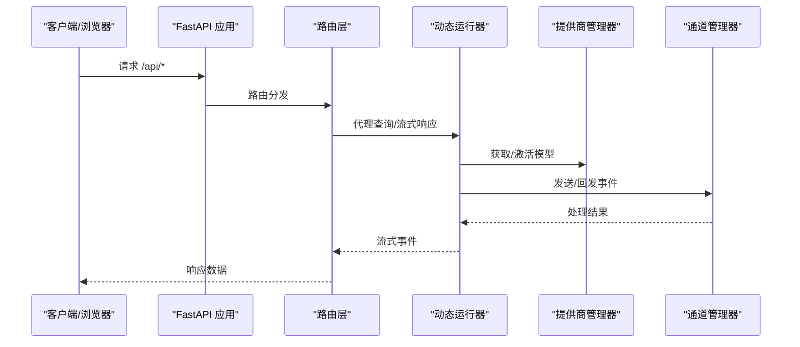
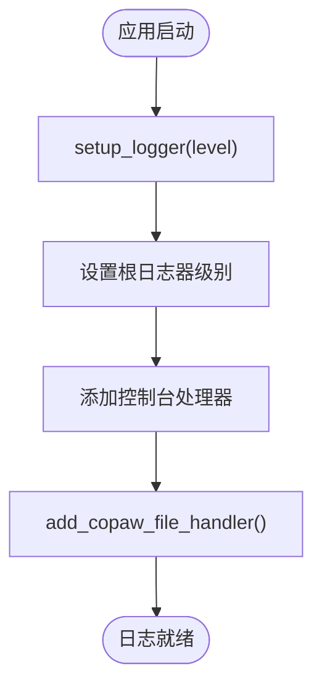
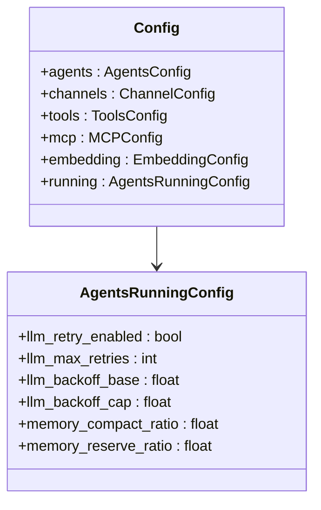
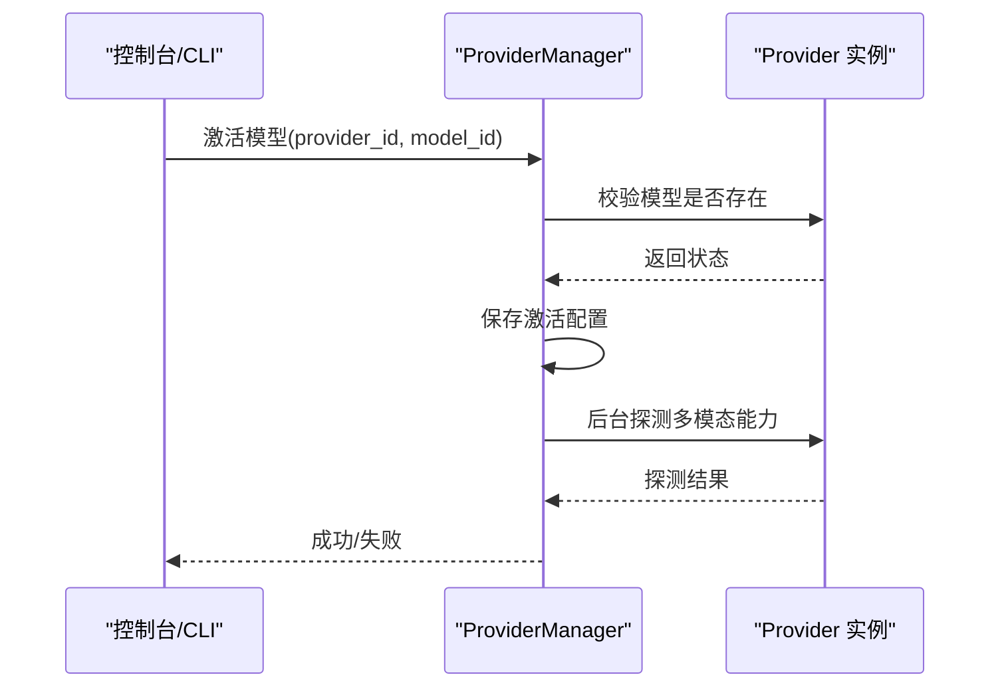
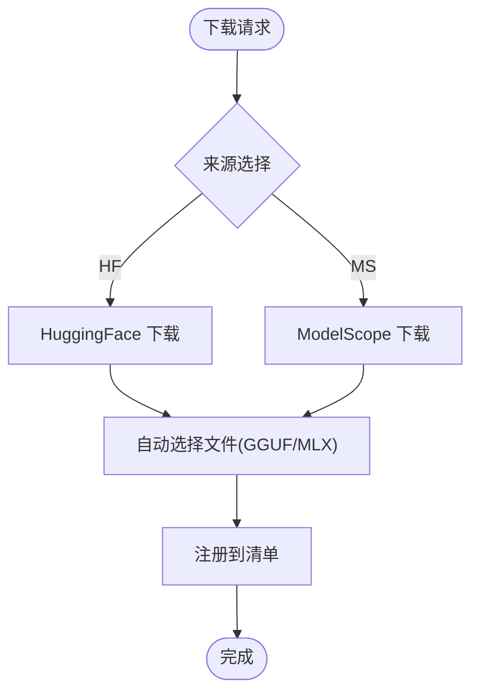
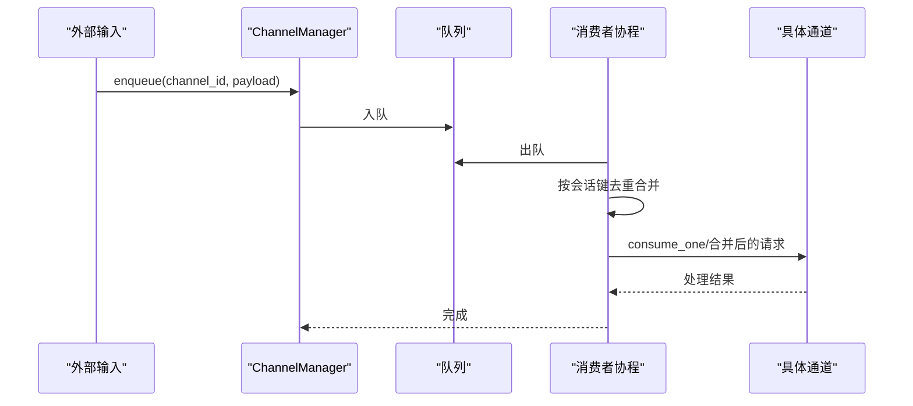
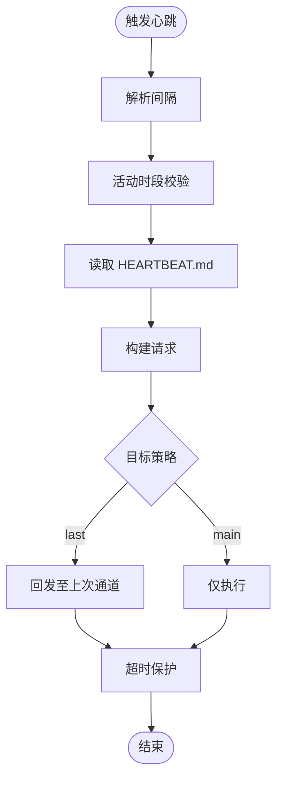
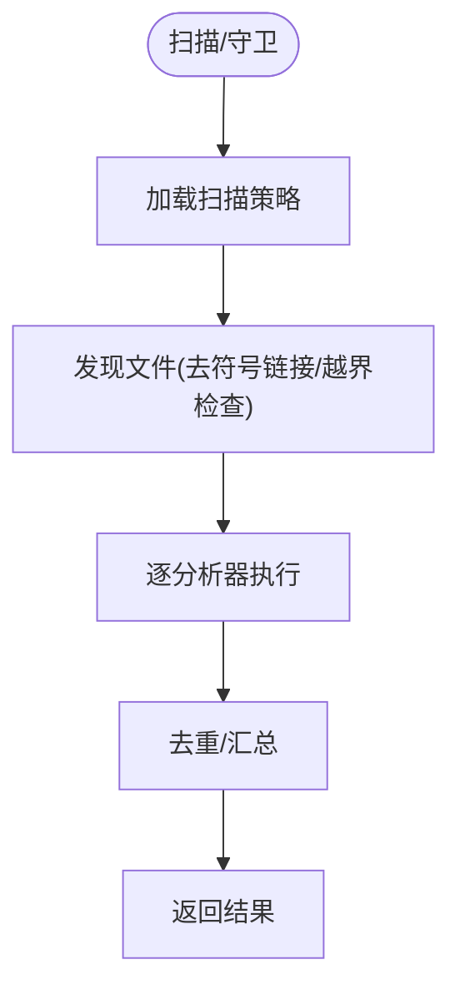
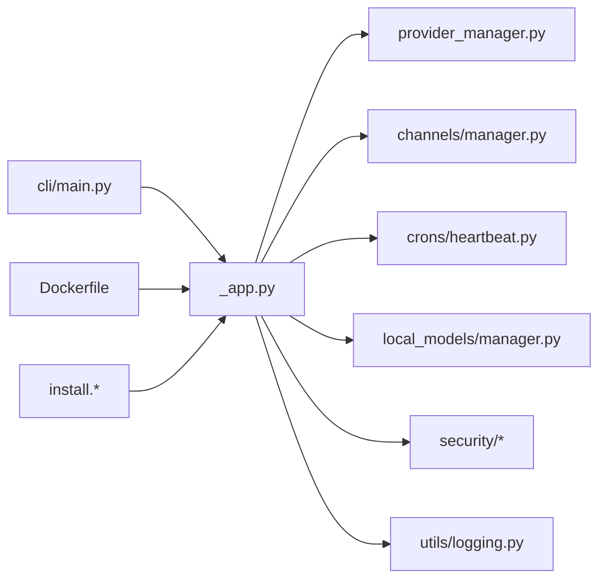

# 故障排除与常见问题

<cite>
**本文引用的文件**
- [README.md](file://README.md)
- [SECURITY.md](file://SECURITY.md)
- [src/copaw/utils/logging.py](file://src/copaw/utils/logging.py)
- [src/copaw/config/config.py](file://src/copaw/config/config.py)
- [deploy/Dockerfile](file://deploy/Dockerfile)
- [scripts/install.sh](file://scripts/install.sh)
- [scripts/install.ps1](file://scripts/install.ps1)
- [scripts/install.bat](file://scripts/install.bat)
- [src/copaw/cli/main.py](file://src/copaw/cli/main.py)
- [src/copaw/app/_app.py](file://src/copaw/app/_app.py)
- [src/copaw/security/tool_guard/engine.py](file://src/copaw/security/tool_guard/engine.py)
- [src/copaw/security/skill_scanner/scanner.py](file://src/copaw/security/skill_scanner/scanner.py)
- [src/copaw/providers/provider_manager.py](file://src/copaw/providers/provider_manager.py)
- [src/copaw/local_models/manager.py](file://src/copaw/local_models/manager.py)
- [src/copaw/app/crons/heartbeat.py](file://src/copaw/app/crons/heartbeat.py)
- [src/copaw/app/channels/manager.py](file://src/copaw/app/channels/manager.py)
</cite>

## 目录
1. [简介](#简介)
2. [项目结构](#项目结构)
3. [核心组件](#核心组件)
4. [架构总览](#架构总览)
5. [详细组件分析](#详细组件分析)
6. [依赖关系分析](#依赖关系分析)
7. [性能考虑](#性能考虑)
8. [故障排除指南](#故障排除指南)
9. [结论](#结论)
10. [附录](#附录)

## 简介
本指南面向使用 CoPaw 的用户与运维人员，提供系统化的故障排除与常见问题处理方案。内容覆盖安装与部署、配置与连接、性能与资源、安全与合规、通道与模型、心跳与定时任务等模块，并给出日志配置、错误追踪、健康检查、调试技巧、恢复策略与实际案例。

## 项目结构
CoPaw 采用前后端分离与多通道适配的架构：前端控制台通过 Web UI 提供配置与管理入口；后端基于 FastAPI 提供 API 服务，支持多代理、多通道、多模型提供商；安全方面内置技能扫描与工具调用守卫；本地模型下载与管理支持多种后端；容器化与脚本安装提供便捷部署方式。

图表来源
- [src/copaw/app/_app.py:243-411](file://src/copaw/app/_app.py#L243-L411)
- [src/copaw/providers/provider_manager.py:573-800](file://src/copaw/providers/provider_manager.py#L573-L800)
- [src/copaw/app/channels/manager.py:114-580](file://src/copaw/app/channels/manager.py#L114-L580)
- [src/copaw/app/crons/heartbeat.py:89-183](file://src/copaw/app/crons/heartbeat.py#L89-L183)
- [src/copaw/local_models/manager.py:94-413](file://src/copaw/local_models/manager.py#L94-L413)
- [src/copaw/security/tool_guard/engine.py:53-238](file://src/copaw/security/tool_guard/engine.py#L53-L238)
- [src/copaw/security/skill_scanner/scanner.py:76-319](file://src/copaw/security/skill_scanner/scanner.py#L76-L319)
- [src/copaw/utils/logging.py:104-185](file://src/copaw/utils/logging.py#L104-L185)
- [src/copaw/config/config.py:1-800](file://src/copaw/config/config.py#L1-L800)
- [src/copaw/cli/main.py:92-162](file://src/copaw/cli/main.py#L92-L162)
- [deploy/Dockerfile:1-103](file://deploy/Dockerfile#L1-L103)
- [scripts/install.sh:1-340](file://scripts/install.sh#L1-L340)
- [scripts/install.ps1:1-477](file://scripts/install.ps1#L1-L477)
- [scripts/install.bat:1-557](file://scripts/install.bat#L1-L557)

章节来源
- [src/copaw/app/_app.py:243-411](file://src/copaw/app/_app.py#L243-L411)
- [deploy/Dockerfile:1-103](file://deploy/Dockerfile#L1-L103)

## 核心组件
- 日志系统：统一输出级别、着色、文件轮转、访问日志过滤，支持跨平台终端与文件输出。
- 配置系统：集中式配置模型（含通道、心跳、工具、MCP、模型槽位等），支持运行时校验与回退。
- 模型提供商管理：内置多家云厂商与本地后端，支持模型发现、能力探测与激活。
- 本地模型管理：HuggingFace/ModelScope 下载、清单维护、目录校验与删除。
- 通道管理：队列化消费、去重合并、并发工作线程、异常隔离与优雅停机。
- 心跳与定时：按间隔执行、活动时段控制、目标通道回发、超时保护。
- 安全：技能扫描（规则签名、文件限制）、工具调用守卫（路径/规则）。
- CLI 与启动：延迟加载子命令、导入耗时统计、版本选项、主机端口解析。

章节来源
- [src/copaw/utils/logging.py:104-185](file://src/copaw/utils/logging.py#L104-L185)
- [src/copaw/config/config.py:1-800](file://src/copaw/config/config.py#L1-L800)
- [src/copaw/providers/provider_manager.py:573-800](file://src/copaw/providers/provider_manager.py#L573-L800)
- [src/copaw/local_models/manager.py:94-413](file://src/copaw/local_models/manager.py#L94-L413)
- [src/copaw/app/channels/manager.py:114-580](file://src/copaw/app/channels/manager.py#L114-L580)
- [src/copaw/app/crons/heartbeat.py:89-183](file://src/copaw/app/crons/heartbeat.py#L89-L183)
- [src/copaw/security/tool_guard/engine.py:53-238](file://src/copaw/security/tool_guard/engine.py#L53-L238)
- [src/copaw/security/skill_scanner/scanner.py:76-319](file://src/copaw/security/skill_scanner/scanner.py#L76-L319)
- [src/copaw/cli/main.py:92-162](file://src/copaw/cli/main.py#L92-L162)

## 架构总览
CoPaw 后端以 FastAPI 为核心，通过动态运行器在多代理间路由请求；通道管理器负责消息入队与并发消费；提供商管理器统一接入云与本地模型；安全引擎在工具调用与技能加载阶段进行风险评估；日志系统贯穿应用生命周期，支持文件与标准输出。

图表来源
- [src/copaw/app/_app.py:149-241](file://src/copaw/app/_app.py#L149-L241)
- [src/copaw/app/_app.py:329-344](file://src/copaw/app/_app.py#L329-L344)
- [src/copaw/providers/provider_manager.py:628-754](file://src/copaw/providers/provider_manager.py#L628-L754)
- [src/copaw/app/channels/manager.py:365-426](file://src/copaw/app/channels/manager.py#L365-L426)

## 详细组件分析

### 日志与可观测性
- 统一命名空间 copaw，仅输出自身包的日志，避免第三方噪声。
- 控制台输出支持 ANSI 彩色与路径简化，文件输出按平台选择 FileHandler 或 RotatingFileHandler。
- 访问日志可按路径片段过滤，降低噪音。
- 启动时设置日志级别，守护进程模式自动附加 copaw.log 文件句柄。

图表来源
- [src/copaw/utils/logging.py:104-185](file://src/copaw/utils/logging.py#L104-L185)

章节来源
- [src/copaw/utils/logging.py:104-185](file://src/copaw/utils/logging.py#L104-L185)
- [src/copaw/app/_app.py:149-155](file://src/copaw/app/_app.py#L149-L155)

### 配置与运行时校验
- 配置模型涵盖通道、心跳、工具、MCP、模型槽位、嵌入与运行参数等。
- 运行参数包含最大迭代次数、重试策略、令牌计数、内存压缩阈值等。
- 配置加载时进行字段校验（如退避上限≥基础延时），异常时抛出错误。

图表来源
- [src/copaw/config/config.py:275-417](file://src/copaw/config/config.py#L275-L417)

章节来源
- [src/copaw/config/config.py:275-417](file://src/copaw/config/config.py#L275-L417)

### 模型提供商管理
- 内置多家云厂商与本地后端（OpenAI、DashScope、Gemini、Ollama、llama.cpp、MLX 等）。
- 支持动态激活模型、后台能力探测（多模态）、自定义提供商注册与持久化。
- 提供列表与信息获取接口，异步并发拉取信息。

图表来源
- [src/copaw/providers/provider_manager.py:738-781](file://src/copaw/providers/provider_manager.py#L738-L781)

章节来源
- [src/copaw/providers/provider_manager.py:573-800](file://src/copaw/providers/provider_manager.py#L573-L800)

### 本地模型管理
- 支持从 HuggingFace/ModelScope 下载，自动选择 GGUF/MLX 文件，注册到清单。
- 清单损坏时自动回退重建，删除模型时清理文件与空目录。
- MLX 模型下载要求完整配置与权重文件，否则提示不完整。

图表来源
- [src/copaw/local_models/manager.py:98-123](file://src/copaw/local_models/manager.py#L98-L123)
- [src/copaw/local_models/manager.py:125-292](file://src/copaw/local_models/manager.py#L125-L292)
- [src/copaw/local_models/manager.py:332-362](file://src/copaw/local_models/manager.py#L332-L362)

章节来源
- [src/copaw/local_models/manager.py:94-413](file://src/copaw/local_models/manager.py#L94-L413)

### 通道与消息处理
- 通道管理器为每个启用通道创建队列与多个消费者，按会话键去重合并，保证消息顺序与完整性。
- 异常捕获与日志记录，停止时取消任务并等待清理。
- 支持按通道发送文本与事件，自动合并元数据与前缀。

图表来源
- [src/copaw/app/channels/manager.py:322-383](file://src/copaw/app/channels/manager.py#L322-L383)
- [src/copaw/app/channels/manager.py:394-426](file://src/copaw/app/channels/manager.py#L394-L426)

章节来源
- [src/copaw/app/channels/manager.py:114-580](file://src/copaw/app/channels/manager.py#L114-L580)

### 心跳与定时任务
- 解析心跳间隔字符串，支持 h/m/s 组合；超出范围回退默认值。
- 活动时段校验，支持用户时区；无效时区回退 UTC。
- 读取 HEARTBEAT.md 作为查询内容，按目标策略回发或仅执行。
- 超时保护，避免长时间阻塞。

图表来源
- [src/copaw/app/crons/heartbeat.py:33-48](file://src/copaw/app/crons/heartbeat.py#L33-L48)
- [src/copaw/app/crons/heartbeat.py:51-86](file://src/copaw/app/crons/heartbeat.py#L51-L86)
- [src/copaw/app/crons/heartbeat.py:89-183](file://src/copaw/app/crons/heartbeat.py#L89-L183)

章节来源
- [src/copaw/app/crons/heartbeat.py:1-183](file://src/copaw/app/crons/heartbeat.py#L1-L183)

### 安全：技能扫描与工具守卫
- 技能扫描：遍历技能目录，按策略跳过扩展名，限制文件数量与大小，去重重复发现，记录分析器使用与失败。
- 工具守卫：按配置启用/禁用，对工具参数进行规则与路径检查，聚合结果并记录耗时。

图表来源
- [src/copaw/security/skill_scanner/scanner.py:148-242](file://src/copaw/security/skill_scanner/scanner.py#L148-L242)
- [src/copaw/security/tool_guard/engine.py:169-227](file://src/copaw/security/tool_guard/engine.py#L169-L227)

章节来源
- [src/copaw/security/skill_scanner/scanner.py:76-319](file://src/copaw/security/skill_scanner/scanner.py#L76-L319)
- [src/copaw/security/tool_guard/engine.py:53-238](file://src/copaw/security/tool_guard/engine.py#L53-L238)

## 依赖关系分析
- CLI 延迟加载子命令，减少启动时间；导入耗时记录用于诊断。
- 应用启动时加载环境变量、初始化多代理管理器、注册审批服务、收集遥测。
- Dockerfile 中预装 Chromium 与 Playwright 依赖，容器内运行需注意网络与沙箱设置。

图表来源
- [src/copaw/cli/main.py:92-162](file://src/copaw/cli/main.py#L92-L162)
- [src/copaw/app/_app.py:149-241](file://src/copaw/app/_app.py#L149-L241)
- [deploy/Dockerfile:1-103](file://deploy/Dockerfile#L1-L103)
- [scripts/install.sh:1-340](file://scripts/install.sh#L1-L340)
- [scripts/install.ps1:1-477](file://scripts/install.ps1#L1-L477)
- [scripts/install.bat:1-557](file://scripts/install.bat#L1-L557)

章节来源
- [src/copaw/cli/main.py:92-162](file://src/copaw/cli/main.py#L92-L162)
- [src/copaw/app/_app.py:149-241](file://src/copaw/app/_app.py#L149-L241)
- [deploy/Dockerfile:1-103](file://deploy/Dockerfile#L1-L103)

## 性能考虑
- 日志级别建议生产环境使用 info，调试时临时提升到 debug 并关注 I/O 开销。
- 通道队列与消费者数量可影响吞吐，建议根据消息量与通道类型调整。
- 本地模型下载建议选择合适量化格式（如 GGUF 的 Q4_K_M），减少磁盘占用与加载时间。
- 模型提供商探测与缓存可减少重复请求，合理设置超时与重试参数。
- Docker 环境下 Chromium 无沙箱运行，注意安全与稳定性权衡。

## 故障排除指南

### 安装与部署问题
- Windows 企业受限语言模式
  - 现象：脚本执行中断、无法写入环境变量。
  - 处理：手动安装 uv 并配置 PATH；重新运行安装脚本。
  - 参考：[README.md:151-172](file://README.md#L151-L172)
- Windows 批处理脚本无法更新 PATH
  - 现象：脚本执行成功但无法写入系统 PATH。
  - 处理：手动在系统环境变量中添加安装目录。
  - 参考：[scripts/install.bat:403-450](file://scripts/install.bat#L403-L450)
- macOS 首次启动耗时较长
  - 现象：桌面应用首次启动 10-60 秒。
  - 处理：耐心等待初始化完成，后续启动更快。
  - 参考：[README.md:252-255](file://README.md#L252-L255)
- Docker 容器内访问宿主服务
  - 现象：容器 localhost 与宿主不同。
  - 处理：使用 host.docker.internal 或 host-gateway；或使用 host 网络。
  - 参考：[README.md:289-312](file://README.md#L289-L312)
- 容器内 Chromium 无沙箱
  - 现象：页面渲染或自动化受限。
  - 处理：接受无沙箱运行或在宿主安装浏览器。
  - 参考：[deploy/Dockerfile:71-78](file://deploy/Dockerfile#L71-L78)

章节来源
- [README.md:151-172](file://README.md#L151-L172)
- [README.md:252-255](file://README.md#L252-L255)
- [README.md:289-312](file://README.md#L289-L312)
- [deploy/Dockerfile:71-78](file://deploy/Dockerfile#L71-L78)
- [scripts/install.bat:403-450](file://scripts/install.bat#L403-L450)

### 配置与连接问题
- API Key 未配置导致无法聊天
  - 现象：控制台提示需配置云模型 API Key。
  - 处理：在 Console 设置中配置，或通过环境变量传入。
  - 参考：[README.md:326-338](file://README.md#L326-L338)
- 通道未启用或配置错误
  - 现象：消息不达或无响应。
  - 处理：检查 config.json 对应通道 enabled 与必要参数；查看通道日志。
  - 参考：[src/copaw/app/channels/manager.py:158-262](file://src/copaw/app/channels/manager.py#L158-L262)
- 模型提供商不可用
  - 现象：模型列表为空或激活失败。
  - 处理：检查网络、密钥、Base URL；尝试刷新模型列表。
  - 参考：[src/copaw/providers/provider_manager.py:670-693](file://src/copaw/providers/provider_manager.py#L670-L693)

章节来源
- [README.md:326-338](file://README.md#L326-L338)
- [src/copaw/app/channels/manager.py:158-262](file://src/copaw/app/channels/manager.py#L158-L262)
- [src/copaw/providers/provider_manager.py:670-693](file://src/copaw/providers/provider_manager.py#L670-L693)

### 性能与资源问题
- 日志过大占用磁盘
  - 现象：copaw.log 文件增长过快。
  - 处理：调整日志级别；确认轮转策略；定期清理。
  - 参考：[src/copaw/utils/logging.py:142-185](file://src/copaw/utils/logging.py#L142-L185)
- 通道积压导致延迟
  - 现象：消息堆积、响应变慢。
  - 处理：增加消费者数量、优化通道实现、检查下游服务。
  - 参考：[src/copaw/app/channels/manager.py:365-383](file://src/copaw/app/channels/manager.py#L365-L383)
- 本地模型下载缓慢
  - 现象：下载卡顿或失败。
  - 处理：更换镜像源、检查网络、选择合适量化文件。
  - 参考：[src/copaw/local_models/manager.py:125-186](file://src/copaw/local_models/manager.py#L125-L186)

章节来源
- [src/copaw/utils/logging.py:142-185](file://src/copaw/utils/logging.py#L142-L185)
- [src/copaw/app/channels/manager.py:365-383](file://src/copaw/app/channels/manager.py#L365-L383)
- [src/copaw/local_models/manager.py:125-186](file://src/copaw/local_models/manager.py#L125-L186)

### 安全与合规问题
- 技能扫描发现高危模式
  - 现象：扫描报告包含高/严重等级问题。
  - 处理：根据策略调整规则、移除可疑文件、限制启用范围。
  - 参考：[SECURITY.md:85-98](file://SECURITY.md#L85-L98)
- 工具调用被拒绝
  - 现象：执行 shell/文件操作被拦截。
  - 处理：检查工具守卫策略与规则，必要时申请审批。
  - 参考：[src/copaw/security/tool_guard/engine.py:169-227](file://src/copaw/security/tool_guard/engine.py#L169-L227)

章节来源
- [SECURITY.md:85-98](file://SECURITY.md#L85-L98)
- [src/copaw/security/tool_guard/engine.py:169-227](file://src/copaw/security/tool_guard/engine.py#L169-L227)

### 心跳与定时任务问题
- 心跳未执行
  - 现象：HEARTBEAT.md 不存在或为空。
  - 处理：创建文件并写入查询内容；检查活动时段与时区。
  - 参考：[src/copaw/app/crons/heartbeat.py:119-127](file://src/copaw/app/crons/heartbeat.py#L119-L127)
- 心跳超时
  - 现象：执行超过 120 秒。
  - 处理：优化查询逻辑、减少工具调用、检查下游服务。
  - 参考：[src/copaw/app/crons/heartbeat.py:179-183](file://src/copaw/app/crons/heartbeat.py#L179-L183)

章节来源
- [src/copaw/app/crons/heartbeat.py:119-127](file://src/copaw/app/crons/heartbeat.py#L119-L127)
- [src/copaw/app/crons/heartbeat.py:179-183](file://src/copaw/app/crons/heartbeat.py#L179-L183)

### 健康检查与调试
- 健康检查
  - 使用 /api/version 获取版本信息；检查 /docs 是否可用（受 DOCS_ENABLED 控制）。
  - 参考：[src/copaw/app/_app.py:323-327](file://src/copaw/app/_app.py#L323-L327)
- 调试技巧
  - CLI 启动时记录导入耗时，定位启动慢的模块。
  - 参考：[src/copaw/cli/main.py:28-53](file://src/copaw/cli/main.py#L28-L53)
- 错误追踪
  - 查看 copaw.log 文件；在调试模式下提高日志级别；关注通道与提供商异常堆栈。
  - 参考：[src/copaw/app/_app.py:149-155](file://src/copaw/app/_app.py#L149-L155)

章节来源
- [src/copaw/app/_app.py:323-327](file://src/copaw/app/_app.py#L323-L327)
- [src/copaw/cli/main.py:28-53](file://src/copaw/cli/main.py#L28-L53)
- [src/copaw/app/_app.py:149-155](file://src/copaw/app/_app.py#L149-L155)

### 实际故障案例
- 桡骨远端骨折术后康复训练依从性差
  - 诊断：通过智能问答与康复计划生成，结合提醒与反馈机制提升依从性。
  - 处理：配置定时任务与通道提醒，持续跟踪训练进度。
  - 参考：[src/copaw/app/crons/heartbeat.py:89-183](file://src/copaw/app/crons/heartbeat.py#L89-L183)
- 企业微信多租户隔离
  - 诊断：多用户共享实例导致上下文混淆。
  - 处理：按用户/主机隔离，分别配置独立实例与凭据。
  - 参考：[SECURITY.md:109-118](file://SECURITY.md#L109-L118)

章节来源
- [src/copaw/app/crons/heartbeat.py:89-183](file://src/copaw/app/crons/heartbeat.py#L89-L183)
- [SECURITY.md:109-118](file://SECURITY.md#L109-L118)

## 结论
通过规范的日志与配置、完善的通道与模型管理、严格的安全扫描与守卫，以及容器化与脚本化安装，CoPaw 在易用性与可运维性之间取得平衡。遇到问题时，优先从日志入手，结合配置校验与网络连通性检查，逐步缩小范围并采取针对性措施。

## 附录

### 用户自助排查步骤
- 确认安装与环境
  - 检查 Python 版本与 uv 状态；核对 PATH；验证控制台可用性。
  - 参考：[scripts/install.sh:104-134](file://scripts/install.sh#L104-L134)，[scripts/install.ps1:121-193](file://scripts/install.ps1#L121-L193)，[scripts/install.bat:163-225](file://scripts/install.bat#L163-L225)
- 启动与健康检查
  - 启动后访问 /api/version；检查 /docs 是否可用；查看 copaw.log。
  - 参考：[src/copaw/app/_app.py:323-327](file://src/copaw/app/_app.py#L323-L327)，[src/copaw/app/_app.py:149-155](file://src/copaw/app/_app.py#L149-L155)
- 配置与连接
  - 在 Console 设置中配置 API Key 与模型；检查通道 enabled 与必要参数。
  - 参考：[README.md:326-338](file://README.md#L326-L338)，[src/copaw/app/channels/manager.py:158-262](file://src/copaw/app/channels/manager.py#L158-L262)
- 性能与资源
  - 调整日志级别；检查通道队列长度；优化本地模型下载策略。
  - 参考：[src/copaw/utils/logging.py:142-185](file://src/copaw/utils/logging.py#L142-L185)，[src/copaw/app/channels/manager.py:365-383](file://src/copaw/app/channels/manager.py#L365-L383)，[src/copaw/local_models/manager.py:125-186](file://src/copaw/local_models/manager.py#L125-L186)

### 错误码与含义（示例）
- 通道未找到：发送事件时通道名称错误，检查通道注册与名称大小写。
  - 参考：[src/copaw/app/channels/manager.py:508-511](file://src/copaw/app/channels/manager.py#L508-L511)
- 模型未找到：激活模型时 provider_id 或 model_id 不匹配。
  - 参考：[src/copaw/providers/provider_manager.py:742-748](file://src/copaw/providers/provider_manager.py#L742-L748)
- 心跳超时：执行时间超过 120 秒，检查工具调用与下游服务。
  - 参考：[src/copaw/app/crons/heartbeat.py:179-183](file://src/copaw/app/crons/heartbeat.py#L179-L183)

### 恢复策略
- 配置回滚：保留上一次有效配置；通过 Console 或编辑 config.json 恢复。
- 数据迁移：本地模型清单损坏时自动回退；通道状态可重启恢复。
- 安全回退：关闭工具守卫或技能扫描，定位问题后再启用。
  - 参考：[src/copaw/security/tool_guard/engine.py:35-51](file://src/copaw/security/tool_guard/engine.py#L35-L51)，[src/copaw/security/skill_scanner/scanner.py:100-134](file://src/copaw/security/skill_scanner/scanner.py#L100-L134)