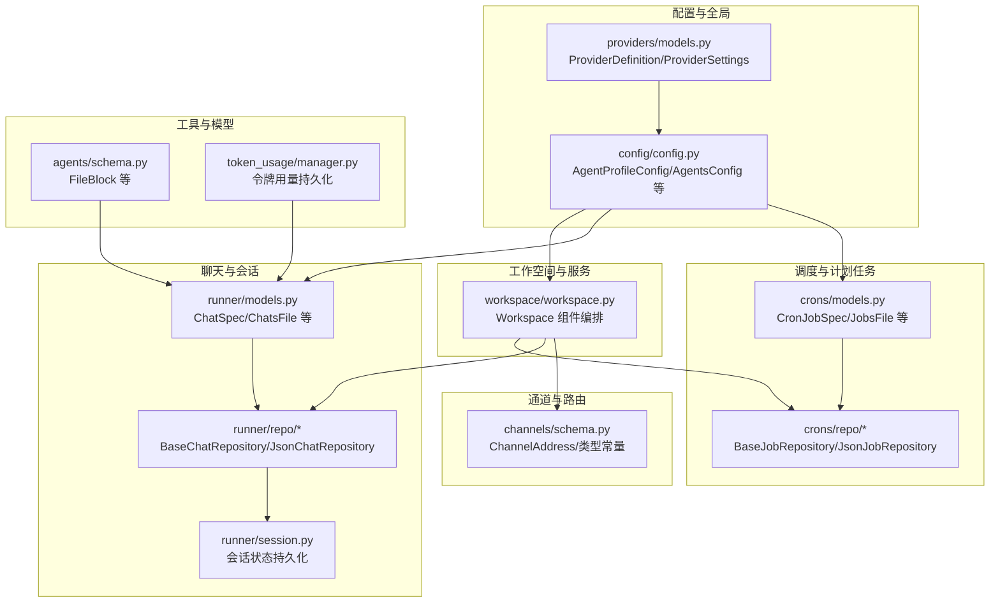
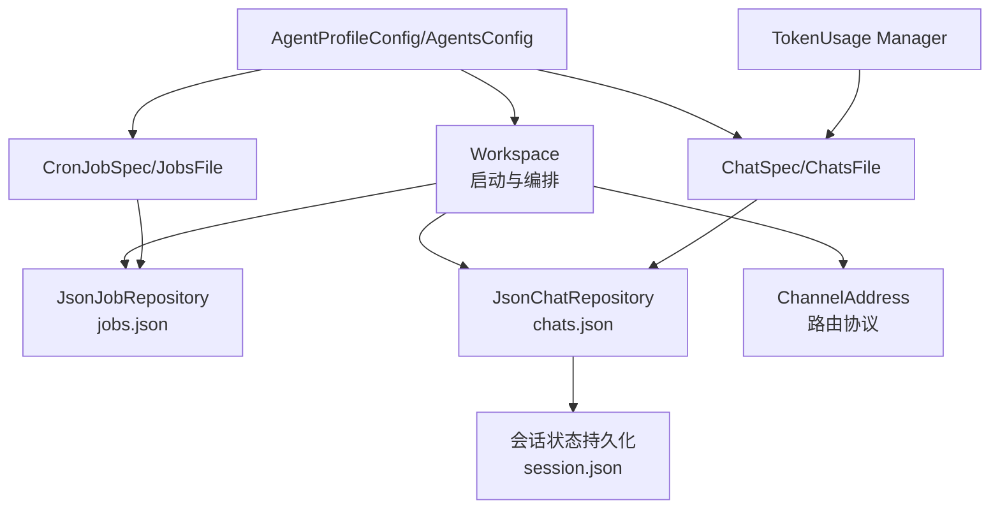
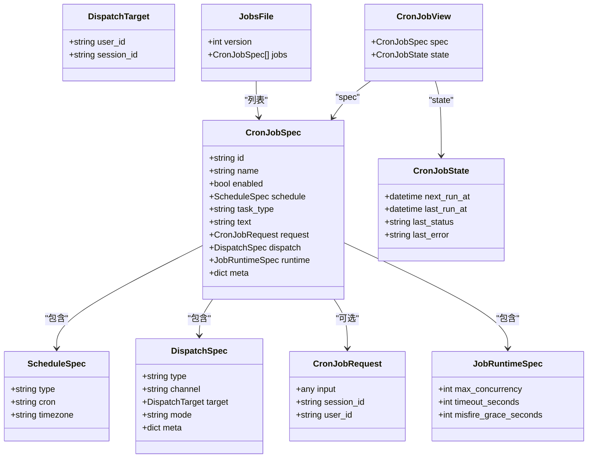
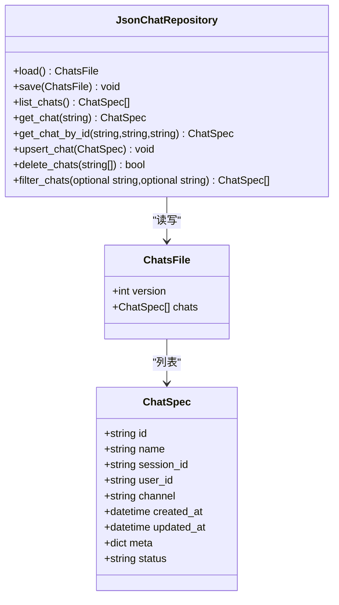
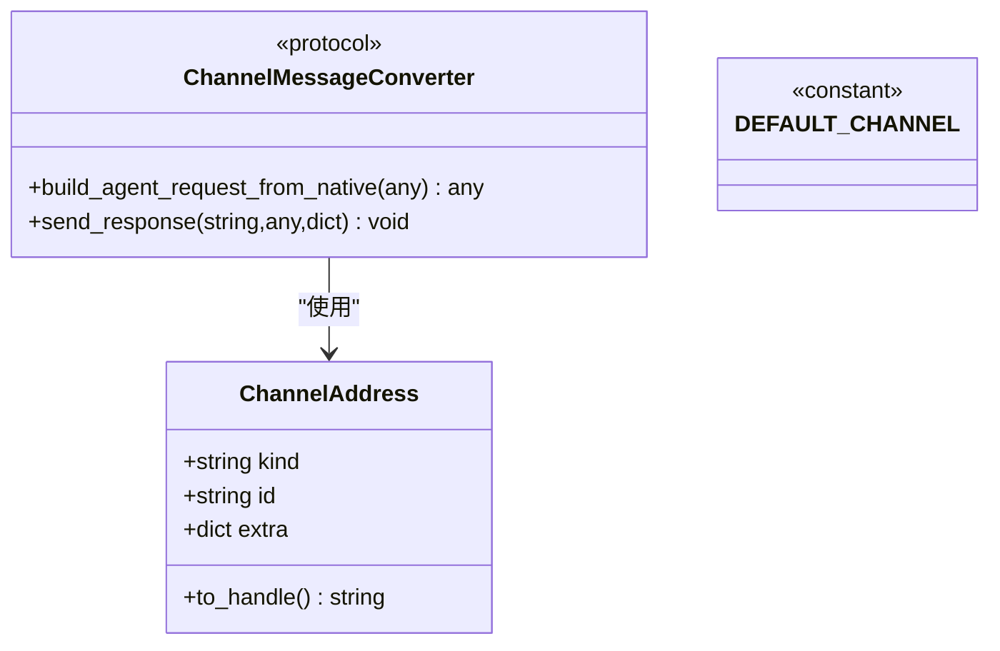
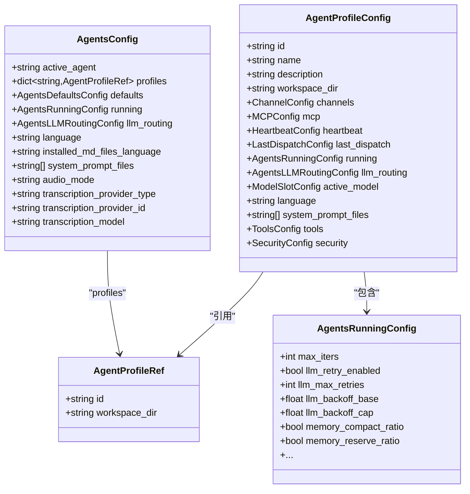
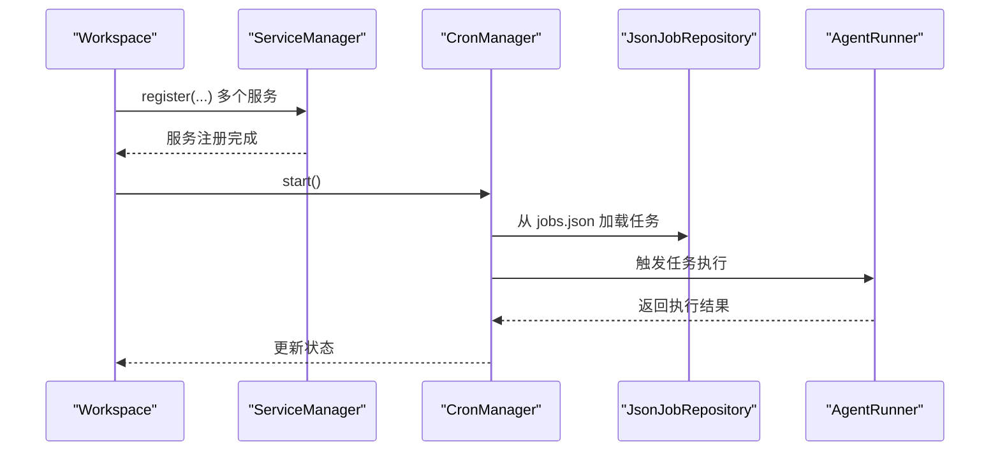
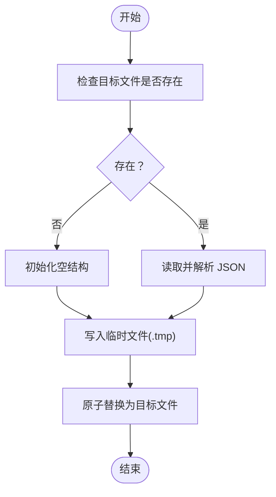
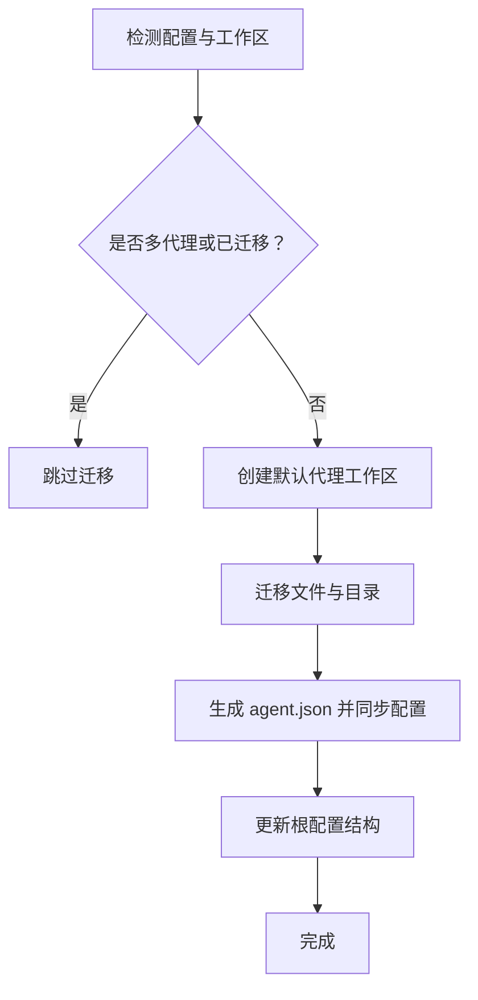
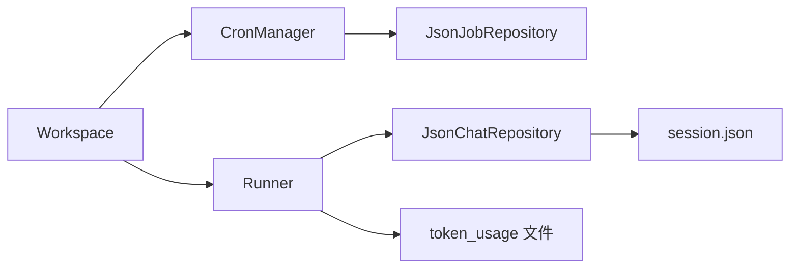

# 数据模型参考

<cite>
**本文引用的文件**
- [src/copaw/app/crons/models.py](file://src/copaw/app/crons/models.py)
- [src/copaw/app/runner/models.py](file://src/copaw/app/runner/models.py)
- [src/copaw/app/workspace/workspace.py](file://src/copaw/app/workspace/workspace.py)
- [src/copaw/app/channels/schema.py](file://src/copaw/app/channels/schema.py)
- [src/copaw/config/config.py](file://src/copaw/config/config.py)
- [src/copaw/app/crons/repo/base.py](file://src/copaw/app/crons/repo/base.py)
- [src/copaw/app/crons/repo/json_repo.py](file://src/copaw/app/crons/repo/json_repo.py)
- [src/copaw/app/runner/repo/base.py](file://src/copaw/app/runner/repo/base.py)
- [src/copaw/app/runner/repo/json_repo.py](file://src/copaw/app/runner/repo/json_repo.py)
- [src/copaw/app/runner/session.py](file://src/copaw/app/runner/session.py)
- [src/copaw/app/migration.py](file://src/copaw/app/migration.py)
- [src/copaw/app/channels/imessage/channel.py](file://src/copaw/app/channels/imessage/channel.py)
- [src/copaw/token_usage/manager.py](file://src/copaw/token_usage/manager.py)
- [src/copaw/providers/models.py](file://src/copaw/providers/models.py)
- [src/copaw/agents/schema.py](file://src/copaw/agents/schema.py)
</cite>

## 目录
1. [简介](#简介)
2. [项目结构](#项目结构)
3. [核心组件](#核心组件)
4. [架构总览](#架构总览)
5. [详细组件分析](#详细组件分析)
6. [依赖分析](#依赖分析)
7. [性能考量](#性能考量)
8. [故障排查指南](#故障排查指南)
9. [结论](#结论)
10. [附录](#附录)

## 简介
本文件为 CoPaw 的数据模型参考，面向开发者与运维人员，系统化梳理核心数据结构、实体关系、字段定义、数据类型、约束与校验规则，并结合实际代码实现给出持久化与运行时行为说明。内容覆盖：
- 核心数据模型（任务调度、聊天会话、通道路由、配置、工具与模型等）
- 主键/外键、索引与约束
- 数据验证规则与业务规则
- 数据访问模式、缓存策略与性能考虑
- 数据生命周期、保留策略与归档规则
- 数据迁移路径与版本管理
- 数据安全、隐私与访问控制要点
- 使用示例与最佳实践

## 项目结构
围绕数据模型的关键模块分布如下：
- 调度与计划任务：crons 模块的模型与仓库
- 聊天与会话：runner 模块的模型与仓库
- 工作空间与服务编排：workspace 模块
- 通道与路由：channels 模块
- 配置与全局设置：config 模块
- 提供商与模型：providers 模块
- 工具响应数据结构：agents 模块
- 运行时状态与持久化：session、token_usage 等

**图表来源**
- [src/copaw/app/crons/models.py:123-173](file://src/copaw/app/crons/models.py#L123-L173)
- [src/copaw/app/crons/repo/base.py:10-54](file://src/copaw/app/crons/repo/base.py#L10-L54)
- [src/copaw/app/crons/repo/json_repo.py:12-46](file://src/copaw/app/crons/repo/json_repo.py#L12-L46)
- [src/copaw/app/runner/models.py:15-68](file://src/copaw/app/runner/models.py#L15-L68)
- [src/copaw/app/runner/repo/base.py:12-146](file://src/copaw/app/runner/repo/base.py#L12-L146)
- [src/copaw/app/runner/repo/json_repo.py:13-70](file://src/copaw/app/runner/repo/json_repo.py#L13-L70)
- [src/copaw/app/runner/session.py:180-218](file://src/copaw/app/runner/session.py#L180-L218)
- [src/copaw/app/workspace/workspace.py:134-278](file://src/copaw/app/workspace/workspace.py#L134-L278)
- [src/copaw/app/channels/schema.py:12-71](file://src/copaw/app/channels/schema.py#L12-L71)
- [src/copaw/config/config.py:444-517](file://src/copaw/config/config.py#L444-L517)
- [src/copaw/providers/models.py:16-42](file://src/copaw/providers/models.py#L16-L42)
- [src/copaw/agents/schema.py:11-22](file://src/copaw/agents/schema.py#L11-L22)
- [src/copaw/token_usage/manager.py:69-108](file://src/copaw/token_usage/manager.py#L69-L108)

**章节来源**
- [src/copaw/app/workspace/workspace.py:134-278](file://src/copaw/app/workspace/workspace.py#L134-L278)
- [src/copaw/app/crons/models.py:123-173](file://src/copaw/app/crons/models.py#L123-L173)
- [src/copaw/app/runner/models.py:15-68](file://src/copaw/app/runner/models.py#L15-L68)
- [src/copaw/app/channels/schema.py:12-71](file://src/copaw/app/channels/schema.py#L12-L71)
- [src/copaw/config/config.py:444-517](file://src/copaw/config/config.py#L444-L517)

## 核心组件
本节对关键数据模型进行逐项说明，包括字段、类型、约束与默认值。

- 调度任务模型（CronJobSpec）
  - 字段与类型：id、name、enabled、schedule（ScheduleSpec）、task_type（"text"|"agent"）、text、request（CronJobRequest）、dispatch（DispatchSpec）、runtime（JobRuntimeSpec）、meta（dict）
  - 约束与校验：
    - 当 task_type 为 "text" 时，text 必须非空
    - 当 task_type 为 "agent" 时，request 不可为空，且 request 中的 user_id、session_id 将与 dispatch.target 同步
  - 关系：与 JobsFile（version、jobs 列表）组合存储

- 调度时间表达式（ScheduleSpec）
  - 字段：type（默认 "cron"）、cron（5/4/3 场景标准化）、timezone（默认 UTC）

- 调度派发目标（DispatchSpec）
  - 字段：type（默认 "channel"）、channel（默认通道）、target（DispatchTarget）、mode（"stream"|"final"）、meta（dict）

- 派发目标主体（DispatchTarget）
  - 字段：user_id、session_id

- 任务运行参数（JobRuntimeSpec）
  - 字段：max_concurrency（≥1）、timeout_seconds（≥1）、misfire_grace_seconds（≥0）

- 调度请求载荷（CronJobRequest）
  - 字段：input、session_id、user_id；额外字段允许（extra="allow"）

- 调度状态视图（CronJobState/CronJobView）
  - 字段：next_run_at、last_run_at、last_status（枚举）、last_error

- 聊天模型（ChatSpec/ChatsFile）
  - ChatSpec：id（UUID，默认生成）、name、session_id、user_id、channel（默认 DEFAULT_CHANNEL）、created_at、updated_at、meta、status（"idle"|"running"）
  - ChatsFile：version、chats 列表

- 通道路由（ChannelAddress）
  - 字段：kind（如 "dm"/"channel"/"webhook"/"console" 等）、id、extra（dict）
  - 方法：to_handle()

- 通道类型常量（BUILTIN_CHANNEL_TYPES）
  - 内置类型集合：imessage、discord、dingtalk、feishu、qq、telegram、mqtt、console、voice、xiaoyi

- 配置模型（AgentProfileConfig/AgentsConfig）
  - AgentProfileConfig：id、name、description、workspace_dir、channels、mcp、heartbeat、last_dispatch、running、llm_routing、active_model、language、system_prompt_files、tools、security
  - AgentsConfig：active_agent、profiles（映射 AgentProfileRef）、defaults、running、llm_routing、language、installed_md_files_language、system_prompt_files、audio_mode、transcription_provider_type、transcription_provider_id、transcription_model

- 通道配置基类与内置类型
  - BaseChannelConfig：enabled、bot_prefix、filter_tool_messages、filter_thinking、dm_policy、group_policy、allow_from、deny_message、require_mention
  - 多种内置通道配置类（IMessageChannelConfig、DiscordConfig、DingTalkConfig、FeishuConfig、QQConfig、TelegramConfig、MQTTConfig、MattermostConfig、ConsoleConfig、WecomConfig、MatrixConfig、VoiceChannelConfig、XiaoYiConfig、WeixinConfig）

- 提供商与模型
  - ProviderDefinition：id、name、default_base_url、api_key_prefix、models、is_custom、is_local、chat_model
  - ProviderSettings：（在 providers/models.py 中定义）

- 工具响应数据结构（agents/schema.py）
  - FileBlock：type（"file"）、source（Base64Source|URLSource）、filename（可选）

**章节来源**
- [src/copaw/app/crons/models.py:58-173](file://src/copaw/app/crons/models.py#L58-L173)
- [src/copaw/app/runner/models.py:15-68](file://src/copaw/app/runner/models.py#L15-L68)
- [src/copaw/app/channels/schema.py:12-71](file://src/copaw/app/channels/schema.py#L12-L71)
- [src/copaw/config/config.py:31-589](file://src/copaw/config/config.py#L31-L589)
- [src/copaw/providers/models.py:16-42](file://src/copaw/providers/models.py#L16-L42)
- [src/copaw/agents/schema.py:11-22](file://src/copaw/agents/schema.py#L11-L22)

## 架构总览
下图展示数据模型在系统中的交互关系与持久化路径：

**图表来源**
- [src/copaw/app/workspace/workspace.py:230-251](file://src/copaw/app/workspace/workspace.py#L230-L251)
- [src/copaw/app/crons/repo/json_repo.py:12-46](file://src/copaw/app/crons/repo/json_repo.py#L12-L46)
- [src/copaw/app/runner/repo/json_repo.py:13-70](file://src/copaw/app/runner/repo/json_repo.py#L13-L70)
- [src/copaw/app/runner/session.py:180-218](file://src/copaw/app/runner/session.py#L180-L218)
- [src/copaw/token_usage/manager.py:69-108](file://src/copaw/token_usage/manager.py#L69-L108)

## 详细组件分析

### 调度任务数据模型
- 结构与关系
  - CronJobSpec 由 ScheduleSpec、DispatchSpec、CronJobRequest、JobRuntimeSpec 组合而成
  - JobsFile 包含 version 与 jobs 列表
  - CronJobState/CronJobView 提供运行态视图

- 关键约束
  - cron 表达式在 5/4/3 字段场景下进行标准化处理（day-of-week 数字到英文缩写）
  - task_type 与字段一致性校验（text 需要非空 text；agent 需要 request）

- 存储与访问
  - JsonJobRepository 基于 jobs.json 文件单机原子写入（先写临时文件再替换）
  - BaseJobRepository 提供通用 CRUD 与查询接口

**图表来源**
- [src/copaw/app/crons/models.py:58-173](file://src/copaw/app/crons/models.py#L58-L173)

**章节来源**
- [src/copaw/app/crons/models.py:58-173](file://src/copaw/app/crons/models.py#L58-L173)
- [src/copaw/app/crons/repo/base.py:10-54](file://src/copaw/app/crons/repo/base.py#L10-L54)
- [src/copaw/app/crons/repo/json_repo.py:12-46](file://src/copaw/app/crons/repo/json_repo.py#L12-L46)

### 聊天与会话数据模型
- 结构与关系
  - ChatSpec 作为会话标识与元信息载体，ChatsFile 用于 JSON 存储
  - JsonChatRepository 提供基于 chats.json 的原子写入与读取
  - BaseChatRepository 提供按 id、按 session_id+user_id+channel 的查询与过滤

- 关键字段与默认值
  - id：UUID，默认自动生成
  - name：默认 "New Chat"
  - channel：默认 DEFAULT_CHANNEL
  - status：默认 "idle"

- 会话状态持久化
  - runner/session.py 支持按 session_id 与 user_id 加载/保存会话状态字典

**图表来源**
- [src/copaw/app/runner/models.py:15-68](file://src/copaw/app/runner/models.py#L15-L68)
- [src/copaw/app/runner/repo/base.py:12-146](file://src/copaw/app/runner/repo/base.py#L12-L146)
- [src/copaw/app/runner/repo/json_repo.py:13-70](file://src/copaw/app/runner/repo/json_repo.py#L13-L70)

**章节来源**
- [src/copaw/app/runner/models.py:15-68](file://src/copaw/app/runner/models.py#L15-L68)
- [src/copaw/app/runner/repo/base.py:12-146](file://src/copaw/app/runner/repo/base.py#L12-L146)
- [src/copaw/app/runner/repo/json_repo.py:13-70](file://src/copaw/app/runner/repo/json_repo.py#L13-L70)
- [src/copaw/app/runner/session.py:180-218](file://src/copaw/app/runner/session.py#L180-L218)

### 通道与路由
- ChannelAddress
  - kind/id/extra 三元路由键，to_handle() 生成统一句柄
- 内置通道类型
  - imessage、discord、dingtalk、feishu、qq、telegram、mqtt、console、voice、xiaoyi

**图表来源**
- [src/copaw/app/channels/schema.py:12-71](file://src/copaw/app/channels/schema.py#L12-L71)

**章节来源**
- [src/copaw/app/channels/schema.py:12-71](file://src/copaw/app/channels/schema.py#L12-L71)

### 配置与全局设置
- AgentProfileConfig
  - 包含 channels、mcp、heartbeat、running、llm_routing、tools、security 等子配置
- AgentsConfig
  - profiles 映射 AgentProfileRef（仅包含 id 与 workspace_dir），完整配置位于各 agent.json
- 运行时配置校验
  - AgentsRunningConfig 对 llm_backoff_cap 与 llm_backoff_base 的大小关系进行校验

**图表来源**
- [src/copaw/config/config.py:444-517](file://src/copaw/config/config.py#L444-L517)
- [src/copaw/config/config.py:519-560](file://src/copaw/config/config.py#L519-L560)
- [src/copaw/config/config.py:275-322](file://src/copaw/config/config.py#L275-L322)

**章节来源**
- [src/copaw/config/config.py:444-517](file://src/copaw/config/config.py#L444-L517)
- [src/copaw/config/config.py:519-560](file://src/copaw/config/config.py#L519-L560)
- [src/copaw/config/config.py:275-322](file://src/copaw/config/config.py#L275-L322)

### 工作空间与服务编排
- Workspace
  - 注册并启动 runner、memory_manager、mcp_manager、chat_manager、channel_manager、cron_manager
  - cron_manager 初始化时注入 JsonJobRepository 与 runner 实例
  - 提供 set_reusable_components 以热重载复用组件

**图表来源**
- [src/copaw/app/workspace/workspace.py:134-278](file://src/copaw/app/workspace/workspace.py#L134-L278)
- [src/copaw/app/crons/repo/json_repo.py:12-46](file://src/copaw/app/crons/repo/json_repo.py#L12-L46)

**章节来源**
- [src/copaw/app/workspace/workspace.py:134-278](file://src/copaw/app/workspace/workspace.py#L134-L278)

### 数据访问模式与缓存策略
- JSON 单文件存储
  - jobs.json（调度任务）与 chats.json（聊天会话）采用“写临时文件再替换”的原子写法，避免部分写入
- 会话状态持久化
  - session.json 按 session_id 与 user_id 分片存储，支持异步读取与更新
- 令牌用量持久化
  - token_usage 文件按工作目录组织，读写加锁，失败时记录警告日志
- 通道消息去重与幂等
  - 如飞书通道接收去重存储到磁盘，防止重复处理

**图表来源**
- [src/copaw/app/crons/repo/json_repo.py:36-46](file://src/copaw/app/crons/repo/json_repo.py#L36-L46)
- [src/copaw/app/runner/repo/json_repo.py:51-70](file://src/copaw/app/runner/repo/json_repo.py#L51-L70)
- [src/copaw/app/runner/session.py:180-218](file://src/copaw/app/runner/session.py#L180-L218)
- [src/copaw/token_usage/manager.py:69-108](file://src/copaw/token_usage/manager.py#L69-L108)

**章节来源**
- [src/copaw/app/crons/repo/json_repo.py:12-46](file://src/copaw/app/crons/repo/json_repo.py#L12-L46)
- [src/copaw/app/runner/repo/json_repo.py:13-70](file://src/copaw/app/runner/repo/json_repo.py#L13-L70)
- [src/copaw/app/runner/session.py:180-218](file://src/copaw/app/runner/session.py#L180-L218)
- [src/copaw/token_usage/manager.py:69-108](file://src/copaw/token_usage/manager.py#L69-L108)

### 数据生命周期、保留策略与归档规则
- 工具结果文件保留
  - AgentsRunningConfig.tool_result_compact_retention_days 定义工具结果文件保留天数
- 会话状态
  - session.json 按需持久化，未显式设定全局过期策略
- 归档建议
  - 建议结合外部归档策略对历史 chats.json/jobs.json 进行周期性备份与压缩

**章节来源**
- [src/copaw/config/config.py:385-390](file://src/copaw/config/config.py#L385-L390)

### 数据迁移路径与版本管理
- 工作区迁移
  - migrate_legacy_workspace_to_default_agent：将旧版单代理工作区迁移到新的默认代理结构，若已存在多代理或已迁移则跳过
- 版本号
  - JobsFile/ChatsFile 均包含 version 字段，用于未来演进与降级兼容

**图表来源**
- [src/copaw/app/migration.py:55-94](file://src/copaw/app/migration.py#L55-L94)

**章节来源**
- [src/copaw/app/migration.py:55-94](file://src/copaw/app/migration.py#L55-L94)

### 数据安全、隐私与访问控制
- 通道配置
  - BaseChannelConfig 提供过滤、白名单/黑名单、前缀匹配等基础安全开关
  - 多种内置通道配置均支持 bot_prefix、dm_policy、group_policy、allow_from、deny_message 等字段
- 令牌与密钥
  - 各通道配置包含 app_id、app_secret、bot_token、access_token 等敏感字段，应配合环境变量与密钥管理
- 会话与媒体
  - 多通道配置包含 media_dir，注意媒体文件的访问权限与清理策略

**章节来源**
- [src/copaw/config/config.py:31-187](file://src/copaw/config/config.py#L31-L187)

## 依赖分析
- 组件耦合
  - Workspace 通过 ServiceManager 注册并启动多个服务，其中 CronManager 依赖 JsonJobRepository 与 Runner
  - Runner 侧依赖 JsonChatRepository 与会话状态持久化
- 外部依赖
  - SQLite（飞书通道接收去重存储）
  - 文件系统（jobs.json、chats.json、session.json、token_usage 文件）

**图表来源**
- [src/copaw/app/workspace/workspace.py:230-251](file://src/copaw/app/workspace/workspace.py#L230-L251)
- [src/copaw/app/crons/repo/json_repo.py:12-46](file://src/copaw/app/crons/repo/json_repo.py#L12-L46)
- [src/copaw/app/runner/repo/json_repo.py:13-70](file://src/copaw/app/runner/repo/json_repo.py#L13-L70)
- [src/copaw/app/runner/session.py:180-218](file://src/copaw/app/runner/session.py#L180-L218)
- [src/copaw/token_usage/manager.py:69-108](file://src/copaw/token_usage/manager.py#L69-L108)

**章节来源**
- [src/copaw/app/workspace/workspace.py:230-251](file://src/copaw/app/workspace/workspace.py#L230-L251)

## 性能考量
- 原子写入
  - jobs.json 与 chats.json 采用临时文件 + 原子替换，降低并发写入风险
- 读写分离
  - 会话状态按 session_id 与 user_id 分片，减少大文件读写压力
- 缓存与锁
  - 令牌用量读写加锁，失败时记录告警，避免阻塞主线程
- 通道去重
  - 飞书通道将去重键持久化到磁盘，避免重复处理带来的资源浪费

**章节来源**
- [src/copaw/app/crons/repo/json_repo.py:36-46](file://src/copaw/app/crons/repo/json_repo.py#L36-L46)
- [src/copaw/app/runner/repo/json_repo.py:51-70](file://src/copaw/app/runner/repo/json_repo.py#L51-L70)
- [src/copaw/app/runner/session.py:180-218](file://src/copaw/app/runner/session.py#L180-L218)
- [src/copaw/token_usage/manager.py:69-108](file://src/copaw/token_usage/manager.py#L69-L108)
- [src/copaw/app/channels/feishu/channel.py:976-997](file://src/copaw/app/channels/feishu/channel.py#L976-L997)

## 故障排查指南
- 任务无法加载或保存
  - 检查 jobs.json 是否存在且格式正确；确认写入流程是否成功完成（临时文件是否被替换）
- 会话状态异常
  - 检查 session.json 是否存在；确认按 session_id 与 user_id 的路径是否正确
- 令牌用量持久化失败
  - 查看 token_usage 文件写入日志，确认工作目录权限与磁盘空间
- 通道消息重复
  - 检查通道去重存储文件是否正常写入与读取

**章节来源**
- [src/copaw/app/crons/repo/json_repo.py:36-46](file://src/copaw/app/crons/repo/json_repo.py#L36-L46)
- [src/copaw/app/runner/repo/json_repo.py:51-70](file://src/copaw/app/runner/repo/json_repo.py#L51-L70)
- [src/copaw/app/runner/session.py:180-218](file://src/copaw/app/runner/session.py#L180-L218)
- [src/copaw/token_usage/manager.py:69-108](file://src/copaw/token_usage/manager.py#L69-L108)
- [src/copaw/app/channels/feishu/channel.py:976-997](file://src/copaw/app/channels/feishu/channel.py#L976-L997)

## 结论
本文基于代码实现对 CoPaw 的数据模型进行了系统化梳理，明确了核心实体、字段与约束，给出了持久化与运行时行为说明，并提供了性能与安全方面的指导。建议在生产环境中遵循原子写入、分片存储与最小权限原则，结合迁移与版本管理策略，确保数据一致性与可维护性。

## 附录
- 示例数据（概念性说明）
  - 调度任务示例：包含 id、name、enabled、schedule（cron 表达式）、task_type（"text"|"agent"）、dispatch（channel、target）、runtime（并发、超时、宽限）等
  - 聊天会话示例：包含 id（UUID）、session_id、user_id、channel、status、meta 等
  - 配置示例：AgentProfileConfig 包含 channels、mcp、heartbeat、running、llm_routing、tools、security 等
- 最佳实践
  - 使用 UUID 作为会话主键，避免冲突
  - 严格校验 cron 表达式与 task_type 的一致性
  - 对敏感字段使用环境变量与密钥管理
  - 定期备份 jobs.json、chats.json、session.json、token_usage 文件