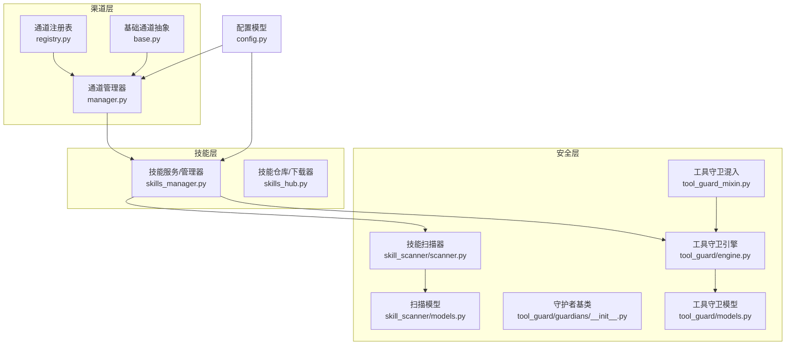
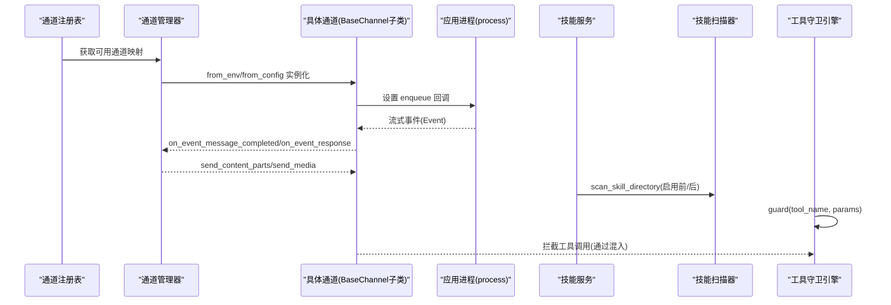
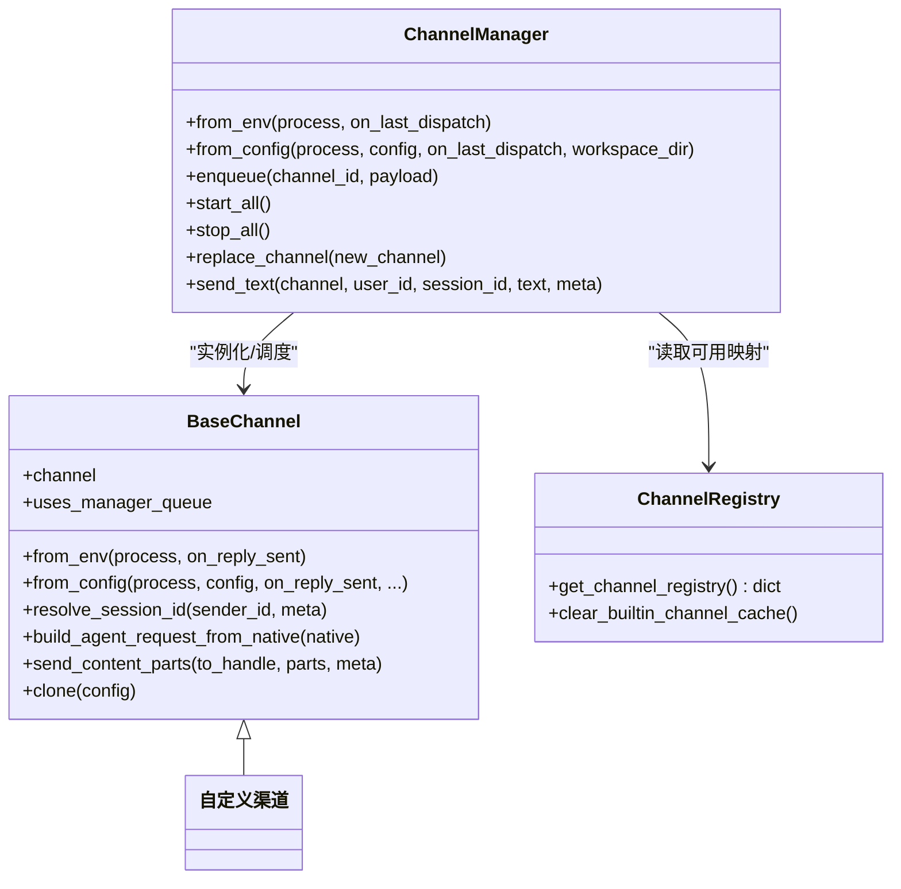
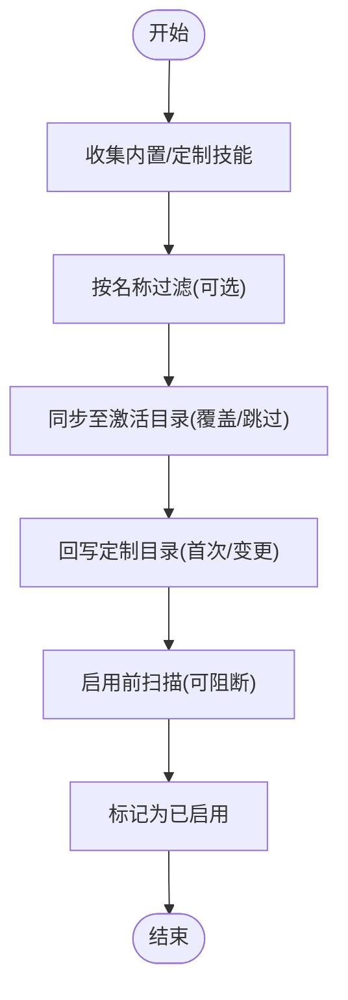
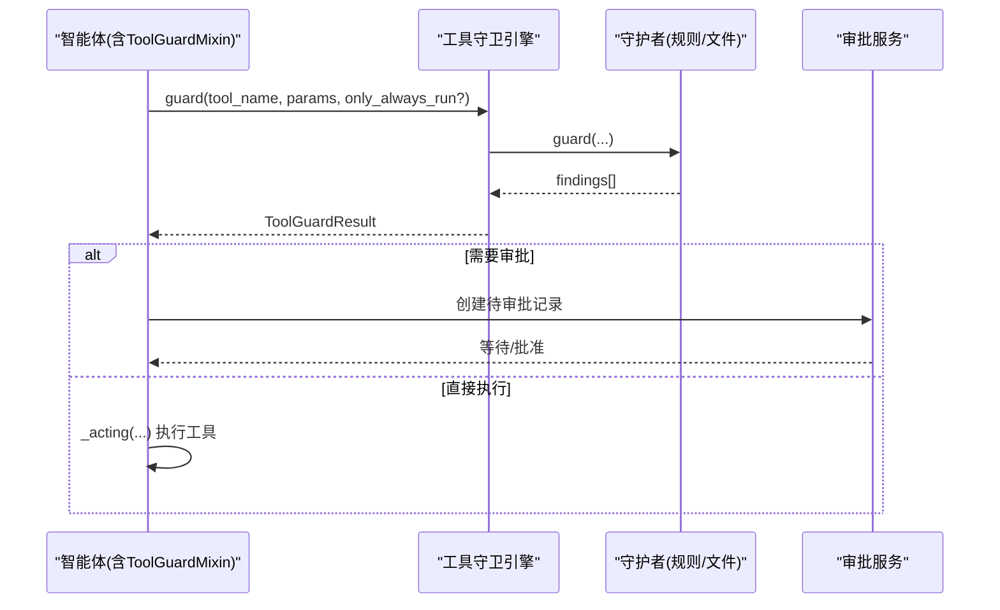
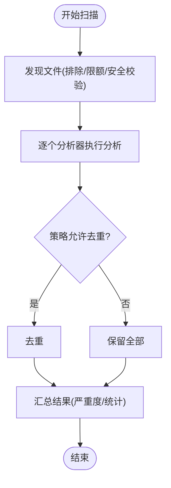
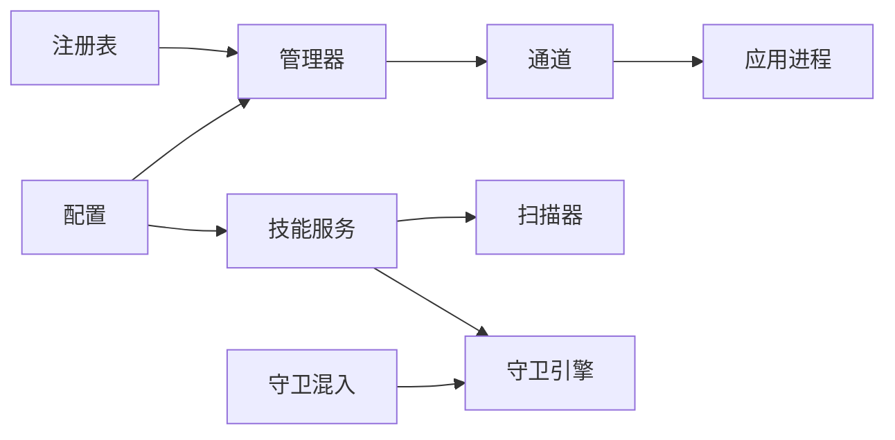

# 扩展性设计

<cite>
**本文引用的文件**
- [src/copaw/app/channels/registry.py](file://src/copaw/app/channels/registry.py)
- [src/copaw/app/channels/base.py](file://src/copaw/app/channels/base.py)
- [src/copaw/app/channels/manager.py](file://src/copaw/app/channels/manager.py)
- [src/copaw/agents/skills_manager.py](file://src/copaw/agents/skills_manager.py)
- [src/copaw/agents/skills_hub.py](file://src/copaw/agents/skills_hub.py)
- [src/copaw/agents/tool_guard_mixin.py](file://src/copaw/agents/tool_guard_mixin.py)
- [src/copaw/security/tool_guard/engine.py](file://src/copaw/security/tool_guard/engine.py)
- [src/copaw/security/tool_guard/guardians/__init__.py](file://src/copaw/security/tool_guard/guardians/__init__.py)
- [src/copaw/security/tool_guard/models.py](file://src/copaw/security/tool_guard/models.py)
- [src/copaw/security/skill_scanner/scanner.py](file://src/copaw/security/skill_scanner/scanner.py)
- [src/copaw/security/skill_scanner/models.py](file://src/copaw/security/skill_scanner/models.py)
- [src/copaw/config/config.py](file://src/copaw/config/config.py)
</cite>

## 目录
1. [引言](#引言)
2. [项目结构](#项目结构)
3. [核心组件](#核心组件)
4. [架构总览](#架构总览)
5. [详细组件分析](#详细组件分析)
6. [依赖分析](#依赖分析)
7. [性能考虑](#性能考虑)
8. [故障排查指南](#故障排查指南)
9. [结论](#结论)
10. [附录](#附录)

## 引言
本文件系统化阐述 CoPaw 的扩展性设计，围绕四大扩展域展开：插件化技能系统、渠道适配器、工具守卫与安全策略、以及工具守卫的扩展机制。重点包括：
- 插件化架构的设计理念、接口抽象与扩展点设计
- 技能系统的动态加载、版本管理与安全扫描
- 渠道适配器的扩展模式、新平台接入流程与适配器开发规范
- 工具守卫的扩展机制、自定义规则开发与安全策略配置
- 扩展点的注册机制、依赖注入与生命周期管理
- 向后兼容性保证、版本升级策略与废弃功能处理
- 运行时扩展能力与热插拔机制

## 项目结构
CoPaw 将扩展性以“模块化 + 接口抽象 + 配置驱动”的方式组织：
- 渠道层：统一的 BaseChannel 抽象 + 注册表 + 管理器，支持内置与自定义渠道的动态发现与替换
- 技能层：技能目录结构标准化、工作区同步、安全扫描与版本语义化
- 安全层：技能扫描器与工具守卫引擎，均采用可插拔分析器/守护者模式
- 配置层：集中式配置模型，支持通道与安全策略的声明式启用与参数注入

图示来源
- [src/copaw/app/channels/registry.py:133-138](file://src/copaw/app/channels/registry.py#L133-L138)
- [src/copaw/app/channels/base.py:69-125](file://src/copaw/app/channels/base.py#L69-L125)
- [src/copaw/app/channels/manager.py:114-262](file://src/copaw/app/channels/manager.py#L114-L262)
- [src/copaw/agents/skills_manager.py:654-725](file://src/copaw/agents/skills_manager.py#L654-L725)
- [src/copaw/agents/skills_hub.py:131-165](file://src/copaw/agents/skills_hub.py#L131-L165)
- [src/copaw/security/skill_scanner/scanner.py:76-147](file://src/copaw/security/skill_scanner/scanner.py#L76-L147)
- [src/copaw/security/skill_scanner/models.py:16-54](file://src/copaw/security/skill_scanner/models.py#L16-L54)
- [src/copaw/security/tool_guard/engine.py:53-130](file://src/copaw/security/tool_guard/engine.py#L53-L130)
- [src/copaw/security/tool_guard/guardians/__init__.py:17-61](file://src/copaw/security/tool_guard/guardians/__init__.py#L17-L61)
- [src/copaw/security/tool_guard/models.py:25-53](file://src/copaw/security/tool_guard/models.py#L25-L53)
- [src/copaw/agents/tool_guard_mixin.py:45-70](file://src/copaw/agents/tool_guard_mixin.py#L45-L70)
- [src/copaw/config/config.py:31-200](file://src/copaw/config/config.py#L31-L200)

章节来源
- [src/copaw/app/channels/registry.py:19-138](file://src/copaw/app/channels/registry.py#L19-L138)
- [src/copaw/app/channels/base.py:69-125](file://src/copaw/app/channels/base.py#L69-L125)
- [src/copaw/app/channels/manager.py:114-262](file://src/copaw/app/channels/manager.py#L114-L262)
- [src/copaw/agents/skills_manager.py:654-725](file://src/copaw/agents/skills_manager.py#L654-L725)
- [src/copaw/agents/skills_hub.py:131-165](file://src/copaw/agents/skills_hub.py#L131-L165)
- [src/copaw/security/skill_scanner/scanner.py:76-147](file://src/copaw/security/skill_scanner/scanner.py#L76-L147)
- [src/copaw/security/tool_guard/engine.py:53-130](file://src/copaw/security/tool_guard/engine.py#L53-L130)
- [src/copaw/agents/tool_guard_mixin.py:45-70](file://src/copaw/agents/tool_guard_mixin.py#L45-L70)
- [src/copaw/config/config.py:31-200](file://src/copaw/config/config.py#L31-L200)

## 核心组件
- 通道注册表与管理器：通过注册表发现内置与自定义渠道，管理器负责实例化、队列与并发消费、生命周期替换与事件派发
- 基础通道抽象：统一请求/响应转换、内容渲染、去抖合并、会话键解析、错误处理回调等
- 技能服务：工作区内内置/定制/激活技能的目录结构与同步策略；启用/禁用/删除/导入；安全扫描集成
- 技能仓库：Hub 访问、版本解析、下载与解包、取消检查、重试与退避
- 工具守卫引擎：多守护者聚合、按工具白/黑名单与范围控制、预批准与审批流、结果聚合与日志
- 工具守卫混入：在智能体生命周期中拦截敏感工具调用，实现阻断、预批准与重放
- 技能扫描器：多分析器聚合、文件发现与过滤、策略驱动的分类与限额、结果聚合
- 配置模型：通道配置、安全策略、环境变量优先级与默认值

章节来源
- [src/copaw/app/channels/registry.py:133-138](file://src/copaw/app/channels/registry.py#L133-L138)
- [src/copaw/app/channels/base.py:317-402](file://src/copaw/app/channels/base.py#L317-L402)
- [src/copaw/app/channels/manager.py:114-262](file://src/copaw/app/channels/manager.py#L114-L262)
- [src/copaw/agents/skills_manager.py:654-725](file://src/copaw/agents/skills_manager.py#L654-L725)
- [src/copaw/agents/skills_hub.py:226-335](file://src/copaw/agents/skills_hub.py#L226-L335)
- [src/copaw/security/tool_guard/engine.py:53-130](file://src/copaw/security/tool_guard/engine.py#L53-L130)
- [src/copaw/agents/tool_guard_mixin.py:251-382](file://src/copaw/agents/tool_guard_mixin.py#L251-L382)
- [src/copaw/security/skill_scanner/scanner.py:76-147](file://src/copaw/security/skill_scanner/scanner.py#L76-L147)
- [src/copaw/config/config.py:31-200](file://src/copaw/config/config.py#L31-L200)

## 架构总览
下图展示扩展性关键路径：通道从注册表加载，管理器统一调度；技能与安全分别通过服务与引擎对接；配置驱动启用与参数注入。

图示来源
- [src/copaw/app/channels/registry.py:133-138](file://src/copaw/app/channels/registry.py#L133-L138)
- [src/copaw/app/channels/manager.py:135-262](file://src/copaw/app/channels/manager.py#L135-L262)
- [src/copaw/app/channels/base.py:541-647](file://src/copaw/app/channels/base.py#L541-L647)
- [src/copaw/agents/skills_manager.py:935-958](file://src/copaw/agents/skills_manager.py#L935-L958)
- [src/copaw/security/skill_scanner/scanner.py:148-242](file://src/copaw/security/skill_scanner/scanner.py#L148-L242)
- [src/copaw/security/tool_guard/engine.py:169-226](file://src/copaw/security/tool_guard/engine.py#L169-L226)

## 详细组件分析

### 渠道适配器扩展机制
- 设计理念
  - 统一抽象：所有渠道继承 BaseChannel，遵循固定协议（请求/响应、内容类型、会话键、渲染风格）
  - 动态发现：注册表内置清单 + 工作目录自定义渠道自动发现
  - 生命周期：管理器负责队列、消费者线程、并发与替换
- 扩展点
  - 注册表：内置渠道清单、必载项、缓存、自定义渠道扫描
  - 管理器：从配置/环境创建通道、批量合并、去抖、并发消费者、热替换
  - 基类：请求构建、内容渲染、错误回调、发送钩子
- 开发规范
  - 必须实现 from_env/from_config；可覆盖渲染样式、会话键、去抖策略
  - 使用 set_enqueue 注入队列回调，确保与管理器协作
  - 注意权限与速率限制，必要时实现刷新令牌/Webhook
- 新平台接入流程
  - 在注册表中登记渠道标识与类名映射
  - 实现 from_env/from_config，读取配置与环境变量
  - 在工作目录创建自定义渠道模块，导出子类并满足 channel 属性
  - 在配置中启用该渠道并填写参数
  - 启动后由管理器自动拉起并进入消费循环

图示来源
- [src/copaw/app/channels/base.py:69-125](file://src/copaw/app/channels/base.py#L69-L125)
- [src/copaw/app/channels/manager.py:114-262](file://src/copaw/app/channels/manager.py#L114-L262)
- [src/copaw/app/channels/registry.py:133-138](file://src/copaw/app/channels/registry.py#L133-L138)

章节来源
- [src/copaw/app/channels/registry.py:19-138](file://src/copaw/app/channels/registry.py#L19-L138)
- [src/copaw/app/channels/base.py:317-402](file://src/copaw/app/channels/base.py#L317-L402)
- [src/copaw/app/channels/manager.py:114-262](file://src/copaw/app/channels/manager.py#L114-L262)

### 技能系统扩展机制
- 设计理念
  - 目录结构标准化：每个技能含 SKILL.md 与可选 references/scripts 子树
  - 工作区三态：内置/定制/激活，定制覆盖内置，激活用于运行时
  - 安全前置：启用前/后扫描，失败可阻断
- 动态加载与版本管理
  - 同步策略：定制覆盖内置；激活目录仅保留启用项
  - 版本语义：内置技能元数据含版本号，激活目录与内置版本比较决定回滚/升级
  - 导入与回写：支持 ZIP 导入、根文件与子树创建、扫描后回写定制目录
- Hub 扩展
  - 支持多 Hub 协议与鉴权头；可配置超时/重试/退避；支持取消检查
  - 下载后解包、校验大小与路径、提取 references/scripts 并落盘

图示来源
- [src/copaw/agents/skills_manager.py:210-287](file://src/copaw/agents/skills_manager.py#L210-L287)
- [src/copaw/agents/skills_manager.py:290-368](file://src/copaw/agents/skills_manager.py#L290-L368)
- [src/copaw/agents/skills_manager.py:935-958](file://src/copaw/agents/skills_manager.py#L935-L958)

章节来源
- [src/copaw/agents/skills_manager.py:654-725](file://src/copaw/agents/skills_manager.py#L654-L725)
- [src/copaw/agents/skills_manager.py:856-872](file://src/copaw/agents/skills_manager.py#L856-L872)
- [src/copaw/agents/skills_manager.py:1027-1113](file://src/copaw/agents/skills_manager.py#L1027-L1113)
- [src/copaw/agents/skills_hub.py:226-335](file://src/copaw/agents/skills_hub.py#L226-L335)

### 工具守卫扩展机制
- 设计理念
  - 可插拔守护者：统一 BaseToolGuardian 接口，支持规则/文件路径/LLM 等多种引擎
  - 分层拦截：混入在智能体 _acting/_reasoning 中拦截敏感工具调用
  - 策略驱动：受配置控制启用/范围/拒绝集合，支持预批准与审批队列
- 扩展点
  - 守护者注册：引擎构造时注入或运行时注册
  - 范围与拒绝：从配置解析受保护工具集与直接拒绝工具集
  - 结果聚合：记录使用过的守护者、失败项、严重度与统计
- 自定义规则开发
  - 实现 BaseToolGuardian 子类，提供 guard(tool_name, params) 返回 GuardFinding 列表
  - 通过引擎 register_guardian 注册，或在配置中启用
- 安全策略配置
  - 环境变量优先于配置文件；支持全局开关、工具范围、拒绝名单
  - 混入在拦截后生成审批记录，支持清理被阻断消息与重放队列

图示来源
- [src/copaw/agents/tool_guard_mixin.py:251-382](file://src/copaw/agents/tool_guard_mixin.py#L251-L382)
- [src/copaw/security/tool_guard/engine.py:169-226](file://src/copaw/security/tool_guard/engine.py#L169-L226)
- [src/copaw/security/tool_guard/guardians/__init__.py:17-61](file://src/copaw/security/tool_guard/guardians/__init__.py#L17-L61)
- [src/copaw/security/tool_guard/models.py:60-96](file://src/copaw/security/tool_guard/models.py#L60-L96)

章节来源
- [src/copaw/agents/tool_guard_mixin.py:45-70](file://src/copaw/agents/tool_guard_mixin.py#L45-L70)
- [src/copaw/security/tool_guard/engine.py:53-130](file://src/copaw/security/tool_guard/engine.py#L53-L130)
- [src/copaw/security/tool_guard/models.py:25-53](file://src/copaw/security/tool_guard/models.py#L25-L53)

### 技能扫描器扩展机制
- 设计理念
  - 多分析器聚合：默认模式分析器，可扩展 LLM/语义分析器
  - 策略驱动：基于 YAML 策略的文件分类、限额、去重
  - 安全边界：路径遍历防护、符号链接跳过、大小与数量限制
- 扩展点
  - 分析器注册：运行时注册自定义分析器
  - 策略定制：通过 ScanPolicy.yaml 控制分类、限额与去重
- 典型场景
  - 启用技能前扫描阻断高危技能
  - 定期扫描定制技能变更

图示来源
- [src/copaw/security/skill_scanner/scanner.py:148-242](file://src/copaw/security/skill_scanner/scanner.py#L148-L242)
- [src/copaw/security/skill_scanner/models.py:168-234](file://src/copaw/security/skill_scanner/models.py#L168-L234)

章节来源
- [src/copaw/security/skill_scanner/scanner.py:76-147](file://src/copaw/security/skill_scanner/scanner.py#L76-L147)
- [src/copaw/security/skill_scanner/models.py:16-54](file://src/copaw/security/skill_scanner/models.py#L16-L54)

## 依赖分析
- 低耦合高内聚
  - 渠道层：注册表与管理器解耦，通道仅关注消费协议
  - 技能层：服务与扫描器/引擎解耦，扫描作为前置/后置步骤
  - 安全层：扫描器与守卫引擎独立，各自面向不同对象（文件 vs 工具参数）
- 关键依赖链
  - 渠道：注册表 → 管理器 → 通道 → 应用进程
  - 技能：服务 → 扫描器/引擎 → 配置
  - 工具守卫：混入 → 引擎 → 审批服务
- 循环依赖
  - 未见循环依赖；各模块通过接口与工厂方法解耦

图示来源
- [src/copaw/app/channels/registry.py:133-138](file://src/copaw/app/channels/registry.py#L133-L138)
- [src/copaw/app/channels/manager.py:114-262](file://src/copaw/app/channels/manager.py#L114-L262)
- [src/copaw/agents/skills_manager.py:935-958](file://src/copaw/agents/skills_manager.py#L935-L958)
- [src/copaw/security/tool_guard/engine.py:53-130](file://src/copaw/security/tool_guard/engine.py#L53-L130)
- [src/copaw/agents/tool_guard_mixin.py:57-70](file://src/copaw/agents/tool_guard_mixin.py#L57-L70)
- [src/copaw/config/config.py:31-200](file://src/copaw/config/config.py#L31-L200)

章节来源
- [src/copaw/app/channels/registry.py:19-138](file://src/copaw/app/channels/registry.py#L19-L138)
- [src/copaw/app/channels/manager.py:114-262](file://src/copaw/app/channels/manager.py#L114-L262)
- [src/copaw/agents/skills_manager.py:935-958](file://src/copaw/agents/skills_manager.py#L935-L958)
- [src/copaw/security/tool_guard/engine.py:53-130](file://src/copaw/security/tool_guard/engine.py#L53-L130)
- [src/copaw/agents/tool_guard_mixin.py:57-70](file://src/copaw/agents/tool_guard_mixin.py#L57-L70)
- [src/copaw/config/config.py:31-200](file://src/copaw/config/config.py#L31-L200)

## 性能考虑
- 渠道层
  - 去抖与合并：对无文本内容进行缓冲合并，减少重复发送
  - 并发消费者：每通道多消费者并按会话键串行处理，避免乱序与重复
  - 队列容量与线程安全：管理器在事件循环中安全入队
- 技能层
  - 同步策略：定制覆盖内置，避免重复复制；仅在变更时回写
  - ZIP 解包：限制解压上限与路径合法性，防止过大/恶意路径
- 安全层
  - 扫描限额：文件数与单文件大小限制，避免内存压力
  - 守卫引擎：按需执行守护者，支持只运行 always_run 的守护者以降低开销

## 故障排查指南
- 渠道相关
  - 渠道初始化失败：检查配置键是否存在、from_config 参数签名匹配
  - 消费异常：查看 on_event_message_completed/on_event_response 错误提取逻辑
  - 热替换失败：确认新通道 start 成功后再替换旧通道
- 技能相关
  - 启用失败：检查扫描器返回的严重度与错误信息，必要时回滚到内置版本
  - 导入失败：检查 ZIP 是否有效、是否包含 SKILL.md、是否越界路径
- 安全相关
  - 守卫引擎关闭：检查 COPAW_TOOL_GUARD_ENABLED 环境变量与配置
  - 审批堆积：检查审批服务队列状态与会话键一致性

章节来源
- [src/copaw/app/channels/manager.py:158-262](file://src/copaw/app/channels/manager.py#L158-L262)
- [src/copaw/app/channels/base.py:584-604](file://src/copaw/app/channels/base.py#L584-L604)
- [src/copaw/agents/skills_manager.py:935-958](file://src/copaw/agents/skills_manager.py#L935-L958)
- [src/copaw/agents/skills_manager.py:1027-1113](file://src/copaw/agents/skills_manager.py#L1027-L1113)
- [src/copaw/security/tool_guard/engine.py:35-51](file://src/copaw/security/tool_guard/engine.py#L35-L51)

## 结论
CoPaw 的扩展性设计以“接口抽象 + 配置驱动 + 可插拔分析器/守护者”为核心，实现了：
- 渠道的即插即用与热替换
- 技能的动态启用/禁用与版本演进
- 安全扫描与工具守卫的策略化与可扩展
- 明确的生命周期与依赖注入路径，便于维护与演进

## 附录
- 向后兼容性
  - 内置技能版本字段用于升级判断；定制覆盖内置，避免破坏性变更
  - 渠道注册表支持必载项与降级日志，保障启动稳定性
- 版本升级策略
  - 激活目录与内置版本比较，支持回滚/升级
  - Hub 下载支持版本提示与多源识别
- 废弃功能处理
  - 通过配置开关与环境变量优先级控制，逐步迁移
- 热插拔与运行时扩展
  - 管理器支持 replace_channel；引擎支持运行时注册守护者；服务支持 ZIP 导入与扫描