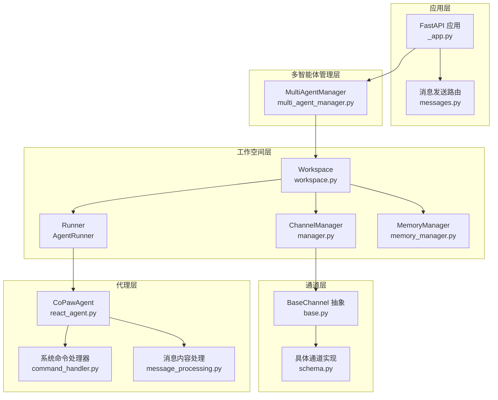
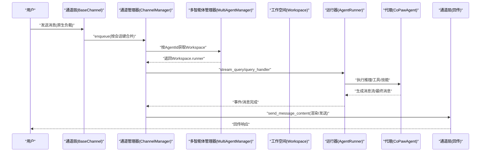
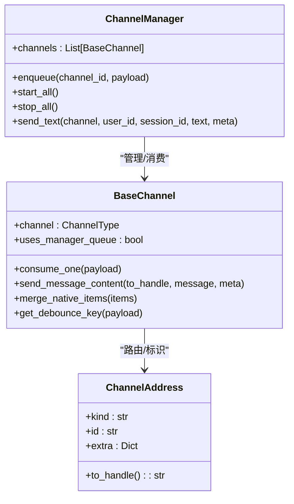
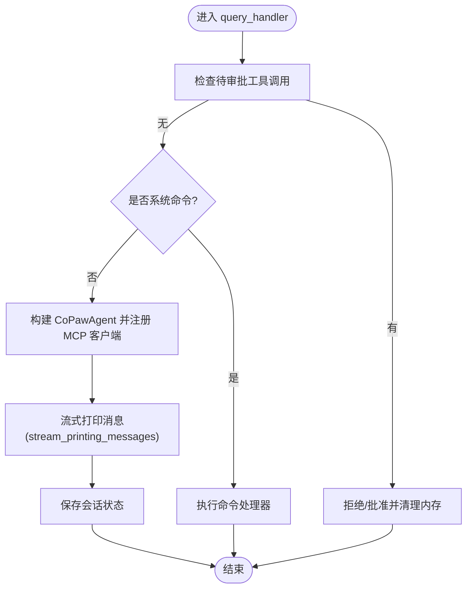
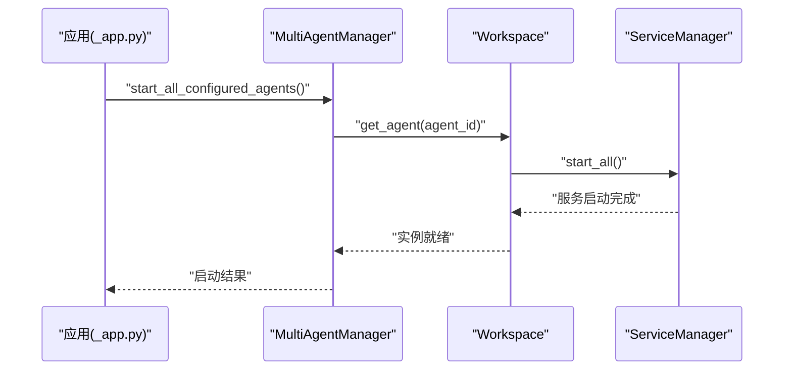
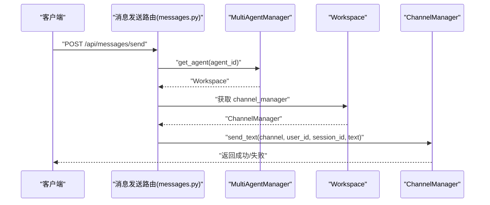
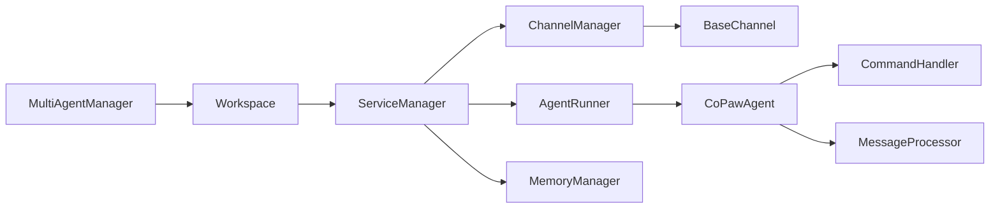

# 数据流设计

<cite>
**本文引用的文件**
- [应用入口与生命周期管理 _app.py](file://src/copaw/app/_app.py)
- [消息发送接口 messages.py](file://src/copaw/app/routers/messages.py)
- [通道基类与消费模型 base.py](file://src/copaw/app/channels/base.py)
- [通道管理器 ChannelManager](file://src/copaw/app/channels/manager.py)
- [工作空间 Workspace](file://src/copaw/app/workspace/workspace.py)
- [多智能体管理器 MultiAgentManager](file://src/copaw/app/multi_agent_manager.py)
- [运行器 AgentRunner](file://src/copaw/app/runner/runner.py)
- [系统命令处理器 command_handler.py](file://src/copaw/agents/command_handler.py)
- [消息内容处理 message_processing.py](file://src/copaw/agents/utils/message_processing.py)
- [通道类型与路由 schema.py](file://src/copaw/app/channels/schema.py)
- [CoPawAgent 主代理](file://src/copaw/agents/react_agent.py)
- [内存管理 MemoryManager](file://src/copaw/agents/memory/memory_manager.py)
</cite>

## 目录
1. [引言](#引言)
2. [项目结构](#项目结构)
3. [核心组件](#核心组件)
4. [架构总览](#架构总览)
5. [详细组件分析](#详细组件分析)
6. [依赖关系分析](#依赖关系分析)
7. [性能考量](#性能考量)
8. [故障排查指南](#故障排查指南)
9. [结论](#结论)
10. [附录](#附录)

## 引言
本技术文档围绕 CoPaw 的数据流设计，系统阐述从用户输入到响应输出的完整生命周期：消息如何在通道层被接收与解析、如何进入运行器进行推理与工具调用、如何通过通道层回传给用户；同时覆盖消息在各组件之间的流转路径、转换规则、缓存与去重策略、异步消息处理与事件驱动架构、消息序列化与传输协议、数据验证与过滤、以及一致性、并发与事务处理等主题。

## 项目结构
CoPaw 采用“多智能体 + 多通道”的架构，核心由以下层次构成：
- 应用层：FastAPI 应用与中间件、路由注册、静态资源与前端集成
- 工作空间层：每个 Agent 对应一个 Workspace，内含 Runner、ChannelManager、MemoryManager、CronManager 等服务
- 多智能体管理层：按需加载与热重载，支持零停机切换
- 通道层：统一抽象 BaseChannel 及其具体实现，负责消息收发与会话合并
- 运行器层：AgentRunner 负责请求处理、命令拦截、工具守卫与会话状态管理
- 代理层：CoPawAgent 集成 ReAct 推理、工具集、技能与内存钩子

图表来源
- [_app.py:149-241](file://src/copaw/app/_app.py#L149-L241)
- [messages.py:16-34](file://src/copaw/app/routers/messages.py#L16-L34)
- [workspace.py:134-277](file://src/copaw/app/workspace/workspace.py#L134-L277)
- [multi_agent_manager.py:34-82](file://src/copaw/app/multi_agent_manager.py#L34-L82)
- [manager.py:114-155](file://src/copaw/app/channels/manager.py#L114-L155)
- [base.py:69-125](file://src/copaw/app/channels/base.py#L69-L125)
- [schema.py:12-48](file://src/copaw/app/channels/schema.py#L12-L48)
- [runner.py:61-94](file://src/copaw/app/runner/runner.py#L61-L94)
- [react_agent.py:67-170](file://src/copaw/agents/react_agent.py#L67-L170)
- [command_handler.py:59-93](file://src/copaw/agents/command_handler.py#L59-L93)
- [message_processing.py:25-74](file://src/copaw/agents/utils/message_processing.py#L25-L74)

章节来源
- [_app.py:149-241](file://src/copaw/app/_app.py#L149-L241)
- [messages.py:16-34](file://src/copaw/app/routers/messages.py#L16-L34)
- [workspace.py:134-277](file://src/copaw/app/workspace/workspace.py#L134-L277)
- [multi_agent_manager.py:34-82](file://src/copaw/app/multi_agent_manager.py#L34-L82)
- [manager.py:114-155](file://src/copaw/app/channels/manager.py#L114-L155)
- [base.py:69-125](file://src/copaw/app/channels/base.py#L69-L125)
- [schema.py:12-48](file://src/copaw/app/channels/schema.py#L12-L48)
- [runner.py:61-94](file://src/copaw/app/runner/runner.py#L61-L94)
- [react_agent.py:67-170](file://src/copaw/agents/react_agent.py#L67-L170)
- [command_handler.py:59-93](file://src/copaw/agents/command_handler.py#L59-L93)
- [message_processing.py:25-74](file://src/copaw/agents/utils/message_processing.py#L25-L74)

## 核心组件
- 应用与中间件：CORS、鉴权、代理上下文、静态资源与前端路由回退
- 多智能体管理器：延迟加载、零停机热重载、并发启动
- 工作空间：统一服务编排（Runner、ChannelManager、MemoryManager、CronManager）
- 通道管理器：队列化、同会话合并、时间去抖、并发消费者
- 通道基类：统一消息构建、渲染、发送与错误处理
- 运行器：请求处理、命令拦截、工具守卫、会话状态持久化
- 代理：ReAct 推理、工具与技能、媒体块过滤、系统命令处理
- 内存管理：压缩与摘要、向量/全文检索、嵌入配置

章节来源
- [_app.py:243-344](file://src/copaw/app/_app.py#L243-L344)
- [multi_agent_manager.py:17-82](file://src/copaw/app/multi_agent_manager.py#L17-L82)
- [workspace.py:134-277](file://src/copaw/app/workspace/workspace.py#L134-L277)
- [manager.py:114-155](file://src/copaw/app/channels/manager.py#L114-L155)
- [base.py:69-125](file://src/copaw/app/channels/base.py#L69-L125)
- [runner.py:61-94](file://src/copaw/app/runner/runner.py#L61-L94)
- [react_agent.py:67-170](file://src/copaw/agents/react_agent.py#L67-L170)
- [memory_manager.py:47-140](file://src/copaw/agents/memory/memory_manager.py#L47-L140)

## 架构总览
CoPaw 的数据流以“请求-处理-回传”为主线，贯穿以下关键路径：
- 用户输入：通过通道层接收（如钉钉、飞书、Discord、MQTT、语音等），统一转换为 AgentRequest
- 请求路由：根据 X-Agent-Id 或上下文选择目标 Workspace，再由 Runner 执行
- 消息处理：代理执行推理、工具调用、技能扩展，必要时触发系统命令或内存压缩
- 响应回传：通道层将 AgentResponse 渲染为多段内容（文本/图片/音频/文件/拒绝），按渠道特性发送
- 会话与状态：运行器负责会话状态加载/保存，确保一致性与可恢复性

图表来源
- [base.py:443-583](file://src/copaw/app/channels/base.py#L443-L583)
- [manager.py:322-364](file://src/copaw/app/channels/manager.py#L322-L364)
- [multi_agent_manager.py:34-82](file://src/copaw/app/multi_agent_manager.py#L34-L82)
- [workspace.py:134-277](file://src/copaw/app/workspace/workspace.py#L134-L277)
- [runner.py:188-399](file://src/copaw/app/runner/runner.py#L188-L399)
- [react_agent.py:586-639](file://src/copaw/agents/react_agent.py#L586-L639)

## 详细组件分析

### 组件A：通道层与消息编解码
- 统一抽象 BaseChannel：定义消息构建、渲染、发送、错误处理与时间去抖
- 通道管理器 ChannelManager：为每个通道创建队列与消费者，按会话键合并批量消息，支持时间去抖与并发处理
- 通道类型与路由：使用 ChannelAddress 统一路由标识，内置多种通道类型
- 发送接口：提供主动发送文本消息的能力，基于 Workspace 的 ChannelManager 实现

图表来源
- [base.py:69-125](file://src/copaw/app/channels/base.py#L69-L125)
- [manager.py:114-155](file://src/copaw/app/channels/manager.py#L114-L155)
- [schema.py:12-48](file://src/copaw/app/channels/schema.py#L12-L48)

章节来源
- [base.py:443-583](file://src/copaw/app/channels/base.py#L443-L583)
- [manager.py:322-364](file://src/copaw/app/channels/manager.py#L322-L364)
- [schema.py:12-48](file://src/copaw/app/channels/schema.py#L12-L48)

### 组件B：运行器与代理执行
- AgentRunner：解析待审批工具调用、识别系统命令、构建代理上下文、加载/保存会话状态、流式输出消息
- CoPawAgent：ReAct 推理、工具与技能注册、媒体块过滤、系统命令处理、内存钩子
- 系统命令处理器：支持 /compact、/new、/clear、/history、/await_summary、/message、/dump_history、/load_history 等
- 消息内容处理：文件/媒体块下载、本地化、转写/格式转换、通知插入

图表来源
- [runner.py:188-399](file://src/copaw/app/runner/runner.py#L188-L399)
- [react_agent.py:67-170](file://src/copaw/agents/react_agent.py#L67-L170)
- [command_handler.py:59-93](file://src/copaw/agents/command_handler.py#L59-L93)
- [message_processing.py:374-417](file://src/copaw/agents/utils/message_processing.py#L374-L417)

章节来源
- [runner.py:188-399](file://src/copaw/app/runner/runner.py#L188-L399)
- [react_agent.py:67-170](file://src/copaw/agents/react_agent.py#L67-L170)
- [command_handler.py:59-93](file://src/copaw/agents/command_handler.py#L59-L93)
- [message_processing.py:374-417](file://src/copaw/agents/utils/message_processing.py#L374-L417)

### 组件C：多智能体与工作空间
- MultiAgentManager：延迟加载、并发启动、零停机热重载、后台清理任务
- Workspace：声明式服务注册与启动顺序、可复用组件（内存/聊天）热重载、任务追踪

图表来源
- [_app.py:184-209](file://src/copaw/app/_app.py#L184-L209)
- [multi_agent_manager.py:399-445](file://src/copaw/app/multi_agent_manager.py#L399-L445)
- [workspace.py:311-357](file://src/copaw/app/workspace/workspace.py#L311-L357)

章节来源
- [_app.py:184-209](file://src/copaw/app/_app.py#L184-L209)
- [multi_agent_manager.py:399-445](file://src/copaw/app/multi_agent_manager.py#L399-L445)
- [workspace.py:311-357](file://src/copaw/app/workspace/workspace.py#L311-L357)

### 组件D：消息发送接口与主动推送
- 主动发送：通过 /api/messages/send 将文本消息推送到指定通道、用户与会话
- 通道管理器：将 (user_id, session_id) 解析为通道目标句柄并发送纯文本内容

图表来源
- [messages.py:75-184](file://src/copaw/app/routers/messages.py#L75-L184)
- [manager.py:528-579](file://src/copaw/app/channels/manager.py#L528-L579)

章节来源
- [messages.py:75-184](file://src/copaw/app/routers/messages.py#L75-L184)
- [manager.py:528-579](file://src/copaw/app/channels/manager.py#L528-L579)

## 依赖关系分析
- 组件耦合
  - ChannelManager 依赖 BaseChannel 抽象，具体通道实现遵循统一协议
  - Workspace 通过 ServiceManager 组织 Runner、ChannelManager、MemoryManager 等服务
  - MultiAgentManager 仅暴露 get_agent/reload_agent 接口，内部通过 Workspace 生命周期管理
  - AgentRunner 依赖 CoPawAgent 与会话状态持久化
- 外部依赖
  - 通道实现依赖第三方平台 API（如钉钉、飞书、Discord、MQTT 等）
  - 内存管理依赖 reme（可选），向量化/全文检索能力受环境变量与配置影响
- 循环依赖
  - 通过服务注册与延迟初始化避免循环导入

图表来源
- [multi_agent_manager.py:34-82](file://src/copaw/app/multi_agent_manager.py#L34-L82)
- [workspace.py:134-277](file://src/copaw/app/workspace/workspace.py#L134-L277)
- [runner.py:61-94](file://src/copaw/app/runner/runner.py#L61-L94)
- [base.py:69-125](file://src/copaw/app/channels/base.py#L69-L125)
- [react_agent.py:67-170](file://src/copaw/agents/react_agent.py#L67-L170)
- [command_handler.py:59-93](file://src/copaw/agents/command_handler.py#L59-L93)
- [message_processing.py:25-74](file://src/copaw/agents/utils/message_processing.py#L25-L74)

章节来源
- [multi_agent_manager.py:34-82](file://src/copaw/app/multi_agent_manager.py#L34-L82)
- [workspace.py:134-277](file://src/copaw/app/workspace/workspace.py#L134-L277)
- [runner.py:61-94](file://src/copaw/app/runner/runner.py#L61-L94)
- [base.py:69-125](file://src/copaw/app/channels/base.py#L69-L125)
- [react_agent.py:67-170](file://src/copaw/agents/react_agent.py#L67-L170)
- [command_handler.py:59-93](file://src/copaw/agents/command_handler.py#L59-L93)
- [message_processing.py:25-74](file://src/copaw/agents/utils/message_processing.py#L25-L74)

## 性能考量
- 并发与去抖
  - ChannelManager 为每个通道维护固定数量的消费者，同会话键合并批量消息，减少重复处理
  - BaseChannel 支持时间去抖（debounce），将无文本内容的分片合并后再处理，降低空包开销
- 内存与压缩
  - MemoryManager 提供消息压缩与摘要生成，降低上下文长度，提升推理效率
- I/O 优化
  - 文件/媒体块下载后本地化存储，并在消息中替换为本地路径/URI，减少跨网络传输
- 会话状态
  - 会话状态按轮次保存，避免重复计算与长对话带来的重复加载

章节来源
- [manager.py:322-364](file://src/copaw/app/channels/manager.py#L322-L364)
- [base.py:453-479](file://src/copaw/app/channels/base.py#L453-L479)
- [memory_manager.py:202-274](file://src/copaw/agents/memory/memory_manager.py#L202-L274)
- [message_processing.py:374-417](file://src/copaw/agents/utils/message_processing.py#L374-L417)
- [runner.py:392-399](file://src/copaw/app/runner/runner.py#L392-L399)

## 故障排查指南
- 通道未找到/发送失败
  - 检查通道是否启用、配置是否正确、队列是否创建
  - 关注 ChannelManager 的 enqueue 与消费者日志
- 工具守卫拒绝
  - 查看审批服务状态与超时设置，确认会话上下文中是否携带批准信息
- 会话状态异常
  - 检查会话状态文件是否存在、格式是否匹配；必要时清理并重新生成
- 媒体块问题
  - 模型不支持多媒体时，代理会自动剥离媒体块并重试；若仍失败，检查能力标记与转写/转换链路

章节来源
- [manager.py:304-321](file://src/copaw/app/channels/manager.py#L304-L321)
- [runner.py:95-187](file://src/copaw/app/runner/runner.py#L95-L187)
- [react_agent.py:586-639](file://src/copaw/agents/react_agent.py#L586-L639)
- [message_processing.py:217-289](file://src/copaw/agents/utils/message_processing.py#L217-L289)

## 结论
CoPaw 的数据流设计以“通道抽象 + 多智能体 + 运行器 + 代理”为核心，通过队列化、去抖与合并、时间去抖、内存压缩与会话状态持久化等手段，实现了高并发、低延迟、可扩展的消息处理与回传。系统在保证一致性与可恢复性的前提下，提供了灵活的事件驱动与异步处理能力，满足多通道、多智能体场景下的复杂业务需求。

## 附录
- 数据序列化与传输
  - 通道层统一使用 agentscope Runtime 的 Message/Content 类型，避免中间包裹
  - 文本/图片/音频/视频/文件等多段内容通过渲染器转换为渠道可理解的负载
- 数据验证与过滤
  - 通道层对允许列表、群聊/私聊策略、提及要求进行校验
  - 代理层对多媒体能力进行主动/被动过滤，避免模型拒绝
- 缓存与一致性
  - 内嵌会话状态文件用于快速恢复；内存管理器的向量/全文检索依赖嵌入配置
- 并发控制与事务
  - 通道队列与会话键锁确保同会话串行处理，不同会话并行推进
  - 多智能体热重载采用“新实例先行、原子替换、后台清理”的零停机策略

章节来源
- [base.py:281-316](file://src/copaw/app/channels/base.py#L281-L316)
- [react_agent.py:586-639](file://src/copaw/agents/react_agent.py#L586-L639)
- [memory_manager.py:153-201](file://src/copaw/agents/memory/memory_manager.py#L153-L201)
- [manager.py:348-356](file://src/copaw/app/channels/manager.py#L348-L356)
- [multi_agent_manager.py:200-311](file://src/copaw/app/multi_agent_manager.py#L200-L311)