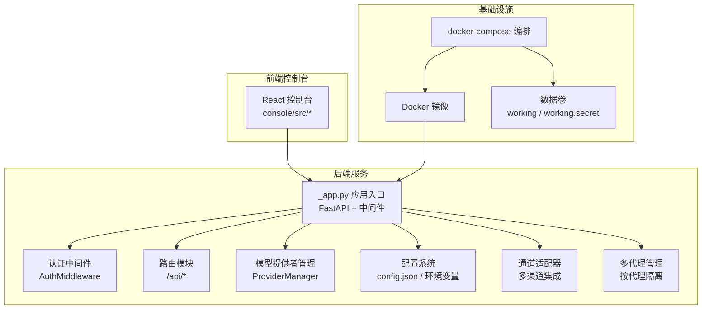
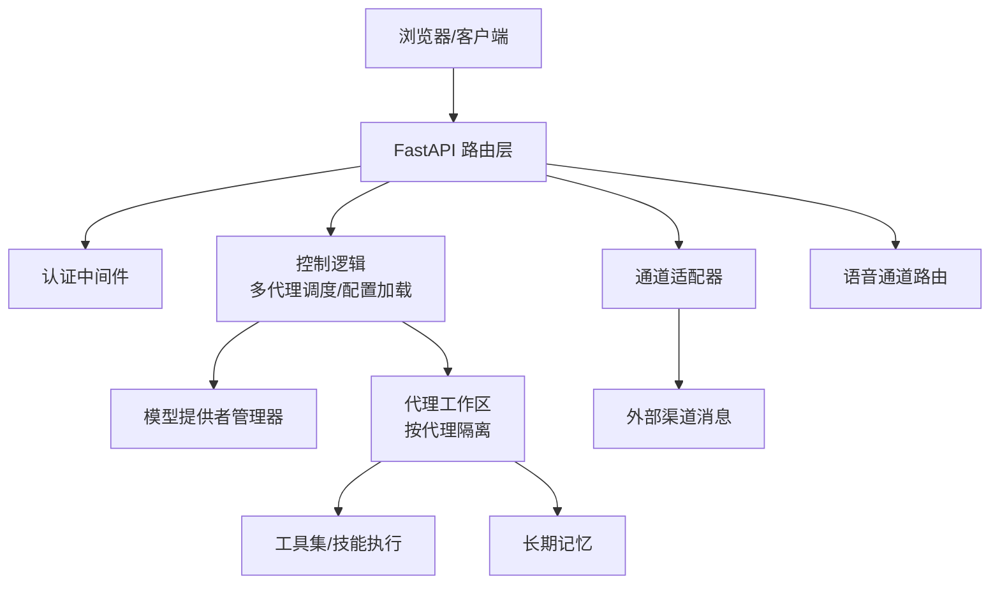
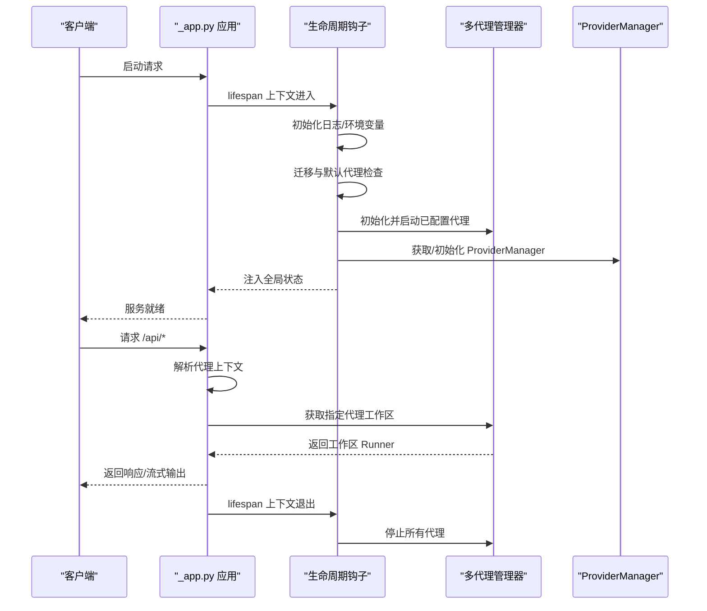
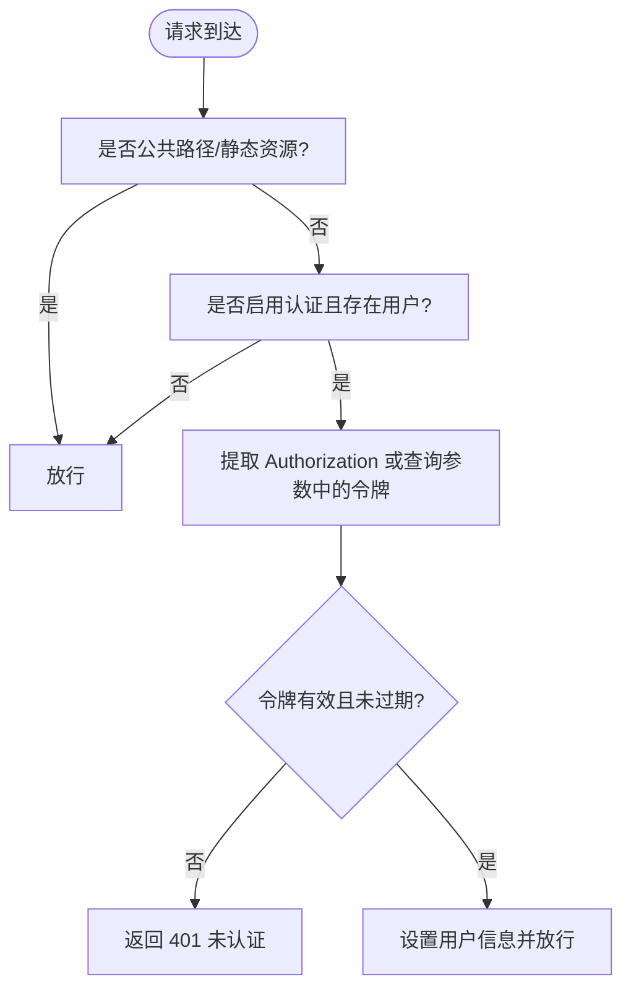
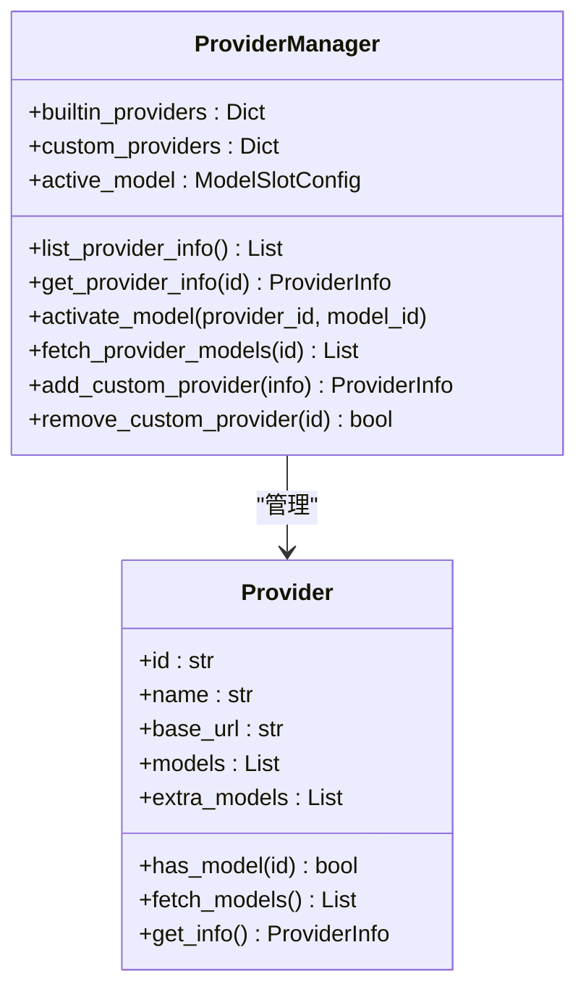
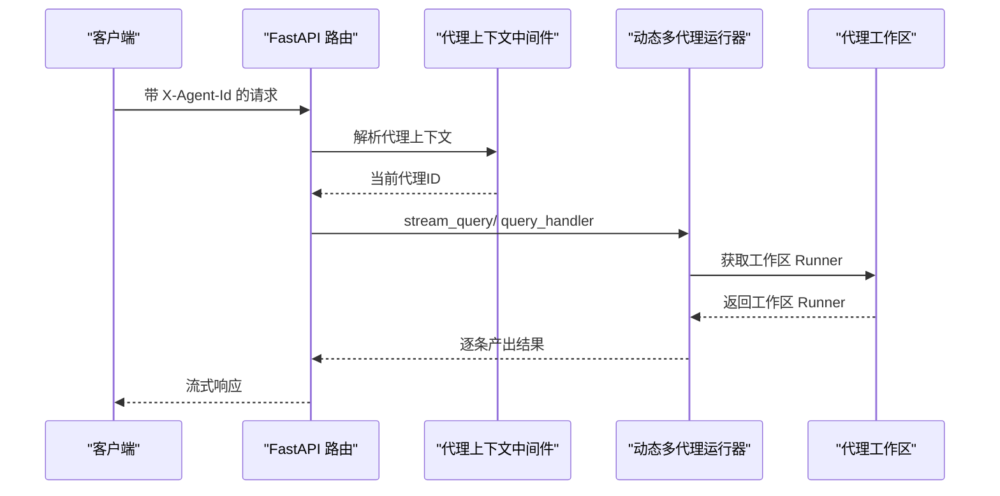
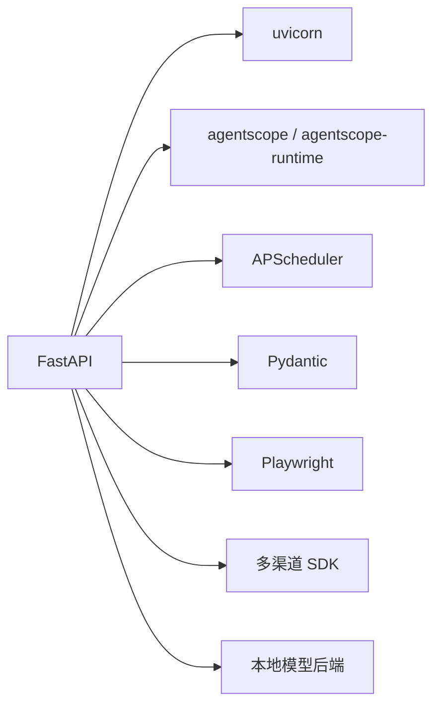

# 整体架构概览

<cite>
**本文档引用的文件**
- [README.md](file://README.md)
- [src/copaw/app/_app.py](file://src/copaw/app/_app.py)
- [src/copaw/cli/main.py](file://src/copaw/cli/main.py)
- [src/copaw/app/auth.py](file://src/copaw/app/auth.py)
- [src/copaw/constant.py](file://src/copaw/constant.py)
- [src/copaw/config/config.py](file://src/copaw/config/config.py)
- [src/copaw/providers/provider_manager.py](file://src/copaw/providers/provider_manager.py)
- [deploy/Dockerfile](file://deploy/Dockerfile)
- [docker-compose.yml](file://docker-compose.yml)
- [pyproject.toml](file://pyproject.toml)
- [console/src/main.tsx](file://console/src/main.tsx)
</cite>

## 目录
1. [引言](#引言)
2. [项目结构](#项目结构)
3. [核心组件](#核心组件)
4. [架构总览](#架构总览)
5. [详细组件分析](#详细组件分析)
6. [依赖关系分析](#依赖关系分析)
7. [性能考虑](#性能考虑)
8. [故障排查指南](#故障排查指南)
9. [结论](#结论)
10. [附录](#附录)

## 引言
CoPaw 是一个“个人智能助理”，支持多渠道接入（如钉钉、飞书、QQ、Discord、iMessage 等），具备计划任务与技能扩展能力，所有数据与任务在用户自有机房或本地运行，强调隐私与可控性。其整体架构采用前后端分离与微服务理念相结合的设计：后端以 FastAPI 提供统一 API 与控制面，前端通过 React 构建的 Console 提供可视化配置与聊天界面；同时通过多代理管理实现“按代理隔离”的工作区设计，并结合安全与工具守卫机制保障运行安全。

## 项目结构
从仓库结构可见，项目由以下主要部分组成：
- 后端核心（Python）：位于 src/copaw，包含应用入口、路由、认证、配置、模型提供者管理、通道适配器、多代理管理等模块。
- 前端控制台（React）：位于 console，构建产物注入到后端包中，作为静态资源提供。
- 部署与打包：deploy 目录包含 Dockerfile 与入口脚本；docker-compose 提供一键编排。
- 文档与网站：website 提供文档站点与发布资源。
- 测试与脚本：tests 与 scripts 提供测试与安装/构建脚本。

图表来源
- [src/copaw/app/_app.py:243-411](file://src/copaw/app/_app.py#L243-L411)
- [src/copaw/app/auth.py:339-405](file://src/copaw/app/auth.py#L339-L405)
- [src/copaw/providers/provider_manager.py:573-800](file://src/copaw/providers/provider_manager.py#L573-L800)
- [deploy/Dockerfile:1-103](file://deploy/Dockerfile#L1-L103)
- [docker-compose.yml:1-23](file://docker-compose.yml#L1-L23)

章节来源
- [README.md:99-180](file://README.md#L99-L180)
- [pyproject.toml:1-102](file://pyproject.toml#L1-L102)

## 核心组件
- 应用入口与生命周期管理：使用 FastAPI 生命周期钩子进行启动/停止流程管理，加载环境变量、迁移旧配置、初始化多代理管理器与模型提供者管理器，并注册静态资源与路由。
- 认证与授权：基于环境变量启用/禁用认证，采用单用户注册与 HMAC-SHA256 签名的 JWT 令牌，中间件拦截受保护路径并校验令牌。
- 配置系统：根配置与代理级配置分离，支持多代理工作区、心跳、工具集、MCP 客户端、语音通道等配置项。
- 模型提供者管理：内置多家云厂商与本地模型提供者，支持动态激活与模型探测，统一对外提供对话模型实例。
- 多代理管理：通过动态路由根据请求头中的代理标识选择对应工作区，实现“按代理隔离”的微服务式运行。
- 通道适配器：统一抽象多渠道消息协议，屏蔽差异，便于扩展新渠道。
- 前后端分离：前端构建产物注入后端包，后端提供 REST API 与流式响应，支持语音通道等特殊路由。

章节来源
- [src/copaw/app/_app.py:149-241](file://src/copaw/app/_app.py#L149-L241)
- [src/copaw/app/auth.py:191-271](file://src/copaw/app/auth.py#L191-L271)
- [src/copaw/config/config.py:519-590](file://src/copaw/config/config.py#L519-L590)
- [src/copaw/providers/provider_manager.py:573-624](file://src/copaw/providers/provider_manager.py#L573-L624)
- [src/copaw/constant.py:176-210](file://src/copaw/constant.py#L176-L210)

## 架构总览
CoPaw 的整体架构遵循“控制面 + 数据面 + 通道面”的分层思想：
- 控制面：FastAPI 应用负责路由、认证、配置加载、生命周期管理与多代理调度。
- 数据面：模型提供者管理器与本地模型后端负责推理与生成；内存与工具调用在代理工作区内完成。
- 通道面：多渠道适配器负责消息收发与渲染；语音通道提供独立路由。
- 安全面：认证中间件、工具守卫与技能扫描共同构成安全防线。
- 可观测性：日志、遥测与版本接口贯穿全链路。

图表来源
- [src/copaw/app/_app.py:243-344](file://src/copaw/app/_app.py#L243-L344)
- [src/copaw/app/auth.py:339-405](file://src/copaw/app/auth.py#L339-L405)
- [src/copaw/providers/provider_manager.py:573-624](file://src/copaw/providers/provider_manager.py#L573-L624)

## 详细组件分析

### 应用入口与生命周期（_app.py）
- 使用 FastAPI 生命周期钩子在启动时完成：
  - 日志初始化与文件句柄添加
  - 自动注册管理员账户（自动化部署场景）
  - 兼容性迁移与默认代理初始化
  - 初始化多代理管理器并启动已配置代理
  - 初始化 ProviderManager 并注入全局状态
  - 设置审批服务与默认代理的通道管理器
- 停止阶段：优雅关闭多代理管理器，确保资源回收。
- 静态资源与 SPA 回退：优先匹配 API 路由，否则回退到 Console 静态页面。
- 动态多代理运行器：根据请求头选择代理工作区，实现按代理隔离的“微服务式”路由。

图表来源
- [src/copaw/app/_app.py:149-241](file://src/copaw/app/_app.py#L149-L241)
- [src/copaw/app/_app.py:49-137](file://src/copaw/app/_app.py#L49-L137)

章节来源
- [src/copaw/app/_app.py:149-241](file://src/copaw/app/_app.py#L149-L241)
- [src/copaw/app/_app.py:243-411](file://src/copaw/app/_app.py#L243-L411)

### 认证与授权（auth.py）
- 单用户注册：首次运行时通过 Web 注册流程创建唯一用户，避免明文密码暴露给进程内组件。
- JWT 令牌：HMAC-SHA256 签名，包含签发时间与过期时间，默认有效期 7 天。
- 中间件拦截：对受保护路径进行 Bearer 令牌校验；允许特定公共路径与静态资源；本地回环地址可免认证。
- 环境变量自动注册：在容器化部署场景下，可通过环境变量自动创建管理员账户。

图表来源
- [src/copaw/app/auth.py:339-405](file://src/copaw/app/auth.py#L339-L405)

章节来源
- [src/copaw/app/auth.py:191-271](file://src/copaw/app/auth.py#L191-L271)
- [src/copaw/app/auth.py:339-405](file://src/copaw/app/auth.py#L339-L405)

### 配置系统（config.py）
- 根配置（config.json）：包含活动代理、代理默认配置、运行参数、LLM 路由、语言与音频模式等。
- 代理配置（workspace/agent.json）：每个代理拥有独立的通道、MCP、心跳、工具与安全配置。
- 通道配置：针对不同渠道（如钉钉、飞书、QQ、Telegram 等）提供独立配置项，包括启用开关、过滤策略、媒体目录等。
- MCP 客户端：支持多种传输方式（stdio、HTTP、SSE），可自动启用示例客户端（如 Tavily 搜索）。
- 工具配置：内置工具集合与显示策略，支持按需启用/禁用。

章节来源
- [src/copaw/config/config.py:519-590](file://src/copaw/config/config.py#L519-L590)
- [src/copaw/config/config.py:189-208](file://src/copaw/config/config.py#L189-L208)
- [src/copaw/config/config.py:599-690](file://src/copaw/config/config.py#L599-L690)

### 模型提供者管理（provider_manager.py）
- 内置提供者：覆盖多家云厂商与本地模型（OpenAI、DashScope、Azure OpenAI、Anthropic、Gemini、Ollama、LM Studio、llama.cpp、MLX 等）。
- 统一接口：提供列表、查询、激活、模型发现与探测等能力，支持自定义提供者持久化与冲突解析。
- 激活模型：记录当前激活的 Provider/Model Slot，用于后续对话模型实例化。
- 多模态探测：在激活云端模型时异步探测图像/视频支持能力，提升用户体验。

图表来源
- [src/copaw/providers/provider_manager.py:573-800](file://src/copaw/providers/provider_manager.py#L573-L800)

章节来源
- [src/copaw/providers/provider_manager.py:573-624](file://src/copaw/providers/provider_manager.py#L573-L624)
- [src/copaw/providers/provider_manager.py:738-763](file://src/copaw/providers/provider_manager.py#L738-L763)

### 多代理与按代理隔离（动态运行器）
- 动态多代理运行器：根据请求头中的代理标识选择对应工作区 Runner，实现“按代理隔离”的微服务式运行。
- 代理上下文：中间件从请求中解析当前代理 ID，供运行器选择正确的代理工作区。
- 代理工作区：每个代理拥有独立的工具、技能、记忆与配置，互不干扰。

图表来源
- [src/copaw/app/_app.py:49-137](file://src/copaw/app/_app.py#L49-L137)
- [src/copaw/app/_app.py:250-251](file://src/copaw/app/_app.py#L250-L251)

章节来源
- [src/copaw/app/_app.py:49-137](file://src/copaw/app/_app.py#L49-L137)

### 前端控制台（React）
- 入口与错误抑制：创建根节点并抑制部分控制台警告，保证用户体验。
- 构建与注入：前端构建产物复制到后端包内，作为静态资源提供。
- 与后端协作：通过 /api/* 接口与后端交互，支持聊天、配置与技能管理等功能。

章节来源
- [console/src/main.tsx:1-31](file://console/src/main.tsx#L1-L31)
- [deploy/Dockerfile:87-89](file://deploy/Dockerfile#L87-L89)

## 依赖关系分析
- 技术栈选择：
  - 后端：FastAPI（高性能 ASGI）、uvicorn（ASGI 服务器）、agentscope/agentscope-runtime（运行时框架）、Pydantic（配置校验）、Playwright（浏览器自动化）、APScheduler（定时任务）。
  - 前端：React/Vite（现代前端开发与构建）、国际化与主题切换。
  - 部署：Docker 多阶段构建、Supervisord 管理进程、docker-compose 编排。
- 关键依赖：
  - channels：Discord、Telegram、钉钉、飞书、QQ、Mattermost、MQTT、Matrix、WeCom、iMessage、语音通道等。
  - 本地模型：llama.cpp、MLX、Ollama。
  - 工具与多媒体：openai-whisper、mss（截图）、pywebview 等。

图表来源
- [pyproject.toml:7-38](file://pyproject.toml#L7-L38)

章节来源
- [pyproject.toml:1-102](file://pyproject.toml#L1-L102)

## 性能考虑
- 启动与热身：通过生命周期钩子集中初始化，减少重复开销；ProviderManager 在启动时完成模型探测与缓存准备。
- 流式响应：后端支持流式输出，前端可逐步渲染，降低首屏等待时间。
- 本地模型：llama.cpp、MLX、Ollama 等本地推理减少网络延迟与带宽占用。
- 资源隔离：多代理按代理隔离，避免相互影响；内存压缩阈值与保留比例可调，平衡性能与稳定性。
- CORS 与静态资源：合理配置 CORS 与静态资源 MIME 类型，避免跨域与类型识别问题导致的额外往返。

## 故障排查指南
- 启动失败：检查日志文件与环境变量（如 COPAW_AUTH_ENABLED、COPAW_CORS_ORIGINS），确认工作目录与密钥目录权限。
- 认证问题：确认 auth.json 是否存在、权限是否正确（0600），令牌是否过期。
- 代理不可用：检查 X-Agent-Id 是否正确传递，确认代理工作区是否存在与已启动。
- Provider 激活失败：确认 Provider ID 与模型 ID 存在，必要时重新拉取模型列表或手动添加模型。
- 渠道连接异常：核对渠道配置（如 Token、Secret、域名），检查网络连通性与代理设置。
- Docker 环境：容器内 localhost 指向容器自身，需通过 host.docker.internal 或 host 网络访问宿主机服务。

章节来源
- [src/copaw/app/auth.py:166-189](file://src/copaw/app/auth.py#L166-L189)
- [src/copaw/app/_app.py:268-306](file://src/copaw/app/_app.py#L268-L306)
- [deploy/Dockerfile:29-47](file://deploy/Dockerfile#L29-L47)
- [docker-compose.yml:14-22](file://docker-compose.yml#L14-L22)

## 结论
CoPaw 采用“前后端分离 + 微服务式多代理隔离”的架构设计，在保证易用性的同时兼顾了安全性与可扩展性。通过统一的模型提供者管理、灵活的配置体系与丰富的渠道适配，系统能够在本地或云端稳定运行，并支持持续的功能扩展与定制化需求。部署层面提供 Docker 与 docker-compose 支持，便于快速上线与运维。

## 附录
- 快速开始与安装：详见 README 的 Quick Start 与安装章节，涵盖 pip、脚本安装、桌面应用与 Docker 方式。
- 环境变量与配置：参考常量与配置模块，了解工作目录、密钥目录、CORS、日志级别、心跳与重试策略等关键参数。
- 安全策略：认证中间件、工具守卫与技能扫描共同构成安全防线，建议在生产环境中启用认证并定期轮换密钥。

章节来源
- [README.md:99-180](file://README.md#L99-L180)
- [src/copaw/constant.py:176-210](file://src/copaw/constant.py#L176-L210)
- [src/copaw/config/config.py:275-418](file://src/copaw/config/config.py#L275-L418)