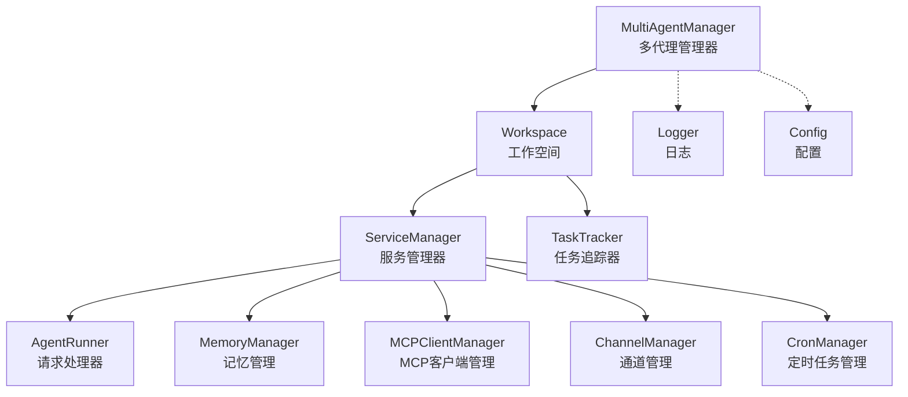
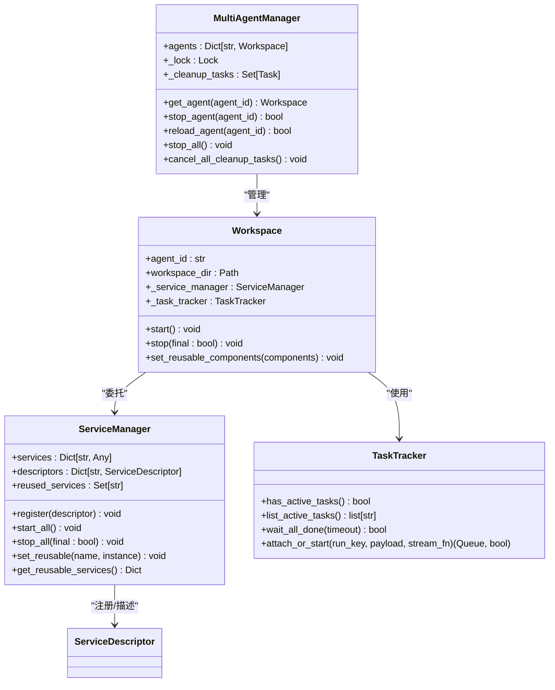
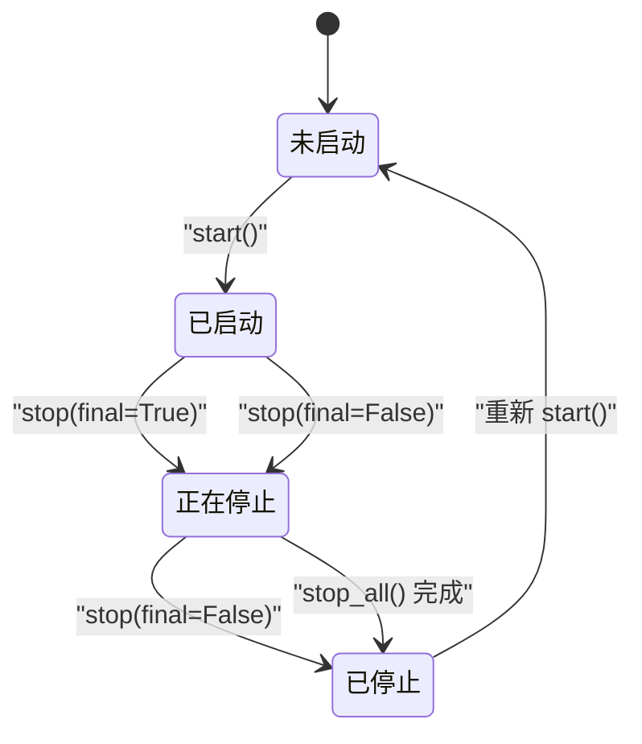
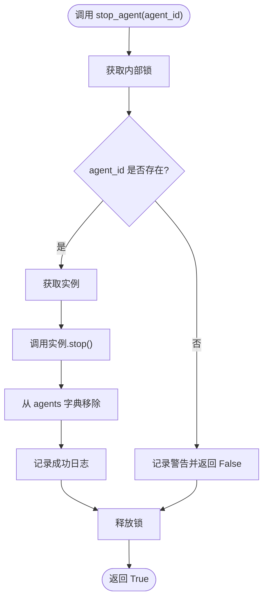
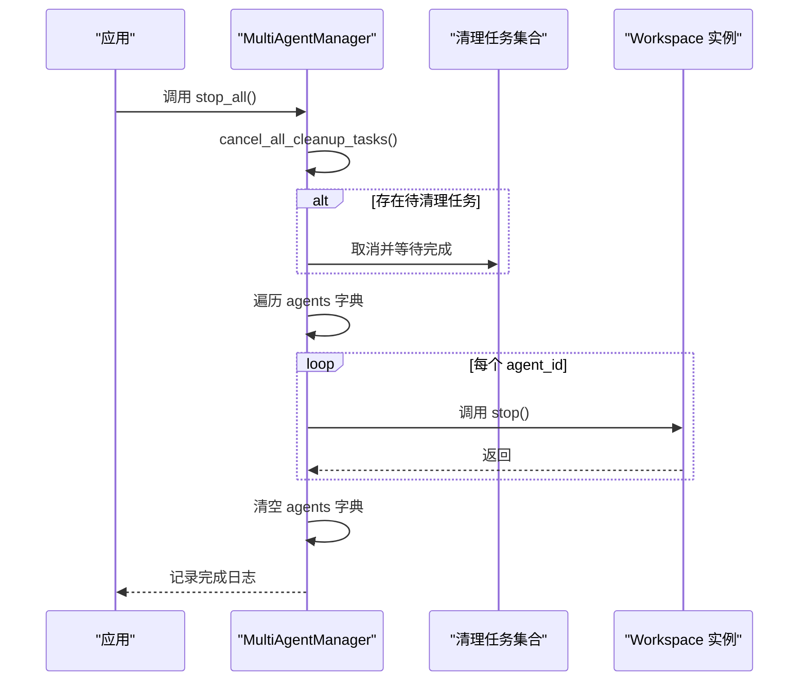
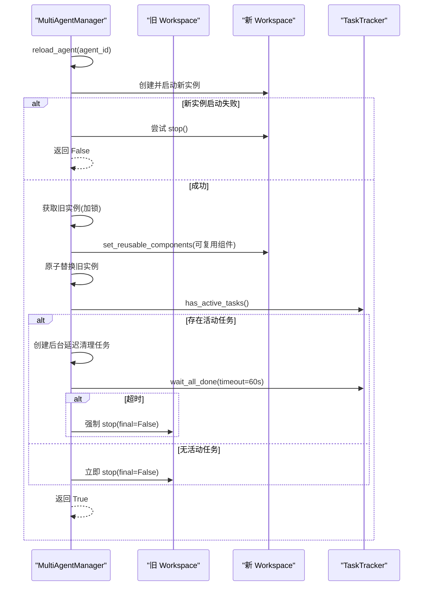
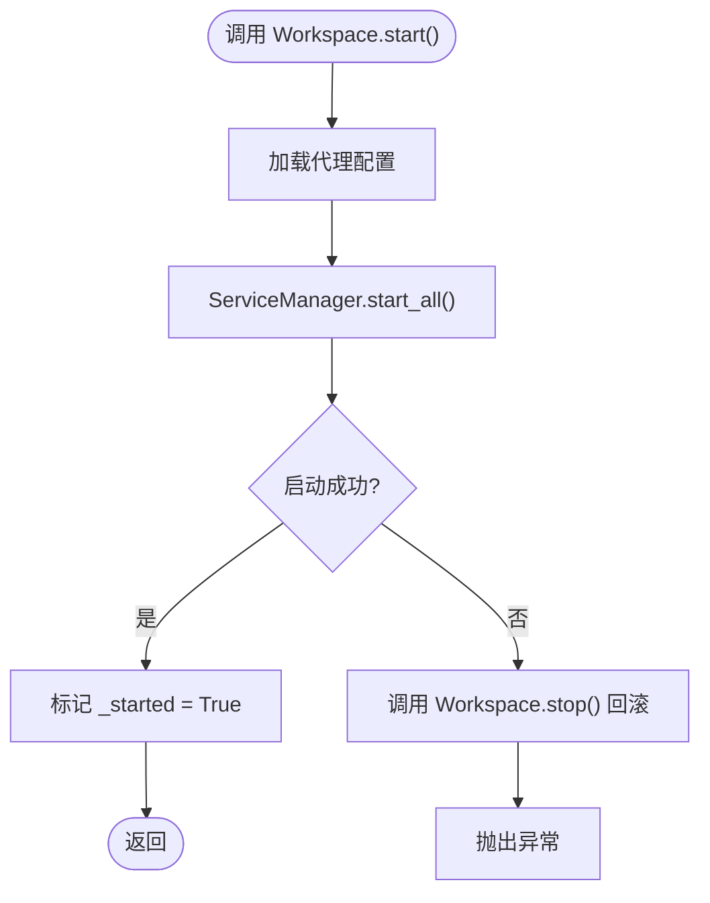
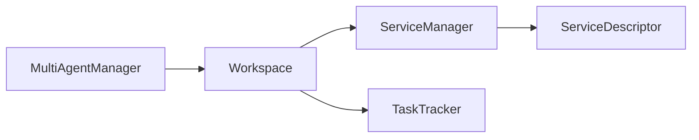

# 代理生命周期管理

<cite>
**本文档引用的文件**
- [multi_agent_manager.py](file://src/copaw/app/multi_agent_manager.py)
- [workspace.py](file://src/copaw/app/workspace/workspace.py)
- [service_manager.py](file://src/copaw/app/workspace/service_manager.py)
- [task_tracker.py](file://src/copaw/app/runner/task_tracker.py)
- [logging.py](file://src/copaw/utils/logging.py)
- [config.py](file://src/copaw/config/config.py)
- [daemon_commands.py](file://src/copaw/app/runner/daemon_commands.py)
- [heartbeat.py](file://src/copaw/app/crons/heartbeat.py)
</cite>

## 目录
1. [简介](#简介)
2. [项目结构](#项目结构)
3. [核心组件](#核心组件)
4. [架构总览](#架构总览)
5. [详细组件分析](#详细组件分析)
6. [依赖关系分析](#依赖关系分析)
7. [性能考虑](#性能考虑)
8. [故障排查指南](#故障排查指南)
9. [结论](#结论)

## 简介
本文件系统性阐述CoPaw中“代理生命周期管理”的设计与实现，覆盖从代理实例创建、启动、运行、停止到销毁的完整流程；重点解析stop_agent与stop_all方法的实现细节、优雅关闭机制（含清理任务取消、并发停止与资源回收）、零停机热重载策略、启动失败处理、停止异常恢复、状态同步与事件序列，并给出生命周期状态转换图与关键流程的时序图。同时提供资源监控、内存泄漏预防与性能优化建议，帮助开发者在复杂场景下安全、可控地管理多代理实例。

## 项目结构
围绕代理生命周期管理的关键代码位于以下模块：
- 多代理管理器：负责实例化、加载、启动、停止与热重载
- 工作空间：封装单个代理实例的完整运行时环境
- 服务管理器：统一注册、启动/停止各子服务并支持可复用组件
- 任务追踪器：跟踪后台流式任务，支撑零停机重载与优雅关闭
- 日志与配置：提供统一日志输出与配置加载能力
- 守护命令：提供/daemon restart等交互式重启入口

图表来源
- [multi_agent_manager.py:17-33](file://src/copaw/app/multi_agent_manager.py#L17-L33)
- [workspace.py:39-78](file://src/copaw/app/workspace/workspace.py#L39-L78)
- [service_manager.py:74-91](file://src/copaw/app/workspace/service_manager.py#L74-L91)
- [task_tracker.py:30-45](file://src/copaw/app/runner/task_tracker.py#L30-L45)

章节来源
- [multi_agent_manager.py:17-33](file://src/copaw/app/multi_agent_manager.py#L17-L33)
- [workspace.py:39-78](file://src/copaw/app/workspace/workspace.py#L39-L78)
- [service_manager.py:74-91](file://src/copaw/app/workspace/service_manager.py#L74-L91)
- [task_tracker.py:30-45](file://src/copaw/app/runner/task_tracker.py#L30-L45)

## 核心组件
- MultiAgentManager：集中式多代理管理器，提供懒加载、生命周期管理、线程安全访问、零停机热重载与优雅关闭
- Workspace：单个代理实例的运行时容器，聚合Runner、ChannelManager、MemoryManager、MCPClientManager、CronManager等组件
- ServiceManager：统一的服务注册、启动/停止与依赖管理，支持可复用组件在热重载中的传递
- TaskTracker：跟踪后台流式任务（如SSE/长连接），用于判断是否需要延迟清理旧实例
- 日志与配置：统一日志格式与配置加载，便于问题定位与状态同步

章节来源
- [multi_agent_manager.py:17-33](file://src/copaw/app/multi_agent_manager.py#L17-L33)
- [workspace.py:39-78](file://src/copaw/app/workspace/workspace.py#L39-L78)
- [service_manager.py:74-91](file://src/copaw/app/workspace/service_manager.py#L74-L91)
- [task_tracker.py:30-45](file://src/copaw/app/runner/task_tracker.py#L30-L45)
- [logging.py:104-139](file://src/copaw/utils/logging.py#L104-L139)
- [config.py:22-28](file://src/copaw/config/config.py#L22-L28)

## 架构总览
代理生命周期管理采用“管理器-工作空间-服务管理器-子服务”的分层架构。管理器负责实例的创建与替换，工作空间负责组件装配与启动/停止，服务管理器负责服务的生命周期与可复用性，任务追踪器负责后台任务状态以决定清理时机。

图表来源
- [multi_agent_manager.py:17-33](file://src/copaw/app/multi_agent_manager.py#L17-L33)
- [workspace.py:39-78](file://src/copaw/app/workspace/workspace.py#L39-L78)
- [service_manager.py:74-91](file://src/copaw/app/workspace/service_manager.py#L74-L91)
- [task_tracker.py:30-45](file://src/copaw/app/runner/task_tracker.py#L30-L45)

## 详细组件分析

### 生命周期状态转换图
代理实例的状态包括“未启动”、“已启动”、“正在停止”、“已停止”。状态转换由start/stop方法驱动，受final参数控制是否跳过可复用组件。

图表来源
- [workspace.py:311-357](file://src/copaw/app/workspace/workspace.py#L311-L357)
- [service_manager.py:324-414](file://src/copaw/app/workspace/service_manager.py#L324-L414)

### stop_agent 方法实现与流程
stop_agent用于停止指定代理实例，其核心流程如下：
- 加锁保护字典访问
- 若实例不存在则返回False
- 调用实例stop()并从管理器字典移除
- 记录日志并返回True

图表来源
- [multi_agent_manager.py:180-198](file://src/copaw/app/multi_agent_manager.py#L180-L198)

章节来源
- [multi_agent_manager.py:180-198](file://src/copaw/app/multi_agent_manager.py#L180-L198)

### stop_all 方法与优雅关闭机制
stop_all用于应用级优雅关闭，流程包括：
- 取消所有待执行的延迟清理任务
- 遍历当前运行中的代理实例逐一停止
- 清空管理器字典并记录完成日志

图表来源
- [multi_agent_manager.py:338-361](file://src/copaw/app/multi_agent_manager.py#L338-L361)
- [multi_agent_manager.py:313-336](file://src/copaw/app/multi_agent_manager.py#L313-L336)

章节来源
- [multi_agent_manager.py:338-361](file://src/copaw/app/multi_agent_manager.py#L338-L361)
- [multi_agent_manager.py:313-336](file://src/copaw/app/multi_agent_manager.py#L313-L336)

### 零停机热重载与旧实例优雅停止
reload_agent通过“新实例先行启动 + 原子替换 + 后台优雅停止”的方式实现零停机重载：
- 新实例在不持锁的情况下创建并启动
- 在极短的锁内完成原子替换
- 旧实例根据是否存在活动任务决定立即停止或延迟清理

图表来源
- [multi_agent_manager.py:200-311](file://src/copaw/app/multi_agent_manager.py#L200-L311)
- [multi_agent_manager.py:83-178](file://src/copaw/app/multi_agent_manager.py#L83-L178)
- [workspace.py:311-357](file://src/copaw/app/workspace/workspace.py#L311-L357)
- [service_manager.py:324-414](file://src/copaw/app/workspace/service_manager.py#L324-L414)

章节来源
- [multi_agent_manager.py:200-311](file://src/copaw/app/multi_agent_manager.py#L200-L311)
- [multi_agent_manager.py:83-178](file://src/copaw/app/multi_agent_manager.py#L83-L178)
- [workspace.py:311-357](file://src/copaw/app/workspace/workspace.py#L311-L357)
- [service_manager.py:324-414](file://src/copaw/app/workspace/service_manager.py#L324-L414)

### 启动失败处理与异常恢复
- Workspace.start在启动过程中若发生异常，会调用stop()进行回滚清理，确保部分启动的服务被正确关闭
- reload_agent在创建新实例失败时，尝试对新实例进行best-effort清理，并保持旧实例继续提供服务

图表来源
- [workspace.py:311-336](file://src/copaw/app/workspace/workspace.py#L311-L336)

章节来源
- [workspace.py:311-336](file://src/copaw/app/workspace/workspace.py#L311-L336)
- [multi_agent_manager.py:274-288](file://src/copaw/app/multi_agent_manager.py#L274-L288)

### 停止异常恢复与状态同步
- ServiceManager.stop_all在停止过程中捕获异常并记录警告，避免一个服务的异常影响其他服务的正常关闭
- MultiAgentManager.stop_all在停止每个实例时记录错误但继续执行，保证整体关闭流程不中断
- TaskTracker在生产者协程中对异常进行捕获并广播错误事件，确保订阅方能感知异常

章节来源
- [service_manager.py:324-414](file://src/copaw/app/workspace/service_manager.py#L324-L414)
- [multi_agent_manager.py:352-358](file://src/copaw/app/multi_agent_manager.py#L352-L358)
- [task_tracker.py:171-205](file://src/copaw/app/runner/task_tracker.py#L171-L205)

### 资源监控、内存泄漏预防与性能优化
- 任务追踪：TaskTracker使用弱引用持有自身，避免循环引用导致的内存泄漏；队列为每个订阅者提供独立缓冲，断开后自动移除，防止泄露
- 可复用组件：ServiceDescriptor.reusable与ServiceManager.set_reusable配合，减少热重载时的重复初始化成本
- 并发启动：ServiceManager按优先级分组并发启动，缩短启动时间
- 日志过滤：自定义ColorFormatter与SuppressPathAccessLogFilter，减少噪声日志，提升可观测性
- 配置生成：generate_short_agent_id用于生成简短唯一ID，便于日志与监控标识

章节来源
- [task_tracker.py:171-205](file://src/copaw/app/runner/task_tracker.py#L171-L205)
- [service_manager.py:106-145](file://src/copaw/app/workspace/service_manager.py#L106-L145)
- [logging.py:49-79](file://src/copaw/utils/logging.py#L49-L79)
- [logging.py:82-102](file://src/copaw/utils/logging.py#L82-L102)
- [config.py:22-28](file://src/copaw/config/config.py#L22-L28)

## 依赖关系分析
- MultiAgentManager依赖Workspace与ServiceManager，通过异步锁保证并发安全
- Workspace依赖ServiceManager与TaskTracker，负责组件装配与生命周期
- ServiceManager依赖ServiceDescriptor描述符，实现声明式服务注册与依赖管理
- TaskTracker为Workspace提供后台任务状态查询能力，支撑零停机重载决策

图表来源
- [multi_agent_manager.py:17-33](file://src/copaw/app/multi_agent_manager.py#L17-L33)
- [workspace.py:134-277](file://src/copaw/app/workspace/workspace.py#L134-L277)
- [service_manager.py:30-72](file://src/copaw/app/workspace/service_manager.py#L30-L72)

章节来源
- [multi_agent_manager.py:17-33](file://src/copaw/app/multi_agent_manager.py#L17-L33)
- [workspace.py:134-277](file://src/copaw/app/workspace/workspace.py#L134-L277)
- [service_manager.py:30-72](file://src/copaw/app/workspace/service_manager.py#L30-L72)

## 性能考虑
- 启动阶段：通过并发初始化与优先级分组，最大化利用CPU与IO资源
- 关闭阶段：对可复用组件采用跳过策略，避免不必要的重复关闭
- 重载阶段：新实例先启动，替换时仅持锁极短时间，最小化阻塞
- 日志：彩色与路径裁剪减少输出体积，文件处理器按平台选择，避免锁竞争

## 故障排查指南
- 启动失败：检查配置加载与服务启动日志，确认异常堆栈；必要时查看回滚日志
- 重载失败：关注新实例启动异常与旧实例保留提示；确认可复用组件设置
- 停止异常：查看ServiceManager停止过程中的警告日志；确认是否有未处理的异常
- 长连接/流式任务：通过TaskTracker.has_active_tasks与wait_all_done判断是否需要延迟清理
- 守护命令：使用/daemon restart触发零停机重载，观察提示消息与日志

章节来源
- [daemon_commands.py:126-161](file://src/copaw/app/runner/daemon_commands.py#L126-L161)
- [heartbeat.py:174-182](file://src/copaw/app/crons/heartbeat.py#L174-L182)
- [task_tracker.py:54-98](file://src/copaw/app/runner/task_tracker.py#L54-L98)

## 结论
CoPaw的代理生命周期管理通过MultiAgentManager、Workspace与ServiceManager的协同，实现了从创建、启动、运行、停止到销毁的全链路控制；stop_agent与stop_all提供了细粒度与全局的停止能力；零停机热重载结合TaskTracker实现了优雅关闭与资源回收；完善的日志与配置体系为问题诊断与性能优化提供了坚实基础。该设计在保证高可用的同时，兼顾了可维护性与扩展性。