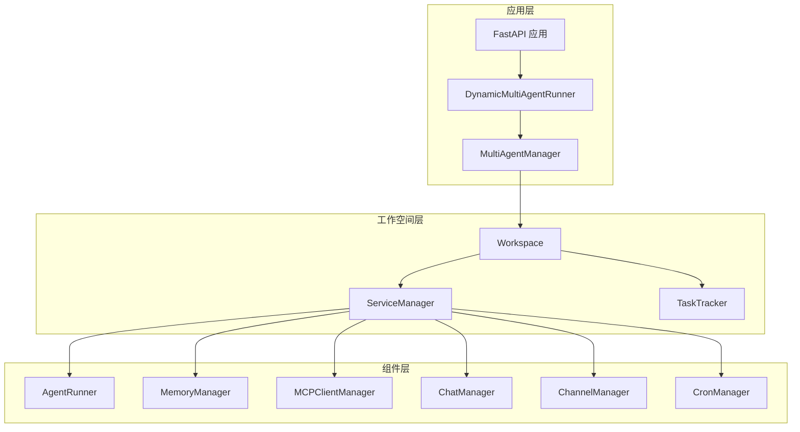
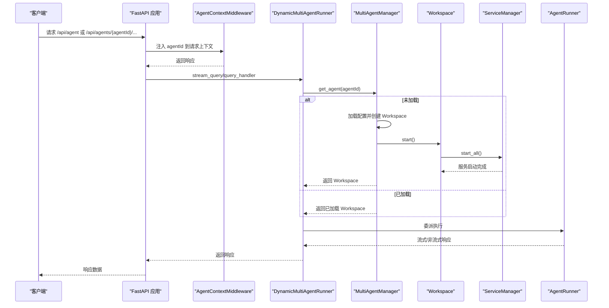
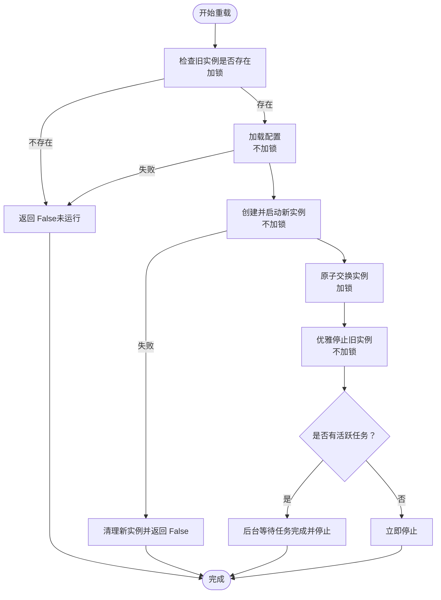
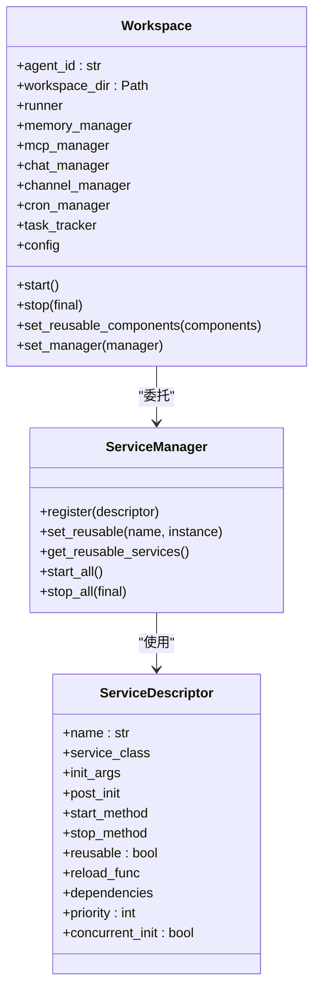
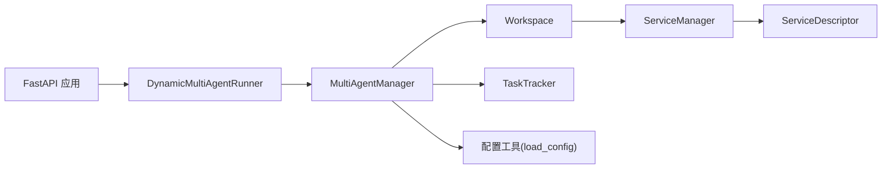
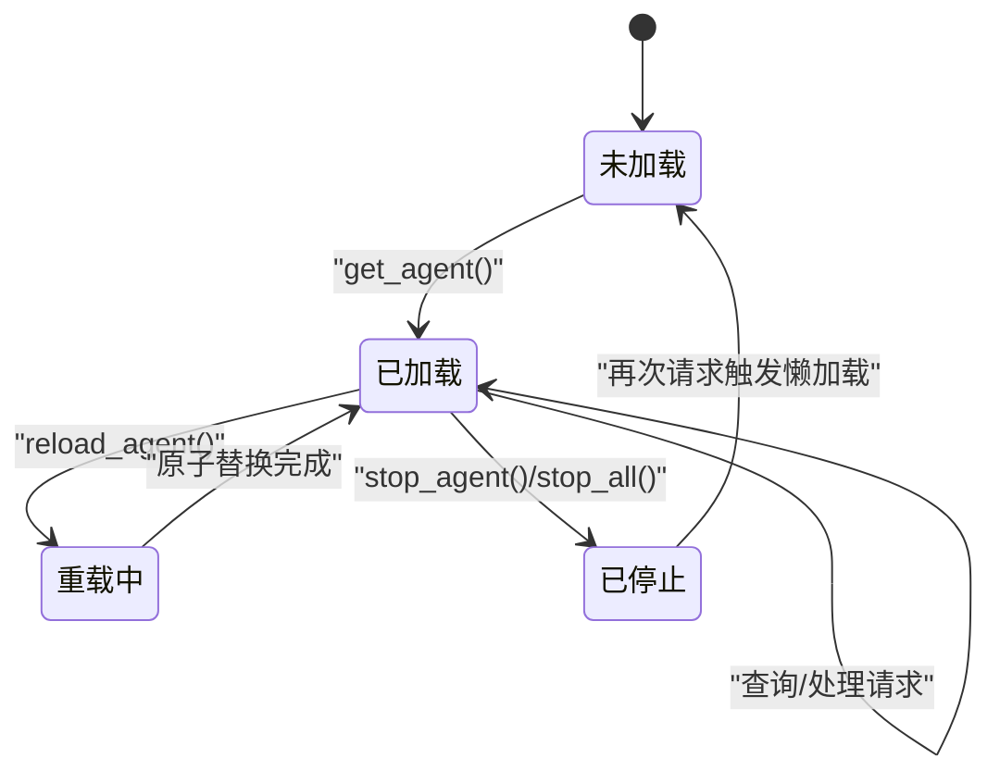
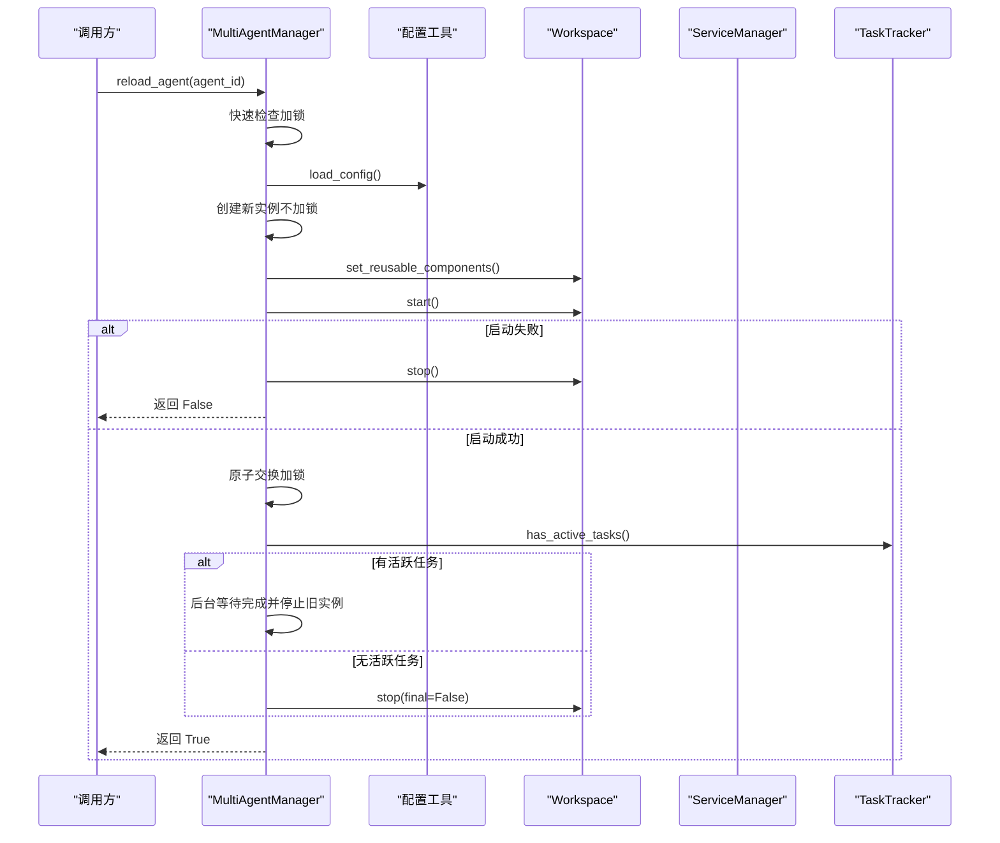

# 多代理管理器

<cite>
**本文引用的文件列表**
- [multi_agent_manager.py](file://src/copaw/app/multi_agent_manager.py)
- [workspace.py](file://src/copaw/app/workspace/workspace.py)
- [service_manager.py](file://src/copaw/app/workspace/service_manager.py)
- [task_tracker.py](file://src/copaw/app/runner/task_tracker.py)
- [utils.py](file://src/copaw/config/utils.py)
- [_app.py](file://src/copaw/app/_app.py)
- [agent_scoped.py](file://src/copaw/app/routers/agent_scoped.py)
- [react_agent.py](file://src/copaw/agents/react_agent.py)
- [memory_manager.py](file://src/copaw/agents/memory/memory_manager.py)
- [logging.py](file://src/copaw/utils/logging.py)
- [constant.py](file://src/copaw/constant.py)
</cite>

## 目录
1. [简介](#简介)
2. [项目结构与角色定位](#项目结构与角色定位)
3. [核心组件与职责](#核心组件与职责)
4. [架构总览](#架构总览)
5. [详细组件分析](#详细组件分析)
6. [依赖关系与耦合分析](#依赖关系与耦合分析)
7. [性能与资源管理](#性能与资源管理)
8. [故障排查与错误处理](#故障排查与错误处理)
9. [结论](#结论)
10. [附录：状态图与序列图](#附录状态图与序列图)

## 简介
本文件围绕 CoPaw 的多代理管理器（MultiAgentManager）进行系统化技术文档梳理，重点阐释其懒加载机制、生命周期管理、线程安全设计、零停机重载能力，以及代理实例的创建、启动、停止与重载流程。文档同时覆盖并发访问控制、资源管理、错误处理策略，并给出配置加载、代理发现与实例缓存机制的实现细节，最后总结性能优化与内存管理的最佳实践。

## 项目结构与角色定位
- MultiAgentManager：集中式多代理工作空间管理器，负责按需加载、生命周期管理与零停机热重载。
- Workspace：单个代理工作空间，封装 Runner、ChannelManager、MemoryManager、MCPClientManager、CronManager 等组件。
- ServiceManager：统一的服务注册与生命周期编排器，支持优先级分组、并发初始化、可复用组件传递。
- TaskTracker：每个工作空间的任务追踪器，用于检测活跃任务并支持优雅关闭。
- 配置加载：通过配置工具模块加载全局配置与代理配置，支撑代理发现与实例化。
- 应用入口：FastAPI 生命周期中初始化 MultiAgentManager 并并发启动所有已配置代理；动态路由根据请求上下文选择对应 Workspace。

图表来源
- [_app.py:149-241](file://src/copaw/app/_app.py#L149-L241)
- [multi_agent_manager.py:27-32](file://src/copaw/app/multi_agent_manager.py#L27-L32)
- [workspace.py:52-77](file://src/copaw/app/workspace/workspace.py#L52-L77)
- [service_manager.py:81-91](file://src/copaw/app/workspace/service_manager.py#L81-L91)

章节来源
- [_app.py:149-241](file://src/copaw/app/_app.py#L149-L241)
- [multi_agent_manager.py:27-32](file://src/copaw/app/multi_agent_manager.py#L27-L32)
- [workspace.py:52-77](file://src/copaw/app/workspace/workspace.py#L52-L77)
- [service_manager.py:81-91](file://src/copaw/app/workspace/service_manager.py#L81-L91)

## 核心组件与职责
- MultiAgentManager
  - 懒加载：首次请求时才创建并启动 Workspace。
  - 生命周期：支持 stop_agent、stop_all、reload_agent、preload_agent、start_all_configured_agents。
  - 线程安全：使用 asyncio.Lock 控制并发访问。
  - 零停机重载：新建实例启动成功后，仅在极短临界区进行原子替换，旧实例后台优雅停止。
- Workspace
  - 统一服务注册：通过 ServiceDescriptor 声明式注册 Runner、MemoryManager、MCPClientManager、ChatManager、ChannelManager、CronManager 等。
  - 可复用组件：支持在 reload 时将可复用组件（如 MemoryManager、ChatManager）从旧实例转移到新实例。
  - 启停编排：由 ServiceManager 负责按优先级并发或串行启动/停止。
- ServiceManager
  - 描述符驱动：通过 ServiceDescriptor 定义服务的初始化参数、后置钩子、启动/停止方法、是否可复用、依赖关系与优先级。
  - 并发策略：同优先级内可并发初始化；不同优先级按顺序串行。
  - 复用与迁移：支持 set_reusable 与 get_reusable_services，在 reload 中实现“无感”迁移。
- TaskTracker
  - 任务状态：has_active_tasks/list_active_tasks/wait_all_done。
  - 优雅停机：配合 _graceful_stop_old_instance 在后台等待任务完成后再停止旧实例。
- 配置加载与代理发现
  - load_config 提供全局配置读取与容错修复。
  - MultiAgentManager 通过配置 profiles 发现可用代理并按需加载。

章节来源
- [multi_agent_manager.py:34-82](file://src/copaw/app/multi_agent_manager.py#L34-L82)
- [multi_agent_manager.py:200-311](file://src/copaw/app/multi_agent_manager.py#L200-L311)
- [workspace.py:134-278](file://src/copaw/app/workspace/workspace.py#L134-L278)
- [service_manager.py:92-156](file://src/copaw/app/workspace/service_manager.py#L92-L156)
- [task_tracker.py:54-97](file://src/copaw/app/runner/task_tracker.py#L54-L97)
- [utils.py:486-526](file://src/copaw/config/utils.py#L486-L526)

## 架构总览
多代理管理器通过“动态路由 + 懒加载 + 原子替换 + 后台清理”的组合，实现了高可用、低干扰的多代理运行时。请求进入时，应用中间件提取 agentId，DynamicMultiAgentRunner 将请求转发至 MultiAgentManager，后者按需获取或创建 Workspace，再委派给该 Workspace 内部的 Runner 执行业务逻辑。

图表来源
- [_app.py:149-241](file://src/copaw/app/_app.py#L149-L241)
- [agent_scoped.py:15-50](file://src/copaw/app/routers/agent_scoped.py#L15-L50)
- [multi_agent_manager.py:34-82](file://src/copaw/app/multi_agent_manager.py#L34-L82)
- [workspace.py:311-337](file://src/copaw/app/workspace/workspace.py#L311-L337)

章节来源
- [_app.py:149-241](file://src/copaw/app/_app.py#L149-L241)
- [agent_scoped.py:15-50](file://src/copaw/app/routers/agent_scoped.py#L15-L50)
- [multi_agent_manager.py:34-82](file://src/copaw/app/multi_agent_manager.py#L34-L82)
- [workspace.py:311-337](file://src/copaw/app/workspace/workspace.py#L311-L337)

## 详细组件分析

### MultiAgentManager：懒加载、生命周期与零停机重载
- 懒加载与缓存
  - get_agent(agent_id)：若未加载则加载配置、创建 Workspace 并启动，随后缓存于内存字典。
  - list_loaded_agents/is_agent_loaded：提供当前已加载代理清单与存在性查询。
- 生命周期管理
  - stop_agent：停止指定代理并移除缓存。
  - stop_all：取消所有延迟清理任务，逐个停止代理并清空缓存。
  - preload_agent：预加载指定代理，便于启动阶段提前就绪。
  - start_all_configured_agents：并发启动配置中声明的所有代理，提升启动效率。
- 零停机重载（reload_agent）
  - 步骤分解：
    1) 快速检查（加锁）：确认旧实例存在。
    2) 配置加载（不加锁）：读取最新配置，解析 agent_ref。
    3) 创建新实例（不加锁）：构造 Workspace 并设置可复用组件（如 MemoryManager、ChatManager）。
    4) 启动新实例（不加锁）：start()，失败则尽力清理并返回 False。
    5) 原子替换（极短加锁）：将旧实例替换为新实例。
    6) 优雅停止旧实例（不加锁）：若存在活跃任务，则后台等待完成后停止；否则立即停止。
  - 关键点：
    - 锁持有时间极短，仅在原子交换阶段，避免阻塞其他代理操作。
    - 通过 TaskTracker.has_active_tasks/list_active_tasks/await wait_all_done 控制后台清理。
    - _cleanup_tasks 集合跟踪后台清理任务，stop_all 中统一取消并等待完成。

图表来源
- [multi_agent_manager.py:200-311](file://src/copaw/app/multi_agent_manager.py#L200-L311)
- [multi_agent_manager.py:83-179](file://src/copaw/app/multi_agent_manager.py#L83-L179)
- [task_tracker.py:54-97](file://src/copaw/app/runner/task_tracker.py#L54-L97)

章节来源
- [multi_agent_manager.py:34-82](file://src/copaw/app/multi_agent_manager.py#L34-L82)
- [multi_agent_manager.py:200-311](file://src/copaw/app/multi_agent_manager.py#L200-L311)
- [multi_agent_manager.py:83-179](file://src/copaw/app/multi_agent_manager.py#L83-L179)
- [task_tracker.py:54-97](file://src/copaw/app/runner/task_tracker.py#L54-L97)

### Workspace：服务注册与可复用组件传递
- 服务注册
  - 通过 ServiceDescriptor 声明式注册 Runner、MemoryManager、MCPClientManager、ChatManager、ChannelManager、CronManager 等。
  - 支持 post_init、start_method、stop_method、reusable、priority、concurrent_init 等元信息。
- 可复用组件
  - set_reusable_components：在 start() 之前注入可复用组件，避免 reload 时重建。
  - get_reusable_services：在 reload 时将可复用组件从旧实例迁移到新实例。
- 启停编排
  - start()：加载代理配置，交由 ServiceManager 按优先级并发/串行启动。
  - stop(final)：按优先级逆序停止，final=False 时跳过可复用组件，以便新实例接管。

图表来源
- [workspace.py:134-278](file://src/copaw/app/workspace/workspace.py#L134-L278)
- [service_manager.py:92-156](file://src/copaw/app/workspace/service_manager.py#L92-L156)
- [service_manager.py:31-71](file://src/copaw/app/workspace/service_manager.py#L31-L71)

章节来源
- [workspace.py:134-278](file://src/copaw/app/workspace/workspace.py#L134-L278)
- [service_manager.py:92-156](file://src/copaw/app/workspace/service_manager.py#L92-L156)
- [service_manager.py:31-71](file://src/copaw/app/workspace/service_manager.py#L31-L71)

### ServiceManager：优先级与并发策略
- 分组与启动
  - 按 priority 分组，同组内按 concurrent_init 决定是否并发启动。
  - 串行组内按顺序依次启动。
- 停止策略
  - 按优先级逆序停止，final=False 时跳过可复用组件。
- 复用与迁移
  - set_reusable：标记并注入可复用实例，必要时触发 reload_func。
  - get_reusable_services：导出可复用实例集合。

章节来源
- [service_manager.py:171-200](file://src/copaw/app/workspace/service_manager.py#L171-L200)
- [service_manager.py:324-360](file://src/copaw/app/workspace/service_manager.py#L324-L360)
- [service_manager.py:106-156](file://src/copaw/app/workspace/service_manager.py#L106-L156)

### TaskTracker：活跃任务检测与优雅停机
- 活跃任务检测：has_active_tasks、list_active_tasks、wait_all_done。
- 优雅停机：MultiAgentManager 在 _graceful_stop_old_instance 中利用 TaskTracker 等待任务完成或超时后停止旧实例。

章节来源
- [task_tracker.py:54-97](file://src/copaw/app/runner/task_tracker.py#L54-L97)
- [multi_agent_manager.py:83-179](file://src/copaw/app/multi_agent_manager.py#L83-L179)

### 配置加载与代理发现
- 全局配置：load_config 从 WORKING_DIR/config.json 读取，具备语法修复与校验回退。
- 代理发现：MultiAgentManager 通过 load_config().agents.profiles 获取可用代理清单。
- 代理配置：Workspace 通过 load_agent_config(agent_id) 获取代理特定配置。

章节来源
- [utils.py:486-526](file://src/copaw/config/utils.py#L486-L526)
- [multi_agent_manager.py:55-64](file://src/copaw/app/multi_agent_manager.py#L55-L64)
- [workspace.py:117-121](file://src/copaw/app/workspace/workspace.py#L117-L121)

### 应用入口与动态路由
- FastAPI 生命周期：lifespan 中初始化 MultiAgentManager 并并发启动所有已配置代理。
- 动态路由：DynamicMultiAgentRunner 根据请求上下文（AgentContextMiddleware 注入的 agentId）选择对应 Workspace 的 Runner。
- 中间件：AgentContextMiddleware 从路径或 X-Agent-Id 头提取 agentId 并注入上下文。

章节来源
- [_app.py:149-241](file://src/copaw/app/_app.py#L149-L241)
- [agent_scoped.py:15-50](file://src/copaw/app/routers/agent_scoped.py#L15-L50)
- [multi_agent_manager.py:34-82](file://src/copaw/app/multi_agent_manager.py#L34-L82)

## 依赖关系与耦合分析
- 组件耦合
  - MultiAgentManager 与 Workspace 弱耦合：通过接口（get_agent/start/stop/reload）交互。
  - Workspace 与 ServiceManager 强耦合：服务注册与生命周期完全委托给 ServiceManager。
  - ServiceManager 与 ServiceDescriptor 解耦：通过描述符驱动，降低硬编码。
  - MultiAgentManager 与 TaskTracker：通过 has_active_tasks/wait_all_done 协作实现优雅停机。
- 外部依赖
  - 配置系统：依赖配置文件与环境变量，具备容错与自动修复能力。
  - 日志系统：统一命名空间与着色输出，支持文件轮转。
  - 运行时框架：基于 AgentApp 与 Runner 接口，确保多代理运行时一致性。

图表来源
- [multi_agent_manager.py:27-32](file://src/copaw/app/multi_agent_manager.py#L27-L32)
- [workspace.py:134-156](file://src/copaw/app/workspace/workspace.py#L134-L156)
- [service_manager.py:31-71](file://src/copaw/app/workspace/service_manager.py#L31-L71)
- [utils.py:486-526](file://src/copaw/config/utils.py#L486-L526)
- [_app.py:149-241](file://src/copaw/app/_app.py#L149-L241)

章节来源
- [multi_agent_manager.py:27-32](file://src/copaw/app/multi_agent_manager.py#L27-L32)
- [workspace.py:134-156](file://src/copaw/app/workspace/workspace.py#L134-L156)
- [service_manager.py:31-71](file://src/copaw/app/workspace/service_manager.py#L31-L71)
- [utils.py:486-526](file://src/copaw/config/utils.py#L486-L526)
- [_app.py:149-241](file://src/copaw/app/_app.py#L149-L241)

## 性能与资源管理
- 并发启动
  - start_all_configured_agents 使用 asyncio.gather 并发启动多个代理，显著缩短启动时间。
- 并发初始化
  - ServiceManager 同优先级内并发初始化，不同优先级串行，最大化并行度同时保证依赖顺序。
- 懒加载与缓存
  - 仅在首次请求时创建 Workspace，减少内存占用与启动开销。
- 零停机重载
  - 新实例启动与旧实例停止解耦，最小化锁持有时间，避免阻塞其他代理。
- 资源回收
  - stop_all 中取消并等待所有后台清理任务，确保无孤儿实例。
- 日志与可观测性
  - 统一命名空间与着色输出，文件轮转避免磁盘膨胀。
- 内存管理建议
  - 合理配置 MemoryManager 的 compact_ratio 与 keep_recent，结合模型 token 计数器控制内存增长。
  - 对于向量搜索与全文检索，依据平台选择本地或 Chroma 后端，平衡性能与资源消耗。

章节来源
- [multi_agent_manager.py:399-445](file://src/copaw/app/multi_agent_manager.py#L399-L445)
- [service_manager.py:188-199](file://src/copaw/app/workspace/service_manager.py#L188-L199)
- [memory_manager.py:202-274](file://src/copaw/agents/memory/memory_manager.py#L202-L274)
- [logging.py:142-184](file://src/copaw/utils/logging.py#L142-L184)

## 故障排查与错误处理
- 配置异常
  - load_config 对 JSON 语法问题进行自动修复，对校验错误尝试字段剔除后回退，默认返回空配置。
- 启动失败
  - Workspace.start() 失败时会回滚已启动组件并抛出异常；MultiAgentManager.reload_agent 失败时清理新实例并返回 False。
- 重载失败
  - 若新实例启动失败，旧实例保持运行，避免服务中断。
- 优雅停机
  - _graceful_stop_old_instance 在有活跃任务时后台等待完成，超时后强制停止，避免长时间阻塞。
- 日志策略
  - 统一命名空间与颜色输出，文件处理器支持轮转，便于定位问题。

章节来源
- [utils.py:486-526](file://src/copaw/config/utils.py#L486-L526)
- [workspace.py:330-336](file://src/copaw/app/workspace/workspace.py#L330-L336)
- [multi_agent_manager.py:274-288](file://src/copaw/app/multi_agent_manager.py#L274-L288)
- [multi_agent_manager.py:83-179](file://src/copaw/app/multi_agent_manager.py#L83-L179)
- [logging.py:104-184](file://src/copaw/utils/logging.py#L104-L184)

## 结论
MultiAgentManager 通过懒加载、服务化编排、可复用组件传递与零停机重载等机制，构建了高可用、低干扰的多代理运行时。其设计在保证线程安全与并发性能的同时，兼顾了资源管理与错误恢复，适合在生产环境中长期稳定运行。配合合理的配置与日志策略，能够有效支撑大规模多代理场景。

## 附录：状态图与序列图

### MultiAgentManager 状态转换（简化）

图表来源
- [multi_agent_manager.py:34-82](file://src/copaw/app/multi_agent_manager.py#L34-L82)
- [multi_agent_manager.py:200-311](file://src/copaw/app/multi_agent_manager.py#L200-L311)
- [multi_agent_manager.py:180-198](file://src/copaw/app/multi_agent_manager.py#L180-L198)

### 零停机重载交互序列（代码映射）

图表来源
- [multi_agent_manager.py:200-311](file://src/copaw/app/multi_agent_manager.py#L200-L311)
- [task_tracker.py:54-97](file://src/copaw/app/runner/task_tracker.py#L54-L97)