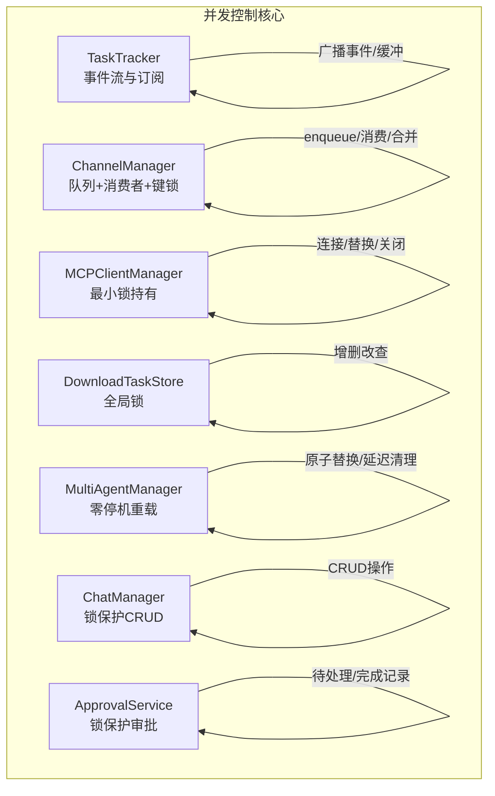
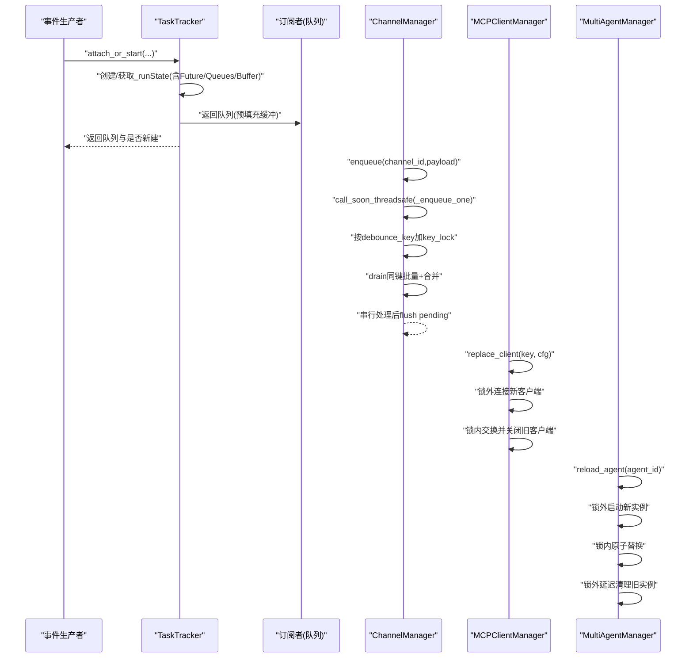
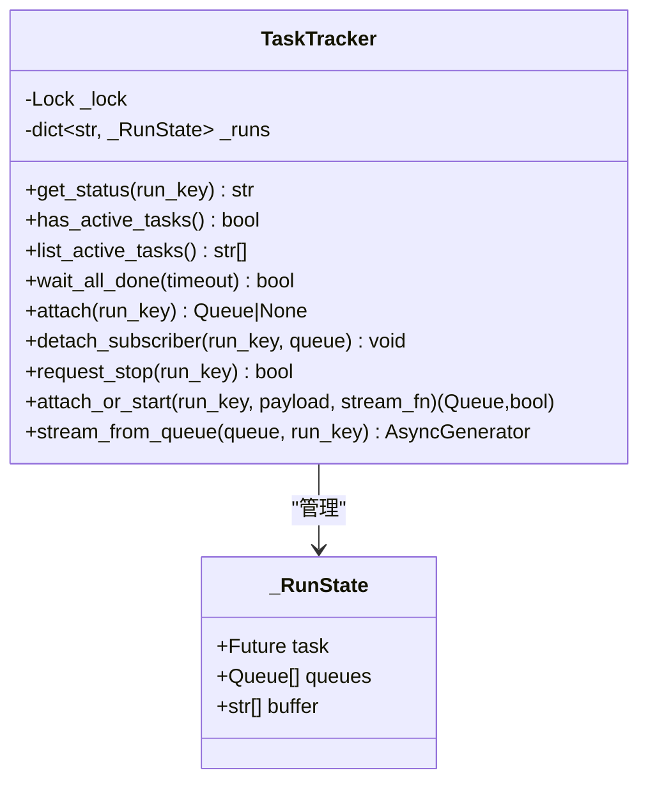
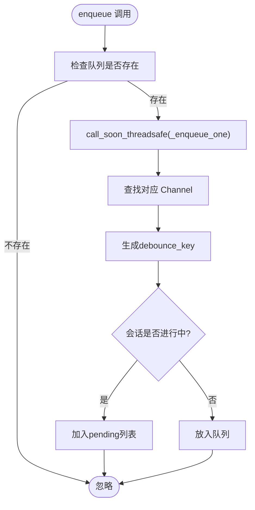
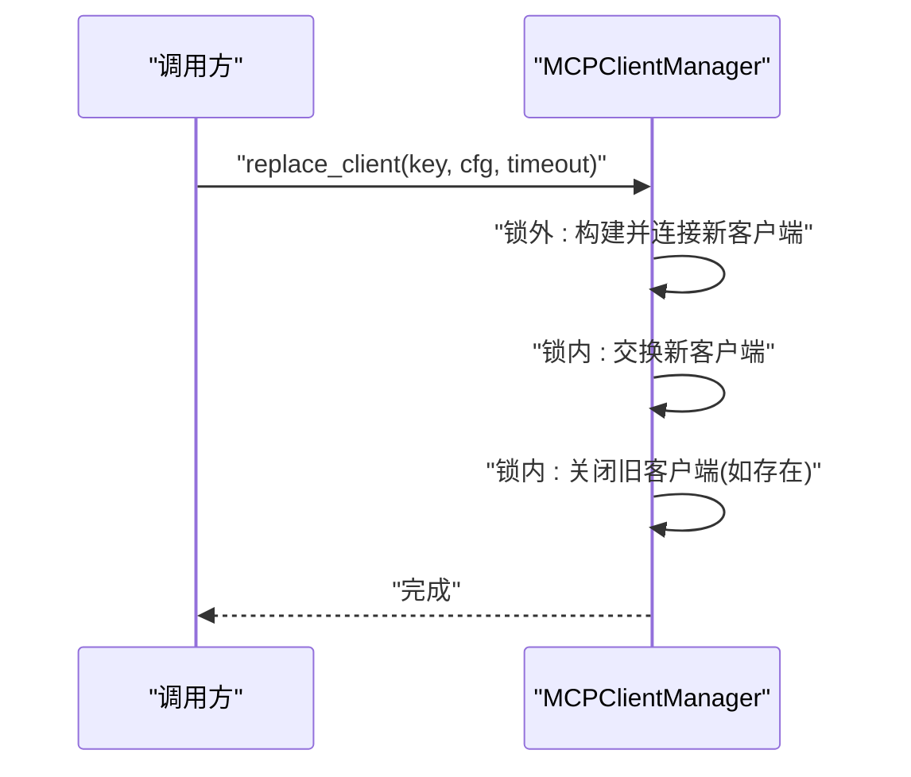
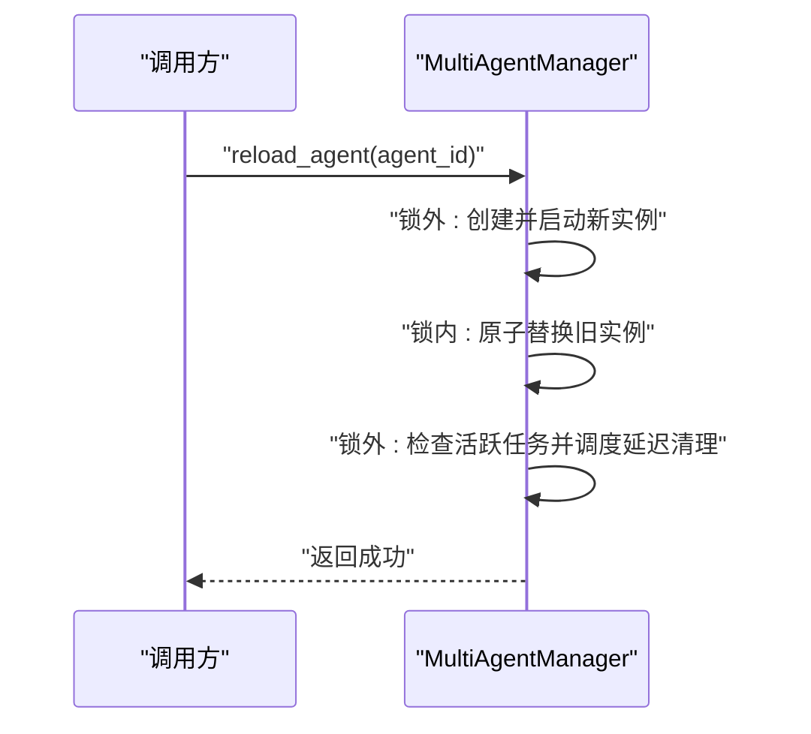
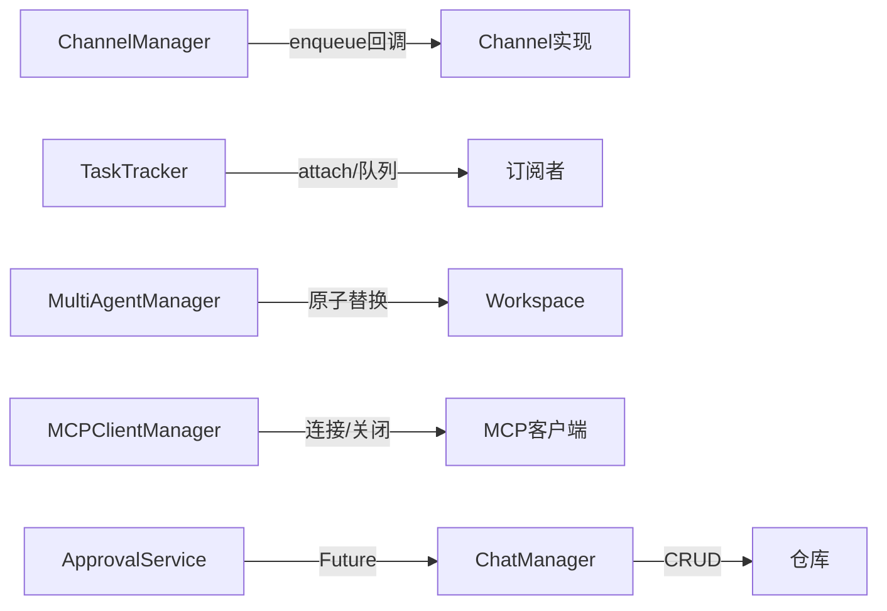
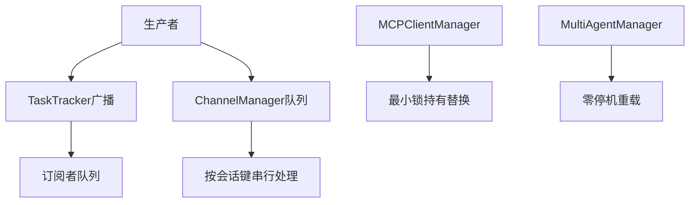

# 并发访问控制

<cite>
**本文引用的文件**
- [src/copaw/app/runner/task_tracker.py](file://src/copaw/app/runner/task_tracker.py)
- [src/copaw/app/channels/manager.py](file://src/copaw/app/channels/manager.py)
- [src/copaw/app/channels/dingtalk/channel.py](file://src/copaw/app/channels/dingtalk/channel.py)
- [src/copaw/app/mcp/manager.py](file://src/copaw/app/mcp/manager.py)
- [src/copaw/app/download_task_store.py](file://src/copaw/app/download_task_store.py)
- [src/copaw/app/multi_agent_manager.py](file://src/copaw/app/multi_agent_manager.py)
- [src/copaw/app/runner/manager.py](file://src/copaw/app/runner/manager.py)
- [src/copaw/app/approvals/service.py](file://src/copaw/app/approvals/service.py)
</cite>

## 目录
1. [引言](#引言)
2. [项目结构](#项目结构)
3. [核心组件](#核心组件)
4. [架构总览](#架构总览)
5. [详细组件分析](#详细组件分析)
6. [依赖分析](#依赖分析)
7. [性能考虑](#性能考虑)
8. [故障排查指南](#故障排查指南)
9. [结论](#结论)
10. [附录](#附录)

## 引言
本文件聚焦于 CoPaw 的并发访问控制（Concurrent Access Control），系统性阐述以下主题：
- asyncio.Lock 的使用策略与线程安全设计：临界区保护、锁粒度优化、死锁避免
- 任务跟踪器（TaskTracker）的集成：活跃任务检测、任务状态监控、清理任务管理
- 并发操作的同步策略：读写分离、锁升级降级与性能优化
- 并发访问模式图与锁竞争分析
- 异常情况下的锁释放、资源清理与状态一致性保证
- 高并发场景下的性能调优与监控指标建议

## 项目结构
围绕并发控制的关键模块分布如下：
- 运行时任务与事件流：TaskTracker（事件缓冲、订阅队列、运行状态）
- 通道消费与会话去抖：ChannelManager（队列、消费者工作线程、按会话键的细粒度锁）
- MCP 客户端生命周期：MCPClientManager（最小化锁持有时间的热替换）
- 下载任务存储：download_task_store（全局锁保护的任务字典）
- 多代理管理：MultiAgentManager（零停机重载、延迟清理、后台任务跟踪）
- 聊天管理与审批服务：ChatManager、ApprovalService（统一锁保护的数据访问）

**图表来源**
- [src/copaw/app/runner/task_tracker.py:30-231](file://src/copaw/app/runner/task_tracker.py#L30-L231)
- [src/copaw/app/channels/manager.py:114-580](file://src/copaw/app/channels/manager.py#L114-L580)
- [src/copaw/app/mcp/manager.py:23-255](file://src/copaw/app/mcp/manager.py#L23-L255)
- [src/copaw/app/download_task_store.py:39-131](file://src/copaw/app/download_task_store.py#L39-L131)
- [src/copaw/app/multi_agent_manager.py:17-451](file://src/copaw/app/multi_agent_manager.py#L17-L451)
- [src/copaw/app/runner/manager.py:17-203](file://src/copaw/app/runner/manager.py#L17-L203)
- [src/copaw/app/approvals/service.py:58-341](file://src/copaw/app/approvals/service.py#L58-L341)

**章节来源**
- [src/copaw/app/runner/task_tracker.py:1-231](file://src/copaw/app/runner/task_tracker.py#L1-L231)
- [src/copaw/app/channels/manager.py:1-580](file://src/copaw/app/channels/manager.py#L1-L580)
- [src/copaw/app/mcp/manager.py:1-255](file://src/copaw/app/mcp/manager.py#L1-L255)
- [src/copaw/app/download_task_store.py:1-131](file://src/copaw/app/download_task_store.py#L1-L131)
- [src/copaw/app/multi_agent_manager.py:1-451](file://src/copaw/app/multi_agent_manager.py#L1-L451)
- [src/copaw/app/runner/manager.py:1-203](file://src/copaw/app/runner/manager.py#L1-L203)
- [src/copaw/app/approvals/service.py:1-341](file://src/copaw/app/approvals/service.py#L1-L341)

## 核心组件
- TaskTracker：以 asyncio.Lock 保护 per-run 状态（任务句柄、订阅队列、事件缓冲），支持附加/启动、状态查询、请求停止、流式输出与清理。
- ChannelManager：以 asyncio.Lock 保护通道集合；对每个 (channel_id, debounce_key) 维护 asyncio.Lock，实现“同会话内串行、跨会话并行”的细粒度并发控制；enqueue 在事件循环外线程安全调用。
- MCPClientManager：最小化锁持有时间，先在锁外建立/连接新客户端，再在锁内交换旧客户端并关闭旧连接。
- DownloadTaskStore：全局 asyncio.Lock 保护内存中的下载任务字典，提供创建、查询、更新状态、取消与清理。
- MultiAgentManager：零停机重载，原子替换旧实例；若存在活跃任务则调度延迟清理后台任务，否则立即停止。
- ChatManager：所有仓库访问在 asyncio.Lock 保护下进行，确保读写一致性。
- ApprovalService：统一锁保护的待处理/已完成审批记录，带垃圾回收与超时处理。

**章节来源**
- [src/copaw/app/runner/task_tracker.py:30-231](file://src/copaw/app/runner/task_tracker.py#L30-L231)
- [src/copaw/app/channels/manager.py:114-580](file://src/copaw/app/channels/manager.py#L114-L580)
- [src/copaw/app/mcp/manager.py:78-120](file://src/copaw/app/mcp/manager.py#L78-L120)
- [src/copaw/app/download_task_store.py:39-131](file://src/copaw/app/download_task_store.py#L39-L131)
- [src/copaw/app/multi_agent_manager.py:200-311](file://src/copaw/app/multi_agent_manager.py#L200-L311)
- [src/copaw/app/runner/manager.py:17-203](file://src/copaw/app/runner/manager.py#L17-L203)
- [src/copaw/app/approvals/service.py:58-341](file://src/copaw/app/approvals/service.py#L58-L341)

## 架构总览
下图展示并发控制在系统中的交互路径：事件生产者通过 TaskTracker 广播事件；通道层按会话键合并与串行处理；MCP 客户端热替换保持低锁时间；多代理管理器实现零停机重载；审批与聊天管理在各自锁域内提供一致的读写语义。

**图表来源**
- [src/copaw/app/runner/task_tracker.py:142-208](file://src/copaw/app/runner/task_tracker.py#L142-L208)
- [src/copaw/app/channels/manager.py:304-364](file://src/copaw/app/channels/manager.py#L304-L364)
- [src/copaw/app/mcp/manager.py:78-120](file://src/copaw/app/mcp/manager.py#L78-L120)
- [src/copaw/app/multi_agent_manager.py:200-311](file://src/copaw/app/multi_agent_manager.py#L200-L311)

## 详细组件分析

### TaskTracker：事件流与任务跟踪
- 设计要点
  - 使用 asyncio.Lock 保护 _runs 字典与每条 run 的状态（task/Future、queues、buffer）
  - 生产者在内部弱引用回传后，仍需持有锁进行缓冲追加与广播
  - 订阅者通过 attach/attach_or_start 获取队列，并在流结束后自动 detach
  - 支持 request_stop 取消运行、wait_all_done 等待全部完成
- 关键流程
  - attach_or_start：若已有未完成运行则复用并预填充缓冲；否则创建占位 Future，随后由生产者协程替换并持续广播事件
  - stream_from_queue：迭代队列直到哨兵值，最终 detach_subscriber，避免泄漏
  - get_status/has_active_tasks/list_active_tasks：基于 task.done() 判断运行态
- 死锁与异常
  - 生产者/消费者均在锁内执行缓冲与广播，避免竞态
  - 生产者异常时写入错误事件并广播，finally 中移除 run 并广播哨兵，确保订阅者能正确退出
- 性能优化
  - 每连接独立无界队列，避免阻塞生产者
  - 缓冲区按 SSE 字符串存储，减少对象拷贝

**图表来源**
- [src/copaw/app/runner/task_tracker.py:21-231](file://src/copaw/app/runner/task_tracker.py#L21-L231)

**章节来源**
- [src/copaw/app/runner/task_tracker.py:30-231](file://src/copaw/app/runner/task_tracker.py#L30-L231)

### ChannelManager：队列、消费者与键锁
- 设计要点
  - 全局 asyncio.Lock 保护通道列表与队列映射
  - 按 (channel_id, debounce_key) 维护 asyncio.Lock，确保同一会话内的串行处理，避免消息乱序与重复内容
  - enqueue 在事件循环外线程安全调用（call_soon_threadsafe），内部将 payload 放入队列或 pending
  - _consume_channel_loop：从队列取出 payload，drain 同键批量，合并后串行处理，完成后将 pending 合并回队列
- 锁粒度与死锁避免
  - 全局锁仅用于通道注册/替换/停止等少量操作
  - 会话级 key_lock 仅在处理期间持有，避免长时间阻塞其他会话
  - pending 与 in_progress 集合配合，保证同一会话不会被多个 worker 并发处理
- 线程安全
  - enqueue 通过 loop.call_soon_threadsafe 将 _enqueue_one 切换到事件循环线程，避免跨线程访问共享数据

**图表来源**
- [src/copaw/app/channels/manager.py:304-320](file://src/copaw/app/channels/manager.py#L304-L320)
- [src/copaw/app/channels/manager.py:272-302](file://src/copaw/app/channels/manager.py#L272-L302)

**章节来源**
- [src/copaw/app/channels/manager.py:114-580](file://src/copaw/app/channels/manager.py#L114-L580)

### MCPClientManager：最小锁持有时间的热替换
- 设计要点
  - replace_client：先在锁外连接新客户端（可能耗时），再在锁内交换并关闭旧客户端
  - init_from_config/add_client/remove_client/close_all 均在锁内进行，保证状态一致性
- 死锁与异常
  - 通过“锁外慢操作”避免锁持有过久，降低阻塞风险
  - 连接失败时强制清理新客户端，防止资源泄露

**图表来源**
- [src/copaw/app/mcp/manager.py:78-120](file://src/copaw/app/mcp/manager.py#L78-L120)

**章节来源**
- [src/copaw/app/mcp/manager.py:23-255](file://src/copaw/app/mcp/manager.py#L23-L255)

### DownloadTaskStore：全局锁保护的任务字典
- 设计要点
  - 全局 asyncio.Lock 保护 _tasks 字典与状态变更
  - 提供创建、查询、更新状态、取消与清理接口
- 死锁与异常
  - 所有写操作在锁内进行，读操作在锁外进行（返回快照）
  - 取消仅允许对 PENDING/DOWNLOADING 状态生效

**章节来源**
- [src/copaw/app/download_task_store.py:39-131](file://src/copaw/app/download_task_store.py#L39-L131)

### MultiAgentManager：零停机重载与延迟清理
- 设计要点
  - reload_agent：锁外启动新实例，锁内原子替换，锁外延迟清理旧实例
  - 若旧实例仍有活跃任务，则创建后台任务等待任务完成后再停止
- 死锁与异常
  - 锁仅用于极短时间的原子替换，避免阻塞其他代理
  - 延迟清理任务跟踪集合，异常与取消均有日志记录

**图表来源**
- [src/copaw/app/multi_agent_manager.py:200-311](file://src/copaw/app/multi_agent_manager.py#L200-L311)

**章节来源**
- [src/copaw/app/multi_agent_manager.py:17-451](file://src/copaw/app/multi_agent_manager.py#L17-L451)

### ChatManager 与 ApprovalService：锁保护的读写分离
- ChatManager
  - 所有 CRUD 操作在 asyncio.Lock 保护下进行，确保仓库访问的一致性
- ApprovalService
  - _lock 保护 _pending/_completed 字典；提供创建、解析、查询、垃圾回收
  - 垃圾回收在锁内执行，避免竞态；超时与溢出策略保障内存占用可控

**章节来源**
- [src/copaw/app/runner/manager.py:17-203](file://src/copaw/app/runner/manager.py#L17-L203)
- [src/copaw/app/approvals/service.py:58-341](file://src/copaw/app/approvals/service.py#L58-L341)

## 依赖分析
- 组件耦合
  - ChannelManager 与 Channel 实现解耦：通过 set_enqueue 注入回调，enqueue 在事件循环外线程安全
  - TaskTracker 与 Runner 解耦：通过 attach_or_start 返回队列，订阅者自行消费
  - MultiAgentManager 与 Workspace 解耦：通过原子替换与延迟清理实现零停机
- 潜在环路
  - 当前模块间无直接循环导入；各模块通过弱引用或异步接口交互，降低耦合
- 外部依赖
  - asyncio.Lock/Queue/Future/Task/EventLoop
  - 日志模块用于调试与告警

**图表来源**
- [src/copaw/app/channels/manager.py:264-320](file://src/copaw/app/channels/manager.py#L264-L320)
- [src/copaw/app/runner/task_tracker.py:99-114](file://src/copaw/app/runner/task_tracker.py#L99-L114)
- [src/copaw/app/multi_agent_manager.py:290-311](file://src/copaw/app/multi_agent_manager.py#L290-L311)
- [src/copaw/app/mcp/manager.py:78-120](file://src/copaw/app/mcp/manager.py#L78-L120)
- [src/copaw/app/runner/manager.py:17-203](file://src/copaw/app/runner/manager.py#L17-L203)
- [src/copaw/app/approvals/service.py:116-135](file://src/copaw/app/approvals/service.py#L116-L135)

**章节来源**
- [src/copaw/app/channels/manager.py:114-580](file://src/copaw/app/channels/manager.py#L114-L580)
- [src/copaw/app/runner/task_tracker.py:30-231](file://src/copaw/app/runner/task_tracker.py#L30-L231)
- [src/copaw/app/multi_agent_manager.py:17-451](file://src/copaw/app/multi_agent_manager.py#L17-L451)
- [src/copaw/app/mcp/manager.py:23-255](file://src/copaw/app/mcp/manager.py#L23-L255)
- [src/copaw/app/runner/manager.py:17-203](file://src/copaw/app/runner/manager.py#L17-L203)
- [src/copaw/app/approvals/service.py:58-341](file://src/copaw/app/approvals/service.py#L58-L341)

## 性能考虑
- 锁粒度优化
  - ChannelManager 对 (channel_id, debounce_key) 使用细粒度锁，避免跨会话阻塞
  - TaskTracker 与 MCPClientManager 采用“锁外慢操作”，显著降低锁持有时间
- 队列与缓冲
  - 订阅者使用无界队列，避免背压导致的阻塞；缓冲区按 SSE 字符串存储，减少对象拷贝
- 并发模型
  - 多消费者工作线程（每通道固定数量）提升吞吐；会话内串行处理保证一致性
- 资源清理
  - MultiAgentManager 延迟清理后台任务，避免阻塞主流程
  - ApprovalService 垃圾回收在锁内执行，防止内存膨胀

[本节为通用性能讨论，不直接分析具体文件]

## 故障排查指南
- 锁未释放/死锁
  - 确认所有写路径均在 asyncio.Lock 内执行；避免在锁内执行耗时操作
  - 检查 TaskTracker 生产者异常分支是否正确广播哨兵并移除 run
- 线程安全问题
  - 确保 ChannelManager 的 enqueue 通过 loop.call_soon_threadsafe 切换到事件循环线程
  - DingTalk 通道在回复线程上通过 call_soon_threadsafe 设置 Future 结果，避免 InvalidStateError
- 资源泄漏
  - TaskTracker 流结束后必须 detach_subscriber
  - MultiAgentManager 延迟清理任务需在完成或取消后从跟踪集合移除
- 状态不一致
  - ChatManager/ApprovalService 的所有读写均需在锁内进行
  - DownloadTaskStore 的状态变更需在锁内进行

**章节来源**
- [src/copaw/app/channels/dingtalk/channel.py:461-491](file://src/copaw/app/channels/dingtalk/channel.py#L461-L491)
- [src/copaw/app/runner/task_tracker.py:210-231](file://src/copaw/app/runner/task_tracker.py#L210-L231)
- [src/copaw/app/multi_agent_manager.py:141-156](file://src/copaw/app/multi_agent_manager.py#L141-L156)
- [src/copaw/app/runner/manager.py:17-203](file://src/copaw/app/runner/manager.py#L17-L203)
- [src/copaw/app/approvals/service.py:268-325](file://src/copaw/app/approvals/service.py#L268-L325)

## 结论
CoPaw 的并发访问控制通过以下策略实现了高可用与高性能：
- 明确的锁边界与细粒度锁（会话级键锁、模块级锁）
- 最小化锁持有时间（锁外慢操作）
- 事件驱动的订阅与广播（TaskTracker）
- 零停机重载与延迟清理（MultiAgentManager）
- 统一的锁保护与垃圾回收（ChatManager/ApprovalService）

这些设计共同确保了在高并发场景下的稳定性、可维护性与可观测性。

[本节为总结性内容，不直接分析具体文件]

## 附录
- 并发访问模式图（概念示意）

[该图为概念示意，不直接映射具体文件]