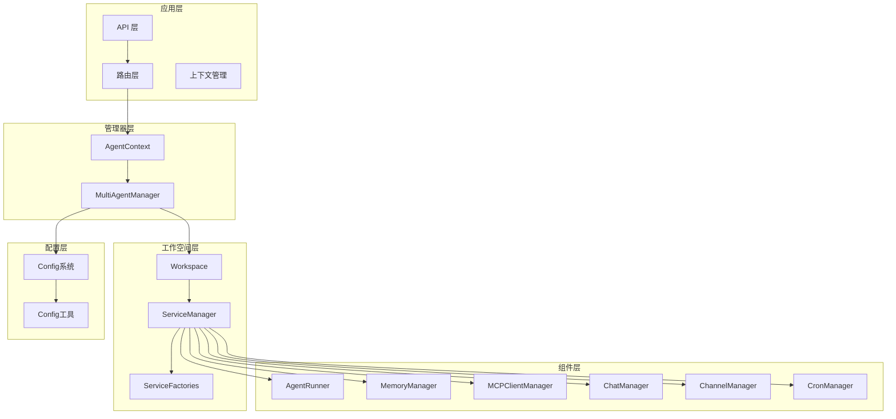
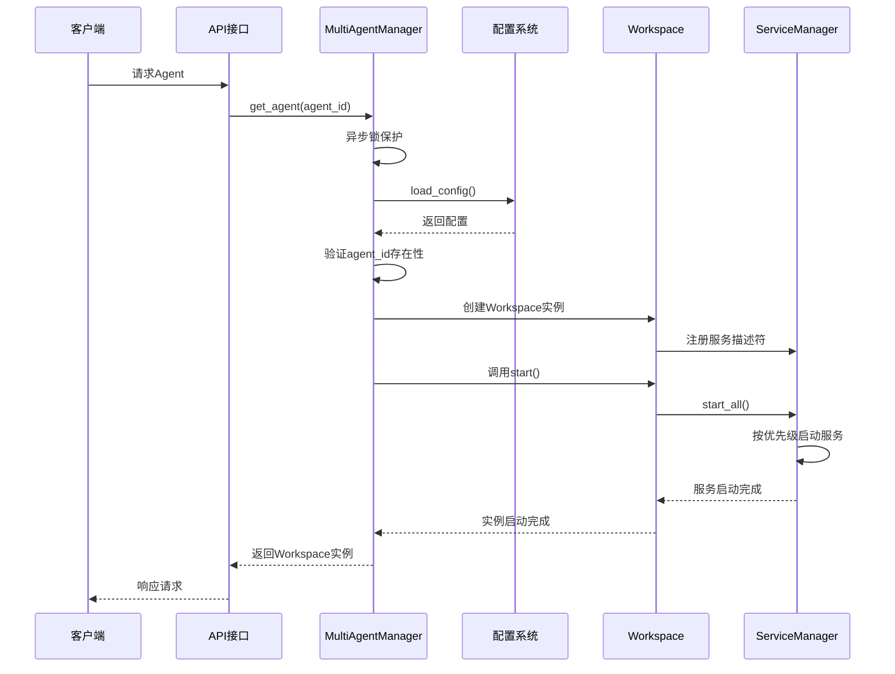
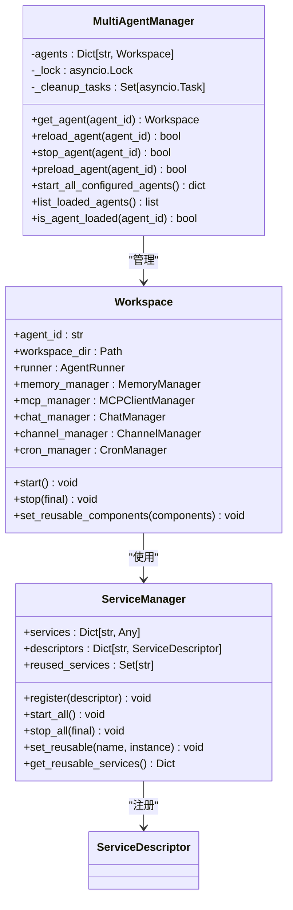
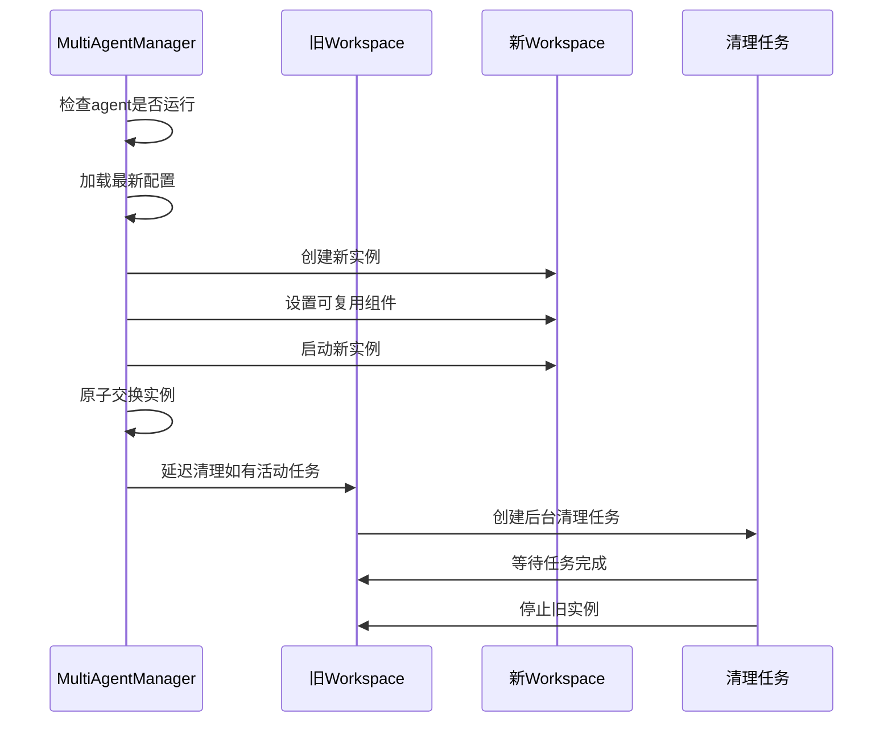
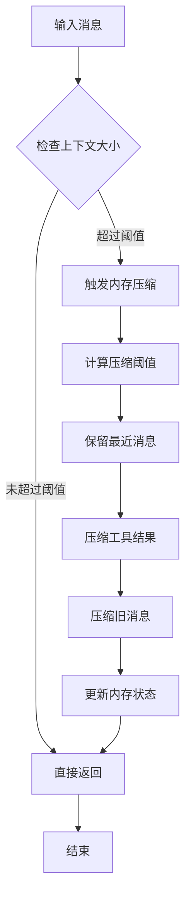
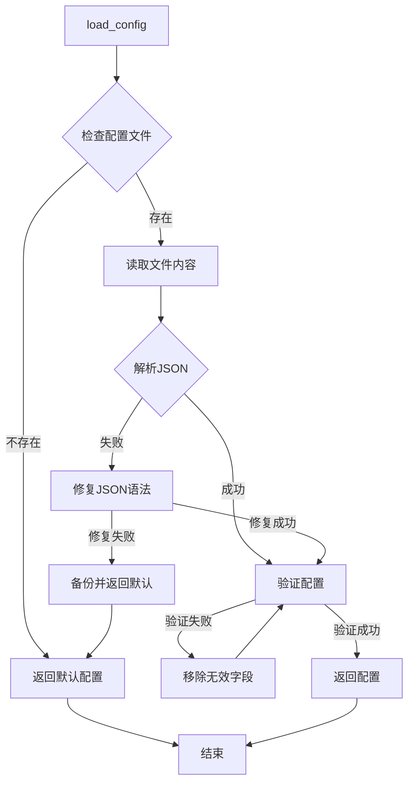

# 懒加载机制

<cite>
**本文引用的文件列表**
- [multi_agent_manager.py](file://src/copaw/app/multi_agent_manager.py)
- [workspace.py](file://src/copaw/app/workspace/workspace.py)
- [service_manager.py](file://src/copaw/app/workspace/service_manager.py)
- [service_factories.py](file://src/copaw/app/workspace/service_factories.py)
- [agent_context.py](file://src/copaw/app/agent_context.py)
- [config.py](file://src/copaw/config/config.py)
- [utils.py](file://src/copaw/config/utils.py)
- [memory_compaction.py](file://src/copaw/agents/hooks/memory_compaction.py)
- [telemetry.py](file://src/copaw/utils/telemetry.py)
</cite>

## 目录
1. [简介](#简介)
2. [项目结构与核心组件](#项目结构与核心组件)
3. [系统架构概览](#系统架构概览)
4. [核心组件详解](#核心组件详解)
5. [懒加载实现流程](#懒加载实现流程)
6. [零停机热重载机制](#零停机热重载机制)
7. [内存优化与资源管理](#内存优化与资源管理)
8. [配置文件解析与验证](#配置文件解析与验证)
9. [性能监控与最佳实践](#性能监控与最佳实践)
10. [故障排查指南](#故障排查指南)
11. [结论](#结论)

## 简介
CoPaw 的懒加载机制通过延迟创建工作空间实例，仅在首次请求时才初始化 Agent 运行时环境，从而显著降低启动时间和内存占用。该机制结合异步锁保护、配置验证、零停机热重载等特性，实现了高性能、可扩展的多 Agent 管理系统。

## 项目结构与核心组件
CoPaw 的懒加载架构围绕以下核心组件构建：
- MultiAgentManager：多 Agent 管理器，负责懒加载、生命周期管理和热重载
- Workspace：单个 Agent 工作空间，封装完整的运行时组件
- ServiceManager：统一的服务管理器，负责组件注册、生命周期管理和依赖处理
- 配置系统：动态配置加载与验证，支持热更新
- 内存管理系统：智能内存压缩与资源回收



**图表来源**
- [multi_agent_manager.py:17-451](file://src/copaw/app/multi_agent_manager.py#L17-L451)
- [workspace.py:39-367](file://src/copaw/app/workspace/workspace.py#L39-L367)
- [service_manager.py:74-415](file://src/copaw/app/workspace/service_manager.py#L74-L415)

## 系统架构概览
懒加载机制采用分层架构设计，确保各层职责清晰、耦合度低：



**图表来源**
- [multi_agent_manager.py:34-82](file://src/copaw/app/multi_agent_manager.py#L34-L82)
- [workspace.py:311-337](file://src/copaw/app/workspace/workspace.py#L311-L337)
- [service_manager.py:171-200](file://src/copaw/app/workspace/service_manager.py#L171-L200)

## 核心组件详解

### MultiAgentManager（多 Agent 管理器）
MultiAgentManager 是懒加载机制的核心控制器，负责：
- 异步锁保护的线程安全访问
- 按需创建工作空间实例
- 配置验证与加载
- 生命周期管理与热重载



**图表来源**
- [multi_agent_manager.py:17-451](file://src/copaw/app/multi_agent_manager.py#L17-L451)
- [workspace.py:39-367](file://src/copaw/app/workspace/workspace.py#L39-L367)
- [service_manager.py:74-415](file://src/copaw/app/workspace/service_manager.py#L74-L415)

**章节来源**
- [multi_agent_manager.py:17-451](file://src/copaw/app/multi_agent_manager.py#L17-L451)

### Workspace（工作空间）
Workspace 封装了单个 Agent 的完整运行时环境，包含：
- Runner：请求处理器
- MemoryManager：对话记忆管理
- MCPClientManager：MCP 工具客户端管理
- ChatManager：聊天会话管理
- ChannelManager：通信渠道管理
- CronManager：定时任务管理

**章节来源**
- [workspace.py:39-367](file://src/copaw/app/workspace/workspace.py#L39-L367)

### ServiceManager（服务管理器）
ServiceManager 提供统一的服务生命周期管理：
- 声明式服务注册（ServiceDescriptor）
- 依赖关系解析
- 并发初始化控制
- 组件复用支持

**章节来源**
- [service_manager.py:74-415](file://src/copaw/app/workspace/service_manager.py#L74-L415)

## 懒加载实现流程

### get_agent 方法详细流程
get_agent 方法实现了完整的懒加载逻辑：

```mermaid
flowchart TD
Start([开始 get_agent]) --> Lock[获取异步锁]
Lock --> CheckCache{检查缓存}
CheckCache --> |已存在| ReturnCached[返回缓存实例]
CheckCache --> |不存在| LoadConfig[加载配置]
LoadConfig --> ValidateID{验证agent_id}
ValidateID --> |不存在| RaiseError[抛出ValueError]
ValidateID --> |存在| CreateInstance[创建Workspace实例]
CreateInstance --> StartInstance[调用start()]
StartInstance --> SetManager[设置管理器引用]
SetManager --> AddToCache[添加到缓存]
AddToCache --> Unlock[释放锁]
Unlock --> ReturnInstance[返回实例]
RaiseError --> UnlockError[释放锁并抛错]
ReturnCached --> End([结束])
ReturnInstance --> End
UnlockError --> End
```

**图表来源**
- [multi_agent_manager.py:34-82](file://src/copaw/app/multi_agent_manager.py#L34-L82)

### 异步锁保护机制
懒加载机制通过 asyncio.Lock 确保线程安全：
- 锁粒度最小化：仅在实例创建和缓存更新时持有锁
- 非阻塞操作：配置加载和实例启动在锁外进行
- 零停机重载：重载过程中的原子交换只在极短时间持有锁

**章节来源**
- [multi_agent_manager.py:34-82](file://src/copaw/app/multi_agent_manager.py#L34-L82)

## 零停机热重载机制

### 重载流程设计
CoPaw 支持零停机热重载，确保服务连续性：



**图表来源**
- [multi_agent_manager.py:200-311](file://src/copaw/app/multi_agent_manager.py#L200-L311)
- [workspace.py:279-310](file://src/copaw/app/workspace/workspace.py#L279-L310)

### 可复用组件机制
通过 ServiceManager 的可复用组件功能，实现资源的高效利用：
- MemoryManager：对话记忆管理器
- ChatManager：聊天会话管理器
- 自动迁移：重载时自动迁移支持复用的组件

**章节来源**
- [service_manager.py:106-156](file://src/copaw/app/workspace/service_manager.py#L106-L156)
- [workspace.py:279-310](file://src/copaw/app/workspace/workspace.py#L279-L310)

## 内存优化与资源管理

### 智能内存压缩
CoPaw 实现了多层次的内存优化策略：



**图表来源**
- [memory_compaction.py:115-143](file://src/copaw/agents/hooks/memory_compaction.py#L115-L143)

### 内存参数配置
关键内存优化参数：
- `max_input_length`：模型上下文窗口大小（默认 131072 tokens）
- `memory_compact_ratio`：触发压缩的比例（默认 0.75）
- `memory_reserve_ratio`：保留最近消息的比例（默认 0.1）

**章节来源**
- [config.py:350-417](file://src/copaw/config/config.py#L350-L417)
- [memory_compaction.py:115-143](file://src/copaw/agents/hooks/memory_compaction.py#L115-L143)

### 资源回收机制
- 延迟清理：重载时检测活动任务，延迟清理过期实例
- 最大等待时间：默认 60 秒等待任务完成
- 强制停止：超时后强制停止旧实例

**章节来源**
- [multi_agent_manager.py:83-179](file://src/copaw/app/multi_agent_manager.py#L83-L179)

## 配置文件解析与验证

### 配置加载流程
CoPaw 的配置系统提供了健壮的解析和验证机制：



**图表来源**
- [utils.py:486-526](file://src/copaw/config/utils.py#L486-L526)

### 配置验证与错误处理
- JSON 语法修复：自动修复常见的 JSON 语法问题
- 字段验证：使用 Pydantic 进行类型和结构验证
- 向后兼容：路径规范化和字段映射
- 备份恢复：配置损坏时自动备份并回退到默认配置

**章节来源**
- [utils.py:486-526](file://src/copaw/config/utils.py#L486-L526)
- [config.py:444-517](file://src/copaw/config/config.py#L444-L517)

### 代理ID验证机制
代理ID验证确保请求的安全性和正确性：
- 配置中存在性检查
- 动态配置加载验证
- 异常信息详细化
- 回退机制（active_agent）

**章节来源**
- [multi_agent_manager.py:58-62](file://src/copaw/app/multi_agent_manager.py#L58-L62)
- [agent_context.py:22-83](file://src/copaw/app/agent_context.py#L22-L83)

## 性能监控与最佳实践

### 性能指标建议
基于 CoPaw 的架构特点，建议监控以下关键指标：
- **启动延迟**：从请求到实例可用的时间
- **内存使用**：各组件的内存占用情况
- **并发请求数**：同时处理的请求数量
- **重载成功率**：零停机重载的成功率
- **清理任务数**：延迟清理任务的数量

### 内存使用统计最佳实践
- 监控 Workspace 实例数量和内存占用
- 跟踪可复用组件的迁移效率
- 分析配置加载的性能开销
- 监控清理任务的执行情况

### Telemetry 集成
CoPaw 提供了可选的遥测收集机制：
- 非侵入式设计：失败时静默忽略
- 版本感知：避免重复收集同一版本数据
- 用户选择：支持完全退出遥测

**章节来源**
- [telemetry.py:169-278](file://src/copaw/utils/telemetry.py#L169-L278)

## 故障排查指南

### 常见问题诊断
1. **Agent 无法启动**
   - 检查配置文件语法
   - 验证代理ID是否存在
   - 查看服务启动日志

2. **重载失败**
   - 检查新实例启动日志
   - 验证可复用组件迁移
   - 监控清理任务状态

3. **内存泄漏**
   - 检查清理任务是否完成
   - 验证配置加载是否正确
   - 监控内存压缩效果

### 日志分析要点
- 使用 DEBUG 级别查看详细的启动流程
- 关注 WARNING 级别的异常情况
- 记录 ERROR 级别的致命错误

**章节来源**
- [multi_agent_manager.py:83-179](file://src/copaw/app/multi_agent_manager.py#L83-L179)
- [service_manager.py:324-415](file://src/copaw/app/workspace/service_manager.py#L324-L415)

## 结论
CoPaw 的懒加载机制通过精心设计的架构实现了高性能、高可用的多 Agent 管理系统。其核心优势包括：

1. **高效的资源利用**：按需创建实例，显著降低启动时间和内存占用
2. **可靠的线程安全**：异步锁保护确保并发访问的安全性
3. **无缝的用户体验**：零停机热重载保证服务连续性
4. **强大的扩展能力**：模块化的组件设计支持灵活的功能扩展
5. **完善的监控体系**：全面的性能指标和故障诊断能力

该机制为大规模多 Agent 应用提供了坚实的技术基础，是现代 AI 应用架构的重要参考实现。