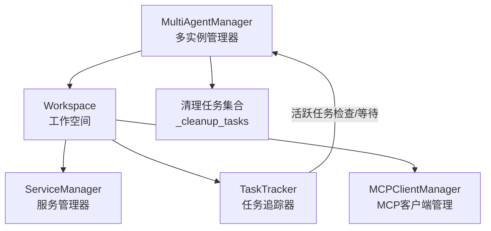
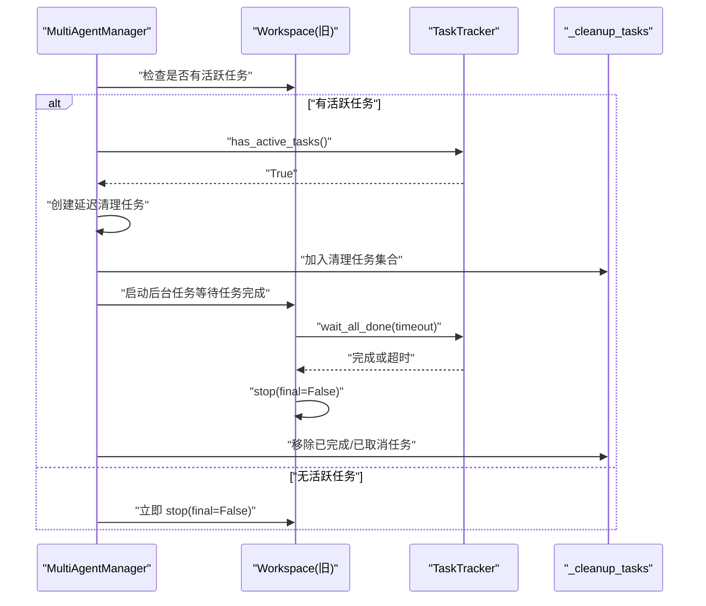
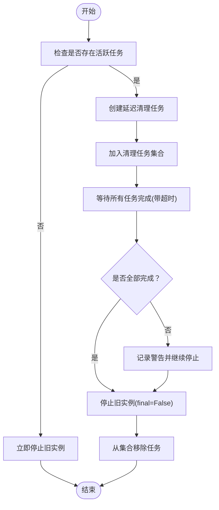
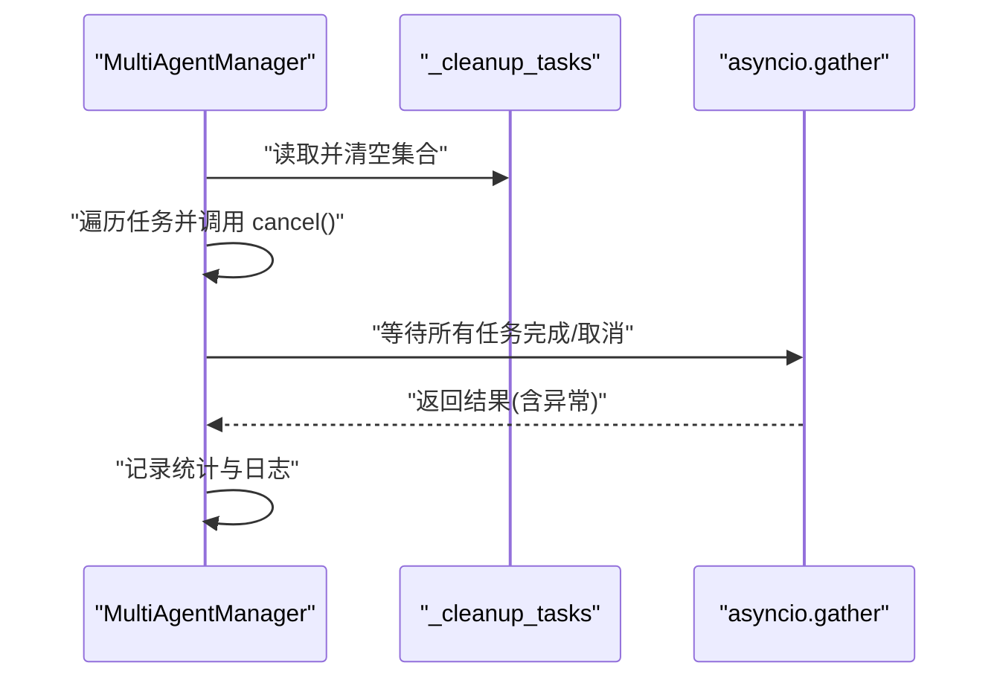
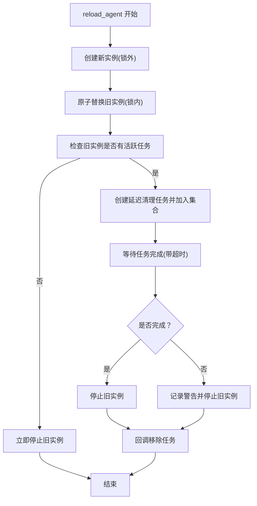
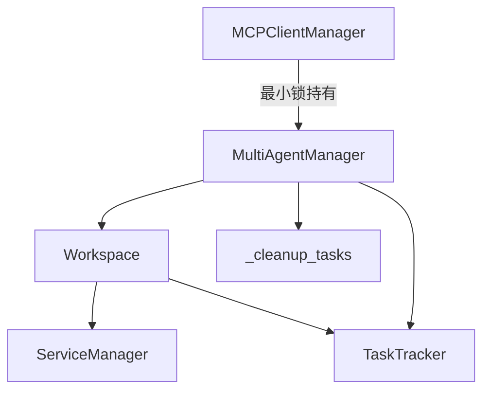

# 资源管理

<cite>
**本文引用的文件**
- [multi_agent_manager.py](file://src/copaw/app/multi_agent_manager.py)
- [task_tracker.py](file://src/copaw/app/runner/task_tracker.py)
- [workspace.py](file://src/copaw/app/workspace/workspace.py)
- [service_manager.py](file://src/copaw/app/workspace/service_manager.py)
- [manager.py](file://src/copaw/app/mcp/manager.py)
- [resource_abuse.yaml](file://src/copaw/security/skill_scanner/rules/signatures/resource_abuse.yaml)
- [download_task_store.py](file://src/copaw/app/download_task_store.py)
</cite>

## 目录
1. [简介](#简介)
2. [项目结构](#项目结构)
3. [核心组件](#核心组件)
4. [架构总览](#架构总览)
5. [详细组件分析](#详细组件分析)
6. [依赖关系分析](#依赖关系分析)
7. [性能考量](#性能考量)
8. [故障排查指南](#故障排查指南)
9. [结论](#结论)
10. [附录](#附录)

## 简介
本文件聚焦于CoPaw的资源管理（Resource Management），围绕以下目标展开：
- 深入解释清理任务集合（_cleanup_tasks）的管理机制，包括后台清理任务的创建、跟踪与生命周期控制
- 详解cancel_all_cleanup_tasks方法的实现：任务取消、异常收集与完成等待策略
- 阐述资源回收的优先级与顺序：活跃任务优先处理、超时强制清理与优雅退出机制
- 提供资源使用统计与内存监控的可视化思路与最佳实践
- 包含资源泄漏检测、清理任务监控与性能影响评估
- 涉及资源池管理、连接复用与内存优化的最佳实践

## 项目结构
CoPaw采用“工作空间（Workspace）+ 多实例管理器（MultiAgentManager）+ 任务追踪（TaskTracker）”的分层架构，配合服务管理器（ServiceManager）进行组件生命周期编排。关键路径如下：
- 工作空间封装了Runner、ChannelManager、MemoryManager、MCPClientManager、CronManager等组件
- 多实例管理器负责懒加载、热重载与旧实例的延迟清理
- 任务追踪器用于跟踪运行中的流式任务，支持等待全部完成与主动取消
- 服务管理器定义组件的注册、启动/停止顺序与可复用性

**图示来源**
- [multi_agent_manager.py:17-32](file://src/copaw/app/multi_agent_manager.py#L17-L32)
- [workspace.py:39-122](file://src/copaw/app/workspace/workspace.py#L39-L122)
- [service_manager.py:74-159](file://src/copaw/app/workspace/service_manager.py#L74-L159)
- [task_tracker.py:30-98](file://src/copaw/app/runner/task_tracker.py#L30-L98)

**章节来源**
- [multi_agent_manager.py:17-32](file://src/copaw/app/multi_agent_manager.py#L17-L32)
- [workspace.py:39-122](file://src/copaw/app/workspace/workspace.py#L39-L122)
- [service_manager.py:74-159](file://src/copaw/app/workspace/service_manager.py#L74-L159)
- [task_tracker.py:30-98](file://src/copaw/app/runner/task_tracker.py#L30-L98)

## 核心组件
- 多实例管理器（MultiAgentManager）
  - 维护agent_id到Workspace的映射
  - 提供懒加载、热重载、停止与全局关闭能力
  - 内部维护清理任务集合（_cleanup_tasks），用于跟踪延迟清理任务
- 工作空间（Workspace）
  - 封装Runner、ChannelManager、MemoryManager、MCPClientManager、CronManager等
  - 通过ServiceManager统一注册与生命周期管理
  - 暴露TaskTracker用于追踪活跃任务
- 任务追踪器（TaskTracker）
  - 记录每个run_key对应的运行状态、队列与事件缓冲
  - 支持查询活跃任务、等待所有任务完成、请求停止
- 服务管理器（ServiceManager）
  - 基于ServiceDescriptor声明式注册组件
  - 定义启动/停止优先级、并发初始化、可复用组件传递
- MCP客户端管理器（MCPClientManager）
  - 连接新客户端在锁外进行，交换与关闭旧客户端在锁内，最小化锁持有时间

**章节来源**
- [multi_agent_manager.py:17-32](file://src/copaw/app/multi_agent_manager.py#L17-L32)
- [workspace.py:39-122](file://src/copaw/app/workspace/workspace.py#L39-L122)
- [task_tracker.py:30-98](file://src/copaw/app/runner/task_tracker.py#L30-L98)
- [service_manager.py:74-159](file://src/copaw/app/workspace/service_manager.py#L74-L159)
- [manager.py:78-108](file://src/copaw/app/mcp/manager.py#L78-L108)

## 架构总览
下图展示了零停机热重载过程中，旧实例的延迟清理流程与清理任务集合的管理：

**图示来源**
- [multi_agent_manager.py:83-178](file://src/copaw/app/multi_agent_manager.py#L83-L178)
- [task_tracker.py:79-98](file://src/copaw/app/runner/task_tracker.py#L79-L98)

**章节来源**
- [multi_agent_manager.py:83-178](file://src/copaw/app/multi_agent_manager.py#L83-L178)
- [task_tracker.py:79-98](file://src/copaw/app/runner/task_tracker.py#L79-L98)

## 详细组件分析

### 清理任务集合（_cleanup_tasks）管理机制
- 创建与跟踪
  - 当旧实例存在活跃任务时，多实例管理器创建一个后台任务执行延迟清理，并将其加入_set[asyncio.Task]集合
  - 后台任务完成后，通过回调从集合中移除；若被取消或出现异常，记录日志并保持集合一致性
- 生命周期控制
  - 延迟清理任务内部调用TaskTracker.wait_all_done(timeout)，默认等待约5分钟
  - 若等待期间所有任务完成，则直接停止旧实例；否则记录警告并继续停止
- 优雅退出与异常处理
  - 任何异常都会被记录，但不会中断新实例的服务
  - 回调函数确保即使出现异常也能从集合中移除任务，避免悬挂引用

**图示来源**
- [multi_agent_manager.py:83-178](file://src/copaw/app/multi_agent_manager.py#L83-L178)
- [task_tracker.py:79-98](file://src/copaw/app/runner/task_tracker.py#L79-L98)

**章节来源**
- [multi_agent_manager.py:83-178](file://src/copaw/app/multi_agent_manager.py#L83-L178)
- [task_tracker.py:79-98](file://src/copaw/app/runner/task_tracker.py#L79-L98)

### cancel_all_cleanup_tasks 方法实现
- 目标
  - 在应用关闭前，取消并等待所有待处理的延迟清理任务，确保无孤儿任务
- 实现要点
  - 若集合为空则直接返回
  - 将集合转为列表并清空，随后对未完成的任务调用cancel()
  - 使用asyncio.gather(*tasks, return_exceptions=True)等待所有任务完成或取消，收集异常
  - 记录完成/取消统计信息
- 异常与完成等待策略
  - return_exceptions=True确保gather不会因单个任务异常而抛出
  - 对每个任务的异常通过回调或gather结果收集，便于审计与监控

**图示来源**
- [multi_agent_manager.py:313-336](file://src/copaw/app/multi_agent_manager.py#L313-L336)

**章节来源**
- [multi_agent_manager.py:313-336](file://src/copaw/app/multi_agent_manager.py#L313-L336)

### 资源回收优先级与顺序
- 活跃任务优先处理
  - 通过TaskTracker.has_active_tasks()与list_active_tasks()识别并记录活跃任务数量与键值
  - 对存在活跃任务的旧实例，优先安排延迟清理，保证流式任务不被中断
- 超时强制清理
  - wait_all_done(timeout)默认约5分钟；超时后仍会停止旧实例，避免无限等待
- 优雅退出机制
  - 延迟清理任务内部捕获异常并记录，不影响新实例继续服务
  - 回调函数确保任务从集合中移除，防止悬挂

**图示来源**
- [multi_agent_manager.py:200-311](file://src/copaw/app/multi_agent_manager.py#L200-L311)
- [task_tracker.py:79-98](file://src/copaw/app/runner/task_tracker.py#L79-L98)

**章节来源**
- [multi_agent_manager.py:200-311](file://src/copaw/app/multi_agent_manager.py#L200-L311)
- [task_tracker.py:79-98](file://src/copaw/app/runner/task_tracker.py#L79-L98)

### 资源池管理、连接复用与内存优化最佳实践
- 连接复用与最小锁持有时间
  - 新客户端连接在锁外进行，交换与关闭旧客户端在锁内，降低阻塞时间
- 可复用组件传递
  - 通过ServiceManager.get_reusable_services()与set_reusable_components()在热重载时传递可复用组件（如MemoryManager、ChatManager），减少重建成本
- 流式任务与事件缓冲
  - TaskTracker为每个run_key维护队列与缓冲，断连重连可回放事件，避免重复创建与数据丢失
- 下载任务清理
  - 提供取消与清理已完成/失败/取消任务的能力，避免任务表膨胀

**章节来源**
- [manager.py:78-108](file://src/copaw/app/mcp/manager.py#L78-L108)
- [service_manager.py:146-156](file://src/copaw/app/workspace/service_manager.py#L146-L156)
- [workspace.py:279-310](file://src/copaw/app/workspace/workspace.py#L279-L310)
- [task_tracker.py:99-231](file://src/copaw/app/runner/task_tracker.py#L99-L231)
- [download_task_store.py:96-130](file://src/copaw/app/download_task_store.py#L96-L130)

## 依赖关系分析
- 多实例管理器依赖工作空间与任务追踪器
- 工作空间通过服务管理器注册与启动各组件
- MCP客户端管理器在连接新客户端时遵循最小锁持有原则
- 清理任务集合作为多实例管理器的后台任务容器，与延迟清理流程强耦合

**图示来源**
- [multi_agent_manager.py:17-32](file://src/copaw/app/multi_agent_manager.py#L17-L32)
- [workspace.py:39-122](file://src/copaw/app/workspace/workspace.py#L39-L122)
- [service_manager.py:74-159](file://src/copaw/app/workspace/service_manager.py#L74-L159)
- [task_tracker.py:30-98](file://src/copaw/app/runner/task_tracker.py#L30-L98)
- [manager.py:78-108](file://src/copaw/app/mcp/manager.py#L78-L108)

**章节来源**
- [multi_agent_manager.py:17-32](file://src/copaw/app/multi_agent_manager.py#L17-L32)
- [workspace.py:39-122](file://src/copaw/app/workspace/workspace.py#L39-L122)
- [service_manager.py:74-159](file://src/copaw/app/workspace/service_manager.py#L74-L159)
- [task_tracker.py:30-98](file://src/copaw/app/runner/task_tracker.py#L30-L98)
- [manager.py:78-108](file://src/copaw/app/mcp/manager.py#L78-L108)

## 性能考量
- 锁持有时间最小化
  - 热重载时，新实例的启动与连接在锁外进行，仅在原子替换阶段短暂持有锁
- 并发初始化与优先级
  - 服务管理器按优先级分组启动，部分组件支持并发初始化，缩短启动时间
- 事件缓冲与断连重连
  - TaskTracker的缓冲与队列机制减少重复数据传输，提升流式任务的稳定性
- 资源回收与内存占用
  - 延迟清理避免长时间占用资源；超时强制停止防止资源泄漏累积

[本节为通用性能讨论，无需列出具体文件来源]

## 故障排查指南
- 常见问题与定位
  - 延迟清理任务未完成：检查活跃任务列表与等待超时设置
  - 旧实例停止失败：查看回调日志中的异常信息
  - 关闭时仍有挂起任务：确认是否调用了cancel_all_cleanup_tasks
- 监控建议
  - 记录清理任务集合大小变化与异常数
  - 监控TaskTracker活跃任务数量与等待耗时
  - 观察热重载前后旧实例停止与新实例启动的时间差
- 安全与资源滥用检测
  - 使用安全扫描规则检测潜在的资源滥用模式（如无限循环、大内存分配）

**章节来源**
- [multi_agent_manager.py:141-156](file://src/copaw/app/multi_agent_manager.py#L141-L156)
- [task_tracker.py:79-98](file://src/copaw/app/runner/task_tracker.py#L79-L98)
- [resource_abuse.yaml:1-39](file://src/copaw/security/skill_scanner/rules/signatures/resource_abuse.yaml#L1-L39)

## 结论
CoPaw通过“工作空间 + 多实例管理器 + 任务追踪器”的组合，实现了高可用的零停机热重载与稳健的资源回收机制。清理任务集合（_cleanup_tasks）与TaskTracker共同保障了活跃任务的优先处理与优雅退出；最小锁持有与可复用组件传递进一步提升了性能与稳定性。结合监控与安全扫描，可有效预防资源泄漏与性能退化。

[本节为总结性内容，无需列出具体文件来源]

## 附录
- 资源使用统计与内存监控图表（建议）
  - 趋势图：活跃任务数、清理任务集合规模、平均等待时长
  - 柱状图：热重载次数、旧实例停止耗时分布
  - 折线图：TaskTracker缓冲长度、队列积压情况
- 最佳实践清单
  - 为长耗时任务设置合理超时与重试
  - 使用可复用组件减少重建开销
  - 定期清理已完成/失败/取消的任务
  - 在锁外执行耗时操作，仅在必要时持有锁

[本节为概念性内容，无需列出具体文件来源]