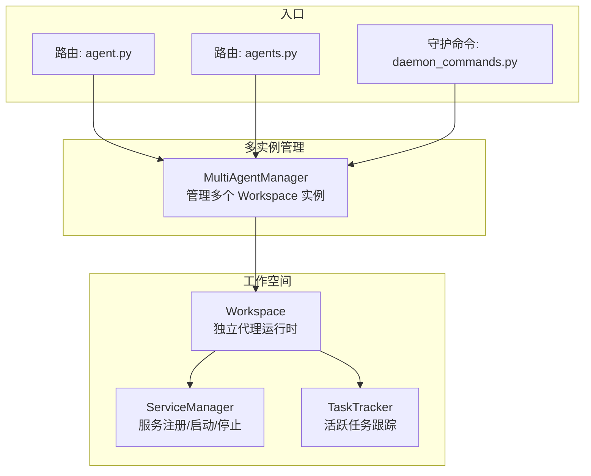
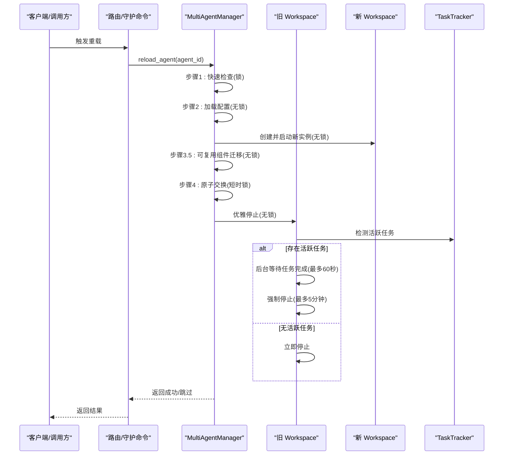
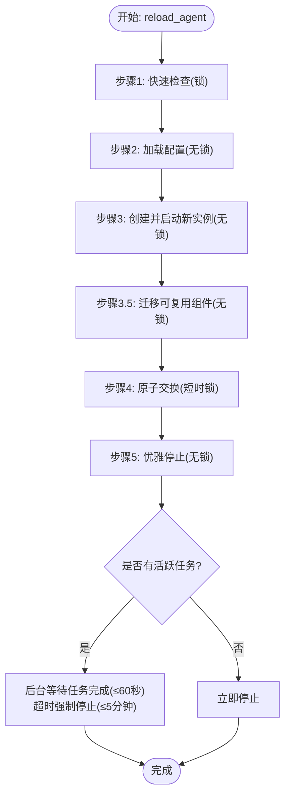
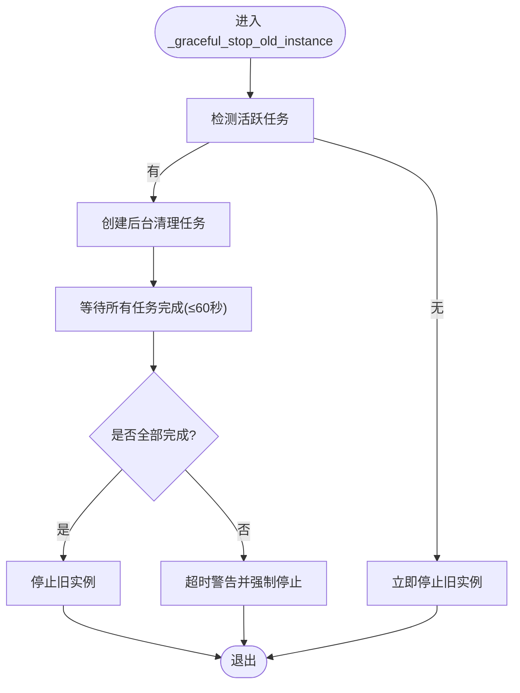
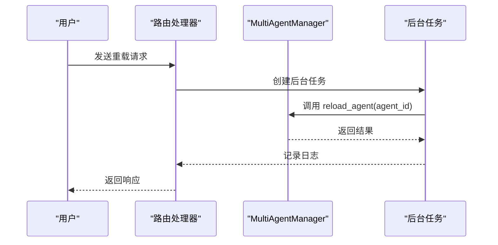
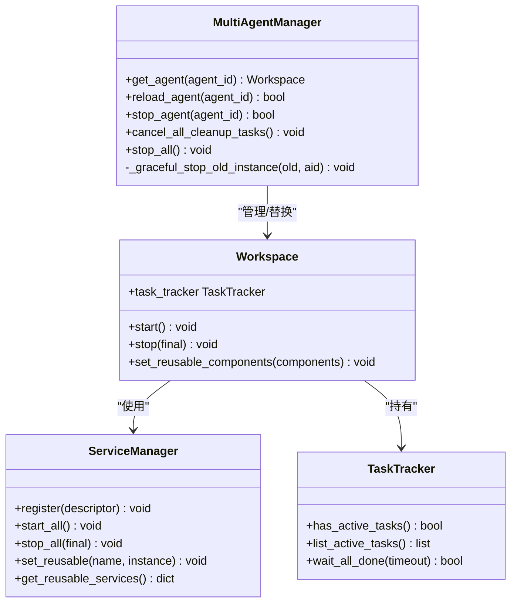
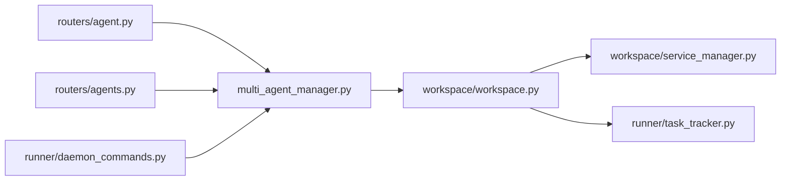

# 零停机重载

<cite>
**本文引用的文件**
- [multi_agent_manager.py](file://src/copaw/app/multi_agent_manager.py)
- [workspace.py](file://src/copaw/app/workspace/workspace.py)
- [service_manager.py](file://src/copaw/app/workspace/service_manager.py)
- [task_tracker.py](file://src/copaw/app/runner/task_tracker.py)
- [agent.py](file://src/copaw/app/routers/agent.py)
- [agents.py](file://src/copaw/app/routers/agents.py)
- [daemon_commands.py](file://src/copaw/app/runner/daemon_commands.py)
</cite>

## 目录
1. [简介](#简介)
2. [项目结构](#项目结构)
3. [核心组件](#核心组件)
4. [架构总览](#架构总览)
5. [详细组件分析](#详细组件分析)
6. [依赖分析](#依赖分析)
7. [性能考虑](#性能考虑)
8. [故障排查指南](#故障排查指南)
9. [结论](#结论)

## 简介
本文件系统化阐述 CoPaw 的零停机重载（Zero-Downtime Reload）能力，围绕 MultiAgentManager.reload_agent 方法的原子性交换机制展开，覆盖以下主题：
- 新旧实例的并行创建与最小化锁定时间
- 原子交换与无缝切换策略
- 延迟清理任务：活跃任务检测、后台调度与超时处理
- 零停机重载五步流程：实例检查、配置加载、新实例创建、原子交换、优雅停止
- 状态转换与时序图
- 错误恢复、资源清理与异常处理
- 性能优化与并发控制最佳实践

## 项目结构
与零停机重载直接相关的核心模块如下：
- 多实例管理器：负责实例生命周期与热重载
- 工作空间：封装单个代理的完整运行时环境
- 服务管理器：统一注册、启动/停止与可复用组件传递
- 任务追踪器：用于检测活跃任务与等待其完成
- 路由器与守护命令：触发重载的入口

**图表来源**
- [multi_agent_manager.py:17-32](file://src/copaw/app/multi_agent_manager.py#L17-L32)
- [workspace.py:39-115](file://src/copaw/app/workspace/workspace.py#L39-L115)
- [service_manager.py:74-105](file://src/copaw/app/workspace/service_manager.py#L74-L105)
- [task_tracker.py:30-45](file://src/copaw/app/runner/task_tracker.py#L30-L45)
- [agent.py:466-477](file://src/copaw/app/routers/agent.py#L466-L477)
- [agents.py:305-313](file://src/copaw/app/routers/agents.py#L305-L313)
- [daemon_commands.py:126-150](file://src/copaw/app/runner/daemon_commands.py#L126-L150)

**章节来源**
- [multi_agent_manager.py:17-32](file://src/copaw/app/multi_agent_manager.py#L17-L32)
- [workspace.py:39-115](file://src/copaw/app/workspace/workspace.py#L39-L115)
- [service_manager.py:74-105](file://src/copaw/app/workspace/service_manager.py#L74-L105)
- [task_tracker.py:30-45](file://src/copaw/app/runner/task_tracker.py#L30-L45)
- [agent.py:466-477](file://src/copaw/app/routers/agent.py#L466-L477)
- [agents.py:305-313](file://src/copaw/app/routers/agents.py#L305-L313)
- [daemon_commands.py:126-150](file://src/copaw/app/runner/daemon_commands.py#L126-L150)

## 核心组件
- MultiAgentManager：集中管理多个 Workspace 实例，提供懒加载、生命周期管理与热重载；在 reload_agent 中实现零停机重载。
- Workspace：单个代理的完整运行时，包含 Runner、ChannelManager、MemoryManager、MCPClientManager、CronManager 等；支持可复用组件传递。
- ServiceManager：统一的服务注册、启动/停止与可复用组件传递；在热重载中将旧实例的可复用组件注入新实例。
- TaskTracker：跟踪活跃任务，提供活跃检测、等待全部完成与超时控制。

**章节来源**
- [multi_agent_manager.py:17-32](file://src/copaw/app/multi_agent_manager.py#L17-L32)
- [workspace.py:39-115](file://src/copaw/app/workspace/workspace.py#L39-L115)
- [service_manager.py:74-105](file://src/copaw/app/workspace/service_manager.py#L74-L105)
- [task_tracker.py:30-45](file://src/copaw/app/runner/task_tracker.py#L30-L45)

## 架构总览
零停机重载通过“先创建新实例、再原子替换、最后优雅停止”的策略，确保请求不中断、流式任务不断开、其他代理不受影响。

**图表来源**
- [multi_agent_manager.py:200-311](file://src/copaw/app/multi_agent_manager.py#L200-L311)
- [workspace.py:311-357](file://src/copaw/app/workspace/workspace.py#L311-L357)
- [task_tracker.py:79-97](file://src/copaw/app/runner/task_tracker.py#L79-L97)
- [daemon_commands.py:126-150](file://src/copaw/app/runner/daemon_commands.py#L126-L150)
- [agent.py:466-477](file://src/copaw/app/routers/agent.py#L466-L477)
- [agents.py:305-313](file://src/copaw/app/routers/agents.py#L305-L313)

## 详细组件分析

### reload_agent 方法与原子交换机制
- 实例检查：仅在必要时获取锁进行存在性检查，避免阻塞其他操作。
- 配置加载：在无锁状态下加载最新配置，减少对其他代理的影响。
- 新实例创建：在无锁状态下创建并启动新 Workspace，这是耗时步骤但不影响其他代理。
- 可复用组件迁移：在无锁状态下从旧实例提取可复用组件并注入新实例，降低重启成本。
- 原子交换：仅在短时持有锁的情况下进行字典替换，保证切换瞬间的原子性。
- 优雅停止：释放锁后对旧实例进行优雅停止，依据是否存在活跃任务决定立即停止或延迟清理。

**图表来源**
- [multi_agent_manager.py:200-311](file://src/copaw/app/multi_agent_manager.py#L200-L311)
- [task_tracker.py:79-97](file://src/copaw/app/runner/task_tracker.py#L79-L97)

**章节来源**
- [multi_agent_manager.py:200-311](file://src/copaw/app/multi_agent_manager.py#L200-L311)

### 延迟清理任务与活跃任务检测
- 活跃任务检测：通过 TaskTracker.has_active_tasks 判断是否存在未完成的任务。
- 后台清理调度：若存在活跃任务，则创建后台任务等待任务完成；使用 wait_all_done 设置超时（默认 300 秒），并在超时后记录警告。
- 超时处理：后台等待阶段超时后，记录警告并继续执行强制停止，确保不会无限期挂起。
- 完成回调：清理任务完成后从跟踪集合中移除，并记录取消或异常信息，避免泄漏。

**图表来源**
- [multi_agent_manager.py:83-178](file://src/copaw/app/multi_agent_manager.py#L83-L178)
- [task_tracker.py:79-97](file://src/copaw/app/runner/task_tracker.py#L79-L97)

**章节来源**
- [multi_agent_manager.py:83-178](file://src/copaw/app/multi_agent_manager.py#L83-L178)
- [task_tracker.py:79-97](file://src/copaw/app/runner/task_tracker.py#L79-L97)

### 零停机重载五步流程详解
- 步骤1：实例检查（短时锁）
  - 仅判断目标实例是否存在，避免阻塞其他代理。
- 步骤2：配置加载（无锁）
  - 重新加载配置，确保新实例基于最新配置启动。
- 步骤3：新实例创建（无锁）
  - 创建并启动新的 Workspace，这是耗时步骤但不阻塞其他代理。
- 步骤3.5：可复用组件迁移（无锁）
  - 将旧实例中的可复用组件（如内存管理器、聊天管理器等）迁移到新实例，减少重启成本。
- 步骤4：原子交换（短时锁）
  - 在极短时间内持有锁，完成旧/新实例的替换，确保切换原子性。
- 步骤5：优雅停止（无锁）
  - 释放锁后对旧实例进行优雅停止：若有活跃任务则后台等待并超时强制停止；若无活跃任务则立即停止。

**章节来源**
- [multi_agent_manager.py:226-311](file://src/copaw/app/multi_agent_manager.py#L226-L311)
- [workspace.py:279-310](file://src/copaw/app/workspace/workspace.py#L279-L310)

### 触发入口与调用链
- 路由器触发：在多个路由中异步触发后台重载，避免阻塞请求处理。
- 守护命令触发：在交互式会话中通过 /daemon restart 触发零停机重载。

**图表来源**
- [agent.py:466-477](file://src/copaw/app/routers/agent.py#L466-L477)
- [agents.py:305-313](file://src/copaw/app/routers/agents.py#L305-L313)
- [daemon_commands.py:126-150](file://src/copaw/app/runner/daemon_commands.py#L126-L150)
- [multi_agent_manager.py:200-311](file://src/copaw/app/multi_agent_manager.py#L200-L311)

**章节来源**
- [agent.py:466-477](file://src/copaw/app/routers/agent.py#L466-L477)
- [agents.py:305-313](file://src/copaw/app/routers/agents.py#L305-L313)
- [daemon_commands.py:126-150](file://src/copaw/app/runner/daemon_commands.py#L126-L150)

### 类关系与职责

**图表来源**
- [multi_agent_manager.py:17-32](file://src/copaw/app/multi_agent_manager.py#L17-L32)
- [workspace.py:39-115](file://src/copaw/app/workspace/workspace.py#L39-L115)
- [service_manager.py:74-105](file://src/copaw/app/workspace/service_manager.py#L74-L105)
- [task_tracker.py:30-45](file://src/copaw/app/runner/task_tracker.py#L30-L45)

**章节来源**
- [multi_agent_manager.py:17-32](file://src/copaw/app/multi_agent_manager.py#L17-L32)
- [workspace.py:39-115](file://src/copaw/app/workspace/workspace.py#L39-L115)
- [service_manager.py:74-105](file://src/copaw/app/workspace/service_manager.py#L74-L105)
- [task_tracker.py:30-45](file://src/copaw/app/runner/task_tracker.py#L30-L45)

## 依赖分析
- MultiAgentManager 依赖 Workspace 与 TaskTracker，用于实例替换与活跃任务检测。
- Workspace 依赖 ServiceManager 与 TaskTracker，前者负责服务生命周期，后者负责任务追踪。
- 路由器与守护命令作为外部触发点，最终调用 MultiAgentManager 的 reload_agent。

**图表来源**
- [agent.py:466-477](file://src/copaw/app/routers/agent.py#L466-L477)
- [agents.py:305-313](file://src/copaw/app/routers/agents.py#L305-L313)
- [daemon_commands.py:126-150](file://src/copaw/app/runner/daemon_commands.py#L126-L150)
- [multi_agent_manager.py:200-311](file://src/copaw/app/multi_agent_manager.py#L200-L311)
- [workspace.py:311-357](file://src/copaw/app/workspace/workspace.py#L311-L357)
- [service_manager.py:171-200](file://src/copaw/app/workspace/service_manager.py#L171-L200)
- [task_tracker.py:79-97](file://src/copaw/app/runner/task_tracker.py#L79-L97)

**章节来源**
- [agent.py:466-477](file://src/copaw/app/routers/agent.py#L466-L477)
- [agents.py:305-313](file://src/copaw/app/routers/agents.py#L305-L313)
- [daemon_commands.py:126-150](file://src/copaw/app/runner/daemon_commands.py#L126-L150)
- [multi_agent_manager.py:200-311](file://src/copaw/app/multi_agent_manager.py#L200-L311)
- [workspace.py:311-357](file://src/copaw/app/workspace/workspace.py#L311-L357)
- [service_manager.py:171-200](file://src/copaw/app/workspace/service_manager.py#L171-L200)
- [task_tracker.py:79-97](file://src/copaw/app/runner/task_tracker.py#L79-L97)

## 性能考虑
- 最小化锁定时间：仅在原子交换阶段持有锁，其余步骤均在无锁状态下执行，显著降低对其他代理的影响。
- 并行化：新实例创建与配置加载在无锁下进行，避免阻塞其他代理的请求。
- 可复用组件：通过 ServiceManager 的可复用能力减少重启成本，提升热重载效率。
- 超时与背压：TaskTracker 提供等待与超时控制，防止长时间阻塞导致资源泄漏。
- 并发清理：延迟清理任务采用后台任务并跟踪，避免主线程负担。

[本节为通用性能建议，无需特定文件来源]

## 故障排查指南
- 新实例启动失败
  - 现象：新实例创建或启动抛出异常，旧实例继续提供服务。
  - 处理：记录异常并尝试停止新实例，返回失败；检查配置与依赖。
  - 参考路径：[multi_agent_manager.py:274-288](file://src/copaw/app/multi_agent_manager.py#L274-L288)
- 原子交换期间实例被删除
  - 现象：交换前发现实例已被移除，停止新实例并返回失败。
  - 处理：确认并发删除与重载的竞态条件，必要时增加幂等检查。
  - 参考路径：[multi_agent_manager.py:292-300](file://src/copaw/app/multi_agent_manager.py#L292-L300)
- 延迟清理任务异常或取消
  - 现象：后台清理任务被取消或抛出异常，但不影响新实例运行。
  - 处理：检查任务回调与异常日志，确保清理任务最终完成或被取消。
  - 参考路径：[multi_agent_manager.py:141-155](file://src/copaw/app/multi_agent_manager.py#L141-L155)
- 超时未完成的任务
  - 现象：等待活跃任务完成超时，记录警告并强制停止。
  - 处理：检查任务是否卡死或阻塞，优化任务逻辑或缩短任务时长。
  - 参考路径：[task_tracker.py:79-97](file://src/copaw/app/runner/task_tracker.py#L79-L97)
- 触发入口无效
  - 现象：非应用内环境触发 /daemon restart，返回提示信息。
  - 处理：在应用内使用 /daemon restart 或通过进程管理工具重启。
  - 参考路径：[daemon_commands.py:145-150](file://src/copaw/app/runner/daemon_commands.py#L145-L150)

**章节来源**
- [multi_agent_manager.py:274-300](file://src/copaw/app/multi_agent_manager.py#L274-L300)
- [task_tracker.py:79-97](file://src/copaw/app/runner/task_tracker.py#L79-L97)
- [daemon_commands.py:145-150](file://src/copaw/app/runner/daemon_commands.py#L145-L150)

## 结论
CoPaw 的零停机重载通过“无锁创建新实例 + 短时锁原子交换 + 优雅停止”的设计，在保证请求不中断的同时，最大化减少对其他代理的影响。配合活跃任务检测与延迟清理机制，系统能够在复杂场景下安全、可控地完成热重载。建议在生产环境中结合监控与告警，持续观察重载过程中的活跃任务分布与清理耗时，以进一步优化性能与稳定性。