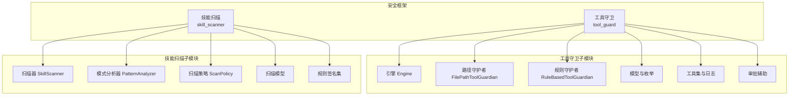
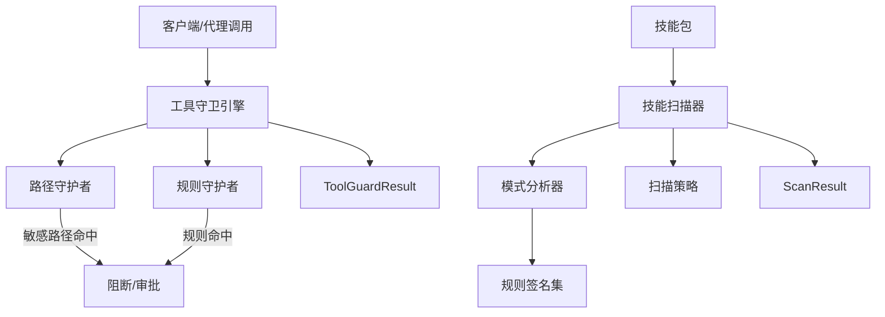
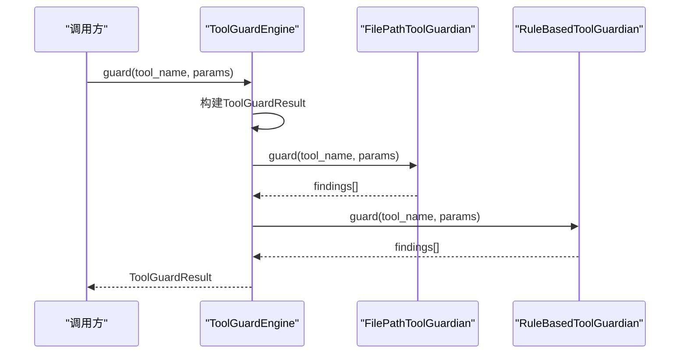
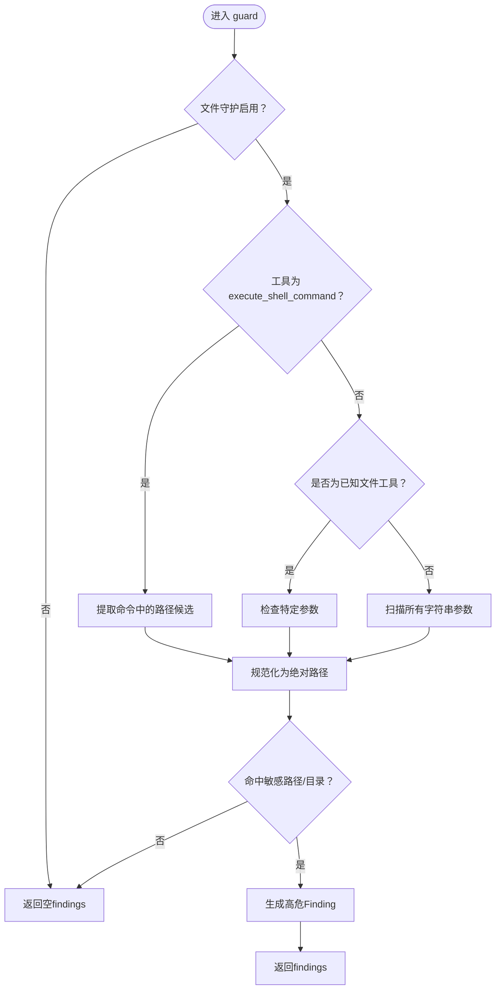
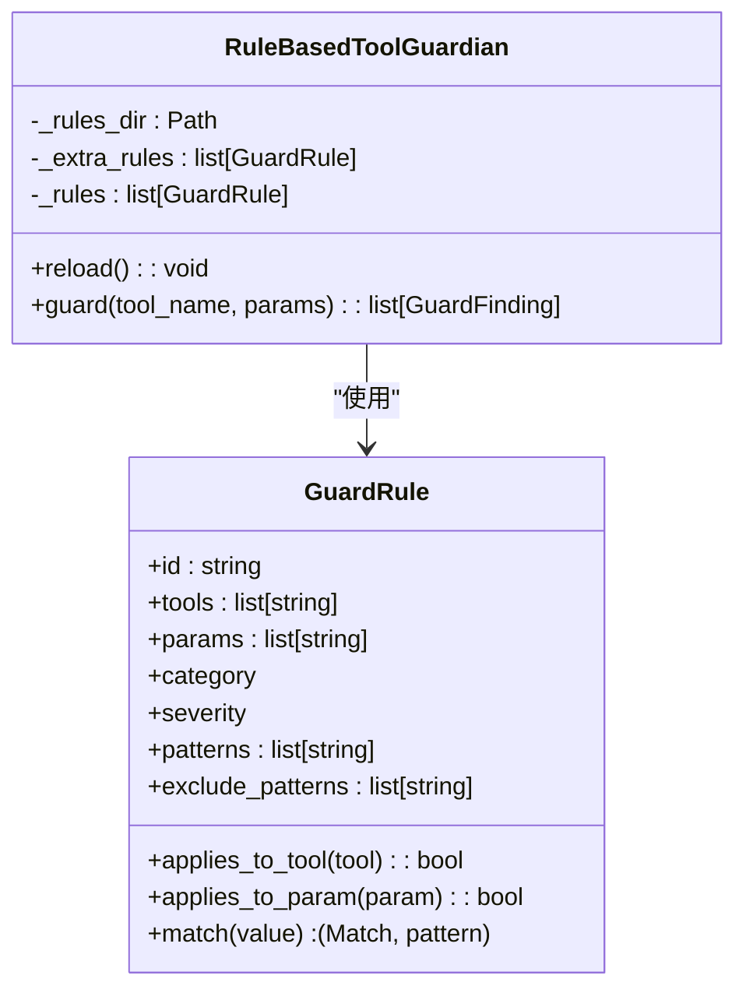
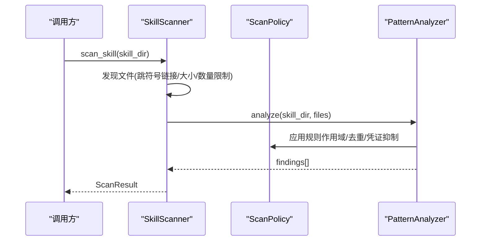
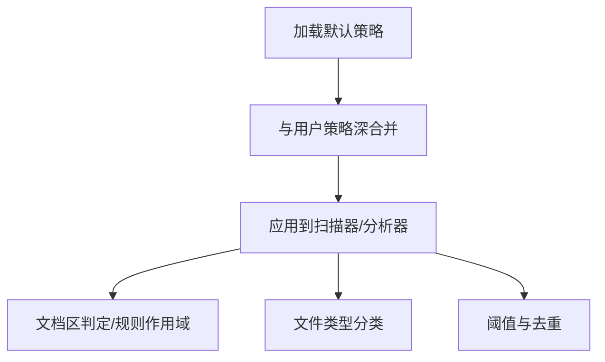
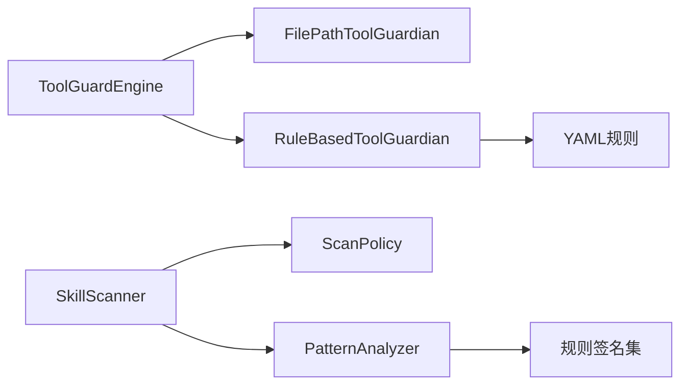

# 安全防护引擎

<cite>
**本文引用的文件**
- [src/copaw/security/__init__.py](file://src/copaw/security/__init__.py)
- [src/copaw/security/tool_guard/engine.py](file://src/copaw/security/tool_guard/engine.py)
- [src/copaw/security/tool_guard/guardians/file_guardian.py](file://src/copaw/security/tool_guard/guardians/file_guardian.py)
- [src/copaw/security/tool_guard/guardians/rule_guardian.py](file://src/copaw/security/tool_guard/guardians/rule_guardian.py)
- [src/copaw/security/tool_guard/models.py](file://src/copaw/security/tool_guard/models.py)
- [src/copaw/security/tool_guard/utils.py](file://src/copaw/security/tool_guard/utils.py)
- [src/copaw/security/tool_guard/approval.py](file://src/copaw/security/tool_guard/approval.py)
- [src/copaw/security/tool_guard/rules/dangerous_shell_commands.yaml](file://src/copaw/security/tool_guard/rules/dangerous_shell_commands.yaml)
- [src/copaw/security/skill_scanner/scanner.py](file://src/copaw/security/skill_scanner/scanner.py)
- [src/copaw/security/skill_scanner/models.py](file://src/copaw/security/skill_scanner/models.py)
- [src/copaw/security/skill_scanner/scan_policy.py](file://src/copaw/security/skill_scanner/scan_policy.py)
- [src/copaw/security/skill_scanner/analyzers/pattern_analyzer.py](file://src/copaw/security/skill_scanner/analyzers/pattern_analyzer.py)
- [src/copaw/security/skill_scanner/data/default_policy.yaml](file://src/copaw/security/skill_scanner/data/default_policy.yaml)
- [src/copaw/security/skill_scanner/rules/signatures/command_injection.yaml](file://src/copaw/security/skill_scanner/rules/signatures/command_injection.yaml)
- [src/copaw/security/skill_scanner/rules/signatures/data_exfiltration.yaml](file://src/copaw/security/skill_scanner/rules/signatures/data_exfiltration.yaml)
- [src/copaw/app/routers/config.py](file://src/copaw/app/routers/config.py)
- [console/src/api/modules/security.ts](file://console/src/api/modules/security.ts)
- [website/public/docs/security.en.md](file://website/public/docs/security.en.md)
</cite>

## 目录
1. [简介](#简介)
2. [项目结构](#项目结构)
3. [核心组件](#核心组件)
4. [架构总览](#架构总览)
5. [详细组件分析](#详细组件分析)
6. [依赖分析](#依赖分析)
7. [性能考虑](#性能考虑)
8. [故障排查指南](#故障排查指南)
9. [结论](#结论)
10. [附录](#附录)

## 简介
本技术文档面向CoPaw的安全防护引擎，系统化阐述工具守卫（Tool Guard）与技能扫描（Skill Scanner）两大子系统的架构设计、安全策略执行与威胁检测机制。内容覆盖：
- 工具守卫：参数级预执行扫描、敏感路径拦截、规则驱动的危险模式检测、审批与阻断流程。
- 技能扫描：静态签名规则匹配、可插拔分析器、组织化扫描策略（白名单/禁用规则/严重度覆盖）、去重与文档区过滤。
- 访问控制与审计：统一的威胁分类与严重度模型、结构化日志输出、结果聚合与告警。
- 配置与定制：环境变量优先级、配置文件解析、运行时规则热加载、Console端可视化管理。

## 项目结构
安全相关代码主要位于src/copaw/security目录下，分为两大部分：
- tool_guard：工具调用前的参数扫描与阻断，包含引擎、守护者（路径/规则）、模型、工具集与审批辅助。
- skill_scanner：技能包安装/激活前的静态安全扫描，包含扫描器、分析器、策略、模型与默认规则集。

图表来源
- [src/copaw/security/__init__.py:1-17](file://src/copaw/security/__init__.py#L1-L17)
- [src/copaw/security/tool_guard/engine.py:53-238](file://src/copaw/security/tool_guard/engine.py#L53-L238)
- [src/copaw/security/tool_guard/guardians/file_guardian.py:161-342](file://src/copaw/security/tool_guard/guardians/file_guardian.py#L161-L342)
- [src/copaw/security/tool_guard/guardians/rule_guardian.py:280-383](file://src/copaw/security/tool_guard/guardians/rule_guardian.py#L280-L383)
- [src/copaw/security/tool_guard/models.py:1-185](file://src/copaw/security/tool_guard/models.py#L1-L185)
- [src/copaw/security/tool_guard/utils.py:1-163](file://src/copaw/security/tool_guard/utils.py#L1-L163)
- [src/copaw/security/tool_guard/approval.py:1-38](file://src/copaw/security/tool_guard/approval.py#L1-L38)
- [src/copaw/security/skill_scanner/scanner.py:76-319](file://src/copaw/security/skill_scanner/scanner.py#L76-L319)
- [src/copaw/security/skill_scanner/analyzers/pattern_analyzer.py:236-393](file://src/copaw/security/skill_scanner/analyzers/pattern_analyzer.py#L236-L393)
- [src/copaw/security/skill_scanner/scan_policy.py:156-476](file://src/copaw/security/skill_scanner/scan_policy.py#L156-L476)
- [src/copaw/security/skill_scanner/models.py:1-235](file://src/copaw/security/skill_scanner/models.py#L1-L235)

章节来源
- [src/copaw/security/__init__.py:1-17](file://src/copaw/security/__init__.py#L1-L17)

## 核心组件
- 工具守卫引擎（ToolGuardEngine）
  - 负责编排所有已注册守护者，聚合结果并生成ToolGuardResult；支持按需仅运行“始终运行”的守护者；支持运行时规则热加载与受控范围（受保护工具集/禁止工具集）。
- 路径守护者（FilePathToolGuardian）
  - 基于配置的敏感路径列表进行拦截；对execute_shell_command提取重定向目标；对已知文件工具检查特定参数；对其他工具扫描字符串参数中的疑似路径。
- 规则守护者（RuleBasedToolGuardian）
  - 加载YAML规则，基于正则匹配工具参数值；支持排除模式、严重度与类别；支持自定义规则与禁用规则合并。
- 模型与枚举（ToolGuard/Scan Models）
  - 统一的威胁分类与严重度模型；Finding/Result数据结构；时间戳与聚合属性。
- 工具集与日志（utils/log_findings）
  - 解析受保护/禁止工具集合；结构化日志输出，区分高危与一般级别。
- 审批辅助（approval）
  - 审批决策枚举；结果摘要格式化，便于前端展示。
- 技能扫描器（SkillScanner）
  - 扫描策略驱动的文件发现与分析；默认使用PatternAnalyzer；支持去重、文档区跳过、代码类规则限定。
- 模式分析器（PatternAnalyzer）
  - 从rules/signatures加载规则签名，逐行与多行匹配；支持文件类型限定、严重度覆盖、测试凭证抑制与去重。
- 扫描策略（ScanPolicy）
  - 组织化策略：隐藏文件白名单、规则作用域、凭证占位符、文件分类、阈值、严重度覆盖、禁用规则等。

章节来源
- [src/copaw/security/tool_guard/engine.py:53-238](file://src/copaw/security/tool_guard/engine.py#L53-L238)
- [src/copaw/security/tool_guard/guardians/file_guardian.py:161-342](file://src/copaw/security/tool_guard/guardians/file_guardian.py#L161-L342)
- [src/copaw/security/tool_guard/guardians/rule_guardian.py:280-383](file://src/copaw/security/tool_guard/guardians/rule_guardian.py#L280-L383)
- [src/copaw/security/tool_guard/models.py:1-185](file://src/copaw/security/tool_guard/models.py#L1-L185)
- [src/copaw/security/tool_guard/utils.py:63-163](file://src/copaw/security/tool_guard/utils.py#L63-L163)
- [src/copaw/security/tool_guard/approval.py:12-38](file://src/copaw/security/tool_guard/approval.py#L12-L38)
- [src/copaw/security/skill_scanner/scanner.py:76-319](file://src/copaw/security/skill_scanner/scanner.py#L76-L319)
- [src/copaw/security/skill_scanner/analyzers/pattern_analyzer.py:236-393](file://src/copaw/security/skill_scanner/analyzers/pattern_analyzer.py#L236-L393)
- [src/copaw/security/skill_scanner/scan_policy.py:156-476](file://src/copaw/security/skill_scanner/scan_policy.py#L156-L476)

## 架构总览
工具守卫与技能扫描在CoPaw中分别承担“运行期”与“安装/激活前”的安全边界，二者通过统一的模型与策略接口协同工作，形成“静态规则 + 动态参数扫描 + 受控范围 + 审批/阻断”的闭环。

图表来源
- [src/copaw/security/tool_guard/engine.py:169-227](file://src/copaw/security/tool_guard/engine.py#L169-L227)
- [src/copaw/security/tool_guard/guardians/file_guardian.py:290-342](file://src/copaw/security/tool_guard/guardians/file_guardian.py#L290-L342)
- [src/copaw/security/tool_guard/guardians/rule_guardian.py:329-383](file://src/copaw/security/tool_guard/guardians/rule_guardian.py#L329-L383)
- [src/copaw/security/skill_scanner/scanner.py:148-242](file://src/copaw/security/skill_scanner/scanner.py#L148-L242)
- [src/copaw/security/skill_scanner/analyzers/pattern_analyzer.py:265-347](file://src/copaw/security/skill_scanner/analyzers/pattern_analyzer.py#L265-L347)

## 详细组件分析

### 工具守卫引擎（ToolGuardEngine）
- 设计要点
  - 单例懒加载，守护者集合可扩展；支持always_run守护者在非受保护工具上执行路径检查。
  - 运行时规则热加载：调用reload_rules触发各守护者reload与工具集刷新。
  - 受控范围解析：guarded_tools/denied_tools由环境变量、配置文件与内置默认值三段式解析。
- 关键流程
  - guard入口：构建ToolGuardResult，遍历守护者执行，收集findings与失败信息，记录耗时。
  - 结果聚合：按严重度排序、统计最高级别、提供按严重度/类别的查询方法。

图表来源
- [src/copaw/security/tool_guard/engine.py:169-227](file://src/copaw/security/tool_guard/engine.py#L169-L227)
- [src/copaw/security/tool_guard/guardians/file_guardian.py:290-342](file://src/copaw/security/tool_guard/guardians/file_guardian.py#L290-L342)
- [src/copaw/security/tool_guard/guardians/rule_guardian.py:329-383](file://src/copaw/security/tool_guard/guardians/rule_guardian.py#L329-L383)

章节来源
- [src/copaw/security/tool_guard/engine.py:53-238](file://src/copaw/security/tool_guard/engine.py#L53-L238)
- [src/copaw/security/tool_guard/utils.py:63-126](file://src/copaw/security/tool_guard/utils.py#L63-L126)

### 路径守护者（FilePathToolGuardian）
- 设计要点
  - 支持配置敏感路径（含目录递归）；对execute_shell_command命令字符串进行安全分词与重定向目标提取；对已知文件工具与通用字符串参数进行启发式路径识别。
  - 命中后生成高危Finding并附带修复建议与元数据（解析后的绝对路径）。
- 关键流程
  - 命令解析：shlex安全切分，处理分离/附加重定向操作符，稳定去重候选路径。
  - 路径判定：规范化为绝对路径，判断是否命中敏感文件或位于敏感目录内。

图表来源
- [src/copaw/security/tool_guard/guardians/file_guardian.py:290-342](file://src/copaw/security/tool_guard/guardians/file_guardian.py#L290-L342)
- [src/copaw/security/tool_guard/guardians/file_guardian.py:111-158](file://src/copaw/security/tool_guard/guardians/file_guardian.py#L111-L158)
- [src/copaw/security/tool_guard/guardians/file_guardian.py:46-51](file://src/copaw/security/tool_guard/guardians/file_guardian.py#L46-L51)

章节来源
- [src/copaw/security/tool_guard/guardians/file_guardian.py:161-342](file://src/copaw/security/tool_guard/guardians/file_guardian.py#L161-L342)

### 规则守护者（RuleBasedToolGuardian）
- 设计要点
  - 从YAML加载规则，支持工具/参数作用域、类别/严重度、正则/排除模式；支持自定义规则与禁用规则合并。
  - 对每个参数值做字符串化扫描，生成带上下文片段的Finding。
- 关键流程
  - 规则加载：内置目录/指定目录/自定义文件；校验与错误降级。
  - 参数扫描：遍历适用规则，匹配后构造Finding并附元数据。

图表来源
- [src/copaw/security/tool_guard/guardians/rule_guardian.py:52-146](file://src/copaw/security/tool_guard/guardians/rule_guardian.py#L52-L146)
- [src/copaw/security/tool_guard/guardians/rule_guardian.py:280-383](file://src/copaw/security/tool_guard/guardians/rule_guardian.py#L280-L383)

章节来源
- [src/copaw/security/tool_guard/guardians/rule_guardian.py:153-232](file://src/copaw/security/tool_guard/guardians/rule_guardian.py#L153-L232)
- [src/copaw/security/tool_guard/guardians/rule_guardian.py:239-273](file://src/copaw/security/tool_guard/guardians/rule_guardian.py#L239-L273)

### 技能扫描器（SkillScanner）
- 设计要点
  - 以策略为驱动：文件发现、分析器执行、去重、汇总；支持跳过文档区、仅代码规则、测试凭证抑制。
  - 默认使用PatternAnalyzer，按文件类型路由规则；支持自定义分析器注册。
- 关键流程
  - 文件发现：递归遍历、跳过符号链接、限制大小与数量、按策略扩展名跳过。
  - 分析器执行：逐个分析器扫描，聚合findings并记录失败。
  - 结果汇总：计算最大严重度、统计数量、序列化输出。

图表来源
- [src/copaw/security/skill_scanner/scanner.py:148-242](file://src/copaw/security/skill_scanner/scanner.py#L148-L242)
- [src/copaw/security/skill_scanner/analyzers/pattern_analyzer.py:265-347](file://src/copaw/security/skill_scanner/analyzers/pattern_analyzer.py#L265-L347)

章节来源
- [src/copaw/security/skill_scanner/scanner.py:76-319](file://src/copaw/security/skill_scanner/scanner.py#L76-L319)
- [src/copaw/security/skill_scanner/analyzers/pattern_analyzer.py:236-393](file://src/copaw/security/skill_scanner/analyzers/pattern_analyzer.py#L236-L393)

### 扫描策略（ScanPolicy）
- 设计要点
  - 分层策略：隐藏文件白名单、规则作用域（仅文档/仅代码/文档区跳过）、文件分类（惰性/结构化/归档/代码）、阈值、严重度覆盖、禁用规则。
  - 支持从默认策略叠加用户自定义策略，提供to_yaml导出能力。
- 关键流程
  - 策略加载：默认策略与用户策略深合并；规则禁用/覆盖生效。
  - 文档区判定：基于路径组件与正则组合，支持长模式长度限制与编译缓存。

图表来源
- [src/copaw/security/skill_scanner/scan_policy.py:261-304](file://src/copaw/security/skill_scanner/scan_policy.py#L261-L304)
- [src/copaw/security/skill_scanner/scan_policy.py:337-397](file://src/copaw/security/skill_scanner/scan_policy.py#L337-L397)

章节来源
- [src/copaw/security/skill_scanner/scan_policy.py:156-476](file://src/copaw/security/skill_scanner/scan_policy.py#L156-L476)

### 数据模型与日志
- 工具守卫模型
  - GuardFinding/ToolGuardResult：统一严重度与威胁类别；提供按严重度/类别筛选与序列化。
- 技能扫描模型
  - Finding/ScanResult：包含文件位置、行号、片段、元数据；提供最大严重度与聚合查询。
- 日志与审批
  - 结构化日志：区分高危与一般级别；审批摘要格式化，便于前端展示。

章节来源
- [src/copaw/security/tool_guard/models.py:25-185](file://src/copaw/security/tool_guard/models.py#L25-L185)
- [src/copaw/security/skill_scanner/models.py:19-235](file://src/copaw/security/skill_scanner/models.py#L19-L235)
- [src/copaw/security/tool_guard/utils.py:128-163](file://src/copaw/security/tool_guard/utils.py#L128-L163)
- [src/copaw/security/tool_guard/approval.py:20-38](file://src/copaw/security/tool_guard/approval.py#L20-L38)

## 依赖分析
- 组件耦合
  - 工具守卫：引擎依赖守护者接口；守护者依赖配置与规则；工具集解析与日志独立。
  - 技能扫描：扫描器依赖策略与分析器；分析器依赖规则签名与策略；模型独立。
- 外部依赖
  - YAML解析、正则编译、文件系统遍历、路径规范化。
- 循环依赖
  - 各模块间通过接口与数据类交互，未见循环导入。

图表来源
- [src/copaw/security/tool_guard/engine.py:25-28](file://src/copaw/security/tool_guard/engine.py#L25-L28)
- [src/copaw/security/tool_guard/guardians/rule_guardian.py:39-44](file://src/copaw/security/tool_guard/guardians/rule_guardian.py#L39-L44)
- [src/copaw/security/skill_scanner/scanner.py:24-27](file://src/copaw/security/skill_scanner/scanner.py#L24-L27)
- [src/copaw/security/skill_scanner/analyzers/pattern_analyzer.py:28-30](file://src/copaw/security/skill_scanner/analyzers/pattern_analyzer.py#L28-L30)

章节来源
- [src/copaw/security/tool_guard/engine.py:53-238](file://src/copaw/security/tool_guard/engine.py#L53-L238)
- [src/copaw/security/skill_scanner/scanner.py:76-319](file://src/copaw/security/skill_scanner/scanner.py#L76-L319)

## 性能考虑
- 工具守卫
  - 正则规则预编译，避免重复编译开销；字符串化扫描成本与参数规模线性相关；建议限制高危工具范围与启用always_run守护者以减少不必要的扫描。
- 技能扫描
  - 文件发现阶段严格限制数量与大小，避免大体积技能包导致内存与IO压力；多行匹配仅针对含换行的模式；去重与凭证抑制降低冗余输出。
- 配置热更新
  - 引擎与守护者均支持reload_rules，确保策略变更即时生效，同时避免频繁重启。

[本节为通用指导，不直接分析具体文件]

## 故障排查指南
- 工具守卫
  - 现象：规则未生效
    - 排查：确认COPAW_TOOL_GUARD_ENABLED/COPAW_TOOL_GUARD_TOOLS/COPAW_TOOL_GUARD_DENIED_TOOLS环境变量；检查config.json中security.tool_guard配置；调用reload_rules。
  - 现象：路径拦截误报
    - 排查：检查security.file_guard.sensitive_files配置；确认路径规范化逻辑与工作空间根目录；必要时调整规则或添加排除。
- 技能扫描
  - 现象：规则过多误报
    - 排查：通过ScanPolicy.disable_rules与severity_overrides降低严重度；调整file_classification与rule_scoping；启用去重。
  - 现象：扫描缓慢
    - 排查：调整file_limits.max_file_count与max_file_size_bytes；减少规则文件数量；优化规则签名长度。
- 审计与日志
  - 使用log_findings输出结构化日志，定位高危级别与规则ID；结合前端审批摘要快速定位问题。

章节来源
- [src/copaw/security/tool_guard/utils.py:63-126](file://src/copaw/security/tool_guard/utils.py#L63-L126)
- [src/copaw/security/tool_guard/engine.py:148-154](file://src/copaw/security/tool_guard/engine.py#L148-L154)
- [src/copaw/security/skill_scanner/scan_policy.py:183-193](file://src/copaw/security/skill_scanner/scan_policy.py#L183-L193)
- [src/copaw/security/tool_guard/utils.py:128-163](file://src/copaw/security/tool_guard/utils.py#L128-L163)

## 结论
CoPaw安全防护引擎通过“工具守卫 + 技能扫描”的双轨机制，在运行期与生命周期早期两个关键节点提供纵深防御。其模块化设计与策略化配置使得组织能够灵活定制安全基线，同时保持高性能与可观测性。建议在生产环境中结合审批流程与审计日志，持续迭代规则与策略，提升整体安全韧性。

[本节为总结性内容，不直接分析具体文件]

## 附录

### 安全策略配置与规则定制
- 工具守卫
  - 受保护工具集：COPAW_TOOL_GUARD_TOOLS（支持*, all, none/off/false/0）；config.json.security.tool_guard.guarded_tools；默认高危工具集。
  - 禁止工具集：COPAW_TOOL_GUARD_DENIED_TOOLS；config.json.security.tool_guard.denied_tools。
  - 规则定制：config.json.security.tool_guard.custom_rules；config.json.security.tool_guard.disabled_rules。
  - 文件守护：config.json.security.file_guard.enabled与sensitive_files；Console端File Guard配置。
- 技能扫描
  - 策略定制：ScanPolicy.from_yaml加载组织策略；to_yaml导出当前策略；覆盖hidden_files、rule_scoping、credentials、file_classification、file_limits、analysis_thresholds、severity_overrides、disabled_rules。
  - 规则签名：rules/signatures目录下的YAML规则；PatternAnalyzer按文件类型路由匹配。

章节来源
- [src/copaw/security/tool_guard/utils.py:63-126](file://src/copaw/security/tool_guard/utils.py#L63-L126)
- [src/copaw/security/tool_guard/rules/dangerous_shell_commands.yaml:1-120](file://src/copaw/security/tool_guard/rules/dangerous_shell_commands.yaml#L1-L120)
- [src/copaw/security/skill_scanner/data/default_policy.yaml:1-245](file://src/copaw/security/skill_scanner/data/default_policy.yaml#L1-L245)
- [src/copaw/security/skill_scanner/rules/signatures/command_injection.yaml:1-195](file://src/copaw/security/skill_scanner/rules/signatures/command_injection.yaml#L1-L195)
- [src/copaw/security/skill_scanner/rules/signatures/data_exfiltration.yaml:1-142](file://src/copaw/security/skill_scanner/rules/signatures/data_exfiltration.yaml#L1-L142)

### 访问控制与审计日志
- 访问控制
  - 受保护工具集与禁止工具集的三段式解析；always_run守护者在非受保护工具上仍执行路径检查。
- 审计日志
  - 结构化日志输出，区分高危与一般级别；ToolGuardResult与ScanResult提供统一序列化接口，便于上报与检索。

章节来源
- [src/copaw/security/tool_guard/utils.py:128-163](file://src/copaw/security/tool_guard/utils.py#L128-L163)
- [src/copaw/security/tool_guard/models.py:162-176](file://src/copaw/security/tool_guard/models.py#L162-L176)
- [src/copaw/security/skill_scanner/models.py:220-235](file://src/copaw/security/skill_scanner/models.py#L220-L235)

### Console端安全配置入口
- Tool Guard
  - 获取/更新配置：/config/security/tool-guard；获取内置规则：/config/security/tool-guard/builtin-rules。
- File Guard
  - 获取/更新配置：/config/security/file-guard。
- 技能扫描
  - 模式：block/warn/off；超时；白名单条目（skill_name/content_hash）。

章节来源
- [console/src/api/modules/security.ts:77-99](file://console/src/api/modules/security.ts#L77-L99)
- [src/copaw/app/routers/config.py:456-503](file://src/copaw/app/routers/config.py#L456-L503)

### 威胁检测与白名单管理
- 威胁检测
  - 工具守卫：路径拦截（高危）、规则匹配（高/中/低），支持排除模式与严重度覆盖。
  - 技能扫描：命令注入、数据外泄、硬编码密钥等签名规则；文档区跳过与代码类规则限定。
- 白名单管理
  - 技能扫描：ScanPolicy.credentials.known_test_values与placeholder_markers用于抑制测试凭证误报；hidden_files.benign_dotfiles/dirs作为白名单。
  - 工具守卫：敏感路径白名单通过security.file_guard.sensitive_files配置；Console端File Guard界面管理。

章节来源
- [src/copaw/security/skill_scanner/scan_policy.py:101-155](file://src/copaw/security/skill_scanner/scan_policy.py#L101-L155)
- [src/copaw/security/skill_scanner/analyzers/pattern_analyzer.py:353-364](file://src/copaw/security/skill_scanner/analyzers/pattern_analyzer.py#L353-L364)
- [src/copaw/security/tool_guard/guardians/file_guardian.py:64-80](file://src/copaw/security/tool_guard/guardians/file_guardian.py#L64-L80)

### 实时监控、异常行为识别与自动响应
- 实时监控
  - 工具守卫：guard调用返回ToolGuardResult，包含守护者使用情况与失败列表；日志输出便于实时观测。
- 异常行为识别
  - 规则守护者：正则签名识别高危模式；路径守护者：敏感路径命中。
- 自动响应
  - 结合审批流程（ApprovalDecision）与阻断标记（TOOL_GUARD_DENIED_MARK），在高危情况下强制人工确认或直接阻断。

章节来源
- [src/copaw/security/tool_guard/engine.py:169-227](file://src/copaw/security/tool_guard/engine.py#L169-L227)
- [src/copaw/security/tool_guard/approval.py:12-18](file://src/copaw/security/tool_guard/approval.py#L12-L18)
- [src/copaw/security/tool_guard/models.py:18](file://src/copaw/security/tool_guard/models.py#L18-L18)

### 安全事件处理、告警通知与合规性
- 安全事件处理
  - ToolGuardResult/ScanResult提供统一结构，便于事件溯源与取证。
- 告警通知
  - 结构化日志输出，支持外部日志系统采集与告警平台集成。
- 合规性
  - 通过策略化规则与白名单管理，满足组织内部合规要求；默认策略与签名规则覆盖常见威胁场景。

章节来源
- [src/copaw/security/tool_guard/models.py:103-185](file://src/copaw/security/tool_guard/models.py#L103-L185)
- [src/copaw/security/skill_scanner/models.py:168-235](file://src/copaw/security/skill_scanner/models.py#L168-L235)

### 安全最佳实践与应急响应
- 最佳实践
  - 限制受保护工具集范围；启用always_run守护者；定期更新规则签名；合理设置扫描策略阈值。
- 应急响应
  - 立即禁用高危规则或扩大禁止工具集；临时关闭工具守卫或技能扫描；审查日志与结果，定位攻击面并修复。

章节来源
- [website/public/docs/security.en.md:59-104](file://website/public/docs/security.en.md#L59-L104)
- [src/copaw/security/skill_scanner/data/default_policy.yaml:1-245](file://src/copaw/security/skill_scanner/data/default_policy.yaml#L1-L245)