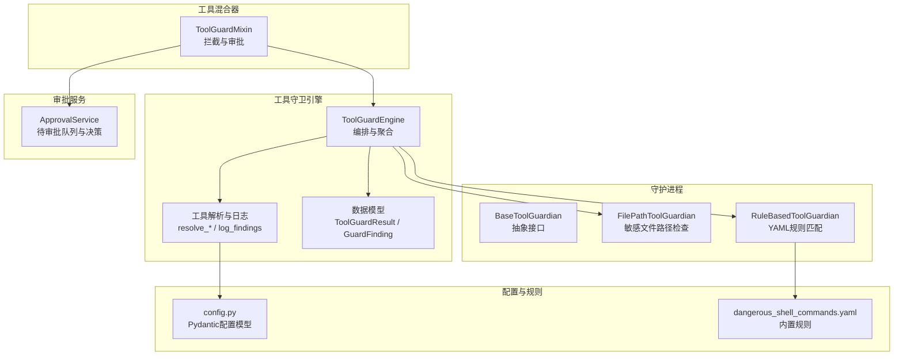
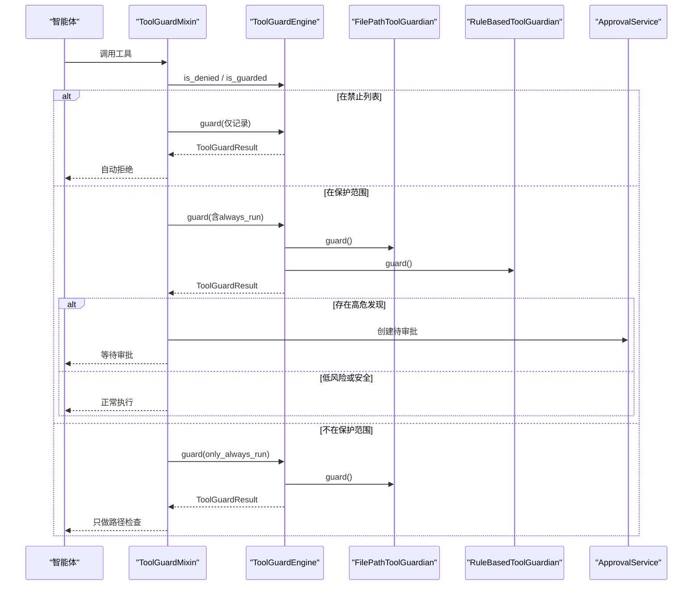
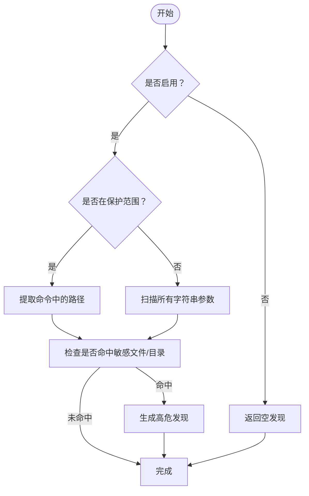
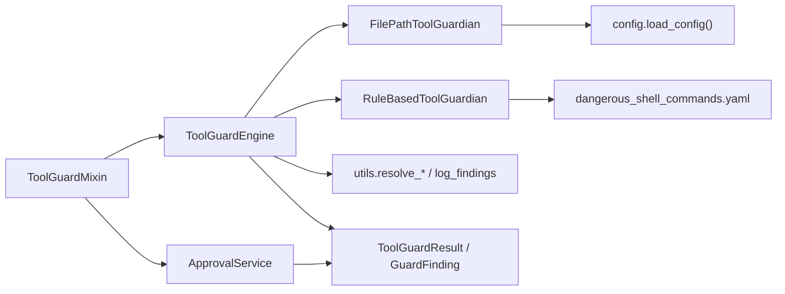

# 工具守卫引擎

<cite>
**本文档引用的文件**
- [src/copaw/security/tool_guard/__init__.py](file://src/copaw/security/tool_guard/__init__.py)
- [src/copaw/security/tool_guard/engine.py](file://src/copaw/security/tool_guard/engine.py)
- [src/copaw/security/tool_guard/models.py](file://src/copaw/security/tool_guard/models.py)
- [src/copaw/security/tool_guard/guardians/__init__.py](file://src/copaw/security/tool_guard/guardians/__init__.py)
- [src/copaw/security/tool_guard/guardians/file_guardian.py](file://src/copaw/security/tool_guard/guardians/file_guardian.py)
- [src/copaw/security/tool_guard/guardians/rule_guardian.py](file://src/copaw/security/tool_guard/guardians/rule_guardian.py)
- [src/copaw/security/tool_guard/utils.py](file://src/copaw/security/tool_guard/utils.py)
- [src/copaw/security/tool_guard/rules/dangerous_shell_commands.yaml](file://src/copaw/security/tool_guard/rules/dangerous_shell_commands.yaml)
- [src/copaw/agents/tool_guard_mixin.py](file://src/copaw/agents/tool_guard_mixin.py)
- [src/copaw/security/tool_guard/approval.py](file://src/copaw/security/tool_guard/approval.py)
- [src/copaw/app/approvals/service.py](file://src/copaw/app/approvals/service.py)
- [src/copaw/config/config.py](file://src/copaw/config/config.py)
</cite>

## 目录
1. [简介](#简介)
2. [项目结构](#项目结构)
3. [核心组件](#核心组件)
4. [架构总览](#架构总览)
5. [详细组件分析](#详细组件分析)
6. [依赖关系分析](#依赖关系分析)
7. [性能考量](#性能考量)
8. [故障排查指南](#故障排查指南)
9. [结论](#结论)
10. [附录](#附录)

## 简介
本文件面向CoPaw的“工具守卫引擎”，系统化阐述其核心架构与实现细节，包括：
- 守护进程注册机制：如何动态注册、注销与重载规则
- 规则引擎与威胁检测算法：基于YAML签名的正则匹配与路径提取
- 默认守护进程集合：文件路径守护者与基于规则的守护者
- 工具调用参数的安全检查流程、违规发现机制与风险评估策略
- 白名单、黑名单与受保护工具集的管理
- 环境变量与配置文件驱动的策略管理与运行时动态调整
- 结果聚合、严重性评估与性能监控指标

## 项目结构
工具守卫引擎位于安全子系统下，采用“守护进程 + 引擎 + 工具混合器”的分层设计：
- 引擎层：统一编排所有守护进程，聚合结果并输出严重性评估
- 守护进程层：抽象接口与具体实现（文件路径、规则匹配）
- 工具混合器层：在智能体执行前进行拦截与审批流程
- 配置与规则层：环境变量、配置文件与内置规则

图表来源
- [src/copaw/security/tool_guard/engine.py:53-238](file://src/copaw/security/tool_guard/engine.py#L53-L238)
- [src/copaw/security/tool_guard/guardians/__init__.py:17-62](file://src/copaw/security/tool_guard/guardians/__init__.py#L17-L62)
- [src/copaw/security/tool_guard/guardians/file_guardian.py:161-342](file://src/copaw/security/tool_guard/guardians/file_guardian.py#L161-L342)
- [src/copaw/security/tool_guard/guardians/rule_guardian.py:280-383](file://src/copaw/security/tool_guard/guardians/rule_guardian.py#L280-L383)
- [src/copaw/security/tool_guard/utils.py:63-163](file://src/copaw/security/tool_guard/utils.py#L63-L163)
- [src/copaw/agents/tool_guard_mixin.py:45-782](file://src/copaw/agents/tool_guard_mixin.py#L45-L782)
- [src/copaw/app/approvals/service.py:58-200](file://src/copaw/app/approvals/service.py#L58-L200)
- [src/copaw/config/config.py:1-200](file://src/copaw/config/config.py#L1-L200)

章节来源
- [src/copaw/security/tool_guard/__init__.py:1-59](file://src/copaw/security/tool_guard/__init__.py#L1-L59)
- [src/copaw/security/tool_guard/engine.py:1-238](file://src/copaw/security/tool_guard/engine.py#L1-L238)

## 核心组件
- 引擎（ToolGuardEngine）：懒加载单例，负责守护进程的注册、执行与结果聚合；支持按环境变量与配置文件控制开关、按工具白名单/黑名单限定作用域，并支持规则重载与敏感文件集重载
- 守护进程（BaseToolGuardian及其子类）：抽象接口定义最小能力；默认实现包括文件路径守护者（敏感目录/文件阻断）与规则守护者（YAML正则签名）
- 工具混合器（ToolGuardMixin）：在智能体执行前拦截工具调用，执行引擎判定与审批流程，支持自动拒绝、预审批与人工审批
- 数据模型（ToolGuardResult/GuardFinding）：统一的发现记录与严重性评估，便于日志与前端展示
- 工具解析与日志（utils）：解析受保护工具集与被禁用工具集，提供结构化日志输出
- 审批服务（ApprovalService）：集中管理待审批请求，支持会话维度查询、取消过期条目与异步决策

章节来源
- [src/copaw/security/tool_guard/engine.py:53-238](file://src/copaw/security/tool_guard/engine.py#L53-L238)
- [src/copaw/security/tool_guard/guardians/__init__.py:17-62](file://src/copaw/security/tool_guard/guardians/__init__.py#L17-L62)
- [src/copaw/security/tool_guard/guardians/file_guardian.py:161-342](file://src/copaw/security/tool_guard/guardians/file_guardian.py#L161-L342)
- [src/copaw/security/tool_guard/guardians/rule_guardian.py:280-383](file://src/copaw/security/tool_guard/guardians/rule_guardian.py#L280-L383)
- [src/copaw/security/tool_guard/models.py:103-185](file://src/copaw/security/tool_guard/models.py#L103-L185)
- [src/copaw/security/tool_guard/utils.py:63-163](file://src/copaw/security/tool_guard/utils.py#L63-L163)
- [src/copaw/agents/tool_guard_mixin.py:45-782](file://src/copaw/agents/tool_guard_mixin.py#L45-L782)
- [src/copaw/app/approvals/service.py:58-200](file://src/copaw/app/approvals/service.py#L58-L200)

## 架构总览
工具守卫引擎遵循“前置拦截 + 规则匹配 + 审批决策”的闭环流程。关键交互如下：

图表来源
- [src/copaw/agents/tool_guard_mixin.py:302-382](file://src/copaw/agents/tool_guard_mixin.py#L302-L382)
- [src/copaw/security/tool_guard/engine.py:169-226](file://src/copaw/security/tool_guard/engine.py#L169-L226)
- [src/copaw/security/tool_guard/guardians/file_guardian.py:290-342](file://src/copaw/security/tool_guard/guardians/file_guardian.py#L290-L342)
- [src/copaw/security/tool_guard/guardians/rule_guardian.py:329-383](file://src/copaw/security/tool_guard/guardians/rule_guardian.py#L329-L383)
- [src/copaw/app/approvals/service.py:80-160](file://src/copaw/app/approvals/service.py#L80-L160)

## 详细组件分析

### 引擎：ToolGuardEngine
- 单例与开关：通过环境变量优先级控制启用状态，其次读取配置文件，最后回退为启用
- 默认守护进程：自动初始化文件路径守护者与规则守护者，异常时记录警告但不中断
- 注册与注销：支持运行时注册新守护进程，或按名称注销
- 工具作用域：支持“全部保护”“空集保护”“自定义白名单”三种模式，可通过环境变量或配置文件覆盖
- 被禁用工具：直接拒绝，不进入审批流程
- 规则重载：遍历守护进程调用reload以刷新规则与敏感文件集
- 结果聚合：记录使用过的守护进程、失败项、耗时与最高严重性

章节来源
- [src/copaw/security/tool_guard/engine.py:35-154](file://src/copaw/security/tool_guard/engine.py#L35-L154)
- [src/copaw/security/tool_guard/engine.py:169-226](file://src/copaw/security/tool_guard/engine.py#L169-L226)
- [src/copaw/security/tool_guard/engine.py:232-238](file://src/copaw/security/tool_guard/engine.py#L232-L238)

### 守护进程：BaseToolGuardian
- 抽象接口：定义name、always_run与guard方法，确保可插拔扩展
- always_run语义：即使不在保护范围内也强制执行（如路径检查）

章节来源
- [src/copaw/security/tool_guard/guardians/__init__.py:17-62](file://src/copaw/security/tool_guard/guardians/__init__.py#L17-L62)

### 文件路径守护者：FilePathToolGuardian
- 启用控制：从配置读取开关，默认启用
- 敏感文件集：支持目录与文件两种形态，自动归一化为绝对路径
- 命令行路径提取：对shell命令进行词法拆分与重定向操作符识别，提取候选路径
- 规则匹配：对目标工具参数或字符串值进行路径检查，命中即生成高危发现
- 动态重载：根据配置刷新敏感文件集

图表来源
- [src/copaw/security/tool_guard/guardians/file_guardian.py:290-342](file://src/copaw/security/tool_guard/guardians/file_guardian.py#L290-L342)
- [src/copaw/security/tool_guard/guardians/file_guardian.py:111-158](file://src/copaw/security/tool_guard/guardians/file_guardian.py#L111-L158)

章节来源
- [src/copaw/security/tool_guard/guardians/file_guardian.py:161-342](file://src/copaw/security/tool_guard/guardians/file_guardian.py#L161-L342)

### 规则守护者：RuleBasedToolGuardian
- 规则来源：内置规则目录与配置注入的自定义规则，支持禁用规则ID
- 规则格式：YAML列表，每条规则包含id、工具/参数作用域、类别、严重性、正则与排除正则
- 匹配逻辑：对参数字符串进行正则匹配，排除匹配后生成发现并附带上下文片段
- 动态重载：重新加载内置/自定义规则并过滤禁用项

章节来源
- [src/copaw/security/tool_guard/guardians/rule_guardian.py:280-383](file://src/copaw/security/tool_guard/guardians/rule_guardian.py#L280-L383)
- [src/copaw/security/tool_guard/rules/dangerous_shell_commands.yaml:1-120](file://src/copaw/security/tool_guard/rules/dangerous_shell_commands.yaml#L1-L120)

### 工具混合器：ToolGuardMixin
- 拦截点：在智能体执行前进行拦截，区分自动拒绝、预审批与人工审批三类路径
- 并发安全：使用锁保证决策分支的原子性，实际执行在锁外进行以保持并行
- 记忆清理：移除被拒绝的消息标记与后续解释消息，避免历史污染
- 强制重放：在审批通过后重放剩余工具调用序列，保持对话连贯

章节来源
- [src/copaw/agents/tool_guard_mixin.py:251-382](file://src/copaw/agents/tool_guard_mixin.py#L251-L382)
- [src/copaw/agents/tool_guard_mixin.py:433-587](file://src/copaw/agents/tool_guard_mixin.py#L433-L587)
- [src/copaw/agents/tool_guard_mixin.py:593-782](file://src/copaw/agents/tool_guard_mixin.py#L593-L782)

### 数据模型与工具解析
- ToolGuardResult：聚合一次工具调用的发现、耗时、使用守护进程与最高严重性
- GuardFinding：单条发现记录，包含规则ID、类别、严重性、描述、参数名、匹配值与修复建议
- 解析工具集：支持环境变量与配置文件解析受保护工具集与被禁用工具集，支持通配与空集
- 日志输出：按严重性选择日志级别，输出结构化信息

章节来源
- [src/copaw/security/tool_guard/models.py:103-185](file://src/copaw/security/tool_guard/models.py#L103-L185)
- [src/copaw/security/tool_guard/utils.py:63-163](file://src/copaw/security/tool_guard/utils.py#L63-L163)

### 审批服务：ApprovalService
- 待审批记录：按会话FIFO顺序管理，支持取消过期条目与去重
- 决策机制：Future异步等待外部命令触发的批准/拒绝/超时
- 清理策略：限制最大挂起与已完成数量及年龄，防止内存膨胀

章节来源
- [src/copaw/app/approvals/service.py:58-200](file://src/copaw/app/approvals/service.py#L58-L200)

## 依赖关系分析
- 引擎依赖守护进程接口与具体实现，同时依赖工具解析与日志模块
- 文件路径守护者依赖配置上下文与常量，用于工作区根目录与秘密目录解析
- 规则守护者依赖YAML与正则库，以及内置规则文件
- 工具混合器依赖引擎与审批服务，形成闭环
- 审批服务独立于引擎，但被工具混合器调用

图表来源
- [src/copaw/security/tool_guard/engine.py:53-154](file://src/copaw/security/tool_guard/engine.py#L53-L154)
- [src/copaw/security/tool_guard/guardians/file_guardian.py:161-225](file://src/copaw/security/tool_guard/guardians/file_guardian.py#L161-L225)
- [src/copaw/security/tool_guard/guardians/rule_guardian.py:280-314](file://src/copaw/security/tool_guard/guardians/rule_guardian.py#L280-L314)
- [src/copaw/security/tool_guard/utils.py:63-96](file://src/copaw/security/tool_guard/utils.py#L63-L96)
- [src/copaw/agents/tool_guard_mixin.py:57-70](file://src/copaw/agents/tool_guard_mixin.py#L57-L70)
- [src/copaw/app/approvals/service.py:58-114](file://src/copaw/app/approvals/service.py#L58-L114)

## 性能考量
- 规则匹配：正则编译缓存，避免重复编译；按工具/参数作用域缩小匹配范围
- 路径提取：词法拆分与最长优先匹配重定向操作符，减少误报
- 引擎耗时：记录guard_duration_seconds，便于定位慢守护进程
- 并发执行：决策分支加锁，实际工具执行在锁外进行，提升吞吐
- 内存管理：审批服务定期清理过期与过多记录，避免内存泄漏

## 故障排查指南
- 守护进程失败：引擎捕获异常并记录失败守护进程，不影响其他守护进程
- 规则加载失败：规则文件缺失或格式错误时记录警告并跳过无效规则
- 路径解析异常：相对路径在工作区根目录下解析，若不可解析则保留原始值
- 审批卡住：检查会话是否有待审批记录，必要时取消过期条目
- 环境变量与配置冲突：环境变量优先级高于配置文件，确认当前生效值

章节来源
- [src/copaw/security/tool_guard/engine.py:214-224](file://src/copaw/security/tool_guard/engine.py#L214-L224)
- [src/copaw/security/tool_guard/guardians/rule_guardian.py:153-185](file://src/copaw/security/tool_guard/guardians/rule_guardian.py#L153-L185)
- [src/copaw/security/tool_guard/guardians/file_guardian.py:46-52](file://src/copaw/security/tool_guard/guardians/file_guardian.py#L46-L52)
- [src/copaw/app/approvals/service.py:174-200](file://src/copaw/app/approvals/service.py#L174-L200)

## 结论
工具守卫引擎通过“前置拦截 + 多守护进程 + 审批闭环”的设计，在保障安全性的同时兼顾灵活性与可观测性。默认守护进程组合覆盖了常见高危模式，且支持动态注册、注销与规则重载。配合环境变量与配置文件，可在不同场景下快速调整策略边界。

## 附录

### 默认守护进程集合与配置方法
- 默认守护进程
  - 文件路径守护者：阻断对敏感文件/目录的访问，支持从配置加载敏感文件集
  - 规则守护者：基于YAML正则签名匹配危险命令与模式
- 配置入口
  - 环境变量：COPAW_TOOL_GUARD_ENABLED、COPAW_TOOL_GUARD_TOOLS、COPAW_TOOL_GUARD_DENIED_TOOLS
  - 配置文件：security.tool_guard.enabled、security.tool_guard.guarded_tools、security.tool_guard.denied_tools、security.file_guard.enabled、security.file_guard.sensitive_files、security.tool_guard.disabled_rules、security.tool_guard.custom_rules

章节来源
- [src/copaw/security/tool_guard/engine.py:35-51](file://src/copaw/security/tool_guard/engine.py#L35-L51)
- [src/copaw/security/tool_guard/utils.py:63-126](file://src/copaw/security/tool_guard/utils.py#L63-L126)
- [src/copaw/security/tool_guard/guardians/file_guardian.py:54-80](file://src/copaw/security/tool_guard/guardians/file_guardian.py#L54-L80)
- [src/copaw/security/tool_guard/guardians/rule_guardian.py:239-273](file://src/copaw/security/tool_guard/guardians/rule_guardian.py#L239-L273)
- [src/copaw/config/config.py:1-200](file://src/copaw/config/config.py#L1-L200)

### 工具调用参数的安全检查流程
- 判定阶段：先查被禁用工具，再查保护范围；非保护范围仅执行always_run守护进程
- 执行阶段：依次调用各守护进程，收集发现并记录耗时
- 评估阶段：计算最高严重性，决定是否进入审批流程

章节来源
- [src/copaw/security/tool_guard/engine.py:169-226](file://src/copaw/security/tool_guard/engine.py#L169-L226)
- [src/copaw/agents/tool_guard_mixin.py:302-357](file://src/copaw/agents/tool_guard_mixin.py#L302-L357)

### 违规发现机制与风险评估策略
- 发现记录：包含规则ID、类别、严重性、描述、参数名、匹配值与修复建议
- 严重性排序：CRITICAL > HIGH > MEDIUM > LOW > INFO > SAFE
- 风险评估：以最高严重性为准，高危直接阻断并要求审批

章节来源
- [src/copaw/security/tool_guard/models.py:121-144](file://src/copaw/security/tool_guard/models.py#L121-L144)
- [src/copaw/security/tool_guard/utils.py:128-163](file://src/copaw/security/tool_guard/utils.py#L128-L163)

### 动态注册、注销与配置重载
- 注册/注销：register_guardian/unregister_guardian
- 配置重载：reload_rules（调用各守护进程reload），_reload_tool_sets（刷新工具白/黑名单）

章节来源
- [src/copaw/security/tool_guard/engine.py:108-154](file://src/copaw/security/tool_guard/engine.py#L108-L154)

### 白名单、黑名单与受保护工具集管理
- 白名单：COPAW_TOOL_GUARD_TOOLS或配置security.tool_guard.guarded_tools
- 黑名单：COPAW_TOOL_GUARD_DENIED_TOOLS或配置security.tool_guard.denied_tools
- 通配与空集：支持*、all、none、off、false、0等语义

章节来源
- [src/copaw/security/tool_guard/utils.py:63-126](file://src/copaw/security/tool_guard/utils.py#L63-L126)

### 安全策略的环境变量与配置文件
- 环境变量优先级高于配置文件
- 配置文件通过Pydantic模型加载，支持自定义规则与禁用规则ID

章节来源
- [src/copaw/security/tool_guard/engine.py:35-51](file://src/copaw/security/tool_guard/engine.py#L35-L51)
- [src/copaw/security/tool_guard/guardians/rule_guardian.py:239-273](file://src/copaw/security/tool_guard/guardians/rule_guardian.py#L239-L273)
- [src/copaw/config/config.py:1-200](file://src/copaw/config/config.py#L1-L200)

### 工具守卫结果的聚合处理、严重性评估与性能监控
- 聚合处理：ToolGuardResult汇总发现、使用守护进程、失败项与耗时
- 严重性评估：max_severity按等级排序
- 性能监控：guard_duration_seconds用于统计

章节来源
- [src/copaw/security/tool_guard/models.py:103-177](file://src/copaw/security/tool_guard/models.py#L103-L177)
- [src/copaw/security/tool_guard/utils.py:128-163](file://src/copaw/security/tool_guard/utils.py#L128-L163)