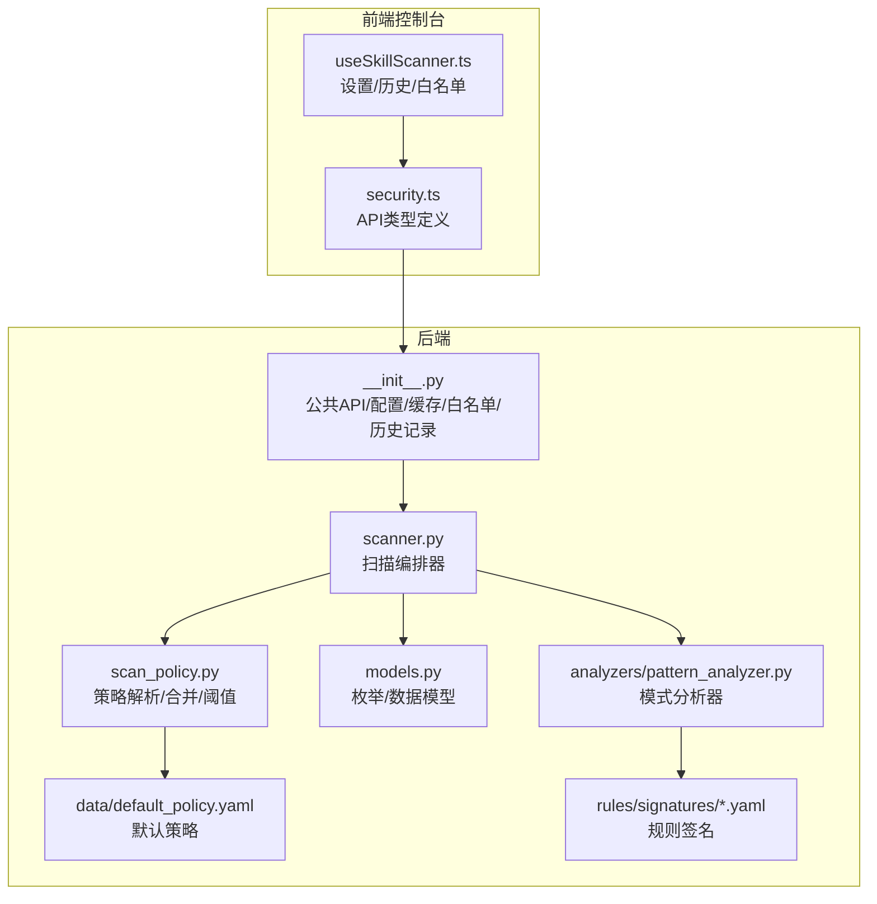
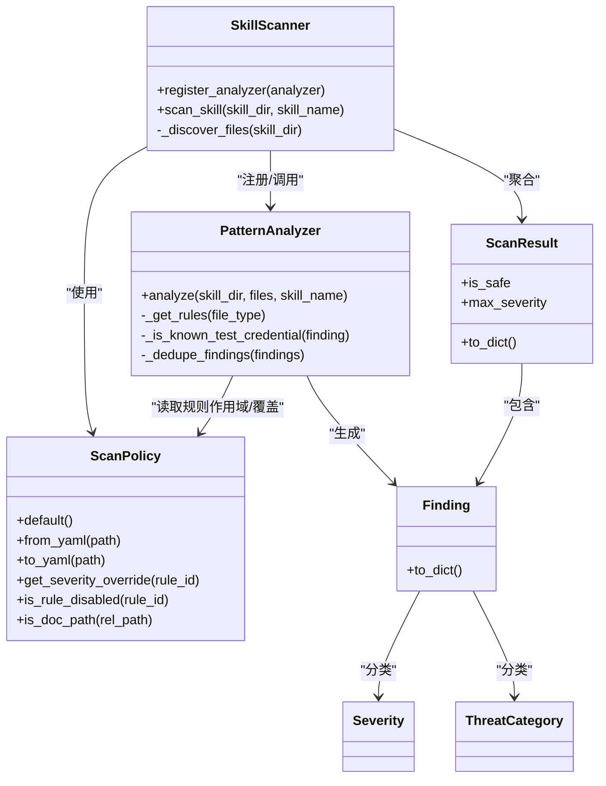
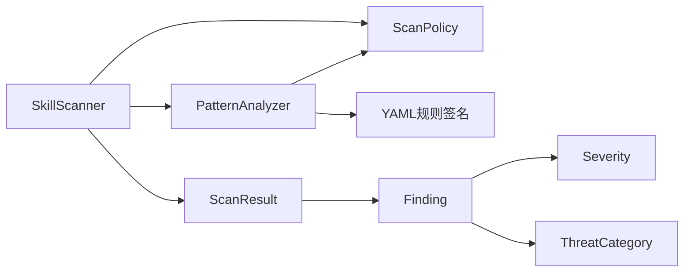

# 技能扫描器

<cite>
**本文引用的文件**
- [src/copaw/security/skill_scanner/__init__.py](file://src/copaw/security/skill_scanner/__init__.py)
- [src/copaw/security/skill_scanner/scanner.py](file://src/copaw/security/skill_scanner/scanner.py)
- [src/copaw/security/skill_scanner/scan_policy.py](file://src/copaw/security/skill_scanner/scan_policy.py)
- [src/copaw/security/skill_scanner/models.py](file://src/copaw/security/skill_scanner/models.py)
- [src/copaw/security/skill_scanner/analyzers/pattern_analyzer.py](file://src/copaw/security/skill_scanner/analyzers/pattern_analyzer.py)
- [src/copaw/security/skill_scanner/data/default_policy.yaml](file://src/copaw/security/skill_scanner/data/default_policy.yaml)
- [src/copaw/security/skill_scanner/rules/signatures/command_injection.yaml](file://src/copaw/security/skill_scanner/rules/signatures/command_injection.yaml)
- [src/copaw/security/skill_scanner/rules/signatures/prompt_injection.yaml](file://src/copaw/security/skill_scanner/rules/signatures/prompt_injection.yaml)
- [console/src/api/modules/security.ts](file://console/src/api/modules/security.ts)
- [console/src/pages/Settings/Security/useSkillScanner.ts](file://console/src/pages/Settings/Security/useSkillScanner.ts)
</cite>

## 目录
1. [简介](#简介)
2. [项目结构](#项目结构)
3. [核心组件](#核心组件)
4. [架构总览](#架构总览)
5. [详细组件分析](#详细组件分析)
6. [依赖关系分析](#依赖关系分析)
7. [性能与可扩展性](#性能与可扩展性)
8. [故障排查指南](#故障排查指南)
9. [结论](#结论)
10. [附录：规则开发与调试指南](#附录规则开发与调试指南)

## 简介
本文件面向CoPaw技能扫描器（Skill Scanner）提供全面技术文档，覆盖整体架构、扫描策略引擎、分析器模块、规则匹配机制、模式分析器工作原理、配置管理、扫描流程、结果评估与自动响应、性能优化与并发处理，以及规则自定义开发指南。读者无需深入编程背景即可理解扫描器如何在技能安装前进行安全扫描并阻断高危内容。

## 项目结构
技能扫描器位于后端Python包中，前端控制台通过API与之交互。关键目录与文件如下：
- 后端核心
  - 扫描器入口与公共API：[src/copaw/security/skill_scanner/__init__.py](file://src/copaw/security/skill_scanner/__init__.py)
  - 扫描编排器：[src/copaw/security/skill_scanner/scanner.py](file://src/copaw/security/skill_scanner/scanner.py)
  - 扫描策略与规则：[src/copaw/security/skill_scanner/scan_policy.py](file://src/copaw/security/skill_scanner/scan_policy.py)，默认策略：[src/copaw/security/skill_scanner/data/default_policy.yaml](file://src/copaw/security/skill_scanner/data/default_policy.yaml)
  - 数据模型：[src/copaw/security/skill_scanner/models.py](file://src/copaw/security/skill_scanner/models.py)
  - 模式分析器（YAML签名正则匹配）：[src/copaw/security/skill_scanner/analyzers/pattern_analyzer.py](file://src/copaw/security/skill_scanner/analyzers/pattern_analyzer.py)
  - 规则签名示例：命令注入规则、提示词注入规则等
- 前端控制台
  - 安全相关API类型定义：[console/src/api/modules/security.ts](file://console/src/api/modules/security.ts)
  - 技能扫描器设置与历史记录Hook：[console/src/pages/Settings/Security/useSkillScanner.ts](file://console/src/pages/Settings/Security/useSkillScanner.ts)

图表来源
- [src/copaw/security/skill_scanner/__init__.py:1-505](file://src/copaw/security/skill_scanner/__init__.py#L1-L505)
- [src/copaw/security/skill_scanner/scanner.py:1-319](file://src/copaw/security/skill_scanner/scanner.py#L1-L319)
- [src/copaw/security/skill_scanner/scan_policy.py:1-476](file://src/copaw/security/skill_scanner/scan_policy.py#L1-L476)
- [src/copaw/security/skill_scanner/models.py:1-235](file://src/copaw/security/skill_scanner/models.py#L1-L235)
- [src/copaw/security/skill_scanner/analyzers/pattern_analyzer.py:1-393](file://src/copaw/security/skill_scanner/analyzers/pattern_analyzer.py#L1-L393)
- [src/copaw/security/skill_scanner/data/default_policy.yaml:1-245](file://src/copaw/security/skill_scanner/data/default_policy.yaml#L1-L245)
- [console/src/api/modules/security.ts:1-149](file://console/src/api/modules/security.ts#L1-L149)
- [console/src/pages/Settings/Security/useSkillScanner.ts:1-128](file://console/src/pages/Settings/Security/useSkillScanner.ts#L1-L128)

章节来源
- [src/copaw/security/skill_scanner/__init__.py:1-505](file://src/copaw/security/skill_scanner/__init__.py#L1-L505)
- [src/copaw/security/skill_scanner/scanner.py:1-319](file://src/copaw/security/skill_scanner/scanner.py#L1-L319)
- [src/copaw/security/skill_scanner/scan_policy.py:1-476](file://src/copaw/security/skill_scanner/scan_policy.py#L1-L476)
- [src/copaw/security/skill_scanner/models.py:1-235](file://src/copaw/security/skill_scanner/models.py#L1-L235)
- [src/copaw/security/skill_scanner/analyzers/pattern_analyzer.py:1-393](file://src/copaw/security/skill_scanner/analyzers/pattern_analyzer.py#L1-L393)
- [src/copaw/security/skill_scanner/data/default_policy.yaml:1-245](file://src/copaw/security/skill_scanner/data/default_policy.yaml#L1-L245)
- [console/src/api/modules/security.ts:1-149](file://console/src/api/modules/security.ts#L1-L149)
- [console/src/pages/Settings/Security/useSkillScanner.ts:1-128](file://console/src/pages/Settings/Security/useSkillScanner.ts#L1-L128)

## 核心组件
- 扫描编排器（SkillScanner）
  - 负责发现技能目录中的文件、运行已注册分析器、聚合结果并生成扫描报告。
  - 支持文件数量上限、单文件大小上限、跳过扩展名集合等安全限制。
- 扫描策略（ScanPolicy）
  - 提供组织级策略：隐藏文件处理、规则作用域、凭证抑制、文件分类、阈值、严重性覆盖、禁用规则等。
  - 支持从默认策略叠加自定义策略文件，实现灵活的策略管理。
- 模式分析器（PatternAnalyzer）
  - 基于YAML规则签名的正则匹配分析器，支持行内匹配与跨行匹配，并提供排除规则。
  - 可按文件类型过滤规则，应用策略覆盖与去重。
- 数据模型（Finding/ScanResult/Severity/ThreatCategory/SkillFile）
  - 统一的扫描结果与威胁分类模型，便于前端展示与策略评估。
- 公共API与基础设施
  - 配置加载（环境变量优先）、扫描模式（block/warn/off）、超时控制、内容哈希、白名单、阻断历史持久化、线程安全单例扫描器、基于mtime的扫描结果缓存、并发执行（线程池）。

章节来源
- [src/copaw/security/skill_scanner/scanner.py:76-319](file://src/copaw/security/skill_scanner/scanner.py#L76-L319)
- [src/copaw/security/skill_scanner/scan_policy.py:156-476](file://src/copaw/security/skill_scanner/scan_policy.py#L156-L476)
- [src/copaw/security/skill_scanner/analyzers/pattern_analyzer.py:236-393](file://src/copaw/security/skill_scanner/analyzers/pattern_analyzer.py#L236-L393)
- [src/copaw/security/skill_scanner/models.py:19-235](file://src/copaw/security/skill_scanner/models.py#L19-L235)
- [src/copaw/security/skill_scanner/__init__.py:85-505](file://src/copaw/security/skill_scanner/__init__.py#L85-L505)

## 架构总览
技能扫描器采用“策略驱动 + 分析器插件化”的轻量架构：
- 策略层：ScanPolicy统一管理规则作用域、阈值、严重性覆盖与禁用规则。
- 编排层：SkillScanner负责文件发现、并发调用分析器、聚合与去重。
- 分析层：PatternAnalyzer加载YAML规则签名，对文件内容进行正则匹配与排除。
- 结果层：Finding/ScanResult封装扫描结果，Severity/ThreatCategory提供风险分级。
- 基础设施：配置加载、白名单、阻断历史、缓存、超时与并发。

图表来源
- [src/copaw/security/skill_scanner/scanner.py:76-319](file://src/copaw/security/skill_scanner/scanner.py#L76-L319)
- [src/copaw/security/skill_scanner/scan_policy.py:156-476](file://src/copaw/security/skill_scanner/scan_policy.py#L156-L476)
- [src/copaw/security/skill_scanner/analyzers/pattern_analyzer.py:236-393](file://src/copaw/security/skill_scanner/analyzers/pattern_analyzer.py#L236-L393)
- [src/copaw/security/skill_scanner/models.py:129-235](file://src/copaw/security/skill_scanner/models.py#L129-L235)

## 详细组件分析

### 扫描策略引擎（ScanPolicy）
- 默认策略与预设
  - 默认策略文件位于[data/default_policy.yaml:1-245](file://src/copaw/security/skill_scanner/data/default_policy.yaml#L1-L245)，包含隐藏文件、规则作用域、凭证抑制、文件分类、文件限制、分析阈值、严重性覆盖与禁用规则等。
  - 支持从策略文件叠加默认策略，实现“仅覆盖差异”的方式。
- 关键策略项
  - 隐藏文件：哪些点文件/点目录被视为无害。
  - 规则作用域：仅在特定路径或文件类型触发的规则集合；文档路径规则跳过；仅代码文件触发的规则。
  - 凭证抑制：对测试占位符与常见测试值进行自动抑制，降低误报。
  - 文件分类：将扩展名归类为“惰性”“结构化”“归档”“代码”，用于路由到不同分析器。
  - 文件限制：最大文件数、单文件大小、引用深度、名称/描述长度等。
  - 分析阈值：最小置信度、正则最大长度等。
  - 严重性覆盖与禁用规则：按规则ID覆盖严重性或完全禁用。
- 策略加载与合并
  - 从默认策略加载原始字典，再与用户策略进行深合并，确保只覆盖指定字段。

章节来源
- [src/copaw/security/skill_scanner/scan_policy.py:236-476](file://src/copaw/security/skill_scanner/scan_policy.py#L236-L476)
- [src/copaw/security/skill_scanner/data/default_policy.yaml:1-245](file://src/copaw/security/skill_scanner/data/default_policy.yaml#L1-L245)

### 分析器模块（PatternAnalyzer）
- 规则加载
  - 从规则目录加载YAML规则列表，构建SecurityRule对象，编译正则与排除正则。
- 内容扫描
  - 行内匹配：快速扫描每行，跳过被排除的行。
  - 多行匹配：对包含换行的模式进行全文匹配，计算起始行号并提取片段。
- 策略集成
  - 应用策略的规则禁用、文档路径跳过、仅代码文件规则、严重性覆盖、凭证抑制、去重。
- 文件类型路由
  - 按文件类型筛选适用规则，减少不必要匹配。

章节来源
- [src/copaw/security/skill_scanner/analyzers/pattern_analyzer.py:38-393](file://src/copaw/security/skill_scanner/analyzers/pattern_analyzer.py#L38-L393)
- [src/copaw/security/skill_scanner/data/default_policy.yaml:81-120](file://src/copaw/security/skill_scanner/data/default_policy.yaml#L81-L120)

### 扫描编排器（SkillScanner）
- 文件发现
  - 递归遍历技能目录，跳过符号链接、不在技能目录边界内的文件、指定扩展名、过大文件；达到文件上限即停止。
- 并发执行
  - 使用线程池执行扫描任务，避免阻塞主线程。
- 结果聚合
  - 调用每个分析器，收集Findings；根据策略进行去重；构造ScanResult并记录耗时与失败的分析器。

章节来源
- [src/copaw/security/skill_scanner/scanner.py:148-319](file://src/copaw/security/skill_scanner/scanner.py#L148-L319)

### 数据模型与结果评估
- 枚举与分类
  - Severity：CRITICAL/HIGH/MEDIUM/LOW/INFO/SAFE
  - ThreatCategory：涵盖提示词注入、命令注入、数据泄露、未授权工具使用、混淆、硬编码密钥、社交工程、资源滥用、供应链攻击等。
- 结果模型
  - Finding：包含规则ID、类别、严重性、标题、描述、文件路径、行号、片段、修复建议、分析器、元数据等。
  - ScanResult：包含技能名、目录、Findings、耗时、使用的分析器、失败的分析器、时间戳；提供is_safe与max_severity属性。
- 严重性评估
  - 以最高严重性作为最终评估；若无CRITICAL/HIGH，则判定为安全。

章节来源
- [src/copaw/security/skill_scanner/models.py:19-235](file://src/copaw/security/skill_scanner/models.py#L19-L235)

### 阻断与自动响应机制
- 扫描模式
  - 支持block/warn/off三种模式，优先级：环境变量 > 配置 > 默认（block）。
- 白名单
  - 可按技能名与内容哈希匹配白名单条目，命中则跳过扫描。
- 阻断历史
  - 将阻断/警告记录持久化为JSON文件，包含技能名、时间、最高严重性、发现项、内容哈希与动作。
- 自动阻断
  - 当扫描结果非安全且模式为block时，抛出异常并记录阻断历史。

章节来源
- [src/copaw/security/skill_scanner/__init__.py:85-505](file://src/copaw/security/skill_scanner/__init__.py#L85-L505)

### 技能代码安全扫描流程
- 语法分析
  - 通过文件类型映射识别脚本语言，但当前模式分析器不进行语法树解析，仅基于正则匹配。
- 语义检查
  - 通过规则签名与策略作用域判断潜在危险模式（如eval/exec、子进程调用、路径拼接、SQL拼接、SVG/JS内容等）。
- 行为预测
  - 基于规则与上下文片段（如行号、片段）给出修复建议，帮助开发者规避风险。

章节来源
- [src/copaw/security/skill_scanner/analyzers/pattern_analyzer.py:93-155](file://src/copaw/security/skill_scanner/analyzers/pattern_analyzer.py#L93-L155)
- [src/copaw/security/skill_scanner/rules/signatures/command_injection.yaml:1-195](file://src/copaw/security/skill_scanner/rules/signatures/command_injection.yaml#L1-L195)
- [src/copaw/security/skill_scanner/rules/signatures/prompt_injection.yaml:1-59](file://src/copaw/security/skill_scanner/rules/signatures/prompt_injection.yaml#L1-L59)

### 前端集成与配置管理
- 控制台API类型
  - 定义技能扫描器配置（模式、超时、白名单）、阻断历史记录、错误响应等类型。
- 设置与历史
  - Hook负责拉取配置、更新配置、添加/移除白名单、删除阻断历史条目、清空历史等操作。

章节来源
- [console/src/api/modules/security.ts:37-75](file://console/src/api/modules/security.ts#L37-L75)
- [console/src/pages/Settings/Security/useSkillScanner.ts:9-128](file://console/src/pages/Settings/Security/useSkillScanner.ts#L9-L128)

## 依赖关系分析
- 组件耦合
  - SkillScanner依赖ScanPolicy与多个分析器接口；PatternAnalyzer依赖ScanPolicy与规则签名。
  - 模块间通过数据类（Finding/ScanResult）解耦，便于扩展新分析器。
- 外部依赖
  - YAML解析、正则表达式、线程池、文件系统访问、JSON持久化。
- 循环依赖
  - 未见循环导入；策略与分析器通过接口与数据类松耦合。

图表来源
- [src/copaw/security/skill_scanner/scanner.py:148-319](file://src/copaw/security/skill_scanner/scanner.py#L148-L319)
- [src/copaw/security/skill_scanner/scan_policy.py:156-476](file://src/copaw/security/skill_scanner/scan_policy.py#L156-L476)
- [src/copaw/security/skill_scanner/analyzers/pattern_analyzer.py:236-393](file://src/copaw/security/skill_scanner/analyzers/pattern_analyzer.py#L236-L393)
- [src/copaw/security/skill_scanner/models.py:129-235](file://src/copaw/security/skill_scanner/models.py#L129-L235)

## 性能与可扩展性
- 并发与缓存
  - 单例扫描器与线程池执行，避免重复扫描；基于目录与文件mtime的LRU缓存，命中直接返回结果。
- 文件发现优化
  - 跳过符号链接、不在边界内的文件、指定扩展名、过大文件；达到上限即停止，防止目录膨胀导致性能问题。
- 正则匹配优化
  - 行内快速匹配 + 多行模式补充；排除规则先过滤，减少无效匹配。
- 可扩展性
  - 新增分析器只需实现BaseAnalyzer接口并通过SkillScanner.register_analyzer注册；策略可按需覆盖严重性与规则范围。

章节来源
- [src/copaw/security/skill_scanner/__init__.py:327-505](file://src/copaw/security/skill_scanner/__init__.py#L327-L505)
- [src/copaw/security/skill_scanner/scanner.py:248-319](file://src/copaw/security/skill_scanner/scanner.py#L248-L319)
- [src/copaw/security/skill_scanner/analyzers/pattern_analyzer.py:93-155](file://src/copaw/security/skill_scanner/analyzers/pattern_analyzer.py#L93-L155)

## 故障排查指南
- 常见问题
  - 扫描超时：检查timeout配置与技能目录规模；适当增大超时或减少文件数量。
  - 阻断告警：查看阻断历史与最高严重性，结合规则ID定位问题；必要时调整策略或修复代码。
  - 白名单误判：确认content_hash是否匹配当前目录内容；必要时移除或更新条目。
- 日志与错误
  - 分析器失败会被记录；扫描结果包含失败分析器列表，便于定位问题。
  - 阻断历史文件写入失败会记录警告日志。

章节来源
- [src/copaw/security/skill_scanner/__init__.py:471-505](file://src/copaw/security/skill_scanner/__init__.py#L471-L505)
- [src/copaw/security/skill_scanner/scanner.py:194-213](file://src/copaw/security/skill_scanner/scanner.py#L194-L213)

## 结论
技能扫描器以“策略驱动 + 正则签名”的方式实现了对技能包的快速、可扩展安全扫描。通过白名单、阻断历史、严重性评估与自动响应机制，有效降低了高危技能进入系统的风险。默认策略与规则签名覆盖了常见的注入与滥用场景，同时保留了高度可定制的空间，满足不同组织的安全基线需求。

## 附录：规则开发与调试指南
- 规则编写规范
  - 规则文件位于[rules/signatures/:28-31](file://src/copaw/security/skill_scanner/analyzers/pattern_analyzer.py#L28-L31)，建议遵循：
    - id：唯一标识，建议使用UPPER_UNDERSCORE命名。
    - category：威胁类别，参考ThreatCategory枚举。
    - severity：严重性级别（CRITICAL/HIGH/MEDIUM/LOW/INFO）。
    - patterns/exclude_patterns：正则表达式列表，注意转义与长度限制。
    - file_types：目标文件类型列表（如python/javascript/typescript等）。
    - description/remediation：清晰的描述与修复建议。
- 规则加载与索引
  - RuleLoader从目录加载所有YAML规则，校验格式并建立按ID与类别的索引。
- 调试技巧
  - 在本地修改规则后，重新加载策略或重启服务以生效。
  - 使用较小的技能目录进行验证，结合日志观察匹配与排除效果。
  - 对于多行模式，注意pattern中换行字符的处理与排除规则的配合。
  - 利用凭证抑制策略减少误报，提升扫描体验。

章节来源
- [src/copaw/security/skill_scanner/analyzers/pattern_analyzer.py:163-229](file://src/copaw/security/skill_scanner/analyzers/pattern_analyzer.py#L163-L229)
- [src/copaw/security/skill_scanner/data/default_policy.yaml:122-155](file://src/copaw/security/skill_scanner/data/default_policy.yaml#L122-L155)