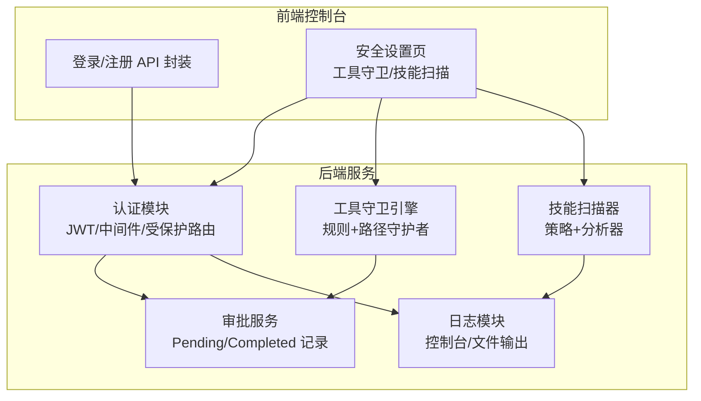
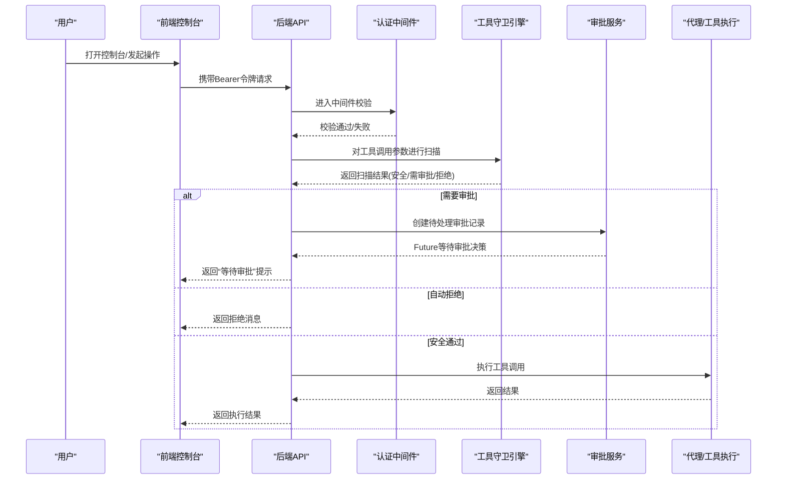
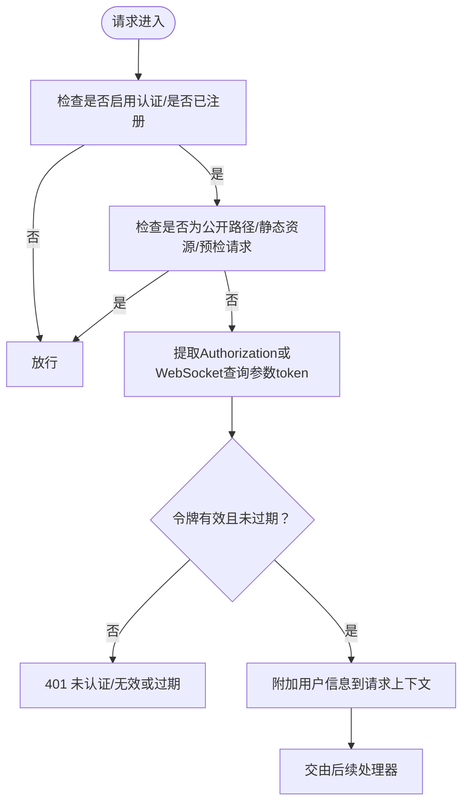
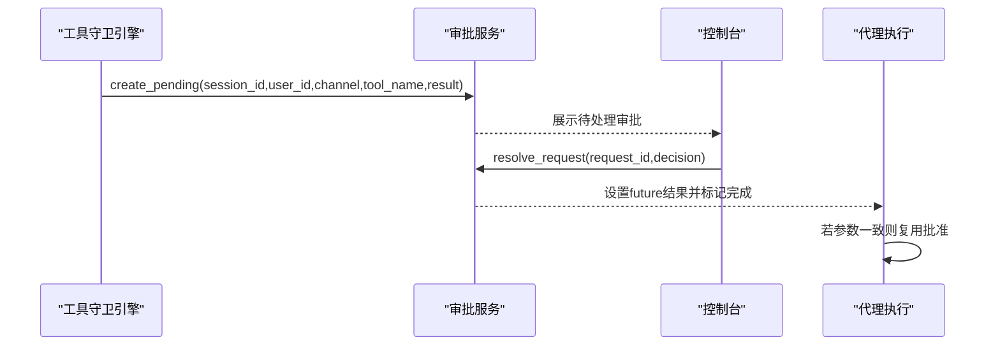
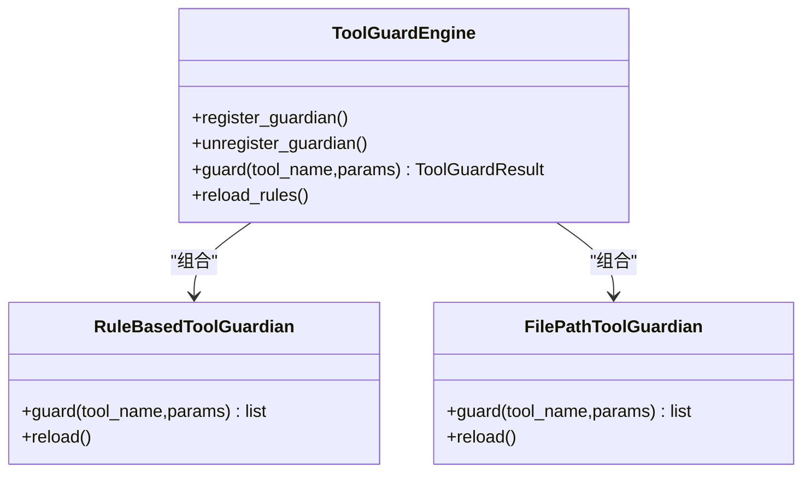
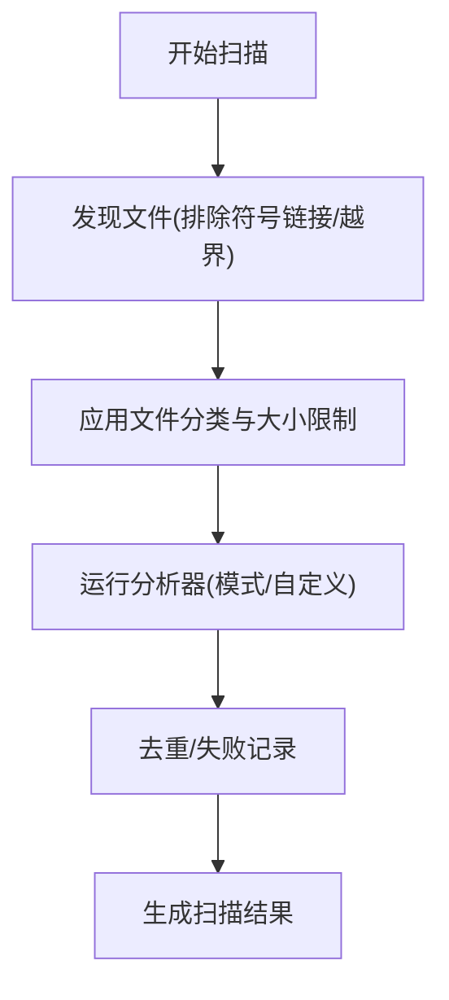
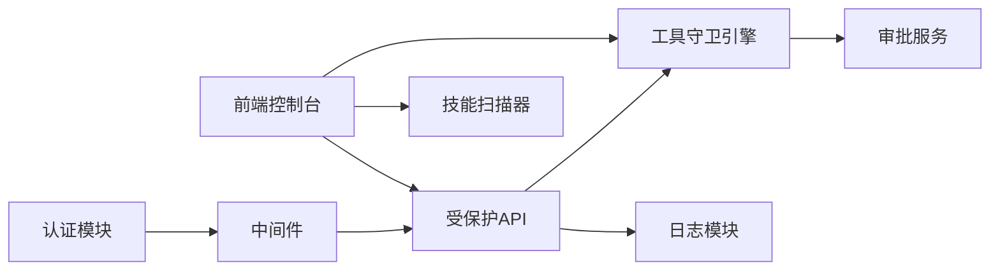

# 访问控制系统

<cite>
**本文引用的文件**
- [src/copaw/app/auth.py](file://src/copaw/app/auth.py)
- [src/copaw/app/approvals/service.py](file://src/copaw/app/approvals/service.py)
- [src/copaw/agents/tool_guard_mixin.py](file://src/copaw/agents/tool_guard_mixin.py)
- [src/copaw/security/tool_guard/engine.py](file://src/copaw/security/tool_guard/engine.py)
- [src/copaw/security/tool_guard/guardians/rule_guardian.py](file://src/copaw/security/tool_guard/guardians/rule_guardian.py)
- [src/copaw/security/tool_guard/guardians/file_guardian.py](file://src/copaw/security/tool_guard/guardians/file_guardian.py)
- [src/copaw/security/tool_guard/models.py](file://src/copaw/security/tool_guard/models.py)
- [src/copaw/security/tool_guard/approval.py](file://src/copaw/security/tool_guard/approval.py)
- [src/copaw/security/skill_scanner/scanner.py](file://src/copaw/security/skill_scanner/scanner.py)
- [src/copaw/security/skill_scanner/scan_policy.py](file://src/copaw/security/skill_scanner/scan_policy.py)
- [src/copaw/config/config.py](file://src/copaw/config/config.py)
- [src/copaw/constant.py](file://src/copaw/constant.py)
- [console/src/api/modules/auth.ts](file://console/src/api/modules/auth.ts)
- [console/src/pages/Settings/Security/useToolGuard.ts](file://console/src/pages/Settings/Security/useToolGuard.ts)
- [console/src/pages/Settings/Security/useSkillScanner.ts](file://console/src/pages/Settings/Security/useSkillScanner.ts)
- [console/src/pages/Settings/Security/index.tsx](file://console/src/pages/Settings/Security/index.tsx)
- [src/copaw/utils/logging.py](file://src/copaw/utils/logging.py)
- [website/public/docs/security.zh.md](file://website/public/docs/security.zh.md)
- [SECURITY.md](file://SECURITY.md)
</cite>

## 目录
1. [简介](#简介)
2. [项目结构](#项目结构)
3. [核心组件](#核心组件)
4. [架构总览](#架构总览)
5. [详细组件分析](#详细组件分析)
6. [依赖关系分析](#依赖关系分析)
7. [性能考量](#性能考量)
8. [故障排查指南](#故障排查指南)
9. [结论](#结论)
10. [附录](#附录)

## 简介
本技术文档面向CoPaw的访问控制系统，系统性阐述身份认证、权限验证与审批流程的实现；详解工具调用审批机制（审批请求生成、审批人分配与状态跟踪）、JWT令牌管理与会话控制、安全上下文维护；给出权限模型设计思路（角色、权限矩阵与资源访问控制）；说明审批策略配置（自动批准阈值、人工审批触发与紧急审批流程）；并提供审计日志实现与安全最佳实践建议。

## 项目结构
CoPaw的访问控制由后端服务与前端控制台共同组成：
- 后端
  - 认证与中间件：JWT生成/校验、FastAPI中间件、受保护路由与公开路由
  - 审批服务：集中式待处理/已完成审批记录管理
  - 工具守卫：规则引擎与守护者（路径/规则两类），拦截高风险工具调用
  - 技能扫描：对技能包进行安全扫描，形成阻断与白名单机制
  - 日志：统一日志输出与文件落盘
- 前端控制台
  - 登录/注册接口封装
  - 安全设置页面：工具守卫规则与技能扫描配置的可视化管理

图表来源
- [src/copaw/app/auth.py:339-405](file://src/copaw/app/auth.py#L339-L405)
- [src/copaw/app/approvals/service.py:58-341](file://src/copaw/app/approvals/service.py#L58-L341)
- [src/copaw/security/tool_guard/engine.py:53-238](file://src/copaw/security/tool_guard/engine.py#L53-L238)
- [src/copaw/security/skill_scanner/scanner.py:76-319](file://src/copaw/security/skill_scanner/scanner.py#L76-L319)
- [src/copaw/utils/logging.py:104-185](file://src/copaw/utils/logging.py#L104-L185)

章节来源
- [src/copaw/app/auth.py:1-405](file://src/copaw/app/auth.py#L1-L405)
- [src/copaw/app/approvals/service.py:1-341](file://src/copaw/app/approvals/service.py#L1-L341)
- [src/copaw/security/tool_guard/engine.py:1-238](file://src/copaw/security/tool_guard/engine.py#L1-L238)
- [src/copaw/security/skill_scanner/scanner.py:1-319](file://src/copaw/security/skill_scanner/scanner.py#L1-L319)
- [src/copaw/utils/logging.py:1-185](file://src/copaw/utils/logging.py#L1-L185)

## 核心组件
- 身份认证与会话控制
  - 使用HMAC-SHA256签名的JWT，7天有效期；密码采用加盐SHA-256哈希存储于私有目录
  - FastAPI中间件对受保护路由进行Barear令牌校验，支持WebSocket查询参数令牌
  - 支持环境变量自动注册管理员账户，支持凭据更新并轮换JWT密钥
- 工具调用审批
  - 工具守卫引擎在工具调用前进行参数扫描，发现高危模式即触发审批
  - 审批服务集中管理待处理与已完成记录，支持超时回收与参数一致性校验
- 技能安全扫描
  - 基于策略的文件分类与阈值控制，对技能包进行模式匹配与重复项去重
- 审批策略与配置
  - 工具守卫启用/禁用、受保护工具集、拒绝工具集、自定义规则与禁用规则集
  - 技能扫描白名单、阻断历史与策略覆盖
- 审计与日志
  - 统一命名空间的日志输出，支持控制台彩色输出与文件轮转

章节来源
- [src/copaw/app/auth.py:103-132](file://src/copaw/app/auth.py#L103-L132)
- [src/copaw/app/auth.py:339-405](file://src/copaw/app/auth.py#L339-L405)
- [src/copaw/app/approvals/service.py:58-341](file://src/copaw/app/approvals/service.py#L58-L341)
- [src/copaw/security/tool_guard/engine.py:53-238](file://src/copaw/security/tool_guard/engine.py#L53-L238)
- [src/copaw/security/skill_scanner/scanner.py:76-319](file://src/copaw/security/skill_scanner/scanner.py#L76-L319)
- [src/copaw/utils/logging.py:104-185](file://src/copaw/utils/logging.py#L104-L185)

## 架构总览
下图展示从用户请求到工具执行的关键路径：认证中间件校验令牌，工具守卫引擎进行参数扫描，必要时进入审批服务等待人工决策，最终执行工具或返回拒绝结果。

图表来源
- [src/copaw/app/auth.py:339-405](file://src/copaw/app/auth.py#L339-L405)
- [src/copaw/security/tool_guard/engine.py:169-226](file://src/copaw/security/tool_guard/engine.py#L169-L226)
- [src/copaw/app/approvals/service.py:80-136](file://src/copaw/app/approvals/service.py#L80-L136)
- [src/copaw/agents/tool_guard_mixin.py:358-382](file://src/copaw/agents/tool_guard_mixin.py#L358-L382)

## 详细组件分析

### 认证与会话控制
- JWT令牌
  - 载荷包含sub、iat、exp；签名使用HMAC-SHA256；7天过期
  - 秘钥动态生成并持久化于私有目录，凭据更新时轮换
- 中间件
  - 受保护路由仅限/Bearer令牌访问；WebSocket通过查询参数token传递
  - 公开路由包括登录、注册、状态查询与版本信息；静态资源前缀免认证
  - 本地回环地址127.0.0.1/::1免认证（CLI场景）
- 凭据管理
  - 单用户注册；支持环境变量自动注册；凭据更新触发会话失效

图表来源
- [src/copaw/app/auth.py:339-405](file://src/copaw/app/auth.py#L339-L405)
- [website/public/docs/security.zh.md:314-328](file://website/public/docs/security.zh.md#L314-L328)

章节来源
- [src/copaw/app/auth.py:103-132](file://src/copaw/app/auth.py#L103-L132)
- [src/copaw/app/auth.py:339-405](file://src/copaw/app/auth.py#L339-L405)
- [website/public/docs/security.zh.md:314-328](file://website/public/docs/security.zh.md#L314-L328)

### 工具调用审批机制
- 触发条件
  - 工具守卫引擎扫描发现高风险参数，或命中拒绝工具集
- 审批请求生成
  - 审批服务创建待处理记录，包含会话ID、用户ID、通道、工具名、摘要与额外信息
  - 使用Future等待审批决策，支持超时回收
- 审批人分配与状态跟踪
  - 控制台侧显示待处理队列；按会话ID顺序消费
  - 支持取消过期/重复请求，防止孤儿记录堆积
- 参数一致性校验
  - 审批通过后若再次调用，需参数完全一致才可复用批准

图表来源
- [src/copaw/app/approvals/service.py:80-136](file://src/copaw/app/approvals/service.py#L80-L136)
- [src/copaw/app/approvals/service.py:174-215](file://src/copaw/app/approvals/service.py#L174-L215)
- [src/copaw/app/approvals/service.py:217-262](file://src/copaw/app/approvals/service.py#L217-L262)

章节来源
- [src/copaw/app/approvals/service.py:58-341](file://src/copaw/app/approvals/service.py#L58-L341)
- [src/copaw/constant.py:200-209](file://src/copaw/constant.py#L200-L209)

### 工具守卫引擎与守护者
- 引擎
  - 默认启用；支持按环境变量/配置开关；可注册/注销守护者
  - 支持“仅始终运行”的守护者集合，用于非受保护工具的路径级检查
- 守护者
  - 规则守护者：基于YAML签名规则的正则匹配
  - 路径守护者：针对敏感文件/目录的访问阻断
- 结果聚合
  - 聚合各守护者发现，计算耗时，支持失败守护者记录

图表来源
- [src/copaw/security/tool_guard/engine.py:53-238](file://src/copaw/security/tool_guard/engine.py#L53-L238)
- [src/copaw/security/tool_guard/guardians/rule_guardian.py:280-383](file://src/copaw/security/tool_guard/guardians/rule_guardian.py#L280-L383)
- [src/copaw/security/tool_guard/guardians/file_guardian.py:161-342](file://src/copaw/security/tool_guard/guardians/file_guardian.py#L161-L342)

章节来源
- [src/copaw/security/tool_guard/engine.py:53-238](file://src/copaw/security/tool_guard/engine.py#L53-L238)
- [src/copaw/security/tool_guard/guardians/rule_guardian.py:280-383](file://src/copaw/security/tool_guard/guardians/rule_guardian.py#L280-L383)
- [src/copaw/security/tool_guard/guardians/file_guardian.py:161-342](file://src/copaw/security/tool_guard/guardians/file_guardian.py#L161-L342)

### 技能扫描器与策略
- 扫描器
  - 发现技能包内文件，按策略过滤扩展名与大小，运行分析器收集结果
  - 支持去重与失败记录，统计分析器使用情况
- 策略
  - 文件分类（惰性/结构化/归档/代码）、文件数量/大小/深度等阈值
  - 分析阈值与严重性覆盖，支持自定义规则与禁用规则

图表来源
- [src/copaw/security/skill_scanner/scanner.py:148-242](file://src/copaw/security/skill_scanner/scanner.py#L148-L242)
- [src/copaw/security/skill_scanner/scan_policy.py:108-158](file://src/copaw/security/skill_scanner/scan_policy.py#L108-L158)

章节来源
- [src/copaw/security/skill_scanner/scanner.py:76-319](file://src/copaw/security/skill_scanner/scanner.py#L76-L319)
- [src/copaw/security/skill_scanner/scan_policy.py:108-158](file://src/copaw/security/skill_scanner/scan_policy.py#L108-L158)

### 前端安全配置与交互
- 登录/注册API封装
  - 提供登录、注册与状态查询接口
- 工具守卫配置
  - 合并内置与自定义规则，支持启用/禁用、增删改查
- 技能扫描配置
  - 白名单增删、阻断历史查看与清理

章节来源
- [console/src/api/modules/auth.ts:1-48](file://console/src/api/modules/auth.ts#L1-L48)
- [console/src/pages/Settings/Security/useToolGuard.ts:1-125](file://console/src/pages/Settings/Security/useToolGuard.ts#L1-L125)
- [console/src/pages/Settings/Security/useSkillScanner.ts:1-128](file://console/src/pages/Settings/Security/useSkillScanner.ts#L1-L128)
- [console/src/pages/Settings/Security/index.tsx:237-270](file://console/src/pages/Settings/Security/index.tsx#L237-L270)

## 依赖关系分析
- 认证中间件依赖JWT校验函数与公开路由白名单
- 工具守卫引擎依赖守护者集合与配置加载
- 审批服务依赖工具守卫结果与超时常量
- 前端控制台依赖后端API与配置状态

图表来源
- [src/copaw/app/auth.py:339-405](file://src/copaw/app/auth.py#L339-L405)
- [src/copaw/security/tool_guard/engine.py:53-238](file://src/copaw/security/tool_guard/engine.py#L53-L238)
- [src/copaw/app/approvals/service.py:58-341](file://src/copaw/app/approvals/service.py#L58-L341)
- [src/copaw/utils/logging.py:104-185](file://src/copaw/utils/logging.py#L104-L185)

章节来源
- [src/copaw/app/auth.py:1-405](file://src/copaw/app/auth.py#L1-L405)
- [src/copaw/security/tool_guard/engine.py:1-238](file://src/copaw/security/tool_guard/engine.py#L1-L238)
- [src/copaw/app/approvals/service.py:1-341](file://src/copaw/app/approvals/service.py#L1-L341)
- [src/copaw/utils/logging.py:1-185](file://src/copaw/utils/logging.py#L1-L185)

## 性能考量
- 工具守卫
  - 规则加载与编译缓存，避免每次调用重复开销
  - 仅对字符串参数进行扫描，减少非必要解析
- 审批服务
  - 待处理/已完成记录上限与超时回收，防止内存膨胀
  - Future异步等待，避免阻塞主线程
- 技能扫描
  - 文件发现阶段提前过滤扩展名与大小，降低IO压力
  - 去重与失败记录，减少重复分析成本

## 故障排查指南
- 认证失败
  - 检查令牌是否过期或签名错误；确认中间件是否正确提取Authorization或WebSocket查询参数token
  - 确认公开路由与静态资源前缀是否被误拦截
- 工具调用被拒绝
  - 查看工具守卫结果摘要与严重性；核对规则是否命中
  - 确认是否命中拒绝工具集或敏感文件路径
- 审批未生效
  - 检查待处理队列是否超时或被取消
  - 确认参数一致性校验是否通过
- 日志定位
  - 使用统一命名空间日志，结合文件轮转定位问题

章节来源
- [src/copaw/app/auth.py:339-405](file://src/copaw/app/auth.py#L339-L405)
- [src/copaw/security/tool_guard/approval.py:20-38](file://src/copaw/security/tool_guard/approval.py#L20-L38)
- [src/copaw/app/approvals/service.py:268-326](file://src/copaw/app/approvals/service.py#L268-L326)
- [src/copaw/utils/logging.py:104-185](file://src/copaw/utils/logging.py#L104-L185)

## 结论
CoPaw的访问控制系统通过“认证中间件+工具守卫+审批服务+技能扫描+统一日志”的组合，实现了从身份到工具调用的多层防护。系统支持灵活的策略配置与前端可视化管理，并通过严格的超时与回收机制保障稳定性。建议在生产环境中遵循最小权限原则、定期审查权限与规则、持续监控异常访问与审批行为。

## 附录

### 权限模型设计思路
- 角色与主体
  - 单用户模型：单一管理员账户，CLI本地访问豁免认证
- 权限矩阵
  - 受保护路由：/api/*；公开路由：登录/注册/状态/版本/静态资源
  - 工具维度：受保护工具集、拒绝工具集、自定义规则
  - 资源维度：敏感文件/目录、技能包白名单
- 资源访问控制
  - 路径守护者阻断敏感文件访问；规则守护者阻断高危命令模式
  - 技能扫描器对可疑内容进行阻断与白名单管理

章节来源
- [src/copaw/app/auth.py:42-56](file://src/copaw/app/auth.py#L42-L56)
- [src/copaw/security/tool_guard/guardians/file_guardian.py:16-38](file://src/copaw/security/tool_guard/guardians/file_guardian.py#L16-L38)
- [src/copaw/security/tool_guard/guardians/rule_guardian.py:8-22](file://src/copaw/security/tool_guard/guardians/rule_guardian.py#L8-L22)
- [src/copaw/security/skill_scanner/scanner.py:148-242](file://src/copaw/security/skill_scanner/scanner.py#L148-L242)

### 审批策略配置管理
- 自动批准阈值
  - 通过工具守卫规则严重性与阈值控制自动放行/拦截
- 人工审批触发
  - 规则命中高危或路径命中敏感文件时触发
- 紧急审批流程
  - 通过控制台待处理队列优先处理，支持参数一致性校验与超时回收

章节来源
- [src/copaw/security/tool_guard/models.py:39-77](file://src/copaw/security/tool_guard/models.py#L39-L77)
- [src/copaw/app/approvals/service.py:58-341](file://src/copaw/app/approvals/service.py#L58-L341)
- [src/copaw/constant.py:200-209](file://src/copaw/constant.py#L200-L209)

### 审计日志系统
- 日志输出
  - 统一命名空间copaw，控制台彩色输出与文件轮转
- 审计范围
  - 认证失败/令牌过期、工具调用审批决策、技能扫描结果与白名单变更

章节来源
- [src/copaw/utils/logging.py:104-185](file://src/copaw/utils/logging.py#L104-L185)
- [SECURITY.md:85-97](file://SECURITY.md#L85-L97)