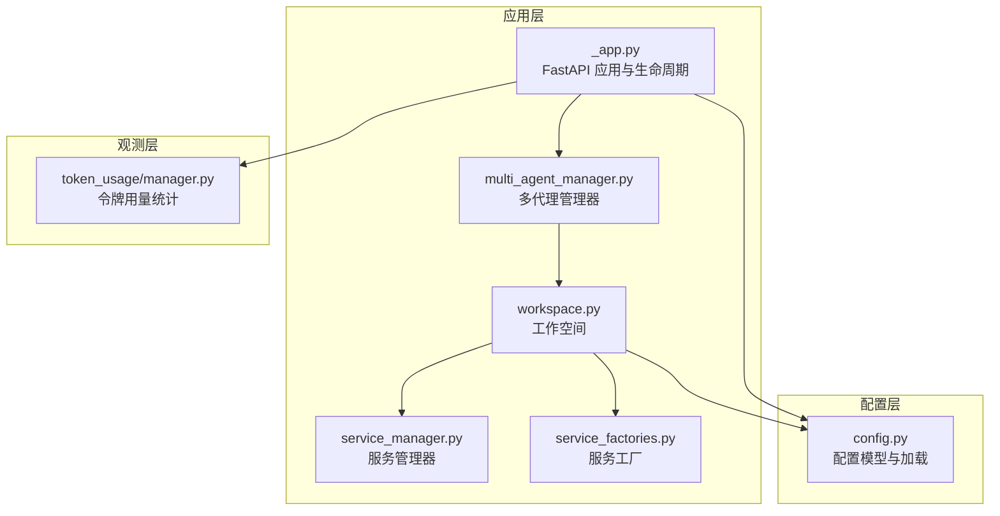
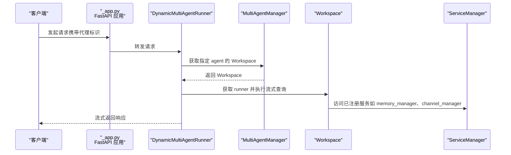
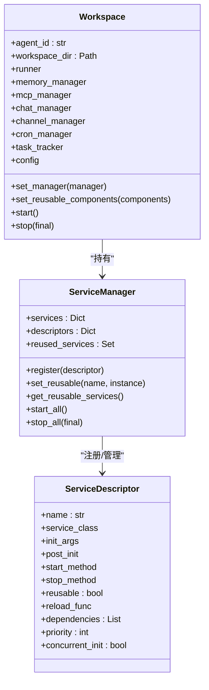
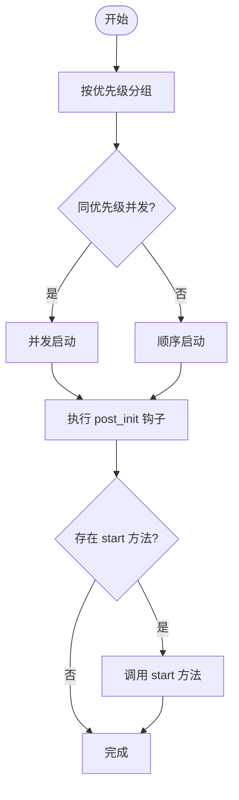
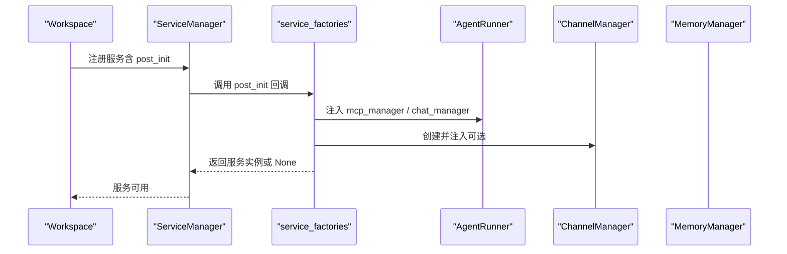
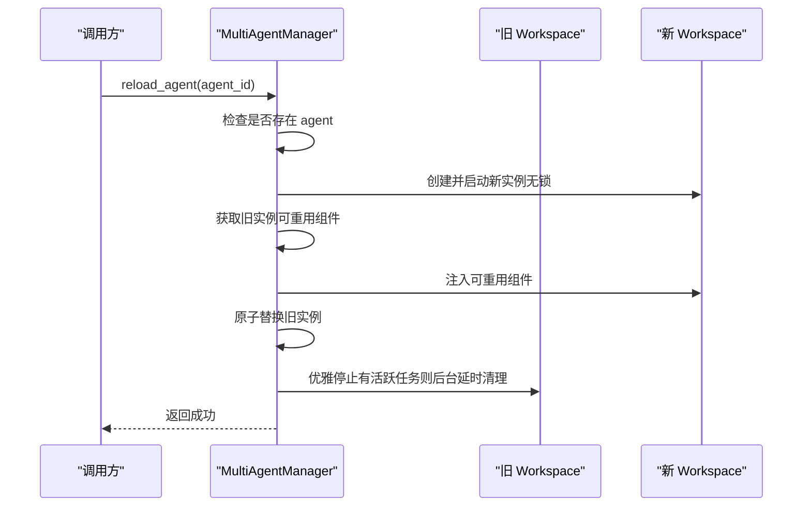
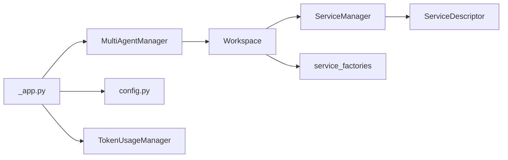

# 工作空间系统

<cite>
**本文引用的文件**
- [src/copaw/app/workspace/workspace.py](file://src/copaw/app/workspace/workspace.py)
- [src/copaw/app/workspace/service_manager.py](file://src/copaw/app/workspace/service_manager.py)
- [src/copaw/app/workspace/service_factories.py](file://src/copaw/app/workspace/service_factories.py)
- [src/copaw/app/multi_agent_manager.py](file://src/copaw/app/multi_agent_manager.py)
- [src/copaw/app/_app.py](file://src/copaw/app/_app.py)
- [src/copaw/config/config.py](file://src/copaw/config/config.py)
- [src/copaw/token_usage/manager.py](file://src/copaw/token_usage/manager.py)
- [tests/unit/workspace/test_workspace.py](file://tests/unit/workspace/test_workspace.py)
</cite>

## 目录
1. [简介](#简介)
2. [项目结构](#项目结构)
3. [核心组件](#核心组件)
4. [架构总览](#架构总览)
5. [详细组件分析](#详细组件分析)
6. [依赖分析](#依赖分析)
7. [性能考虑](#性能考虑)
8. [故障排查指南](#故障排查指南)
9. [结论](#结论)
10. [附录](#附录)

## 简介
本技术文档围绕 CoPaw 的工作空间系统展开，系统性阐述工作空间的架构设计、服务管理器与工厂模式的应用、生命周期管理、服务注册与依赖注入机制、可重用组件管理策略、服务生命周期与资源共享机制、配置管理与环境隔离、资源限制、服务工厂设计模式与动态服务创建、热插拔能力、性能监控与资源使用统计、以及扩展与自定义服务开发规范。目标是帮助开发者在理解现有实现的基础上，安全地进行二次开发与运维。

## 项目结构
工作空间系统位于应用层的 workspace 子模块中，配合多代理管理器（MultiAgentManager）实现多实例的懒加载、零停机热重载与统一生命周期管理；配置系统提供按代理维度的独立配置与运行参数；令牌用量统计模块提供资源消耗的可观测性。

图示来源
- [src/copaw/app/_app.py:149-241](file://src/copaw/app/_app.py#L149-L241)
- [src/copaw/app/multi_agent_manager.py:17-32](file://src/copaw/app/multi_agent_manager.py#L17-L32)
- [src/copaw/app/workspace/workspace.py:39-78](file://src/copaw/app/workspace/workspace.py#L39-L78)
- [src/copaw/app/workspace/service_manager.py:74-91](file://src/copaw/app/workspace/service_manager.py#L74-L91)
- [src/copaw/app/workspace/service_factories.py:18-34](file://src/copaw/app/workspace/service_factories.py#L18-L34)
- [src/copaw/config/config.py:458-517](file://src/copaw/config/config.py#L458-L517)
- [src/copaw/token_usage/manager.py:62-72](file://src/copaw/token_usage/manager.py#L62-L72)

章节来源
- [src/copaw/app/_app.py:149-241](file://src/copaw/app/_app.py#L149-L241)
- [src/copaw/app/multi_agent_manager.py:17-32](file://src/copaw/app/multi_agent_manager.py#L17-L32)
- [src/copaw/app/workspace/workspace.py:39-78](file://src/copaw/app/workspace/workspace.py#L39-L78)
- [src/copaw/app/workspace/service_manager.py:74-91](file://src/copaw/app/workspace/service_manager.py#L74-L91)
- [src/copaw/app/workspace/service_factories.py:18-34](file://src/copaw/app/workspace/service_factories.py#L18-L34)
- [src/copaw/config/config.py:458-517](file://src/copaw/config/config.py#L458-L517)
- [src/copaw/token_usage/manager.py:62-72](file://src/copaw/token_usage/manager.py#L62-L72)

## 核心组件
- 工作空间（Workspace）：封装单个代理的完整运行时，包含 Runner、ChannelManager、MemoryManager、MCPClientManager、CronManager 等，并通过 ServiceManager 统一注册与生命周期管理。
- 服务管理器（ServiceManager）：以 ServiceDescriptor 描述服务元数据，支持并发/顺序初始化、依赖解析、启动/停止方法调用、可重用组件标记与热重载。
- 服务工厂（service_factories）：将复杂的服务装配逻辑抽取为可测试的工厂函数，负责根据配置创建并连接各子系统。
- 多代理管理器（MultiAgentManager）：集中管理多个 Workspace 实例，提供懒加载、零停机热重载、批量启动、清理任务跟踪等能力。
- 配置系统（config.py）：定义代理级配置模型（AgentProfileConfig）、通道配置、MCP 客户端配置、运行时参数等，支持按代理独立配置与加载。
- 令牌用量统计（TokenUsageManager）：提供令牌用量记录与聚合查询，用于资源使用统计与成本控制。

章节来源
- [src/copaw/app/workspace/workspace.py:39-115](file://src/copaw/app/workspace/workspace.py#L39-L115)
- [src/copaw/app/workspace/service_manager.py:74-156](file://src/copaw/app/workspace/service_manager.py#L74-L156)
- [src/copaw/app/workspace/service_factories.py:18-62](file://src/copaw/app/workspace/service_factories.py#L18-L62)
- [src/copaw/app/multi_agent_manager.py:17-82](file://src/copaw/app/multi_agent_manager.py#L17-L82)
- [src/copaw/config/config.py:458-517](file://src/copaw/config/config.py#L458-L517)
- [src/copaw/token_usage/manager.py:62-156](file://src/copaw/token_usage/manager.py#L62-L156)

## 架构总览
工作空间系统采用“声明式服务注册 + 工厂装配 + 动态路由”的架构：
- 声明式注册：Workspace 在初始化时通过 ServiceDescriptor 将各服务注册到 ServiceManager，明确优先级、并发策略、依赖关系与生命周期钩子。
- 工厂装配：通过 service_factories 将配置转换为具体实例并注入到 Runner、ChannelManager、CronManager 等组件中。
- 动态路由：应用层通过 DynamicMultiAgentRunner 按请求头选择对应 Workspace 的 Runner，实现多代理共享同一进程内的动态调度。
- 生命周期：MultiAgentManager 负责实例的创建、启动、停止与零停机热重载，ServiceManager 负责服务粒度的启动/停止与可重用组件复用。

图示来源
- [src/copaw/app/_app.py:49-126](file://src/copaw/app/_app.py#L49-L126)
- [src/copaw/app/multi_agent_manager.py:34-82](file://src/copaw/app/multi_agent_manager.py#L34-L82)
- [src/copaw/app/workspace/workspace.py:79-115](file://src/copaw/app/workspace/workspace.py#L79-L115)
- [src/copaw/app/workspace/service_manager.py:201-229](file://src/copaw/app/workspace/service_manager.py#L201-L229)

## 详细组件分析

### 工作空间（Workspace）
- 角色与职责：封装单个代理的完整运行时，提供服务访问属性、配置加载、启动/停止与可重用组件设置。
- 服务注册：通过 _register_services 使用 ServiceDescriptor 声明式注册 Runner、MemoryManager、MCPClientManager、ChatManager、ChannelManager、CronManager、配置监视器等，明确优先级与并发策略。
- 生命周期：
  - start：加载代理配置，委托 ServiceManager 启动所有服务。
  - stop：委托 ServiceManager 停止服务，支持 final 与非 final 模式（热重载场景跳过可重用组件）。
  - set_reusable_components：在启动前注入可重用组件（如 MemoryManager、ChatManager），避免重建。
- 关键交互：通过 ServiceManager.services 字典访问各服务实例；通过 config 属性延迟加载代理配置。

图示来源
- [src/copaw/app/workspace/workspace.py:39-115](file://src/copaw/app/workspace/workspace.py#L39-L115)
- [src/copaw/app/workspace/workspace.py:134-278](file://src/copaw/app/workspace/workspace.py#L134-L278)
- [src/copaw/app/workspace/service_manager.py:74-156](file://src/copaw/app/workspace/service_manager.py#L74-L156)
- [src/copaw/app/workspace/service_manager.py:30-72](file://src/copaw/app/workspace/service_manager.py#L30-L72)

章节来源
- [src/copaw/app/workspace/workspace.py:39-115](file://src/copaw/app/workspace/workspace.py#L39-L115)
- [src/copaw/app/workspace/workspace.py:134-278](file://src/copaw/app/workspace/workspace.py#L134-L278)
- [src/copaw/app/workspace/workspace.py:311-358](file://src/copaw/app/workspace/workspace.py#L311-L358)

### 服务管理器（ServiceManager）
- 设计要点：
  - ServiceDescriptor：统一描述服务类、初始化参数、后处理钩子、启动/停止方法、可重用性、依赖与优先级、并发初始化策略。
  - 分组与优先级：按 priority 分组，同优先级内可并发，不同优先级按顺序串行。
  - 可重用组件：set_reusable 标记可重用服务并触发 reload_func；stop_all 支持 final=false 跳过可重用组件。
  - 生命周期钩子：_get_or_create_service、_run_post_init、_run_start_method 组成完整的创建-装配-启动流程。
- 并发与错误处理：start_all 对并发服务使用 gather；stop_all 对每个服务使用 gather(return_exceptions=True)，确保一个失败不影响其他服务关闭。

图示来源
- [src/copaw/app/workspace/service_manager.py:158-200](file://src/copaw/app/workspace/service_manager.py#L158-L200)
- [src/copaw/app/workspace/service_manager.py:201-323](file://src/copaw/app/workspace/service_manager.py#L201-L323)

章节来源
- [src/copaw/app/workspace/service_manager.py:74-156](file://src/copaw/app/workspace/service_manager.py#L74-L156)
- [src/copaw/app/workspace/service_manager.py:158-200](file://src/copaw/app/workspace/service_manager.py#L158-L200)
- [src/copaw/app/workspace/service_manager.py:201-323](file://src/copaw/app/workspace/service_manager.py#L201-L323)
- [src/copaw/app/workspace/service_manager.py:324-415](file://src/copaw/app/workspace/service_manager.py#L324-L415)

### 服务工厂（service_factories）
- 职责：将配置转换为具体服务实例并注入到 Runner、ChannelManager、CronManager 等组件中，提升可测试性与可维护性。
- 典型工厂：
  - create_mcp_service：从配置初始化 MCPClientManager 并注入到 Runner。
  - create_chat_service：创建或复用 ChatManager，并注入到 Runner。
  - create_channel_service：按配置创建 ChannelManager，并绑定到 Runner。
  - create_agent_config_watcher / create_mcp_config_watcher：条件性创建配置监视器，监听配置变更。
- 与 Workspace 的协作：这些工厂作为 post_init 回调被 ServiceManager 调用，完成跨组件的连接与装配。

图示来源
- [src/copaw/app/workspace/workspace.py:134-278](file://src/copaw/app/workspace/workspace.py#L134-L278)
- [src/copaw/app/workspace/service_factories.py:18-62](file://src/copaw/app/workspace/service_factories.py#L18-L62)
- [src/copaw/app/workspace/service_factories.py:64-101](file://src/copaw/app/workspace/service_factories.py#L64-L101)
- [src/copaw/app/workspace/service_factories.py:104-163](file://src/copaw/app/workspace/service_factories.py#L104-L163)

章节来源
- [src/copaw/app/workspace/service_factories.py:18-62](file://src/copaw/app/workspace/service_factories.py#L18-L62)
- [src/copaw/app/workspace/service_factories.py:64-101](file://src/copaw/app/workspace/service_factories.py#L64-L101)
- [src/copaw/app/workspace/service_factories.py:104-163](file://src/copaw/app/workspace/service_factories.py#L104-L163)

### 多代理管理器（MultiAgentManager）
- 懒加载：首次请求时才创建并启动 Workspace。
- 零停机热重载：先创建新实例并启动，原子替换旧实例，再优雅停止旧实例（若仍有活跃任务则后台延时清理）。
- 批量启动：并发启动所有已配置的代理，提升启动效率。
- 线程安全：使用 asyncio.Lock 保护并发访问。
- 清理任务跟踪：记录后台延时清理任务，支持统一取消与等待。

图示来源
- [src/copaw/app/multi_agent_manager.py:200-311](file://src/copaw/app/multi_agent_manager.py#L200-L311)
- [src/copaw/app/multi_agent_manager.py:83-179](file://src/copaw/app/multi_agent_manager.py#L83-L179)

章节来源
- [src/copaw/app/multi_agent_manager.py:17-82](file://src/copaw/app/multi_agent_manager.py#L17-L82)
- [src/copaw/app/multi_agent_manager.py:200-311](file://src/copaw/app/multi_agent_manager.py#L200-L311)
- [src/copaw/app/multi_agent_manager.py:338-362](file://src/copaw/app/multi_agent_manager.py#L338-L362)

### 配置管理与环境隔离
- 代理级配置：AgentProfileConfig 存储在工作空间目录下的 agent.json，包含通道、MCP、心跳、运行时参数、语言、工具、安全等。
- 根配置：AgentsConfig 存储在根配置文件中，仅包含代理引用（ID 与工作空间路径）。
- 环境变量：应用启动前将持久化环境变量注入 os.environ，确保子进程与热重载后的一致性。
- 环境隔离：每个代理拥有独立的工作空间目录与配置文件，避免相互影响；通道与 MCP 客户端按代理配置独立初始化。

章节来源
- [src/copaw/config/config.py:458-517](file://src/copaw/config/config.py#L458-L517)
- [src/copaw/config/config.py:519-560](file://src/copaw/config/config.py#L519-L560)
- [src/copaw/app/_app.py:44-46](file://src/copaw/app/_app.py#L44-L46)

### 性能监控与资源使用统计
- 令牌用量统计：TokenUsageManager 提供记录与聚合查询，支持按日期、供应商与模型聚合，输出总计与细分统计。
- 使用建议：在推理与工具调用后记录 prompt_tokens 与 completion_tokens，结合 ProviderManager 进行成本归集与告警。

章节来源
- [src/copaw/token_usage/manager.py:62-156](file://src/copaw/token_usage/manager.py#L62-L156)
- [src/copaw/token_usage/manager.py:198-294](file://src/copaw/token_usage/manager.py#L198-L294)

### 扩展指南与自定义服务开发规范
- 新增服务步骤：
  1) 定义服务类与初始化参数；
  2) 在 Workspace._register_services 中以 ServiceDescriptor 注册，设置 init_args、post_init、start_method、stop_method、priority、concurrent_init、reusable 等；
  3) 如需复用，提供 reload_func 或在 post_init 中处理迁移逻辑；
  4) 在 service_factories 中编写工厂函数（如需），用于从配置创建并装配服务。
- 依赖与优先级：通过 dependencies 与 priority 控制启动顺序与依赖满足；高耦合组件应设置依赖并提高优先级。
- 并发与顺序：对无状态或可并发的服务设置 concurrent_init=True；对需要串行初始化的服务设为 False。
- 错误处理：在 post_init 与 start_method 中捕获异常并记录日志，避免阻塞整体启动。
- 测试：将复杂装配逻辑抽取到工厂函数，便于单元测试与模拟。

章节来源
- [src/copaw/app/workspace/workspace.py:134-278](file://src/copaw/app/workspace/workspace.py#L134-L278)
- [src/copaw/app/workspace/service_manager.py:30-72](file://src/copaw/app/workspace/service_manager.py#L30-L72)
- [src/copaw/app/workspace/service_factories.py:18-62](file://src/copaw/app/workspace/service_factories.py#L18-L62)

## 依赖分析
- 组件耦合：
  - Workspace 强依赖 ServiceManager；通过属性访问各服务实例。
  - ServiceManager 依赖 ServiceDescriptor 描述符与工厂回调；不直接依赖具体服务类，提升解耦。
  - MultiAgentManager 依赖 Workspace 与配置系统；通过懒加载与原子替换实现零停机。
  - 应用层通过 DynamicMultiAgentRunner 间接依赖 MultiAgentManager 与 Workspace。
- 外部依赖：
  - FastAPI 应用生命周期与中间件；
  - ProviderManager（全局非重用）；
  - 配置加载与持久化（config.py）。

图示来源
- [src/copaw/app/multi_agent_manager.py:17-32](file://src/copaw/app/multi_agent_manager.py#L17-L32)
- [src/copaw/app/workspace/workspace.py:39-78](file://src/copaw/app/workspace/workspace.py#L39-L78)
- [src/copaw/app/workspace/service_manager.py:74-91](file://src/copaw/app/workspace/service_manager.py#L74-L91)
- [src/copaw/app/_app.py:149-241](file://src/copaw/app/_app.py#L149-L241)
- [src/copaw/config/config.py:458-517](file://src/copaw/config/config.py#L458-L517)
- [src/copaw/token_usage/manager.py:62-72](file://src/copaw/token_usage/manager.py#L62-L72)

章节来源
- [src/copaw/app/multi_agent_manager.py:17-32](file://src/copaw/app/multi_agent_manager.py#L17-L32)
- [src/copaw/app/workspace/workspace.py:39-78](file://src/copaw/app/workspace/workspace.py#L39-L78)
- [src/copaw/app/workspace/service_manager.py:74-91](file://src/copaw/app/workspace/service_manager.py#L74-L91)
- [src/copaw/app/_app.py:149-241](file://src/copaw/app/_app.py#L149-L241)
- [src/copaw/config/config.py:458-517](file://src/copaw/config/config.py#L458-L517)
- [src/copaw/token_usage/manager.py:62-72](file://src/copaw/token_usage/manager.py#L62-L72)

## 性能考虑
- 启动性能：
  - 同优先级并发初始化：ServiceManager 对 concurrent=true 的服务使用 asyncio.gather 并发启动，显著缩短启动时间。
  - 批量启动：MultiAgentManager 并发启动所有已配置代理，减少冷启动开销。
- 运行时性能：
  - 零停机热重载：通过可重用组件（MemoryManager、ChatManager 等）避免重建，降低切换延迟。
  - 动态路由：DynamicMultiAgentRunner 按请求头选择 Runner，避免重复创建实例。
- 资源控制：
  - 令牌用量统计：通过 TokenUsageManager 记录与聚合，辅助成本控制与资源上限设定。
  - 配置参数：AgentsRunningConfig 提供最大迭代次数、重试策略、内存压缩阈值等，平衡性能与稳定性。

章节来源
- [src/copaw/app/workspace/service_manager.py:171-200](file://src/copaw/app/workspace/service_manager.py#L171-L200)
- [src/copaw/app/multi_agent_manager.py:399-445](file://src/copaw/app/multi_agent_manager.py#L399-L445)
- [src/copaw/app/_app.py:49-126](file://src/copaw/app/_app.py#L49-L126)
- [src/copaw/config/config.py:275-417](file://src/copaw/config/config.py#L275-L417)
- [src/copaw/token_usage/manager.py:110-156](file://src/copaw/token_usage/manager.py#L110-L156)

## 故障排查指南
- 启动失败：
  - 检查 Workspace.start 是否抛出异常并触发 stop 清理；查看 ServiceManager.start_all 的异常日志。
  - 确认 ServiceDescriptor 的 init_args、post_init、start_method 是否正确配置。
- 停止异常：
  - ServiceManager.stop_all 对每个服务使用 gather(return_exceptions=True，确保单个服务停止失败不影响整体关闭。
  - 若出现可重用组件未停止，确认 final 参数是否为 True。
- 配置变更：
  - 若启用配置监视器（AgentConfigWatcher、MCPConfigWatcher），检查其 start/stop 行为与配置加载回调。
- 热重载问题：
  - 确认 MultiAgentManager 在替换前后均正确获取可重用组件；检查 _graceful_stop_old_instance 的延时清理任务是否完成。
- 单元测试参考：
  - 测试工作空间创建、组件在启动前为 None、默认代理与短 UUID 代理等行为。

章节来源
- [src/copaw/app/workspace/workspace.py:311-358](file://src/copaw/app/workspace/workspace.py#L311-L358)
- [src/copaw/app/workspace/service_manager.py:324-415](file://src/copaw/app/workspace/service_manager.py#L324-L415)
- [src/copaw/app/workspace/service_factories.py:104-163](file://src/copaw/app/workspace/service_factories.py#L104-L163)
- [src/copaw/app/multi_agent_manager.py:83-179](file://src/copaw/app/multi_agent_manager.py#L83-L179)
- [tests/unit/workspace/test_workspace.py:8-97](file://tests/unit/workspace/test_workspace.py#L8-L97)

## 结论
工作空间系统通过声明式服务注册、工厂装配与统一服务管理，实现了多代理的高效、稳定与可扩展运行。配合多代理管理器的懒加载与零停机热重载，以及配置与令牌用量统计的可观测性，为生产环境提供了可靠的基础设施。遵循本文的扩展与开发规范，可在不破坏现有生命周期的前提下，安全地引入新的服务与功能。

## 附录
- 关键流程图（启动/停止/热重载）已在前述章节中给出，读者可据此快速定位实现位置与调用链。
- 测试文件可用于验证工作空间的基本行为与边界条件。